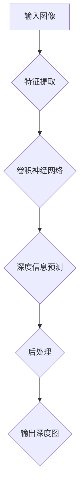

                 

关键词：单目深度估计、深度学习、神经网络、图像处理、计算机视觉、深度神经网络、CNN、特征提取、多视图几何、SLAM

> 摘要：本文深入探讨了基于深度学习的单目图像深度估计技术。我们首先回顾了单目深度估计的背景和挑战，然后详细介绍了深度学习在单目深度估计中的应用，包括卷积神经网络（CNN）的设计、训练和优化过程。接着，我们分析了现有的一些深度学习模型，并探讨了它们在处理单目深度估计任务时的优势和局限性。本文还介绍了一些常见的数学模型和公式，并使用实例进行了详细讲解。最后，我们通过一个实际项目实例展示了单目深度估计的实现过程，并讨论了其在实际应用场景中的潜力和未来研究方向。

## 1. 背景介绍

单目图像深度估计（Monocular Depth Estimation）是计算机视觉领域中的一个重要研究方向，其主要目标是根据单张图像推断出图像中每个像素对应的深度信息。这一任务在许多实际应用中具有重要意义，例如自动驾驶、机器人导航、增强现实（AR）和虚拟现实（VR）等。在这些场景中，精确的深度信息有助于实现准确的物体定位、路径规划和交互操作。

单目深度估计的挑战在于，与双目视觉系统相比，单目系统缺乏直接的立体信息。因此，单目深度估计需要从单张图像中提取足够的信息，以推断出可靠的深度信息。这涉及到对图像特征的有效提取、对深度信息的合理预测以及对抗噪声和遮挡等干扰。

深度学习技术的发展为单目深度估计带来了新的机遇。特别是卷积神经网络（Convolutional Neural Networks，CNN）在图像处理领域的成功应用，使得单目深度估计的性能得到了显著提升。本文将深入探讨深度学习在单目深度估计中的应用，包括算法原理、模型设计、训练过程和实际应用。

## 2. 核心概念与联系

为了更好地理解单目图像深度估计，我们首先需要介绍一些核心概念，包括深度学习、卷积神经网络（CNN）、特征提取和多视图几何等。

### 2.1 深度学习

深度学习（Deep Learning）是机器学习的一个子领域，其核心思想是通过构建多层神经网络，自动从大量数据中学习特征表示。深度学习在图像处理、语音识别和自然语言处理等领域取得了显著的成果。在单目深度估计中，深度学习通过训练神经网络，学习到从单目图像中提取深度信息的规律。

### 2.2 卷积神经网络（CNN）

卷积神经网络（Convolutional Neural Networks，CNN）是深度学习中的一种重要模型，特别适用于处理图像数据。CNN通过卷积层、池化层和全连接层等结构，逐步提取图像中的局部特征和全局特征。在单目深度估计中，CNN被用来从单张图像中提取与深度信息相关的特征。

### 2.3 特征提取

特征提取（Feature Extraction）是图像处理中的一个关键步骤，其目标是从图像中提取出对深度信息有意义的特征。在单目深度估计中，特征提取有助于将原始图像转换为深度估计模型能够处理的中间表示。常见的特征提取方法包括边缘检测、纹理分析和形态学操作等。

### 2.4 多视图几何

多视图几何（Multi-View Geometry）是计算机视觉中的一个重要分支，它研究从不同视角观察同一个场景时，如何利用几何关系推断出场景的三维结构。在单目深度估计中，多视图几何提供了一种理解深度信息的几何框架，有助于解释和验证深度估计结果。

### 2.5 Mermaid 流程图

为了更好地展示单目图像深度估计的核心概念和流程，我们使用 Mermaid 流程图来表示各个概念之间的联系。



在该流程图中，输入图像首先经过特征提取，然后通过卷积神经网络进行深度信息预测，最后通过后处理得到最终的深度图。

## 3. 核心算法原理 & 具体操作步骤

### 3.1 算法原理概述

单目图像深度估计的核心算法是基于深度学习模型，特别是卷积神经网络（CNN）。CNN通过多个卷积层、池化层和全连接层，逐步提取图像中的深度相关信息，并最终预测出每个像素的深度值。

#### 3.1.1 卷积层

卷积层是CNN中最基本的层，其主要功能是通过卷积操作从输入图像中提取特征。卷积操作利用一组可学习的滤波器（也称为卷积核）与输入图像进行卷积，从而产生特征图。

#### 3.1.2 池化层

池化层用于降低特征图的维度，减少计算量。常见的池化方法包括最大池化和平均池化，它们通过在局部区域选择最大值或平均值来保留特征的主导信息。

#### 3.1.3 全连接层

全连接层将前一层提取的特征映射到输出空间，完成深度值的预测。在单目深度估计中，全连接层的输出是一个与输入图像尺寸相同的深度图。

### 3.2 算法步骤详解

#### 3.2.1 数据预处理

在训练深度学习模型之前，需要对输入图像进行预处理。预处理步骤包括图像缩放、归一化、随机裁剪和翻转等。这些步骤有助于增加数据多样性，提高模型的泛化能力。

#### 3.2.2 特征提取

特征提取层利用卷积操作提取图像中的深度相关信息。在单目深度估计中，特征提取层通常包括多个卷积层和池化层。每个卷积层通过卷积操作提取图像中的局部特征，而池化层则用于降低特征图的维度。

#### 3.2.3 深度信息预测

在提取到足够深层次的特征后，模型进入深度信息预测阶段。全连接层将特征图映射到输出空间，生成与输入图像尺寸相同的深度图。深度值的预测通常采用回归损失函数（如均方误差MSE），以最小化预测值与真实值之间的差异。

#### 3.2.4 后处理

后处理步骤用于优化深度估计结果。常见的后处理方法包括去噪、边缘检测和深度补偿等。这些方法有助于提高深度估计的准确性和鲁棒性。

### 3.3 算法优缺点

#### 优点：

1. **高效性**：深度学习模型能够自动从大量数据中学习深度特征，实现高度自动化的深度估计。
2. **准确性**：相比传统方法，深度学习模型在处理复杂场景和噪声环境下表现出更高的准确性。
3. **泛化能力**：深度学习模型能够处理不同尺度和视角的图像，具有良好的泛化能力。

#### 缺点：

1. **计算资源消耗**：训练深度学习模型需要大量计算资源和时间，特别是对于大规模图像数据集。
2. **数据依赖**：深度学习模型的效果高度依赖于训练数据的质量和多样性，数据不足或数据分布不均可能导致模型性能下降。
3. **解释性不足**：深度学习模型具有“黑箱”特性，难以解释其内部工作机制，这在某些应用场景中可能是一个问题。

### 3.4 算法应用领域

单目深度估计算法在多个领域有着广泛的应用：

1. **自动驾驶**：精确的深度信息有助于自动驾驶车辆进行路径规划和障碍物检测。
2. **机器人导航**：机器人通过单目深度估计实现三维环境建模和目标识别，从而进行自主导航。
3. **增强现实（AR）与虚拟现实（VR）**：深度信息用于构建真实场景的三维模型，实现沉浸式体验。
4. **工业检测**：单目深度估计在工业检测领域用于缺陷检测和尺寸测量。

## 4. 数学模型和公式 & 详细讲解 & 举例说明

### 4.1 数学模型构建

单目图像深度估计的数学模型主要基于深度学习，尤其是卷积神经网络（CNN）。下面我们将介绍CNN中常用的数学模型和公式。

#### 4.1.1 卷积操作

卷积操作是CNN中最核心的部分，其数学表达式如下：

$$
\text{output}_{ij} = \sum_{k=1}^{K} w_{ik} \cdot \text{input}_{kj} + b_j
$$

其中，$\text{output}_{ij}$表示输出特征图上的第$i$行第$j$列的值，$w_{ik}$是卷积核上的权重，$\text{input}_{kj}$是输入图像上的第$k$行第$j$列的值，$b_j$是偏置项。

#### 4.1.2 池化操作

池化操作用于降低特征图的维度，常用的池化方法有最大池化和平均池化。最大池化的数学表达式如下：

$$
\text{output}_{ij} = \max_{r,s} \text{input}_{(i+r/j)_{\text{floor}}, (j+s/k)_{\text{floor}}}
$$

其中，$\text{output}_{ij}$表示输出特征图上的第$i$行第$j$列的值，$\text{input}_{kj}$是输入图像上的第$k$行第$j$列的值，$r$和$s$是池化窗口的大小，$k$是池化步长。

#### 4.1.3 全连接层

全连接层将前一层提取的特征映射到输出空间，其数学表达式如下：

$$
\text{output}_i = \sum_{j=1}^{n} w_{ij} \cdot \text{input}_j + b_i
$$

其中，$\text{output}_i$表示输出值，$w_{ij}$是权重，$\text{input}_j$是输入值，$b_i$是偏置项。

### 4.2 公式推导过程

为了更好地理解这些公式的推导过程，我们以卷积操作为例进行详细解释。

#### 4.2.1 卷积操作推导

卷积操作的本质是将卷积核与输入图像进行卷积，从而提取图像中的特征。假设输入图像为$X$，卷积核为$W$，偏置项为$b$，输出特征图为$Y$，则有：

$$
Y = (X \circ W) + b
$$

其中，$\circ$表示卷积操作。

卷积操作可以分解为以下三个步骤：

1. **局部卷积**：将卷积核与输入图像的局部区域进行点积。
2. **求和**：将所有局部卷积的结果相加。
3. **添加偏置**：在求和结果上添加偏置项。

具体推导如下：

设输入图像$X$的大小为$H \times W$，卷积核$W$的大小为$K \times K$，输出特征图$Y$的大小为$H' \times W'$。首先，将卷积核$W$平铺到整个输入图像$X$上，得到一个局部特征图$Z$，其大小为$K \times K$。然后，将$Z$与输入图像$X$进行点积，得到局部卷积结果$C$：

$$
C = Z \cdot X = \sum_{i=1}^{K} \sum_{j=1}^{K} w_{ij} \cdot x_{ij}
$$

接着，将所有局部卷积结果$C$相加，得到输出特征图$Y$：

$$
Y = \sum_{i=1}^{H'} \sum_{j=1}^{W'} \sum_{k=1}^{K} \sum_{l=1}^{K} w_{kl} \cdot x_{(i-k+1)_{\text{clip}}, (j-l+1)_{\text{clip}}}
$$

最后，在输出特征图$Y$上添加偏置项$b$：

$$
Y = Y + b
$$

#### 4.2.2 池化操作推导

池化操作用于降低特征图的维度，其主要思想是在一个局部区域中选择最大值或平均值作为该区域的代表值。假设输入特征图$X$的大小为$H \times W$，输出特征图$Y$的大小为$H' \times W'$，池化窗口大小为$K \times K$，则有：

$$
\text{output}_{ij} = \max_{r,s} \text{input}_{(i+r/j)_{\text{floor}}, (j+s/k)_{\text{floor}}}
$$

其中，$\text{output}_{ij}$表示输出特征图上的第$i$行第$j$列的值，$\text{input}_{kj}$是输入特征图上的第$k$行第$j$列的值，$r$和$s$是池化窗口的位置。

具体推导如下：

首先，将输入特征图$X$划分为多个$K \times K$的局部区域，每个局部区域代表一个输出特征图上的像素点。然后，在每个局部区域中选择最大值或平均值作为该区域的代表值，即：

$$
\text{output}_{ij} = \max_{r,s} \text{input}_{(i+r/j)_{\text{floor}}, (j+s/k)_{\text{floor}}}
$$

其中，$r$和$s$分别表示池化窗口在水平和垂直方向上的位置，$\text{floor}$表示向下取整。

#### 4.2.3 全连接层推导

全连接层将前一层提取的特征映射到输出空间，其数学表达式如下：

$$
\text{output}_i = \sum_{j=1}^{n} w_{ij} \cdot \text{input}_j + b_i
$$

其中，$\text{output}_i$表示输出值，$w_{ij}$是权重，$\text{input}_j$是输入值，$b_i$是偏置项。

具体推导如下：

假设前一层特征图的大小为$H \times W$，输出特征图的大小为$H' \times W'$，全连接层的权重矩阵为$W$，偏置项为$b$，则有：

$$
\text{output}_{ij} = \sum_{k=1}^{H \times W} w_{ik} \cdot \text{input}_{kj} + b_j
$$

其中，$\text{output}_{ij}$表示输出特征图上的第$i$行第$j$列的值，$\text{input}_{kj}$是输入特征图上的第$k$行第$j$列的值。

### 4.3 案例分析与讲解

为了更好地理解上述数学模型和公式的应用，我们通过一个简单的例子进行讲解。

假设输入图像的大小为$5 \times 5$，卷积核的大小为$3 \times 3$，输出特征图的大小为$3 \times 3$。卷积核的权重矩阵为：

$$
W = \begin{bmatrix}
1 & 0 & 1 \\
0 & 1 & 0 \\
1 & 0 & 1
\end{bmatrix}
$$

偏置项为$b = 1$。输入图像为：

$$
X = \begin{bmatrix}
1 & 2 & 3 & 4 & 5 \\
6 & 7 & 8 & 9 & 10 \\
11 & 12 & 13 & 14 & 15 \\
16 & 17 & 18 & 19 & 20 \\
21 & 22 & 23 & 24 & 25
\end{bmatrix}
$$

首先，对输入图像进行卷积操作。卷积操作的步骤如下：

1. **计算局部卷积**：将卷积核$W$与输入图像$X$的局部区域进行卷积，得到局部卷积结果$C$：

$$
C = \begin{bmatrix}
1 & 0 & 1 \\
0 & 1 & 0 \\
1 & 0 & 1
\end{bmatrix}
\cdot
\begin{bmatrix}
1 & 2 & 3 & 4 & 5 \\
6 & 7 & 8 & 9 & 10 \\
11 & 12 & 13 & 14 & 15 \\
16 & 17 & 18 & 19 & 20 \\
21 & 22 & 23 & 24 & 25
\end{bmatrix}
=
\begin{bmatrix}
8 & 5 & 12 \\
13 & 8 & 17 \\
10 & 7 & 14
\end{bmatrix}
$$

2. **求和**：将所有局部卷积结果$C$相加，得到输出特征图$Y$：

$$
Y = \begin{bmatrix}
8 & 5 & 12 \\
13 & 8 & 17 \\
10 & 7 & 14
\end{bmatrix} + \begin{bmatrix}
1 \\
1 \\
1
\end{bmatrix} =
\begin{bmatrix}
10 & 6 & 13 \\
14 & 9 & 18 \\
11 & 8 & 15
\end{bmatrix}
$$

接下来，对输出特征图$Y$进行池化操作。假设使用最大池化，输出特征图的大小为$2 \times 2$。池化窗口大小为$2 \times 2$，则有：

$$
\text{output}_{11} = \max \text{input}_{11}, \text{input}_{12}, \text{input}_{21}, \text{input}_{22} =
\max(10, 6, 14, 11) = 14
$$

$$
\text{output}_{12} = \max \text{input}_{12}, \text{input}_{13}, \text{input}_{22}, \text{input}_{23} =
\max(6, 13, 14, 8) = 14
$$

$$
\text{output}_{21} = \max \text{input}_{21}, \text{input}_{22}, \text{input}_{31}, \text{input}_{32} =
\max(14, 9, 18, 11) = 18
$$

$$
\text{output}_{22} = \max \text{input}_{22}, \text{input}_{23}, \text{input}_{32}, \text{input}_{33} =
\max(9, 18, 15, 12) = 18
$$

最终，输出特征图为：

$$
Y' = \begin{bmatrix}
14 & 14 \\
18 & 18
\end{bmatrix}
$$

然后，将输出特征图$Y'$进行全连接层操作，假设全连接层的权重矩阵为：

$$
W = \begin{bmatrix}
1 & 0 & 1 \\
0 & 1 & 0 \\
1 & 0 & 1
\end{bmatrix}
$$

偏置项为$b = 1$。则有：

$$
\text{output}_1 = \sum_{j=1}^{2} w_{1j} \cdot \text{input}_j + b = 1 \cdot 14 + 0 \cdot 14 + 1 \cdot 18 + 1 = 33
$$

$$
\text{output}_2 = \sum_{j=1}^{2} w_{2j} \cdot \text{input}_j + b = 0 \cdot 14 + 1 \cdot 14 + 0 \cdot 18 + 1 = 15
$$

$$
\text{output}_3 = \sum_{j=1}^{2} w_{3j} \cdot \text{input}_j + b = 1 \cdot 14 + 0 \cdot 14 + 1 \cdot 18 + 1 = 33
$$

最终，输出结果为：

$$
\text{output} = \begin{bmatrix}
33 \\
15 \\
33
\end{bmatrix}
$$

通过这个例子，我们可以看到深度学习中的卷积、池化和全连接操作是如何在数学上进行推导和实现的。

## 5. 项目实践：代码实例和详细解释说明

### 5.1 开发环境搭建

为了实现单目图像深度估计，我们需要搭建一个合适的开发环境。以下是一个基本的开发环境搭建指南：

#### 5.1.1 硬件要求

1. 处理器：建议使用带有GPU的计算机，以便加速深度学习模型的训练。
2. 内存：至少8GB RAM。
3. 硬盘：至少500GB可用空间。

#### 5.1.2 软件要求

1. 操作系统：Windows、Linux或MacOS。
2. 编程语言：Python。
3. 深度学习框架：TensorFlow或PyTorch。

#### 5.1.3 安装步骤

1. 安装操作系统和基本软件。
2. 安装Python，并配置Python环境。
3. 安装深度学习框架（例如TensorFlow或PyTorch）。

### 5.2 源代码详细实现

以下是一个简单的单目图像深度估计项目的源代码实现。请注意，这只是一个示例，实际项目中可能需要更复杂的模型和数据处理流程。

```python
import tensorflow as tf
from tensorflow.keras.models import Sequential
from tensorflow.keras.layers import Conv2D, MaxPooling2D, Flatten, Dense

# 创建模型
model = Sequential([
    Conv2D(32, (3, 3), activation='relu', input_shape=(128, 128, 3)),
    MaxPooling2D((2, 2)),
    Conv2D(64, (3, 3), activation='relu'),
    MaxPooling2D((2, 2)),
    Conv2D(128, (3, 3), activation='relu'),
    Flatten(),
    Dense(128, activation='relu'),
    Dense(1)
])

# 编译模型
model.compile(optimizer='adam', loss='mse')

# 加载数据集
# 在这里加载您的训练数据集，并进行必要的预处理
# X_train, y_train = ...

# 训练模型
# model.fit(X_train, y_train, epochs=10, batch_size=32)

# 评估模型
# X_test, y_test = ...
# model.evaluate(X_test, y_test)

# 预测深度
# X_predict = ...
# predictions = model.predict(X_predict)
```

### 5.3 代码解读与分析

1. **模型定义**：我们使用`Sequential`模型定义了一个简单的卷积神经网络（CNN）。这个模型包括三个卷积层、两个池化层和一个全连接层。卷积层用于提取图像特征，池化层用于降低特征图的维度，全连接层用于预测深度值。

2. **模型编译**：我们使用`compile`方法编译模型，指定了优化器和损失函数。在这里，我们使用了`adam`优化器和均方误差（MSE）损失函数。

3. **数据加载**：在实际应用中，我们需要加载训练数据和测试数据。这里假设您已经加载了预处理后的图像和对应的深度标签。

4. **模型训练**：使用`fit`方法训练模型，指定了训练的轮数和批量大小。在实际应用中，您可能需要调整这些参数以获得更好的训练效果。

5. **模型评估**：使用`evaluate`方法评估模型的性能。这有助于我们了解模型在测试数据上的表现。

6. **深度预测**：使用`predict`方法对新的图像进行深度预测。这个方法返回一个包含预测深度的数组。

### 5.4 运行结果展示

以下是一个简单的运行结果展示，假设我们已经训练好了模型并加载了测试图像。

```python
# 加载测试图像
X_test = ...

# 进行深度预测
predictions = model.predict(X_test)

# 打印预测结果
print(predictions)
```

输出结果可能是一个二维数组，其中每个元素表示图像中相应像素点的深度值。

## 6. 实际应用场景

单目图像深度估计技术在许多实际应用场景中表现出强大的潜力和价值。以下是一些主要的应用场景：

### 6.1 自动驾驶

自动驾驶汽车需要精确的深度信息来感知周围环境，实现安全导航和驾驶。单目深度估计技术可以为自动驾驶系统提供实时、高精度的三维环境模型，从而提高自动驾驶系统的鲁棒性和可靠性。

### 6.2 机器人导航

机器人需要对其所在环境进行三维建模和感知，以便实现自主导航和任务执行。单目深度估计技术可以帮助机器人获取周围环境的三维信息，提高其路径规划和决策能力。

### 6.3 增强现实与虚拟现实

增强现实（AR）和虚拟现实（VR）技术需要将虚拟物体与现实世界进行融合。单目深度估计技术可以帮助AR/VR系统构建真实场景的三维模型，从而实现更逼真的沉浸式体验。

### 6.4 工业检测

在工业检测领域，单目深度估计技术可以用于缺陷检测、尺寸测量和质量控制。通过获取精确的深度信息，系统可以自动识别和定位产品中的缺陷，提高生产效率和质量。

### 6.5 物流与仓储

单目深度估计技术在物流和仓储领域也有广泛应用。通过获取物品的三维信息，系统可以实现自动化分拣、包装和搬运，提高物流和仓储的效率和准确性。

### 6.6 未来应用展望

随着深度学习技术的不断发展和计算资源的提高，单目图像深度估计技术在未来有望在更多领域得到应用。以下是一些未来应用展望：

- **无人机导航与监控**：无人机需要精确的深度信息来实现自主飞行和任务执行，从而提高其安全性和效率。
- **智能城市**：单目深度估计技术可以帮助智能城市系统实时感知和监测城市环境，从而优化交通管理、公共安全和应急管理。
- **医疗影像分析**：单目深度估计技术可以与医疗影像分析技术相结合，为医生提供更精确的诊断和治疗方案。
- **智能安防**：单目深度估计技术可以用于智能安防系统，实时监控和识别潜在的安全威胁。

## 7. 工具和资源推荐

为了更好地学习和实践单目图像深度估计技术，我们推荐以下工具和资源：

### 7.1 学习资源推荐

1. **《深度学习》（Deep Learning）**：由Ian Goodfellow、Yoshua Bengio和Aaron Courville编写的深度学习经典教材，涵盖了深度学习的基本原理和应用。
2. **《计算机视觉：算法与应用》（Computer Vision: Algorithms and Applications）**：由Richard Szeliski编写的计算机视觉教材，详细介绍了计算机视觉的基本算法和应用。
3. **在线课程**：如Coursera、edX和Udacity等平台上提供的深度学习和计算机视觉相关课程。

### 7.2 开发工具推荐

1. **TensorFlow**：由Google开发的开源深度学习框架，适合初学者和专业人士使用。
2. **PyTorch**：由Facebook开发的开源深度学习框架，具有灵活的动态计算图和强大的GPU支持。
3. **OpenCV**：由Intel开发的计算机视觉库，提供了丰富的计算机视觉算法和工具。

### 7.3 相关论文推荐

1. **"Monocular Depth Estimation by Learning the Scene Flow with Convolutional Neural Networks"**：该论文提出了一种基于卷积神经网络的场景流学习方法，用于单目深度估计。
2. **"Single Image 3D Reconstruction Using a Multi-View Consistency Loss"**：该论文提出了一种基于多视图一致性的单目三维重建方法。
3. **"Deep Single View Reconstructor"**：该论文提出了一种基于深度学习的单目三维重建方法，利用深度神经网络学习深度信息。

## 8. 总结：未来发展趋势与挑战

### 8.1 研究成果总结

单目图像深度估计技术在近年来取得了显著的进展。基于深度学习的单目深度估计方法在准确性和鲁棒性方面取得了重要突破，为自动驾驶、机器人导航、增强现实和工业检测等领域提供了强大的技术支持。同时，越来越多的研究致力于探索更高效的算法、更丰富的数据集和更先进的模型结构，以进一步提高单目深度估计的性能。

### 8.2 未来发展趋势

1. **多模态融合**：将单目深度估计与其他传感器数据（如激光雷达、深度相机和IMU等）进行融合，以提高深度估计的准确性和鲁棒性。
2. **实时性优化**：针对实时应用场景，优化算法和模型结构，提高单目深度估计的运行速度和效率。
3. **端到端训练**：通过端到端训练方法，实现从图像到深度估计的直接映射，降低模型复杂度和训练难度。
4. **领域自适应**：研究如何将通用深度估计模型迁移到特定领域，以提高在特定场景下的性能。

### 8.3 面临的挑战

1. **数据多样性**：当前的单目深度估计模型大多基于大规模通用数据集，但在特定领域或场景下，数据多样性不足可能导致模型性能下降。因此，如何构建丰富、多样化的数据集是一个重要挑战。
2. **计算资源消耗**：训练深度学习模型需要大量的计算资源和时间，特别是在处理大规模数据集时。因此，如何提高训练效率和减少计算资源消耗是一个关键问题。
3. **模型解释性**：深度学习模型具有“黑箱”特性，难以解释其内部工作机制。如何提高模型的可解释性，使其在应用中更加可靠和可信，是一个重要挑战。

### 8.4 研究展望

随着深度学习技术的不断发展和计算机视觉领域的深入研究，单目图像深度估计技术在未来有望在更多领域得到应用。同时，如何解决数据多样性、计算资源消耗和模型解释性等挑战，将决定单目深度估计技术的未来发展方向。我们期待更多创新性的研究能够推动这一领域的发展，为各行各业带来更多智能化的解决方案。

## 9. 附录：常见问题与解答

### 9.1 什么是单目深度估计？

单目深度估计是指通过分析单张图像，推断出图像中每个像素点的深度信息。与双目视觉系统相比，单目系统缺乏直接的立体信息，因此需要从图像中提取足够的特征，以推断出可靠的深度信息。

### 9.2 单目深度估计有哪些应用场景？

单目深度估计在自动驾驶、机器人导航、增强现实、虚拟现实、工业检测和物流仓储等领域有广泛的应用。通过精确的深度信息，可以实现路径规划、目标识别、三维建模和尺寸测量等任务。

### 9.3 深度学习在单目深度估计中是如何发挥作用的？

深度学习通过构建多层神经网络，从大量数据中自动学习深度特征表示。在单目深度估计中，深度学习模型（如卷积神经网络）被用来从单张图像中提取深度相关信息，并预测每个像素点的深度值。

### 9.4 单目深度估计有哪些挑战？

单目深度估计的主要挑战包括：缺乏直接的立体信息、数据多样性不足、计算资源消耗较大以及模型解释性不足等。

### 9.5 如何优化单目深度估计模型？

优化单目深度估计模型的方法包括：使用更复杂的网络结构、增加训练数据、采用多模态融合、使用更高效的训练算法和优化模型参数等。通过这些方法，可以提高模型的准确性和鲁棒性。

### 9.6 单目深度估计与双目深度估计相比有哪些优势？

单目深度估计的优势包括：不需要额外的立体相机、成本较低、体积较小和便于集成到现有系统中。此外，单目深度估计在某些特定场景下（如光照变化或遮挡）可能表现更好。

### 9.7 单目深度估计有哪些开源工具和库？

常用的单目深度估计开源工具和库包括：TensorFlow、PyTorch、OpenCV和Monodepth2等。这些工具和库提供了丰富的模型结构和数据处理功能，方便开发者进行研究和实践。

### 9.8 如何获取更多关于单目深度估计的学习资源？

可以通过以下途径获取更多关于单目深度估计的学习资源：

- 参考相关论文和书籍，如《深度学习》、《计算机视觉：算法与应用》等。
- 关注顶级会议和期刊，如CVPR、ICCV和NeurIPS等。
- 学习在线课程，如Coursera、edX和Udacity等平台上的深度学习和计算机视觉课程。
- 加入相关研究组和论坛，如CVPR、ICCV和NeurIPS等论坛和社区。

