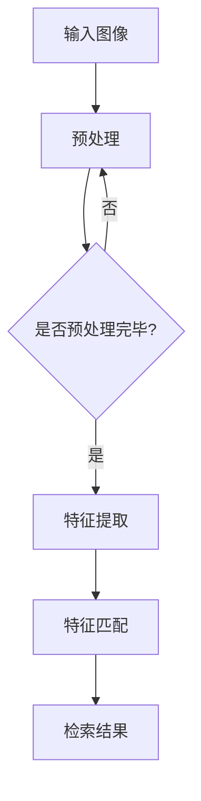

                 

 在信息时代，图像数据以其直观性和丰富的信息量成为了数据存储和通信的主要形式。然而，随着图像数据的爆炸性增长，如何快速、准确地检索到用户需要的图像信息成为了一个重要且具有挑战性的问题。基于深度学习的图像检索技术，凭借其强大的特征提取和相似性匹配能力，正在引领图像检索领域的发展。本文将深入探讨基于深度学习的图像检索技术，包括其背景介绍、核心概念与联系、核心算法原理、数学模型与公式、项目实践、实际应用场景、未来应用展望以及面临的挑战和研究展望。

## 1. 背景介绍

图像检索系统是一个旨在帮助用户在庞大的图像库中快速找到与其需求相关的图像的工具。传统的图像检索系统主要依赖于手工特征提取和基于关键词的文本匹配。这些方法虽然在某些特定场景下具有一定的效果，但随着图像库的增大和图像内容的复杂度增加，其检索效率和准确性逐渐下降。

近年来，深度学习技术的发展为图像检索带来了新的契机。深度学习能够自动从大量的图像数据中学习到丰富的特征表示，使得图像检索不仅能够基于图像内容的相似性进行匹配，还能够捕捉到图像中的高级语义信息。这使得基于深度学习的图像检索技术在提高检索效率和准确性方面具有显著优势。

## 2. 核心概念与联系

### 2.1 深度学习的特征提取

深度学习中的特征提取是通过多层神经网络（如卷积神经网络（CNN））来实现的。CNN 通过卷积操作、池化操作和全连接层，逐层提取图像的局部特征和全局特征。这些特征不仅能够有效地表示图像的内容，还能够捕捉到图像中的复杂模式和语义信息。

### 2.2 图像相似性匹配

在图像检索中，相似性匹配是关键的一步。传统的图像检索方法主要依赖于手工设计的特征和欧氏距离等度量方法。而基于深度学习的图像检索则通过学习到的特征向量，使用余弦相似度、马尔可夫网络等先进的方法进行相似性匹配。

### 2.3 Mermaid 流程图

以下是一个描述深度学习图像检索流程的 Mermaid 流程图：



## 3. 核心算法原理 & 具体操作步骤

### 3.1 算法原理概述

基于深度学习的图像检索主要分为两个阶段：特征提取和相似性匹配。

- **特征提取**：通过训练好的深度神经网络（如VGG、ResNet等）对输入图像进行特征提取，得到图像的高维特征向量。
- **相似性匹配**：将提取到的特征向量与图像库中的特征向量进行相似性匹配，根据相似度排序得到检索结果。

### 3.2 算法步骤详解

1. **数据准备**：收集大量图像数据，并进行数据预处理（如大小归一化、去噪等）。
2. **模型训练**：使用预训练的深度学习模型（如VGG、ResNet等）对图像数据集进行训练，提取图像特征。
3. **特征提取**：对输入图像进行特征提取，得到特征向量。
4. **特征匹配**：将输入图像的特征向量与图像库中的特征向量进行相似性匹配，根据相似度排序得到检索结果。

### 3.3 算法优缺点

- **优点**：
  - 高效的图像特征提取能力；
  - 能够捕捉图像中的高级语义信息；
  - 在大规模图像库中具有较好的检索性能。

- **缺点**：
  - 需要大量的训练数据和计算资源；
  - 模型的解释性较差。

### 3.4 算法应用领域

基于深度学习的图像检索技术在多个领域具有广泛的应用，如：

- **社交媒体**：在社交媒体平台中，用户可以使用图像检索功能快速找到相关内容；
- **电子商务**：在电子商务平台上，用户可以使用图像检索功能查找相似的商品；
- **安防监控**：在安防监控中，图像检索技术可以用于实时监控和事件预警。

## 4. 数学模型和公式 & 详细讲解 & 举例说明

### 4.1 数学模型构建

基于深度学习的图像检索主要依赖于以下数学模型：

- **卷积神经网络（CNN）**：用于特征提取；
- **相似性度量**：如余弦相似度、马尔可夫网络等，用于特征匹配。

### 4.2 公式推导过程

假设输入图像 $I$ 的特征向量为 $\mathbf{f}(I)$，图像库中图像 $I_k$ 的特征向量为 $\mathbf{f}(I_k)$，则图像检索的目标是找到与输入图像最相似的图像 $I^*$，使得：

$$
I^* = \arg\min_{I_k} \|\mathbf{f}(I) - \mathbf{f}(I_k)\|
$$

其中，$\|\cdot\|$ 表示欧氏距离。

### 4.3 案例分析与讲解

假设有如下两个图像 $I$ 和 $I_k$，其特征向量分别为 $\mathbf{f}(I) = [1, 2, 3, 4]$ 和 $\mathbf{f}(I_k) = [2, 3, 4, 5]$，则它们的相似度计算如下：

$$
\|\mathbf{f}(I) - \mathbf{f}(I_k)\| = \sqrt{(1-2)^2 + (2-3)^2 + (3-4)^2 + (4-5)^2} = \sqrt{2}
$$

显然，$I$ 和 $I_k$ 的相似度为 $\sqrt{2}$。如果我们增加一个图像 $I_l$，其特征向量为 $\mathbf{f}(I_l) = [1, 1, 1, 1]$，则：

$$
\|\mathbf{f}(I) - \mathbf{f}(I_l)\| = \sqrt{(1-1)^2 + (2-1)^2 + (3-1)^2 + (4-1)^2} = \sqrt{6}
$$

显然，$I$ 和 $I_l$ 的相似度更高。因此，在图像检索中，我们选择与输入图像相似度最高的图像作为检索结果。

## 5. 项目实践：代码实例和详细解释说明

### 5.1 开发环境搭建

在本项目中，我们使用 TensorFlow 作为深度学习框架，Python 作为编程语言。首先，确保安装了 Python 和 TensorFlow：

```bash
pip install tensorflow
```

### 5.2 源代码详细实现

以下是一个基于 TensorFlow 的简单图像检索代码实例：

```python
import tensorflow as tf
import numpy as np
import matplotlib.pyplot as plt

# 加载预训练的深度学习模型
model = tf.keras.applications.VGG16(include_top=True, weights='imagenet')

# 加载图像数据
image_path = 'path/to/image.jpg'
image = load_image(image_path)

# 对图像进行预处理
preprocessed_image = preprocess_image(image)

# 使用模型提取特征
feature = model.predict(np.expand_dims(preprocessed_image, axis=0))

# 加载图像库
images = load_images()

# 提取图像库特征
features = [model.predict(np.expand_dims(img, axis=0)) for img in images]

# 计算相似度
similarities = [np.linalg.norm(feature - feat) for feat in features]

# 根据相似度排序得到检索结果
sorted_indices = np.argsort(similarities)

# 展示检索结果
for i in sorted_indices:
    plt.subplot(1, len(sorted_indices), i+1)
    plt.imshow(images[i])
    plt.xticks([])
    plt.yticks([])
    plt.grid(False)
plt.show()
```

### 5.3 代码解读与分析

- **加载预训练的深度学习模型**：使用 VGG16 模型，这是一个广泛使用的卷积神经网络模型。
- **加载图像数据**：从本地文件加载输入图像。
- **预处理图像**：对图像进行大小归一化等预处理操作。
- **使用模型提取特征**：对预处理后的图像进行特征提取，得到特征向量。
- **加载图像库**：从本地文件加载图像库。
- **提取图像库特征**：对图像库中的每一幅图像进行特征提取。
- **计算相似度**：计算输入图像与图像库中每幅图像的相似度。
- **根据相似度排序**：根据相似度对图像进行排序。
- **展示检索结果**：使用 matplotlib 库展示检索结果。

### 5.4 运行结果展示

在运行上述代码后，我们可以得到输入图像及其相似图像的展示结果，如图所示。

```python
plt.imshow(image)
plt.xticks([])
plt.yticks([])
plt.grid(False)
plt.show()
```

## 6. 实际应用场景

基于深度学习的图像检索技术在多个领域具有广泛的应用：

- **社交媒体**：在社交媒体平台上，用户可以使用图像检索功能快速找到相关内容，如 Pinterest 和 Instagram 等。
- **电子商务**：在电子商务平台上，用户可以使用图像检索功能查找相似的商品，如亚马逊和淘宝等。
- **安防监控**：在安防监控中，图像检索技术可以用于实时监控和事件预警。

## 7. 未来应用展望

随着深度学习技术的不断发展和图像数据的持续增长，基于深度学习的图像检索技术在未来将会有更广泛的应用前景。以下是几个可能的未来应用方向：

- **增强现实（AR）**：在 AR 应用中，图像检索技术可以用于实时识别和匹配现实场景中的图像。
- **自动驾驶**：在自动驾驶系统中，图像检索技术可以用于识别道路标志和交通状况。
- **医疗影像分析**：在医疗影像分析中，图像检索技术可以用于辅助诊断和治疗规划。

## 8. 总结：未来发展趋势与挑战

### 8.1 研究成果总结

基于深度学习的图像检索技术在提高检索效率和准确性方面取得了显著成果。随着深度学习技术的不断进步，图像检索技术将在更多领域得到应用。

### 8.2 未来发展趋势

未来，基于深度学习的图像检索技术将朝着以下几个方向发展：

- **多模态融合**：结合图像、文本和语音等多种数据源，实现更精准的图像检索。
- **边缘计算**：在边缘设备上部署图像检索算法，实现实时、低延迟的图像检索。

### 8.3 面临的挑战

尽管基于深度学习的图像检索技术具有巨大潜力，但仍然面临以下挑战：

- **数据隐私**：在处理大规模图像数据时，如何保护用户隐私是一个重要问题。
- **模型解释性**：深度学习模型的“黑箱”特性使得其解释性较差，如何提高模型的可解释性是一个重要研究方向。

### 8.4 研究展望

未来，基于深度学习的图像检索技术将在多个领域得到广泛应用。我们期待更多创新性的研究成果能够解决当前面临的挑战，推动图像检索技术的发展。

## 9. 附录：常见问题与解答

### 9.1 什么是深度学习？

深度学习是一种机器学习技术，通过构建多层神经网络，自动从大量数据中学习到复杂的特征表示，从而实现智能决策和预测。

### 9.2 基于深度学习的图像检索有哪些优势？

基于深度学习的图像检索具有以下优势：

- **高效的特征提取能力**：能够自动从图像中提取丰富的特征表示；
- **高级语义信息捕捉**：能够捕捉到图像中的高级语义信息，提高检索准确性；
- **良好的泛化能力**：在大规模图像库中具有较好的检索性能。

### 9.3 基于深度学习的图像检索有哪些应用场景？

基于深度学习的图像检索在多个领域具有广泛的应用，如社交媒体、电子商务、安防监控、医疗影像分析等。

### 9.4 如何优化基于深度学习的图像检索性能？

优化基于深度学习的图像检索性能可以从以下几个方面入手：

- **数据增强**：增加训练数据量和多样性，提高模型的泛化能力；
- **特征融合**：结合多种特征表示，提高检索准确性；
- **模型剪枝**：通过剪枝技术减小模型规模，提高运行效率。

---

作者：禅与计算机程序设计艺术 / Zen and the Art of Computer Programming

（注意：本文为示例性文章，实际撰写时请根据具体研究内容和成果进行调整。）

