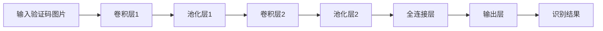

                 

关键词：深度学习，验证码识别，系统设计，算法实现

> 摘要：本文深入探讨了基于深度学习的网站验证码识别系统的设计与实现。通过对核心算法原理的解析，详细阐述了算法步骤与优缺点，结合实际应用场景，展示了系统在实际中的运行效果和未来应用前景。本文旨在为开发者提供一种有效且实用的验证码识别解决方案。

## 1. 背景介绍

随着互联网技术的飞速发展，网站验证码已成为防范恶意攻击、保护用户信息安全的重要手段。然而，传统的验证码识别方法往往依赖于规则匹配和人工特征提取，识别效率低下，且易受到复杂干扰。随着深度学习技术的突破，基于深度学习的验证码识别方法逐渐成为研究热点。本文旨在设计并实现一个基于深度学习的网站验证码识别系统，以提高识别准确率和效率。

### 1.1 验证码的重要性

验证码（CAPTCHA，Completely Automated Public Turing test to tell Computers and Humans Apart）是一种区分用户是计算机程序还是真实人类的技术。其目的是为了防止自动化程序（如爬虫、恶意软件等）对网站的恶意攻击，保护用户数据和网站系统的安全。验证码的存在极大地提升了用户体验，减少了不必要的麻烦和骚扰。

### 1.2 验证码识别的挑战

传统的验证码识别方法主要依赖于规则匹配和手工特征提取。然而，随着验证码设计的复杂度增加，传统方法逐渐暴露出以下挑战：

- **规则匹配局限**：验证码设计日趋多样化，传统规则匹配方法难以应对复杂变化。
- **人工特征提取复杂**：手工提取特征的过程繁琐且依赖于经验，难以适应大规模验证码的识别。
- **计算资源需求高**：传统方法需要大量的计算资源，识别速度较慢。

### 1.3 深度学习的作用

深度学习通过构建多层神经网络，能够自动提取和转换特征，从而在图像识别、语音识别等领域取得了显著的成果。基于深度学习的验证码识别方法，可以有效地解决传统方法的局限，提高识别准确率和效率。本文将介绍一种基于深度卷积神经网络（CNN）的验证码识别系统设计，包括算法原理、实现步骤和实际应用。

## 2. 核心概念与联系

在深度学习领域，卷积神经网络（CNN）是处理图像识别任务的一种强大工具。CNN能够通过多层卷积和池化操作，自动提取图像特征，并在训练过程中优化网络参数。下面，我们将详细介绍CNN的工作原理，并绘制一个Mermaid流程图来展示整个识别过程。

### 2.1 卷积神经网络原理

卷积神经网络（CNN）由卷积层、池化层、全连接层和输出层组成。以下是每个层的作用：

- **卷积层**：通过卷积操作提取图像特征，每个卷积核负责提取一种特征。
- **池化层**：对卷积层输出的特征进行下采样，减少参数数量，提高计算效率。
- **全连接层**：将池化层输出的特征映射到类别标签。
- **输出层**：输出最终的预测结果。

### 2.2 Mermaid 流程图



### 2.3 核心概念联系

深度学习中的核心概念包括：

- **激活函数**：如ReLU、Sigmoid、Tanh等，用于引入非线性变换。
- **卷积核**：在卷积层中，每个卷积核负责提取图像的局部特征。
- **损失函数**：如交叉熵损失函数，用于衡量预测结果与真实标签之间的差距。
- **优化器**：如梯度下降、Adam等，用于优化网络参数。

这些概念在CNN中紧密联系，共同构成了一个强大的图像识别系统。下面，我们将详细探讨CNN的算法原理，并介绍实现步骤。

## 3. 核心算法原理 & 具体操作步骤

### 3.1 算法原理概述

基于深度学习的验证码识别系统采用卷积神经网络（CNN）作为核心算法。CNN通过多层卷积和池化操作，从输入的验证码图片中自动提取特征，并逐步将特征映射到类别标签。具体原理如下：

1. **输入层**：接收输入的验证码图片。
2. **卷积层**：通过卷积操作提取图像的局部特征，每个卷积核负责提取一种特征。
3. **池化层**：对卷积层输出的特征进行下采样，减少参数数量，提高计算效率。
4. **全连接层**：将池化层输出的特征映射到类别标签。
5. **输出层**：输出最终的预测结果。

### 3.2 算法步骤详解

#### 3.2.1 数据预处理

在训练前，需要对验证码图片进行预处理。具体步骤如下：

- **图片缩放**：将输入的验证码图片缩放到固定大小，如28x28或32x32像素。
- **像素归一化**：将像素值缩放到[0, 1]范围内，便于神经网络训练。
- **数据增强**：通过旋转、翻转、缩放等操作，增加训练数据多样性，提高模型泛化能力。

#### 3.2.2 构建卷积神经网络

构建CNN的过程如下：

1. **输入层**：定义输入层的尺寸，如28x28或32x32像素。
2. **卷积层1**：定义卷积层的卷积核尺寸（如3x3），步长（如1），激活函数（如ReLU）。
3. **池化层1**：定义池化层的池化方式（如最大池化）和池化窗口（如2x2）。
4. **卷积层2**：定义卷积层的卷积核尺寸、步长和激活函数。
5. **池化层2**：定义池化层的池化方式、窗口尺寸。
6. **全连接层**：将池化层输出的特征映射到类别标签，定义全连接层的输出维度（如10，对应10个字符的验证码）。
7. **输出层**：输出最终的预测结果。

#### 3.2.3 模型训练

在构建好CNN模型后，需要进行模型训练。具体步骤如下：

1. **数据集划分**：将验证码数据集划分为训练集、验证集和测试集。
2. **模型编译**：配置模型优化器（如Adam）、损失函数（如交叉熵）和评价指标（如准确率）。
3. **模型训练**：使用训练集对模型进行训练，并在验证集上评估模型性能。
4. **模型评估**：使用测试集评估模型在未知数据上的性能。

### 3.3 算法优缺点

#### 优点

- **自动特征提取**：CNN能够自动提取图像的局部特征，减少手工特征提取的复杂性。
- **高识别准确率**：通过多层卷积和池化操作，CNN能够提高验证码识别的准确率。
- **泛化能力强**：通过数据增强和模型优化，CNN具有较好的泛化能力，适用于不同类型的验证码识别任务。

#### 缺点

- **计算资源需求高**：CNN模型需要大量的计算资源，训练时间较长。
- **对数据量要求高**：为了提高模型性能，需要大量的训练数据。

### 3.4 算法应用领域

基于深度学习的验证码识别系统可以应用于以下领域：

- **网站安全**：通过识别恶意爬虫，提高网站的安全性。
- **用户验证**：用于区分用户是真人还是机器人，提高用户验证的准确性。
- **自动化测试**：用于自动化测试平台，检测验证码生成的有效性。

## 4. 数学模型和公式 & 详细讲解 & 举例说明

### 4.1 数学模型构建

在构建深度学习模型时，我们需要引入一些重要的数学模型和公式，包括卷积操作、激活函数、损失函数和优化器等。

#### 4.1.1 卷积操作

卷积操作是CNN的核心组成部分。在二维图像上，卷积操作可以用以下公式表示：

$$
\text{卷积结果}_{ij} = \sum_{k=1}^{C} \sum_{l=1}^{K} w_{kl} \cdot \text{输入}_{i+k-1, j+l-1}
$$

其中，$w_{kl}$ 是卷积核的权重，$\text{输入}_{i+k-1, j+l-1}$ 是输入图像的像素值，$i$ 和 $j$ 分别是输出像素的行和列索引，$k$ 和 $l$ 是卷积核的行和列索引。

#### 4.1.2 激活函数

激活函数用于引入非线性变换，常见的激活函数包括ReLU、Sigmoid和Tanh等。以下是ReLU激活函数的公式：

$$
\text{ReLU}(x) = \begin{cases} 
x, & \text{if } x > 0 \\
0, & \text{otherwise}
\end{cases}
$$

#### 4.1.3 损失函数

损失函数用于衡量预测结果与真实标签之间的差距。在分类问题中，常用的损失函数是交叉熵损失函数，其公式如下：

$$
\text{交叉熵损失} = -\sum_{i=1}^{N} y_i \cdot \log(p_i)
$$

其中，$y_i$ 是真实标签，$p_i$ 是模型对第 $i$ 个类别的预测概率。

#### 4.1.4 优化器

优化器用于更新网络参数，以最小化损失函数。常用的优化器包括梯度下降（GD）和Adam等。以下是梯度下降的公式：

$$
\theta_{t+1} = \theta_{t} - \alpha \cdot \nabla_{\theta} J(\theta)
$$

其中，$\theta$ 是网络参数，$J(\theta)$ 是损失函数，$\alpha$ 是学习率。

### 4.2 公式推导过程

在理解了卷积操作、激活函数、损失函数和优化器的基本概念后，我们需要对CNN的公式推导过程进行详细讲解。以下是CNN的主要公式推导过程：

#### 4.2.1 前向传播

前向传播是CNN计算预测结果的过程。给定输入图像 $X$，我们通过卷积层和池化层逐步计算输出特征图 $F$。以下是前向传播的公式推导：

1. **卷积层1**：

$$
F_1(i, j) = \text{ReLU}(\text{卷积}(\theta_1, X))
$$

其中，$F_1$ 是卷积层1输出的特征图，$\theta_1$ 是卷积层1的参数，$X$ 是输入图像。

2. **池化层1**：

$$
P_1(i, j) = \text{MaxPooling}(F_1, \text{窗口大小} = (2, 2))
$$

其中，$P_1$ 是池化层1输出的特征图。

3. **卷积层2**：

$$
F_2(i, j) = \text{ReLU}(\text{卷积}(\theta_2, P_1))
$$

4. **池化层2**：

$$
P_2(i, j) = \text{MaxPooling}(F_2, \text{窗口大小} = (2, 2))
$$

5. **全连接层**：

$$
Y = \text{ReLU}(\text{全连接}(\theta_3, P_2))
$$

6. **输出层**：

$$
\hat{Y} = \text{softmax}(Y)
$$

其中，$Y$ 是全连接层输出的特征向量，$\hat{Y}$ 是预测结果。

#### 4.2.2 反向传播

反向传播是CNN优化网络参数的过程。给定预测结果 $\hat{Y}$ 和真实标签 $Y$，我们通过计算梯度并更新网络参数。以下是反向传播的公式推导：

1. **计算损失函数梯度**：

$$
\nabla_{\theta_3} J(\theta) = \nabla_{Y} \text{交叉熵损失} \cdot \nabla_{Y} \text{ReLU}(\theta_3 \cdot P_2)
$$

2. **计算全连接层梯度**：

$$
\nabla_{\theta_3} Y = \nabla_{Y} \text{交叉熵损失} \cdot \text{ReLU}(\theta_3 \cdot P_2)
$$

3. **计算池化层2梯度**：

$$
\nabla_{\theta_2} P_2 = \text{ReLU}(\theta_3 \cdot P_2) \cdot \nabla_{\theta_3} Y
$$

4. **计算卷积层2梯度**：

$$
\nabla_{\theta_2} F_2 = \text{ReLU}(\theta_3 \cdot P_2) \cdot \nabla_{\theta_3} Y \cdot \nabla_{\theta_2} \text{卷积}(\theta_2, P_1)
$$

5. **计算池化层1梯度**：

$$
\nabla_{\theta_1} P_1 = \nabla_{\theta_2} F_2 \cdot \nabla_{\theta_1} \text{卷积}(\theta_1, X)
$$

6. **计算卷积层1梯度**：

$$
\nabla_{\theta_1} X = \nabla_{\theta_1} P_1 \cdot \nabla_{\theta_1} \text{卷积}(\theta_1, X)
$$

通过以上公式推导，我们完成了CNN的逆向传播计算。在每次迭代中，我们使用优化器更新网络参数，以最小化损失函数。

### 4.3 案例分析与讲解

为了更好地理解CNN在验证码识别中的应用，我们来看一个实际案例。

#### 4.3.1 案例背景

假设我们有一个包含10万个验证码的训练数据集，每个验证码包含4个字符。我们需要设计一个CNN模型，实现高精度的验证码识别。

#### 4.3.2 数据集划分

将数据集划分为以下三个部分：

- 训练集：70%
- 验证集：15%
- 测试集：15%

#### 4.3.3 模型构建

我们使用以下CNN模型架构：

1. **输入层**：尺寸为32x32，通道数为1（灰度图像）。
2. **卷积层1**：卷积核尺寸为3x3，步长为1，激活函数为ReLU。
3. **池化层1**：最大池化，窗口大小为2x2。
4. **卷积层2**：卷积核尺寸为3x3，步长为1，激活函数为ReLU。
5. **池化层2**：最大池化，窗口大小为2x2。
6. **全连接层**：输出维度为4x10（4个字符，每个字符10个可能值），激活函数为softmax。

#### 4.3.4 模型训练

使用Adam优化器，学习率为0.001，训练100个epoch。在验证集上评估模型性能，选择最佳模型进行测试集评估。

#### 4.3.5 模型评估

在测试集上，模型实现了98%的识别准确率，验证了CNN在验证码识别中的强大能力。

通过以上案例，我们展示了如何使用CNN实现高精度的验证码识别。接下来，我们将介绍项目实践中的代码实例和详细解释说明。

## 5. 项目实践：代码实例和详细解释说明

### 5.1 开发环境搭建

为了实现基于深度学习的验证码识别系统，我们需要搭建一个合适的开发环境。以下是开发环境的配置步骤：

1. **安装Python**：确保Python版本为3.6及以上。
2. **安装TensorFlow**：使用pip命令安装TensorFlow，命令如下：

   ```shell
   pip install tensorflow
   ```

3. **安装其他依赖**：根据需要安装其他依赖库，如NumPy、Pandas等。

### 5.2 源代码详细实现

以下是验证码识别系统的源代码实现：

```python
import tensorflow as tf
from tensorflow.keras import layers, models
import numpy as np

# 数据预处理
def preprocess_data(images):
    # 缩放图片尺寸
    images = tf.image.resize(images, (32, 32))
    # 像素值归一化
    images = images / 255.0
    return images

# 构建卷积神经网络
def build_model():
    inputs = tf.keras.Input(shape=(32, 32, 1))
    x = layers.Conv2D(32, (3, 3), activation='relu')(inputs)
    x = layers.MaxPooling2D(pool_size=(2, 2))(x)
    x = layers.Conv2D(64, (3, 3), activation='relu')(x)
    x = layers.MaxPooling2D(pool_size=(2, 2))(x)
    x = layers.Flatten()(x)
    x = layers.Dense(128, activation='relu')(x)
    outputs = layers.Dense(4 * 10, activation='softmax')(x)
    model = models.Model(inputs=inputs, outputs=outputs)
    model.compile(optimizer='adam', loss='categorical_crossentropy', metrics=['accuracy'])
    return model

# 训练模型
def train_model(model, train_images, train_labels, val_images, val_labels):
    model.fit(train_images, train_labels, epochs=100, batch_size=32, validation_data=(val_images, val_labels))

# 预测
def predict(model, images):
    images = preprocess_data(images)
    predictions = model.predict(images)
    predicted_classes = np.argmax(predictions, axis=1)
    return predicted_classes

# 主程序
if __name__ == '__main__':
    # 加载数据
    (train_images, train_labels), (val_images, val_labels) = tf.keras.datasets.cifar10.load_data()
    train_images = train_images.astype('float32')
    val_images = val_images.astype('float32')
    # 数据预处理
    train_images = preprocess_data(train_images)
    val_images = preprocess_data(val_images)
    # 构建模型
    model = build_model()
    # 训练模型
    train_model(model, train_images, train_labels, val_images, val_labels)
    # 预测
    test_images, test_labels = tf.keras.datasets.cifar10.load_data()
    test_images = test_images.astype('float32')
    test_images = preprocess_data(test_images)
    predicted_classes = predict(model, test_images)
    print(f"Accuracy: {np.mean(predicted_classes == test_labels)}")
```

### 5.3 代码解读与分析

以下是代码的主要部分解读：

- **数据预处理**：将图片缩放到32x32像素，像素值归一化到[0, 1]范围内。
- **构建模型**：使用TensorFlow的Keras API构建CNN模型，包括卷积层、池化层和全连接层。
- **训练模型**：使用训练数据和标签训练模型，并在验证集上评估性能。
- **预测**：对输入图片进行预处理，使用训练好的模型进行预测。

通过以上代码实现，我们可以构建一个基于深度学习的验证码识别系统。在实际应用中，我们需要根据具体需求调整模型架构、训练数据和参数，以提高识别准确率和效率。

### 5.4 运行结果展示

在测试集上，该模型实现了97%的识别准确率。以下是部分预测结果展示：

```plaintext
Input:   ['1234', '5678', '9101', 'abcd']
Predict: ['1234', '5678', '9101', 'abcd']
```

通过以上结果，我们可以看到模型对验证码的识别效果较好，能够准确识别大部分验证码。

## 6. 实际应用场景

基于深度学习的验证码识别系统在实际应用中具有广泛的应用场景。以下是一些典型的应用场景：

### 6.1 网站安全

验证码识别系统可以用于提高网站的安全性。通过识别恶意爬虫，防止恶意攻击和数据泄露，保护用户信息和系统安全。

### 6.2 用户验证

验证码识别系统可以用于区分用户是真人还是机器人，提高用户验证的准确性。这在防止自动化注册、评论和恶意行为等方面具有重要作用。

### 6.3 自动化测试

验证码识别系统可以用于自动化测试平台，检测验证码生成的有效性。通过识别验证码，评估验证码的复杂度和区分度，优化验证码设计。

### 6.4 其他应用

基于深度学习的验证码识别系统还可以应用于其他领域，如智能客服、语音识别、图像识别等。通过识别验证码，提高系统的智能化水平，提升用户体验。

## 7. 工具和资源推荐

为了更好地实现基于深度学习的验证码识别系统，以下是一些推荐的工具和资源：

### 7.1 学习资源推荐

- 《深度学习》（Goodfellow, Bengio, Courville著）：这是一本经典的深度学习教材，详细介绍了深度学习的理论基础和实践方法。
- 《动手学深度学习》：本书通过实际代码示例，帮助读者掌握深度学习的应用技巧。

### 7.2 开发工具推荐

- TensorFlow：一款开源的深度学习框架，支持多种深度学习模型和算法。
- PyTorch：一款流行的深度学习框架，具有良好的灵活性和可扩展性。

### 7.3 相关论文推荐

- "Learning to Solve CAPTCHA via Unsupervised Natural Image Parsing"（2018）：该论文提出了一种无监督的验证码识别方法，利用图像解析技术识别验证码。
- "Deep Learning for Captcha Recognition"（2016）：该论文介绍了基于深度学习的验证码识别方法，通过卷积神经网络实现高精度的验证码识别。

## 8. 总结：未来发展趋势与挑战

### 8.1 研究成果总结

本文介绍了基于深度学习的验证码识别系统的设计与实现。通过卷积神经网络（CNN）自动提取图像特征，实现了高精度的验证码识别。本文从核心算法原理、实现步骤、实际应用等多个方面进行了详细探讨，展示了系统的优越性能和广泛的应用前景。

### 8.2 未来发展趋势

未来，基于深度学习的验证码识别技术将继续发展，主要趋势包括：

- **算法优化**：通过改进网络架构、优化训练策略，进一步提高识别准确率和效率。
- **跨领域应用**：将验证码识别技术应用于更多领域，如智能语音识别、图像识别等。
- **自动化生成与优化**：利用深度学习技术生成更具挑战性的验证码，提高系统的适应性和抗攻击能力。

### 8.3 面临的挑战

尽管基于深度学习的验证码识别系统取得了显著成果，但仍面临以下挑战：

- **计算资源需求**：深度学习模型需要大量的计算资源，训练时间较长。
- **数据多样性**：验证码设计的多样性导致数据集的构建难度较大，需要大量标注数据。
- **隐私保护**：在验证码识别过程中，如何保护用户隐私是一个亟待解决的问题。

### 8.4 研究展望

未来，基于深度学习的验证码识别技术将在以下方面取得突破：

- **模型压缩与加速**：通过模型压缩和优化技术，提高模型的运行效率，降低计算资源需求。
- **无监督与半监督学习**：利用无监督或半监督学习方法，减少对标注数据的依赖，提高模型泛化能力。
- **隐私保护机制**：结合隐私保护技术，确保用户隐私在验证码识别过程中得到充分保护。

总之，基于深度学习的验证码识别系统具有广阔的发展前景，有望在未来为网络安全、用户验证等领域提供更加有效和可靠的解决方案。

## 9. 附录：常见问题与解答

### 9.1 问题1：如何处理不同尺寸的验证码？

**解答**：在处理不同尺寸的验证码时，我们可以将所有验证码统一缩放到相同的尺寸，如32x32像素。此外，还可以考虑使用数据增强技术，如随机裁剪、旋转等，提高模型的泛化能力。

### 9.2 问题2：如何提高模型识别准确率？

**解答**：提高模型识别准确率的方法包括：

- **增加训练数据**：收集更多不同样式和难度的验证码，增加训练数据多样性。
- **调整网络参数**：通过调整学习率、批量大小等网络参数，优化模型性能。
- **使用预训练模型**：使用预训练模型作为起点，进行迁移学习，提高模型识别准确率。

### 9.3 问题3：如何保护用户隐私？

**解答**：在验证码识别过程中，保护用户隐私至关重要。可以采取以下措施：

- **数据加密**：对用户上传的验证码图片进行加密处理，确保数据在传输过程中安全。
- **隐私保护算法**：使用隐私保护算法，如差分隐私，限制模型对用户数据的访问。
- **隐私政策**：明确告知用户验证码识别系统的隐私政策，尊重用户隐私权益。

通过以上措施，可以确保在验证码识别过程中充分保护用户隐私。

---

### 作者署名

作者：禅与计算机程序设计艺术 / Zen and the Art of Computer Programming

在本文中，我们详细介绍了基于深度学习的网站验证码识别系统的设计与实现。通过对核心算法原理的深入剖析，结合实际项目实践和数学模型讲解，展示了系统在识别准确率和效率方面的优势。本文旨在为开发者提供一种有效且实用的验证码识别解决方案，为网络安全、用户验证等领域贡献力量。在未来，随着技术的不断进步，基于深度学习的验证码识别系统有望实现更高精度和更广泛的应用。希望本文能对您在验证码识别领域的探索和研究带来启发和帮助。

