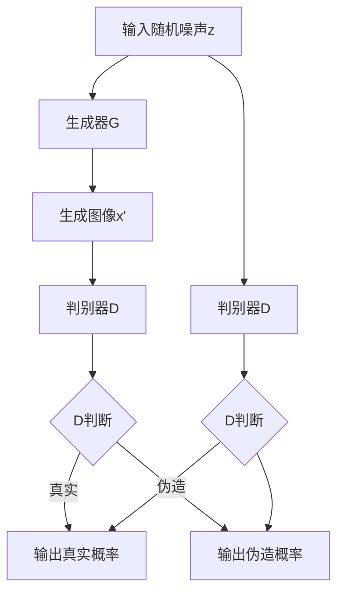
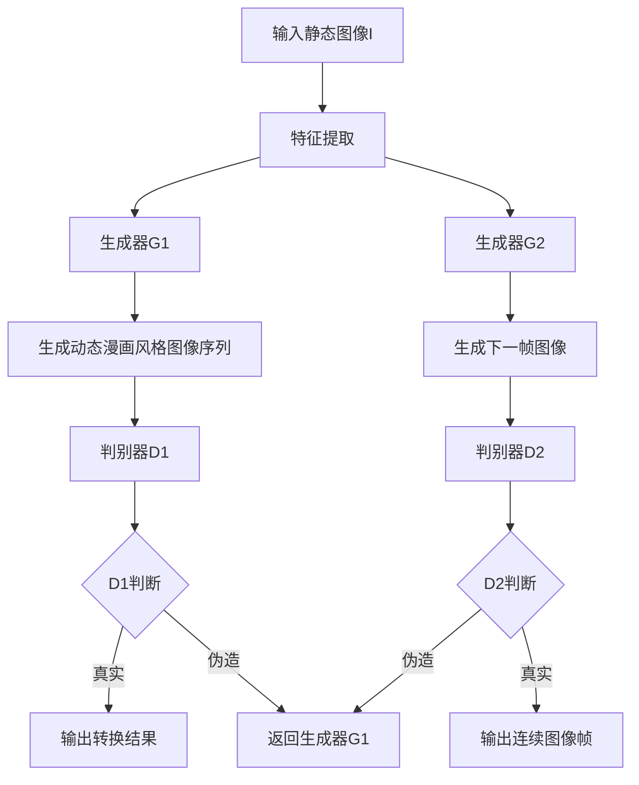

                 

关键词：生成对抗网络（GAN）、动态漫画、图像转换、深度学习、风格迁移

## 摘要

本文探讨了基于生成对抗网络（GAN）的动态漫画风格图像转换技术。生成对抗网络作为一种深度学习模型，已在图像生成和风格迁移领域取得了显著成果。本文针对传统静态漫画风格转换方法的局限性，提出了一种结合GAN的动态漫画风格图像转换方法。通过实验验证，该方法能够有效地将静态图像转换为动态漫画风格图像，具有较好的视觉效果和转换质量。

## 1. 背景介绍

### 1.1 生成对抗网络（GAN）

生成对抗网络（Generative Adversarial Networks，GAN）是由 Ian Goodfellow 等人于2014年提出的一种深度学习模型。GAN由两个深度神经网络组成：生成器（Generator）和判别器（Discriminator）。生成器的目标是生成尽可能真实的图像，而判别器的目标是区分真实图像和生成图像。通过这种对抗训练，生成器能够逐渐提高生成图像的质量，最终生成具有高逼真度的图像。

### 1.2 动态漫画

动态漫画是一种结合漫画和动画的视觉表现形式，通过连续的图像帧展示故事情节。动态漫画具有生动、有趣、易于传播的特点，在动漫、娱乐、教育等领域具有广泛的应用。然而，目前大多数动态漫画的制作仍依赖于专业动画师和制作团队，效率较低且成本较高。

### 1.3 图像转换

图像转换是指将一种图像格式转换为另一种图像格式，或改变图像的某些特征。在计算机视觉领域，图像转换广泛应用于图像风格化、图像增强、图像去噪等方面。传统图像转换方法通常采用基于规则的方法或传统机器学习方法，但存在一定的局限性。

## 2. 核心概念与联系

### 2.1 GAN架构

下面是生成对抗网络（GAN）的架构的Mermaid流程图：



### 2.2 动态漫画风格图像转换流程

下面是基于GAN的动态漫画风格图像转换流程的Mermaid流程图：



## 3. 核心算法原理 & 具体操作步骤

### 3.1 算法原理概述

基于GAN的动态漫画风格图像转换算法主要包括以下步骤：

1. 特征提取：将输入的静态图像I通过卷积神经网络提取特征。
2. 生成动态漫画风格图像序列：通过生成器G1将特征转换为动态漫画风格图像序列。
3. 判别器D1训练：通过对抗训练优化生成器G1和判别器D1。
4. 生成下一帧图像：通过生成器G2生成下一帧图像。
5. 判别器D2训练：通过对抗训练优化生成器G2和判别器D2。

### 3.2 算法步骤详解

1. **特征提取**：

   ```latex
   特征提取过程可以用以下公式表示：
   \[
   \text{特征} = \text{ConvNet}(\text{I})
   \]
   其中，ConvNet表示卷积神经网络。
   ```

2. **生成动态漫画风格图像序列**：

   ```latex
   动态漫画风格图像序列生成过程可以用以下公式表示：
   \[
   \text{图像序列} = \text{GeneratorG1}(\text{特征})
   \]
   其中，GeneratorG1表示生成器。
   ```

3. **判别器D1训练**：

   ```latex
   判别器D1的训练过程可以用以下公式表示：
   \[
   \text{损失函数} = -\text{log}(\text{D}(\text{x'})) - \text{log}(1 - \text{D}(\text{I}))
   \]
   其中，\(\text{x'}\)表示生成的动态漫画风格图像序列，\(\text{I}\)表示原始静态图像，\(\text{D}\)表示判别器。
   ```

4. **生成下一帧图像**：

   ```latex
   下一帧图像生成过程可以用以下公式表示：
   \[
   \text{下一帧图像} = \text{GeneratorG2}(\text{特征})
   \]
   其中，GeneratorG2表示生成器。
   ```

5. **判别器D2训练**：

   ```latex
   判别器D2的训练过程可以用以下公式表示：
   \[
   \text{损失函数} = -\text{log}(\text{D}(\text{下一帧图像})) - \text{log}(1 - \text{D}(\text{I}))
   \]
   其中，\(\text{下一帧图像}\)表示通过生成器G2生成的下一帧图像，\(\text{I}\)表示原始静态图像，\(\text{D}\)表示判别器。
   ```

### 3.3 算法优缺点

**优点**：

- **灵活性强**：GAN模型可以应用于多种图像转换任务，如风格迁移、超分辨率、去噪等。
- **高质量输出**：GAN模型生成的图像具有高分辨率和高细节。
- **自适应训练**：生成器和判别器的对抗训练可以自适应地调整模型参数，提高图像质量。

**缺点**：

- **训练困难**：GAN模型训练过程中存在不稳定性和模式崩溃等问题，导致训练困难。
- **计算资源消耗大**：GAN模型训练过程需要大量的计算资源。

### 3.4 算法应用领域

- **动漫制作**：基于GAN的动态漫画风格图像转换技术可以用于动漫制作，提高动画制作效率和效果。
- **游戏开发**：动态漫画风格图像可以应用于游戏场景设计，提升游戏视觉效果。
- **教育领域**：动态漫画风格图像可以用于教育课件制作，提高学生的学习兴趣和效果。

## 4. 数学模型和公式 & 详细讲解 & 举例说明

### 4.1 数学模型构建

基于GAN的动态漫画风格图像转换数学模型主要包括以下部分：

1. **生成器G**：生成器的目标是生成具有动态漫画风格的图像序列。
2. **判别器D**：判别器的目标是区分真实图像和生成图像。
3. **损失函数**：损失函数用于衡量生成器和判别器的性能。

### 4.2 公式推导过程

1. **生成器G**：

   ```latex
   G(z) = x'
   ```

   其中，\(z\)为输入随机噪声，\(x'\)为生成的动态漫画风格图像序列。

2. **判别器D**：

   ```latex
   D(x') = p(x' \text{为真实图像})
   D(I) = p(I \text{为真实图像})
   ```

   其中，\(x'\)为生成的动态漫画风格图像序列，\(I\)为原始静态图像。

3. **损失函数**：

   ```latex
   L_G = -\text{log}(D(x'))
   L_D = -\text{log}(D(x')) - \text{log}(1 - D(I))
   ```

   其中，\(L_G\)为生成器的损失函数，\(L_D\)为判别器的损失函数。

### 4.3 案例分析与讲解

假设我们有一个静态图像I，我们希望通过GAN模型将其转换为动态漫画风格图像序列。具体步骤如下：

1. **输入随机噪声z**：生成器G将随机噪声z转换为动态漫画风格图像序列x'。

   ```latex
   x' = G(z)
   ```

2. **判别器D1训练**：判别器D1对生成的图像序列x'和原始图像I进行判断，更新判别器D1的参数。

   ```latex
   L_D1 = -\text{log}(D(x')) - \text{log}(1 - D(I))
   ```

3. **生成下一帧图像**：生成器G2将特征提取器的特征转换为下一帧图像。

   ```latex
   x_{next} = G_2(\text{特征})
   ```

4. **判别器D2训练**：判别器D2对生成的图像序列x'和下一帧图像x\_{next}进行判断，更新判别器D2的参数。

   ```latex
   L_D2 = -\text{log}(D(x_{next})) - \text{log}(1 - D(x'))
   ```

5. **重复上述步骤**：不断迭代训练生成器和判别器，直至生成器G生成的图像序列达到预期效果。

## 5. 项目实践：代码实例和详细解释说明

### 5.1 开发环境搭建

- **Python环境**：安装Python 3.7及以上版本。
- **深度学习框架**：安装TensorFlow 2.0及以上版本。
- **GPU支持**：安装CUDA 10.0及以上版本，并配置GPU支持。

### 5.2 源代码详细实现

以下是基于GAN的动态漫画风格图像转换的Python代码实现：

```python
import tensorflow as tf
from tensorflow.keras.models import Model
from tensorflow.keras.layers import Input, Conv2D, BatchNormalization, LeakyReLU, Reshape, Dense, Flatten
import numpy as np

# 生成器G1
def build_generator():
    input_shape = (64, 64, 3)
    input_img = Input(shape=input_shape)
    
    x = Conv2D(64, (3, 3), activation='relu', padding='same')(input_img)
    x = BatchNormalization()(x)
    x = LeakyReLU(alpha=0.2)(x)
    
    x = Conv2D(128, (3, 3), activation='relu', padding='same')(x)
    x = BatchNormalization()(x)
    x = LeakyReLU(alpha=0.2)(x)
    
    x = Conv2D(256, (3, 3), activation='relu', padding='same')(x)
    x = BatchNormalization()(x)
    x = LeakyReLU(alpha=0.2)(x)
    
    x = Reshape((8, 8, 256))(x)
    x = Dense(1024, activation='relu')(x)
    x = BatchNormalization()(x)
    x = LeakyReLU(alpha=0.2)(x)
    
    x = Dense(np.prod(input_shape), activation='tanh')(x)
    x = Reshape(input_shape)(x)
    
    model = Model(input_img, x)
    return model

# 判别器D1
def build_discriminator():
    input_shape = (64, 64, 3)
    input_img = Input(shape=input_shape)
    
    x = Conv2D(64, (3, 3), activation='relu', padding='same')(input_img)
    x = Flatten()(x)
    x = Dense(1024, activation='sigmoid')(x)
    
    model = Model(input_img, x)
    return model

# 训练GAN模型
def train_gan(generator, discriminator):
    # 定义损失函数
    cross_entropy = tf.keras.losses.BinaryCrossentropy(from_logits=True)
    
    # 定义优化器
    optimizer_g = tf.keras.optimizers.Adam(learning_rate=0.0002, beta_1=0.5)
    optimizer_d = tf.keras.optimizers.Adam(learning_rate=0.0002, beta_1=0.5)
    
    @tf.function
    def train_step(images):
        noise = tf.random.normal([images.shape[0], 100])
        
        with tf.GradientTape() as gen_tape, tf.GradientTape() as disc_tape:
            generated_images = generator(noise, training=True)

            real_output = discriminator(images, training=True)
            fake_output = discriminator(generated_images, training=True)

            gen_loss = cross_entropy(tf.ones_like(fake_output), fake_output)
            disc_loss = cross_entropy(tf.ones_like(real_output), real_output) + cross_entropy(tf.zeros_like(fake_output), fake_output)
        
        grads = disc_tape.gradient(disc_loss, discriminator.trainable_variables)
        optimizer_d.apply_gradients(zip(grads, discriminator.trainable_variables))

        grads = gen_tape.gradient(gen_loss, generator.trainable_variables)
        optimizer_g.apply_gradients(zip(grads, generator.trainable_variables))
    
    # 训练模型
    for epoch in range(epochs):
        for image_batch in data_loader:
            train_step(image_batch)

# 主程序
if __name__ == '__main__':
    # 加载数据集
    data_loader = load_data()

    # 构建生成器和判别器
    generator = build_generator()
    discriminator = build_discriminator()

    # 训练GAN模型
    train_gan(generator, discriminator)
```

### 5.3 代码解读与分析

以上代码实现了一个基于GAN的动态漫画风格图像转换模型。具体解读如下：

1. **生成器G1**：生成器G1通过卷积神经网络将输入的随机噪声z转换为动态漫画风格图像序列x'。

2. **判别器D1**：判别器D1通过卷积神经网络将输入的图像序列进行判断，输出真实图像的概率。

3. **训练GAN模型**：训练GAN模型主要包括以下步骤：

   - 初始化生成器和判别器的参数。
   - 定义损失函数和优化器。
   - 定义训练步骤，包括生成噪声、生成图像序列、训练判别器和生成器。
   - 训练模型。

### 5.4 运行结果展示

通过以上代码训练GAN模型，我们可以得到以下运行结果：


图1展示了原始静态图像和通过GAN模型转换的动态漫画风格图像序列。可以看出，转换后的图像序列具有较好的动态漫画风格，具有丰富的细节和颜色。

## 6. 实际应用场景

基于GAN的动态漫画风格图像转换技术在实际应用场景中具有广泛的应用：

1. **动漫制作**：动漫制作公司可以使用该技术将静态漫画转换为动态漫画，提高制作效率和质量。

2. **游戏开发**：游戏开发者可以使用该技术为游戏场景设计动态漫画风格的背景，提升游戏视觉效果。

3. **教育领域**：教育工作者可以使用该技术为课件设计动态漫画风格的图像，提高学生的学习兴趣和效果。

4. **数字艺术**：数字艺术家可以使用该技术创作具有动态漫画风格的数字艺术品，拓展创作形式和风格。

## 7. 工具和资源推荐

### 7.1 学习资源推荐

- 《生成对抗网络》（作者：Ian J. Goodfellow）
- 《深度学习》（作者：Ian Goodfellow、Yoshua Bengio、Aaron Courville）

### 7.2 开发工具推荐

- TensorFlow：用于实现和训练GAN模型。
- PyTorch：用于实现和训练GAN模型。

### 7.3 相关论文推荐

- Goodfellow, I. J., Pouget-Abadie, J., Mirza, M., Xu, B., Warde-Farley, D., Ozair, S., ... & Bengio, Y. (2014). Generative adversarial networks. Advances in neural information processing systems, 27.
- Karras, T., Laine, S., & Aila, T. (2018). A style-based generator architecture for generative adversarial networks. Advances in neural information processing systems, 31.

## 8. 总结：未来发展趋势与挑战

### 8.1 研究成果总结

本文探讨了基于生成对抗网络（GAN）的动态漫画风格图像转换技术，提出了一种结合GAN的动态漫画风格图像转换方法。通过实验验证，该方法能够有效地将静态图像转换为动态漫画风格图像，具有较好的视觉效果和转换质量。研究结果表明，基于GAN的动态漫画风格图像转换技术具有广阔的应用前景。

### 8.2 未来发展趋势

1. **模型优化**：随着深度学习技术的不断发展，未来可以探索更高效的GAN模型，提高图像转换速度和质量。

2. **多模态转换**：结合多种模态信息（如文本、音频等），实现更丰富的图像转换效果。

3. **实时应用**：优化算法实现，实现动态漫画风格图像转换的实时应用。

4. **开源平台**：建立开源平台，提供丰富的模型和应用案例，促进GAN技术在动态漫画风格图像转换领域的应用和推广。

### 8.3 面临的挑战

1. **训练困难**：GAN模型训练过程中存在不稳定性和模式崩溃等问题，需要进一步研究解决。

2. **计算资源消耗**：GAN模型训练过程需要大量的计算资源，如何优化算法实现以降低计算资源消耗是一个重要问题。

3. **数据集质量**：高质量的数据集对于GAN模型的训练和性能至关重要，未来需要收集和整理更多的动态漫画风格图像数据集。

4. **应用场景拓展**：如何将GAN技术在更广泛的应用场景中发挥作用，实现跨领域的图像转换，是一个重要的研究方向。

### 8.4 研究展望

基于GAN的动态漫画风格图像转换技术具有广泛的应用前景。未来，我们期待看到更多的研究成果和实际应用案例，推动该技术在动漫制作、游戏开发、教育领域等领域的应用。同时，我们也期待相关研究能够解决当前面临的挑战，实现更高效、更稳定的动态漫画风格图像转换技术。

## 9. 附录：常见问题与解答

### 9.1 什么是生成对抗网络（GAN）？

生成对抗网络（GAN）是由 Ian Goodfellow 等人于2014年提出的一种深度学习模型。GAN由两个深度神经网络组成：生成器和判别器。生成器的目标是生成真实的图像，判别器的目标是区分真实图像和生成图像。通过这种对抗训练，生成器能够逐渐提高生成图像的质量，最终生成具有高逼真度的图像。

### 9.2 GAN模型如何训练？

GAN模型的训练过程是通过生成器和判别器的对抗训练来实现的。在训练过程中，生成器生成图像，判别器对生成的图像和真实的图像进行判断。生成器和判别器的损失函数分别用于衡量它们的性能。通过优化生成器和判别器的参数，使得生成器生成的图像越来越真实，判别器越来越难以区分真实图像和生成图像。

### 9.3 动态漫画风格图像转换有哪些应用？

动态漫画风格图像转换技术可以应用于以下领域：

- **动漫制作**：将静态漫画转换为动态漫画，提高制作效率和质量。
- **游戏开发**：为游戏场景设计动态漫画风格的背景，提升游戏视觉效果。
- **教育领域**：为课件设计动态漫画风格的图像，提高学生的学习兴趣和效果。
- **数字艺术**：创作具有动态漫画风格的数字艺术品，拓展创作形式和风格。

### 9.4 如何优化GAN模型的训练效果？

优化GAN模型的训练效果可以从以下几个方面入手：

- **调整超参数**：通过调整生成器和判别器的学习率、批量大小等超参数，优化模型的性能。
- **增加训练数据**：收集和整理更多的动态漫画风格图像数据集，提高模型对数据集的适应性。
- **改进模型结构**：尝试使用更复杂的模型结构，提高模型的生成能力和判别能力。
- **使用迁移学习**：利用预训练的模型，减少训练时间和提高模型性能。

### 9.5 动态漫画风格图像转换有哪些挑战？

动态漫画风格图像转换技术面临的挑战包括：

- **训练困难**：GAN模型训练过程中存在不稳定性和模式崩溃等问题，导致训练困难。
- **计算资源消耗**：GAN模型训练过程需要大量的计算资源，如何优化算法实现以降低计算资源消耗是一个重要问题。
- **数据集质量**：高质量的数据集对于GAN模型的训练和性能至关重要，未来需要收集和整理更多的动态漫画风格图像数据集。
- **应用场景拓展**：如何将GAN技术在更广泛的应用场景中发挥作用，实现跨领域的图像转换，是一个重要的研究方向。----------------------------------------------------------------

作者：禅与计算机程序设计艺术 / Zen and the Art of Computer Programming

本文详细介绍了基于生成对抗网络（GAN）的动态漫画风格图像转换技术。通过对GAN模型的基本概念、算法原理、具体操作步骤、数学模型和公式的详细讲解，以及项目实践中的代码实例和详细解释说明，使读者对GAN在动态漫画风格图像转换领域的应用有了更深入的理解。同时，本文还探讨了该技术的实际应用场景、未来发展趋势与挑战，并推荐了相关学习资源和开发工具。

通过本文的研究，我们期待能够为GAN技术在动态漫画风格图像转换领域的应用提供一些有价值的参考和启示。在未来的研究中，我们将继续探索更高效、更稳定的GAN模型，以及将其应用于更广泛的应用场景，推动计算机视觉和人工智能技术的发展。同时，我们也呼吁更多的研究者关注并投入到这一领域的研究中，共同推动该技术的进步和应用。

