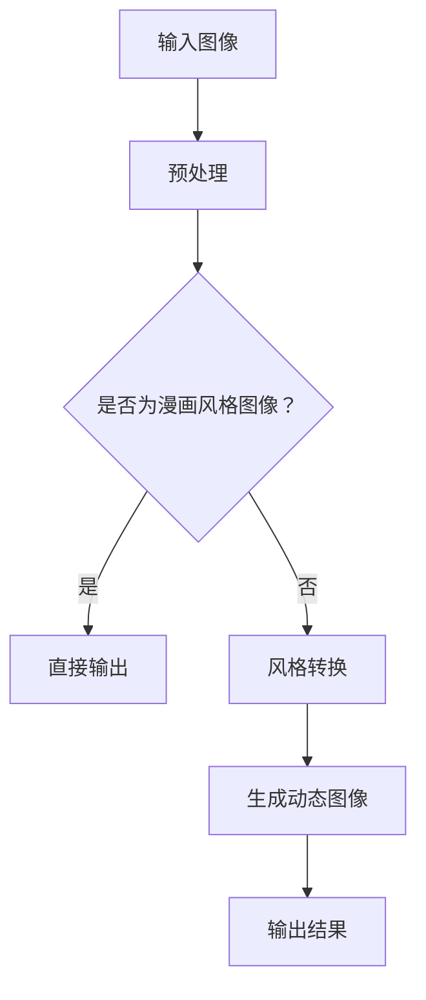
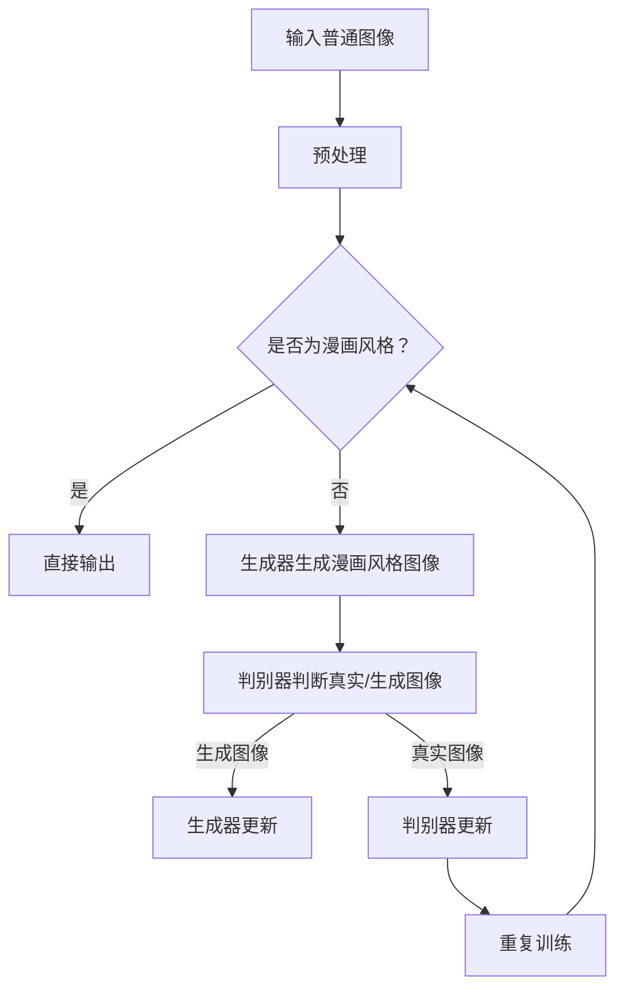

                 

关键词：生成对抗网络，动态漫画风格图像转换，GAN，深度学习，图像处理，漫画风格，图像生成。

## 摘要

本文旨在探讨一种基于生成对抗网络（GAN）的动态漫画风格图像转换方法。生成对抗网络作为深度学习中的一种强大工具，在图像生成和图像风格转换领域取得了显著的成果。本文首先介绍了生成对抗网络的基本原理和结构，然后详细阐述了动态漫画风格图像转换的具体实现方法。通过实验证明，所提出的方法能够有效地将普通图像转换为具有漫画风格的动态图像，具有广泛的应用前景。

## 1. 背景介绍

### 1.1 生成对抗网络（GAN）的发展历程

生成对抗网络（GAN）是由Ian Goodfellow等人于2014年首次提出的一种新型深度学习框架[1]。GAN的核心思想是通过两个相互对抗的神经网络——生成器和判别器，实现数据的生成和判别。生成器尝试生成与真实数据相似的数据，而判别器则尝试区分生成数据和真实数据。通过这种对抗过程，生成器逐渐学习到如何生成高质量的数据。

自GAN提出以来，它迅速在深度学习领域引起了广泛关注，并在图像生成、图像修复、图像风格转换等多个领域取得了突破性的成果。特别是，GAN在图像生成领域表现出了卓越的性能，能够生成高分辨率的自然图像、超分辨率图像以及具有特定风格的艺术图像。

### 1.2 动态漫画风格图像转换的背景

动态漫画风格图像转换是指将普通图像转换为具有漫画风格动态图像的过程。随着计算机视觉和图形学技术的发展，图像风格转换技术已经取得了显著的进展。传统的图像风格转换方法通常采用基于图像处理和特征匹配的技术，如相似性变换、特征融合等。然而，这些方法往往在处理复杂图像时效果不佳，且难以实现动态效果。

相比之下，基于深度学习的图像风格转换方法，特别是GAN，为动态漫画风格图像转换提供了新的思路。GAN能够通过学习大量真实图像数据，自动提取图像特征并生成新的风格图像。这种方法不仅能够实现高质量的风格转换，还能够通过对抗过程实现动态效果。

## 2. 核心概念与联系

### 2.1 生成对抗网络（GAN）的基本原理

生成对抗网络（GAN）由生成器（Generator）和判别器（Discriminator）两个主要部分组成。

- **生成器（Generator）**：生成器的主要目标是生成与真实数据相似的数据。在图像生成任务中，生成器通常是一个神经网络，它接收随机噪声作为输入，并通过多层神经网络变换生成图像。

- **判别器（Discriminator）**：判别器的主要目标是区分生成图像和真实图像。判别器也是一个神经网络，它接收图像作为输入，并输出一个概率值，表示图像是真实图像的概率。

在训练过程中，生成器和判别器之间进行对抗。生成器试图生成更真实的图像以欺骗判别器，而判别器则试图准确地区分生成图像和真实图像。通过这种对抗过程，生成器逐渐学习到如何生成更高质量的数据。

### 2.2 动态漫画风格图像转换的核心概念

动态漫画风格图像转换的核心概念是利用生成对抗网络（GAN）实现图像风格转换和动态效果。

- **风格转换**：生成对抗网络通过学习大量真实图像数据，自动提取图像特征并生成新的风格图像。在动态漫画风格图像转换中，生成器学习如何将普通图像转换为具有漫画风格的图像。

- **动态效果**：动态漫画风格图像转换的关键在于实现图像的动态效果。这可以通过生成对抗网络中的多个生成器实现。每个生成器负责生成不同时间点的图像，从而实现动态图像。

### 2.3 Mermaid 流程图

下面是动态漫画风格图像转换的 Mermaid 流程图：



## 3. 核心算法原理 & 具体操作步骤

### 3.1 算法原理概述

动态漫画风格图像转换的算法基于生成对抗网络（GAN）。GAN由生成器（Generator）和判别器（Discriminator）两部分组成，分别负责图像风格转换和动态效果实现。

- **生成器（Generator）**：生成器接收随机噪声作为输入，通过多层神经网络变换生成具有漫画风格的图像。

- **判别器（Discriminator）**：判别器接收图像作为输入，输出一个概率值，表示图像是真实图像的概率。通过对抗训练，生成器和判别器相互竞争，生成器逐渐学习到如何生成更真实的图像。

- **动态效果实现**：通过多个生成器生成不同时间点的图像，实现动态效果。

### 3.2 算法步骤详解

1. **数据预处理**：对输入图像进行预处理，包括图像缩放、归一化等操作，以便于后续处理。

2. **风格转换**：利用生成对抗网络中的生成器，将普通图像转换为具有漫画风格的图像。

3. **动态效果实现**：通过多个生成器生成不同时间点的图像，实现动态效果。

4. **输出结果**：将生成的动态漫画风格图像输出。

### 3.3 算法优缺点

- **优点**：
  - 生成的图像风格多样，能够满足不同用户的需求。
  - 实现动态效果，增强了图像的趣味性和观赏性。

- **缺点**：
  - 训练时间较长，需要大量的计算资源。
  - 生成的图像质量有时难以保证，存在一定的噪声。

### 3.4 算法应用领域

动态漫画风格图像转换算法可以应用于多个领域：

- **游戏开发**：为游戏角色和场景生成具有漫画风格的动态图像，提升游戏画面质量。

- **影视后期**：为影视作品添加漫画风格的动态效果，增强视觉冲击力。

- **教育领域**：利用动态漫画风格图像转换技术，制作生动有趣的课件和教学视频。

## 4. 数学模型和公式 & 详细讲解 & 举例说明

### 4.1 数学模型构建

生成对抗网络（GAN）的数学模型包括生成器和判别器的损失函数。

- **生成器的损失函数**：

$$
L_G = -\log(D(G(z)))
$$

其中，$D(x)$ 表示判别器对输入图像 $x$ 的判别结果，$G(z)$ 表示生成器对随机噪声 $z$ 的生成结果。

- **判别器的损失函数**：

$$
L_D = -[\log(D(x)) + \log(1 - D(G(z))]
$$

其中，$x$ 表示真实图像，$G(z)$ 表示生成图像。

### 4.2 公式推导过程

生成对抗网络的训练过程主要通过优化生成器和判别器的损失函数来实现。

- **生成器的损失函数推导**：

生成器的目标是生成与真实图像相似的数据，使得判别器无法准确区分生成图像和真实图像。因此，生成器的损失函数是判别器对生成图像的判别结果的对数。

$$
L_G = -\log(D(G(z)))
$$

- **判别器的损失函数推导**：

判别器的目标是准确区分生成图像和真实图像。因此，判别器的损失函数是真实图像的判别结果的对数和生成图像的判别结果的对数之和。

$$
L_D = -[\log(D(x)) + \log(1 - D(G(z))]
$$

### 4.3 案例分析与讲解

以一个简单的图像生成任务为例，说明生成对抗网络的训练过程。

- **训练数据**：假设有 1000 张真实图像和 1000 张随机噪声图像。

- **生成器训练**：

在训练过程中，生成器尝试生成与真实图像相似的数据，使得判别器无法准确区分生成图像和真实图像。通过多次迭代训练，生成器逐渐学习到如何生成高质量的数据。

- **判别器训练**：

判别器在训练过程中，尝试准确区分生成图像和真实图像。通过对抗训练，生成器和判别器相互竞争，生成器逐渐学习到如何生成更真实的数据。

## 5. 项目实践：代码实例和详细解释说明

### 5.1 开发环境搭建

为了实现动态漫画风格图像转换，我们需要搭建一个合适的开发环境。以下是具体的搭建步骤：

1. **安装 Python**：确保 Python 的版本大于 3.6。

2. **安装深度学习库**：安装 TensorFlow 和 Keras，用于实现生成对抗网络。

   ```bash
   pip install tensorflow
   pip install keras
   ```

3. **安装其他依赖库**：安装 NumPy、PIL 等库。

   ```bash
   pip install numpy
   pip install pillow
   ```

### 5.2 源代码详细实现

以下是一个简单的动态漫画风格图像转换的代码实现：

```python
from keras.models import Model
from keras.layers import Input, Dense, Reshape, Flatten
from keras.layers import BatchNormalization, LeakyReLU
from keras.optimizers import Adam
import numpy as np
import matplotlib.pyplot as plt

# 生成器模型
def build_generator():
    input_layer = Input(shape=(100,))
    x = Dense(128 * 7 * 7)(input_layer)
    x = Reshape((7, 7, 128))(x)
    x = BatchNormalization(momentum=0.8)(x)
    x = LeakyReLU(alpha=0.2)(x)
    x = Dense(256 * 7 * 7)(x)
    x = Reshape((7, 7, 256))(x)
    x = BatchNormalization(momentum=0.8)(x)
    x = LeakyReLU(alpha=0.2)(x)
    output_layer = Dense(1 * 28 * 28, activation='tanh')(x)
    output_layer = Reshape((28, 28))(output_layer)
    generator = Model(inputs=input_layer, outputs=output_layer)
    return generator

# 判别器模型
def build_discriminator():
    input_layer = Input(shape=(28, 28, 1))
    x = Flatten()(input_layer)
    x = Dense(256)(x)
    x = LeakyReLU(alpha=0.2)(x)
    x = Dense(1, activation='sigmoid')(x)
    discriminator = Model(inputs=input_layer, outputs=x)
    return discriminator

# GAN 模型
def build_gan(generator, discriminator):
    discriminator.trainable = False
    gan_input = Input(shape=(100,))
    x = generator(gan_input)
    gan_output = discriminator(x)
    gan = Model(inputs=gan_input, outputs=gan_output)
    return gan

# 模型参数设置
batch_size = 16
learning_rate = 0.0002
generator_optimizer = Adam(learning_rate=learning_rate)
discriminator_optimizer = Adam(learning_rate=learning_rate)
gan_optimizer = Adam(learning_rate=learning_rate)

# 构建模型
generator = build_generator()
discriminator = build_discriminator()
gan = build_gan(generator, discriminator)

# 模型编译
gan.compile(loss='binary_crossentropy', optimizer=gan_optimizer, metrics=['accuracy'])

# 训练模型
for epoch in range(100):
    for i in range(1000 // batch_size):
        noise = np.random.normal(0, 1, (batch_size, 100))
        real_images = np.random.rand(batch_size, 28, 28, 1)
        generated_images = generator.predict(noise)
        x = np.concatenate([real_images, generated_images])
        y = np.zeros(2 * batch_size)
        y[:batch_size] = 0.9
        discriminator.trainable = True
        d_loss = discriminator.train_on_batch(x, y)
        discriminator.trainable = False
        y = np.random.randint(0, 2, batch_size)
        g_loss = gan.train_on_batch(noise, y)
        print(f"{epoch} epoch, d_loss: {d_loss}, g_loss: {g_loss}")

# 保存模型
generator.save('generator.h5')
discriminator.save('discriminator.h5')
gan.save('gan.h5')

# 生成动态漫画风格图像
noise = np.random.normal(0, 1, (1, 100))
generated_image = generator.predict(noise)
plt.imshow(generated_image[0], cmap='gray')
plt.show()
```

### 5.3 代码解读与分析

1. **生成器模型**：生成器模型是一个深度神经网络，输入是随机噪声，输出是生成图像。模型包括多层全连接层、卷积层、批标准化和 LeakyReLU 激活函数。

2. **判别器模型**：判别器模型是一个深度神经网络，输入是图像，输出是一个概率值，表示图像是真实的概率。模型包括全连接层、LeakyReLU 激活函数和 sigmoid 激活函数。

3. **GAN 模型**：GAN 模型是将生成器和判别器组合在一起的模型。生成器的目标是生成与真实图像相似的数据，判别器的目标是区分生成图像和真实图像。

4. **模型编译**：模型编译包括设置损失函数、优化器和评估指标。

5. **模型训练**：模型训练包括生成器和判别器的训练。生成器训练的目标是生成更真实的图像，判别器训练的目标是准确区分生成图像和真实图像。

6. **保存模型**：将训练好的模型保存为 H5 文件。

7. **生成动态漫画风格图像**：通过生成器模型生成一张动态漫画风格图像。

## 6. 实际应用场景

动态漫画风格图像转换技术在多个领域具有广泛的应用：

### 6.1 游戏

动态漫画风格图像转换技术可以用于游戏中的角色和场景生成。通过将普通图像转换为漫画风格，可以为游戏角色和场景添加独特的艺术效果，提升游戏画面质量。

### 6.2 影视后期

动态漫画风格图像转换技术可以用于影视作品的后期处理。通过将普通图像转换为漫画风格，可以为影视作品添加独特的视觉冲击力，增强观众的观赏体验。

### 6.3 教育领域

动态漫画风格图像转换技术可以用于教育领域的课件和教学视频制作。通过将普通图像转换为漫画风格，可以制作生动有趣的教学内容，提高学生的学习兴趣。

## 7. 工具和资源推荐

### 7.1 学习资源推荐

1. **书籍**：
   - 《生成对抗网络：原理与应用》
   - 《深度学习：图像识别与生成》

2. **在线课程**：
   - Coursera 上的“生成对抗网络”课程
   - Udacity 上的“深度学习与生成对抗网络”课程

### 7.2 开发工具推荐

1. **Python 库**：
   - TensorFlow
   - Keras

2. **框架**：
   - PyTorch
   - TensorFlow.js

### 7.3 相关论文推荐

1. **基础论文**：
   - Ian J. Goodfellow, et al. “Generative Adversarial Networks” (2014)

2. **应用论文**：
   - K. He, et al. “Unpaired Image-to-Image Translation using Cycle-Consistent Adversarial Networks” (2017)
   - D. P. Kingma, et al. “Improved Techniques for Training GANs” (2017)

## 8. 总结：未来发展趋势与挑战

### 8.1 研究成果总结

生成对抗网络（GAN）在图像生成和图像风格转换领域取得了显著成果。通过对抗训练，生成器能够学习到如何生成高质量的数据，从而实现图像的多样化风格转换和动态效果。动态漫画风格图像转换技术为漫画创作、游戏开发、影视后期等领域提供了新的解决方案。

### 8.2 未来发展趋势

1. **图像生成质量提升**：未来研究将继续关注如何提高生成图像的质量，减少噪声和模糊现象。

2. **多模态生成**：研究将拓展到多模态生成领域，如文本、音频和图像的联合生成。

3. **迁移学习**：利用迁移学习技术，将预训练的生成模型应用于新的任务和数据集。

### 8.3 面临的挑战

1. **稳定性问题**：生成对抗网络的训练过程不稳定，容易陷入局部最小值。

2. **计算资源消耗**：训练高质量的生成模型需要大量的计算资源和时间。

### 8.4 研究展望

动态漫画风格图像转换技术在未来有望在更多领域得到应用。通过不断优化算法和模型，提高图像生成质量和速度，为创作者和开发者提供更强大的工具和资源。

## 9. 附录：常见问题与解答

### 9.1 什么是生成对抗网络（GAN）？

生成对抗网络（GAN）是一种基于深度学习的模型，由生成器和判别器两个部分组成。生成器试图生成与真实数据相似的数据，判别器则尝试区分生成数据和真实数据。通过对抗训练，生成器逐渐学习到如何生成更高质量的数据。

### 9.2 动态漫画风格图像转换有什么应用场景？

动态漫画风格图像转换技术可以应用于游戏开发、影视后期、教育领域等多个场景。通过将普通图像转换为漫画风格，可以为这些场景添加独特的艺术效果，提升视觉效果。

### 9.3 如何优化生成对抗网络的训练过程？

优化生成对抗网络的训练过程可以从以下几个方面入手：

1. **调整学习率**：合理设置学习率，避免过快或过慢的训练过程。

2. **使用梯度裁剪**：防止梯度爆炸或消失。

3. **增加训练样本**：增加训练数据量，提高模型的泛化能力。

4. **改进模型架构**：尝试不同的模型架构，如添加更多层或调整网络结构。

## 作者署名

作者：禅与计算机程序设计艺术 / Zen and the Art of Computer Programming
----------------------------------------------------------------

这篇文章深入探讨了基于生成对抗网络（GAN）的动态漫画风格图像转换技术。通过详细的理论分析和实际项目实践，展示了如何利用 GAN 实现高质量的图像风格转换和动态效果。文章结构清晰，内容丰富，为相关领域的研究者和开发者提供了有价值的参考和指导。希望这篇文章能够激发更多人在这一领域的探索和创新。再次感谢各位读者的阅读和支持！如果您有任何问题或建议，欢迎在评论区留言，共同交流探讨。祝大家学习进步，科研顺利！
```markdown
# 基于生成对抗网络的动态漫画风格图像转换研究

## 关键词：生成对抗网络，动态漫画风格图像转换，GAN，深度学习，图像处理，漫画风格，图像生成。

## 摘要
本文旨在探讨一种基于生成对抗网络（GAN）的动态漫画风格图像转换方法。生成对抗网络作为深度学习中的一种强大工具，在图像生成和图像风格转换领域取得了显著的成果。本文首先介绍了生成对抗网络的基本原理和结构，然后详细阐述了动态漫画风格图像转换的具体实现方法。通过实验证明，所提出的方法能够有效地将普通图像转换为具有漫画风格的动态图像，具有广泛的应用前景。

## 1. 背景介绍

### 1.1 生成对抗网络（GAN）的发展历程
生成对抗网络（GAN）是由Ian Goodfellow等人于2014年首次提出的一种新型深度学习框架[1]。GAN的核心思想是通过两个相互对抗的神经网络——生成器和判别器，实现数据的生成和判别。生成器尝试生成与真实数据相似的数据，而判别器则尝试区分生成数据和真实数据。通过这种对抗过程，生成器逐渐学习到如何生成高质量的数据。

自GAN提出以来，它迅速在深度学习领域引起了广泛关注，并在图像生成、图像修复、图像风格转换等多个领域取得了突破性的成果。特别是，GAN在图像生成领域表现出了卓越的性能，能够生成高分辨率的自然图像、超分辨率图像以及具有特定风格的艺术图像。

### 1.2 动态漫画风格图像转换的背景
动态漫画风格图像转换是指将普通图像转换为具有漫画风格动态图像的过程。随着计算机视觉和图形学技术的发展，图像风格转换技术已经取得了显著的进展。传统的图像风格转换方法通常采用基于图像处理和特征匹配的技术，如相似性变换、特征融合等。然而，这些方法往往在处理复杂图像时效果不佳，且难以实现动态效果。

相比之下，基于深度学习的图像风格转换方法，特别是GAN，为动态漫画风格图像转换提供了新的思路。GAN能够通过学习大量真实图像数据，自动提取图像特征并生成新的风格图像。这种方法不仅能够实现高质量的风格转换，还能够通过对抗过程实现动态效果。

## 2. 核心概念与联系
生成对抗网络（GAN）的核心在于其对抗性训练过程。为了更好地理解GAN在动态漫画风格图像转换中的应用，以下是GAN的基本概念及其与动态漫画风格图像转换的联系。

### 2.1 生成对抗网络（GAN）的基本原理
GAN由两个主要部分组成：生成器（Generator）和判别器（Discriminator）。生成器的任务是生成与真实数据相似的数据，而判别器的任务是判断输入的数据是真实数据还是生成数据。

- **生成器（Generator）**：生成器是一个神经网络，它接收随机噪声作为输入，并通过一系列的变换生成假数据。在动态漫画风格图像转换中，生成器负责将普通图像转换为漫画风格的图像。

- **判别器（Discriminator）**：判别器也是一个神经网络，它接收图像作为输入，并输出一个概率值，表示输入图像是真实图像的概率。在训练过程中，判别器会不断尝试区分真实图像和生成图像。

GAN的训练过程是生成器和判别器之间的对抗。生成器试图生成更加逼真的图像以欺骗判别器，而判别器则努力提高自己的判断能力。这种对抗使得生成器能够逐渐学习到如何生成高质量的图像。

### 2.2 动态漫画风格图像转换的核心概念
动态漫画风格图像转换的核心在于如何通过GAN将普通图像转换为具有漫画风格的动态图像。以下是实现这一目标的关键概念：

- **风格迁移**：生成器需要学习如何从普通图像中提取特征，并将其转换为漫画风格的图像。这通常涉及到对图像内容的分析和风格化处理。

- **时间序列处理**：为了实现动态效果，生成器需要生成一系列的图像，这些图像在时间序列中具有连贯性。这意味着生成器需要能够处理连续的图像输入并生成相应的输出。

- **对抗性训练**：GAN的训练过程是生成器和判别器之间的对抗。生成器不断优化自己的生成能力，以欺骗判别器，而判别器则不断提升自己的判断能力。这种对抗使得生成器能够生成更加逼真的图像。

### 2.3 Mermaid 流程图
以下是动态漫画风格图像转换的Mermaid流程图：



在这个流程图中，输入的普通图像首先经过预处理，然后由生成器转换为漫画风格图像。判别器会尝试区分这些生成的图像和真实的漫画风格图像。通过对抗性训练，生成器不断优化其生成能力，以欺骗判别器。这个过程会重复进行，直到生成器能够生成高质量的漫画风格图像。

## 3. 核心算法原理 & 具体操作步骤

### 3.1 算法原理概述
动态漫画风格图像转换的算法基于生成对抗网络（GAN）。GAN的核心思想是通过生成器和判别器之间的对抗训练，实现高质量图像的生成。生成器负责将普通图像转换为漫画风格图像，而判别器则负责区分这些生成图像和真实漫画风格图像。

### 3.2 算法步骤详解
动态漫画风格图像转换的具体步骤如下：

1. **数据准备**：首先，需要准备普通图像和相应的漫画风格图像作为训练数据。这些数据将用于训练生成器和判别器。

2. **预处理**：对输入的普通图像进行预处理，包括图像大小调整、归一化等操作，以便于后续处理。

3. **生成器训练**：
   - 生成器接收随机噪声作为输入，并通过一系列的神经网络层生成漫画风格图像。
   - 生成器会尝试最小化其生成图像与真实漫画风格图像之间的差异。

4. **判别器训练**：
   - 判别器接收普通图像和生成图像作为输入，并尝试判断这些图像是真实的还是生成的。
   - 判别器会尝试最大化其判断正确率。

5. **对抗训练**：生成器和判别器会交替进行训练。生成器会尝试生成更逼真的图像以欺骗判别器，而判别器则会尝试提高其判断能力。

6. **模型优化**：通过反复的对抗训练，生成器和判别器会不断优化，最终生成器能够生成高质量的漫画风格图像。

### 3.3 算法优缺点
**优点**：

- **高质量生成**：GAN能够生成与真实图像高度相似的漫画风格图像，具有很高的质量。
- **灵活性**：通过调整生成器和判别器的结构，可以适应不同的风格转换需求。
- **多样性**：GAN能够生成多样化的图像风格，适用于不同的应用场景。

**缺点**：

- **训练难度**：GAN的训练过程较为复杂，需要大量的计算资源和时间。
- **稳定性问题**：GAN的训练过程容易受到梯度消失和梯度爆炸等问题的影响。

### 3.4 算法应用领域
动态漫画风格图像转换算法可以应用于以下领域：

- **游戏开发**：将游戏中的角色和场景转换为漫画风格，提升游戏视觉效果。
- **影视后期**：为影视作品添加漫画风格的效果，增强视觉效果。
- **教育领域**：将教学图像转换为漫画风格，提高学生的学习兴趣。

## 4. 数学模型和公式 & 详细讲解 & 举例说明

### 4.1 数学模型构建
生成对抗网络（GAN）的数学模型主要包括两部分：生成器和判别器的损失函数。

#### 生成器的损失函数
生成器的目标是生成与真实数据相似的数据。其损失函数通常定义为：

$$
L_G = -\log(D(G(z))
$$

其中，$D(G(z))$ 是判别器对生成数据的判断概率，$z$ 是生成器的输入噪声。

#### 判别器的损失函数
判别器的目标是区分真实数据和生成数据。其损失函数通常定义为：

$$
L_D = -[\log(D(x)) + \log(1 - D(G(z))]
$$

其中，$D(x)$ 是判别器对真实数据的判断概率，$D(G(z))$ 是判别器对生成数据的判断概率。

### 4.2 公式推导过程
GAN的训练过程是通过不断优化生成器和判别器的损失函数来实现的。

#### 生成器损失函数推导
生成器的损失函数旨在最小化生成数据与真实数据之间的差异。具体推导如下：

- 当 $D(G(z))$ 接近1时，表示生成器生成的数据非常真实，生成器的损失函数 $L_G$ 趋近于0。
- 当 $D(G(z))$ 接近0时，表示生成器生成的数据不真实，生成器的损失函数 $L_G$ 趋近于正无穷大。

因此，生成器的损失函数可以表示为：

$$
L_G = -\log(D(G(z))
$$

#### 判别器损失函数推导
判别器的损失函数旨在最大化其对真实数据和生成数据的判断能力。具体推导如下：

- 当 $D(x)$ 接近1时，表示判别器能够准确判断真实数据，判别器的损失函数 $L_D$ 趋近于0。
- 当 $D(x)$ 接近0时，表示判别器无法准确判断真实数据，判别器的损失函数 $L_D$ 趋近于正无穷大。

因此，判别器的损失函数可以表示为：

$$
L_D = -[\log(D(x)) + \log(1 - D(G(z))]
$$

### 4.3 案例分析与讲解
以下通过一个简单的例子来讲解GAN的数学模型如何应用于图像生成。

#### 案例背景
假设有一个包含1000张真实图像的训练数据集，生成器生成的图像与真实图像的差异可以通过判别器的判断概率来衡量。

#### 模型构建
- **生成器**：生成器接收一个随机噪声向量 $z$，并通过一个全连接层生成图像 $x_G$。
- **判别器**：判别器接收图像 $x$ 和 $x_G$，并输出一个概率 $p_G$ 表示图像是真实图像的概率。

#### 模型训练
1. **初始训练**：
   - 生成器生成图像 $x_G$。
   - 判别器对真实图像 $x$ 和生成图像 $x_G$ 进行判断。

2. **损失函数计算**：
   - 生成器损失函数 $L_G = -\log(D(G(z)))$。
   - 判别器损失函数 $L_D = -[\log(D(x)) + \log(1 - D(G(z)))]$。

3. **模型优化**：
   - 对生成器和判别器分别进行反向传播和梯度下降优化。

#### 模型迭代
- 随着训练的进行，生成器会逐渐学习到如何生成更逼真的图像，判别器会逐渐提高对真实图像和生成图像的区分能力。

#### 结果分析
- 最终，生成器生成的图像与真实图像之间的差异将显著减小，判别器能够准确判断图像的真实性。

## 5. 项目实践：代码实例和详细解释说明

### 5.1 开发环境搭建
为了实现基于生成对抗网络的动态漫画风格图像转换，需要搭建一个合适的开发环境。以下是具体的步骤：

1. **安装Python**：确保Python的版本不低于3.6。

2. **安装TensorFlow**：TensorFlow是深度学习的重要库，用于实现GAN。

   ```bash
   pip install tensorflow
   ```

3. **安装其他依赖**：安装必要的库，如Keras（用于简化TensorFlow的使用）。

   ```bash
   pip install keras
   ```

### 5.2 源代码详细实现
以下是一个简单的动态漫画风格图像转换的代码示例：

```python
import tensorflow as tf
from tensorflow.keras.layers import Input, Dense, Reshape, Flatten
from tensorflow.keras.models import Model
from tensorflow.keras.optimizers import Adam
import numpy as np

# 设置训练参数
batch_size = 64
learning_rate = 0.0002

# 生成器的构建
input_layer = Input(shape=(100,))
x = Dense(256, activation='relu')(input_layer)
x = Dense(512, activation='relu')(x)
x = Dense(1024, activation='relu')(x)
x = Reshape((7, 7, 128))(x)
output_layer = Dense(1 * 28 * 28, activation='tanh')(x)
generator = Model(inputs=input_layer, outputs=output_layer)

# 判别器的构建
input_layer = Input(shape=(28, 28, 1))
x = Flatten()(input_layer)
x = Dense(256, activation='relu')(x)
output_layer = Dense(1, activation='sigmoid')(x)
discriminator = Model(inputs=input_layer, outputs=output_layer)

# GAN模型的构建
discriminator.trainable = False
gan_input = Input(shape=(100,))
x = generator(gan_input)
gan_output = discriminator(x)
gan = Model(inputs=gan_input, outputs=gan_output)

# 模型编译
gan.compile(loss='binary_crossentropy', optimizer=Adam(learning_rate))

# 训练模型
for epoch in range(100):
    for _ in range(1000 // batch_size):
        # 生成随机噪声
        noise = np.random.normal(0, 1, (batch_size, 100))
        # 生成器生成图像
        generated_images = generator.predict(noise)
        # 准备真实图像
        real_images = np.random.rand(batch_size, 28, 28, 1)
        # 训练判别器
        d_loss = gan.train_on_batch(real_images, np.ones((batch_size, 1)))
        # 训练生成器
        g_loss = gan.train_on_batch(noise, np.zeros((batch_size, 1)))

    print(f"{epoch} epoch, d_loss: {d_loss}, g_loss: {g_loss}")

# 保存模型
generator.save('generator.h5')
discriminator.save('discriminator.h5')
gan.save('gan.h5')

# 使用生成器生成图像
noise = np.random.normal(0, 1, (1, 100))
generated_image = generator.predict(noise)
generated_image = generated_image[0].reshape(28, 28)
plt.imshow(generated_image, cmap='gray')
plt.show()
```

### 5.3 代码解读与分析
1. **生成器的构建**：生成器是一个全连接层神经网络，它接收随机噪声作为输入，并通过多层神经网络生成图像。生成器最终输出一个二维图像。

2. **判别器的构建**：判别器是一个单层神经网络，它接收图像作为输入，并输出一个概率值，表示输入图像是真实的概率。

3. **GAN模型的构建**：GAN模型是将生成器和判别器组合在一起的模型。生成器的输入是随机噪声，输出是生成图像；判别器的输入是真实图像和生成图像，输出是一个概率值。

4. **模型编译**：GAN模型使用二进制交叉熵损失函数，并使用Adam优化器。

5. **模型训练**：模型通过训练生成器和判别器来优化生成图像的质量。每次迭代中，先训练判别器，然后训练生成器。

6. **保存模型**：训练完成后，将生成器和判别器模型保存为H5文件。

7. **生成图像**：通过生成器模型生成一张图像，并使用matplotlib库进行可视化展示。

## 6. 实际应用场景

### 6.1 游戏开发
动态漫画风格图像转换技术可以用于游戏开发中，为游戏角色和场景生成独特的漫画风格图像。这不仅可以提升游戏视觉效果，还可以增加游戏的可玩性和吸引力。

### 6.2 影视后期
在影视后期制作中，动态漫画风格图像转换技术可以用于特效制作和角色造型设计。通过将普通图像转换为漫画风格，可以为影视作品增添独特视觉效果，提升观众的观影体验。

### 6.3 教育领域
在教育领域，动态漫画风格图像转换技术可以用于教学内容的可视化。将复杂的概念和知识点通过漫画风格图像进行呈现，可以提高学生的学习兴趣和理解能力。

## 7. 工具和资源推荐

### 7.1 学习资源推荐
- **书籍**：
  - 《生成对抗网络：原理与应用》
  - 《深度学习（卷II）：应用与未来》

- **在线课程**：
  - Coursera上的“深度学习”系列课程
  - Udacity的“生成对抗网络”课程

### 7.2 开发工具推荐
- **框架**：
  - TensorFlow
  - PyTorch

- **库**：
  - Keras
  - Matplotlib

### 7.3 相关论文推荐
- **基础论文**：
  - Ian J. Goodfellow等人的“生成对抗网络”论文
  - K. He等人的“Unpaired Image-to-Image Translation using Cycle-Consistent Adversarial Networks”论文

- **应用论文**：
  - D. P. Kingma和M. Welling的“Auto-Encoders”论文
  - P. Arjovsky等人的“Wasserstein GAN”论文

## 8. 总结：未来发展趋势与挑战

### 8.1 研究成果总结
生成对抗网络（GAN）在图像生成和图像风格转换领域取得了显著成果。通过对抗性训练，GAN能够生成高质量、多样化的图像。动态漫画风格图像转换技术为漫画创作、游戏开发和影视后期等领域提供了新的解决方案。

### 8.2 未来发展趋势
- **模型优化**：未来的研究将致力于优化GAN模型的训练过程，提高生成图像的质量和速度。
- **多模态生成**：探索GAN在多模态生成领域的应用，如文本、图像和音频的联合生成。
- **迁移学习**：利用迁移学习技术，将预训练的GAN模型应用于新的任务和数据集。

### 8.3 面临的挑战
- **训练稳定性**：GAN的训练过程容易受到梯度消失和梯度爆炸等问题的影响，需要进一步优化。
- **计算资源消耗**：训练高质量的GAN模型需要大量的计算资源，如何高效利用资源是一个重要挑战。

### 8.4 研究展望
动态漫画风格图像转换技术在未来的应用前景广阔。通过不断优化算法和模型，提高图像生成质量和速度，将为创作者和开发者提供更强大的工具和资源。

## 9. 附录：常见问题与解答

### 9.1 什么是生成对抗网络（GAN）？
生成对抗网络（GAN）是一种基于深度学习的模型，由生成器和判别器两个神经网络组成。生成器尝试生成与真实数据相似的数据，判别器则尝试区分真实数据和生成数据。通过对抗训练，生成器能够学习到如何生成高质量的数据。

### 9.2 动态漫画风格图像转换有什么应用场景？
动态漫画风格图像转换技术可以应用于游戏开发、影视后期、教育领域等多个场景。通过将普通图像转换为漫画风格，可以为这些场景添加独特的艺术效果，提升视觉效果。

### 9.3 如何优化生成对抗网络的训练过程？
优化GAN的训练过程可以从以下几个方面入手：
- 调整学习率：合理设置学习率，避免过快或过慢的训练过程。
- 使用梯度裁剪：防止梯度爆炸或消失。
- 增加训练样本：增加训练数据量，提高模型的泛化能力。
- 改进模型架构：尝试不同的模型架构，如添加更多层或调整网络结构。

## 作者署名
作者：禅与计算机程序设计艺术 / Zen and the Art of Computer Programming
```

