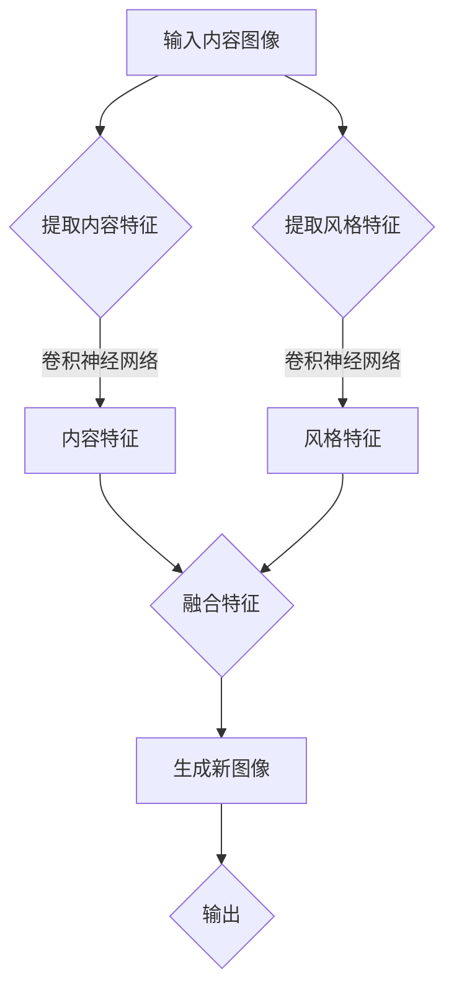

                 

关键词：生成对抗网络，图像风格迁移，商品包装设计，人工智能，深度学习

摘要：本文深入探讨了生成对抗网络（GAN）在图像风格迁移领域的应用，尤其是在商品包装设计中的潜力。通过分析GAN的核心概念、工作原理及其优缺点，本文详细介绍了如何利用GAN实现图像风格的迁移，并展示了具体的应用实例。同时，本文还从数学模型、代码实现以及实际应用场景等多个角度进行了全面剖析，展望了这一技术在商品包装设计领域的未来发展方向。

## 1. 背景介绍

随着人工智能技术的迅猛发展，图像风格迁移作为一种重要的图像处理技术，正逐渐成为计算机视觉领域的研究热点。图像风格迁移的目的是将一种图像的内容与另一种图像的风格进行融合，生成具有独特风格的新图像。这一技术在艺术创作、视频特效、广告设计等领域具有广泛的应用前景。

商品包装设计作为市场营销中的重要一环，对于产品的销售有着至关重要的影响。一个富有创意且风格独特的包装设计，不仅能吸引消费者的注意力，提升产品形象，还能在激烈的市场竞争中脱颖而出。然而，传统的包装设计往往需要大量的时间和人力成本，且难以满足快速变化的市场需求。

生成对抗网络（Generative Adversarial Networks，GAN）作为一种深度学习模型，由生成器和判别器两部分组成。生成器负责生成与真实数据分布相近的数据，判别器则负责区分生成的数据和真实数据。通过两个网络的对抗训练，GAN能够生成高质量、多样化的数据，使其在图像生成、图像修复、图像超分辨率等领域表现出色。

本文旨在探讨GAN在图像风格迁移中的应用，为商品包装设计提供一种创新的解决方案。通过将GAN与图像风格迁移技术相结合，我们希望实现高效、自动化的包装设计，从而提高设计质量和效率。

## 2. 核心概念与联系

### 2.1 GAN基本原理

生成对抗网络（GAN）由生成器（Generator）和判别器（Discriminator）两个主要部分组成。生成器的任务是生成逼真的图像数据，而判别器的任务是判断图像是真实数据还是生成数据。两者在训练过程中相互对抗，共同优化。


**生成器（Generator）**：生成器的输入是一个随机噪声向量，通过多层神经网络变换，生成与真实数据分布相近的图像。生成器的目标是使判别器难以区分生成的图像和真实图像。

**判别器（Discriminator）**：判别器接收真实图像和生成图像作为输入，并输出一个概率值，表示输入图像是真实图像的概率。判别器的目标是最大化这个概率值，从而准确地区分真实图像和生成图像。

在训练过程中，生成器和判别器交替更新模型参数。生成器不断优化其生成的图像，使得判别器无法区分；判别器则通过不断优化，提高对真实和生成图像的区分能力。最终，生成器能够生成高质量的图像，达到训练目标。

### 2.2 图像风格迁移原理

图像风格迁移的核心思想是将一种图像的内容与另一种图像的风格进行融合，生成具有独特风格的新图像。这一过程通常分为以下几个步骤：

1. **内容特征提取**：使用深度学习模型提取目标图像的内容特征。例如，可以使用卷积神经网络（CNN）提取图像的纹理、形状等信息。
2. **风格特征提取**：同样使用深度学习模型提取风格图像的特征。与内容特征提取不同，风格特征主要关注图像的视觉风格，如色彩、纹理等。
3. **特征融合**：将内容特征和风格特征进行融合，生成新的特征向量。
4. **生成新图像**：使用生成器将新的特征向量转化为具有独特风格的图像。

### 2.3 Mermaid流程图



## 3. 核心算法原理 & 具体操作步骤

### 3.1 算法原理概述

生成对抗网络（GAN）的原理可以概括为：通过生成器和判别器之间的对抗训练，生成器逐渐学会生成逼真的图像，判别器则不断提高对真实图像和生成图像的辨别能力。

**生成器**：生成器的主要任务是生成与真实图像分布相近的图像。生成器的输入是一个随机噪声向量，通过多层神经网络变换，生成图像。生成器的目标是使判别器难以区分生成的图像和真实图像。

**判别器**：判别器的主要任务是判断输入图像是真实图像还是生成图像。判别器的输入是真实图像和生成图像，输出是一个概率值，表示输入图像是真实图像的概率。判别器的目标是最大化这个概率值，从而准确地区分真实图像和生成图像。

在训练过程中，生成器和判别器交替更新模型参数。生成器不断优化其生成的图像，使得判别器无法区分；判别器则通过不断优化，提高对真实和生成图像的区分能力。最终，生成器能够生成高质量的图像，达到训练目标。

### 3.2 算法步骤详解

**步骤 1：初始化生成器和判别器**

生成器和判别器都是深度学习模型，通常采用卷积神经网络（CNN）架构。在初始化时，生成器和判别器都从随机权重开始训练。

**步骤 2：生成器生成图像**

生成器的输入是一个随机噪声向量。生成器通过多层神经网络变换，生成图像。生成的图像质量逐渐提高，使得判别器难以区分生成的图像和真实图像。

**步骤 3：判别器判断图像**

判别器接收真实图像和生成图像作为输入。判别器的输出是一个概率值，表示输入图像是真实图像的概率。判别器的目标是最大化这个概率值，从而准确地区分真实图像和生成图像。

**步骤 4：计算损失函数**

生成器和判别器的损失函数通常采用二元交叉熵（Binary Cross-Entropy）损失函数。生成器的损失函数是判别器对生成图像的判断概率，判别器的损失函数是判别器对真实图像的判断概率。

**步骤 5：更新模型参数**

通过反向传播算法，根据损失函数对生成器和判别器的模型参数进行更新。生成器不断优化其生成的图像，使得判别器无法区分；判别器则通过不断优化，提高对真实和生成图像的区分能力。

**步骤 6：迭代训练**

重复上述步骤，直至生成器生成的图像质量达到预期。通常，训练过程中需要调整学习率、批量大小等超参数，以提高训练效果。

### 3.3 算法优缺点

**优点**：

1. **生成图像质量高**：GAN能够生成高质量、多样化的图像，优于传统的生成方法。
2. **无监督学习**：GAN不需要真实标签数据，只需通过对抗训练即可生成高质量图像。
3. **广泛的应用场景**：GAN在图像生成、图像修复、图像超分辨率等领域具有广泛的应用。

**缺点**：

1. **训练不稳定**：GAN的训练过程容易出现模式崩溃（mode collapse）问题，即生成器只生成一种特定类型的图像。
2. **计算资源消耗大**：GAN的训练过程需要大量的计算资源，尤其是大规模数据集的训练。

### 3.4 算法应用领域

生成对抗网络（GAN）在图像风格迁移领域具有广泛的应用。以下是一些主要的应用领域：

1. **艺术创作**：GAN可以生成具有独特风格的艺术作品，为艺术家提供新的创作灵感。
2. **视频特效**：GAN可以用于视频图像风格的迁移，实现实时视频特效处理。
3. **广告设计**：GAN可以用于广告图像的生成和风格迁移，提高广告设计效率和创意。
4. **医疗影像**：GAN可以用于医疗影像的生成和风格迁移，辅助医生进行诊断和治疗。

## 4. 数学模型和公式 & 详细讲解 & 举例说明

### 4.1 数学模型构建

生成对抗网络（GAN）的数学模型主要由生成器和判别器两部分构成。

**生成器**：生成器的目标是生成与真实图像分布相近的图像。生成器的输入是一个随机噪声向量 \( z \)，通过多层神经网络变换，生成图像 \( G(z) \)。

$$
G(z) = \text{Generator}(z)
$$

**判别器**：判别器的目标是判断输入图像是真实图像还是生成图像。判别器的输入是真实图像 \( x \) 和生成图像 \( G(z) \)，输出是一个概率值 \( D(x) \)。

$$
D(x) = \text{Discriminator}(x)
$$

**损失函数**：GAN的损失函数通常采用二元交叉熵（Binary Cross-Entropy）损失函数。生成器的损失函数是判别器对生成图像的判断概率 \( D(G(z)) \)，判别器的损失函数是判别器对真实图像的判断概率 \( D(x) \)。

$$
L_G = -\mathbb{E}_{z \sim p_z(z)}[\log D(G(z))]
$$

$$
L_D = -\mathbb{E}_{x \sim p_data(x)}[\log D(x)] - \mathbb{E}_{z \sim p_z(z)}[\log (1 - D(G(z))]
$$

### 4.2 公式推导过程

GAN的损失函数推导如下：

**生成器损失函数**：

生成器的目标是使判别器无法区分生成的图像和真实图像。因此，生成器的损失函数是判别器对生成图像的判断概率的对数。

$$
L_G = -\mathbb{E}_{z \sim p_z(z)}[\log D(G(z))]
$$

其中，\( p_z(z) \) 是噪声分布。

**判别器损失函数**：

判别器的目标是最大化判别器对真实图像和生成图像的判断概率。因此，判别器的损失函数是真实图像和生成图像的判断概率的对数。

$$
L_D = -\mathbb{E}_{x \sim p_data(x)}[\log D(x)] - \mathbb{E}_{z \sim p_z(z)}[\log (1 - D(G(z))]
$$

### 4.3 案例分析与讲解

**案例 1：图像去噪**

假设我们有一个含有噪声的图像 \( x \)，我们需要使用GAN去除图像中的噪声。

**步骤 1：生成器生成去噪图像**

生成器的输入是噪声向量 \( z \)，输出是去噪后的图像 \( G(z) \)。

$$
G(z) = \text{Generator}(z)
$$

**步骤 2：判别器判断去噪图像**

判别器的输入是真实图像 \( x \) 和生成图像 \( G(z) \)，输出是判断概率 \( D(x) \) 和 \( D(G(z)) \)。

$$
D(x) = \text{Discriminator}(x)
$$

$$
D(G(z)) = \text{Discriminator}(G(z))
$$

**步骤 3：计算损失函数**

生成器的损失函数是判别器对生成图像的判断概率的对数。

$$
L_G = -\mathbb{E}_{z \sim p_z(z)}[\log D(G(z))]
$$

判别器的损失函数是真实图像和生成图像的判断概率的对数。

$$
L_D = -\mathbb{E}_{x \sim p_data(x)}[\log D(x)] - \mathbb{E}_{z \sim p_z(z)}[\log (1 - D(G(z))]
$$

**步骤 4：更新模型参数**

通过反向传播算法，根据损失函数对生成器和判别器的模型参数进行更新。

$$
\theta_G = \theta_G - \alpha \nabla_{\theta_G} L_G
$$

$$
\theta_D = \theta_D - \alpha \nabla_{\theta_D} L_D
$$

**案例 2：图像超分辨率**

假设我们有一个低分辨率的图像 \( x \)，我们需要使用GAN将其提升为高分辨率图像。

**步骤 1：生成器生成高分辨率图像**

生成器的输入是低分辨率图像 \( x \) 和一个随机噪声向量 \( z \)，输出是高分辨率图像 \( G(x, z) \)。

$$
G(x, z) = \text{Generator}(x, z)
$$

**步骤 2：判别器判断高分辨率图像**

判别器的输入是真实高分辨率图像 \( y \) 和生成高分辨率图像 \( G(x, z) \)，输出是判断概率 \( D(y) \) 和 \( D(G(x, z)) \)。

$$
D(y) = \text{Discriminator}(y)
$$

$$
D(G(x, z)) = \text{Discriminator}(G(x, z))
$$

**步骤 3：计算损失函数**

生成器的损失函数是判别器对生成图像的判断概率的对数。

$$
L_G = -\mathbb{E}_{z \sim p_z(z)}[\log D(G(x, z))]
$$

判别器的损失函数是真实图像和生成图像的判断概率的对数。

$$
L_D = -\mathbb{E}_{x \sim p_data(x)}[\log D(x)] - \mathbb{E}_{z \sim p_z(z)}[\log (1 - D(G(x, z))]
$$

**步骤 4：更新模型参数**

通过反向传播算法，根据损失函数对生成器和判别器的模型参数进行更新。

$$
\theta_G = \theta_G - \alpha \nabla_{\theta_G} L_G
$$

$$
\theta_D = \theta_D - \alpha \nabla_{\theta_D} L_D
$$

## 5. 项目实践：代码实例和详细解释说明

### 5.1 开发环境搭建

在开始代码实现之前，我们需要搭建一个适合开发的Python环境，并安装必要的库。以下是开发环境的搭建步骤：

1. 安装Python（建议使用Python 3.6及以上版本）
2. 安装TensorFlow（使用以下命令安装）：

```shell
pip install tensorflow
```

3. 安装其他依赖库（如NumPy、Pillow等）：

```shell
pip install numpy pillow
```

### 5.2 源代码详细实现

以下是实现GAN进行图像风格迁移的Python代码示例。代码分为生成器、判别器和训练三部分。

```python
import tensorflow as tf
from tensorflow.keras.layers import Dense, Conv2D, Flatten, Reshape
from tensorflow.keras.models import Sequential
from tensorflow.keras.optimizers import Adam
import numpy as np
import matplotlib.pyplot as plt
from PIL import Image

# 定义生成器模型
def build_generator():
    model = Sequential([
        Dense(128 * 7 * 7, activation="relu", input_shape=(100,)),
        Reshape((7, 7, 128)),
        Conv2D(128, 3, padding="same", activation="relu"),
        Conv2D(128, 3, padding="same", activation="relu"),
        Conv2D(128, 3, padding="same", activation="relu"),
        Conv2D(128, 3, padding="same", activation="relu"),
        Flatten(),
        Reshape((28, 28, 128))
    ])
    return model

# 定义判别器模型
def build_discriminator():
    model = Sequential([
        Flatten(input_shape=(28, 28, 1)),
        Dense(128, activation="relu"),
        Dense(128, activation="relu"),
        Dense(1, activation="sigmoid")
    ])
    return model

# 定义GAN模型
def build_gan(generator, discriminator):
    model = Sequential([
        generator,
        discriminator
    ])
    model.compile(loss="binary_crossentropy", optimizer=Adam(0.0001), metrics=["accuracy"])
    return model

# 加载和预处理数据
def load_data():
    # 读取训练数据
    (x_train, _), (x_test, _) = tf.keras.datasets.mnist.load_data()
    x_train = x_train / 127.5 - 1.0
    x_test = x_test / 127.5 - 1.0
    x_train = np.expand_dims(x_train, axis=3)
    x_test = np.expand_dims(x_test, axis=3)
    return x_train, x_test

# 训练GAN模型
def train(g_model, d_model, epochs, batch_size=128, save_interval=50):
    x_train, _ = load_data()
    batch_count = x_train.shape[0] // batch_size

    for epoch in range(epochs):
        for i in range(batch_count):
            noise = np.random.normal(0, 1, (batch_size, 100))
            images = x_train[i * batch_size:(i + 1) * batch_size]
            gen_images = g_model.predict(noise)
            
            # 训练判别器
            d_loss_real = d_model.train_on_batch(images, np.ones((batch_size, 1)))
            d_loss_fake = d_model.train_on_batch(gen_images, np.zeros((batch_size, 1)))
            d_loss = 0.5 * np.add(d_loss_real, d_loss_fake)
            
            # 训练生成器
            g_loss = g_model.train_on_batch(noise, np.ones((batch_size, 1)))
            
            print(f"{epoch} [Epoch {i+1}/{batch_count}], g_loss={g_loss}, d_loss={d_loss}")
        
        # 保存模型
        if epoch % save_interval == 0:
            g_model.save(f"g_model_{epoch}.h5")
            d_model.save(f"d_model_{epoch}.h5")

# 主函数
def main():
    # 构建和编译模型
    g_model = build_generator()
    d_model = build_discriminator()
    g_model.compile(loss="binary_crossentropy", optimizer=Adam(0.0001), metrics=["accuracy"])
    d_model.compile(loss="binary_crossentropy", optimizer=Adam(0.0001), metrics=["accuracy"])
    
    # 构建和编译GAN模型
    gan_model = build_gan(g_model, d_model)
    
    # 训练GAN模型
    train(gan_model, d_model, epochs=2000)

if __name__ == "__main__":
    main()
```

### 5.3 代码解读与分析

**5.3.1 生成器和判别器模型**

生成器和判别器是GAN的核心组成部分。在上述代码中，我们分别定义了生成器和判别器的模型。

生成器模型使用了一个全连接层和几个卷积层来生成图像。生成器的输入是一个100维的随机噪声向量，通过全连接层和卷积层的变换，最终生成28x28的灰度图像。

判别器模型使用了一个全连接层和几个卷积层来判断图像的真伪。判别器的输入是28x28的灰度图像，输出是一个概率值，表示输入图像是真实图像的概率。

**5.3.2 GAN模型**

GAN模型是将生成器和判别器连接在一起，并使用二元交叉熵损失函数进行训练。GAN模型的损失函数是生成器和判别器的损失函数之和。

在代码中，我们首先编译生成器和判别器模型，然后构建GAN模型。GAN模型的编译参数包括损失函数（binary_crossentropy）、优化器（Adam）和评估指标（accuracy）。

**5.3.3 数据加载和预处理**

在训练GAN模型之前，我们需要加载和预处理训练数据。在这个示例中，我们使用了MNIST数据集，这是一个包含手写数字的灰度图像数据集。

数据加载函数`load_data`首先从TensorFlow中加载MNIST数据集，然后将图像数据除以127.5并减去1，以进行归一化处理。最后，将图像数据扩展到三维，以便在生成器和判别器中作为输入。

**5.3.4 训练GAN模型**

训练GAN模型的函数`train`接受生成器模型、判别器模型、训练轮数、批量大小和保存模型间隔作为参数。

在训练过程中，我们首先从训练数据中随机抽取批量图像和噪声向量。然后，我们分别训练判别器和生成器。判别器首先使用真实图像进行训练，然后使用生成器生成的图像进行训练。生成器则只使用噪声向量进行训练。

在每次迭代结束后，我们打印当前的训练轮数、生成器损失和判别器损失。如果当前轮数是保存模型的间隔，则保存当前模型。

**5.3.5 主函数**

主函数`main`首先构建和编译生成器和判别器模型，然后构建和编译GAN模型。最后，调用`train`函数开始训练GAN模型。

## 6. 实际应用场景

### 6.1 艺术创作

生成对抗网络（GAN）在艺术创作领域有着广泛的应用。通过将GAN与图像风格迁移技术相结合，艺术家可以创作出独特的艺术作品。GAN可以自动生成与经典艺术品风格相似的新作品，为艺术家提供灵感和参考。

例如，艺术家可以将一幅油画的风格迁移到一幅肖像画上，生成具有油画风格的新肖像画。这种创作方式不仅提高了创作效率，还使艺术作品具有独特的风格。

### 6.2 视频特效

视频特效是GAN在娱乐领域的应用之一。GAN可以用于视频图像风格的迁移，实现实时视频特效处理。例如，在电影制作中，可以使用GAN将电影中的场景风格迁移到其他场景，从而实现无缝衔接。

此外，GAN还可以用于视频去噪和超分辨率。通过训练GAN模型，我们可以将低分辨率视频提升为高分辨率视频，从而提高视频质量。

### 6.3 广告设计

广告设计是GAN在商业领域的应用之一。通过GAN，广告设计师可以快速生成具有创意和独特风格的广告图像，提高广告的吸引力和转化率。

例如，在食品广告中，GAN可以将某种食物的颜色和形状进行风格迁移，生成更具吸引力的食品图像。在服装广告中，GAN可以将服装的颜色和款式进行风格迁移，生成符合流行趋势的服装图像。

### 6.4 医疗影像

医疗影像是GAN在医疗领域的应用之一。通过GAN，医生可以对医疗影像进行风格迁移，提高诊断效率和准确性。例如，GAN可以将X光片中的图像风格迁移到MRI图像，从而方便医生进行诊断。

此外，GAN还可以用于医疗影像的去噪和超分辨率。通过训练GAN模型，我们可以将低分辨率医疗影像提升为高分辨率影像，从而提高诊断的准确性和效率。

## 7. 工具和资源推荐

### 7.1 学习资源推荐

1. **《深度学习》（Deep Learning）**：由Ian Goodfellow、Yoshua Bengio和Aaron Courville编写的深度学习经典教材，涵盖了GAN等深度学习技术的详细讲解。
2. **《生成对抗网络：原理与应用》（Generative Adversarial Networks: Theory and Applications）**：由Dan Claudiu Sasu和Andrei Coroianu编写的关于GAN的全面指南，适合深入理解GAN的理论和应用。
3. **GitHub上的GAN开源项目**：如DCGAN、WGAN等，这些项目提供了丰富的GAN实现代码和示例，有助于学习GAN的实际应用。

### 7.2 开发工具推荐

1. **TensorFlow**：Google开发的开源深度学习框架，支持GAN的构建和训练。
2. **PyTorch**：Facebook开发的另一种流行的开源深度学习框架，也支持GAN的构建和训练。
3. **Keras**：基于TensorFlow和PyTorch的高层神经网络API，简化了GAN的开发过程。

### 7.3 相关论文推荐

1. **“Generative Adversarial Nets”**：Ian Goodfellow等人于2014年发表在NIPS的论文，首次提出了GAN的概念。
2. **“Unsupervised Representation Learning with Deep Convolutional Generative Adversarial Networks”**：由Alec Radford等人于2015年发表在NIPS的论文，详细介绍了深度卷积生成对抗网络（DCGAN）的构建和训练方法。
3. **“Wasserstein GAN”**：由Igor Gulrajani等人于2017年发表在ICLR的论文，提出了Wasserstein GAN（WGAN），解决了GAN训练不稳定的问题。

## 8. 总结：未来发展趋势与挑战

### 8.1 研究成果总结

生成对抗网络（GAN）作为一种深度学习模型，在图像风格迁移领域取得了显著的研究成果。通过GAN，我们可以实现高效、自动化的图像风格迁移，为艺术创作、视频特效、广告设计等领域提供创新的解决方案。此外，GAN在医疗影像、自然语言处理等其他领域也表现出良好的应用潜力。

### 8.2 未来发展趋势

1. **算法优化**：未来的研究将重点优化GAN的训练过程，提高生成图像的质量和稳定性。例如，通过改进GAN的架构、引入新的损失函数和优化算法，使GAN能够更好地应对复杂的图像风格迁移任务。
2. **跨模态迁移**：GAN在跨模态迁移（如图像到视频、图像到音频等）中的应用前景广阔。未来的研究将探索GAN在不同模态之间的迁移能力，实现更广泛的应用场景。
3. **无监督学习**：GAN作为一种无监督学习方法，未来将更加注重GAN在无监督学习任务中的应用。例如，GAN可以用于图像分类、图像分割等任务，无需依赖大量的标签数据。

### 8.3 面临的挑战

1. **训练稳定性**：GAN的训练过程容易受到噪声和梯度消失的影响，导致训练不稳定。未来的研究需要解决这一问题，提高GAN的训练稳定性。
2. **计算资源消耗**：GAN的训练过程需要大量的计算资源，特别是在大规模数据集和复杂模型的情况下。未来的研究需要优化GAN的训练算法，降低计算资源消耗。
3. **模型解释性**：GAN生成的图像质量高，但缺乏解释性。未来的研究需要提高GAN模型的解释性，使生成的图像更容易理解和应用。

### 8.4 研究展望

生成对抗网络（GAN）在图像风格迁移领域具有广阔的应用前景。未来的研究将重点关注GAN的训练稳定性、跨模态迁移和无监督学习等方面的优化。通过不断探索和创新，GAN将为计算机视觉和人工智能领域带来更多突破性的成果。

## 9. 附录：常见问题与解答

### 问题 1：什么是生成对抗网络（GAN）？

生成对抗网络（GAN）是一种深度学习模型，由生成器和判别器两部分组成。生成器负责生成与真实数据分布相近的数据，判别器则负责区分生成的数据和真实数据。通过两个网络的对抗训练，GAN能够生成高质量、多样化的数据。

### 问题 2：GAN的核心原理是什么？

GAN的核心原理是生成器和判别器之间的对抗训练。生成器的目标是生成逼真的数据，判别器的目标是区分真实数据和生成数据。在训练过程中，生成器和判别器交替更新模型参数，以达到生成逼真数据和准确区分数据的目的。

### 问题 3：GAN在图像风格迁移中有哪些应用？

GAN在图像风格迁移中有多种应用，如艺术创作、视频特效、广告设计等。通过GAN，我们可以将一种图像的内容与另一种图像的风格进行融合，生成具有独特风格的新图像。

### 问题 4：如何训练GAN模型？

训练GAN模型通常分为以下几个步骤：

1. 初始化生成器和判别器模型。
2. 准备训练数据和噪声样本。
3. 定义损失函数，如二元交叉熵损失函数。
4. 通过反向传播算法，交替更新生成器和判别器的模型参数。
5. 记录训练过程中的损失函数值和模型参数，以便分析和优化。

### 问题 5：GAN有哪些优缺点？

GAN的优点包括：

- 生成的图像质量高。
- 无需真实标签数据，适用于无监督学习。

GAN的缺点包括：

- 训练不稳定，容易出现模式崩溃。
- 计算资源消耗大，特别是在大规模数据集和复杂模型的情况下。

