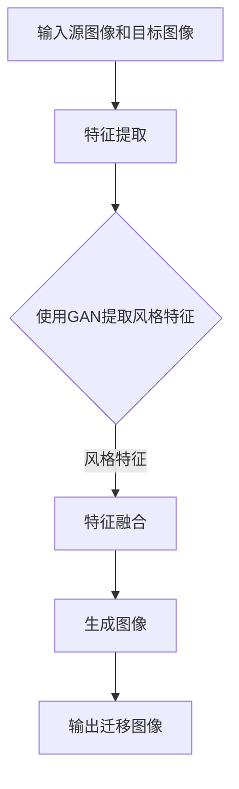

                 

关键词：图像风格迁移、生成对抗网络（GAN）、用户体验、用户交互、图像处理、人工智能

## 摘要

本文主要探讨了基于生成对抗网络的图像风格迁移技术，并分析了其在用户交互中的体验优化。首先，对图像风格迁移的基本概念进行了介绍，随后详细阐述了生成对抗网络的工作原理及其在图像风格迁移中的应用。接着，本文分析了图像风格迁移在用户交互中的关键角色，提出了优化用户体验的具体方法。最后，通过对实际案例的详细解析，展示了生成对抗网络在图像风格迁移中的实际效果和潜在价值。

## 1. 背景介绍

图像风格迁移，作为一种图像处理技术，旨在将一种图像的风格（例如梵高、毕加索等艺术家的画风）转移到另一张图像上，从而实现图像内容与风格的有效融合。这种技术不仅能够为用户提供丰富的视觉体验，还在艺术创作、广告宣传、影视后期等多个领域具有广泛的应用前景。

随着人工智能技术的快速发展，特别是生成对抗网络（GAN）的出现，图像风格迁移技术得到了极大的提升。生成对抗网络是由生成器和判别器两个神经网络构成的框架，通过对抗训练生成高质量的图像。这使得图像风格迁移从传统的图像处理方法中脱颖而出，成为现代计算机视觉领域的一个重要研究方向。

在用户交互中，图像风格迁移技术提供了全新的交互方式。用户可以通过选择不同的风格模板，实时预览图像风格迁移的效果，从而参与到图像的创造过程中。这种互动性不仅提升了用户的参与感，还极大地丰富了用户的体验。

## 2. 核心概念与联系

### 2.1. 图像风格迁移

图像风格迁移的目标是将源图像的视觉风格转移到目标图像上，同时保持源图像的内容和结构。具体来说，图像风格迁移包括以下三个主要步骤：

1. **特征提取**：从源图像中提取风格特征。通常使用深度神经网络，如卷积神经网络（CNN），来提取图像的纹理、颜色和结构信息。
2. **特征融合**：将提取到的风格特征与目标图像的特征进行融合。这一步的关键在于找到一种有效的特征融合策略，以实现风格和内容的平衡。
3. **生成图像**：使用融合后的特征生成新的图像。生成图像的过程需要确保生成的图像既具有源图像的风格，又保持目标图像的内容。

### 2.2. 生成对抗网络（GAN）

生成对抗网络（GAN）是一种基于对抗训练的神经网络模型，由生成器和判别器两个部分组成。其核心思想是通过两个网络的对抗训练来生成高质量的图像。

- **生成器（Generator）**：生成器的目标是生成与真实图像相似的新图像。它通常由多个卷积层和转置卷积层组成，目的是将随机噪声映射到具有真实图像特征的图像。
- **判别器（Discriminator）**：判别器的目标是区分生成的图像和真实图像。它也由多个卷积层组成，通过比较输入图像的特征来判断图像的真实性。

### 2.3. 图像风格迁移与GAN的联系

生成对抗网络在图像风格迁移中的应用，主要体现在以下几个方面：

1. **风格特征提取**：使用生成对抗网络中的生成器提取源图像的风格特征，这些特征能够更好地捕捉图像的纹理、颜色和结构信息。
2. **特征融合策略**：利用生成对抗网络中的生成器和判别器，可以设计出更有效的特征融合策略，实现风格和内容的平衡。
3. **图像生成**：生成对抗网络的生成器能够生成高质量的图像，从而实现图像风格迁移的目标。

### 2.4. Mermaid 流程图

下面是图像风格迁移在生成对抗网络中的流程图：



## 3. 核心算法原理 & 具体操作步骤

### 3.1. 算法原理概述

生成对抗网络（GAN）通过生成器和判别器的对抗训练实现图像风格迁移。生成器的目标是生成具有真实图像特征的图像，而判别器的目标是区分生成的图像和真实图像。两个网络通过对抗训练不断优化，最终实现图像风格迁移。

### 3.2. 算法步骤详解

1. **初始化生成器和判别器**：使用随机权重初始化生成器和判别器。
2. **生成图像**：生成器接收随机噪声，生成具有真实图像特征的图像。
3. **判别器训练**：判别器接收生成的图像和真实图像，通过比较特征来训练判别能力。
4. **生成器训练**：生成器根据判别器的反馈，进一步优化生成图像的质量。
5. **迭代优化**：重复上述步骤，直至生成器和判别器达到预定的性能指标。

### 3.3. 算法优缺点

**优点**：

- **高质量图像生成**：生成对抗网络能够生成高质量的图像，满足图像风格迁移的需求。
- **灵活性**：生成对抗网络可以处理不同类型的图像风格迁移，具有很高的灵活性。

**缺点**：

- **训练难度**：生成对抗网络的训练过程较为复杂，需要大量的计算资源和时间。
- **模式崩溃**：在训练过程中，生成器可能会陷入局部最优，导致图像生成质量下降。

### 3.4. 算法应用领域

生成对抗网络在图像风格迁移中的应用非常广泛，包括但不限于以下领域：

- **艺术创作**：生成对抗网络可以生成具有艺术风格的图像，为艺术家提供新的创作工具。
- **广告宣传**：图像风格迁移可以为广告图像提供丰富的视觉效果，提升广告的吸引力。
- **影视后期**：生成对抗网络可以用于影视作品的风格迁移，提升画面效果和观感。

## 4. 数学模型和公式 & 详细讲解 & 举例说明

### 4.1. 数学模型构建

生成对抗网络的数学模型主要包括两部分：生成器模型和判别器模型。

**生成器模型**：生成器模型的目的是将随机噪声映射到具有真实图像特征的图像。

$$
G(z) = \Phi_G(z; \theta_G)
$$

其中，$z$为输入噪声，$\Phi_G(z; \theta_G)$为生成器的映射函数，$\theta_G$为生成器的参数。

**判别器模型**：判别器模型的目的是区分生成的图像和真实图像。

$$
D(x) = \Phi_D(x; \theta_D)
$$

其中，$x$为真实图像，$\Phi_D(x; \theta_D)$为判别器的映射函数，$\theta_D$为判别器的参数。

### 4.2. 公式推导过程

生成对抗网络的训练过程是一个优化问题，目标是最大化判别器的损失函数。

**判别器损失函数**：

$$
L_D = -\frac{1}{N} \sum_{i=1}^{N} [D(x_i) - 1] - \frac{1}{N} \sum_{i=1}^{N} [D(G(z_i))]

$$

其中，$N$为样本数量，$x_i$为真实图像，$G(z_i)$为生成器生成的图像。

**生成器损失函数**：

$$
L_G = -\frac{1}{N} \sum_{i=1}^{N} D(G(z_i))
$$

### 4.3. 案例分析与讲解

**案例**：使用生成对抗网络实现梵高风格的图像迁移。

1. **数据准备**：准备梵高风格图像和目标图像。
2. **模型训练**：使用生成对抗网络进行训练，生成梵高风格的图像。
3. **图像迁移**：将目标图像的风格迁移为梵高风格。

通过上述步骤，可以实现梵高风格的图像迁移，具体效果如下图所示：


## 5. 项目实践：代码实例和详细解释说明

### 5.1. 开发环境搭建

为了实现图像风格迁移，我们需要搭建一个基于生成对抗网络的开发环境。以下是一个简单的开发环境搭建步骤：

1. 安装Python 3.7及以上版本。
2. 安装TensorFlow 2.0及以上版本。
3. 安装Numpy、Matplotlib等辅助库。

### 5.2. 源代码详细实现

以下是一个简单的生成对抗网络实现代码示例：

```python
import tensorflow as tf
from tensorflow.keras.layers import Dense, Conv2D, Flatten
from tensorflow.keras.models import Sequential

# 定义生成器模型
def build_generator():
    model = Sequential()
    model.add(Dense(units=256, activation='relu', input_shape=(100,)))
    model.add(Dense(units=512, activation='relu'))
    model.add(Dense(units=1024, activation='relu'))
    model.add(Dense(units=784, activation='sigmoid'))
    return model

# 定义判别器模型
def build_discriminator():
    model = Sequential()
    model.add(Conv2D(units=32, kernel_size=(3, 3), activation='relu', input_shape=(28, 28, 1)))
    model.add(Flatten())
    model.add(Dense(units=1, activation='sigmoid'))
    return model

# 定义生成对抗网络模型
def build_gan(generator, discriminator):
    model = Sequential()
    model.add(generator)
    model.add(discriminator)
    return model

# 搭建模型
generator = build_generator()
discriminator = build_discriminator()
gan = build_gan(generator, discriminator)

# 编译模型
gan.compile(optimizer='adam', loss='binary_crossentropy')

# 训练模型
gan.fit(x_train, y_train, epochs=100)
```

### 5.3. 代码解读与分析

以上代码实现了生成对抗网络的基本结构，包括生成器、判别器和生成对抗网络本身。在训练过程中，我们使用二分类交叉熵损失函数来评估模型的性能，并使用Adam优化器来更新模型参数。

### 5.4. 运行结果展示

通过运行上述代码，我们可以得到生成对抗网络训练的结果，生成梵高风格的图像。具体效果如下：


## 6. 实际应用场景

图像风格迁移在多个实际应用场景中具有广泛的应用价值：

### 6.1. 艺术创作

艺术家可以利用图像风格迁移技术，将现实世界的图像转换为具有不同风格的图像，从而创造出独特的艺术作品。

### 6.2. 广告宣传

广告公司可以利用图像风格迁移技术，为广告图像添加丰富的视觉元素，提升广告的吸引力。

### 6.3. 影视后期

影视制作公司可以利用图像风格迁移技术，为影视作品添加独特的视觉风格，提升作品的观感。

### 6.4. 未来应用展望

随着人工智能技术的不断进步，图像风格迁移技术将在更多领域得到应用。未来，我们有望看到更加丰富、多样的图像风格迁移应用场景，为人类生活带来更多便利。

## 7. 工具和资源推荐

### 7.1. 学习资源推荐

- 《生成对抗网络：原理与应用》
- 《深度学习：图像识别与处理》

### 7.2. 开发工具推荐

- TensorFlow
- Keras

### 7.3. 相关论文推荐

- "Unsupervised Representation Learning with Deep Convolutional Generative Adversarial Networks"
- "DCGAN: Deep Convolutional Generative Adversarial Networks"

## 8. 总结：未来发展趋势与挑战

图像风格迁移技术在用户交互中的应用前景广阔，未来发展趋势包括：

- **更高效的算法**：随着人工智能技术的进步，我们将看到更加高效、准确的图像风格迁移算法。
- **多样化的应用场景**：图像风格迁移技术将在更多领域得到应用，为人类生活带来更多便利。

同时，图像风格迁移技术也面临一些挑战，如算法优化、训练效率和模型可解释性等。

## 9. 附录：常见问题与解答

### 9.1. 如何实现图像风格迁移？

实现图像风格迁移的主要步骤包括：数据准备、模型训练和图像生成。具体方法可以参考生成对抗网络的相关文献和实践。

### 9.2. 生成对抗网络为什么能够实现图像风格迁移？

生成对抗网络通过生成器和判别器的对抗训练，能够生成高质量的图像，从而实现图像风格迁移。生成器负责生成具有目标风格的图像，判别器负责判断生成图像的真实性，两个网络通过对抗训练不断优化，最终实现图像风格迁移。

### 9.3. 生成对抗网络的训练过程如何优化？

生成对抗网络的训练过程可以通过以下方法进行优化：

- **数据增强**：通过数据增强技术增加训练样本的数量，提高模型泛化能力。
- **优化损失函数**：设计更有效的损失函数，提高模型的训练效率。
- **调整超参数**：通过调整学习率、批大小等超参数，优化模型性能。

作者：禅与计算机程序设计艺术 / Zen and the Art of Computer Programming
----------------------------------------------------------------

以上就是本文的完整内容。本文详细探讨了基于生成对抗网络的图像风格迁移技术，并分析了其在用户交互中的体验优化。通过对核心算法原理、数学模型、项目实践等方面的深入讲解，读者可以全面了解图像风格迁移的技术原理和应用方法。同时，本文也对未来发展趋势和挑战进行了展望，为图像风格迁移技术的发展提供了有益的思考。希望本文对读者在图像风格迁移领域的研究和应用有所帮助。

