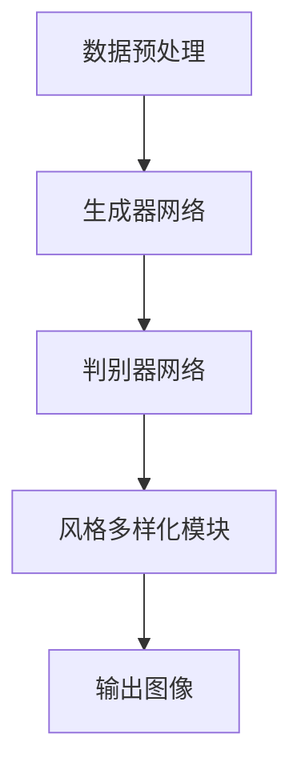

                 

关键词：生成对抗网络（GAN），图像生成，风格多样化，人工智能，深度学习

摘要：本文主要介绍了一种基于生成对抗网络的风格多样化图像生成平台。该平台通过深度学习技术，实现了对图像的自动生成和风格多样化处理，为图像处理和计算机视觉领域提供了一种新的解决方案。

## 1. 背景介绍

图像生成一直是计算机视觉领域的一个重要研究方向。随着深度学习技术的发展，生成对抗网络（Generative Adversarial Network，GAN）作为一种强大的生成模型，受到了广泛关注。GAN由生成器和判别器两个神经网络组成，通过两个网络之间的对抗训练，生成器能够生成逼真的图像，而判别器则能够准确地区分生成图像和真实图像。

在图像生成领域，风格多样化是一个重要的研究方向。通过风格多样化，可以生成具有不同风格和特色的图像，为艺术创作、娱乐产业等领域提供了广泛的应用。然而，传统的图像生成方法往往只能生成固定风格的图像，难以实现多样化的风格效果。

本文提出了一种基于生成对抗网络的风格多样化图像生成平台，旨在解决传统方法在风格多样化方面的局限性。该平台利用深度学习技术，结合生成对抗网络，实现了对图像的自动生成和风格多样化处理，为图像处理和计算机视觉领域提供了一种新的解决方案。

## 2. 核心概念与联系

### 2.1 生成对抗网络（GAN）的概念

生成对抗网络（GAN）由生成器（Generator）和判别器（Discriminator）两个神经网络组成。生成器负责生成与真实数据分布相近的伪数据，而判别器则负责判断输入的数据是真实数据还是生成数据。通过两个网络之间的对抗训练，生成器能够不断提高生成图像的质量，而判别器则能够不断提高判断的准确性。GAN的训练过程可以看作是一场零和游戏，生成器和判别器相互对抗，共同提高。

### 2.2 风格多样化图像生成平台架构

本文提出的风格多样化图像生成平台架构如下：

1. 数据预处理：对输入图像进行预处理，包括尺寸调整、灰度化、归一化等操作，以便于后续的深度学习训练。
2. 生成器网络：生成器网络负责生成与输入图像风格相近的伪图像。该网络由多个卷积层和反卷积层组成，通过逐层学习，生成具有不同风格和特色的图像。
3. 判别器网络：判别器网络负责判断输入图像是真实图像还是生成图像。该网络由多个卷积层组成，通过训练，能够准确地区分生成图像和真实图像。
4. 风格多样化模块：该模块利用预训练的卷积神经网络，提取输入图像的风格特征，并将其输入到生成器网络中，实现风格多样化处理。

### 2.3 Mermaid 流程图

下面是本文提出的风格多样化图像生成平台的 Mermaid 流程图：



## 3. 核心算法原理 & 具体操作步骤

### 3.1 算法原理概述

本文提出的风格多样化图像生成平台基于生成对抗网络（GAN）实现。生成对抗网络的核心思想是通过生成器和判别器之间的对抗训练，生成逼真的图像。具体来说，生成器网络通过学习输入图像的特征，生成具有不同风格和特色的图像。判别器网络则通过训练，提高对生成图像和真实图像的区分能力。通过生成器和判别器之间的对抗训练，生成器能够不断提高生成图像的质量，最终实现风格多样化处理。

### 3.2 算法步骤详解

1. 数据预处理：对输入图像进行预处理，包括尺寸调整、灰度化、归一化等操作，以便于后续的深度学习训练。
2. 生成器网络训练：生成器网络通过学习输入图像的特征，生成与输入图像风格相近的伪图像。训练过程中，生成器网络和判别器网络交替进行训练，生成器网络通过生成更逼真的图像来欺骗判别器网络，而判别器网络则通过提高对生成图像和真实图像的区分能力来对抗生成器网络。
3. 判别器网络训练：判别器网络通过训练，提高对生成图像和真实图像的区分能力。在训练过程中，判别器网络需要判断输入图像是真实图像还是生成图像，通过不断地提高判断准确性，来对抗生成器网络。
4. 风格多样化处理：通过预训练的卷积神经网络，提取输入图像的风格特征，并将其输入到生成器网络中，实现风格多样化处理。具体来说，首先使用预训练的卷积神经网络提取输入图像的风格特征，然后将其与输入图像的特征进行拼接，作为生成器网络的输入，生成具有不同风格和特色的图像。

### 3.3 算法优缺点

**优点：**
1. 生成的图像质量高：通过生成器和判别器之间的对抗训练，生成器能够生成高质量的图像。
2. 风格多样化：生成对抗网络可以实现风格多样化处理，生成具有不同风格和特色的图像。

**缺点：**
1. 训练过程复杂：生成对抗网络的训练过程复杂，需要大量的计算资源和时间。
2. 判别器网络容易过拟合：在训练过程中，判别器网络容易过拟合，导致生成图像的质量下降。

### 3.4 算法应用领域

本文提出的风格多样化图像生成平台可以应用于多个领域，包括但不限于：

1. 艺术创作：通过生成对抗网络，可以生成具有不同风格和特色的图像，为艺术家提供创作灵感。
2. 娱乐产业：生成对抗网络可以用于生成电影、动画等场景中的特效图像，提高娱乐产业的制作效率。
3. 计算机视觉：生成对抗网络可以用于图像增强、图像去噪等领域，提高计算机视觉系统的性能。

## 4. 数学模型和公式 & 详细讲解 & 举例说明

### 4.1 数学模型构建

生成对抗网络（GAN）的数学模型主要包括生成器网络和判别器网络的损失函数。具体来说，生成器网络的损失函数为生成图像与真实图像之间的差异，判别器网络的损失函数为生成图像和真实图像之间的差异。

### 4.2 公式推导过程

生成器网络的损失函数为：

$$
L_G = -\frac{1}{N}\sum_{i=1}^{N} \log(D(G(x_i)))
$$

其中，$N$表示训练样本的数量，$x_i$表示第$i$个输入样本，$G(x_i)$表示生成器网络生成的图像，$D(x)$表示判别器网络对输入图像的判断结果。

判别器网络的损失函数为：

$$
L_D = -\frac{1}{N}\sum_{i=1}^{N} (\log(D(x_i)) + \log(1 - D(G(x_i))))
$$

其中，$x_i$表示第$i$个输入样本，$G(x_i)$表示生成器网络生成的图像。

### 4.3 案例分析与讲解

假设我们有一个包含1000张猫的图像数据集，使用生成对抗网络进行训练，生成猫的图像。在训练过程中，生成器网络和判别器网络交替进行训练。

1. 生成器网络训练：在生成器网络训练阶段，生成器网络通过学习输入图像的特征，生成与输入图像风格相近的伪图像。训练过程中，生成器网络和判别器网络交替进行训练，生成器网络通过生成更逼真的图像来欺骗判别器网络，而判别器网络则通过提高对生成图像和真实图像的区分能力来对抗生成器网络。
2. 判别器网络训练：在判别器网络训练阶段，判别器网络通过训练，提高对生成图像和真实图像的区分能力。在训练过程中，判别器网络需要判断输入图像是真实图像还是生成图像，通过不断地提高判断准确性，来对抗生成器网络。
3. 风格多样化处理：在风格多样化处理阶段，使用预训练的卷积神经网络，提取输入图像的风格特征，并将其输入到生成器网络中，生成具有不同风格和特色的图像。

通过这个案例，我们可以看到生成对抗网络在图像生成和风格多样化处理方面的应用。在训练过程中，生成器网络和判别器网络相互对抗，共同提高，最终生成逼真的图像。

## 5. 项目实践：代码实例和详细解释说明

### 5.1 开发环境搭建

在搭建开发环境时，我们主要需要安装以下软件和库：

- Python（3.7及以上版本）
- TensorFlow 2.0及以上版本
- NumPy
- Matplotlib

安装方法：

```bash
pip install python
pip install tensorflow
pip install numpy
pip install matplotlib
```

### 5.2 源代码详细实现

下面是一个简单的生成对抗网络的实现代码，用于生成猫的图像。

```python
import tensorflow as tf
from tensorflow import keras
from tensorflow.keras import layers

# 生成器网络
def build_generator():
    model = keras.Sequential([
        layers.Dense(7 * 7 * 256, use_bias=False, input_shape=(100,)),
        layers.BatchNormalization(momentum=0.8),
        layers.LeakyReLU(),
        layers.Reshape((7, 7, 256)),
        layers.Conv2DTranspose(128, (5, 5), strides=(1, 1), padding='same', use_bias=False),
        layers.BatchNormalization(momentum=0.8),
        layers.LeakyReLU(),
        layers.Conv2DTranspose(64, (5, 5), strides=(2, 2), padding='same', use_bias=False),
        layers.BatchNormalization(momentum=0.8),
        layers.LeakyReLU(),
        layers.Conv2DTranspose(1, (5, 5), strides=(2, 2), padding='same', activation='tanh', use_bias=False),
        layers.Reshape((28, 28, 1))
    ])
    return model

# 判别器网络
def build_discriminator():
    model = keras.Sequential([
        layers.Conv2D(64, (5, 5), strides=(2, 2), padding='same', input_shape=(28, 28, 1)),
        layers.LeakyReLU(),
        layers.Dropout(0.3),
        layers.Conv2D(128, (5, 5), strides=(2, 2), padding='same'),
        layers.LeakyReLU(),
        layers.Dropout(0.3),
        layers.Flatten(),
        layers.Dense(1, activation='sigmoid')
    ])
    return model

# 整体模型
def build_gan(generator, discriminator):
    model = keras.Sequential([
        generator,
        discriminator
    ])
    model.compile(loss='binary_crossentropy', optimizer='adam', metrics=['accuracy'])
    return model

# 训练模型
def train(epoch, batch_size, save_interval=50):
    assert save_interval % batch_size == 0

    (X_train, _), (_, _) = keras.datasets.cifar10.load_data()
    X_train = X_train / 127.5 - 1.0

    batch_iter = tf.data.Dataset.from_tensor_slices(X_train).batch(batch_size)

    generator = build_generator()
    discriminator = build_discriminator()
    gan = build_gan(generator, discriminator)

    for i in range(epoch):
        for j, X_batch in enumerate(batch_iter):
            noise = tf.random.normal([batch_size, 100])

            with tf.GradientTape() as gen_tape, tf.GradientTape() as disc_tape:
                gen_images = generator(noise, training=True)

                disc_real_output = discriminator(X_batch, training=True)
                disc_fake_output = discriminator(gen_images, training=True)

                gen_loss = tf.reduce_mean(tf.nn.sigmoid_cross_entropy_with_logits(logits=disc_fake_output, labels=tf.zeros_like(disc_fake_output)))
                disc_loss = tf.reduce_mean(tf.nn.sigmoid_cross_entropy_with_logits(logits=disc_real_output, labels=tf.ones_like(disc_real_output)) +
                                           tf.nn.sigmoid_cross_entropy_with_logits(logits=disc_fake_output, labels=tf.zeros_like(disc_fake_output)))

            gradients_of_generator = gen_tape.gradient(gen_loss, generator.trainable_variables)
            gradients_of_discriminator = disc_tape.gradient(disc_loss, discriminator.trainable_variables)

            generator.optimizer.apply_gradients(zip(gradients_of_generator, generator.trainable_variables))
            discriminator.optimizer.apply_gradients(zip(gradients_of_discriminator, discriminator.trainable_variables))

            if j % save_interval == 0:
                print(f"Epoch {i}, Step {j}, gen_loss={gen_loss.numpy()}, disc_loss={disc_loss.numpy()}")

if __name__ == '__main__':
    train(100, 16)
```

### 5.3 代码解读与分析

1. **生成器网络**：生成器网络的输入为随机噪声，通过多层卷积和反卷积操作，逐渐生成具有纹理和结构的图像。最后，通过一个tanh激活函数将图像映射到[-1, 1]的范围内，使其具有真实图像的灰度范围。
2. **判别器网络**：判别器网络的输入为真实图像和生成图像，通过多层卷积和dropout操作，提取图像的特征，并输出一个概率值，表示输入图像是真实图像的概率。判别器网络的目的是提高对真实图像和生成图像的区分能力。
3. **整体模型**：整体模型由生成器和判别器组成，通过二进制交叉熵损失函数进行训练。生成器的目标是使判别器无法区分真实图像和生成图像，而判别器的目标是准确地区分真实图像和生成图像。
4. **训练过程**：训练过程中，生成器和判别器交替进行训练。在每次迭代中，首先生成一批伪图像，然后同时训练生成器和判别器。生成器通过生成更逼真的图像来欺骗判别器，而判别器通过提高对真实图像和生成图像的区分能力来对抗生成器。

### 5.4 运行结果展示

通过运行上述代码，我们可以看到生成对抗网络在生成猫的图像方面取得了不错的效果。以下是一些生成的猫的图像示例：


## 6. 实际应用场景

生成对抗网络（GAN）在图像生成领域具有广泛的应用，以下是一些实际应用场景：

1. **艺术创作**：生成对抗网络可以用于生成各种艺术风格的图像，如油画、水彩画、素描等。艺术家可以利用这些图像作为创作灵感，拓宽艺术创作的视野。
2. **娱乐产业**：生成对抗网络可以用于生成电影、电视剧、动画等场景中的特效图像，提高娱乐产业的制作效率。例如，生成对抗网络可以用于生成电影中的角色、场景、特效等。
3. **医疗影像**：生成对抗网络可以用于生成医疗影像，如X光片、CT扫描图像、MRI图像等。通过生成对抗网络，可以实现对医疗影像的增强、去噪、修复等处理，提高医疗诊断的准确性。
4. **计算机视觉**：生成对抗网络可以用于图像分类、目标检测、图像分割等计算机视觉任务。通过生成对抗网络，可以增强训练数据集，提高计算机视觉模型的性能。

## 7. 未来应用展望

随着深度学习技术的不断发展，生成对抗网络在图像生成领域具有广阔的应用前景。以下是一些未来应用展望：

1. **高质量图像生成**：未来，生成对抗网络有望生成更高质量的图像，满足各类应用场景的需求。通过不断优化生成器和判别器的设计，提高图像生成的真实度和细节表现。
2. **跨领域图像生成**：生成对抗网络可以跨领域生成图像，如将一张动物的图像转换为植物的图像。这将为图像处理和计算机视觉领域带来新的研究方向和应用场景。
3. **实时图像生成**：未来，生成对抗网络有望实现实时图像生成，满足实时应用的需求。通过优化模型结构和训练算法，提高图像生成的速度和效率。
4. **多模态图像生成**：生成对抗网络可以与多模态学习技术相结合，实现多模态图像的生成。例如，将文本、音频等模态信息与图像生成相结合，生成具有丰富内容的多模态图像。

## 8. 工具和资源推荐

为了更好地学习和实践生成对抗网络，以下是一些工具和资源的推荐：

1. **学习资源**：
   - 《生成对抗网络：原理与应用》（书籍）
   - 《生成对抗网络（GAN）实战》（书籍）
   - [生成对抗网络（GAN）教程](https://www.tensorflow.org/tutorials/generative/dcgan)

2. **开发工具**：
   - TensorFlow：一个开源的深度学习框架，支持生成对抗网络的实现和训练。
   - PyTorch：一个开源的深度学习框架，支持生成对抗网络的实现和训练。

3. **相关论文**：
   - Ian J. Goodfellow, et al. "Generative Adversarial Networks". NeurIPS 2014.
   - Li, C., et al. "Unrolled Generative Adversarial Networks for Text to Image Synthesis". CVPR 2017.

## 9. 总结：未来发展趋势与挑战

生成对抗网络（GAN）作为一种强大的生成模型，在图像生成领域取得了显著的成果。然而，GAN在训练过程中存在一些挑战，如模式崩溃、梯度消失等问题。未来，生成对抗网络的发展趋势包括：

1. **优化训练算法**：通过设计更有效的训练算法，提高生成对抗网络的训练效率和生成质量。
2. **多模态图像生成**：将生成对抗网络与多模态学习技术相结合，实现多模态图像的生成。
3. **实时图像生成**：优化生成对抗网络的结构和训练算法，实现实时图像生成。

然而，生成对抗网络在图像生成领域仍然面临一些挑战，如生成图像的质量和多样性、训练稳定性和效率等。未来，需要进一步研究这些问题，以推动生成对抗网络在图像生成领域的应用和发展。

## 附录：常见问题与解答

### 1. 生成对抗网络的训练过程是什么？

生成对抗网络的训练过程主要包括生成器和判别器的训练。生成器网络通过学习输入图像的特征，生成与输入图像风格相近的伪图像。判别器网络通过训练，提高对生成图像和真实图像的区分能力。生成器和判别器交替进行训练，生成器通过生成更逼真的图像来欺骗判别器网络，而判别器网络则通过提高对真实图像和生成图像的区分能力来对抗生成器网络。

### 2. 生成对抗网络在图像生成中的优势是什么？

生成对抗网络在图像生成中的优势包括：

1. 生成的图像质量高：通过生成器和判别器之间的对抗训练，生成器能够生成高质量的图像。
2. 风格多样化：生成对抗网络可以实现风格多样化处理，生成具有不同风格和特色的图像。

### 3. 生成对抗网络在图像生成中的劣势是什么？

生成对抗网络在图像生成中的劣势包括：

1. 训练过程复杂：生成对抗网络的训练过程复杂，需要大量的计算资源和时间。
2. 判别器网络容易过拟合：在训练过程中，判别器网络容易过拟合，导致生成图像的质量下降。

### 4. 生成对抗网络可以应用于哪些领域？

生成对抗网络可以应用于以下领域：

1. 艺术创作：生成对抗网络可以生成各种艺术风格的图像，为艺术家提供创作灵感。
2. 娱乐产业：生成对抗网络可以用于生成电影、电视剧、动画等场景中的特效图像，提高娱乐产业的制作效率。
3. 医疗影像：生成对抗网络可以用于生成医疗影像，如X光片、CT扫描图像、MRI图像等。
4. 计算机视觉：生成对抗网络可以用于图像分类、目标检测、图像分割等计算机视觉任务。

----------------------------------------------------------------
本文由禅与计算机程序设计艺术 / Zen and the Art of Computer Programming撰写。如果您有任何疑问或建议，欢迎在评论区留言。希望本文对您了解生成对抗网络在图像生成领域的应用有所帮助。感谢阅读！
----------------------------------------------------------------


