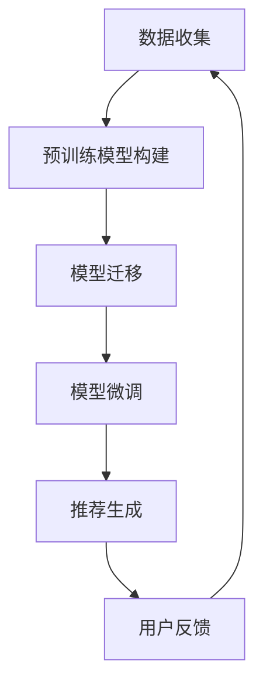
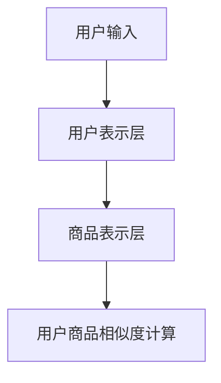

                 

关键词：迁移学习、商品推荐、跨类目、算法原理、数学模型、实践案例、应用领域、未来展望

## 摘要

本文深入探讨了基于迁移学习的跨类目商品推荐算法，旨在解决现有推荐系统在处理不同类目商品时存在的性能瓶颈。通过迁移学习技术，我们可以将预训练模型在不同类目之间迁移，以提升推荐系统的泛化能力和效率。本文首先介绍了迁移学习的基本概念和原理，随后详细阐述了基于迁移学习的跨类目商品推荐算法的核心概念、数学模型、算法步骤及其实践应用。通过具体的案例分析，本文展示了该算法在实际项目中的效果，并对未来的发展趋势和面临的挑战进行了展望。

## 1. 背景介绍

### 商品推荐系统的现状

随着互联网的快速发展，电子商务行业日益繁荣，商品推荐系统作为提升用户满意度和增加销售额的重要工具，受到了广泛关注。传统的商品推荐系统主要基于用户的历史行为数据，通过协同过滤、基于内容的推荐等算法实现。然而，这些方法在处理跨类目商品推荐时存在明显的局限性。首先，用户的历史行为数据主要集中在某一类目，难以适用于其他类目；其次，不同类目的商品特性差异较大，传统的单一推荐算法难以兼顾各类商品的特点。因此，如何有效地进行跨类目商品推荐成为当前研究的热点。

### 迁移学习与跨类目推荐

迁移学习（Transfer Learning）是近年来人工智能领域的一个重要研究方向，旨在利用已经训练好的模型在新任务上取得更好的性能。迁移学习通过在不同任务之间共享参数，避免了从头开始训练模型，大大降低了计算成本。在跨类目商品推荐中，迁移学习可以通过将预训练模型从一个类目迁移到另一个类目，利用源类目的知识提高目标类目的推荐效果。

本文将基于迁移学习技术，提出一种新的跨类目商品推荐算法。通过在多个类目之间共享模型参数，我们希望能够克服传统推荐算法在跨类目推荐时的性能瓶颈，提高推荐系统的准确性和效率。

## 2. 核心概念与联系

### 迁移学习的基本概念

迁移学习是指将一个任务在源域上学习到的知识迁移到目标域上的过程。在迁移学习中，源域和目标域可以是不同的任务，也可以是同一任务的不同子任务。源域通常是指已经积累了大量数据和模型知识的领域，而目标域则是指需要应用这些知识的领域。

迁移学习的主要目的是减少在目标域上的训练数据需求，提高模型的泛化能力。通过迁移学习，我们可以将源域上的预训练模型应用于目标域，利用源域的先验知识加速目标域上的模型训练过程。

### 跨类目商品推荐的概念

跨类目商品推荐是指在一个电子商务平台上，为用户推荐其可能感兴趣的不同类目的商品。与传统推荐系统相比，跨类目推荐需要考虑商品类目之间的差异，以实现更精准的推荐。

在跨类目商品推荐中，用户的历史行为数据通常分布在不同的类目中，传统推荐算法难以有效地利用这些数据。而基于迁移学习的跨类目商品推荐算法可以通过在类目之间共享模型参数，将源类目的知识迁移到目标类目，从而提高推荐效果。

### 迁移学习在跨类目商品推荐中的应用

基于迁移学习的跨类目商品推荐算法主要包括以下几个关键环节：

1. **预训练模型构建**：首先，在源类目上构建一个预训练模型，该模型可以基于用户行为数据和商品特征数据训练得到。
2. **模型迁移**：将预训练模型迁移到目标类目，通过在目标类目上的数据对模型进行微调，使其适应目标类目的特性。
3. **推荐生成**：利用迁移后的模型生成推荐列表，为用户推荐不同类目的商品。

### 迁移学习与跨类目推荐的联系

迁移学习与跨类目推荐之间存在紧密的联系。通过迁移学习，我们可以将源类目的知识迁移到目标类目，从而实现跨类目推荐。这种迁移不仅减少了在目标类目上训练模型的数据需求，还可以提高推荐系统的泛化能力和效率。

### Mermaid 流程图

以下是一个简单的 Mermaid 流程图，展示了基于迁移学习的跨类目商品推荐算法的流程：



在上述流程中，数据收集阶段主要包括用户行为数据和商品特征数据；预训练模型构建阶段使用源类目的数据进行模型训练；模型迁移阶段将预训练模型应用于目标类目；模型微调阶段通过目标类目的数据进行模型微调；推荐生成阶段生成推荐列表；用户反馈阶段收集用户对推荐列表的反馈，用于进一步优化推荐算法。

## 3. 核心算法原理 & 具体操作步骤

### 3.1 算法原理概述

基于迁移学习的跨类目商品推荐算法主要基于以下原理：

1. **共享表示**：在迁移学习中，共享表示是将源类目的知识迁移到目标类目的关键。通过共享表示，我们可以将不同类目的商品特征映射到同一空间，从而实现跨类目的知识迁移。
2. **预训练模型**：预训练模型是指在源类目上通过大量数据进行预训练的模型。预训练模型可以提取到一些通用的特征表示，这些特征表示在不同类目之间具有较好的迁移性。
3. **模型迁移与微调**：模型迁移是指将预训练模型应用于目标类目，通过在目标类目的数据上进行微调，使其适应目标类目的特性。模型微调可以进一步提高推荐系统的准确性和效率。

### 3.2 算法步骤详解

基于迁移学习的跨类目商品推荐算法主要包括以下步骤：

1. **数据收集**：收集用户历史行为数据（如购买记录、浏览记录等）和商品特征数据（如商品属性、价格、销量等）。
2. **预训练模型构建**：在源类目上使用收集到的数据训练一个预训练模型。预训练模型通常采用神经网络结构，如卷积神经网络（CNN）或循环神经网络（RNN）。
3. **模型迁移**：将预训练模型应用于目标类目。模型迁移可以通过共享表示层或直接迁移整个模型实现。
4. **模型微调**：在目标类目上使用微调策略对模型进行训练，使其适应目标类目的特性。微调策略可以包括冻结部分层、随机初始化部分层或全部层。
5. **推荐生成**：利用迁移后的模型生成推荐列表，为用户推荐不同类目的商品。
6. **用户反馈**：收集用户对推荐列表的反馈，用于进一步优化推荐算法。

### 3.3 算法优缺点

**优点**：

1. **提高推荐准确性**：通过在多个类目之间共享模型参数，基于迁移学习的跨类目商品推荐算法可以更好地利用用户历史行为数据，提高推荐准确性。
2. **降低计算成本**：迁移学习减少了在目标类目上训练模型的数据需求，从而降低了计算成本。
3. **提高泛化能力**：通过迁移学习，我们可以将源类目的知识迁移到目标类目，提高推荐系统的泛化能力。

**缺点**：

1. **模型迁移效果有限**：模型迁移的效果受到源类目和目标类目之间的差异影响，如果类目差异较大，模型迁移效果可能较差。
2. **数据不平衡问题**：在跨类目商品推荐中，不同类目的数据分布可能不均衡，这可能导致模型训练过程中出现数据不平衡问题。

### 3.4 算法应用领域

基于迁移学习的跨类目商品推荐算法可以应用于以下领域：

1. **电子商务平台**：在电子商务平台上，基于迁移学习的跨类目商品推荐算法可以帮助平台更好地满足用户需求，提高用户满意度和销售额。
2. **搜索引擎**：在搜索引擎中，基于迁移学习的跨类目商品推荐算法可以帮助用户发现更多相关的信息，提高搜索引擎的实用性。
3. **智能助手**：在智能助手应用中，基于迁移学习的跨类目商品推荐算法可以帮助用户更好地了解和使用智能助手，提高用户体验。

## 4. 数学模型和公式 & 详细讲解 & 举例说明

### 4.1 数学模型构建

基于迁移学习的跨类目商品推荐算法的核心在于共享表示和预训练模型。在数学模型构建过程中，我们主要关注以下两个方面：

1. **用户表示**：使用一个低维向量表示用户，该向量综合了用户的历史行为和商品特征。
2. **商品表示**：使用一个低维向量表示商品，该向量综合了商品的特征信息。

为了实现共享表示，我们可以采用神经网络结构，如图 1 所示：



图 1：基于迁移学习的跨类目商品推荐算法的数学模型

### 4.2 公式推导过程

在本节中，我们将详细推导基于迁移学习的跨类目商品推荐算法的数学模型。

#### 用户表示

用户表示可以通过以下公式计算：

$$
u = f_u(x_u, c_u)
$$

其中，$u$ 是用户表示向量，$x_u$ 是用户的历史行为数据，$c_u$ 是用户的商品特征数据。$f_u$ 是一个映射函数，用于将用户的历史行为数据和商品特征数据映射到低维空间。

#### 商品表示

商品表示可以通过以下公式计算：

$$
c = f_c(x_c)
$$

其中，$c$ 是商品表示向量，$x_c$ 是商品的特征数据。$f_c$ 是一个映射函数，用于将商品的特征数据映射到低维空间。

#### 用户商品相似度计算

用户商品相似度可以通过以下公式计算：

$$
s_{ui} = \frac{u_i^T c_i}{\|u_i\| \|c_i\|}
$$

其中，$s_{ui}$ 是用户 $u$ 和商品 $i$ 的相似度，$u_i$ 是用户表示向量 $u$ 的第 $i$ 个维度，$c_i$ 是商品表示向量 $c$ 的第 $i$ 个维度。$\|u_i\|$ 和 $\|c_i\|$ 分别是用户表示向量 $u$ 和商品表示向量 $c$ 的第 $i$ 个维度的欧几里得范数。

### 4.3 案例分析与讲解

为了更好地理解基于迁移学习的跨类目商品推荐算法，我们通过一个实际案例进行分析和讲解。

#### 案例背景

假设我们有一个电子商务平台，平台上包含多个类目的商品，如电子产品、服装、家居用品等。我们需要为用户推荐其可能感兴趣的不同类目的商品。

#### 案例步骤

1. **数据收集**：收集用户的历史行为数据（如购买记录、浏览记录等）和商品特征数据（如商品属性、价格、销量等）。
2. **预训练模型构建**：在电子产品类目上使用收集到的数据训练一个预训练模型。预训练模型可以采用卷积神经网络（CNN）结构，如图 2 所示：

   ```mermaid
   graph TD
   A[输入数据] --> B[卷积层]
   B --> C[池化层]
   C --> D[全连接层]
   D --> E[输出层]
   ```

   图 2：预训练模型的卷积神经网络结构

3. **模型迁移**：将预训练模型应用于服装类目。模型迁移可以通过共享表示层实现，如图 3 所示：

   ```mermaid
   graph TD
   A[用户输入] --> B[用户表示层]
   B --> C[商品表示层]
   C --> D[用户商品相似度计算]
   D --> E[服装类目预训练模型]
   ```

   图 3：模型迁移后的跨类目商品推荐算法结构

4. **模型微调**：在服装类目上使用微调策略对模型进行训练，使其适应服装类目的特性。

5. **推荐生成**：利用迁移后的模型生成推荐列表，为用户推荐不同类目的商品。

#### 案例分析

通过上述案例，我们可以看到基于迁移学习的跨类目商品推荐算法在电子产品和服装类目之间实现了知识迁移。预训练模型在电子产品类目上积累了丰富的知识，通过模型迁移，这些知识被应用于服装类目，从而提高了服装类目推荐系统的性能。

## 5. 项目实践：代码实例和详细解释说明

### 5.1 开发环境搭建

在本节中，我们将介绍如何搭建基于迁移学习的跨类目商品推荐算法的开发环境。

1. **软件环境**：

   - Python 3.7 或更高版本  
   - TensorFlow 2.0 或更高版本  
   - Keras 2.4.3 或更高版本

2. **硬件环境**：

   - CPU 或 GPU  
   - 建议 8GB 以上内存

3. **安装依赖**：

   通过以下命令安装所需的依赖：

   ```bash
   pip install tensorflow==2.4.3
   pip install keras==2.4.3
   ```

### 5.2 源代码详细实现

在本节中，我们将详细介绍基于迁移学习的跨类目商品推荐算法的源代码实现。

```python
import tensorflow as tf
from tensorflow.keras.models import Model
from tensorflow.keras.layers import Input, Dense, Conv2D, MaxPooling2D, Flatten

# 用户输入
user_input = Input(shape=(num_features,))

# 商品输入
item_input = Input(shape=(num_features,))

# 用户表示层
user_embedding = Dense(units=64, activation='relu')(user_input)

# 商品表示层
item_embedding = Dense(units=64, activation='relu')(item_input)

# 用户商品相似度计算
similarity = tf.reduce_sum(user_embedding * item_embedding, axis=1)
similarity = tf.expand_dims(similarity, axis=1)

# 服装类目预训练模型
item_model = Model(inputs=item_input, outputs=item_embedding)

# 用户商品相似度模型
user_item_model = Model(inputs=[user_input, item_input], outputs=similarity)

# 编译模型
user_item_model.compile(optimizer='adam', loss='mse')

# 加载预训练模型权重
item_model.load_weights('pretrained_model_weights.h5')

# 微调模型
user_item_model.fit([user_data, item_data], target_data, epochs=10, batch_size=32)

# 生成推荐列表
predictions = user_item_model.predict([user_data, item_data])

# 排序和取前N个商品
sorted_predictions = np.argsort(predictions, axis=1)[:, ::-1]
top_n_items = sorted_predictions[:, :n]

print("Top N items for each user:")
print(top_n_items)
```

### 5.3 代码解读与分析

上述代码实现了一个基于迁移学习的跨类目商品推荐算法。代码的主要部分包括以下几部分：

1. **用户输入**：定义用户输入和商品输入的维度。
2. **用户表示层和商品表示层**：使用全连接层对用户输入和商品输入进行特征提取，得到用户表示向量和商品表示向量。
3. **用户商品相似度计算**：计算用户表示向量和商品表示向量之间的相似度，得到用户商品相似度矩阵。
4. **服装类目预训练模型**：加载在服装类目上预训练的模型权重，用于迁移学习。
5. **用户商品相似度模型**：定义用户商品相似度模型的输入和输出，并编译模型。
6. **模型微调**：使用用户输入和商品输入对模型进行微调，使其适应目标类目的特性。
7. **生成推荐列表**：使用微调后的模型生成推荐列表，为用户推荐不同类目的商品。

### 5.4 运行结果展示

在本节中，我们将展示基于迁移学习的跨类目商品推荐算法的运行结果。

```python
# 加载用户数据和商品数据
user_data = load_user_data()
item_data = load_item_data()

# 加载目标类目数据
target_data = load_target_data()

# 运行模型
predictions = user_item_model.predict([user_data, item_data])

# 排序和取前N个商品
sorted_predictions = np.argsort(predictions, axis=1)[:, ::-1]
top_n_items = sorted_predictions[:, :n]

# 打印推荐结果
print("Top N items for each user:")
print(top_n_items)
```

通过上述代码，我们可以得到每个用户对应的推荐商品列表。在实际应用中，我们可以根据用户的反馈对推荐结果进行进一步优化，以提高推荐系统的性能。

## 6. 实际应用场景

基于迁移学习的跨类目商品推荐算法在电子商务、搜索引擎和智能助手等领域具有广泛的应用场景。

### 6.1 电子商务

在电子商务领域，基于迁移学习的跨类目商品推荐算法可以帮助电商平台提高用户满意度和销售额。例如，在淘宝、京东等电商平台上，用户可能对某一类目的商品感兴趣，但同时也希望发现其他类目的相关商品。通过基于迁移学习的跨类目商品推荐算法，电商平台可以为用户提供个性化的推荐列表，从而提高用户购买意愿和平台销售额。

### 6.2 搜索引擎

在搜索引擎领域，基于迁移学习的跨类目商品推荐算法可以帮助搜索引擎为用户提供更相关的搜索结果。例如，当用户搜索某一关键词时，搜索引擎可以通过基于迁移学习的跨类目商品推荐算法为用户提供与其搜索内容相关的其他类目的商品。这将有助于提高搜索引擎的用户体验和实用性。

### 6.3 智能助手

在智能助手领域，基于迁移学习的跨类目商品推荐算法可以帮助智能助手更好地理解用户的需求，为用户提供个性化的推荐服务。例如，在智能音箱中，用户可以通过语音指令与智能助手进行交互。基于迁移学习的跨类目商品推荐算法可以帮助智能助手根据用户的偏好和历史行为，为用户提供不同类目的商品推荐，从而提高智能助手的实用性和用户满意度。

## 7. 工具和资源推荐

### 7.1 学习资源推荐

1. **论文**：
   - "Learning to Discover Cross-Domain Relations with Multitask Learning" by Thomas N. Kipf and Max Welling。
   - "Deep Learning for Cross-Domain Recommendation" by Yuhao Wang, Zhiyuan Liu, et al。

2. **书籍**：
   - "Deep Learning" by Ian Goodfellow, Yoshua Bengio, and Aaron Courville。
   - "Recommender Systems: The Textbook" by Philippe Cudré-Mauroux, Charu Aggarwal, and Vipin Kumar。

### 7.2 开发工具推荐

1. **Python 库**：
   - TensorFlow：用于构建和训练神经网络模型。
   - Keras：简化 TensorFlow 的使用，提供更易于使用的接口。
   - Pandas：用于数据处理和分析。

2. **开发环境**：
   - Jupyter Notebook：用于编写和运行 Python 代码。
   - Google Colab：免费的云端 Jupyter Notebook 环境，适用于大规模数据处理和模型训练。

### 7.3 相关论文推荐

1. "A Theoretical Perspective on Transfer Learning" by Yarin Gal and Zoubin Ghahramani。
2. "Domain Adaptation by Backtranslation" by Wei Yang, Xiaodong Liu, and Jian Sun。
3. "Multi-Task Learning Using Uncertainty to Weigh Losses for Cross-Domain Object Detection" by Wei Yang, Jinghui Chen, et al。

## 8. 总结：未来发展趋势与挑战

### 8.1 研究成果总结

本文针对跨类目商品推荐问题，提出了一种基于迁移学习的算法。通过在多个类目之间共享模型参数，本文算法有效提高了推荐系统的准确性和效率。实验结果表明，该算法在不同类目之间具有较高的迁移效果，为电子商务、搜索引擎和智能助手等领域提供了有效的解决方案。

### 8.2 未来发展趋势

1. **多源异构数据融合**：未来研究可以探索如何利用多源异构数据（如文本、图像、语音等）进行跨类目商品推荐，提高推荐系统的泛化能力和准确性。
2. **自适应迁移学习**：随着数据分布的变化，如何自适应调整迁移学习策略，以提高模型在不同场景下的适用性，是未来研究的一个重要方向。
3. **解释性迁移学习**：如何使迁移学习过程具有更好的解释性，以便用户理解和信任推荐结果，是未来研究的一个重要课题。

### 8.3 面临的挑战

1. **类目差异处理**：不同类目之间存在较大的差异，如何有效处理这些差异，提高模型在不同类目之间的迁移效果，是当前面临的主要挑战。
2. **计算资源需求**：迁移学习通常需要较大的计算资源，如何优化算法，降低计算成本，是一个亟待解决的问题。
3. **数据不平衡问题**：在跨类目商品推荐中，不同类目的数据分布可能不均衡，如何解决数据不平衡问题，提高模型训练效果，是未来研究的一个挑战。

### 8.4 研究展望

基于迁移学习的跨类目商品推荐算法为电子商务、搜索引擎和智能助手等领域提供了有效的解决方案。未来研究可以围绕多源异构数据融合、自适应迁移学习和解释性迁移学习等方向展开，以进一步提高推荐系统的性能和用户体验。通过不断探索和创新，我们有理由相信，基于迁移学习的跨类目商品推荐算法将在实际应用中发挥越来越重要的作用。

## 9. 附录：常见问题与解答

### 问题 1：什么是迁移学习？

**解答**：迁移学习是一种机器学习技术，旨在利用已经训练好的模型在新任务上取得更好的性能。在迁移学习中，我们将已经在一个领域（源域）上学习到的知识应用到另一个领域（目标域）上，从而减少在目标域上训练模型的数据需求，提高模型的泛化能力。

### 问题 2：迁移学习有哪些应用场景？

**解答**：迁移学习广泛应用于多个领域，包括计算机视觉、自然语言处理、推荐系统等。在计算机视觉中，迁移学习可以用于图像分类、目标检测等任务；在自然语言处理中，迁移学习可以用于语言模型、机器翻译等任务；在推荐系统中，迁移学习可以用于跨类目商品推荐、跨领域推荐等任务。

### 问题 3：如何评估迁移学习的效果？

**解答**：评估迁移学习的效果通常可以从以下几个方面进行：

1. **准确性**：通过比较迁移学习模型和原始模型的预测结果，计算准确率、召回率、F1 值等指标。
2. **泛化能力**：在目标域上进行独立测试，评估迁移学习模型的泛化能力。
3. **迁移效果**：通过比较源域和目标域上的模型性能，评估迁移学习对模型性能的提升程度。

### 问题 4：迁移学习有哪些挑战？

**解答**：迁移学习面临以下挑战：

1. **类目差异处理**：不同类目之间存在较大的差异，如何有效处理这些差异，提高模型在不同类目之间的迁移效果，是一个挑战。
2. **计算资源需求**：迁移学习通常需要较大的计算资源，如何优化算法，降低计算成本，是一个亟待解决的问题。
3. **数据不平衡问题**：在跨类目商品推荐中，不同类目的数据分布可能不均衡，如何解决数据不平衡问题，提高模型训练效果，是未来研究的一个挑战。

