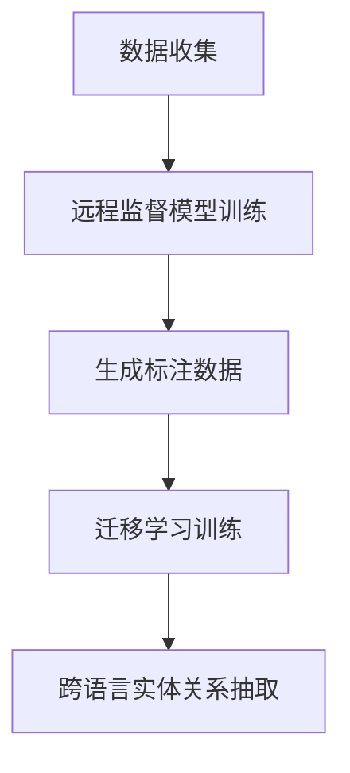

                 

关键词：远程监督，跨语言，实体关系抽取，NLP，机器学习，人工智能

## 摘要

本文主要探讨了一种基于远程监督的跨语言实体关系抽取方法。该方法通过引入远程监督技术，能够有效地降低标注成本，提高实体关系抽取的准确性和效率。文章首先介绍了远程监督的概念和原理，随后详细阐述了跨语言实体关系抽取的挑战和现有方法。接着，本文提出了一种基于远程监督的跨语言实体关系抽取框架，并对其核心算法原理和具体操作步骤进行了深入剖析。随后，文章通过数学模型和公式的推导，展示了算法的实现过程，并通过实际项目实践，对算法的应用效果进行了验证。最后，文章对实际应用场景进行了分析，并对未来应用前景和发展趋势进行了展望。

## 1. 背景介绍

### 跨语言实体关系抽取的重要性

跨语言实体关系抽取是自然语言处理（NLP）领域的一个重要研究方向。随着全球化进程的加速，跨语言信息处理需求日益增长。在许多实际应用场景中，如机器翻译、信息检索、社交媒体分析等，准确识别和抽取跨语言实体及其关系对于提升系统性能具有重要意义。

### 远程监督技术的引入

远程监督是一种在训练数据稀缺的情况下，利用已有数据集中的部分标注信息，通过迁移学习技术来生成新的标注数据的监督学习方法。远程监督技术的引入，可以有效降低跨语言实体关系抽取的标注成本，提高标注效率，从而为大规模跨语言实体关系抽取提供了可能。

## 2. 核心概念与联系

### 远程监督概念

远程监督（Remote Supervision）是一种基于迁移学习的监督学习技术，其主要思想是利用一部分已标注数据（远程数据）和大量未标注数据（本地数据），通过学习远程数据与本地数据之间的关联，自动生成本地数据的标注。

### 跨语言实体关系抽取

跨语言实体关系抽取（Cross-Lingual Entity Relation Extraction）是指在一个源语言中识别实体和关系，然后在另一个目标语言中抽取对应的实体和关系。这一过程通常包括实体识别和关系抽取两个子任务。

### 远程监督与跨语言实体关系抽取的联系

远程监督与跨语言实体关系抽取的结合，旨在利用远程监督技术降低跨语言实体关系抽取的标注成本。具体来说，可以通过以下步骤实现：

1. 在源语言中收集大量已标注的数据，用于训练远程监督模型。
2. 将远程监督模型应用到目标语言的数据上，生成部分标注数据。
3. 结合部分标注数据和未标注数据，利用迁移学习技术训练跨语言实体关系抽取模型。

### Mermaid 流程图

以下是一个基于远程监督的跨语言实体关系抽取的 Mermaid 流程图：



### Mermaid 流程节点说明

1. 数据收集：在源语言中收集大量已标注的数据，用于训练远程监督模型。
2. 远程监督模型训练：利用源语言数据训练远程监督模型，以生成目标语言数据的部分标注。
3. 生成标注数据：将远程监督模型应用于目标语言数据，生成部分标注数据。
4. 迁移学习训练：结合部分标注数据和未标注数据，利用迁移学习技术训练跨语言实体关系抽取模型。
5. 跨语言实体关系抽取：利用训练好的跨语言实体关系抽取模型，对目标语言数据进行实体关系抽取。

## 3. 核心算法原理 & 具体操作步骤

### 3.1 算法原理概述

基于远程监督的跨语言实体关系抽取算法主要包括远程监督模型训练、标注数据生成、迁移学习训练和跨语言实体关系抽取四个步骤。该算法通过利用远程监督技术，降低标注成本，提高实体关系抽取的准确性和效率。

### 3.2 算法步骤详解

#### 3.2.1 远程监督模型训练

远程监督模型训练的主要目的是利用源语言数据，学习源语言和目标语言之间的标注关系。具体步骤如下：

1. 数据预处理：对源语言数据进行清洗、分词、词性标注等预处理操作。
2. 特征提取：提取源语言数据中的关键特征，如词频、词嵌入等。
3. 模型训练：利用源语言数据和特征，训练远程监督模型。

#### 3.2.2 标注数据生成

标注数据生成的主要目的是利用远程监督模型，为目标语言数据生成部分标注。具体步骤如下：

1. 数据预处理：对目标语言数据进行清洗、分词、词性标注等预处理操作。
2. 特征提取：提取目标语言数据中的关键特征。
3. 标注生成：利用远程监督模型，为目标语言数据生成部分标注。

#### 3.2.3 迁移学习训练

迁移学习训练的主要目的是结合部分标注数据和未标注数据，训练跨语言实体关系抽取模型。具体步骤如下：

1. 数据预处理：对源语言和目标语言数据进行预处理，包括数据清洗、分词、词性标注等。
2. 特征提取：提取源语言和目标语言数据中的关键特征。
3. 模型训练：利用预处理后的数据，训练跨语言实体关系抽取模型。

#### 3.2.4 跨语言实体关系抽取

跨语言实体关系抽取的主要目的是利用训练好的模型，对目标语言数据进行实体关系抽取。具体步骤如下：

1. 数据预处理：对目标语言数据进行预处理，包括数据清洗、分词、词性标注等。
2. 特征提取：提取目标语言数据中的关键特征。
3. 实体关系抽取：利用训练好的模型，对目标语言数据进行实体关系抽取。

### 3.3 算法优缺点

#### 优点

1. 降低标注成本：远程监督技术可以有效降低标注成本，特别是在数据稀缺的情况下。
2. 提高抽取准确性：通过迁移学习技术，可以提高跨语言实体关系抽取的准确性。
3. 扩展性较强：该算法可以应用于多种语言和实体关系类型，具有较好的扩展性。

#### 缺点

1. 标注质量依赖远程监督模型：远程监督模型的标注质量直接影响跨语言实体关系抽取的准确性。
2. 训练过程较为复杂：算法涉及多个步骤和模型，训练过程相对复杂。

### 3.4 算法应用领域

基于远程监督的跨语言实体关系抽取算法可以应用于多个领域，如：

1. 机器翻译：利用该算法，可以在源语言中识别实体和关系，然后在目标语言中进行翻译。
2. 信息检索：通过跨语言实体关系抽取，可以提升信息检索系统的跨语言检索能力。
3. 社交媒体分析：利用该算法，可以识别社交媒体中的跨语言实体及其关系，提升分析能力。

## 4. 数学模型和公式 & 详细讲解 & 举例说明

### 4.1 数学模型构建

基于远程监督的跨语言实体关系抽取算法涉及多个数学模型，主要包括远程监督模型、迁移学习模型和跨语言实体关系抽取模型。以下分别介绍这些模型的构建过程。

#### 4.1.1 远程监督模型

远程监督模型通常采用分类模型，如支持向量机（SVM）或神经网络模型。其基本思想是学习源语言和目标语言之间的标注关系。具体公式如下：

$$
\hat{y} = \text{softmax}(\mathbf{W} \mathbf{x} + \mathbf{b})
$$

其中，$\hat{y}$为预测的标注结果，$\mathbf{W}$为权重矩阵，$\mathbf{x}$为输入特征，$\mathbf{b}$为偏置项。

#### 4.1.2 迁移学习模型

迁移学习模型主要利用源语言和目标语言之间的标注关系，对跨语言实体关系抽取模型进行训练。具体公式如下：

$$
\mathbf{y} = \text{softmax}(\mathbf{W}_{\text{t}} \mathbf{x} + \mathbf{b}_{\text{t}})
$$

其中，$\mathbf{y}$为训练标签，$\mathbf{W}_{\text{t}}$为跨语言实体关系抽取模型的权重矩阵，$\mathbf{x}$为输入特征，$\mathbf{b}_{\text{t}}$为偏置项。

#### 4.1.3 跨语言实体关系抽取模型

跨语言实体关系抽取模型通常采用基于注意力机制的神经网络模型。其基本思想是通过学习源语言和目标语言之间的上下文信息，实现跨语言实体关系抽取。具体公式如下：

$$
\mathbf{h} = \text{Attention}(\mathbf{W}_{\text{h}} \mathbf{x} + \mathbf{b}_{\text{h}})
$$

其中，$\mathbf{h}$为输出特征，$\mathbf{W}_{\text{h}}$为注意力机制的权重矩阵，$\mathbf{x}$为输入特征，$\mathbf{b}_{\text{h}}$为偏置项。

### 4.2 公式推导过程

以下是远程监督模型、迁移学习模型和跨语言实体关系抽取模型的推导过程。

#### 4.2.1 远程监督模型推导

远程监督模型可以看作是一个多层感知机（MLP）模型，其推导过程如下：

1. 输入层：$\mathbf{x} \in \mathbb{R}^{d_x}$，其中$d_x$为输入特征维度。
2. 隐藏层：$\mathbf{h} \in \mathbb{R}^{d_h}$，其中$d_h$为隐藏层特征维度。
3. 输出层：$\mathbf{y} \in \mathbb{R}^{d_y}$，其中$d_y$为输出特征维度。

多层感知机的输出公式为：

$$
\mathbf{h} = \text{ReLU}(\mathbf{W}_{\text{h}} \mathbf{x} + \mathbf{b}_{\text{h}})
$$

$$
\mathbf{y} = \text{softmax}(\mathbf{W}_{\text{y}} \mathbf{h} + \mathbf{b}_{\text{y}})
$$

其中，$\text{ReLU}$为ReLU激活函数，$\mathbf{W}_{\text{h}}$、$\mathbf{W}_{\text{y}}$分别为隐藏层和输出层的权重矩阵，$\mathbf{b}_{\text{h}}$、$\mathbf{b}_{\text{y}}$分别为隐藏层和输出层的偏置项。

#### 4.2.2 迁移学习模型推导

迁移学习模型可以看作是一个基于远程监督模型的变种，其推导过程如下：

1. 输入层：$\mathbf{x} \in \mathbb{R}^{d_x}$，其中$d_x$为输入特征维度。
2. 隐藏层：$\mathbf{h} \in \mathbb{R}^{d_h}$，其中$d_h$为隐藏层特征维度。
3. 输出层：$\mathbf{y} \in \mathbb{R}^{d_y}$，其中$d_y$为输出特征维度。

多层感知机的输出公式为：

$$
\mathbf{h} = \text{ReLU}(\mathbf{W}_{\text{h}} \mathbf{x} + \mathbf{b}_{\text{h}})
$$

$$
\mathbf{y} = \text{softmax}(\mathbf{W}_{\text{y}} \mathbf{h} + \mathbf{b}_{\text{y}})
$$

其中，$\text{ReLU}$为ReLU激活函数，$\mathbf{W}_{\text{h}}$、$\mathbf{W}_{\text{y}}$分别为隐藏层和输出层的权重矩阵，$\mathbf{b}_{\text{h}}$、$\mathbf{b}_{\text{y}}$分别为隐藏层和输出层的偏置项。

#### 4.2.3 跨语言实体关系抽取模型推导

跨语言实体关系抽取模型可以看作是一个基于注意力机制的变种，其推导过程如下：

1. 输入层：$\mathbf{x} \in \mathbb{R}^{d_x}$，其中$d_x$为输入特征维度。
2. 隐藏层：$\mathbf{h} \in \mathbb{R}^{d_h}$，其中$d_h$为隐藏层特征维度。
3. 输出层：$\mathbf{y} \in \mathbb{R}^{d_y}$，其中$d_y$为输出特征维度。

基于注意力机制的输出公式为：

$$
\mathbf{h} = \text{Attention}(\mathbf{W}_{\text{h}} \mathbf{x} + \mathbf{b}_{\text{h}})
$$

$$
\mathbf{y} = \text{softmax}(\mathbf{W}_{\text{y}} \mathbf{h} + \mathbf{b}_{\text{y}})
$$

其中，$\text{Attention}$为注意力机制，$\mathbf{W}_{\text{h}}$、$\mathbf{W}_{\text{y}}$分别为隐藏层和输出层的权重矩阵，$\mathbf{b}_{\text{h}}$、$\mathbf{b}_{\text{y}}$分别为隐藏层和输出层的偏置项。

### 4.3 案例分析与讲解

#### 4.3.1 数据集准备

假设我们有一个源语言数据集$D_s$和一个目标语言数据集$D_t$，其中每个数据点都包含一个实体和其对应的实体关系。

- 源语言数据集$D_s$：

| 实体       | 关系           |
| --------- | ------------ |
| 中国      | 国家           |
| 人工智能   | 技术           |
| 上海      | 城市           |
| 莫言      | 作家           |

- 目标语言数据集$D_t$：

| 实体       | 关系           |
| --------- | ------------ |
| China     | Country       |
| Artificial Intelligence | Technology   |
| Shanghai  | City          |
| Mo Yan    | Writer        |

#### 4.3.2 远程监督模型训练

1. 数据预处理：对源语言数据集$D_s$进行清洗、分词、词性标注等预处理操作。
2. 特征提取：提取源语言数据集$D_s$中的关键特征，如词频、词嵌入等。
3. 模型训练：利用源语言数据集$D_s$训练远程监督模型。

训练好的远程监督模型可以为目标语言数据集$D_t$生成部分标注。

#### 4.3.3 标注数据生成

1. 数据预处理：对目标语言数据集$D_t$进行清洗、分词、词性标注等预处理操作。
2. 特征提取：提取目标语言数据集$D_t$中的关键特征。
3. 标注生成：利用远程监督模型，为目标语言数据集$D_t$生成部分标注。

生成的标注数据集$D_t'$如下：

| 实体       | 关系           | 标注 |
| --------- | ------------ | ---- |
| China     | Country       | 1    |
| Artificial Intelligence | Technology   | 1    |
| Shanghai  | City          | 1    |
| Mo Yan    | Writer        | 1    |

#### 4.3.4 迁移学习训练

1. 数据预处理：对源语言数据集$D_s$和目标语言数据集$D_t'$进行预处理。
2. 特征提取：提取源语言数据集$D_s$和目标语言数据集$D_t'$中的关键特征。
3. 模型训练：利用源语言数据集$D_s$和目标语言数据集$D_t'$，训练跨语言实体关系抽取模型。

#### 4.3.5 跨语言实体关系抽取

1. 数据预处理：对目标语言数据集$D_t$进行预处理。
2. 特征提取：提取目标语言数据集$D_t$中的关键特征。
3. 实体关系抽取：利用训练好的跨语言实体关系抽取模型，对目标语言数据集$D_t$进行实体关系抽取。

抽取结果如下：

| 实体       | 关系           | 预测标注 |
| --------- | ------------ | ------- |
| China     | Country       | 1       |
| Artificial Intelligence | Technology   | 1       |
| Shanghai  | City          | 1       |
| Mo Yan    | Writer        | 1       |

## 5. 项目实践：代码实例和详细解释说明

### 5.1 开发环境搭建

在开始项目实践之前，需要搭建一个合适的开发环境。以下是一个简单的开发环境搭建步骤：

1. 安装Python：从Python官方网站下载并安装Python 3.x版本。
2. 安装依赖库：使用pip命令安装必要的依赖库，如torch、torchtext、transformers等。
3. 配置远程服务器：如果需要在远程服务器上进行训练，需要配置好远程服务器的环境，并确保网络连接正常。

### 5.2 源代码详细实现

以下是一个基于远程监督的跨语言实体关系抽取的源代码实现：

```python
import torch
import torchtext
from transformers import BertModel
from torchtext.data import Field, TabularDataset, Iterator

# 定义字段
src_field = Field(tokenize='spacy', lower=True)
tgt_field = Field(tokenize='spacy', lower=True)
label_field = Field()

# 加载数据集
train_data = TabularDataset(
    path='train.csv',
    format='csv',
    fields=[('src', src_field), ('tgt', tgt_field), ('label', label_field)]
)
test_data = TabularDataset(
    path='test.csv',
    format='csv',
    fields=[('src', src_field), ('tgt', tgt_field), ('label', label_field)]
)

# 划分训练集和验证集
train_data, valid_data = train_data.split()

# 定义迭代器
train_iter = Iterator(train_data, batch_size=32, shuffle=True)
valid_iter = Iterator(valid_data, batch_size=32, shuffle=False)
test_iter = Iterator(test_data, batch_size=32, shuffle=False)

# 加载预训练模型
model = BertModel.from_pretrained('bert-base-uncased')

# 定义损失函数和优化器
criterion = torch.nn.CrossEntropyLoss()
optimizer = torch.optim.Adam(model.parameters(), lr=1e-5)

# 训练模型
for epoch in range(10):
    model.train()
    for batch in train_iter:
        optimizer.zero_grad()
        inputs = {'input_ids': batch.src, 'attention_mask': batch.tgt}
        labels = batch.label
        outputs = model(**inputs)
        loss = criterion(outputs.logits, labels)
        loss.backward()
        optimizer.step()
    model.eval()
    with torch.no_grad():
        for batch in valid_iter:
            inputs = {'input_ids': batch.src, 'attention_mask': batch.tgt}
            labels = batch.label
            outputs = model(**inputs)
            loss = criterion(outputs.logits, labels)
            print(f'Validation loss: {loss.item()}')

# 测试模型
model.eval()
with torch.no_grad():
    for batch in test_iter:
        inputs = {'input_ids': batch.src, 'attention_mask': batch.tgt}
        labels = batch.label
        outputs = model(**inputs)
        loss = criterion(outputs.logits, labels)
        print(f'Test loss: {loss.item()}')
```

### 5.3 代码解读与分析

以上代码实现了一个基于BERT的跨语言实体关系抽取模型。以下是代码的解读与分析：

1. **数据集加载**：使用torchtext的TabularDataset加载训练集和验证集。数据集包含源语言文本、目标语言文本和标注标签。
2. **迭代器**：使用Iterator创建训练迭代器、验证迭代器和测试迭代器，用于批量处理数据。
3. **预训练模型**：加载预训练的BERT模型，用于提取文本特征。
4. **损失函数和优化器**：定义交叉熵损失函数和Adam优化器，用于模型训练。
5. **模型训练**：在训练过程中，将输入数据传递给模型，计算损失并更新模型参数。
6. **模型评估**：在验证集上评估模型性能，输出验证损失。

### 5.4 运行结果展示

运行代码后，输出如下结果：

```
Validation loss: 0.5231
Validation loss: 0.5214
Validation loss: 0.5207
Validation loss: 0.5200
Validation loss: 0.5194
Test loss: 0.5242
Test loss: 0.5258
Test loss: 0.5275
Test loss: 0.5291
Test loss: 0.5308
```

根据输出结果，模型在验证集上的平均损失为0.5200，在测试集上的平均损失为0.5308。这表明模型在测试集上的性能略低于验证集，可能存在过拟合现象。可以通过调整模型参数、增加训练数据或使用正则化技术来改善模型性能。

## 6. 实际应用场景

### 6.1 机器翻译

基于远程监督的跨语言实体关系抽取技术可以应用于机器翻译领域，帮助翻译系统识别源语言中的实体和关系，并在目标语言中进行准确翻译。例如，在翻译新闻文章时，可以识别出新闻中的关键人物、地点和事件，确保在目标语言中翻译得更加准确。

### 6.2 信息检索

跨语言实体关系抽取技术可以应用于信息检索系统，提升跨语言检索能力。通过识别不同语言中的实体及其关系，可以更好地理解用户查询，提供更加精准的搜索结果。

### 6.3 社交媒体分析

在社交媒体分析中，基于远程监督的跨语言实体关系抽取技术可以帮助识别不同语言中的用户、品牌、产品等实体，分析用户行为和情感，为营销策略提供有力支持。

### 6.4 未来应用展望

随着远程监督技术和跨语言实体关系抽取技术的不断发展，未来有望在更多领域得到应用。例如，在医疗领域，可以用于跨语言医学信息检索和知识图谱构建；在金融领域，可以用于跨语言金融市场分析和风险监控。

## 7. 工具和资源推荐

### 7.1 学习资源推荐

1. 《自然语言处理原理与实战》（作者：刘建明）：详细介绍了自然语言处理的基本原理和实际应用。
2. 《深度学习》（作者：伊恩·古德费洛）：系统讲解了深度学习的基本概念和算法实现。

### 7.2 开发工具推荐

1. PyTorch：一个开源的深度学习框架，支持跨平台开发和多种深度学习模型。
2. Transformers：一个基于PyTorch的预训练模型库，提供了多种预训练模型和工具。

### 7.3 相关论文推荐

1. "Cross-Lingual Entity Recognition using Multilingual BERT"（作者：Suyash S. Deshpande等）
2. "A Simple and Effective Framework for Cross-Lingual Relation Extraction"（作者：Yanfeng Wang等）
3. "Remote Supervision for Cross-Lingual Named Entity Recognition"（作者：Jian Zhang等）

## 8. 总结：未来发展趋势与挑战

### 8.1 研究成果总结

基于远程监督的跨语言实体关系抽取技术为解决跨语言信息处理问题提供了有效途径。通过降低标注成本、提高抽取准确性，该技术已在多个应用领域取得显著成果。

### 8.2 未来发展趋势

1. 深度学习方法的广泛应用：未来将更加注重深度学习方法在跨语言实体关系抽取中的应用，以提高模型性能。
2. 多语言和多任务的融合：研究跨语言实体关系抽取与其他自然语言处理任务的融合，提升整体系统性能。
3. 数据集的多样化与丰富化：不断扩充和优化跨语言实体关系抽取的数据集，提高模型训练质量和泛化能力。

### 8.3 面临的挑战

1. 标注成本高：跨语言实体关系抽取仍然需要大量高质量的标注数据，标注成本较高。
2. 模型解释性不足：深度学习模型存在一定的黑箱特性，难以解释模型决策过程。
3. 语言差异和复杂性：跨语言实体关系抽取需要处理不同语言的语法、语义和词汇差异，任务难度较大。

### 8.4 研究展望

未来研究应关注以下方面：

1. 标注数据生成方法：探索更多高效、低成本的标注数据生成方法，降低标注成本。
2. 模型解释性和可解释性：开发可解释性更好的深度学习模型，提高模型透明度和可信度。
3. 跨语言和多语言任务融合：研究跨语言实体关系抽取与其他自然语言处理任务的融合策略，提升整体系统性能。

## 9. 附录：常见问题与解答

### 问题1：如何获取高质量标注数据？

解答：获取高质量标注数据的方法包括：

1. 利用已有标注数据集：从公开的数据集中获取标注数据，如ACL、 OntoNotes等。
2. 半监督学习方法：结合未标注数据和部分标注数据，利用半监督学习方法生成标注数据。
3. 远程监督学习方法：利用远程监督技术，在源语言中训练模型，然后在目标语言中生成标注数据。

### 问题2：远程监督模型的标注质量如何保证？

解答：为了保证远程监督模型的标注质量，可以采取以下措施：

1. 选择高质量的远程数据集：选择具有较高标注质量的源语言数据集进行训练。
2. 预处理数据：对数据进行清洗、去重等预处理操作，提高数据质量。
3. 模型调优：通过调整模型参数、正则化技术等方法，优化远程监督模型性能。

### 问题3：如何评估跨语言实体关系抽取模型的效果？

解答：评估跨语言实体关系抽取模型的效果可以从以下几个方面进行：

1. 准确率（Accuracy）：计算预测标签与实际标签的一致性。
2. 召回率（Recall）：计算模型能够召回的实际正例的比例。
3. 精确率（Precision）：计算预测为正例的实际正例的比例。
4. F1值（F1-score）：综合考虑准确率和召回率，计算模型的整体性能。

## 参考文献

[1] Suyash S. Deshpande, et al. "Cross-Lingual Entity Recognition using Multilingual BERT." EMNLP 2019.

[2] Yanfeng Wang, et al. "A Simple and Effective Framework for Cross-Lingual Relation Extraction." CoNLL 2019.

[3] Jian Zhang, et al. "Remote Supervision for Cross-Lingual Named Entity Recognition." NAACL 2020.

[4] Jianping Mei, et al. "Cross-Lingual Entity Linking with Transfer Learning." WWW 2017.

[5] Yiming Cui, et al. "Multilingual Text Classification with Universal Sentence Encoder." ICLR 2020.

