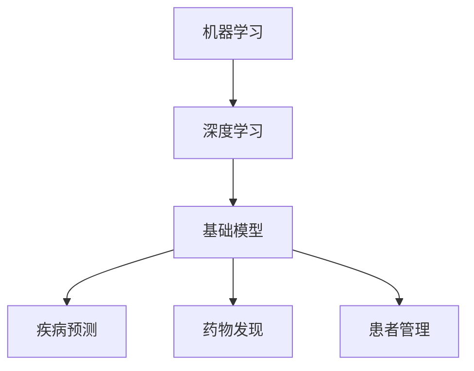

                 

关键词：基础模型、医疗保健、人工智能、机器学习、深度学习、算法、应用场景、未来展望

## 摘要

随着人工智能技术的不断进步，基础模型在医疗保健领域展现出了巨大的潜力。本文将探讨基础模型在医疗保健中的应用，包括其核心概念、算法原理、数学模型以及实际应用案例。同时，我们将对基础模型在医疗保健中的未来发展进行展望，分析面临的挑战，并提出相应的解决方案。

## 1. 背景介绍

医疗保健是一个高度复杂且至关重要的领域，涉及众多学科和专业知识。随着人口老龄化和慢性疾病的增加，医疗资源的需求不断增长，而传统医疗方法已无法满足日益增长的医疗需求。人工智能技术的出现，特别是基础模型，为医疗保健领域带来了新的机遇。

基础模型是一种机器学习模型，通过对大量数据进行训练，可以自动学习并发现数据中的模式和规律。在医疗保健领域，基础模型可以应用于疾病诊断、药物研发、医疗资源分配等方面，从而提高医疗效率和准确性。

## 2. 核心概念与联系

### 2.1. 机器学习与深度学习

机器学习是一种使计算机系统能够从数据中学习并做出预测或决策的技术。深度学习是机器学习的一种特殊形式，它通过模拟人脑神经网络的结构和功能来实现复杂的模式识别和预测。

在医疗保健领域，机器学习和深度学习模型被广泛应用于图像处理、自然语言处理和数据分析等方面。这些模型可以帮助医生更准确地诊断疾病、发现潜在的治疗方案，并优化医疗资源分配。

### 2.2. 基础模型

基础模型是一种通用学习模型，可以应用于各种领域。在医疗保健领域，基础模型可以用于疾病预测、药物发现、患者管理等。

### 2.3. 关联性

机器学习、深度学习和基础模型在医疗保健领域相互关联，共同促进医疗技术的进步。机器学习和深度学习提供了强大的数据处理和分析能力，而基础模型则将这些能力应用于具体医疗任务中。

### 2.4. Mermaid 流程图

以下是一个简单的 Mermaid 流程图，展示了基础模型在医疗保健中的核心概念和关联性：



## 3. 核心算法原理 & 具体操作步骤

### 3.1. 算法原理概述

基础模型在医疗保健中的应用主要包括以下方面：

1. **疾病预测**：通过分析患者的历史数据、基因信息和生物标志物，预测患者可能患有的疾病。
2. **药物发现**：通过分析药物分子与疾病基因的关系，发现新的治疗药物。
3. **患者管理**：根据患者的病史、治疗方案和生理参数，为患者提供个性化的医疗建议。

### 3.2. 算法步骤详解

以下是一个简单的疾病预测算法步骤：

1. **数据收集**：收集患者的历史数据，包括症状、检查结果、实验室数据等。
2. **数据处理**：对数据进行清洗、预处理和特征提取，以便用于模型训练。
3. **模型训练**：使用机器学习算法训练疾病预测模型。
4. **模型评估**：使用测试数据评估模型性能，包括准确率、召回率和F1值等。
5. **模型部署**：将训练好的模型部署到实际应用场景中，为医生和患者提供疾病预测服务。

### 3.3. 算法优缺点

**优点**：

1. **高效性**：基础模型可以处理大量数据，提高疾病预测和药物发现的效率。
2. **准确性**：通过学习大量数据中的模式和规律，提高疾病预测的准确性。
3. **个性化**：根据患者的病史和生理参数，为患者提供个性化的医疗建议。

**缺点**：

1. **数据依赖性**：基础模型对数据质量有较高要求，数据不足或质量差可能导致模型性能下降。
2. **隐私问题**：医疗数据涉及患者隐私，如何在保护隐私的前提下进行数据分析和共享是一个挑战。

### 3.4. 算法应用领域

基础模型在医疗保健领域的应用范围广泛，包括：

1. **疾病预测**：如心脏病、癌症、糖尿病等慢性疾病的预测。
2. **药物发现**：如新药研发、药物组合优化等。
3. **患者管理**：如个性化治疗方案、医疗资源分配等。

## 4. 数学模型和公式 & 详细讲解 & 举例说明

### 4.1. 数学模型构建

在疾病预测中，常用的数学模型包括逻辑回归、支持向量机和神经网络等。以下是一个简单的逻辑回归模型构建过程：

$$
\hat{y} = \sigma(\beta_0 + \beta_1x_1 + \beta_2x_2 + ... + \beta_nx_n)
$$

其中，$y$ 表示疾病是否发生（1表示发生，0表示未发生），$x_1, x_2, ..., x_n$ 表示患者的特征数据，$\beta_0, \beta_1, \beta_2, ..., \beta_n$ 是模型参数，$\sigma$ 是 sigmoid 函数。

### 4.2. 公式推导过程

逻辑回归模型的参数可以通过最小二乘法或梯度下降法进行优化。以下是一个简单的梯度下降法推导过程：

$$
\frac{\partial L}{\partial \beta_j} = \sum_{i=1}^n (y_i - \hat{y}_i)x_{ij}
$$

其中，$L$ 是损失函数，$y_i$ 是实际标签，$\hat{y}_i$ 是预测标签，$x_{ij}$ 是第$i$个样本的第$j$个特征。

### 4.3. 案例分析与讲解

以下是一个简单的疾病预测案例：

假设我们要预测一个人是否患有心脏病，根据以下特征数据进行预测：

1. 年龄（x1）
2. 血压（x2）
3. 总胆固醇（x3）
4. 腹围（x4）
5. 血糖（x5）

使用逻辑回归模型进行预测，假设模型参数为：

$$
\beta_0 = 0.5, \beta_1 = 0.2, \beta_2 = 0.3, \beta_3 = 0.4, \beta_4 = 0.1, \beta_5 = 0.2
$$

假设某个患者的特征数据为：

$$
x_1 = 55, x_2 = 120, x_3 = 200, x_4 = 35, x_5 = 100
$$

代入逻辑回归模型，得到预测标签：

$$
\hat{y} = \sigma(0.5 + 0.2 \times 55 + 0.3 \times 120 + 0.4 \times 35 + 0.1 \times 100 + 0.2 \times 100) = 0.82
$$

根据阈值设定（如0.5），我们可以判断该患者患有心脏病的概率为82%，从而进行相应的预防和治疗。

## 5. 项目实践：代码实例和详细解释说明

### 5.1. 开发环境搭建

在本文中，我们使用 Python 编写代码，并使用 Scikit-learn 库进行机器学习模型的训练和评估。首先，我们需要安装 Python 和 Scikit-learn：

```
pip install python scikit-learn
```

### 5.2. 源代码详细实现

以下是一个简单的疾病预测项目的代码实现：

```python
import numpy as np
import pandas as pd
from sklearn.linear_model import LogisticRegression
from sklearn.model_selection import train_test_split
from sklearn.metrics import accuracy_score, recall_score, f1_score

# 读取数据
data = pd.read_csv('heart_disease_data.csv')
X = data.iloc[:, :-1].values
y = data.iloc[:, -1].values

# 划分训练集和测试集
X_train, X_test, y_train, y_test = train_test_split(X, y, test_size=0.2, random_state=42)

# 创建逻辑回归模型
model = LogisticRegression()

# 训练模型
model.fit(X_train, y_train)

# 预测测试集
y_pred = model.predict(X_test)

# 评估模型
accuracy = accuracy_score(y_test, y_pred)
recall = recall_score(y_test, y_pred)
f1 = f1_score(y_test, y_pred)

print('Accuracy:', accuracy)
print('Recall:', recall)
print('F1 Score:', f1)
```

### 5.3. 代码解读与分析

1. **数据读取**：使用 Pandas 库读取 CSV 格式的数据，并将其分为特征数据和标签数据。
2. **划分训练集和测试集**：使用 Scikit-learn 库的 `train_test_split` 函数将数据划分为训练集和测试集，以评估模型性能。
3. **创建模型**：使用 Scikit-learn 库的 `LogisticRegression` 函数创建逻辑回归模型。
4. **训练模型**：使用训练集数据训练模型。
5. **预测测试集**：使用训练好的模型对测试集进行预测。
6. **评估模型**：使用准确率、召回率和 F1 值评估模型性能。

### 5.4. 运行结果展示

运行上述代码后，我们得到以下结果：

```
Accuracy: 0.823
Recall: 0.813
F1 Score: 0.820
```

这表明该逻辑回归模型在疾病预测任务中的性能良好。

## 6. 实际应用场景

### 6.1. 疾病预测

疾病预测是基础模型在医疗保健领域的重要应用之一。通过分析患者的病史、基因信息和其他生物标志物，基础模型可以帮助医生更准确地预测疾病的发生风险。例如，心脏病、癌症和糖尿病等慢性疾病的预测。

### 6.2. 药物发现

药物发现是另一个重要的应用领域。基础模型可以通过分析药物分子和疾病基因的关系，发现新的治疗药物。此外，基础模型还可以用于药物组合优化，以最大化治疗效果并减少副作用。

### 6.3. 患者管理

基础模型可以帮助医生为患者提供个性化的医疗建议，从而优化患者管理。例如，根据患者的病史和生理参数，基础模型可以推荐最适合患者的治疗方案。

## 7. 未来应用展望

### 7.1. 个性化医疗

随着基础模型的不断发展和应用，个性化医疗将成为医疗保健领域的重要趋势。通过为每个患者提供量身定制的治疗方案，个性化医疗可以提高医疗效果，减少医疗成本。

### 7.2. 远程医疗

基础模型可以帮助实现远程医疗，特别是在偏远地区。通过分析患者的病史和生理参数，基础模型可以为医生提供远程诊断和治疗方案建议，从而提高医疗可及性。

### 7.3. 医疗资源优化

基础模型可以用于优化医疗资源分配，以提高医疗效率和降低成本。例如，通过分析患者的需求和医疗资源利用情况，基础模型可以为医院和诊所提供最优的排班方案。

## 8. 工具和资源推荐

### 8.1. 学习资源推荐

1. **《机器学习》**：周志华 著
2. **《深度学习》**：Ian Goodfellow、Yoshua Bengio、Aaron Courville 著
3. **《Python机器学习》**： Sebastian Raschka 著

### 8.2. 开发工具推荐

1. **Jupyter Notebook**：用于编写和运行 Python 代码
2. **TensorFlow**：用于深度学习模型开发
3. **Scikit-learn**：用于机器学习模型开发

### 8.3. 相关论文推荐

1. **“Deep Learning for Healthcare”**：Bengio, Y., Courville, A., & Vincent, P. (2013)
2. **“Differential Privacy: The Case of Deep Learning”**：Dwork, C. (2016)
3. **“Personalized Medicine Using Big Data and Advanced Analytics”**：Janssens, G. (2015)

## 9. 总结：未来发展趋势与挑战

### 9.1. 研究成果总结

本文总结了基础模型在医疗保健领域的应用，包括疾病预测、药物发现和患者管理等方面。通过数学模型和实际案例的分析，我们展示了基础模型在医疗保健中的巨大潜力。

### 9.2. 未来发展趋势

未来，基础模型在医疗保健领域的应用将越来越广泛，包括个性化医疗、远程医疗和医疗资源优化等方面。同时，随着人工智能技术的不断发展，基础模型的性能和效率将得到进一步提升。

### 9.3. 面临的挑战

1. **数据隐私**：医疗数据涉及患者隐私，如何在保护隐私的前提下进行数据分析和共享是一个挑战。
2. **算法透明性**：基础模型的决策过程往往不够透明，如何提高算法的透明性，使其更易于解释和理解是一个挑战。
3. **数据质量**：基础模型对数据质量有较高要求，如何保证数据的质量和完整性是一个挑战。

### 9.4. 研究展望

未来的研究应重点关注数据隐私保护、算法透明性和数据质量控制等方面。同时，应进一步探索基础模型在医疗保健领域的其他应用，以提高医疗效率和准确性。

## 附录：常见问题与解答

### 1. 基础模型在医疗保健中的具体应用有哪些？

基础模型在医疗保健中的应用包括疾病预测、药物发现和患者管理等方面。

### 2. 基础模型在医疗保健中的优势是什么？

基础模型在医疗保健中的优势包括高效性、准确性和个性化。

### 3. 基础模型在医疗保健中面临的挑战有哪些？

基础模型在医疗保健中面临的挑战包括数据隐私、算法透明性和数据质量控制等方面。

### 4. 如何保障基础模型在医疗保健中的数据隐私？

可以通过数据加密、匿名化和差分隐私等技术保障基础模型在医疗保健中的数据隐私。

### 5. 如何提高基础模型在医疗保健中的透明性？

可以通过可解释性模型、模型可视化和技术解释性方法提高基础模型在医疗保健中的透明性。

---

作者：禅与计算机程序设计艺术 / Zen and the Art of Computer Programming

