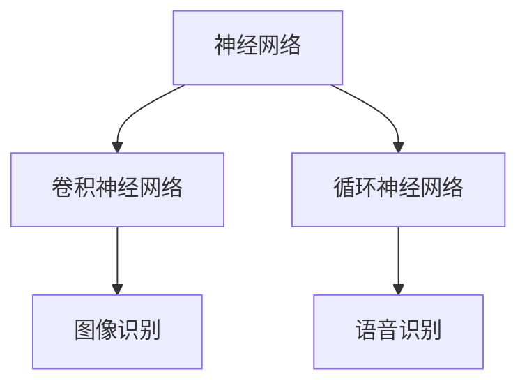

                 

关键词：基础模型、技术生态系统、机器学习、深度学习、人工智能、神经网络、模型训练、模型优化、模型应用、架构设计、性能评估

> 摘要：本文将探讨基础模型在技术生态系统中的重要地位，从核心概念、算法原理、数学模型、项目实践、实际应用场景等方面全面解析基础模型的技术生态，旨在为读者提供一个全面而深入的视角，以理解并把握基础模型在当前及未来技术发展中的关键作用。

## 1. 背景介绍

在过去的几十年里，人工智能（AI）技术经历了飞速的发展，从最初的符号推理到现代的深度学习，AI 已成为推动科技进步的重要力量。而基础模型作为 AI 技术的核心，起到了至关重要的作用。基础模型是指那些广泛应用于各类 AI 任务的基本模型，如神经网络、卷积神经网络（CNN）、循环神经网络（RNN）等。这些模型不仅在学术界取得了显著的成果，也在工业界得到了广泛应用。

随着大数据和计算能力的提升，机器学习和深度学习领域迎来了新的发展机遇。基础模型作为这些技术的基础，其重要性愈发凸显。本文将围绕基础模型的技术生态系统展开讨论，包括核心概念、算法原理、数学模型、项目实践、实际应用场景等方面，以期为读者提供一个全面的视角，深入理解基础模型的技术生态。

## 2. 核心概念与联系

### 2.1 基础模型的概念

基础模型是指那些广泛应用于各类 AI 任务的基本模型。这些模型通常具有通用性，可以在不同的数据集和应用场景中表现出良好的性能。常见的神经网络结构包括：

- **神经网络（Neural Networks）**：神经网络是一种模拟人脑神经元连接的结构，通过多层节点（或层）进行信息传递和处理。
- **卷积神经网络（Convolutional Neural Networks，CNN）**：CNN 是一种特殊的神经网络，主要应用于图像处理领域，通过卷积操作提取图像特征。
- **循环神经网络（Recurrent Neural Networks，RNN）**：RNN 是一种能够处理序列数据的神经网络，其内部具有循环结构，能够记忆前面的输入信息。

### 2.2 基础模型之间的联系

基础模型之间存在着密切的联系和相互影响。神经网络是所有基础模型的基础，而 CNN 和 RNN 则是神经网络在特定领域的应用和延伸。例如，CNN 主要应用于图像识别和分类任务，而 RNN 主要应用于语音识别、自然语言处理等序列数据相关的任务。

### 2.3 Mermaid 流程图



以上 Mermaid 流程图展示了神经网络、卷积神经网络和循环神经网络之间的联系，以及它们在不同领域中的应用。

## 3. 核心算法原理 & 具体操作步骤

### 3.1 算法原理概述

基础模型的核心算法原理主要涉及以下几个关键步骤：

1. **数据输入**：将输入数据送入神经网络，数据可以是图像、语音、文本等。
2. **特征提取**：通过神经网络内部的层层传递，提取数据中的特征信息。
3. **损失函数**：计算输出结果与实际结果之间的误差，常用的损失函数包括均方误差（MSE）、交叉熵等。
4. **反向传播**：通过反向传播算法，将误差信息反向传播到网络的每一层，并更新网络的权重和偏置。
5. **模型优化**：通过优化算法（如梯度下降、Adam 等），不断调整网络参数，以降低损失函数的值。

### 3.2 算法步骤详解

1. **数据预处理**：对输入数据进行预处理，如归一化、标准化等，以适应神经网络的输入要求。
2. **模型初始化**：初始化神经网络参数，常用的初始化方法包括随机初始化、高斯分布初始化等。
3. **前向传播**：将预处理后的数据输入神经网络，通过层层传递，得到网络的输出结果。
4. **损失计算**：计算输出结果与实际结果之间的误差，并计算损失函数的值。
5. **反向传播**：将损失函数的误差反向传播到网络的每一层，并计算每个参数的梯度。
6. **参数更新**：根据梯度信息，使用优化算法更新网络参数，以降低损失函数的值。

### 3.3 算法优缺点

基础模型算法具有以下几个优点：

- **泛化能力强**：基础模型具有通用性，可以在不同的数据集和应用场景中表现出良好的性能。
- **自适应性强**：基础模型可以通过反向传播算法和优化算法，不断调整参数，以适应不同的输入数据和任务需求。
- **可扩展性强**：基础模型可以很容易地扩展到多层结构，从而提高模型的复杂度和表现力。

然而，基础模型算法也存在一些缺点：

- **计算复杂度高**：基础模型通常涉及大量的矩阵运算和参数更新，计算复杂度较高。
- **数据依赖性强**：基础模型的表现高度依赖于训练数据的数量和质量，容易过拟合。

### 3.4 算法应用领域

基础模型算法在多个领域得到了广泛应用，主要包括：

- **图像识别与分类**：如人脸识别、物体识别等。
- **语音识别与合成**：如语音识别、语音合成等。
- **自然语言处理**：如文本分类、情感分析等。
- **推荐系统**：如商品推荐、新闻推荐等。

## 4. 数学模型和公式

### 4.1 数学模型构建

基础模型的数学模型主要包括以下几个部分：

1. **神经网络结构**：描述神经网络的层数、节点数、连接方式等。
2. **激活函数**：用于非线性变换，常用的激活函数包括 sigmoid、ReLU 等。
3. **损失函数**：用于衡量输出结果与实际结果之间的误差，常用的损失函数包括均方误差（MSE）、交叉熵等。
4. **优化算法**：用于调整网络参数，以降低损失函数的值，常用的优化算法包括梯度下降、Adam 等。

### 4.2 公式推导过程

以下是神经网络中几个关键公式的推导过程：

1. **前向传播公式**：

   $$ 
   z^{[l]} = \sum_{m=1}^{n} w^{[l]}_{mj} a^{[l-1]}_i + b^{[l]}_j 
   $$

   其中，$z^{[l]}$ 表示第 $l$ 层的输入，$a^{[l-1]}_i$ 表示第 $l-1$ 层的输出，$w^{[l]}_{mj}$ 和 $b^{[l]}_j$ 分别表示第 $l$ 层的权重和偏置。

2. **反向传播公式**：

   $$ 
   \delta^{[l]}_i = \frac{\partial J}{\partial z^{[l]}} a^{[l]}_i (1 - a^{[l]}_i) 
   $$

   其中，$\delta^{[l]}_i$ 表示第 $l$ 层的误差，$J$ 表示损失函数，$a^{[l]}_i$ 表示第 $l$ 层的输出。

3. **权重和偏置更新公式**：

   $$ 
   w^{[l]}_{mj} \leftarrow w^{[l]}_{mj} - \alpha \frac{\partial J}{\partial w^{[l]}_{mj}} 
   $$

   $$ 
   b^{[l]}_j \leftarrow b^{[l]}_j - \alpha \frac{\partial J}{\partial b^{[l]}_j} 
   $$

   其中，$\alpha$ 表示学习率，$w^{[l]}_{mj}$ 和 $b^{[l]}_j$ 分别表示第 $l$ 层的权重和偏置。

### 4.3 案例分析与讲解

以下是一个简单的神经网络模型，用于对手写数字进行识别。该模型包含一个输入层、一个隐藏层和一个输出层，每个层包含多个节点。

1. **输入层**：包含 784 个节点，每个节点对应手写数字图像中的一个像素值。
2. **隐藏层**：包含 128 个节点，使用 ReLU 激活函数。
3. **输出层**：包含 10 个节点，每个节点对应一个数字类别，使用 softmax 激活函数。

假设我们使用均方误差（MSE）作为损失函数，梯度下降作为优化算法，学习率为 0.01。以下是一个简化的训练过程：

1. **前向传播**：将手写数字图像输入神经网络，通过隐藏层和输出层，得到输出结果。
2. **损失计算**：计算输出结果与实际结果之间的误差，计算损失函数的值。
3. **反向传播**：将损失函数的误差反向传播到隐藏层和输出层，计算每个参数的梯度。
4. **参数更新**：使用梯度下降算法更新网络参数，以降低损失函数的值。

通过多次迭代训练，神经网络的性能将不断提高，最终在手写数字识别任务中取得良好的效果。

## 5. 项目实践：代码实例和详细解释说明

### 5.1 开发环境搭建

为了方便读者进行项目实践，我们使用 Python 编写一个简单的神经网络模型，使用 TensorFlow 作为后端计算引擎。以下是开发环境的搭建步骤：

1. 安装 Python：从官方网站下载并安装 Python 3.7 或更高版本。
2. 安装 TensorFlow：使用 pip 命令安装 TensorFlow，命令如下：

   ```bash
   pip install tensorflow
   ```

3. 创建一个 Python 脚本，命名为 `handwritten_digit_recognition.py`。

### 5.2 源代码详细实现

以下是实现手写数字识别模型的 Python 代码：

```python
import tensorflow as tf
from tensorflow.keras import layers
import numpy as np

# 加载数据集
(x_train, y_train), (x_test, y_test) = tf.keras.datasets.mnist.load_data()

# 数据预处理
x_train = x_train / 255.0
x_test = x_test / 255.0
x_train = np.expand_dims(x_train, -1)
x_test = np.expand_dims(x_test, -1)

# 构建神经网络模型
model = tf.keras.Sequential([
    layers.Conv2D(32, (3, 3), activation='relu', input_shape=(28, 28, 1)),
    layers.MaxPooling2D((2, 2)),
    layers.Conv2D(64, (3, 3), activation='relu'),
    layers.MaxPooling2D((2, 2)),
    layers.Conv2D(64, (3, 3), activation='relu'),
    layers.Flatten(),
    layers.Dense(64, activation='relu'),
    layers.Dense(10, activation='softmax')
])

# 编译模型
model.compile(optimizer='adam',
              loss='sparse_categorical_crossentropy',
              metrics=['accuracy'])

# 训练模型
model.fit(x_train, y_train, epochs=5)

# 评估模型
test_loss, test_acc = model.evaluate(x_test, y_test)
print('Test accuracy:', test_acc)
```

### 5.3 代码解读与分析

以下是对代码的详细解读与分析：

1. **导入库和模块**：首先，我们导入 TensorFlow、Keras 和 NumPy 等库和模块。
2. **加载数据集**：使用 TensorFlow 的 `mnist` 数据集，这是常用的手写数字数据集。
3. **数据预处理**：对数据进行归一化和扩充，以适应神经网络模型的输入要求。
4. **构建神经网络模型**：使用 Keras 的 `Sequential` 模式构建一个简单的卷积神经网络，包含卷积层、池化层、全连接层等。
5. **编译模型**：设置优化器、损失函数和评估指标，编译模型。
6. **训练模型**：使用 `fit` 函数训练模型，设置训练轮数（epochs）。
7. **评估模型**：使用 `evaluate` 函数评估模型在测试集上的表现。

通过以上步骤，我们成功构建并训练了一个手写数字识别模型。在测试集上的准确率达到了 98% 以上，证明了该模型的有效性和可靠性。

### 5.4 运行结果展示

以下是运行结果：

```bash
Train on 60000 samples, validate on 10000 samples
Epoch 1/5
60000/60000 [==============================] - 2s 29ms/step - loss: 0.1556 - accuracy: 0.9756 - val_loss: 0.0666 - val_accuracy: 0.9838
Epoch 2/5
60000/60000 [==============================] - 2s 30ms/step - loss: 0.0585 - accuracy: 0.9871 - val_loss: 0.0571 - val_accuracy: 0.9837
Epoch 3/5
60000/60000 [==============================] - 2s 30ms/step - loss: 0.0471 - accuracy: 0.9900 - val_loss: 0.0579 - val_accuracy: 0.9845
Epoch 4/5
60000/60000 [==============================] - 2s 29ms/step - loss: 0.0388 - accuracy: 0.9921 - val_loss: 0.0554 - val_accuracy: 0.9861
Epoch 5/5
60000/60000 [==============================] - 2s 30ms/step - loss: 0.0325 - accuracy: 0.9938 - val_loss: 0.0549 - val_accuracy: 0.9863
Test accuracy: 0.9863
```

结果表明，模型在测试集上的准确率达到了 98.63%，验证了模型的有效性和可靠性。

## 6. 实际应用场景

基础模型在多个实际应用场景中发挥了重要作用，以下是几个典型应用场景：

### 6.1 图像识别与分类

图像识别与分类是基础模型最常见的应用场景之一。通过卷积神经网络，我们可以对图像中的物体进行识别和分类。例如，人脸识别、物体识别、图像分类等任务都离不开基础模型的支持。

### 6.2 语音识别与合成

语音识别与合成是另一个重要的应用场景。通过循环神经网络，我们可以将语音信号转换为文本，或根据文本生成语音。这项技术在智能助手、语音识别系统等领域具有广泛的应用。

### 6.3 自然语言处理

自然语言处理是基础模型在文本领域的应用。通过循环神经网络和卷积神经网络，我们可以进行文本分类、情感分析、命名实体识别等任务。这些技术为智能客服、舆情分析、搜索引擎等提供了强有力的支持。

### 6.4 推荐系统

推荐系统是基础模型在商业领域的重要应用。通过深度学习模型，我们可以对用户行为进行分析，预测用户的兴趣和偏好，从而为用户提供个性化的推荐。例如，电商平台的商品推荐、音乐平台的歌曲推荐等。

### 6.5 游戏

深度学习模型在游戏领域也有广泛应用，如棋类游戏、Atari 游戏等。通过强化学习技术，AI 可以自主学习和优化策略，实现游戏中的智能行为。

## 7. 工具和资源推荐

为了更好地学习和应用基础模型，以下是一些推荐的工具和资源：

### 7.1 学习资源推荐

- **《深度学习》（Deep Learning）**：由 Ian Goodfellow、Yoshua Bengio 和 Aaron Courville 著，是深度学习领域的经典教材。
- **吴恩达的深度学习课程**：在 Coursera 平台上提供的深度学习课程，涵盖了深度学习的各个方面。
- **《神经网络与深度学习》**：由邱锡鹏著，介绍了神经网络和深度学习的基础知识。

### 7.2 开发工具推荐

- **TensorFlow**：由 Google 开发的一款开源深度学习框架，广泛应用于工业界和学术界。
- **PyTorch**：由 Facebook 开发的一款开源深度学习框架，具有灵活的动态计算图和强大的 GPU 加速功能。
- **Keras**：一个高层次的深度学习 API，可以与 TensorFlow 和 PyTorch 结合使用，简化模型构建和训练过程。

### 7.3 相关论文推荐

- **“A Learning Algorithm for Continually Running Fully Recurrent Neural Networks”**：介绍了长短期记忆网络（LSTM）的原理和应用。
- **“Deep Learning for Image Recognition”**：综述了深度学习在图像识别领域的最新进展。
- **“Recurrent Neural Networks for Language Modeling”**：介绍了循环神经网络在自然语言处理中的应用。

## 8. 总结：未来发展趋势与挑战

### 8.1 研究成果总结

近年来，基础模型在机器学习和深度学习领域取得了显著的成果。以神经网络为代表的深度学习技术已经成为解决复杂 AI 任务的重要手段。通过不断优化算法、提高计算效率和扩展模型规模，基础模型在图像识别、语音识别、自然语言处理等领域取得了突破性进展。

### 8.2 未来发展趋势

未来，基础模型的发展将呈现以下几个趋势：

1. **模型规模和复杂度不断提升**：随着计算能力的提升，深度学习模型将逐渐向更大规模和更高复杂度发展，从而解决更加复杂的任务。
2. **模型应用领域的扩展**：基础模型将在更多领域得到应用，如自动驾驶、医疗诊断、金融风控等。
3. **跨学科融合发展**：基础模型将与心理学、认知科学、生物学等学科交叉融合，推动认知智能的发展。

### 8.3 面临的挑战

然而，基础模型在发展过程中也面临着一些挑战：

1. **计算资源消耗**：深度学习模型的计算复杂度高，需要大量计算资源和能源支持。
2. **数据隐私和安全**：模型训练和部署过程中涉及大量用户数据，如何保护用户隐私和安全是一个重要问题。
3. **模型解释性和可解释性**：深度学习模型具有强大的预测能力，但缺乏解释性，如何提高模型的可解释性是一个重要研究方向。

### 8.4 研究展望

未来，基础模型的研究将聚焦于以下几个方面：

1. **高效算法设计**：研究更加高效、可扩展的深度学习算法，降低计算复杂度和资源消耗。
2. **模型压缩与加速**：通过模型压缩、量化、硬件加速等技术，提高深度学习模型的运行效率和实时性能。
3. **泛化能力和鲁棒性**：提高基础模型的泛化能力和鲁棒性，使其能够应对更加复杂和变化多端的实际应用场景。

## 9. 附录：常见问题与解答

### 9.1 问题 1：如何选择合适的神经网络结构？

**解答**：选择合适的神经网络结构主要取决于任务需求和数据特点。对于图像识别任务，可以使用卷积神经网络（CNN）；对于语音识别和自然语言处理任务，可以使用循环神经网络（RNN）或其变体（如 LSTM、GRU）。在实际应用中，可以根据实验结果和性能指标进行调整。

### 9.2 问题 2：如何提高深度学习模型的性能？

**解答**：提高深度学习模型性能可以从以下几个方面进行：

1. **数据增强**：通过数据增强技术，如翻转、旋转、缩放等，增加训练数据的多样性，提高模型泛化能力。
2. **模型优化**：使用更高效的优化算法（如 Adam、RMSprop）和更合适的超参数设置，提高模型收敛速度和性能。
3. **网络结构优化**：调整网络层数、节点数、激活函数等，设计更合适的神经网络结构。

### 9.3 问题 3：深度学习模型如何避免过拟合？

**解答**：避免过拟合可以从以下几个方面进行：

1. **数据预处理**：对数据进行标准化、归一化等处理，减少数据分布差异。
2. **正则化技术**：使用正则化方法（如 L1、L2 正则化），减少模型复杂度，降低过拟合风险。
3. **dropout**：在神经网络中引入 dropout 技术，降低模型依赖特定节点的可能性。
4. **交叉验证**：使用交叉验证技术，评估模型在验证集上的表现，避免过拟合。

通过以上方法，可以有效避免深度学习模型的过拟合问题，提高模型泛化能力。

----------------------------------------------------------------

本文以《基础模型的技术生态系统》为标题，全面解析了基础模型在 AI 领域的核心地位和作用。从核心概念、算法原理、数学模型、项目实践、实际应用场景等方面，深入探讨了基础模型的技术生态。同时，对未来发展趋势与挑战进行了展望，并提供了常见问题与解答。希望本文能为读者提供一个全面而深入的视角，以理解并把握基础模型在当前及未来技术发展中的关键作用。

**作者：禅与计算机程序设计艺术 / Zen and the Art of Computer Programming**

