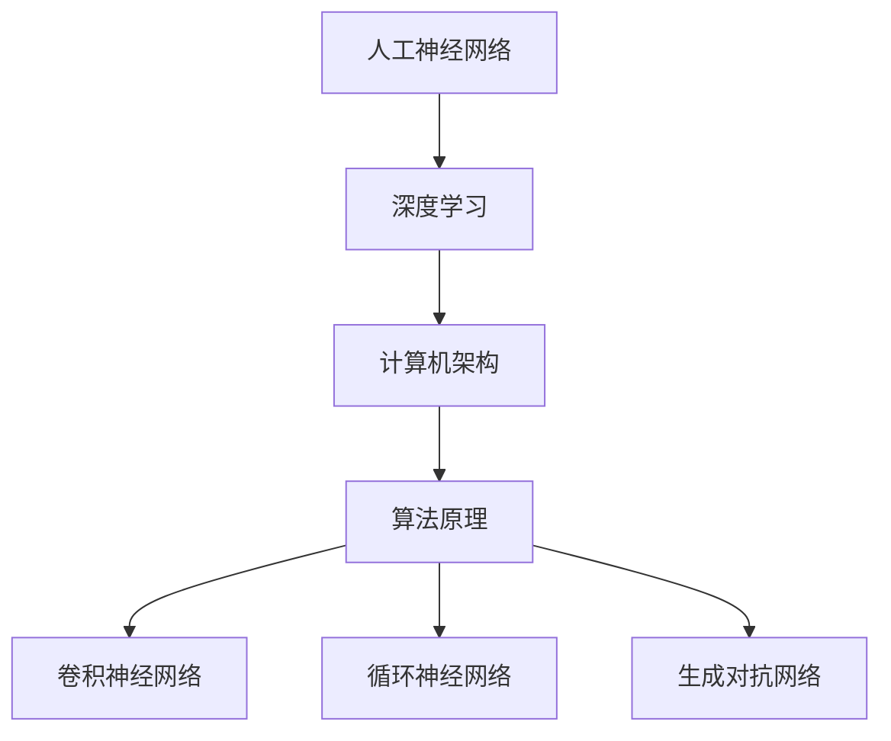

                 

关键词：基础模型、技术生态系统、人工智能、深度学习、计算机架构、算法原理、数学模型、项目实践、应用场景、发展趋势、工具资源

> 摘要：本文将深入探讨基础模型的技术生态系统，从背景介绍、核心概念与联系、核心算法原理、数学模型和公式、项目实践、实际应用场景、未来应用展望、工具和资源推荐以及总结未来发展趋势与挑战等方面，全面解析基础模型在人工智能领域的地位与作用。

## 1. 背景介绍

随着人工智能技术的飞速发展，基础模型作为人工智能的核心组成部分，已经成为了当前科技领域的热点话题。基础模型是指在特定任务或领域中，通过训练和优化得到的可以泛化的模型，其目的是通过学习大量的数据，自动提取特征，实现从数据中学习和预测的能力。基础模型的成功应用，不仅推动了人工智能技术的进步，也为各行各业带来了深远的变革。

本文将从基础模型的技术生态系统的角度，详细探讨其核心概念、算法原理、数学模型、项目实践以及未来应用前景，以期为读者提供一份全面的技术指南。

## 2. 核心概念与联系

### 2.1 人工神经网络

人工神经网络（Artificial Neural Networks，ANN）是基础模型的核心组成部分。它通过模拟生物神经网络的结构和功能，实现数据的处理和学习的功能。人工神经网络的基本单元是神经元，每个神经元通过权重连接到其他神经元，通过激活函数产生输出。

### 2.2 深度学习

深度学习（Deep Learning，DL）是人工神经网络的一种，其特点是使用多层神经网络进行学习，通过逐层抽象和提取特征，实现复杂任务的学习和预测。深度学习的兴起，标志着人工智能技术进入了一个新的时代。

### 2.3 计算机架构

计算机架构（Computer Architecture）是基础模型运行的基础。随着人工智能技术的发展，计算机架构也在不断演进，以适应更高效的计算需求。例如，GPU（图形处理器）和TPU（张量处理器）的引入，大大提高了深度学习的计算效率。

### 2.4 算法原理

算法原理是基础模型的核心。深度学习的核心算法包括卷积神经网络（CNN）、循环神经网络（RNN）、生成对抗网络（GAN）等。这些算法通过不同的方式，实现了对数据的处理和学习。



## 3. 核心算法原理 & 具体操作步骤

### 3.1 算法原理概述

深度学习的核心算法包括卷积神经网络（CNN）、循环神经网络（RNN）和生成对抗网络（GAN）。CNN主要用于图像处理，通过卷积层提取特征；RNN主要用于序列数据处理，通过循环结构记忆序列信息；GAN主要用于生成数据，通过生成器和判别器的对抗训练，实现数据的生成。

### 3.2 算法步骤详解

以卷积神经网络为例，其基本步骤包括：

1. **输入层**：接收输入数据，如图像或序列。
2. **卷积层**：通过卷积操作提取特征，如边缘、纹理等。
3. **池化层**：对卷积层的结果进行降采样，减少参数数量，提高计算效率。
4. **全连接层**：将卷积层和池化层的输出进行全连接，得到最终的分类结果。

### 3.3 算法优缺点

CNN具有强大的特征提取能力，适用于图像处理任务；但其在处理序列数据时效果不佳。RNN能够处理序列数据，但容易出现梯度消失或梯度爆炸的问题。GAN能够生成高质量的数据，但训练过程复杂，需要大量计算资源。

### 3.4 算法应用领域

CNN广泛应用于图像识别、图像分类、目标检测等任务；RNN广泛应用于自然语言处理、语音识别等任务；GAN广泛应用于图像生成、数据增强等任务。

## 4. 数学模型和公式 & 详细讲解 & 举例说明

### 4.1 数学模型构建

深度学习的数学模型主要基于概率统计和优化理论。以卷积神经网络为例，其核心公式包括：

1. **卷积操作**：\( (f * g)(x) = \sum_{y} f(y) \cdot g(x-y) \)
2. **激活函数**：\( f(x) = \max(0, x) \)（ReLU函数）
3. **损失函数**：\( J(\theta) = \frac{1}{m} \sum_{i=1}^{m} (-y_{i} \cdot \log(a_{i}) + (1 - y_{i}) \cdot \log(1 - a_{i})) \)（交叉熵损失函数）

### 4.2 公式推导过程

以交叉熵损失函数为例，其推导过程如下：

假设有 \( m \) 个样本，每个样本有两个类别，正类别和负类别。设 \( y_{i} \) 为第 \( i \) 个样本的标签，\( a_{i} \) 为第 \( i \) 个样本的预测概率。

交叉熵损失函数的定义为：
$$
J(\theta) = -\frac{1}{m} \sum_{i=1}^{m} [y_{i} \cdot \log(a_{i}) + (1 - y_{i}) \cdot \log(1 - a_{i})]
$$

其中，\( \log \) 表示自然对数，\( \theta \) 表示模型的参数。

### 4.3 案例分析与讲解

以图像分类任务为例，使用卷积神经网络进行图像分类的过程如下：

1. **数据预处理**：对图像进行预处理，包括缩放、裁剪、归一化等操作。
2. **模型构建**：构建卷积神经网络模型，包括输入层、卷积层、池化层和全连接层。
3. **模型训练**：使用训练数据对模型进行训练，优化模型参数。
4. **模型评估**：使用验证数据对模型进行评估，调整模型参数。
5. **模型应用**：使用测试数据对模型进行测试，评估模型性能。

## 5. 项目实践：代码实例和详细解释说明

### 5.1 开发环境搭建

首先，我们需要搭建一个深度学习环境。以 Python 为例，我们可以使用 TensorFlow 和 Keras 库来搭建环境。

```python
pip install tensorflow
pip install keras
```

### 5.2 源代码详细实现

以下是一个简单的卷积神经网络实现：

```python
from keras.models import Sequential
from keras.layers import Conv2D, MaxPooling2D, Flatten, Dense

model = Sequential()
model.add(Conv2D(32, (3, 3), activation='relu', input_shape=(64, 64, 3)))
model.add(MaxPooling2D(pool_size=(2, 2)))
model.add(Flatten())
model.add(Dense(128, activation='relu'))
model.add(Dense(1, activation='sigmoid'))

model.compile(optimizer='adam', loss='binary_crossentropy', metrics=['accuracy'])
```

### 5.3 代码解读与分析

以上代码首先导入了所需的库，然后构建了一个简单的卷积神经网络模型。该模型包含一个卷积层、一个池化层、一个全连接层和一个输出层。其中，卷积层用于提取图像特征，池化层用于降采样，全连接层用于分类，输出层用于生成预测结果。

### 5.4 运行结果展示

```python
model.fit(x_train, y_train, epochs=10, batch_size=32, validation_data=(x_val, y_val))
```

以上代码用于训练模型。在训练过程中，模型将使用训练数据进行迭代，每迭代一次称为一个 epoch。每个 epoch 包含多个 batch，每个 batch 包含多个样本。通过多次迭代，模型将不断优化参数，提高分类准确率。

## 6. 实际应用场景

基础模型在人工智能领域有着广泛的应用，以下是几个典型的应用场景：

1. **图像识别**：卷积神经网络在图像识别任务中有着出色的表现，如人脸识别、物体检测等。
2. **自然语言处理**：循环神经网络和变换器在自然语言处理任务中有着广泛的应用，如机器翻译、情感分析等。
3. **推荐系统**：基于深度学习的基础模型可以用于构建推荐系统，如商品推荐、电影推荐等。

## 7. 未来应用展望

随着人工智能技术的不断进步，基础模型在未来将会有更广泛的应用。以下是一些可能的未来应用：

1. **智能医疗**：基础模型可以用于疾病诊断、药物研发等任务，提高医疗水平。
2. **智能交通**：基础模型可以用于交通流量预测、智能驾驶等任务，提高交通安全。
3. **智能客服**：基础模型可以用于构建智能客服系统，提高客户服务质量。

## 8. 工具和资源推荐

为了更好地学习和实践基础模型，以下是一些推荐的工具和资源：

### 8.1 学习资源推荐

1. **《深度学习》**：由 Goodfellow、Bengio 和 Courville 著，是一本经典的深度学习教材。
2. **《Python 深度学习》**：由 Françoise 友和 Marco Gori 著，介绍了如何使用 Python 实现深度学习。

### 8.2 开发工具推荐

1. **TensorFlow**：一款广泛使用的开源深度学习框架，适用于各种深度学习任务。
2. **Keras**：一款基于 TensorFlow 的简化深度学习框架，使得深度学习编程更加便捷。

### 8.3 相关论文推荐

1. **《A Comprehensive Survey on Deep Learning for NLP》**：一篇关于深度学习在自然语言处理领域的综述。
2. **《GAN: Generative Adversarial Nets》**：一篇关于生成对抗网络的经典论文。

## 9. 总结：未来发展趋势与挑战

基础模型作为人工智能的核心组成部分，将在未来发挥越来越重要的作用。随着技术的不断进步，基础模型的应用领域将不断拓展。然而，基础模型的发展也面临着一些挑战，如计算资源的需求、数据隐私和安全等问题。未来，我们需要进一步研究如何优化基础模型的性能，提高其鲁棒性和可解释性，以更好地服务于人类社会。

## 10. 附录：常见问题与解答

### 10.1 基础模型是什么？

基础模型是指通过训练和优化得到的可以泛化的模型，其目的是通过学习大量的数据，自动提取特征，实现从数据中学习和预测的能力。

### 10.2 深度学习和机器学习有什么区别？

深度学习是机器学习的一个子领域，其主要区别在于使用多层神经网络进行学习，通过逐层抽象和提取特征，实现复杂任务的学习和预测。

### 10.3 基础模型有哪些应用领域？

基础模型在图像识别、自然语言处理、推荐系统、智能医疗、智能交通等领域有着广泛的应用。

### 10.4 如何搭建一个深度学习环境？

可以使用 Python 和 TensorFlow 或 Keras 等库来搭建深度学习环境。

### 10.5 如何优化基础模型的性能？

可以通过调整模型结构、优化训练策略、使用更好的初始化方法等方式来优化基础模型的性能。

### 10.6 基础模型的发展面临哪些挑战？

基础模型的发展面临计算资源的需求、数据隐私和安全等问题。未来，我们需要进一步研究如何优化基础模型的性能，提高其鲁棒性和可解释性，以更好地服务于人类社会。

---

作者：禅与计算机程序设计艺术 / Zen and the Art of Computer Programming

