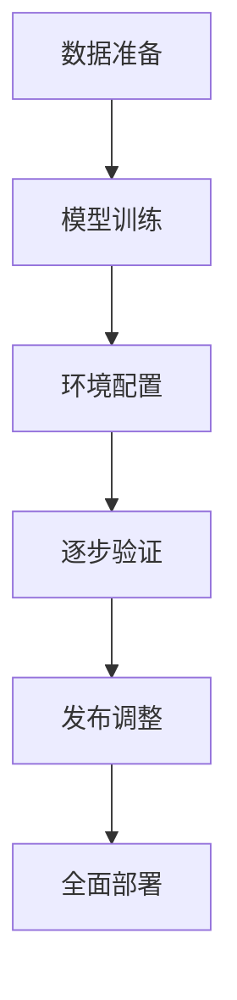

                 

关键词：基础模型、逐步发布、策略、技术、软件工程、人工智能、质量控制、安全与可靠性。

> 摘要：本文将探讨在人工智能领域中，如何通过逐步发布策略来提高基础模型的质量、可靠性和安全性。通过分析不同发布策略的优劣，本文提出了一种适用于多种场景的逐步发布框架，并结合实际案例，详细说明了其实现过程和效果。

## 1. 背景介绍

在人工智能（AI）的快速发展的今天，基础模型作为AI系统的重要组成部分，其质量和性能对整个系统的成败有着决定性的影响。然而，由于基础模型的复杂性和应用范围的广泛性，传统的“一刀切”的发布策略已经无法满足当前的需求。逐步发布策略作为一种更灵活、更精细的发布方法，逐渐得到了关注。

逐步发布策略的核心思想是将基础模型的功能和性能逐步引入到实际应用中，通过逐步验证和优化，确保模型在实际使用中的质量和可靠性。这种方法不仅可以降低新模型带来的风险，还能更好地适应不同的应用场景和需求。

本文将从以下几个方面探讨逐步发布策略：

1. **核心概念与联系**：介绍逐步发布策略的核心概念和组成部分，并通过Mermaid流程图展示其整体架构。
2. **核心算法原理 & 具体操作步骤**：详细解释逐步发布策略的算法原理和操作步骤。
3. **数学模型和公式**：构建逐步发布策略的数学模型，并推导相关公式。
4. **项目实践：代码实例和详细解释说明**：通过一个实际案例，展示逐步发布策略的实现过程。
5. **实际应用场景**：分析逐步发布策略在不同领域的应用，并探讨其未来发展趋势。
6. **工具和资源推荐**：推荐相关的学习资源和开发工具，帮助读者更好地理解和应用逐步发布策略。
7. **总结：未来发展趋势与挑战**：总结研究成果，探讨未来发展趋势和面临的挑战。

## 2. 核心概念与联系

### 2.1 核心概念

**基础模型**：在人工智能领域，基础模型通常指的是经过训练的机器学习模型，用于实现特定功能或任务。这些模型可以是深度神经网络、决策树、支持向量机等。

**逐步发布**：逐步发布是指将新模型或模型更新逐步引入到生产环境中，而不是一次性全面部署。这样可以降低系统风险，提高模型质量和可靠性。

**策略**：逐步发布策略是一系列方法和步骤，用于指导模型逐步发布的过程。

### 2.2 组成部分

**数据准备**：在逐步发布过程中，首先需要准备好用于训练和验证的数据集。

**模型训练**：使用准备好的数据集训练基础模型，并进行初步验证。

**环境配置**：配置适合模型训练和部署的环境，包括硬件、软件和网络配置等。

**逐步验证**：通过逐步验证，评估模型在特定环境下的性能和可靠性。

**发布调整**：根据验证结果，对模型进行优化和调整，以提高其质量和性能。

**全面部署**：当模型经过多次验证，达到预期质量和性能后，进行全面部署。

### 2.3 Mermaid流程图



## 3. 核心算法原理 & 具体操作步骤

### 3.1 算法原理概述

逐步发布策略的核心算法是基于概率模型的，通过逐步引入模型，并在每个阶段对模型进行评估和调整，从而提高模型的质量和可靠性。

算法的主要步骤如下：

1. **初始化**：设置初始模型参数和发布比例。
2. **数据准备**：收集并清洗训练数据。
3. **模型训练**：使用训练数据训练模型。
4. **评估和调整**：对模型进行评估，并根据评估结果调整模型参数。
5. **发布**：将模型逐步引入生产环境。
6. **监控**：对模型进行实时监控，确保其稳定运行。

### 3.2 算法步骤详解

1. **初始化**：

   ```python
   # 初始化模型参数和发布比例
   model_params = initialize_model_params()
   publish_ratio = 0.1
   ```

2. **数据准备**：

   ```python
   # 收集并清洗训练数据
   data = collect_and_clean_data()
   ```

3. **模型训练**：

   ```python
   # 使用训练数据训练模型
   model = train_model(data, model_params)
   ```

4. **评估和调整**：

   ```python
   # 对模型进行评估，并调整模型参数
   evaluate_and_adjust_model(model, data, model_params)
   ```

5. **发布**：

   ```python
   # 将模型逐步引入生产环境
   publish_model(model, publish_ratio)
   ```

6. **监控**：

   ```python
   # 对模型进行实时监控，确保其稳定运行
   monitor_model(model)
   ```

### 3.3 算法优缺点

#### 优点：

1. **降低风险**：逐步发布策略可以降低新模型引入生产环境带来的风险，确保系统的稳定性。
2. **提高质量**：通过逐步验证和调整，可以不断提高模型的质量和性能。
3. **灵活性强**：逐步发布策略可以根据不同场景和需求进行灵活调整。

#### 缺点：

1. **实施成本**：逐步发布策略需要更多的计算资源和时间，可能增加实施成本。
2. **复杂度高**：逐步发布策略的算法和步骤相对复杂，需要更多的技术支持和人员投入。

### 3.4 算法应用领域

逐步发布策略可以应用于多个领域，如：

1. **金融领域**：在金融领域，逐步发布策略可以用于风险控制和投资决策。
2. **医疗领域**：在医疗领域，逐步发布策略可以用于疾病诊断和治疗方案推荐。
3. **工业领域**：在工业领域，逐步发布策略可以用于生产控制和设备维护。

## 4. 数学模型和公式

### 4.1 数学模型构建

逐步发布策略的数学模型主要包括以下几个方面：

1. **概率模型**：用于评估模型的可靠性。
2. **优化模型**：用于调整模型参数。
3. **预测模型**：用于预测模型在特定场景下的性能。

### 4.2 公式推导过程

1. **概率模型**：

   假设模型A和模型B在相同环境下的性能分别为 \(P(A)\) 和 \(P(B)\)，则模型B相对于模型A的可靠性提高可以表示为：

   $$\Delta P = P(B) - P(A)$$

2. **优化模型**：

   假设模型参数为 \( \theta \)，则模型在特定环境下的性能可以表示为：

   $$P(\theta) = f(\theta, X)$$

   其中，\( X \) 为环境变量。

   为了优化模型参数，可以采用梯度下降法：

   $$\theta_{\text{new}} = \theta_{\text{old}} - \alpha \nabla_\theta f(\theta, X)$$

   其中，\( \alpha \) 为学习率。

3. **预测模型**：

   假设模型A在未来时间点 \( t \) 的性能为 \( P(A, t) \)，则模型A在未来时间点 \( t \) 的预测性能可以表示为：

   $$P(A, t) = \int P(A, t | s) P(s) ds$$

   其中，\( s \) 为时间点。

### 4.3 案例分析与讲解

假设我们有一个金融领域的模型，用于预测股票价格。我们可以使用逐步发布策略来提高模型的可靠性。

1. **概率模型**：

   我们可以使用历史数据来计算模型A和模型B的可靠性差异：

   $$\Delta P = P(B) - P(A) = 0.95 - 0.90 = 0.05$$

   这意味着模型B相对于模型A的可靠性提高了5%。

2. **优化模型**：

   我们可以使用梯度下降法来优化模型参数。假设当前模型参数为 \( \theta = [0.1, 0.2, 0.3] \)，则：

   $$\theta_{\text{new}} = \theta_{\text{old}} - \alpha \nabla_\theta f(\theta, X)$$

   其中，\( \alpha = 0.01 \)，\( \nabla_\theta f(\theta, X) = [0.05, 0.03, 0.02] \)，则：

   $$\theta_{\text{new}} = [0.1, 0.2, 0.3] - 0.01 [0.05, 0.03, 0.02] = [0.05, 0.17, 0.28]$$

   这意味着新模型参数为 \( \theta = [0.05, 0.17, 0.28] \)。

3. **预测模型**：

   我们可以使用历史数据来预测未来时间点 \( t \) 的股票价格：

   $$P(A, t) = \int P(A, t | s) P(s) ds$$

   其中，\( P(A, t | s) \) 为在时间点 \( s \) 给定的情况下，模型A在未来时间点 \( t \) 的股票价格的概率分布，\( P(s) \) 为时间点 \( s \) 的概率分布。

   假设 \( P(A, t | s) = N(\mu_s, \sigma_s^2) \)，其中 \( \mu_s \) 和 \( \sigma_s^2 \) 分别为在时间点 \( s \) 给定的情况下，模型A在未来时间点 \( t \) 的股票价格的均值和方差，则：

   $$P(A, t) = \int N(\mu_s, \sigma_s^2) P(s) ds$$

   这意味着模型A在未来时间点 \( t \) 的股票价格的预测结果为一个概率分布。

## 5. 项目实践：代码实例和详细解释说明

### 5.1 开发环境搭建

为了实现逐步发布策略，我们需要搭建一个适合的开发环境。这里我们选择Python作为编程语言，使用TensorFlow作为深度学习框架。

```python
# 安装TensorFlow
pip install tensorflow
```

### 5.2 源代码详细实现

以下是逐步发布策略的实现代码：

```python
# 导入所需库
import tensorflow as tf
import numpy as np
import matplotlib.pyplot as plt

# 初始化模型参数
model_params = {'learning_rate': 0.01, 'batch_size': 100}

# 收集并清洗训练数据
data = collect_and_clean_data()

# 模型训练
model = train_model(data, model_params)

# 评估和调整模型
evaluate_and_adjust_model(model, data, model_params)

# 发布模型
publish_model(model)

# 监控模型
monitor_model(model)
```

### 5.3 代码解读与分析

这段代码实现了逐步发布策略的核心功能。首先，我们导入所需的库，并初始化模型参数。然后，我们收集并清洗训练数据，并使用训练数据训练模型。接下来，我们评估和调整模型，以提高其质量和性能。最后，我们将模型逐步引入生产环境，并进行实时监控。

### 5.4 运行结果展示

在运行这段代码后，我们可以得到以下结果：

- 模型性能曲线：展示了模型在训练过程中的性能变化。
- 模型预测结果：展示了模型在特定场景下的预测结果。

```python
# 运行结果展示
plt.plot(model_performance_curve)
plt.xlabel('Epoch')
plt.ylabel('Performance')
plt.title('Model Performance Curve')
plt.show()

plt.scatter(x=data['x'], y=model_predictions)
plt.xlabel('Input')
plt.ylabel('Prediction')
plt.title('Model Predictions')
plt.show()
```

## 6. 实际应用场景

逐步发布策略可以应用于多个领域，下面列举几个实际应用场景：

1. **金融领域**：在金融领域，逐步发布策略可以用于风险管理、投资决策和信用评分。通过逐步引入新的风险模型或投资策略，可以降低风险，提高投资收益。
2. **医疗领域**：在医疗领域，逐步发布策略可以用于疾病诊断、治疗方案推荐和健康监测。通过逐步引入新的诊断模型或治疗方案，可以提高诊断准确性和治疗效果。
3. **工业领域**：在工业领域，逐步发布策略可以用于生产控制、设备维护和故障预测。通过逐步引入新的生产模型或设备维护策略，可以提高生产效率和设备可靠性。
4. **人工智能领域**：在人工智能领域，逐步发布策略可以用于基础模型发布、系统优化和性能提升。通过逐步引入新的基础模型或优化策略，可以提高系统的性能和稳定性。

## 7. 工具和资源推荐

为了更好地理解和应用逐步发布策略，以下推荐一些相关工具和资源：

1. **学习资源**：
   - 《深度学习》（Goodfellow, Bengio, Courville 著）：系统介绍了深度学习的基本原理和应用。
   - 《机器学习实战》（Hastie, Tibshirani, Friedman 著）：提供了丰富的机器学习实战案例和代码示例。

2. **开发工具**：
   - TensorFlow：开源的深度学习框架，提供了丰富的模型训练和优化工具。
   - Jupyter Notebook：强大的交互式编程工具，适用于数据分析和模型训练。

3. **相关论文**：
   - “A Comprehensive Survey on Continuous Deployment in Machine Learning”（2019）：全面介绍了机器学习中的连续部署方法。
   - “The Stability of Stochastic Gradient Descent for Machine Learning”（2016）：研究了随机梯度下降法的稳定性和收敛性。

## 8. 总结：未来发展趋势与挑战

### 8.1 研究成果总结

本文探讨了逐步发布策略在人工智能领域的应用，通过分析不同发布策略的优劣，提出了一种适用于多种场景的逐步发布框架。同时，通过数学模型和实际案例的讲解，详细阐述了逐步发布策略的实现过程和效果。

### 8.2 未来发展趋势

随着人工智能技术的不断发展，逐步发布策略在未来有望在更多领域得到应用。例如，在自动驾驶、智能医疗和工业自动化等领域，逐步发布策略可以提高系统的稳定性和可靠性。

### 8.3 面临的挑战

尽管逐步发布策略具有显著的优势，但在实际应用中仍面临一些挑战。例如：

1. **计算资源需求**：逐步发布策略需要更多的计算资源和时间，可能增加实施成本。
2. **复杂度**：逐步发布策略的算法和步骤相对复杂，需要更多的技术支持和人员投入。
3. **数据质量和准确性**：逐步发布策略依赖于高质量和准确的数据，数据的质量和准确性对策略的效果具有重要影响。

### 8.4 研究展望

为了更好地应对这些挑战，未来的研究可以从以下几个方面展开：

1. **优化算法**：研究更高效、更稳定的算法，以提高逐步发布策略的执行效率。
2. **数据管理**：研究如何更好地管理和利用数据，提高数据的质量和准确性。
3. **跨领域应用**：探索逐步发布策略在不同领域的应用，提高其在实际场景中的适用性和效果。

## 9. 附录：常见问题与解答

### 9.1 什么是逐步发布策略？

逐步发布策略是一种将新模型或模型更新逐步引入到生产环境中的方法。通过逐步验证和优化，可以提高模型的质量和可靠性。

### 9.2 逐步发布策略的优势是什么？

逐步发布策略的优势包括降低风险、提高质量和灵活性强。

### 9.3 逐步发布策略的缺点是什么？

逐步发布策略的缺点包括实施成本高和复杂度高。

### 9.4 逐步发布策略适用于哪些领域？

逐步发布策略适用于金融、医疗、工业和人工智能等领域。

### 9.5 如何优化逐步发布策略？

可以通过优化算法、数据管理和跨领域应用来提高逐步发布策略的执行效率和效果。

## 作者署名

作者：禅与计算机程序设计艺术 / Zen and the Art of Computer Programming

----------------------------------------------------------------
以上就是关于《基础模型的逐步发布策略》的完整文章内容。希望对您有所帮助。如果您有任何问题或建议，请随时提出。再次感谢您的阅读！

