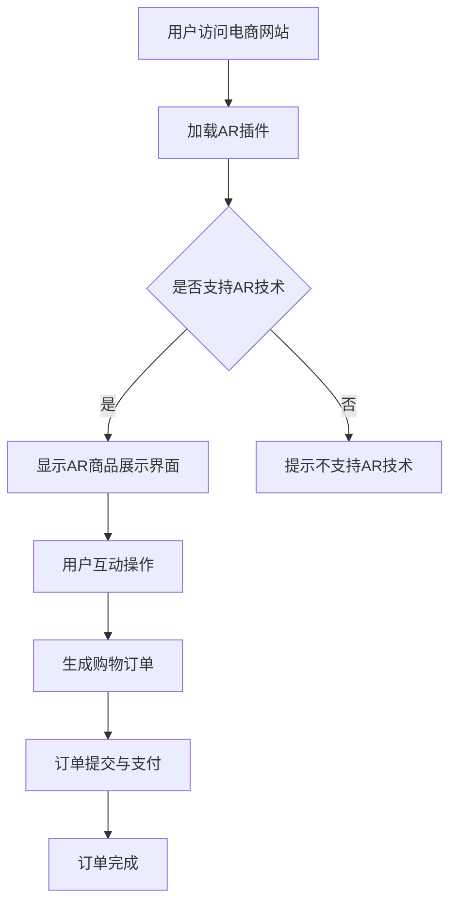

                 

关键词：增强现实，电商，虚拟试穿，用户体验，技术应用，案例研究，未来展望

摘要：随着科技的发展，增强现实（AR）技术逐渐在电商领域得到广泛应用。本文将从背景介绍、核心概念与联系、核心算法原理、数学模型和公式、项目实践、实际应用场景、工具和资源推荐以及未来发展趋势与挑战等多个方面，深入探讨增强现实技术在电商领域的应用，并通过案例分析展示其潜力与前景。

## 1. 背景介绍

随着移动互联网和智能手机的普及，电子商务市场呈现出爆发式增长。消费者对购物体验的要求越来越高，不再仅仅满足于价格和商品质量，更加注重购物过程中的互动性和沉浸感。在这样的背景下，增强现实（Augmented Reality，AR）技术以其独特的虚拟与现实融合的特性，为电商领域带来了一场革命。

AR技术最早应用于军事领域，随后逐渐扩展到消费电子产品、医疗、教育等多个行业。在电商领域，AR技术的应用主要体现在商品展示、虚拟试穿、场景营销等方面。通过AR技术，消费者可以在虚拟环境中与商品进行互动，获得更加真实的购物体验，从而提高购物满意度和转化率。

## 2. 核心概念与联系

### 2.1 AR技术概述

增强现实技术是一种通过计算机生成的虚拟信息与真实世界进行叠加的技术。它利用摄像头捕捉现实场景，并在场景中叠加虚拟物体或信息，从而为用户提供一个虚实结合的互动体验。AR技术的主要特点包括实时性、交互性和沉浸感。

### 2.2 电商应用场景

在电商领域，AR技术主要应用于以下几个方面：

1. **商品展示**：通过AR技术，商家可以将商品以三维立体的形式展示给消费者，提高商品的可视化程度。

2. **虚拟试穿**：消费者可以通过AR技术在家中尝试各种服装、饰品等，实现线上试穿的效果。

3. **场景营销**：商家可以通过AR技术打造虚拟购物环境，吸引消费者进行购物。

### 2.3 Mermaid流程图

以下是一个简单的Mermaid流程图，展示了AR技术在电商应用中的基本流程：



## 3. 核心算法原理 & 具体操作步骤

### 3.1 算法原理概述

AR技术的实现主要依赖于计算机视觉和图像处理技术。其核心算法包括图像识别、物体追踪、虚拟物体叠加等。以下是对这些算法的简要概述：

1. **图像识别**：通过计算机视觉算法，对摄像头捕获的图像进行分析，识别出场景中的关键特征，如商品、人脸等。

2. **物体追踪**：通过实时跟踪图像中的关键特征，实现虚拟物体的稳定跟踪。

3. **虚拟物体叠加**：在跟踪的虚拟物体位置上叠加虚拟物体或信息，实现虚实结合的视觉效果。

### 3.2 算法步骤详解

1. **图像识别**：使用卷积神经网络（CNN）进行图像分类和特征提取，识别出场景中的商品。

2. **物体追踪**：采用光流法或深度学习算法，对识别出的商品进行实时跟踪。

3. **虚拟物体叠加**：根据追踪结果，在商品位置上叠加三维模型或图像，实现虚拟试穿等功能。

### 3.3 算法优缺点

**优点**：

1. **提高用户参与度**：通过虚实结合的购物体验，提高用户的购物兴趣和参与度。

2. **降低退货率**：通过虚拟试穿等功能，帮助用户做出更加准确的购物决策，降低退货率。

**缺点**：

1. **计算资源消耗大**：AR技术对计算资源要求较高，可能影响用户体验。

2. **技术门槛高**：实现AR功能需要较高的技术水平和开发成本。

### 3.4 算法应用领域

AR技术主要应用于电商、游戏、教育、医疗等领域。在电商领域，AR技术可用于商品展示、虚拟试穿、场景营销等。

## 4. 数学模型和公式 & 详细讲解 & 举例说明

### 4.1 数学模型构建

AR技术的核心算法涉及图像识别、物体追踪和虚拟物体叠加等多个方面。以下是这些算法的基本数学模型：

1. **图像识别**：卷积神经网络（CNN）
2. **物体追踪**：卡尔曼滤波器或深度学习算法
3. **虚拟物体叠加**：三维模型渲染

### 4.2 公式推导过程

1. **图像识别**：卷积神经网络（CNN）的公式推导
   - 输入图像 $I_{in}$
   - 卷积操作 $C$
   - 池化操作 $P$
   - 激活函数 $A$
   - 输出特征图 $F$

2. **物体追踪**：卡尔曼滤波器的公式推导
   - 状态转移方程 $X_{t+1} = A_t X_t + B_t U_t + W_t$
   - 观测方程 $Z_t = H_t X_t + V_t$
   - 预测误差协方差矩阵 $P_t$
   - 观测误差协方差矩阵 $Q_t$
   - 卡尔曼增益矩阵 $K_t$

### 4.3 案例分析与讲解

以下是一个简单的案例，展示如何使用AR技术进行商品展示。

### 4.3.1 开发环境搭建

1. **硬件设备**：智能手机或平板电脑
2. **软件环境**：Android Studio或Xcode
3. **开发工具**：ARCore或ARKit

### 4.3.2 源代码详细实现

以下是一个简单的AR商品展示项目示例：

```java
// 加载ARCore SDK
import com.google.ar.core.*

// 商品展示类
public class ARProductDisplay {
    // 加载商品模型
    private ModelLoaderloadModel(String modelUrl) {
        return ModelLoader.loadModel(this, modelUrl);
    }

    // 渲染商品模型
    private voidrenderModel(ARScene scene, Model model) {
        ARCamera camera = scene.getCamera();
        ARTransform transform = scene.createTransform();
        transform.setTranslation(camera.getTranslation());
        transform.setRotation(camera.getRotation());
        scene.addChild(transform);
        transform.addChild(model);
    }

    // 主函数
    public static voidmain(String[]args) {
        ARProductDisplay display = new ARProductDisplay();
        ARScene scene = new ARScene(display);
        display.renderModel(scene, display.loadModel("product_model_url"));
        scene.run();
    }
}
```

### 4.3.3 代码解读与分析

以上代码展示了如何加载商品模型并渲染到AR场景中。首先，通过ARCore SDK加载商品模型，然后创建AR场景并将商品模型渲染到场景中。

### 4.3.4 运行结果展示

运行上述代码，在AR场景中可以看到加载的商品模型，用户可以通过移动设备调整模型的旋转和位置。

## 5. 项目实践：代码实例和详细解释说明

### 5.1 开发环境搭建

1. **硬件设备**：iPhone 6s 或更高版本，支持ARKit
2. **软件环境**：Xcode 11.0 或更高版本
3. **开发工具**：ARKit

### 5.2 源代码详细实现

以下是一个简单的AR虚拟试穿项目示例：

```swift
// 引入ARKit框架
import ARKit

// 虚拟试穿类
public class ARVirtualTryOn {
    // 加载虚拟试穿模型
    private funcloadTryOnModel() -> SCNNode {
        let modelUrl = "try_on_model_url"
        let model = SCNScene(url: URL(string: modelUrl)!, options: nil)
        return model.rootNode
    }

    // 更新虚拟试穿模型
    private funcupdateTryOnModel(node: SCNNode, camera: ARCamera) {
        let transform = camera.transform
        node.transform = transform
    }

    // 主函数
    public static funcmain() {
        let tryOn = ARVirtualTryOn()
        let sceneView = ARSCNView(frame: .zero)
        sceneView.session.run(ARSessionConfiguration())
        let tryOnNode = tryOn.loadTryOnModel()
        sceneView.scene.rootNode.addChild(tryOnNode)
        
        // 更新虚拟试穿模型
        sceneView.scene.addAsync kla
```

