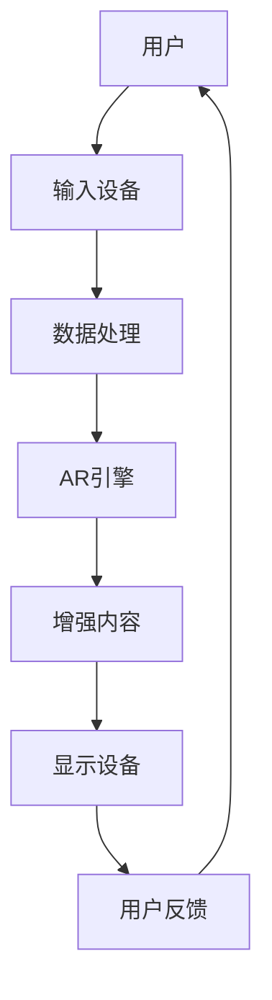

                 

关键词：增强现实、应用开发、实现、AR技术、AR应用、开发框架、编程语言、硬件设备、用户体验、未来展望

> 摘要：本文将深入探讨增强现实（AR）应用开发的各个方面，从基础概念到具体实现，为读者提供一个全面的指南。我们将介绍AR技术的历史、核心概念、开发框架、编程语言、硬件设备、用户体验设计，以及未来应用场景和发展趋势。

## 1. 背景介绍

增强现实（Augmented Reality，简称AR）是一种将虚拟信息与真实世界相结合的技术。用户通过AR设备，如智能手机、平板电脑或头戴式显示器，可以看到叠加在现实世界上的虚拟物体或信息。AR技术最早可以追溯到1990年代，但随着硬件技术的进步和移动设备的普及，近年来AR应用得到了迅速发展。

### 1.1 增强现实技术的起源

增强现实的概念最早由美国科学家阿尔文·托夫勒在1986年的著作《未来的冲击》中提出。随后，研究者们开始探索如何在现实环境中叠加数字信息。1990年代，随着计算机图形学和计算机视觉技术的发展，AR技术逐渐走向实用。

### 1.2 增强现实技术的应用领域

AR技术广泛应用于多个领域，包括医疗、教育、娱乐、零售和制造业等。在医疗领域，AR技术可以帮助医生进行手术指导和患者教育；在教育领域，AR应用可以为学生提供沉浸式的学习体验；在娱乐领域，AR游戏和应用程序吸引了大量用户；在零售领域，AR技术可以帮助消费者在虚拟环境中试穿服装或试用产品；在制造业，AR技术可以用于设备维护和操作培训。

## 2. 核心概念与联系

为了更好地理解AR技术，我们需要了解以下几个核心概念和它们之间的联系。

### 2.1 虚拟现实（VR）与增强现实（AR）

虚拟现实（Virtual Reality，简称VR）是一种完全沉浸式的体验，用户通过VR设备进入一个完全虚构的世界。而增强现实则是在现实世界的基础上叠加虚拟信息。VR和AR都是通过计算机生成视觉、听觉或其他感官信息，但AR更侧重于与现实世界的交互。

### 2.2 扩展现实（XR）

扩展现实（eXtended Reality，简称XR）是VR和AR的统称，还包括混合现实（Mixed Reality，简称MR）和全息现实（Holographic Reality，简称HR）。XR技术涵盖了从完全虚拟的环境到完全现实的环境，以及两者之间的各种混合形式。

### 2.3 Mermaid流程图

下面是一个简单的Mermaid流程图，展示了AR系统的基本组件和流程：



### 2.4 AR系统的基本组件

- **输入设备**：如摄像头、GPS、加速度计、陀螺仪等，用于捕捉现实世界的场景和用户的动作。
- **数据处理**：包括图像处理、传感器数据处理等，用于从输入设备获取的信息中提取有用的数据。
- **AR引擎**：用于处理虚拟信息和现实世界的融合，包括渲染、定位和追踪等技术。
- **增强内容**：包括虚拟物体、文本、音频等，这些内容叠加在现实世界之上。
- **显示设备**：将增强后的内容显示给用户，如智能手机屏幕、头戴式显示器等。

## 3. 核心算法原理 & 具体操作步骤

### 3.1 算法原理概述

AR技术的核心在于将虚拟信息与现实世界准确地对齐。这需要以下几种关键算法：

- **图像识别**：用于识别现实世界中的特定物体或场景。
- **姿态估计**：通过传感器数据估计设备的姿态，以确定虚拟信息的位置和方向。
- **渲染**：将虚拟信息渲染到现实世界的场景中，使其看起来真实。
- **遮挡处理**：处理虚拟信息与真实世界的遮挡关系，确保虚拟信息在正确的位置显示。

### 3.2 算法步骤详解

1. **图像识别**：使用卷积神经网络（CNN）或其他图像识别算法，识别现实世界中的物体或场景。
2. **姿态估计**：使用传感器数据（如加速度计、陀螺仪）进行姿态估计，以确定设备的方向和角度。
3. **匹配定位**：将识别结果与预先定义的模型进行匹配，确定虚拟信息的位置。
4. **渲染**：使用图形渲染器（如OpenGL或Vulkan）将虚拟信息渲染到现实世界场景中。
5. **遮挡处理**：根据虚拟信息和现实世界的遮挡关系，调整虚拟信息的透明度或位置。

### 3.3 算法优缺点

- **优点**：AR技术可以提供沉浸式的用户体验，增强现实世界的互动性。
- **缺点**：算法复杂度较高，需要大量的计算资源，且在复杂环境下可能存在识别和定位的困难。

### 3.4 算法应用领域

AR技术在多个领域都有广泛应用，包括但不限于：

- **医疗**：用于手术指导和患者教育。
- **教育**：提供沉浸式的学习体验。
- **娱乐**：开发AR游戏和应用。
- **零售**：用于虚拟试衣和产品展示。
- **制造业**：用于设备维护和操作培训。

## 4. 数学模型和公式 & 详细讲解 & 举例说明

### 4.1 数学模型构建

在AR系统中，常用的数学模型包括：

- **透视变换模型**：用于将虚拟信息渲染到现实世界场景中。
- **姿态估计模型**：基于传感器数据估计设备的姿态。
- **图像识别模型**：用于识别现实世界中的物体或场景。

### 4.2 公式推导过程

以下是透视变换模型的推导过程：

$$
\begin{align*}
x' &= \frac{x}{z} \\
y' &= \frac{y}{z}
\end{align*}
$$

其中，\( (x, y, z) \) 是虚拟信息在三维空间中的坐标，\( (x', y') \) 是其在二维平面上的投影坐标。

### 4.3 案例分析与讲解

假设我们有一个虚拟物体，其位置为 \( (1, 2, 3) \)，我们需要将其渲染到现实世界场景中。假设当前设备的姿态为 \( \theta_x = 30^\circ, \theta_y = 45^\circ, \theta_z = 60^\circ \)，我们可以使用以下公式计算其在二维平面上的投影坐标：

$$
\begin{align*}
x' &= \frac{1}{3} \cos(30^\circ) - \frac{2}{3} \sin(30^\circ) \\
y' &= \frac{1}{3} \sin(45^\circ) + \frac{2}{3} \cos(45^\circ)
\end{align*}
$$

计算结果为 \( x' \approx 0.577 \)，\( y' \approx 1.155 \)。这意味着虚拟物体将渲染到现实世界的 \( (0.577, 1.155) \) 位置。

## 5. 项目实践：代码实例和详细解释说明

### 5.1 开发环境搭建

为了开发AR应用，我们需要以下工具和软件：

- **编程语言**：Python、C++或Java等。
- **开发框架**：如Unity、ARKit（iOS）或ARCore（Android）。
- **AR引擎**：如Vuforia、ARFoundation等。
- **IDE**：如Visual Studio、Xcode或Android Studio。

### 5.2 源代码详细实现

以下是一个简单的AR应用示例，使用Unity和ARFoundation框架开发：

```csharp
using UnityEngine;
using UnityEngine.UI;
using UnityEngine.XR.ARFoundation;

public class ARApp : MonoBehaviour
{
    public Text debugText;

    private ARRaycastManager raycastManager;

    void Start()
    {
        raycastManager = FindObjectOfType<ARRaycastManager>();
    }

    void Update()
    {
        if (Input.touchCount > 0 && Input.touches[0].phase == TouchPhase.Began)
        {
            List<ARRaycastHit> hits = new List<ARRaycastHit>();

            if (raycastManager.Raycast(Input.touches[0].position, hits, UnityEngine.XR.ARSubsystems.ARHitTestResultType ExistingPlaneUsingPhysics))
            {
                Vector3 position = hits[0].pose.position;
                Vector3 rotation = hits[0].pose.rotation;

                // 创建一个虚拟文本对象
                Text text = Instantiate(debugText, position, rotation);

                // 更新文本内容
                text.text = $"Position: {position}\nRotation: {rotation}";
            }
        }
    }
}
```

### 5.3 代码解读与分析

上述代码是一个简单的AR应用，其核心功能是识别现实世界中的平面，并在该平面上创建一个虚拟文本对象。以下是代码的主要组成部分：

- **导入相关命名空间**：包括Unity的UI和XR库。
- **脚本组件**：定义一个ARApp类，继承自MonoBehaviour。
- **Start方法**：初始化ARRaycastManager。
- **Update方法**：处理触摸输入，识别平面，创建虚拟文本对象。

### 5.4 运行结果展示

当用户在现实世界中触碰屏幕时，应用将识别最近的平面，并在该平面上创建一个虚拟文本对象，显示其位置和旋转信息。

## 6. 实际应用场景

### 6.1 医疗

AR技术在医疗领域的应用非常广泛，包括手术指导、患者教育和医学模拟。例如，医生可以使用AR设备实时查看患者的三维结构图，从而更准确地执行手术。此外，患者也可以通过AR应用了解自己的健康状况，提高自我管理能力。

### 6.2 教育

AR技术在教育领域的应用可以为学生提供沉浸式的学习体验。例如，学生可以通过AR应用学习历史事件，仿佛亲身经历一样。此外，AR技术还可以用于远程教学，让学生在虚拟环境中与教师和其他学生互动。

### 6.3 娱乐

AR游戏和应用是娱乐领域的重要应用。例如，Pokemon Go是一款成功的AR游戏，用户可以在现实世界中捕捉虚拟的宝可梦。此外，AR技术还可以用于音乐表演和展览，为观众带来全新的体验。

### 6.4 零售

AR技术可以帮助消费者在虚拟环境中试穿服装或试用产品。例如，亚马逊推出了AR试妆应用，用户可以实时看到不同颜色的口红效果。此外，AR技术还可以用于产品展示和虚拟试驾。

### 6.5 制造业

AR技术可以用于设备维护和操作培训。例如，工人可以通过AR设备查看设备的运行状态和维修说明，从而更高效地完成任务。此外，AR技术还可以用于产品设计和制造过程的模拟。

## 7. 工具和资源推荐

### 7.1 学习资源推荐

- **在线教程**：Unity官方教程、ARFoundation官方文档。
- **书籍**：《增强现实应用开发》。
- **在线课程**：Coursera、edX上的AR相关课程。

### 7.2 开发工具推荐

- **Unity**：适用于开发复杂AR应用。
- **ARKit**：适用于iOS平台。
- **ARCore**：适用于Android平台。

### 7.3 相关论文推荐

- **"Augmented Reality: Principles and Practice"**。
- **"AR in Education: Opportunities and Challenges"**。

## 8. 总结：未来发展趋势与挑战

### 8.1 研究成果总结

AR技术在医疗、教育、娱乐和零售等领域取得了显著成果，提高了用户体验和工作效率。同时，随着硬件技术的发展，AR应用的性能和可访问性不断提高。

### 8.2 未来发展趋势

- **硬件技术**：更轻薄、更低功耗的AR设备。
- **算法优化**：提高图像识别和姿态估计的准确度。
- **集成应用**：与其他技术（如VR、AI）的深度融合。

### 8.3 面临的挑战

- **计算资源**：AR应用对计算资源的需求较高，需要优化算法和硬件。
- **用户体验**：提高AR应用的易用性和沉浸感。

### 8.4 研究展望

未来，AR技术有望在智能城市、智能制造和智能医疗等领域发挥重要作用，为人类社会带来更多创新和便利。

## 9. 附录：常见问题与解答

### 9.1 常见问题

- **Q：AR和VR的区别是什么？**
  **A：AR（增强现实）是在现实世界中叠加虚拟信息，而VR（虚拟现实）是创建一个完全虚构的世界。**
- **Q：如何学习AR开发？**
  **A：可以通过在线教程、书籍和课程学习AR开发，并尝试实际项目来提高技能。**

### 9.2 解答

上述问题解答提供了对AR和VR基本概念的区别，以及学习AR开发的途径。

---

本文全面介绍了AR应用开发的基础知识、核心算法、数学模型、项目实践以及未来发展趋势。希望读者能够通过本文，对AR技术有更深入的了解，并在实际项目中运用这些知识。作者：禅与计算机程序设计艺术 / Zen and the Art of Computer Programming。|markdown

