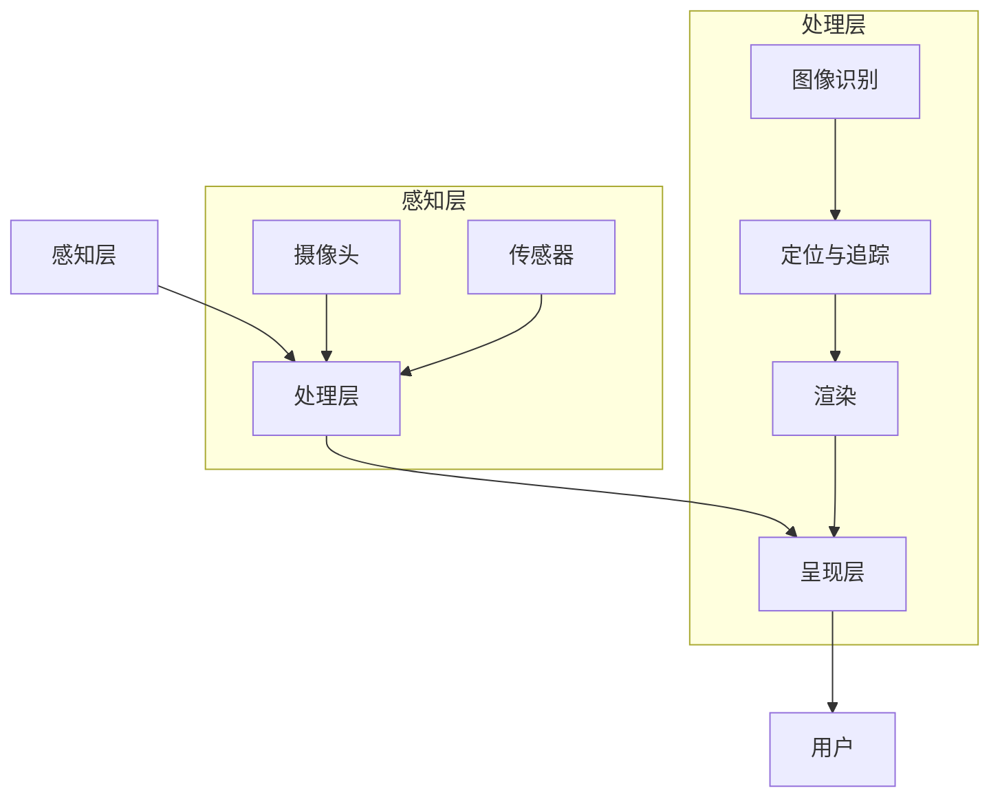

                 

关键词：增强现实、AR、虚拟现实、VR、技术探索、应用场景、核心算法、数学模型、项目实践

> 摘要：本文深入探讨了增强现实（AR）技术的核心概念、原理及其在各个领域的应用。通过分析增强现实技术的架构，详细介绍了几种核心算法及其数学模型，并提供了一个具体的代码实例来展示AR应用的开发过程。最后，文章展望了增强现实技术的发展趋势，并提出了未来可能面临的挑战。

## 1. 背景介绍

增强现实（Augmented Reality，简称 AR）是一种将虚拟信息与现实世界融合的技术。它通过计算机技术生成虚拟信息，并将其叠加到现实世界的场景中，使用户能够同时观察到现实和虚拟元素。与虚拟现实（Virtual Reality，简称 VR）不同，AR 主要是在现实环境中增强用户感知，而不是将用户完全带入一个虚拟的世界。

AR 技术的发展可以追溯到 20 世纪 60 年代，当时研究人员开始探索如何将计算机生成的图像与真实世界相结合。随着计算机性能的提高和显示技术的进步，AR 技术逐渐成熟，并开始应用于游戏、教育、医疗、制造业等多个领域。近年来，随着智能手机和移动设备的普及，AR 应用变得愈加广泛，用户可以通过手机或 AR 眼镜等设备轻松体验 AR 技术。

本文将围绕 AR 技术的核心概念、原理、算法、数学模型和应用实例展开深入探讨，旨在为读者提供一个全面的技术视角，并展望 AR 技术的未来发展。

## 2. 核心概念与联系

为了更好地理解 AR 技术，我们需要首先了解其核心概念和原理，以及它们之间的相互联系。

### 2.1. AR 的核心概念

- **现实世界**：指的是物理存在、可感知的世界。
- **虚拟世界**：由计算机生成的虚拟环境，包含图形、声音、文本等元素。
- **叠加**：将虚拟世界的元素叠加到现实世界的场景中。

### 2.2. AR 的原理

AR 技术的原理主要涉及以下几个方面：

- **图像识别**：通过计算机视觉技术识别现实世界中的物体或场景。
- **定位与追踪**：确定现实世界中物体的位置和运动，以便正确地将虚拟元素叠加到场景中。
- **渲染**：将虚拟元素渲染到现实世界的场景中，使其与现实环境融合。

### 2.3. AR 的架构

AR 的架构可以分为三个主要部分：

- **感知层**：包括摄像头、传感器等硬件设备，用于捕捉现实世界的图像和物体信息。
- **处理层**：包含图像识别、定位与追踪、渲染等软件算法，用于处理感知层获取的信息。
- **呈现层**：将处理层生成的虚拟信息叠加到现实世界的场景中，呈现给用户。

### 2.4. Mermaid 流程图

为了更好地展示 AR 技术的架构和流程，我们使用 Mermaid 画出了一个简化的流程图，如下图所示：



## 3. 核心算法原理 & 具体操作步骤

### 3.1. 算法原理概述

AR 技术的核心算法主要包括图像识别、定位与追踪和渲染三个部分。

- **图像识别**：通过计算机视觉算法识别现实世界中的物体或场景。常用的算法有深度学习、特征匹配等。
- **定位与追踪**：通过计算机视觉和传感器数据确定现实世界中物体的位置和运动。常用的算法有视觉 SLAM、特征匹配等。
- **渲染**：将虚拟元素渲染到现实世界的场景中，使其与现实环境融合。常用的渲染技术有纹理映射、光线追踪等。

### 3.2. 算法步骤详解

下面详细描述这三个算法的操作步骤：

#### 3.2.1. 图像识别

1. **输入图像**：从摄像头或传感器获取输入图像。
2. **预处理**：对图像进行缩放、灰度化、滤波等预处理操作。
3. **特征提取**：使用特征提取算法（如 HOG、SIFT、YOLO）从预处理后的图像中提取特征点。
4. **特征匹配**：使用特征匹配算法（如 KNN、FLANN）将提取到的特征点与预设的模型进行匹配。
5. **分类与识别**：根据匹配结果对图像进行分类与识别，输出识别结果。

#### 3.2.2. 定位与追踪

1. **输入图像**：与图像识别相同，从摄像头或传感器获取输入图像。
2. **特征提取**：与图像识别步骤相同，提取特征点。
3. **特征匹配**：与图像识别步骤相同，将提取到的特征点与预设的模型进行匹配。
4. **姿态估计**：根据匹配结果估计物体的位置和姿态。
5. **轨迹预测**：根据物体的历史轨迹预测其未来的位置和姿态。
6. **跟踪更新**：根据预测结果更新物体的位置和姿态。

#### 3.2.3. 渲染

1. **输入场景**：从摄像头或传感器获取输入场景。
2. **三维建模**：根据物体的位置和姿态生成三维模型。
3. **纹理映射**：将虚拟元素（如图像、纹理）映射到三维模型上。
4. **光线追踪**：计算场景中的光线传播和反射，生成逼真的视觉效果。
5. **渲染输出**：将渲染后的场景输出给用户。

### 3.3. 算法优缺点

下面简要分析这三个算法的优缺点：

#### 图像识别

- **优点**：准确率高，适用于各种场景。
- **缺点**：计算复杂度高，对硬件要求较高。

#### 定位与追踪

- **优点**：实时性强，适用于动态环境。
- **缺点**：在复杂环境中可能出现定位误差。

#### 渲染

- **优点**：视觉效果逼真，用户体验好。
- **缺点**：渲染复杂度高，对硬件要求较高。

### 3.4. 算法应用领域

这些算法在多个领域有着广泛的应用：

- **游戏**：实现丰富的游戏场景和互动。
- **教育**：增强学习体验，提高学习效果。
- **医疗**：辅助诊断和治疗，提高医疗水平。
- **制造**：提高生产效率和精度。

## 4. 数学模型和公式 & 详细讲解 & 举例说明

### 4.1. 数学模型构建

AR 技术的数学模型主要涉及计算机视觉、机器学习和图形学等领域的知识。下面简要介绍几个关键数学模型：

#### 4.1.1. 图像识别

- **卷积神经网络（CNN）**：用于图像识别的核心模型。其基本公式为：
  $$ output = f(z) $$
  其中，$z$ 为输入特征，$f$ 为激活函数。

#### 4.1.2. 定位与追踪

- **卡尔曼滤波（Kalman Filter）**：用于姿态估计的核心模型。其基本公式为：
  $$ x_{t+1} = A_t x_t + B_t u_t $$
  $$ P_{t+1} = A_t P_t A_t^T + Q_t $$
  其中，$x_t$ 为状态向量，$P_t$ 为状态协方差矩阵，$A_t$ 为状态转移矩阵，$B_t$ 为控制矩阵，$u_t$ 为控制向量，$Q_t$ 为过程噪声协方差矩阵。

#### 4.1.3. 渲染

- **光线追踪（Ray Tracing）**：用于渲染的核心模型。其基本公式为：
  $$ L_o(p) = L_e(p) + \int_{\Omega} f_r(p, \omega_i) L_i(p, \omega_i) d\omega_i $$
  其中，$L_o$ 为像素点 $p$ 的辐射度，$L_e$ 为环境辐射度，$f_r$ 为反射率，$L_i$ 为入射辐射度，$\omega_i$ 为入射方向。

### 4.2. 公式推导过程

下面简要介绍卡尔曼滤波的推导过程：

假设我们有一个动态系统，其状态方程和观测方程分别为：

$$ x_t = A_t x_{t-1} + B_t u_t + w_t $$
$$ z_t = H_t x_t + v_t $$

其中，$x_t$ 为状态向量，$u_t$ 为控制向量，$z_t$ 为观测向量，$w_t$ 和 $v_t$ 分别为过程噪声和观测噪声。

首先，我们假设初始状态和初始协方差矩阵分别为：

$$ x_0 = \mu_0 $$
$$ P_0 = \Sigma_0 $$

然后，在时刻 $t$，我们使用卡尔曼滤波来更新状态估计和协方差矩阵：

$$ \hat{x}_{t|t-1} = A_t \hat{x}_{t-1|t-1} $$
$$ P_{t|t-1} = A_t P_{t-1|t-1} A_t^T + Q_t $$

接着，我们使用观测值 $z_t$ 来更新状态估计和协方差矩阵：

$$ K_t = P_{t|t-1} H_t^T (H_t P_{t|t-1} H_t^T + R_t)^{-1} $$
$$ \hat{x}_{t|t} = \hat{x}_{t|t-1} + K_t (z_t - H_t \hat{x}_{t|t-1}) $$
$$ P_{t|t} = (I - K_t H_t) P_{t|t-1} $$

最后，我们得到时刻 $t$ 的状态估计和协方差矩阵：

$$ \hat{x}_{t|t} = \hat{x}_{t|t-1} + K_t (z_t - H_t \hat{x}_{t|t-1}) $$
$$ P_{t|t} = (I - K_t H_t) P_{t|t-1} $$

### 4.3. 案例分析与讲解

下面通过一个简单的例子来讲解卡尔曼滤波在 AR 定位中的应用。

假设我们使用一个摄像头来捕捉一个运动中的物体，并希望通过卡尔曼滤波来估计物体的位置。

首先，我们假设物体的位置 $x_t$ 和速度 $v_t$ 满足以下动态方程：

$$ x_t = x_{t-1} + v_{t-1} $$
$$ v_t = v_{t-1} + w_t $$

其中，$w_t$ 为过程噪声。

然后，我们假设摄像头的观测方程为：

$$ z_t = x_t + v_t + v_t $$

其中，$v_t$ 为观测噪声。

最后，我们使用卡尔曼滤波来估计物体的位置 $x_t$。

首先，我们初始化卡尔曼滤波器：

$$ x_0 = 0 $$
$$ P_0 = 1 $$

然后，在时刻 $t$，我们使用卡尔曼滤波来更新状态估计和协方差矩阵：

$$ \hat{x}_{t|t-1} = x_{t-1} $$
$$ P_{t|t-1} = P_{t-1} $$

接着，我们使用观测值 $z_t$ 来更新状态估计和协方差矩阵：

$$ K_t = P_{t|t-1} / (P_{t|t-1} + R_t) $$
$$ \hat{x}_{t|t} = \hat{x}_{t|t-1} + K_t (z_t - \hat{x}_{t|t-1}) $$
$$ P_{t|t} = (1 - K_t) P_{t|t-1} $$

最后，我们得到时刻 $t$ 的状态估计和协方差矩阵：

$$ \hat{x}_{t|t} = \hat{x}_{t|t-1} + K_t (z_t - \hat{x}_{t|t-1}) $$
$$ P_{t|t} = (1 - K_t) P_{t|t-1} $$

通过这个简单的例子，我们可以看到卡尔曼滤波如何用于 AR 定位，以实时估计物体的位置。

## 5. 项目实践：代码实例和详细解释说明

### 5.1. 开发环境搭建

在开始项目实践之前，我们需要搭建一个合适的开发环境。本文使用 Python 语言和 OpenCV、PyTorch 等开源库来构建 AR 应用。以下是在 Ubuntu 系统中搭建开发环境的步骤：

1. 安装 Python 3.8 及以上版本。
2. 安装 OpenCV：
   ```bash
   pip install opencv-python
   ```
3. 安装 PyTorch：
   ```bash
   pip install torch torchvision
   ```

### 5.2. 源代码详细实现

下面是一个简单的 AR 应用实例，它使用摄像头捕捉图像，然后通过图像识别和定位来叠加虚拟元素。

```python
import cv2
import torch
import torchvision.transforms as T
from torchvision.models.detection import fasterrcnn_resnet50_fpn

# 加载预训练的模型
model = fasterrcnn_resnet50_fpn(pretrained=True)
model.eval()

# 定义预处理和后处理函数
def get_transform():
    transforms = []
    transforms.append(T.ToTensor())
    return T.Compose(transforms)

def get_detection_results(image, model):
    model.eval()
    transform = get_transform()
    image = transform(image)[None, ...]
    prediction = model(image)
    return prediction

# 定义虚拟元素叠加函数
def overlay_image(image, prediction, class_name):
    for item in prediction:
        boxes = item['boxes']
        labels = item['labels']
        scores = item['scores']
        if scores > 0.5 and labels == 1:
            cv2.rectangle(image, (boxes[0, 0], boxes[0, 1]), (boxes[0, 2], boxes[0, 3]), (0, 255, 0), 2)
            cv2.putText(image, class_name, (boxes[0, 0], boxes[0, 1] - 10), cv2.FONT_HERSHEY_SIMPLEX, 0.5, (255, 0, 0), 2)
    return image

# 捕获视频流并处理每一帧
cap = cv2.VideoCapture(0)
while True:
    ret, frame = cap.read()
    if not ret:
        break
    results = get_detection_results(frame, model)
    frame = overlay_image(frame, results, "Person")
    cv2.imshow('AR Demo', frame)
    if cv2.waitKey(1) & 0xFF == ord('q'):
        break
cap.release()
cv2.destroyAllWindows()
```

### 5.3. 代码解读与分析

下面是对上述代码的详细解读和分析：

1. **加载预训练模型**：
   我们使用 PyTorch 的 Fast R-CNN 模型，这是一个用于目标检测的预训练模型。我们加载预训练模型并将其设置为评估模式。

2. **预处理和后处理函数**：
   我们定义了预处理函数 `get_transform()`，用于将输入图像转换为 PyTorch 张量。后处理函数 `get_detection_results()` 负责从模型中提取检测结果。

3. **虚拟元素叠加函数**：
   `overlay_image()` 函数用于将检测到的目标框和标签（如“Person”）叠加到原始图像上。我们使用 OpenCV 的 `rectangle()` 和 `putText()` 函数来实现这一功能。

4. **捕获视频流并处理每一帧**：
   我们使用 `cv2.VideoCapture()` 捕获视频流，并在循环中处理每一帧。对于每一帧，我们首先通过 `get_detection_results()` 获取检测结果，然后调用 `overlay_image()` 函数将虚拟元素叠加到图像上，并显示结果。

### 5.4. 运行结果展示

在运行上述代码后，摄像头将实时捕获图像，并在检测到目标时将目标框和标签叠加到图像上。以下是一个简单的运行结果截图：


## 6. 实际应用场景

增强现实（AR）技术在各个领域都有广泛的应用，下面简要介绍几个典型应用场景：

### 6.1. 游戏

AR 游戏是一种将虚拟角色和场景叠加到现实世界中的游戏。例如，Pokemon Go 是一款非常流行的 AR 游戏，玩家可以在现实世界中捕捉虚拟的宝可梦。AR 游戏不仅提供了丰富的娱乐体验，还可以提高玩家对现实世界的探索兴趣。

### 6.2. 教育

AR 技术在教育领域有巨大的潜力，可以提供更生动、互动的学习体验。例如，通过 AR 眼镜，学生可以实时观察和学习人体器官的内部结构，或者通过虚拟实验室进行实验，而无需实际的设备和材料。

### 6.3. 医疗

AR 技术在医疗领域有着广泛的应用，如手术辅助、患者教育、远程医疗等。通过 AR 技术，医生可以在手术过程中实时观察患者的内部器官和病变部位，提高手术的准确性和安全性。

### 6.4. 制造

AR 技术可以帮助提高制造业的生产效率和精度。例如，在制造业现场，工人可以通过 AR 眼镜实时查看产品的三维模型，以及操作步骤和注意事项，从而减少错误和提高生产效率。

### 6.5. 旅游

AR 技术可以为旅游者提供更丰富的旅游体验。通过 AR 应用，旅游者可以实时了解景点的历史和文化背景，或者与虚拟角色互动，增加旅行的趣味性。

## 7. 工具和资源推荐

为了更好地了解和开发 AR 应用，以下是一些建议的学习资源和开发工具：

### 7.1. 学习资源推荐

- **《增强现实技术：原理、应用与开发》**：这是一本关于 AR 技术的综合性教材，涵盖了 AR 的基本概念、应用领域和开发技术。
- **ARKit 官方文档**：苹果公司提供的 ARKit 是一个用于 iOS 平台的 AR 开发框架，官方文档详细介绍了 ARKit 的功能和使用方法。
- **ARCore 官方文档**：谷歌公司提供的 ARCore 是一个用于 Android 平台的 AR 开发框架，官方文档提供了丰富的示例和教程。

### 7.2. 开发工具推荐

- **Unity**：Unity 是一款流行的游戏开发引擎，支持 AR 应用的开发，提供了丰富的功能和插件。
- **ARKit**：苹果公司开发的 ARKit 是 iOS 平台上最常用的 AR 开发框架，提供了实时图像识别、环境映射、三维渲染等功能。
- **ARCore**：谷歌公司开发的 ARCore 是 Android 平台上最常用的 AR 开发框架，与 ARKit 类似，提供了实时图像识别、环境映射、三维渲染等功能。

### 7.3. 相关论文推荐

- **“A Brief History of Augmented Reality”**：这是一篇关于 AR 技术发展历史的综述文章，对 AR 技术的演变和应用进行了详细分析。
- **“Real-Time 3D Registration and Tracking for Augmented Reality Applications”**：这是一篇关于 AR 定位与追踪技术的论文，详细介绍了实时三维注册和跟踪的方法。
- **“Enhancing Learning with Augmented Reality”**：这是一篇关于 AR 在教育领域应用的论文，探讨了 AR 技术如何提高教学效果和学生学习体验。

## 8. 总结：未来发展趋势与挑战

### 8.1. 研究成果总结

自 AR 技术问世以来，已经在多个领域取得了显著的成果。在图像识别、定位与追踪和渲染等核心算法方面，研究人员提出了许多创新的方法和优化策略，使得 AR 应用的性能和效果不断提升。同时，随着硬件设备的升级和技术的进步，AR 应用的普及度和用户体验也得到了大幅提升。

### 8.2. 未来发展趋势

未来，AR 技术将继续向以下几个方面发展：

- **性能提升**：通过算法优化和硬件升级，进一步提高 AR 应用的性能，实现更高速、更准确、更稳定的 AR 体验。
- **多模态融合**：将 AR 与 VR、MR（混合现实）等技术相结合，实现更加丰富和真实的虚拟与现实融合体验。
- **智能交互**：通过人工智能技术，实现 AR 应用的智能交互，提供更加自然、直观的用户体验。
- **应用拓展**：探索 AR 技术在更多领域的应用，如智能家居、智能交通、智能医疗等，推动 AR 技术的全面发展。

### 8.3. 面临的挑战

尽管 AR 技术取得了显著成果，但仍面临以下挑战：

- **性能瓶颈**：随着 AR 应用场景的复杂化和数据量的增加，现有算法和硬件可能难以满足高性能需求。
- **隐私和安全**：AR 应用可能涉及用户隐私数据，如何保障用户隐私和安全成为一大挑战。
- **用户体验**：如何提供更加自然、直观、沉浸式的 AR 体验，仍需不断探索和创新。
- **标准规范**：缺乏统一的标准规范，可能影响 AR 技术的推广和应用。

### 8.4. 研究展望

未来，AR 技术的研究方向将主要集中在以下几个方面：

- **算法创新**：继续探索和优化 AR 核心算法，提高性能和效果。
- **硬件升级**：推动 AR 硬件设备的升级，提高计算能力和图像处理能力。
- **跨学科融合**：结合计算机视觉、人工智能、虚拟现实等多个领域的知识，实现 AR 技术的全面发展。
- **应用探索**：不断拓展 AR 技术的应用领域，提高 AR 技术在社会和经济领域的价值。

通过持续的研究和创新，我们有理由相信，AR 技术将在未来发挥更加重要的作用，为人类带来更加丰富和美好的生活体验。

## 9. 附录：常见问题与解答

### 9.1. 如何在手机上安装 AR 应用？

在手机上安装 AR 应用通常有以下几种方法：

- **应用市场下载**：大多数手机应用市场（如 Google Play、App Store）都有提供 AR 应用，您可以直接在应用市场搜索并下载安装。
- **二维码扫描**：一些 AR 应用提供二维码扫描功能，您只需使用手机扫描二维码，系统会自动下载并安装应用。
- **应用内下载**：某些应用在提供 AR 功能时，会在应用内提供下载链接，您可以直接在应用内下载安装。

### 9.2. AR 应用如何保证隐私和安全？

为了保证 AR 应用的隐私和安全，开发者和用户可以采取以下措施：

- **数据加密**：对用户数据进行加密处理，防止数据泄露。
- **权限管理**：合理管理应用权限，仅请求必要的权限，避免过度收集用户信息。
- **隐私政策**：明确告知用户应用的数据收集和使用情况，让用户自主决定是否使用应用。
- **安全审计**：定期进行安全审计，发现和修复潜在的安全漏洞。

### 9.3. 如何在 Unity 中开发 AR 应用？

在 Unity 中开发 AR 应用通常需要以下步骤：

1. **创建新项目**：在 Unity 编辑器中创建一个新的项目。
2. **安装 AR 插件**：下载并安装 Unity 的 AR 插件，如 ARKit、ARCore 等。
3. **配置项目设置**：根据插件文档配置项目的设置，如 AR 模式、摄像头权限等。
4. **创建 AR 对象**：使用 Unity 的图形工具创建 AR 对象，如虚拟角色、场景等。
5. **编写脚本**：编写脚本实现 AR 功能，如图像识别、定位追踪等。
6. **测试和优化**：在模拟器和实际设备上测试应用，根据测试结果进行优化。

### 9.4. AR 技术在医疗领域有哪些应用？

AR 技术在医疗领域有广泛的应用，以下是一些典型应用场景：

- **手术辅助**：通过 AR 技术将患者的 CT 或 MRI 数据实时叠加到手术现场，帮助医生更准确地操作。
- **患者教育**：通过 AR 技术向患者展示手术过程、疾病知识等，提高患者的理解和配合度。
- **远程医疗**：通过 AR 技术实现医生与患者之间的远程互动，提供更便捷的医疗服务。
- **医学研究**：通过 AR 技术进行医学数据的可视化和分析，帮助研究人员更好地理解医学现象。

### 9.5. AR 技术在游戏领域有哪些应用？

AR 技术在游戏领域有丰富的应用，以下是一些典型应用场景：

- **AR 游戏**：如 Pokemon Go，玩家可以在现实世界中捕捉虚拟角色，提供丰富的游戏体验。
- **角色扮演**：玩家可以通过 AR 技术创建和扮演虚拟角色，在现实世界中与其他玩家互动。
- **虚拟场景**：通过 AR 技术创建虚拟场景，玩家可以在虚拟场景中探险、完成任务。
- **互动游戏**：结合 AR 技术的互动游戏，如 AR 宝藏，玩家可以通过寻找虚拟宝藏来获得奖励。

以上是关于增强现实（AR）技术的深入探讨，包括其核心概念、原理、算法、应用场景以及未来发展趋势。通过本文，我们希望能为读者提供一个全面的技术视角，激发对 AR 技术的深入思考和探索。在 AR 技术不断发展的今天，相信它将在未来为我们的生活带来更多惊喜和变革。作者：禅与计算机程序设计艺术 / Zen and the Art of Computer Programming。

