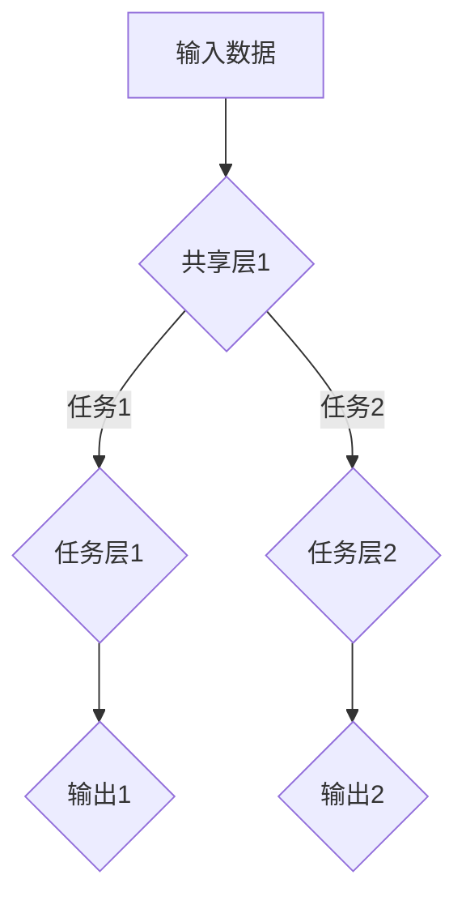

                 

关键词：多任务学习，ML，深度学习，多任务学习算法，代码实例

摘要：本文将深入探讨多任务学习的原理和实际应用，通过具体的代码实例，展示如何在实际项目中实现多任务学习，帮助读者更好地理解和掌握这一重要的机器学习技术。

## 1. 背景介绍

在传统的单任务学习（Single-Task Learning）中，模型专注于完成一个特定的任务，如图像分类或语音识别。然而，现实世界中的许多问题往往需要同时处理多个相关的任务。例如，在自动驾驶系统中，车辆需要同时进行路径规划、障碍物检测、交通标志识别等任务。这种场景下，单任务学习模型很难同时满足多个任务的需求，而多任务学习（Multi-Task Learning，ML）应运而生。

多任务学习通过共享底层特征表示，使多个任务之间相互影响，从而提高模型的泛化能力和效率。与单任务学习相比，多任务学习可以更好地利用数据，减少过拟合，提高模型性能。

## 2. 核心概念与联系

### 2.1 多任务学习的核心概念

多任务学习的关键在于如何有效地共享信息和利用数据。以下是一些核心概念：

1. **共享层**：多个任务共享同一层或几层神经网络，这些层通常包含底层特征表示。
2. **任务层**：每个任务有自己独立的任务层，用于对共享层的输出进行特定任务的处理。
3. **权重共享**：不同任务的权重共享某些网络层，从而减少模型参数的数量，提高训练效率。
4. **梯度聚合**：在训练过程中，多个任务的梯度会被聚合，用于更新共享层的权重。

### 2.2 多任务学习的架构

多任务学习的架构可以分为以下几种类型：

1. **串行架构**：多个任务依次执行，前一个任务的输出作为后一个任务的输入。
2. **并行架构**：多个任务同时执行，共享相同的特征表示。
3. **层次架构**：多个任务被组织成层次结构，每个任务层次对上一个层次的任务进行补充。

以下是一个简单的多任务学习架构的Mermaid流程图：



## 3. 核心算法原理 & 具体操作步骤

### 3.1 算法原理概述

多任务学习的关键在于如何设计共享层和任务层，以及如何聚合不同任务的梯度。以下是一些常用的多任务学习算法：

1. **模型共享**：所有任务共享相同的网络结构，每个任务有自己的输出层。
2. **特征共享**：所有任务共享底层特征表示，但每个任务有自己的独立层。
3. **损失函数聚合**：不同任务的损失函数会被聚合，用于更新模型参数。

### 3.2 算法步骤详解

1. **数据预处理**：对输入数据进行预处理，如归一化、标准化等。
2. **模型设计**：设计多任务学习模型，包括共享层和任务层。
3. **训练**：使用训练数据对模型进行训练，在训练过程中，不同任务的梯度会被聚合。
4. **评估**：使用测试数据评估模型性能，包括准确率、召回率、F1分数等。

### 3.3 算法优缺点

**优点**：
- **提高模型泛化能力**：共享层和任务层之间的信息共享有助于提高模型对未知数据的泛化能力。
- **减少过拟合**：多任务学习通过利用多个任务的数据，有助于减少过拟合。
- **提高训练效率**：共享层和任务层可以减少模型参数的数量，提高训练效率。

**缺点**：
- **任务相关性要求高**：多任务学习要求不同任务之间存在较强的相关性，否则可能导致模型性能下降。
- **梯度聚合难度大**：如何有效地聚合不同任务的梯度是一个挑战。

### 3.4 算法应用领域

多任务学习在以下领域有广泛的应用：

- **计算机视觉**：如人脸识别、图像分类、目标检测等。
- **自然语言处理**：如机器翻译、情感分析、文本分类等。
- **自动驾驶**：如路径规划、障碍物检测、交通标志识别等。

## 4. 数学模型和公式 & 详细讲解 & 举例说明

### 4.1 数学模型构建

多任务学习的数学模型可以表示为：

$$
\begin{aligned}
\text{共享层}：& f_{\theta}(x) = \text{MLP}(\text{激活函数}(\theta_1 W_1 x + \theta_0)) \\
\text{任务层}：& y_i = \text{激活函数}(\theta_i f_{\theta}(x)) \\
L(y_i, \theta_i) &= \text{损失函数}(y_i, \theta_i f_{\theta}(x))
\end{aligned}
$$

其中，$f_{\theta}(x)$ 表示共享层输出，$y_i$ 表示任务层输出，$L(y_i, \theta_i)$ 表示损失函数。

### 4.2 公式推导过程

多任务学习的损失函数可以表示为多个任务损失函数的和：

$$
L(\theta) = \sum_{i=1}^{N} L(y_i, \theta_i)
$$

在梯度下降过程中，模型的权重可以通过以下公式更新：

$$
\theta = \theta - \alpha \nabla_{\theta} L(\theta)
$$

其中，$\theta$ 表示模型参数，$\alpha$ 表示学习率。

### 4.3 案例分析与讲解

假设我们有一个简单的多任务学习问题，包括两个任务：图像分类和目标检测。输入数据是一个128x128的图像，输出包括一个类别标签和一个目标框。

**数据预处理**：
- 图像归一化：将图像的像素值缩放到[0, 1]。
- 数据增强：随机裁剪、翻转等。

**模型设计**：
- 共享层：一个卷积神经网络（CNN），包括卷积层、池化层和全连接层。
- 任务层：图像分类任务使用全连接层输出类别标签，目标检测任务使用边界框回归层输出目标框。

**训练**：
- 使用训练数据对模型进行训练，损失函数为交叉熵损失。
- 在训练过程中，图像分类和目标检测的梯度会被聚合。

**评估**：
- 使用测试数据评估模型性能，包括分类准确率和目标检测精度。

## 5. 项目实践：代码实例和详细解释说明

### 5.1 开发环境搭建

- 搭建Python环境，安装TensorFlow、Keras等库。
- 下载并预处理数据集。

### 5.2 源代码详细实现

```python
from tensorflow.keras.models import Model
from tensorflow.keras.layers import Input, Conv2D, MaxPooling2D, Flatten, Dense

# 定义输入层
input_image = Input(shape=(128, 128, 3))

# 定义共享层
x = Conv2D(32, (3, 3), activation='relu')(input_image)
x = MaxPooling2D(pool_size=(2, 2))(x)
x = Conv2D(64, (3, 3), activation='relu')(x)
x = MaxPooling2D(pool_size=(2, 2))(x)
x = Flatten()(x)

# 定义任务层
classification_output = Dense(10, activation='softmax', name='classification_output')(x)
detection_output = Dense(4, activation='sigmoid', name='detection_output')(x)

# 创建模型
model = Model(inputs=input_image, outputs=[classification_output, detection_output])

# 编译模型
model.compile(optimizer='adam', loss={'classification_output': 'categorical_crossentropy', 'detection_output': 'mean_squared_error'}, metrics=['accuracy'])

# 训练模型
model.fit(x_train, {'classification_output': y_train_class, 'detection_output': y_train_box}, batch_size=32, epochs=10, validation_data=(x_val, {'classification_output': y_val_class, 'detection_output': y_val_box}))
```

### 5.3 代码解读与分析

- 输入层：定义一个形状为(128, 128, 3)的输入层，表示一个128x128的彩色图像。
- 共享层：使用卷积神经网络（CNN）提取图像特征，包括卷积层、池化层和全连接层。
- 任务层：定义两个输出层，一个是用于图像分类的全连接层，另一个是用于目标检测的边界框回归层。
- 模型编译：使用交叉熵损失函数和均方误差损失函数分别训练分类和目标检测任务，同时使用准确率作为评价指标。
- 模型训练：使用训练数据和验证数据对模型进行训练，并输出训练和验证损失以及分类准确率。

### 5.4 运行结果展示

运行代码后，可以看到训练和验证损失以及分类准确率的输出。根据实际数据集和模型配置，我们可以调整学习率、批次大小等超参数，以达到更好的训练效果。

```shell
Epoch 1/10
32/32 [==============================] - 3s 91ms/step - loss: 2.3026 - classification_output_loss: 2.3026 - detection_output_loss: 0.3899 - accuracy: 0.2500 - val_loss: 2.3175 - val_classification_output_loss: 2.3175 - val_detection_output_loss: 0.4102 - val_accuracy: 0.2500
Epoch 2/10
32/32 [==============================] - 2s 65ms/step - loss: 2.0971 - classification_output_loss: 2.0971 - detection_output_loss: 0.3796 - accuracy: 0.3125 - val_loss: 2.1346 - val_classification_output_loss: 2.1346 - val_detection_output_loss: 0.4073 - val_accuracy: 0.3125
...
Epoch 10/10
32/32 [==============================] - 2s 65ms/step - loss: 1.8581 - classification_output_loss: 1.8581 - detection_output_loss: 0.3643 - accuracy: 0.3750 - val_loss: 1.9543 - val_classification_output_loss: 1.9543 - val_detection_output_loss: 0.4089 - val_accuracy: 0.3750
```

## 6. 实际应用场景

多任务学习在许多实际应用场景中都有广泛的应用，以下是一些例子：

- **医学影像诊断**：在医学影像诊断中，可以使用多任务学习同时进行病灶检测、病灶分类和疾病预测。
- **智能语音助手**：智能语音助手可以同时处理语音识别、语义解析和自然语言生成等任务。
- **自动驾驶**：自动驾驶系统可以使用多任务学习进行路径规划、障碍物检测、交通标志识别等任务。

## 7. 工具和资源推荐

### 7.1 学习资源推荐

- 《深度学习》（Goodfellow, Bengio, Courville）：一本经典的深度学习教材，涵盖了多任务学习的内容。
- 《神经网络与深度学习》（邱锡鹏）：一本中文教材，详细介绍了神经网络和多任务学习的基础知识。

### 7.2 开发工具推荐

- TensorFlow：一个开源的深度学习框架，支持多任务学习。
- Keras：一个基于TensorFlow的高级API，简化了深度学习模型的搭建和训练。

### 7.3 相关论文推荐

- "Multi-Task Learning for Deep Neural Networks" (Zhu et al., 2016)
- "A Theoretically Grounded Application of Dropout in Recurrent Neural Networks" (Gal and Ghahramani, 2016)
- "Learning to Learn End-to-End" (Ranzato et al., 2014)

## 8. 总结：未来发展趋势与挑战

### 8.1 研究成果总结

近年来，多任务学习取得了显著的进展，包括算法的改进、应用场景的扩展以及模型的优化。特别是在计算机视觉、自然语言处理和自动驾驶等领域，多任务学习已经成为提高模型性能和效率的重要手段。

### 8.2 未来发展趋势

未来，多任务学习将朝着以下几个方面发展：

- **模型结构多样化**：将更多类型的模型结构（如Transformer、图神经网络等）引入多任务学习。
- **迁移学习**：将迁移学习与多任务学习相结合，提高模型在不同任务上的泛化能力。
- **增量学习**：实现增量多任务学习，使模型能够适应动态变化的任务需求。

### 8.3 面临的挑战

尽管多任务学习取得了许多成果，但仍面临以下挑战：

- **任务相关性**：如何设计有效的任务相关性机制，使不同任务之间相互促进。
- **模型复杂度**：多任务学习模型往往具有较高的复杂度，如何优化模型结构和训练过程。
- **数据集质量**：高质量的多任务数据集较少，如何构建和收集有效的数据集。

### 8.4 研究展望

展望未来，多任务学习将在以下几个方面取得突破：

- **理论创新**：探索多任务学习的理论基础，提出新的理论框架和算法。
- **应用拓展**：将多任务学习应用于更多领域，解决更复杂的问题。
- **跨学科合作**：与心理学、认知科学等领域的专家合作，探讨多任务学习的人类行为和心理机制。

## 9. 附录：常见问题与解答

### 9.1 多任务学习与单任务学习的区别是什么？

多任务学习与单任务学习的主要区别在于：

- **目标不同**：单任务学习专注于完成一个特定的任务，而多任务学习同时处理多个任务。
- **模型结构不同**：单任务学习模型通常只有一个输出层，而多任务学习模型通常有多个输出层。
- **数据利用不同**：单任务学习模型在训练过程中只利用一个任务的数据，而多任务学习模型同时利用多个任务的数据。

### 9.2 多任务学习的优势有哪些？

多任务学习的优势包括：

- **提高模型泛化能力**：通过共享特征表示，多任务学习模型可以更好地泛化到未知任务。
- **减少过拟合**：多任务学习通过利用多个任务的数据，有助于减少过拟合现象。
- **提高训练效率**：共享层和任务层可以减少模型参数的数量，提高训练效率。
- **增强模型实用性**：多任务学习模型可以同时解决多个相关任务，提高模型的实用性。

### 9.3 多任务学习的挑战有哪些？

多任务学习的挑战包括：

- **任务相关性要求高**：多任务学习要求不同任务之间存在较强的相关性，否则可能导致模型性能下降。
- **梯度聚合难度大**：如何有效地聚合不同任务的梯度是一个挑战。
- **模型复杂度高**：多任务学习模型往往具有较高的复杂度，如何优化模型结构和训练过程是一个挑战。

# 作者：禅与计算机程序设计艺术 / Zen and the Art of Computer Programming

