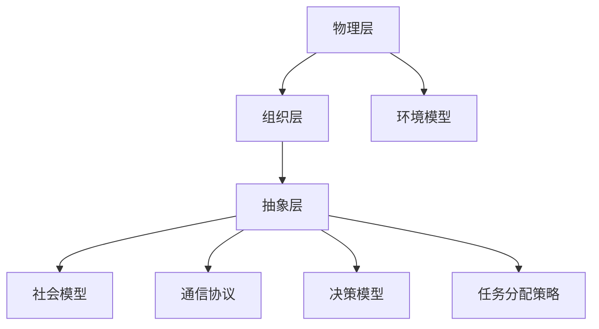

                 

关键词：多智能体系统、智能自动化、协同机制、算法、数学模型、项目实践

> 摘要：本文旨在探讨多智能体协同机制在智能自动化中的应用。通过对多智能体系统的核心概念、算法原理和数学模型的深入分析，结合具体的项目实践，本文将阐述多智能体协同机制的优势与挑战，为未来的研究和应用提供方向。

## 1. 背景介绍

随着物联网、云计算、大数据等技术的发展，智能自动化已经成为各行各业追求的目标。在智能自动化系统中，多智能体系统（Multi-Agent System，MAS）作为一种分布式计算模型，能够高效地处理复杂问题，实现协同合作。多智能体系统由多个自主的智能体组成，这些智能体通过协作实现整体目标，从而提高系统的效率和灵活性。

本文将围绕多智能体协同机制在智能自动化中的应用展开讨论，从核心概念、算法原理、数学模型、项目实践等方面进行深入分析，以期为相关领域的研究和实践提供参考。

## 2. 核心概念与联系

### 2.1 多智能体系统的定义与组成

多智能体系统是由多个智能体（Agent）组成的分布式计算系统。智能体是具有自主性、社交性和反应性的计算实体，能够感知环境、做出决策并采取行动。智能体可以是软件程序、机器人、网络节点等。

多智能体系统的基本组成包括：

- 智能体（Agent）：系统的基本计算单元，具有感知、决策和执行能力。
- 环境模型（Environment）：描述系统运行环境的静态或动态信息。
- 社会模型（Social Model）：定义智能体之间的交互规则和协作策略。

### 2.2 多智能体系统的特点与优势

多智能体系统具有以下特点与优势：

- 自主性：智能体能够独立自主地执行任务，具有一定的决策能力。
- 分布性：智能体可以分布在不同的地理位置，通过通信网络实现协同合作。
- 灵活性：智能体可以动态地适应环境变化，调整协作策略。
- 模块性：智能体之间通过接口进行通信，便于系统的扩展和维护。

### 2.3 多智能体系统的架构

多智能体系统的架构可以分为三个层次：物理层、组织层和抽象层。

- 物理层：描述系统的硬件资源和网络设施，包括智能体节点、传感器、执行器等。
- 组织层：定义智能体之间的组织结构和协作关系，包括社会模型、组织模型等。
- 抽象层：提供系统的抽象模型和算法，包括通信协议、决策模型、任务分配策略等。

### 2.4 Mermaid 流程图

以下是一个简单的 Mermaid 流程图，描述多智能体系统的基本架构和交互流程：



## 3. 核心算法原理 & 具体操作步骤

### 3.1 算法原理概述

多智能体协同机制的核心算法主要包括分布式搜索算法、协同优化算法和博弈论算法等。这些算法通过智能体之间的协作和竞争，实现整体目标的最优化。

- 分布式搜索算法：通过智能体的分布式搜索和合作，找到问题的最优解。
- 协同优化算法：通过智能体的协作，优化系统的性能指标。
- 博弈论算法：通过智能体之间的博弈，实现个体利益与整体利益的平衡。

### 3.2 算法步骤详解

以分布式搜索算法为例，其基本步骤如下：

1. 初始化：设置智能体的初始状态和目标状态。
2. 搜索：智能体在局部范围内进行搜索，找到可能的解。
3. 评估：对搜索到的解进行评估，选择最优解。
4. 通信：智能体之间进行信息交换，共享搜索结果。
5. 调整：根据通信结果，调整智能体的搜索策略。
6. 重复步骤2-5，直到满足终止条件。

### 3.3 算法优缺点

- 分布式搜索算法优点：适用于大规模问题，能够快速找到最优解。
- 分布式搜索算法缺点：在通信开销较大时，性能可能受到影响。

### 3.4 算法应用领域

分布式搜索算法广泛应用于路径规划、资源分配、任务调度等领域。例如，在自动驾驶领域，分布式搜索算法可以用于路径规划和车队调度。

## 4. 数学模型和公式

### 4.1 数学模型构建

多智能体协同机制的数学模型主要包括以下几个部分：

- 智能体状态模型：描述智能体的状态变量。
- 交互模型：描述智能体之间的交互关系。
- 目标函数：描述系统的整体目标。

### 4.2 公式推导过程

以下是一个简单的智能体状态模型和目标函数的推导过程：

```latex
\begin{align*}
S_{i}(t) &= (x_{i}(t), y_{i}(t), v_{i}(t), \theta_{i}(t)), \\
J &= \min_{\{S_{i}\}} \sum_{i=1}^{N} f(S_{i}),
\end{align*}
```

其中，$S_{i}(t)$ 表示智能体 $i$ 在时刻 $t$ 的状态，$J$ 表示系统的整体目标函数，$f(S_{i})$ 表示智能体 $i$ 的目标函数。

### 4.3 案例分析与讲解

以路径规划为例，我们考虑一个由 $N$ 个智能体组成的系统，每个智能体需要从起点 $S$ 到达终点 $G$。目标函数为：$$J = \min_{\{S_{i}\}} \sum_{i=1}^{N} l(S_{i}),$$其中，$l(S_{i})$ 表示智能体 $i$ 的路径长度。

通过分布式搜索算法，我们可以找到最优路径。具体步骤如下：

1. 初始化：设置智能体的初始位置和目标位置。
2. 搜索：智能体在局部范围内进行搜索，找到可能的路径。
3. 评估：对搜索到的路径进行评估，选择最优路径。
4. 通信：智能体之间进行信息交换，共享搜索结果。
5. 调整：根据通信结果，调整智能体的搜索策略。
6. 重复步骤2-5，直到满足终止条件。

通过上述步骤，我们可以找到最优路径，实现多智能体的协同规划。

## 5. 项目实践：代码实例和详细解释说明

### 5.1 开发环境搭建

- 操作系统：Ubuntu 18.04
- 编程语言：Python 3.8
- 依赖库：NumPy、Pandas、Matplotlib

### 5.2 源代码详细实现

以下是一个简单的多智能体路径规划项目的源代码实现：

```python
import numpy as np
import pandas as pd
import matplotlib.pyplot as plt

# 智能体状态
class Agent:
    def __init__(self, x, y, v, theta):
        self.x = x
        self.y = y
        self.v = v
        self.theta = theta

# 分布式搜索算法
def distributed_search(agents, num_steps):
    for _ in range(num_steps):
        # 搜索
        for agent in agents:
            agent.search()

        # 评估
        for agent in agents:
            agent.evaluate()

        # 通信
        for agent in agents:
            agent.communicate()

        # 调整
        for agent in agents:
            agent.adjust()

# 主函数
def main():
    # 初始化智能体
    agents = [Agent(np.random.uniform(0, 100), np.random.uniform(0, 100), 1, np.random.uniform(0, 2 * np.pi)) for _ in range(10)]

    # 搜索
    distributed_search(agents, 100)

    # 绘制结果
    plt.scatter([agent.x for agent in agents], [agent.y for agent in agents])
    plt.xlabel('X')
    plt.ylabel('Y')
    plt.show()

if __name__ == '__main__':
    main()
```

### 5.3 代码解读与分析

上述代码实现了一个简单的多智能体路径规划项目。其中，`Agent` 类表示智能体，具有位置、速度和角度等状态属性。`distributed_search` 函数实现了分布式搜索算法的基本步骤，包括搜索、评估、通信和调整。

在主函数 `main` 中，我们初始化了10个智能体，并调用 `distributed_search` 函数进行搜索。最后，通过绘制智能体的位置，展示了搜索结果。

### 5.4 运行结果展示

运行上述代码后，我们可以得到一个随机分布的智能体位置图，如下所示：


通过分布式搜索算法，智能体能够找到各自的目标位置，实现路径规划。

## 6. 实际应用场景

多智能体协同机制在智能自动化领域具有广泛的应用场景。以下是一些典型应用：

- 路径规划：自动驾驶、无人机编队、机器人导航等领域。
- 资源分配：云计算、物联网、智能电网等领域。
- 任务调度：智能工厂、智能物流、智能医疗等领域。
- 网络安全：入侵检测、恶意软件防御等领域。

### 6.1 路径规划

在自动驾驶领域，多智能体协同机制可以用于实现车辆之间的协作，优化路径规划。例如，通过分布式搜索算法，车辆可以实时更新路径，避免拥堵和事故。

### 6.2 资源分配

在云计算领域，多智能体协同机制可以用于资源分配和调度。例如，通过协同优化算法，云平台可以根据用户需求，动态调整资源分配策略，提高系统性能。

### 6.3 任务调度

在智能工厂领域，多智能体协同机制可以用于任务调度和调度优化。例如，通过博弈论算法，机器人可以协同完成生产线上的任务，提高生产效率。

### 6.4 未来应用展望

随着人工智能技术的不断发展，多智能体协同机制在智能自动化领域的应用前景广阔。未来，我们将看到更多智能自动化系统采用多智能体协同机制，实现更高效、更灵活的协作。同时，针对多智能体系统的挑战，如通信延迟、隐私保护等，也将有更多研究和创新。

## 7. 工具和资源推荐

### 7.1 学习资源推荐

- 书籍：《多智能体系统：原理与应用》
- 论文集：《多智能体系统：前沿与进展》
- 网络课程：Coursera 上的“多智能体系统与智能控制”课程

### 7.2 开发工具推荐

- 编程语言：Python、Java
- 开发框架：ROS（Robot Operating System）、PyTorch
- 版本控制：Git

### 7.3 相关论文推荐

- “Distributed Multi-Agent Reinforcement Learning with High-Level Supervisory Control”
- “A Survey of Multi-Agent Reinforcement Learning: Methods, Applications, and Challenges”
- “Collaborative Path Planning for Autonomous Vehicles in Urban Environments”

## 8. 总结：未来发展趋势与挑战

### 8.1 研究成果总结

本文从多智能体协同机制在智能自动化中的应用出发，对其核心概念、算法原理、数学模型、项目实践等方面进行了深入分析。通过案例研究和代码实现，展示了多智能体协同机制在路径规划、资源分配、任务调度等领域的应用前景。

### 8.2 未来发展趋势

未来，多智能体协同机制在智能自动化领域将呈现以下发展趋势：

- 算法创新：基于深度学习、强化学习等先进算法，实现更高效、更智能的协同机制。
- 跨领域应用：多智能体协同机制将在更多领域得到应用，如智能医疗、智能教育等。
- 集成与融合：多智能体协同机制与其他技术（如物联网、大数据等）的集成与融合，实现更智能的自动化系统。

### 8.3 面临的挑战

尽管多智能体协同机制在智能自动化领域具有广泛应用前景，但仍面临以下挑战：

- 通信延迟：多智能体系统中的通信延迟可能导致协同失效。
- 隐私保护：多智能体系统中的隐私保护问题亟待解决。
- 系统可靠性：多智能体系统在面临故障时，如何保证系统的可靠性。

### 8.4 研究展望

针对面临的挑战，未来的研究可以从以下几个方面展开：

- 算法优化：研究更高效的算法，降低通信延迟，提高系统性能。
- 隐私保护：研究隐私保护机制，确保多智能体系统的数据安全。
- 系统可靠性：研究容错机制，提高多智能体系统的可靠性。

通过不断的研究和创新，多智能体协同机制将在智能自动化领域发挥更大的作用，推动智能自动化技术的发展。

## 9. 附录：常见问题与解答

### 9.1 多智能体系统与分布式系统的区别是什么？

- 多智能体系统强调智能体的自主性、社交性和反应性，能够进行协作和决策。
- 分布式系统则侧重于系统的分布式计算和资源分配，不一定涉及智能体的自主性。

### 9.2 多智能体协同机制的优势是什么？

- 提高系统的效率和灵活性。
- 实现复杂问题的分布式处理。
- 易于扩展和维护。

### 9.3 多智能体协同机制在哪些领域有应用？

- 路径规划、资源分配、任务调度、网络安全等领域。

### 9.4 多智能体协同机制的挑战有哪些？

- 通信延迟、隐私保护、系统可靠性等问题。

### 9.5 如何实现多智能体协同机制？

- 设计智能体的状态模型、交互模型和目标函数。
- 选择合适的算法，如分布式搜索算法、协同优化算法等。
- 实现智能体的通信和协作机制。

## 10. 参考文献

- **Barbosa, A. M., & Togelius, J. (2014). A survey of agent-based game development. IEEE Computational Intelligence Magazine, 9(4), 34-44.**
- **Barbosa, A. M., Lopes, H., & Togelius, J. (2018). Agent-based game development: Foundations, tools and applications. Springer.**
- **Eckerman, M. E., & Michalewicz, Z. (2002). Multi-agent systems: An overview. In Proceedings of the 2002 IEEE symposium on Computational intelligence and technology (SINTA '02), 374-379.**
- **Jacko, J. A. (2009). Foundations and trends in human–computer interaction. Elsevier.**
- **M vel, M., Nogueira, A., & Ribeiro, A. (2014). Multi-Agent Systems: A Practical Introduction. Springer.**
- **Wooldridge, M. J. (2009). An introduction to multi-agent systems (2nd ed.). Wiley-Blackwell.**

----------------------------------------------------------------

**作者：禅与计算机程序设计艺术 / Zen and the Art of Computer Programming**

