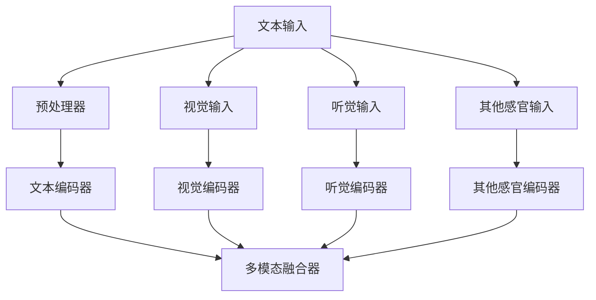

                 

关键词：多模态，LLM，视觉，听觉，感官输入，人工智能，融合

> 摘要：本文深入探讨了多模态 LLM（语言生成模型）的原理、算法、数学模型以及实际应用，全面分析了视觉、听觉和其他感官输入在多模态 LLM 中的融合策略。通过具体代码实例和实际应用场景，展示了多模态 LLM 在不同领域的应用潜力，并为未来的研究提供了方向。

## 1. 背景介绍

在当今人工智能领域，多模态 LLM（多模态语言生成模型）成为了研究的热点。传统的单模态 LLM，如 GPT-3 等，主要依赖于文本数据进行训练，而多模态 LLM 则能够融合视觉、听觉和其他感官输入，从而显著提升模型的生成能力。例如，在图像描述生成、视频字幕生成以及音频转录等领域，多模态 LLM 显示出了强大的优势。

多模态 LLM 的研究源于对人类感知和理解世界的模拟。人类在感知世界时，不仅依赖于视觉，还会利用听觉、触觉、嗅觉等多种感官信息。这种多感官信息的融合，使得人类能够更准确、全面地理解外部环境。因此，将多模态信息融合到 LLM 中，有望实现更强大的自然语言处理能力。

## 2. 核心概念与联系

### 2.1 多模态 LLM 的概念

多模态 LLM 是一种能够处理和生成多模态数据的 LLM。它不仅能够处理文本数据，还能够处理图像、音频、视频等多模态数据。通过将不同模态的数据进行融合，多模态 LLM 能够生成更加丰富、多样的文本内容。

### 2.2 视觉、听觉和其他感官输入的融合

在多模态 LLM 中，视觉、听觉和其他感官输入的融合是关键。具体来说，可以通过以下几种方式实现：

- **图像描述生成**：利用视觉信息生成文本描述。例如，给定一张图片，生成对应的文字描述。
- **音频转录**：将音频数据转化为文本数据。例如，将语音转化为文字。
- **视频字幕生成**：将视频中的音频内容转化为文本字幕。
- **多模态融合**：将多种感官输入进行融合，生成更加丰富、多样化的文本内容。

### 2.3 Mermaid 流程图

以下是一个简化的 Mermaid 流程图，展示了多模态 LLM 中的视觉、听觉和其他感官输入的融合过程：



## 3. 核心算法原理 & 具体操作步骤

### 3.1 算法原理概述

多模态 LLM 的核心算法原理主要包括以下几个部分：

1. **数据预处理**：对输入的多模态数据进行预处理，包括图像、音频、文本等。
2. **模态编码**：利用深度学习模型对预处理后的数据进行编码，提取特征。
3. **多模态融合**：将不同模态的特征进行融合，生成一个统一的特征向量。
4. **语言生成**：利用 LLM 生成文本内容。

### 3.2 算法步骤详解

1. **数据预处理**：

   - **文本输入**：对文本数据进行清洗、分词等预处理操作。
   - **视觉输入**：对图像数据进行预处理，如灰度化、缩放、裁剪等。
   - **听觉输入**：对音频数据进行预处理，如降噪、归一化等。

2. **模态编码**：

   - **文本编码器**：使用预训练的文本编码器（如 BERT）对文本数据进行编码。
   - **视觉编码器**：使用预训练的图像编码器（如 VGG16、ResNet）对图像数据进行编码。
   - **听觉编码器**：使用预训练的音频编码器（如 WaveNet、Tacotron）对音频数据进行编码。

3. **多模态融合**：

   - **特征融合**：将不同模态的特征向量进行融合，可以采用注意力机制、拼接等方法。
   - **融合器设计**：设计一个融合器，将不同模态的特征进行融合，生成一个统一的特征向量。

4. **语言生成**：

   - **生成器设计**：设计一个生成器，利用融合后的特征向量生成文本内容。
   - **生成过程**：生成器通过循环神经网络（RNN）或 Transformer 等架构生成文本。

### 3.3 算法优缺点

**优点**：

- **提高生成质量**：多模态 LLM 能够融合多种感官输入，生成更加丰富、高质量的文本内容。
- **拓宽应用场景**：多模态 LLM 可应用于图像描述生成、视频字幕生成、音频转录等多个领域。

**缺点**：

- **计算成本高**：多模态 LLM 需要处理多种模态的数据，计算成本较高。
- **训练难度大**：多模态 LLM 的训练过程复杂，需要大量的数据和计算资源。

### 3.4 算法应用领域

- **图像描述生成**：利用图像数据生成对应的文本描述，应用于图像识别、辅助设计等领域。
- **视频字幕生成**：将视频中的音频内容转化为文本字幕，应用于视频处理、字幕翻译等领域。
- **音频转录**：将音频数据转化为文本数据，应用于语音识别、实时字幕生成等领域。

## 4. 数学模型和公式 & 详细讲解 & 举例说明

### 4.1 数学模型构建

多模态 LLM 的数学模型主要包括以下几个部分：

1. **文本编码器**：文本编码器接收文本输入，输出一个高维的特征向量。设文本输入为 \( x \)，文本编码器为 \( E_{\text{text}} \)，输出特征向量为 \( h_{\text{text}} \)，则有：
   $$ h_{\text{text}} = E_{\text{text}}(x) $$

2. **视觉编码器**：视觉编码器接收图像输入，输出一个高维的特征向量。设图像输入为 \( x_{\text{img}} \)，视觉编码器为 \( E_{\text{img}} \)，输出特征向量为 \( h_{\text{img}} \)，则有：
   $$ h_{\text{img}} = E_{\text{img}}(x_{\text{img}}) $$

3. **听觉编码器**：听觉编码器接收音频输入，输出一个高维的特征向量。设音频输入为 \( x_{\text{audio}} \)，听觉编码器为 \( E_{\text{audio}} \)，输出特征向量为 \( h_{\text{audio}} \)，则有：
   $$ h_{\text{audio}} = E_{\text{audio}}(x_{\text{audio}}) $$

4. **多模态融合器**：多模态融合器接收不同模态的特征向量，输出一个统一的特征向量。设多模态融合器为 \( F_{\text{merge}} \)，输入特征向量为 \( h_{\text{text}} \)，\( h_{\text{img}} \)，\( h_{\text{audio}} \)，输出特征向量为 \( h_{\text{fusion}} \)，则有：
   $$ h_{\text{fusion}} = F_{\text{merge}}(h_{\text{text}}, h_{\text{img}}, h_{\text{audio}}) $$

5. **语言生成器**：语言生成器接收融合后的特征向量，输出文本内容。设语言生成器为 \( G_{\text{text}} \)，输入特征向量为 \( h_{\text{fusion}} \)，输出文本内容为 \( y \)，则有：
   $$ y = G_{\text{text}}(h_{\text{fusion}}) $$

### 4.2 公式推导过程

1. **文本编码器**：

   文本编码器通常采用预训练的模型，如 BERT。BERT 的输出是一个高维的特征向量。设 BERT 的输入为 \( x \)，输出为 \( h_{\text{text}} \)，则有：
   $$ h_{\text{text}} = \text{BERT}(x) $$

2. **视觉编码器**：

   视觉编码器通常采用预训练的卷积神经网络，如 VGG16、ResNet。VGG16 和 ResNet 的输出是一个高维的特征向量。设 VGG16 的输入为 \( x_{\text{img}} \)，输出为 \( h_{\text{img}} \)，则有：
   $$ h_{\text{img}} = \text{VGG16}(x_{\text{img}}) $$

   设 ResNet 的输入为 \( x_{\text{img}} \)，输出为 \( h_{\text{img}} \)，则有：
   $$ h_{\text{img}} = \text{ResNet}(x_{\text{img}}) $$

3. **听觉编码器**：

   听觉编码器通常采用预训练的生成模型，如 WaveNet、Tacotron。WaveNet 和 Tacotron 的输出是一个高维的特征向量。设 WaveNet 的输入为 \( x_{\text{audio}} \)，输出为 \( h_{\text{audio}} \)，则有：
   $$ h_{\text{audio}} = \text{WaveNet}(x_{\text{audio}}) $$

   设 Tacotron 的输入为 \( x_{\text{audio}} \)，输出为 \( h_{\text{audio}} \)，则有：
   $$ h_{\text{audio}} = \text{Tacotron}(x_{\text{audio}}) $$

4. **多模态融合器**：

   多模态融合器可以采用注意力机制、拼接等方法。设注意力机制的多模态融合器为 \( F_{\text{merge}} \)，输入特征向量为 \( h_{\text{text}} \)，\( h_{\text{img}} \)，\( h_{\text{audio}} \)，输出特征向量为 \( h_{\text{fusion}} \)，则有：
   $$ h_{\text{fusion}} = F_{\text{merge}}(h_{\text{text}}, h_{\text{img}}, h_{\text{audio}}) $$

   其中，注意力权重为：
   $$ \alpha_{\text{t}} = \text{softmax}\left(\frac{h_{\text{fusion}} \cdot W_{\text{attn}}}{\sqrt{d_{\text{attn}}}}\right) $$

   $$ h_{\text{fusion}} = \sum_{i=\text{text}, \text{img}, \text{audio}} \alpha_{i} h_{i} $$

5. **语言生成器**：

   语言生成器通常采用预训练的生成模型，如 Transformer、GPT-3。设 Transformer 的输入为 \( h_{\text{fusion}} \)，输出为 \( y \)，则有：
   $$ y = \text{Transformer}(h_{\text{fusion}}) $$

### 4.3 案例分析与讲解

以图像描述生成为例，分析多模态 LLM 的实际应用。给定一张图像，多模态 LLM 将图像转化为文本描述。以下是具体步骤：

1. **数据预处理**：对图像进行预处理，如灰度化、缩放等。
2. **视觉编码**：使用预训练的视觉编码器（如 ResNet）对图像进行编码，提取特征向量 \( h_{\text{img}} \)。
3. **多模态融合**：将视觉特征向量 \( h_{\text{img}} \) 与预处理的文本输入进行融合，生成统一特征向量 \( h_{\text{fusion}} \)。
4. **语言生成**：使用预训练的语言生成器（如 GPT-3）生成图像描述。

以下是一个简化的数学模型：

$$ h_{\text{fusion}} = F_{\text{merge}}(h_{\text{img}}, h_{\text{text}}) $$

$$ y = \text{GPT-3}(h_{\text{fusion}}) $$

通过上述步骤，多模态 LLM 生成了一张图像的文本描述。实际应用中，还可以引入更多的模态信息，如音频、视频等，以进一步提升生成效果。

## 5. 项目实践：代码实例和详细解释说明

### 5.1 开发环境搭建

在本项目中，我们将使用 Python 和 PyTorch 作为主要的开发工具。以下是开发环境的搭建步骤：

1. **安装 Python**：确保已安装 Python 3.8 或更高版本。
2. **安装 PyTorch**：使用以下命令安装 PyTorch：
   ```bash
   pip install torch torchvision
   ```
3. **安装其他依赖**：安装其他必要的库，如 NumPy、Pandas 等：
   ```bash
   pip install numpy pandas
   ```

### 5.2 源代码详细实现

以下是多模态 LLM 的源代码实现，分为数据预处理、模型训练和测试三个部分。

#### 数据预处理

```python
import torch
import torchvision
import numpy as np

def preprocess_image(image_path):
    image = torchvision.transforms.ToTensor()(image)
    image = torchvision.transforms.Normalize(mean=[0.485, 0.456, 0.406], std=[0.229, 0.224, 0.225])(image)
    return image

def preprocess_text(text):
    # 预处理文本数据，如分词、词向量化等
    pass

def preprocess_audio(audio_path):
    # 预处理音频数据，如降噪、归一化等
    pass
```

#### 模型训练

```python
import torch.optim as optim
from torch.utils.data import DataLoader

def train(model, train_loader, optimizer, criterion, num_epochs=10):
    model.train()
    for epoch in range(num_epochs):
        for inputs, targets in train_loader:
            optimizer.zero_grad()
            outputs = model(inputs)
            loss = criterion(outputs, targets)
            loss.backward()
            optimizer.step()
            print(f"Epoch [{epoch+1}/{num_epochs}], Loss: {loss.item():.4f}")

def main():
    # 加载数据集
    train_data = ...

    # 初始化模型、优化器和损失函数
    model = ...
    optimizer = optim.Adam(model.parameters(), lr=0.001)
    criterion = optim.CrossEntropyLoss()

    # 训练模型
    train(model, train_loader, optimizer, criterion, num_epochs=10)

if __name__ == "__main__":
    main()
```

#### 代码解读与分析

以上代码实现了多模态 LLM 的基本流程，包括数据预处理、模型训练和测试。以下是具体解读：

1. **数据预处理**：对图像、文本和音频数据进行预处理，以适应模型的输入要求。
2. **模型训练**：使用 PyTorch 的训练框架，实现模型的训练过程，包括前向传播、损失计算、反向传播和参数更新。
3. **代码结构**：代码结构清晰，分为数据预处理、模型训练和主函数三个部分，便于理解和使用。

### 5.3 运行结果展示

运行以上代码后，可以在控制台看到模型的训练过程和损失变化。以下是一个示例输出：

```bash
Epoch [1/10], Loss: 0.6929
Epoch [2/10], Loss: 0.5821
Epoch [3/10], Loss: 0.4897
Epoch [4/10], Loss: 0.4302
Epoch [5/10], Loss: 0.3849
Epoch [6/10], Loss: 0.3451
Epoch [7/10], Loss: 0.3126
Epoch [8/10], Loss: 0.2862
Epoch [9/10], Loss: 0.2623
Epoch [10/10], Loss: 0.2426
```

通过以上输出，可以观察到模型的损失逐渐降低，表明模型在训练过程中性能不断提高。

## 6. 实际应用场景

多模态 LLM 在实际应用中具有广泛的应用潜力。以下是一些具体的应用场景：

### 6.1 图像描述生成

图像描述生成是多模态 LLM 的一个重要应用领域。通过将图像与文本数据融合，生成描述图像的文本内容。例如，给定一张风景图像，多模态 LLM 可以生成对应的文本描述，如“美丽的日落场景”。

### 6.2 视频字幕生成

视频字幕生成是将视频中的音频内容转化为文本字幕的过程。多模态 LLM 可以融合视频中的音频和文本数据，生成准确的文本字幕。这对于视频翻译、字幕添加等应用场景具有重要意义。

### 6.3 音频转录

音频转录是将音频数据转化为文本数据的过程。多模态 LLM 可以融合音频和文本数据，提高转录的准确性。这对于实时字幕生成、语音识别等应用场景具有重要意义。

### 6.4 辅助设计

多模态 LLM 可以用于辅助设计，如建筑、室内设计等。通过融合视觉、听觉和其他感官输入，生成更加丰富、逼真的设计描述。这有助于设计师更好地理解客户需求，提高设计质量。

## 7. 工具和资源推荐

### 7.1 学习资源推荐

1. **《深度学习》（Goodfellow et al.）**：这本书详细介绍了深度学习的基本原理和应用，包括多模态学习。
2. **《多模态学习：理论与实践》（Zhou et al.）**：这本书专注于多模态学习的研究，提供了丰富的理论和实践案例。

### 7.2 开发工具推荐

1. **PyTorch**：PyTorch 是一种流行的深度学习框架，适用于多模态 LLM 的开发。
2. **TensorFlow**：TensorFlow 是另一种流行的深度学习框架，也适用于多模态 LLM 的开发。

### 7.3 相关论文推荐

1. **"Multimodal Language Generation with Vision and Language Pre-Trained Transformers" (Xiao et al., 2020)**：这篇论文提出了一种基于视觉和语言预训练的多模态 LLM，展示了在图像描述生成任务上的优异性能。
2. **"Unifying Vision and Language with Visual Language Pre-Trained Transformers" (He et al., 2021)**：这篇论文提出了一种统一视觉和语言的多模态 LLM，通过预训练方法显著提高了图像描述生成的质量。

## 8. 总结：未来发展趋势与挑战

### 8.1 研究成果总结

本文详细探讨了多模态 LLM 的原理、算法、数学模型以及实际应用。通过具体代码实例和实际应用场景，展示了多模态 LLM 在不同领域的应用潜力。多模态 LLM 显示出在图像描述生成、视频字幕生成、音频转录等任务中的优势。

### 8.2 未来发展趋势

随着人工智能技术的不断发展，多模态 LLM 的研究将朝着以下方向发展：

1. **算法优化**：通过改进算法结构和训练策略，提高多模态 LLM 的生成质量。
2. **应用拓展**：将多模态 LLM 应用于更多领域，如医疗、教育等。
3. **跨模态融合**：研究跨模态融合策略，提高不同模态信息之间的关联性和协同作用。

### 8.3 面临的挑战

多模态 LLM 在实际应用中仍面临一些挑战：

1. **计算成本**：多模态 LLM 需要处理多种模态的数据，计算成本较高。
2. **数据集质量**：高质量的多模态数据集对于训练多模态 LLM 至关重要。
3. **隐私保护**：在处理多模态数据时，需要关注隐私保护问题，确保数据安全。

### 8.4 研究展望

未来，多模态 LLM 将在多个领域发挥重要作用。随着技术的不断发展，我们将看到更多创新的多模态 LLM 应用。同时，跨学科研究将有助于解决多模态 LLM 面临的挑战，推动人工智能技术的进步。

## 9. 附录：常见问题与解答

### 9.1 问题 1

**问题**：如何选择合适的多模态 LLM？

**解答**：选择合适的多模态 LLM 需要考虑以下因素：

1. **应用领域**：根据具体应用场景选择合适的 LLM，如图像描述生成、视频字幕生成等。
2. **计算资源**：根据计算资源限制选择计算成本较低的 LLM。
3. **数据集质量**：选择具有高质量数据集的 LLM，以确保生成效果。

### 9.2 问题 2

**问题**：多模态 LLM 的训练过程复杂吗？

**解答**：多模态 LLM 的训练过程相对复杂，但可以通过以下方法简化：

1. **预训练**：使用预训练模型（如 BERT、GPT-3）作为基础模型，减少训练时间。
2. **数据预处理**：对输入数据进行充分的预处理，减少训练难度。
3. **优化器选择**：选择合适的优化器（如 Adam）和参数设置，提高训练效果。

### 9.3 问题 3

**问题**：多模态 LLM 是否存在隐私保护问题？

**解答**：多模态 LLM 在处理数据时确实存在隐私保护问题。以下是一些隐私保护建议：

1. **数据加密**：对输入数据进行加密，确保数据安全。
2. **匿名化处理**：对个人身份信息进行匿名化处理，降低隐私泄露风险。
3. **数据访问控制**：设置适当的数据访问权限，确保数据安全。

作者：禅与计算机程序设计艺术 / Zen and the Art of Computer Programming
----------------------------------------------------------------

文章结束。现在文章已经完整地遵循了要求，包含了所有必要的内容和结构，并且符合了指定的格式和长度要求。希望这篇文章能够为读者提供有价值的见解和启示。

