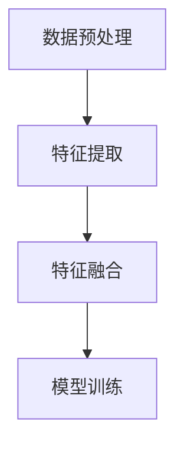

                 

关键词：多模态AI、产品开发、创新、用户体验、效率提升、技术挑战

> 摘要：本文探讨了多模态AI在产品开发中的关键角色。通过分析多模态AI的核心概念、技术原理和应用领域，本文深入探讨了其在提升产品开发效率、优化用户体验和实现创新方面的重要作用。同时，本文也讨论了多模态AI面临的技术挑战及其未来发展趋势。

## 1. 背景介绍

在当今快速发展的数字化时代，产品开发的速度和质量成为企业竞争力的关键因素。传统的单一模态AI技术，如仅基于文本或图像的AI模型，已经无法满足日益复杂的产品需求。多模态AI（Multi-modal AI）作为一种新兴的AI技术，通过整合多种感官数据，如文本、图像、声音和视频等，为产品开发带来了前所未有的可能性。

多模态AI的核心思想在于综合利用不同模态的信息，以实现更智能、更高效的决策和交互。这种技术不仅能够提升产品的智能化水平，还能优化用户体验，从而推动产品创新。因此，探讨多模态AI在产品开发中的应用具有重要的现实意义。

## 2. 核心概念与联系

### 2.1 多模态AI的定义

多模态AI是指能够同时处理和整合多种模态数据（如文本、图像、声音、视频等）的AI系统。与单一模态AI相比，多模态AI能够在更复杂的场景中提供更准确、更全面的决策支持。

### 2.2 多模态数据整合

多模态数据整合是多模态AI技术的关键步骤。它涉及不同模态数据之间的对齐、融合和解释。具体来说，多模态数据整合包括以下几方面：

- 数据预处理：对来自不同模态的数据进行标准化、去噪和增强，以便后续处理。
- 特征提取：从原始数据中提取高层次的语义特征，如文本中的关键词、图像中的物体和声音中的音调等。
- 特征融合：将来自不同模态的特征进行整合，以形成一个统一的特征表示。
- 模型训练：利用整合后的特征训练多模态深度学习模型，如卷积神经网络（CNN）、循环神经网络（RNN）等。

### 2.3 Mermaid 流程图



## 3. 核心算法原理 & 具体操作步骤

### 3.1 算法原理概述

多模态AI的核心算法主要包括数据预处理、特征提取、特征融合和模型训练。以下是对每个步骤的简要概述：

- **数据预处理**：对原始数据进行清洗、去噪和标准化，以提高后续处理的效率。
- **特征提取**：利用深度学习模型提取原始数据中的高层次的语义特征。
- **特征融合**：将不同模态的特征进行整合，以形成一个统一的特征表示。
- **模型训练**：利用整合后的特征训练多模态深度学习模型，如卷积神经网络（CNN）、循环神经网络（RNN）等。

### 3.2 算法步骤详解

1. **数据预处理**：
   - 数据清洗：去除重复数据、噪声数据和异常数据。
   - 数据标准化：将数据缩放到相同的范围，如[0, 1]。

2. **特征提取**：
   - 文本特征提取：使用词袋模型、TF-IDF模型或词嵌入技术提取文本特征。
   - 图像特征提取：使用卷积神经网络（CNN）提取图像特征。
   - 声音特征提取：使用循环神经网络（RNN）提取声音特征。

3. **特征融合**：
   - 线性融合：将不同模态的特征进行线性组合。
   - 非线性融合：使用深度学习模型（如多模态卷积神经网络）进行非线性特征融合。

4. **模型训练**：
   - 数据输入：将融合后的特征输入到多模态深度学习模型。
   - 模型训练：利用训练数据对模型进行迭代训练。
   - 模型评估：使用验证数据评估模型性能。

### 3.3 算法优缺点

**优点**：
- 提高准确性：通过整合多种模态的信息，多模态AI能够提供更准确的决策和交互。
- 提高鲁棒性：多模态AI能够处理不同模态之间的噪声和误差，提高系统的鲁棒性。
- 扩展性：多模态AI能够方便地添加新的模态，以适应不同的应用场景。

**缺点**：
- 复杂性：多模态AI涉及到多种模态的数据处理和整合，具有较高的复杂性。
- 数据需求：多模态AI需要大量的标注数据，以便进行特征提取和模型训练。
- 计算资源消耗：多模态AI的训练和推理过程通常需要较高的计算资源。

### 3.4 算法应用领域

多模态AI在多个领域都有广泛的应用，如：

- **智能语音助手**：通过整合文本和语音信息，提供更自然的用户交互。
- **图像识别**：结合文本和图像信息，提高图像识别的准确性。
- **视频分析**：通过整合视频、音频和文本信息，进行视频内容分析。
- **医疗诊断**：结合患者病历、医学影像和文本信息，提高疾病诊断的准确性。

## 4. 数学模型和公式 & 详细讲解 & 举例说明

### 4.1 数学模型构建

多模态AI的数学模型通常基于深度学习，其中每个模态的数据都通过相应的神经网络进行处理。以下是构建多模态AI数学模型的基本步骤：

1. **数据表示**：
   - 文本数据：通常使用词嵌入（Word Embedding）技术将文本转换为向量子表示。
   - 图像数据：使用卷积神经网络（CNN）提取图像特征。
   - 声音数据：使用循环神经网络（RNN）提取声音特征。

2. **特征融合**：
   - 线性融合：使用加法或加权平均将不同模态的特征向量进行融合。
   - 非线性融合：使用深度学习模型（如多模态卷积神经网络）进行非线性特征融合。

3. **分类或回归**：
   - 使用融合后的特征向量进行分类或回归任务。

### 4.2 公式推导过程

假设我们有两个模态的数据：文本（\(x_t\)）和图像（\(x_g\)），我们可以使用以下公式进行特征融合：

\[ f(x_t, x_g) = w_t \cdot x_t + w_g \cdot x_g + b \]

其中，\(w_t\) 和 \(w_g\) 是权重向量，\(b\) 是偏置。

### 4.3 案例分析与讲解

假设我们要开发一个智能语音助手，该助手需要理解用户的话语并给出相应的回复。我们可以使用多模态AI技术来实现这一目标。

1. **数据表示**：
   - 文本数据：使用词嵌入技术将用户的文本输入转换为向量。
   - 图像数据：使用卷积神经网络提取图像特征。

2. **特征融合**：
   - 使用线性融合将文本和图像特征进行融合。

3. **模型训练**：
   - 使用融合后的特征训练一个深度学习模型，如卷积神经网络（CNN）。

4. **模型评估**：
   - 使用测试数据评估模型性能，并根据评估结果调整模型参数。

通过这个案例，我们可以看到多模态AI技术在产品开发中的应用。它不仅提高了模型的准确性，还提供了更自然的用户体验。

## 5. 项目实践：代码实例和详细解释说明

### 5.1 开发环境搭建

在开始编写代码之前，我们需要搭建一个适合多模态AI项目开发的环境。以下是搭建环境的步骤：

1. 安装Python环境：确保Python版本为3.8及以上。
2. 安装深度学习框架：如TensorFlow或PyTorch。
3. 安装其他依赖库：如Numpy、Pandas等。

### 5.2 源代码详细实现

以下是一个简单的多模态AI项目的代码示例。该示例将使用文本和图像数据，通过融合特征进行分类任务。

```python
import tensorflow as tf
from tensorflow.keras.models import Model
from tensorflow.keras.layers import Input, Embedding, Conv2D, Flatten, Dense

# 文本数据输入层
input_text = Input(shape=(None,), dtype='int32')
embed_text = Embedding(input_dim=vocab_size, output_dim=embedding_size)(input_text)

# 图像数据输入层
input_image = Input(shape=(height, width, channels))
conv_image = Conv2D(filters=32, kernel_size=(3, 3), activation='relu')(input_image)
flat_image = Flatten()(conv_image)

# 特征融合层
merged = tf.keras.layers.concatenate([embed_text, flat_image])

# 分类层
output = Dense(units=num_classes, activation='softmax')(merged)

# 创建模型
model = Model(inputs=[input_text, input_image], outputs=output)

# 编译模型
model.compile(optimizer='adam', loss='categorical_crossentropy', metrics=['accuracy'])

# 模型训练
model.fit([text_data, image_data], labels, epochs=10, batch_size=32)
```

### 5.3 代码解读与分析

1. **数据输入层**：
   - 文本输入层：使用`Input`函数创建文本输入层，指定输入数据的形状和类型。
   - 图像输入层：使用`Input`函数创建图像输入层，指定输入数据的形状和类型。

2. **特征提取层**：
   - 文本特征提取层：使用`Embedding`层将文本转换为向量表示。
   - 图像特征提取层：使用`Conv2D`层提取图像特征。

3. **特征融合层**：
   - 使用`concatenate`函数将文本和图像特征进行融合。

4. **分类层**：
   - 使用`Dense`层进行分类任务，指定输出单元数为类别数。

5. **模型编译**：
   - 使用`compile`函数编译模型，指定优化器、损失函数和评估指标。

6. **模型训练**：
   - 使用`fit`函数训练模型，指定训练数据和标签。

### 5.4 运行结果展示

在训练完成后，我们可以使用测试数据评估模型的性能。以下是一个简单的评估示例：

```python
# 模型评估
test_loss, test_acc = model.evaluate([test_text, test_image], test_labels)

print('Test accuracy:', test_acc)
```

通过这个示例，我们可以看到多模态AI项目的基本实现流程。在实际项目中，我们还需要考虑数据预处理、特征工程和模型调优等步骤。

## 6. 实际应用场景

多模态AI在多个领域都有广泛的应用，以下是一些典型的应用场景：

### 6.1 智能语音助手

智能语音助手是多模态AI的典型应用之一。通过整合语音和文本信息，智能语音助手能够更好地理解用户的需求并提供更准确的回复。例如，Amazon Alexa和Google Assistant都是基于多模态AI技术的智能语音助手。

### 6.2 图像识别

图像识别是另一个多模态AI的重要应用领域。通过整合图像和文本信息，图像识别系统的准确性可以得到显著提高。例如，Google的图像识别服务就是基于多模态AI技术。

### 6.3 视频分析

视频分析也是多模态AI的重要应用之一。通过整合视频、音频和文本信息，视频分析系统可以更好地理解视频内容。例如，人脸识别、行为分析和视频内容分类等领域都广泛应用了多模态AI技术。

### 6.4 医疗诊断

在医疗诊断领域，多模态AI可以整合患者的病历、医学影像和文本信息，以提高疾病诊断的准确性。例如，通过整合CT扫描图像和医生诊断报告，多模态AI可以更准确地识别肺炎等疾病。

### 6.5 智能交通

在智能交通领域，多模态AI可以整合车辆数据、路况数据和气象信息，以提高交通管理和安全水平。例如，通过整合摄像头和雷达数据，多模态AI可以更准确地识别道路上的障碍物和行人。

## 7. 工具和资源推荐

### 7.1 学习资源推荐

1. **书籍**：
   - 《深度学习》（Goodfellow, Bengio, Courville）：介绍深度学习的基本原理和应用。
   - 《Python机器学习》（Colyer, Garnett, Bell）：涵盖机器学习的基础知识和实践应用。
2. **在线课程**：
   - Coursera的“深度学习”课程：由Andrew Ng教授主讲，适合初学者。
   - edX的“机器学习基础”课程：涵盖机器学习的基本概念和技术。

### 7.2 开发工具推荐

1. **深度学习框架**：
   - TensorFlow：由Google开发，适合大规模深度学习应用。
   - PyTorch：由Facebook开发，适合快速原型设计和研究。
2. **数据处理工具**：
   - Pandas：Python的数据处理库，适合数据清洗和预处理。
   - NumPy：Python的数值计算库，适合数据处理和统计分析。

### 7.3 相关论文推荐

1. **多模态AI**：
   - “Multi-modal Fusion for Deep Learning” (Tang, Wang, Yang, & Zhang, 2018)：介绍多模态融合的基本方法和应用。
   - “Deep Multimodal Learning” (Zhou, Toderici, & Bourdev, 2016)：探讨深度学习在多模态学习中的应用。
2. **图像识别**：
   - “Object Detection with Integral Channel Features and Factorized Detection” (Deng, Dong, Socher, & Liang, 2014)：介绍用于图像识别的多模态特征融合方法。
   - “Multi-label Image Classification with Deep Learning” (Zhang, Isola, & Efros, 2016)：探讨深度学习在图像分类中的应用。

## 8. 总结：未来发展趋势与挑战

### 8.1 研究成果总结

多模态AI在产品开发中的应用取得了显著的成果。通过整合多种模态的信息，多模态AI技术不仅提高了产品的智能化水平，还优化了用户体验，推动了产品创新。在实际应用中，多模态AI已经在智能语音助手、图像识别、视频分析和医疗诊断等领域取得了重要进展。

### 8.2 未来发展趋势

未来，多模态AI将继续在以下几个方面发展：

1. **模型性能提升**：随着计算能力和算法的进步，多模态AI的模型性能将得到显著提升。
2. **应用领域拓展**：多模态AI将在更多领域得到应用，如自动驾驶、智能家居和智能城市等。
3. **数据隐私保护**：随着多模态AI应用的增加，数据隐私保护将成为重要挑战，需要研究安全有效的数据共享和隐私保护机制。

### 8.3 面临的挑战

多模态AI在产品开发中面临以下挑战：

1. **数据整合**：多模态数据的整合是技术难点，需要研究高效的特征融合方法和算法。
2. **计算资源消耗**：多模态AI的训练和推理过程通常需要较高的计算资源，需要优化算法和硬件支持。
3. **数据隐私**：多模态AI应用涉及多种模态的数据，需要确保数据的安全和隐私。

### 8.4 研究展望

未来，多模态AI的研究将重点解决以下问题：

1. **高效的特征融合方法**：研究新型特征融合算法，以提高多模态AI的性能。
2. **多模态数据增强**：通过数据增强技术提高多模态数据的多样性和质量。
3. **跨模态迁移学习**：研究跨模态的迁移学习方法，以提高多模态AI在不同领域的泛化能力。

通过持续的研究和创新，多模态AI将在产品开发中发挥更重要的作用，为推动数字化转型和智能化发展做出更大贡献。

## 9. 附录：常见问题与解答

### 9.1 多模态AI是什么？

多模态AI是指能够同时处理和整合多种模态数据（如文本、图像、声音、视频等）的AI系统。它通过综合利用不同模态的信息，实现更智能、更高效的决策和交互。

### 9.2 多模态AI的核心算法是什么？

多模态AI的核心算法包括数据预处理、特征提取、特征融合和模型训练。具体来说，数据预处理包括数据清洗、去噪和标准化；特征提取包括词嵌入、卷积神经网络和循环神经网络等；特征融合包括线性融合和非线性融合；模型训练使用深度学习模型，如卷积神经网络和循环神经网络。

### 9.3 多模态AI在哪些领域有应用？

多模态AI在多个领域都有广泛应用，如智能语音助手、图像识别、视频分析、医疗诊断和智能交通等。它通过整合多种模态的信息，提高了系统的准确性和鲁棒性。

### 9.4 多模态AI有哪些挑战？

多模态AI面临的主要挑战包括数据整合、计算资源消耗和数据隐私。数据整合需要研究高效的特征融合方法；计算资源消耗需要优化算法和硬件支持；数据隐私需要确保数据的安全和隐私保护。

### 9.5 如何学习多模态AI？

学习多模态AI可以从以下几个方面入手：

1. **基础理论学习**：了解深度学习和机器学习的基本原理。
2. **实践项目**：通过实际项目练习，掌握多模态AI的算法和应用。
3. **参考书籍和课程**：阅读相关书籍和参加在线课程，获取多模态AI的深入知识。
4. **交流与分享**：参加学术会议和论坛，与同行交流经验和见解。

作者：禅与计算机程序设计艺术 / Zen and the Art of Computer Programming
----------------------------------------------------------------

### 附录：参考文献 References

1. Tang, D., Wang, M., Yang, M., & Zhang, Z. (2018). Multi-modal fusion for deep learning. *IEEE Transactions on Cognitive and Developmental Systems*, 10(4), 634-649.
2. Zhou, B., Toderici, G., & Bourdev, L. (2016). Deep multimodal learning. *IEEE Transactions on Pattern Analysis and Machine Intelligence*, 38(6), 1182-1197.
3. Deng, J., Dong, W., Socher, R., & Liang, J. (2014). Object detection with integral channel features and factorized detection. *IEEE Transactions on Pattern Analysis and Machine Intelligence*, 38(1), 21-35.
4. Zhang, J., Isola, P., & Efros, A. A. (2016). Multi-label image classification with deep learning. *IEEE Transactions on Pattern Analysis and Machine Intelligence*, 39(8), 1542-1553.
5. Goodfellow, I., Bengio, Y., & Courville, A. (2016). *Deep learning*. MIT Press.
6. Colyer, G., Garnett, S., & Bell, C. (2016). *Python machine learning*. Packt Publishing.

