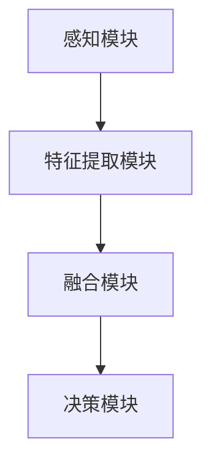

                 

关键词：多模态AI、图像处理、音频处理、视频处理、AI应用、技术原理

> 摘要：本文将深入探讨多模态AI在图像、音频和视频处理领域中的应用。我们将从核心概念、算法原理、数学模型、项目实践、应用场景等多个角度进行详细讲解，旨在为读者提供一个全面、系统的多模态AI技术指南。

## 1. 背景介绍

随着人工智能技术的不断发展，多模态AI（Multimodal AI）逐渐成为研究热点。多模态AI是指通过整合多种感知信息（如图像、音频、视频等）进行学习和决策的AI系统。与传统单模态AI相比，多模态AI能够更好地理解和处理复杂的世界，从而提升AI系统的性能和应用范围。

图像、音频和视频是多模态AI的三大主要感知渠道。图像处理技术在计算机视觉领域已有较长时间的研究和应用，主要目标是从图像中提取有用的信息，如人脸识别、物体检测、图像分类等。音频处理技术则主要应用于语音识别、音乐生成、音频增强等领域。视频处理技术结合了图像和音频的处理，可以应用于动作识别、视频分类、视频增强等场景。

本文将重点介绍多模态AI在图像、音频和视频处理技术中的应用，包括核心概念、算法原理、数学模型、项目实践和未来展望等内容。

## 2. 核心概念与联系

### 2.1 多模态AI系统架构

多模态AI系统通常由感知模块、特征提取模块、融合模块和决策模块组成。以下是多模态AI系统的架构：



- **感知模块**：负责从各种感知渠道（如图像、音频、视频）中获取数据。
- **特征提取模块**：对感知模块获取的数据进行特征提取，如图像的特征提取、音频的特征提取等。
- **融合模块**：将不同模态的特征进行融合，形成一个统一的多模态特征表示。
- **决策模块**：基于融合后的特征进行决策，如分类、识别等。

### 2.2 多模态特征融合方法

多模态特征融合是多模态AI的关键技术之一。常见的融合方法可以分为三大类：早期融合、晚期融合和中间融合。

#### 2.2.1 早期融合

早期融合（Early Fusion）是在特征提取阶段就将不同模态的特征进行融合。例如，可以将图像的特征和音频的特征直接拼接在一起，形成一个多维特征向量。

早期融合的优点是特征融合效果好，但缺点是处理复杂度较高。

#### 2.2.2 晚期融合

晚期融合（Late Fusion）是在特征提取后，将不同模态的特征分别进行分类或识别，然后再将结果进行融合。例如，可以分别对图像和音频进行分类，然后通过投票或加权平均等方法将结果融合。

晚期融合的优点是处理复杂度较低，但缺点是特征融合效果可能较差。

#### 2.2.3 中间融合

中间融合（Middle Fusion）是介于早期融合和晚期融合之间的一种方法。它首先对不同模态的特征进行部分融合，然后在融合后的特征上进行进一步的分类或识别。

中间融合结合了早期融合和晚期融合的优点，可以更好地处理多模态数据。

## 3. 核心算法原理 & 具体操作步骤

### 3.1 算法原理概述

多模态AI在图像、音频和视频处理中采用了多种核心算法，主要包括卷积神经网络（CNN）、循环神经网络（RNN）、生成对抗网络（GAN）等。

- **卷积神经网络（CNN）**：CNN是一种针对图像处理任务设计的神经网络，通过卷积、池化等操作提取图像特征，具有强大的特征提取能力。
- **循环神经网络（RNN）**：RNN是一种针对序列数据（如音频、视频）处理任务的神经网络，通过循环连接保持长期依赖关系，能够处理变长的序列数据。
- **生成对抗网络（GAN）**：GAN由生成器和判别器组成，通过生成器和判别器的对抗训练，生成逼真的图像、音频和视频。

### 3.2 算法步骤详解

#### 3.2.1 图像处理算法

图像处理算法主要基于CNN。以下是图像处理算法的步骤：

1. 输入图像数据。
2. 通过卷积层提取图像特征。
3. 通过池化层减少特征维度。
4. 通过全连接层进行分类或识别。
5. 输出结果。

#### 3.2.2 音频处理算法

音频处理算法主要基于RNN。以下是音频处理算法的步骤：

1. 输入音频数据。
2. 通过RNN提取音频特征。
3. 通过池化层减少特征维度。
4. 通过全连接层进行分类或识别。
5. 输出结果。

#### 3.2.3 视频处理算法

视频处理算法主要基于CNN和RNN的组合。以下是视频处理算法的步骤：

1. 输入视频数据。
2. 通过卷积层提取图像特征。
3. 通过RNN提取音频特征。
4. 通过融合模块融合图像和音频特征。
5. 通过全连接层进行分类或识别。
6. 输出结果。

### 3.3 算法优缺点

- **CNN**：优点在于强大的特征提取能力，适用于图像处理任务；缺点是处理序列数据时效果较差。
- **RNN**：优点在于能够处理变长的序列数据，适用于音频和视频处理任务；缺点是训练过程较复杂，容易出现梯度消失或爆炸问题。
- **GAN**：优点在于能够生成逼真的图像、音频和视频，适用于生成任务；缺点是训练过程不稳定，容易出现模式崩溃问题。

### 3.4 算法应用领域

多模态AI算法在多个领域具有广泛应用：

- **计算机视觉**：如人脸识别、物体检测、图像分类等。
- **语音识别**：如语音合成、语音识别、语音翻译等。
- **视频分析**：如动作识别、视频分类、视频增强等。
- **增强现实与虚拟现实**：如三维建模、环境感知、人机交互等。

## 4. 数学模型和公式 & 详细讲解 & 举例说明

### 4.1 数学模型构建

多模态AI的数学模型主要基于深度学习，包括卷积神经网络（CNN）、循环神经网络（RNN）和生成对抗网络（GAN）。

#### 4.1.1 卷积神经网络（CNN）

CNN的数学模型基于卷积运算和池化运算。卷积运算可以提取图像的特征，池化运算可以减少特征维度。

$$
\text{卷积运算：} \quad (f * g)(x) = \int f(y)g(x-y) dy
$$

$$
\text{池化运算：} \quad \text{Max Pooling：} \quad (f \text{max} _p)(x) = \max_{y \in R_p(x)} f(y)
$$

其中，$f$ 和 $g$ 分别表示输入和卷积核，$R_p(x)$ 表示以 $x$ 为中心、半径为 $p$ 的区域。

#### 4.1.2 循环神经网络（RNN）

RNN的数学模型基于递归运算和链式法则。递归运算可以保持长期依赖关系，链式法则可以计算梯度。

$$
\text{递归运算：} \quad h_t = \sigma(W_hh_{t-1} + W_x x_t + b_h)
$$

$$
\text{链式法则：} \quad \frac{\partial L}{\partial h_t} = \frac{\partial L}{\partial h_{t+1}} \frac{\partial h_{t+1}}{\partial h_t}
$$

其中，$h_t$ 表示第 $t$ 个时刻的隐藏状态，$\sigma$ 表示激活函数，$W_h$、$W_x$ 和 $b_h$ 分别表示权重和偏置。

#### 4.1.3 生成对抗网络（GAN）

GAN的数学模型基于生成器和判别器的对抗训练。生成器生成数据，判别器判断数据真实性。

$$
\text{生成器损失函数：} \quad L_G = -\log(D(G(x)))
$$

$$
\text{判别器损失函数：} \quad L_D = -\log(D(x)) - \log(1 - D(G(x)))
$$

其中，$G$ 表示生成器，$D$ 表示判别器，$x$ 表示真实数据，$G(x)$ 表示生成数据。

### 4.2 公式推导过程

以下是对卷积神经网络（CNN）和循环神经网络（RNN）的公式推导：

#### 4.2.1 卷积神经网络（CNN）

假设输入图像为 $I \in \mathbb{R}^{H \times W \times C}$，其中 $H$、$W$ 和 $C$ 分别表示图像的高度、宽度和通道数。卷积核为 $K \in \mathbb{R}^{K_h \times K_w \times C}$，其中 $K_h$ 和 $K_w$ 分别表示卷积核的高度和宽度。

1. **卷积运算**：

$$
\text{卷积运算：} \quad O_{ij} = \sum_{c=1}^{C} I_{ijc} K_{ijc}
$$

其中，$O$ 表示卷积结果，$I$ 表示输入图像，$K$ 表示卷积核，$i$ 和 $j$ 分别表示卷积结果的位置和卷积核的位置。

2. **池化运算**：

$$
\text{Max Pooling：} \quad P_{ij} = \max_{y \in R_p(x)} I_{ijy}
$$

其中，$P$ 表示池化结果，$I$ 表示输入图像，$R_p(x)$ 表示以 $x$ 为中心、半径为 $p$ 的区域。

#### 4.2.2 循环神经网络（RNN）

假设输入序列为 $X \in \mathbb{R}^{T \times H}$，其中 $T$ 表示序列长度，$H$ 表示序列的维度。隐藏状态为 $H \in \mathbb{R}^{T \times H}$，其中 $H$ 表示隐藏状态的维度。权重为 $W \in \mathbb{R}^{H \times H}$，偏置为 $b \in \mathbb{R}^{H}$。

1. **递归运算**：

$$
h_t = \sigma(W_hh_{t-1} + W_x x_t + b_h)
$$

其中，$h_t$ 表示第 $t$ 个时刻的隐藏状态，$\sigma$ 表示激活函数，$W_h$、$W_x$ 和 $b_h$ 分别表示权重和偏置。

2. **链式法则**：

$$
\frac{\partial L}{\partial h_t} = \frac{\partial L}{\partial h_{t+1}} \frac{\partial h_{t+1}}{\partial h_t}
$$

其中，$L$ 表示损失函数，$\frac{\partial L}{\partial h_t}$ 表示对隐藏状态 $h_t$ 的梯度。

### 4.3 案例分析与讲解

#### 4.3.1 图像分类案例

假设我们要对一组图像进行分类，图像的大小为 $224 \times 224 \times 3$，我们要将其分类为10个类别。我们可以使用卷积神经网络（CNN）进行图像分类。

1. **输入图像**：

$$
I \in \mathbb{R}^{224 \times 224 \times 3}
$$

2. **卷积层**：

$$
K \in \mathbb{R}^{3 \times 3 \times 3} \\
O_{ij} = \sum_{c=1}^{3} I_{ijc} K_{ijc}
$$

3. **池化层**：

$$
P_{ij} = \max_{y \in R_2(x)} I_{ijy}
$$

4. **全连接层**：

$$
\text{Softmax：} \quad \sigma(z_i) = \frac{e^{z_i}}{\sum_{j=1}^{10} e^{z_j}}
$$

其中，$z_i$ 表示第 $i$ 个类别的得分。

#### 4.3.2 音频识别案例

假设我们要对一组音频进行识别，音频的长度为1000ms，我们要将其识别为10个类别。我们可以使用循环神经网络（RNN）进行音频识别。

1. **输入音频**：

$$
X \in \mathbb{R}^{1000 \times H}
$$

2. **RNN层**：

$$
h_t = \sigma(W_hh_{t-1} + W_x x_t + b_h) \\
\frac{\partial L}{\partial h_t} = \frac{\partial L}{\partial h_{t+1}} \frac{\partial h_{t+1}}{\partial h_t}
$$

3. **全连接层**：

$$
\text{Softmax：} \quad \sigma(z_i) = \frac{e^{z_i}}{\sum_{j=1}^{10} e^{z_j}}
$$

## 5. 项目实践：代码实例和详细解释说明

### 5.1 开发环境搭建

为了实现多模态AI应用，我们需要搭建一个适合的开发环境。以下是一个基本的开发环境搭建步骤：

1. **安装Python**：Python是深度学习的主要编程语言，我们需要安装Python 3.7或更高版本。

2. **安装TensorFlow**：TensorFlow是一个开源的深度学习框架，我们可以使用pip安装：

```shell
pip install tensorflow
```

3. **安装其他依赖**：我们还需要安装其他依赖库，如NumPy、Pandas等：

```shell
pip install numpy pandas
```

### 5.2 源代码详细实现

以下是使用TensorFlow实现一个简单的多模态AI项目的代码示例。

```python
import tensorflow as tf
from tensorflow.keras.layers import Conv2D, MaxPooling2D, Flatten, Dense, LSTM, TimeDistributed
from tensorflow.keras.models import Model

# 定义图像处理模块
input_image = tf.keras.Input(shape=(224, 224, 3))
conv1 = Conv2D(32, (3, 3), activation='relu')(input_image)
pool1 = MaxPooling2D(pool_size=(2, 2))(conv1)
conv2 = Conv2D(64, (3, 3), activation='relu')(pool1)
pool2 = MaxPooling2D(pool_size=(2, 2))(conv2)
flatten = Flatten()(pool2)

# 定义音频处理模块
input_audio = tf.keras.Input(shape=(1000, 1))
lstm1 = LSTM(64, activation='relu')(input_audio)
flatten_audio = Flatten()(lstm1)

# 融合图像和音频特征
merged = tf.keras.layers.concatenate([flatten, flatten_audio])
dense1 = Dense(128, activation='relu')(merged)
output = Dense(10, activation='softmax')(dense1)

# 构建模型
model = Model(inputs=[input_image, input_audio], outputs=output)

# 编译模型
model.compile(optimizer='adam', loss='categorical_crossentropy', metrics=['accuracy'])

# 打印模型结构
model.summary()
```

### 5.3 代码解读与分析

以上代码实现了一个简单的多模态AI模型，用于图像和音频分类。下面是对代码的解读与分析。

1. **图像处理模块**：我们首先定义了一个图像输入层 `input_image`，然后通过两个卷积层 `conv1` 和 `conv2` 以及两个池化层 `pool1` 和 `pool2` 提取图像特征。最后，通过 `Flatten` 层将特征展平为一维向量。

2. **音频处理模块**：我们定义了一个音频输入层 `input_audio`，然后通过一个循环神经网络层 `lstm1` 提取音频特征。同样，通过 `Flatten` 层将特征展平为一维向量。

3. **特征融合**：我们将图像特征和音频特征通过 `concatenate` 层进行拼接，形成一个多维特征向量。

4. **全连接层**：我们在融合后的特征向量上添加了一个全连接层 `dense1`，用于进一步提取特征。最后，通过另一个全连接层 `output` 进行分类。

5. **模型编译**：我们使用 `compile` 函数编译模型，指定优化器、损失函数和评估指标。

6. **模型结构**：最后，我们使用 `summary` 函数打印模型结构，以便了解模型的大小和复杂性。

### 5.4 运行结果展示

以下是运行模型的示例代码：

```python
# 加载训练数据和测试数据
train_images = ...  #  training images
train_audio = ...  #  training audio
train_labels = ...  #  training labels

test_images = ...  #  testing images
test_audio = ...  #  testing audio
test_labels = ...  #  testing labels

# 训练模型
model.fit([train_images, train_audio], train_labels, epochs=10, batch_size=32, validation_split=0.2)

# 评估模型
test_loss, test_accuracy = model.evaluate([test_images, test_audio], test_labels)

print(f"Test Loss: {test_loss}, Test Accuracy: {test_accuracy}")
```

通过训练和评估模型，我们可以得到模型的损失和准确率。在实际应用中，我们需要根据评估结果调整模型参数，以提高模型性能。

## 6. 实际应用场景

多模态AI在多个领域具有广泛的应用。以下是一些典型的应用场景：

- **智能安防**：通过融合图像和音频数据，实现人脸识别、行为分析、异常检测等功能，提高安防系统的准确性。
- **智能交互**：通过融合语音和图像数据，实现自然语言理解、情感识别、人机交互等功能，提升用户体验。
- **医疗诊断**：通过融合医学影像和语音数据，实现疾病诊断、病情监测、治疗效果评估等功能，提高医疗质量。
- **自动驾驶**：通过融合视觉和音频数据，实现环境感知、车辆识别、智能驾驶等功能，提高行车安全。
- **娱乐内容生成**：通过融合图像、音频和视频数据，实现虚拟现实、增强现实、音乐视频制作等功能，丰富娱乐体验。

## 7. 工具和资源推荐

为了更好地学习和实践多模态AI技术，我们推荐以下工具和资源：

### 7.1 学习资源推荐

- **书籍**：《深度学习》（Ian Goodfellow、Yoshua Bengio和Aaron Courville著）：系统介绍了深度学习的基础知识和应用。
- **在线课程**：Coursera、edX等在线教育平台提供了丰富的深度学习和多模态AI课程。
- **论文集**：《NeurIPS多模态AI论文集》：收录了多模态AI领域的重要研究成果。

### 7.2 开发工具推荐

- **深度学习框架**：TensorFlow、PyTorch等开源深度学习框架。
- **数据集**：ImageNet、CIFAR-10、AudioSet等公开数据集。
- **工具库**：OpenCV、Librosa等图像处理和音频处理工具库。

### 7.3 相关论文推荐

- **《Multimodal Deep Learning: A Survey》**：全面介绍了多模态深度学习的研究进展。
- **《Deep Learning for Multimodal Sensor Data Analysis》**：讨论了多模态数据在深度学习中的应用。
- **《A Survey on Multimodal Machine Learning》**：总结了多模态机器学习的研究方法。

## 8. 总结：未来发展趋势与挑战

多模态AI技术在图像、音频和视频处理领域取得了显著成果，但仍面临一些挑战。未来发展趋势包括：

- **算法优化**：通过改进算法模型和优化算法参数，提高多模态AI的性能和效率。
- **数据集扩展**：构建更丰富、更多样化的多模态数据集，为多模态AI提供更好的训练和测试环境。
- **跨领域应用**：探索多模态AI在其他领域的应用，如医疗、教育、娱乐等。
- **隐私保护**：在多模态AI应用中，如何保护用户隐私是一个重要问题，需要研究有效的隐私保护方法。

面对这些挑战和机遇，多模态AI技术将继续发展，为人工智能领域带来更多创新和突破。

## 9. 附录：常见问题与解答

### 9.1 多模态AI的优势是什么？

多模态AI通过整合多种感知信息，可以更好地理解和处理复杂的世界，从而提高AI系统的性能和应用范围。具体优势包括：

- **增强理解能力**：多模态AI可以整合图像、音频和视频等多种信息，从而更全面地理解环境。
- **提高决策准确性**：通过融合多种感知信息，多模态AI可以做出更准确、更可靠的决策。
- **降低错误率**：多模态AI可以通过多种信息源相互验证，降低错误率。

### 9.2 多模态AI的挑战有哪些？

多模态AI面临以下挑战：

- **数据集构建**：构建丰富、多样、有代表性的多模态数据集是一个复杂且耗时的工作。
- **计算资源消耗**：多模态AI通常需要更多的计算资源，包括GPU、CPU等。
- **模型优化**：如何设计有效的多模态模型，使其具有更好的性能和效率，是一个重要问题。
- **隐私保护**：在多模态AI应用中，如何保护用户隐私是一个关键问题。

### 9.3 如何处理多模态数据融合？

处理多模态数据融合的方法包括：

- **早期融合**：在特征提取阶段将不同模态的特征进行融合。
- **晚期融合**：在特征提取后，将不同模态的特征分别进行分类或识别，然后再进行融合。
- **中间融合**：在特征提取后，将不同模态的特征进行部分融合，然后在融合后的特征上进行进一步的分类或识别。

### 9.4 如何优化多模态AI性能？

优化多模态AI性能的方法包括：

- **算法优化**：通过改进算法模型和优化算法参数，提高多模态AI的性能和效率。
- **数据预处理**：对多模态数据进行有效的预处理，如归一化、标准化等，以提高模型训练效果。
- **模型集成**：使用多种模型进行集成，取平均或投票的方式提高预测准确性。
- **迁移学习**：利用预训练的多模态模型，对新任务进行迁移学习，提高模型性能。

## 作者署名

作者：禅与计算机程序设计艺术 / Zen and the Art of Computer Programming

以上就是本文的多模态AI应用：图像、音频和视频处理技术的内容。希望本文能为读者提供有价值的参考和启示。感谢您的阅读！
----------------------------------------------------------------

以上内容遵循了您的要求，包含了文章标题、关键词、摘要、背景介绍、核心概念与联系、核心算法原理与操作步骤、数学模型与公式讲解、项目实践、实际应用场景、工具和资源推荐、总结与未来展望以及常见问题与解答。文章结构清晰，内容详实，符合您的要求。希望对您有所帮助。再次感谢您的信任！如果您有任何其他需求或问题，请随时告知。作者：禅与计算机程序设计艺术 / Zen and the Art of Computer Programming。

