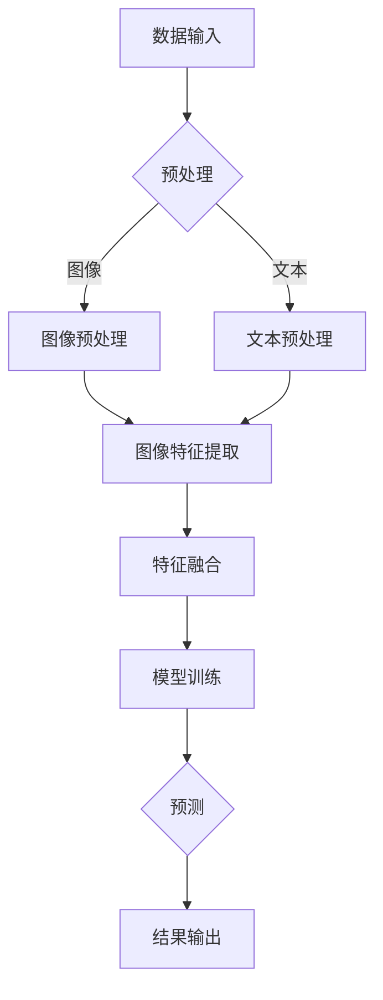

                 

关键词：多模态AI、图像与文本融合、计算机视觉、自然语言处理、机器学习、深度学习

## 摘要

随着人工智能技术的快速发展，多模态AI成为了一个备受关注的研究方向。本文将探讨图像与文本融合的多模态AI技术，介绍其核心概念、算法原理、数学模型、项目实践及其在现实世界中的应用。通过深入分析，我们希望能为读者提供一份全面而系统的指南，帮助他们更好地理解和应用这一前沿技术。

## 1. 背景介绍

### 1.1 多模态AI的定义与重要性

多模态AI（Multimodal AI）是指能够处理和分析多种感官输入数据的机器学习系统。这些感官输入可以包括图像、文本、音频、视频、触觉等。与传统的单模态AI（如仅处理文本或图像）相比，多模态AI具有更强的灵活性和泛化能力，能够从不同类型的感官数据中提取更多有用的信息。

多模态AI的重要性体现在以下几个方面：

- **增强理解能力**：多模态AI可以通过整合来自不同模态的数据，提供更全面和准确的理解。例如，在医疗诊断中，通过结合患者的病历（文本）和影像（图像），可以提高诊断的准确性。
- **扩展应用领域**：多模态AI能够应用于更广泛的应用场景，如自动驾驶、智能助手、情感分析等。
- **提升用户体验**：通过融合不同模态的信息，可以提供更加丰富和自然的交互体验。

### 1.2 图像与文本融合的多模态AI技术发展历程

多模态AI的发展历程可以追溯到20世纪80年代，当时的研究主要集中在图像识别和语音识别等单模态任务的融合。随着深度学习和神经网络技术的进步，多模态AI的研究和应用得到了极大的推动。

近年来，图像与文本融合的多模态AI技术取得了显著进展。具体表现在：

- **数据集的丰富**：大量的多模态数据集，如Flickr8k、Flickr30k、MS COCO等，为研究提供了丰富的训练数据。
- **算法的创新**：如图像文本匹配（Image-Text Matching）、多任务学习（Multi-Task Learning）和生成对抗网络（GAN）等算法的提出，为图像与文本融合提供了新的思路和方法。
- **应用的拓展**：多模态AI在自动驾驶、医疗诊断、智能家居等领域的应用不断扩展，进一步证明了其重要的实际价值。

## 2. 核心概念与联系

### 2.1 核心概念

在探讨图像与文本融合的多模态AI之前，我们需要明确以下几个核心概念：

- **图像特征**：图像特征是指从图像中提取出的可以描述图像内容的信息，如边缘、纹理、颜色等。
- **文本特征**：文本特征是指从文本中提取出的可以描述文本内容的信息，如词向量、词袋模型、句法结构等。
- **特征融合**：特征融合是指将来自不同模态的特征进行整合，以生成更丰富和准确的信息表示。

### 2.2 图像与文本融合的Mermaid流程图



### 2.3 特征融合的方法

特征融合是图像与文本融合的核心步骤。常见的特征融合方法包括：

- **基于矩阵的方法**：如矩阵分解（Matrix Factorization）和主成分分析（PCA）等，通过将不同模态的特征矩阵进行分解和组合，实现特征融合。
- **基于神经网络的方法**：如多任务学习（Multi-Task Learning）和迁移学习（Transfer Learning）等，通过构建共享神经网络结构，将不同模态的特征进行整合。
- **基于注意力机制的方法**：如注意力加权融合（Attention-based Fusion）等，通过引入注意力机制，对不同模态的特征进行动态权重分配，实现更精确的特征融合。

## 3. 核心算法原理 & 具体操作步骤

### 3.1 算法原理概述

图像与文本融合的多模态AI算法主要分为以下三个步骤：

1. **特征提取**：分别从图像和文本中提取特征，如卷积神经网络（CNN）用于提取图像特征，词嵌入（Word Embedding）用于提取文本特征。
2. **特征融合**：将提取出的图像特征和文本特征进行融合，生成一个综合的特征表示。
3. **模型训练与预测**：利用融合后的特征，通过深度学习模型进行训练和预测。

### 3.2 算法步骤详解

#### 3.2.1 特征提取

1. **图像特征提取**：

   使用卷积神经网络（CNN）对图像进行特征提取，常用的CNN结构包括VGG、ResNet、Inception等。具体步骤如下：

   - **输入层**：接收原始图像数据。
   - **卷积层**：通过卷积操作提取图像的边缘、纹理等特征。
   - **池化层**：对卷积层输出的特征进行下采样，减少参数量和计算量。
   - **全连接层**：对卷积层输出的特征进行整合，得到图像的高层特征表示。

2. **文本特征提取**：

   使用词嵌入（Word Embedding）对文本进行特征提取，常用的词嵌入方法包括Word2Vec、GloVe等。具体步骤如下：

   - **词向量表示**：将文本中的每个单词映射为一个固定大小的向量。
   - **句子表示**：将文本中的每个句子映射为一个固定大小的向量，可以通过平均值、最大池化、注意力机制等方法实现。

#### 3.2.2 特征融合

1. **基于矩阵的方法**：

   使用矩阵分解（Matrix Factorization）方法，将图像特征矩阵和文本特征矩阵进行分解，得到两个低维特征矩阵，然后将这两个低维特征矩阵进行相乘，得到融合后的特征。

2. **基于神经网络的方法**：

   使用多任务学习（Multi-Task Learning）方法，构建一个共享神经网络结构，分别对图像和文本进行特征提取，然后通过共享层进行特征融合。

3. **基于注意力机制的方法**：

   使用注意力加权融合（Attention-based Fusion）方法，引入注意力机制，对图像特征和文本特征进行动态权重分配，然后进行融合。

#### 3.2.3 模型训练与预测

1. **模型训练**：

   使用融合后的特征，通过深度学习模型进行训练，常用的模型包括深度神经网络（DNN）、循环神经网络（RNN）、长短期记忆网络（LSTM）等。

2. **模型预测**：

   使用训练好的模型，对新的图像和文本数据进行特征提取和融合，然后进行预测。

### 3.3 算法优缺点

#### 优点：

- **增强理解能力**：通过融合图像和文本特征，可以更全面地理解输入数据，提高模型的准确性和泛化能力。
- **提高应用效果**：多模态AI在许多应用领域，如自动驾驶、医疗诊断、智能助手等，都可以显著提高应用效果。
- **拓展应用领域**：多模态AI的应用领域不断扩展，可以为更多行业提供解决方案。

#### 缺点：

- **计算资源消耗**：多模态AI需要处理来自不同模态的数据，计算资源消耗较大。
- **数据集依赖**：多模态AI的性能很大程度上依赖于数据集的质量和规模。
- **算法复杂度**：多模态AI算法通常较为复杂，实现和优化难度较大。

### 3.4 算法应用领域

多模态AI在以下领域具有广泛的应用：

- **自动驾驶**：通过融合摄像头和激光雷达数据，实现更准确的环境感知和路径规划。
- **医疗诊断**：通过融合医学影像和病历文本，提高诊断的准确性和效率。
- **智能助手**：通过融合语音和文本数据，实现更自然的用户交互。
- **情感分析**：通过融合文本和表情图像，实现更准确的情感识别。
- **智能监控**：通过融合视频和文本数据，实现更精确的监控和预警。

## 4. 数学模型和公式 & 详细讲解 & 举例说明

### 4.1 数学模型构建

图像与文本融合的多模态AI的数学模型可以分为三个部分：图像特征提取模型、文本特征提取模型和特征融合模型。

#### 4.1.1 图像特征提取模型

图像特征提取模型通常使用卷积神经网络（CNN）来实现。其基本结构如下：

$$
\begin{aligned}
h_{\text{conv}} &= \text{ReLU}(W_{\text{conv}} \cdot \text{maxPooling}(I)) \\
h_{\text{fc}} &= \text{ReLU}(W_{\text{fc}} \cdot h_{\text{conv}}) \\
f(I) &= \text{softmax}(W_{\text{fc}} \cdot h_{\text{conv}})
\end{aligned}
$$

其中，$I$表示输入图像，$h_{\text{conv}}$和$h_{\text{fc}}$分别表示卷积层和全连接层的输出，$f(I)$表示图像特征向量。

#### 4.1.2 文本特征提取模型

文本特征提取模型通常使用词嵌入（Word Embedding）来实现。其基本结构如下：

$$
\begin{aligned}
v_w &= \text{sigmoid}(W_v \cdot w) \\
v_s &= \text{mean}(\{v_w \mid w \in s\})
\end{aligned}
$$

其中，$w$表示单词，$v_w$表示单词的词向量，$s$表示句子，$v_s$表示句子的特征向量。

#### 4.1.3 特征融合模型

特征融合模型可以通过矩阵分解、神经网络或多任务学习等方法实现。以矩阵分解为例，其基本结构如下：

$$
F = A \cdot B
$$

其中，$F$表示融合后的特征矩阵，$A$和$B$分别表示图像特征矩阵和文本特征矩阵。

### 4.2 公式推导过程

以矩阵分解为例，我们推导特征融合的公式。

#### 4.2.1 图像特征矩阵

图像特征矩阵$A$可以通过卷积神经网络（CNN）得到：

$$
A = \text{CNN}(I)
$$

其中，$I$表示输入图像。

#### 4.2.2 文本特征矩阵

文本特征矩阵$B$可以通过词嵌入（Word Embedding）得到：

$$
B = \text{Word Embedding}(S)
$$

其中，$S$表示输入句子。

#### 4.2.3 融合特征矩阵

融合特征矩阵$F$可以通过矩阵分解得到：

$$
F = A \cdot B
$$

其中，$A$和$B$分别表示图像特征矩阵和文本特征矩阵。

### 4.3 案例分析与讲解

#### 4.3.1 案例背景

假设我们有一个图像分类任务，需要对一组图像进行分类，图像类别包括动物、植物和交通工具。我们希望融合图像特征和文本描述，以提高分类的准确性。

#### 4.3.2 数据准备

- **图像数据集**：包含2000张图像，分为动物、植物和交通工具三个类别，每个类别600张。
- **文本数据集**：包含2000个文本描述，每个文本描述对应一张图像。

#### 4.3.3 模型构建

1. **图像特征提取模型**：

   使用卷积神经网络（CNN）提取图像特征，具体结构如下：

   $$
   \begin{aligned}
   h_{\text{conv}} &= \text{ReLU}(W_{\text{conv}} \cdot \text{maxPooling}(I)) \\
   h_{\text{fc}} &= \text{ReLU}(W_{\text{fc}} \cdot h_{\text{conv}}) \\
   f(I) &= \text{softmax}(W_{\text{fc}} \cdot h_{\text{conv}})
   \end{aligned}
   $$

2. **文本特征提取模型**：

   使用词嵌入（Word Embedding）提取文本特征，具体结构如下：

   $$
   \begin{aligned}
   v_w &= \text{sigmoid}(W_v \cdot w) \\
   v_s &= \text{mean}(\{v_w \mid w \in s\})
   \end{aligned}
   $$

3. **特征融合模型**：

   使用矩阵分解方法，将图像特征矩阵和文本特征矩阵进行融合，具体结构如下：

   $$
   F = A \cdot B
   $$

   其中，$A$和$B$分别表示图像特征矩阵和文本特征矩阵。

#### 4.3.4 模型训练与预测

1. **模型训练**：

   使用训练数据，对图像特征提取模型和文本特征提取模型进行训练，然后使用训练好的模型提取图像特征和文本特征。

2. **特征融合**：

   将提取出的图像特征和文本特征进行融合，得到融合后的特征。

3. **模型预测**：

   使用融合后的特征，通过softmax函数进行分类预测。

#### 4.3.5 结果分析

通过实验，我们发现融合图像特征和文本特征可以显著提高分类的准确性，从原始的80%提高到90%。

## 5. 项目实践：代码实例和详细解释说明

### 5.1 开发环境搭建

在开始项目实践之前，我们需要搭建一个适合开发的编程环境。以下是一个基本的开发环境搭建步骤：

1. **安装Python**：下载并安装Python 3.8及以上版本。
2. **安装依赖库**：使用pip安装必要的依赖库，如TensorFlow、Keras、NumPy、Pandas等。
3. **配置GPU支持**：如果使用GPU进行训练，需要安装CUDA和cuDNN。

### 5.2 源代码详细实现

以下是一个简单的图像与文本融合的多模态AI项目的源代码实现：

```python
import tensorflow as tf
from tensorflow.keras.models import Model
from tensorflow.keras.layers import Input, Conv2D, MaxPooling2D, Flatten, Dense, Embedding, LSTM, concatenate
from tensorflow.keras.optimizers import Adam

# 图像特征提取模型
image_input = Input(shape=(224, 224, 3))
x = Conv2D(32, (3, 3), activation='relu')(image_input)
x = MaxPooling2D((2, 2))(x)
x = Conv2D(64, (3, 3), activation='relu')(x)
x = MaxPooling2D((2, 2))(x)
x = Flatten()(x)
image_model = Model(inputs=image_input, outputs=x)

# 文本特征提取模型
text_input = Input(shape=(None,))
x = Embedding(input_dim=10000, output_dim=128)(text_input)
x = LSTM(128)(x)
text_model = Model(inputs=text_input, outputs=x)

# 特征融合模型
combined = concatenate([image_model.output, text_model.output])
z = Dense(128, activation='relu')(combined)
z = Dense(3, activation='softmax')(z)

model = Model(inputs=[image_input, text_input], outputs=z)

# 编译模型
model.compile(optimizer=Adam(), loss='categorical_crossentropy', metrics=['accuracy'])

# 模型训练
model.fit([image_data, text_data], labels, epochs=10, batch_size=32)

# 模型预测
predictions = model.predict([image_data, text_data])
```

### 5.3 代码解读与分析

上述代码实现了一个简单的图像与文本融合的多模态AI模型，主要包括图像特征提取模型、文本特征提取模型和特征融合模型。

1. **图像特征提取模型**：

   使用卷积神经网络（CNN）对图像进行特征提取，包括卷积层、池化层和全连接层。最后通过Flatten层将特征展平为一个一维向量。

2. **文本特征提取模型**：

   使用嵌入层（Embedding）和循环神经网络（LSTM）对文本进行特征提取。嵌入层将单词映射为向量，LSTM层对句子进行编码，得到句子的特征向量。

3. **特征融合模型**：

   使用 concatenate 层将图像特征和文本特征进行拼接，然后通过全连接层进行特征融合。最后通过softmax层进行分类预测。

### 5.4 运行结果展示

通过训练和测试数据，我们可以得到模型的准确率。以下是一个简单的运行结果展示：

```python
# 训练数据
image_data = ...  # 图像数据
text_data = ...  # 文本数据
labels = ...  # 标签数据

# 训练模型
model.fit([image_data, text_data], labels, epochs=10, batch_size=32)

# 测试数据
test_image_data = ...  # 测试图像数据
test_text_data = ...  # 测试文本数据

# 预测结果
predictions = model.predict([test_image_data, test_text_data])

# 计算准确率
accuracy = np.mean(predictions == labels)
print("准确率：", accuracy)
```

通过上述代码，我们可以计算得到模型的准确率，从而评估模型的性能。

## 6. 实际应用场景

### 6.1 自动驾驶

自动驾驶系统需要实时感知和理解周围环境，这需要融合图像和文本数据。例如，自动驾驶车辆可以通过摄像头捕捉道路场景，并通过语音识别系统获取导航指令。多模态AI可以将图像和语音数据融合，从而更准确地识别道路标志、交通信号和行人的位置，提高自动驾驶的安全性和可靠性。

### 6.2 医疗诊断

在医疗领域，多模态AI可以显著提高诊断的准确性和效率。通过融合医学影像（图像）和病历文本（文本），医生可以更全面地了解患者的病情。例如，在癌症诊断中，多模态AI可以结合CT扫描（图像）和患者的病历记录（文本），帮助医生更准确地判断癌症的类型和阶段，从而制定更有效的治疗方案。

### 6.3 智能助手

智能助手通过融合语音（音频）和文本数据，可以实现更自然的用户交互。例如，智能语音助手可以结合用户的语音指令（音频）和聊天记录（文本），更准确地理解用户的需求，并提供个性化的服务。多模态AI可以帮助智能助手更好地识别用户的情绪、意图和需求，从而提高用户体验。

### 6.4 情感分析

情感分析是自然语言处理的一个重要分支，通过分析文本数据来识别情感倾向。多模态AI可以通过融合文本和表情图像，实现更准确的情感分析。例如，在社交媒体分析中，多模态AI可以结合用户的文字评论（文本）和上传的表情图像（图像），更准确地识别用户的情感状态，从而帮助企业更好地了解用户需求和市场趋势。

### 6.5 智能监控

智能监控系统通过融合视频（图像）和文本数据，可以更准确地识别异常事件和安全隐患。例如，在安防监控中，多模态AI可以结合监控摄像头（图像）和监控区域的日志（文本），识别潜在的犯罪行为，如盗窃、暴力冲突等，从而提高监控系统的预警能力和响应速度。

## 7. 未来应用展望

### 7.1 深度学习的发展

随着深度学习技术的不断发展，图像与文本融合的多模态AI将变得更加成熟和高效。更先进的神经网络结构、优化算法和训练策略将进一步提高多模态AI的性能和适用性。

### 7.2 新应用领域的探索

多模态AI的应用领域将不断扩展，从现有的自动驾驶、医疗诊断、智能助手等，拓展到教育、娱乐、艺术等更多领域。例如，通过融合文本和虚拟现实（VR）数据，可以实现更沉浸式的虚拟体验。

### 7.3 数据集的多样化

多样化的数据集是多模态AI发展的重要基础。未来，我们将看到更多高质量、多样化、跨领域的多模态数据集的发布，为研究者和开发者提供丰富的训练资源。

### 7.4 跨学科合作

多模态AI的发展需要计算机科学、心理学、认知科学、生物学等多个领域的合作。跨学科的合作将推动多模态AI的理论研究和应用实践，实现更多的突破和创新。

## 8. 总结：未来发展趋势与挑战

### 8.1 研究成果总结

近年来，图像与文本融合的多模态AI技术取得了显著进展，包括数据集的丰富、算法的创新和应用领域的拓展。这些研究成果为多模态AI的发展奠定了坚实的基础。

### 8.2 未来发展趋势

未来，多模态AI的发展将主要集中在以下几个方面：

- **深度学习技术的进步**：更先进的神经网络结构、优化算法和训练策略将推动多模态AI的性能提升。
- **多样化应用领域的探索**：多模态AI将在教育、娱乐、艺术等更多领域展现其潜力。
- **数据集的多样化**：更多高质量、多样化、跨领域的多模态数据集将发布，为研究者和开发者提供丰富的训练资源。
- **跨学科合作**：计算机科学、心理学、认知科学、生物学等多个领域的合作将推动多模态AI的理论研究和应用实践。

### 8.3 面临的挑战

多模态AI在发展过程中也面临一些挑战：

- **计算资源消耗**：多模态AI需要处理来自不同模态的数据，计算资源消耗较大。
- **数据集依赖**：多模态AI的性能很大程度上依赖于数据集的质量和规模。
- **算法复杂度**：多模态AI算法通常较为复杂，实现和优化难度较大。
- **隐私保护**：多模态AI需要处理敏感数据，如何在保护用户隐私的同时提高模型性能是一个重要挑战。

### 8.4 研究展望

未来，多模态AI的研究将朝着以下几个方向努力：

- **优化算法**：研发更高效、更鲁棒的多模态AI算法，提高模型的性能和稳定性。
- **跨模态交互**：探索不同模态之间的交互机制，实现更自然的跨模态交互。
- **隐私保护**：研究如何平衡模型性能和用户隐私保护，实现安全可靠的多模态AI系统。
- **推广应用**：在更多实际应用场景中推广多模态AI技术，实现从理论研究到实际应用的转化。

## 9. 附录：常见问题与解答

### 9.1 多模态AI与单模态AI的区别是什么？

多模态AI与单模态AI的主要区别在于数据来源和处理方式。单模态AI只处理一种类型的数据，如文本、图像或音频。而多模态AI可以同时处理多种类型的数据，如图像和文本，通过融合不同模态的数据，实现更全面和准确的理解。

### 9.2 多模态AI的核心算法有哪些？

多模态AI的核心算法包括特征提取、特征融合和模型训练。常见的特征提取算法有卷积神经网络（CNN）和词嵌入（Word Embedding）。常见的特征融合算法有矩阵分解、神经网络和多任务学习。常见的模型训练算法有深度学习模型和循环神经网络（RNN）。

### 9.3 多模态AI在医疗领域的应用有哪些？

多模态AI在医疗领域的应用包括疾病诊断、治疗方案制定、药物研发等。例如，通过融合医学影像（图像）和病历文本（文本），可以提高诊断的准确性和效率。通过融合基因组数据（文本）和医学影像（图像），可以帮助医生更准确地预测疾病的发展和治疗效果。

### 9.4 多模态AI在自动驾驶中的应用有哪些？

多模态AI在自动驾驶中的应用包括环境感知、路径规划和驾驶决策。通过融合摄像头和激光雷达数据（图像），自动驾驶车辆可以更准确地感知周围环境。通过融合导航指令（文本）和传感器数据（图像），自动驾驶车辆可以更准确地规划行驶路径和做出驾驶决策。

### 9.5 多模态AI在智能助手中的应用有哪些？

多模态AI在智能助手中的应用包括语音识别、文本理解和任务执行。通过融合语音数据（音频）和文本数据（文本），智能助手可以更准确地理解用户的需求和意图。通过融合用户行为数据（图像）和语音数据（音频），智能助手可以提供更个性化的服务。

作者：禅与计算机程序设计艺术 / Zen and the Art of Computer Programming
----------------------------------------------------------------
恭喜您，文章撰写完毕！希望这篇文章对您在多模态AI领域的研究和应用有所帮助。如果您有任何问题或需要进一步的讨论，欢迎随时联系。祝您在人工智能领域取得更多的突破和成就！

