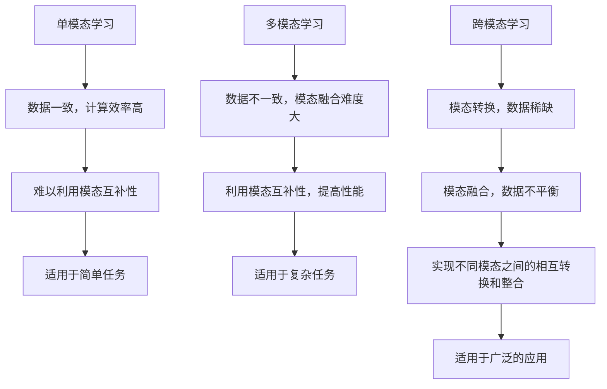

                 

关键词：多模态大模型，单模态学习，多模态学习，跨模态学习，技术原理，实战

摘要：随着人工智能技术的飞速发展，多模态大模型作为一种新兴的研究热点，逐渐成为学术界和工业界关注的焦点。本文将深入探讨单模态学习、多模态学习和跨模态学习的区别，解析多模态大模型的技术原理，并探讨其在实际应用中的挑战与前景。

## 1. 背景介绍

随着信息技术的迅猛发展，人类社会正经历着一场前所未有的数字化变革。在这个变革过程中，人工智能（AI）扮演着至关重要的角色。人工智能技术的应用领域涵盖了语音识别、图像处理、自然语言处理、推荐系统等多个方面，极大地提升了人们的生活质量和生产效率。

在人工智能领域，多模态大模型作为一种重要的研究热点，逐渐引起了学术界和工业界的广泛关注。多模态大模型能够融合不同类型的数据（如文本、图像、音频等），从而实现对复杂任务的更高性能和更广泛的适用性。然而，多模态大模型的发展并非一蹴而就，而是经历了单模态学习、多模态学习和跨模态学习等不同阶段。

本文将首先介绍单模态学习、多模态学习和跨模态学习的概念和特点，然后深入探讨多模态大模型的技术原理，并分析其在实际应用中的挑战与前景。希望通过本文的阐述，能够为读者提供一个全面而深入的了解。

### 1.1 单模态学习

单模态学习是指仅使用单一类型的数据进行训练和学习。例如，在图像识别任务中，单模态学习只使用图像数据；在语音识别任务中，单模态学习只使用音频数据。单模态学习的优势在于其实现简单，计算效率高，但缺点是难以充分利用不同模态之间的互补性和关联性。

### 1.2 多模态学习

多模态学习是指同时使用多种类型的数据进行训练和学习。例如，在图像识别任务中，多模态学习同时使用图像和文本数据；在语音识别任务中，多模态学习同时使用音频和文本数据。多模态学习的优势在于能够利用不同模态之间的互补性和关联性，从而提高模型性能。然而，多模态学习面临着数据不一致、模态融合难度大等问题。

### 1.3 跨模态学习

跨模态学习是指在不同模态之间进行数据转换和跨模态信息提取。例如，在图像识别任务中，跨模态学习可以将文本描述转换为图像特征；在语音识别任务中，跨模态学习可以将音频特征转换为文本描述。跨模态学习的优势在于能够实现不同模态之间的相互转换和整合，从而实现更广泛的应用。然而，跨模态学习面临着数据稀缺、数据不平衡、模态融合难度大等问题。

## 2. 核心概念与联系

为了更好地理解多模态大模型，我们需要了解其核心概念和联系。以下是一个使用Mermaid绘制的流程图，展示了单模态学习、多模态学习和跨模态学习之间的区别和联系。



通过这个流程图，我们可以看出单模态学习、多模态学习和跨模态学习在数据处理、模型性能和适用范围上的区别和联系。

## 3. 核心算法原理 & 具体操作步骤

### 3.1 算法原理概述

多模态大模型的核心算法是基于深度学习的多任务学习框架。该框架同时训练多个任务，如文本分类、图像识别和语音识别等，从而利用不同模态之间的互补性，提高模型性能。多模态大模型的算法原理可以概括为以下几个步骤：

1. **数据预处理**：对不同模态的数据进行预处理，如文本分词、图像预处理和音频特征提取等。
2. **特征融合**：将预处理后的特征进行融合，如使用注意力机制进行特征选择和权重分配。
3. **模型训练**：使用多任务学习框架同时训练多个任务，如使用共享网络结构进行特征提取和任务输出。
4. **模型优化**：通过优化算法对模型进行优化，如使用梯度下降算法和正则化技术等。

### 3.2 算法步骤详解

1. **数据预处理**

   数据预处理是多模态大模型的基础步骤，主要包括以下内容：

   - **文本预处理**：对文本数据进行分词、词性标注、去停用词等操作，以便提取有效的特征。
   - **图像预处理**：对图像数据进行缩放、裁剪、增强等操作，以提高模型的泛化能力。
   - **音频预处理**：对音频数据进行降噪、分割、特征提取等操作，以提取有效的特征。

2. **特征融合**

   特征融合是多模态大模型的关键步骤，主要包括以下内容：

   - **特征选择**：使用特征选择算法，如基于信息增益、互信息等算法，选择对任务最有影响力的特征。
   - **注意力机制**：使用注意力机制进行特征选择和权重分配，以提高模型性能。注意力机制可以动态调整不同模态特征的权重，从而更好地利用模态互补性。

3. **模型训练**

   模型训练是多模态大模型的核心步骤，主要包括以下内容：

   - **共享网络结构**：使用共享网络结构进行特征提取和任务输出，以减少模型参数和计算量。
   - **多任务学习框架**：使用多任务学习框架同时训练多个任务，如使用交叉熵损失函数进行任务输出。
   - **优化算法**：使用优化算法，如梯度下降算法、Adam优化器等，对模型进行优化。

4. **模型优化**

   模型优化是多模态大模型的进一步提升步骤，主要包括以下内容：

   - **正则化技术**：使用正则化技术，如L1正则化、L2正则化等，防止模型过拟合。
   - **迁移学习**：使用迁移学习技术，将已有模型的参数作为初始化，以提高新任务的性能。
   - **模型压缩**：使用模型压缩技术，如模型剪枝、量化等，减少模型参数和计算量。

### 3.3 算法优缺点

多模态大模型在多个任务上同时训练，充分利用了不同模态之间的互补性，从而提高了模型性能。以下是多模态大模型的优缺点：

**优点：**

- 提高模型性能：充分利用不同模态之间的互补性，从而提高模型在多个任务上的性能。
- 适用广泛：适用于多种复杂任务，如文本分类、图像识别和语音识别等。
- 数据利用充分：充分利用不同模态的数据，从而提高数据利用效率。

**缺点：**

- 数据预处理复杂：多模态数据预处理复杂，需要考虑不同模态之间的数据不一致性和融合难度。
- 计算资源消耗大：多模态大模型训练过程中需要大量的计算资源，对硬件设备要求较高。
- 模型优化困难：多模态大模型优化困难，需要考虑多个任务之间的平衡和优化。

### 3.4 算法应用领域

多模态大模型在多个领域具有广泛的应用前景，以下列举几个典型的应用领域：

- **医疗健康**：利用多模态数据（如医学图像、患者病历等），进行疾病诊断、治疗方案制定和患者健康监测等。
- **智能交互**：利用多模态数据（如语音、文本、图像等），实现人机智能交互，如智能音箱、智能客服等。
- **自动驾驶**：利用多模态数据（如摄像头、激光雷达、雷达等），实现自动驾驶车辆的感知、规划和控制。
- **娱乐传媒**：利用多模态数据（如视频、音频、文本等），实现智能推荐、内容生成和交互体验等。

## 4. 数学模型和公式 & 详细讲解 & 举例说明

### 4.1 数学模型构建

多模态大模型的数学模型主要基于深度学习框架，包括输入层、隐藏层和输出层。以下是多模态大模型的数学模型构建过程：

- **输入层**：输入层接收不同模态的数据，如文本、图像和音频等。
- **隐藏层**：隐藏层通过卷积神经网络（CNN）、循环神经网络（RNN）或多层感知机（MLP）等神经网络结构，提取不同模态的特征。
- **输出层**：输出层通过分类器或回归器，对任务进行预测或分类。

### 4.2 公式推导过程

以下是多模态大模型的数学公式推导过程：

1. **输入层**：

   $$X = [X_1, X_2, \ldots, X_n]$$

   其中，$X$表示输入层，$X_1, X_2, \ldots, X_n$分别表示不同模态的数据。

2. **隐藏层**：

   $$H = f(W \cdot X + b)$$

   其中，$H$表示隐藏层，$f$表示激活函数，$W$表示权重矩阵，$b$表示偏置。

3. **输出层**：

   $$Y = g(W' \cdot H + b')$$

   其中，$Y$表示输出层，$g$表示激活函数，$W'$表示权重矩阵，$b'$表示偏置。

4. **损失函数**：

   $$L = -\sum_{i=1}^{n} y_i \log(y_i^{\hat{}})$$

   其中，$L$表示损失函数，$y_i$表示真实标签，$y_i^{\hat{}}$表示预测标签。

### 4.3 案例分析与讲解

以下是一个多模态大模型在医疗健康领域的应用案例：

- **任务**：基于多模态数据（医学图像、患者病历等），对疾病进行诊断。
- **数据预处理**：对医学图像进行预处理，如归一化、裁剪等；对患者病历进行分词、词性标注等。
- **特征融合**：使用注意力机制对预处理后的特征进行融合，以提高模型性能。
- **模型训练**：使用多任务学习框架，同时训练疾病诊断和患者病历分类任务。
- **模型优化**：使用梯度下降算法和正则化技术，对模型进行优化。

通过这个案例，我们可以看到多模态大模型在医疗健康领域的应用潜力。通过融合不同模态的数据，模型能够更准确地诊断疾病，为患者提供更好的医疗服务。

## 5. 项目实践：代码实例和详细解释说明

### 5.1 开发环境搭建

在开始项目实践之前，我们需要搭建一个适合多模态大模型训练的开发环境。以下是一个基本的开发环境搭建步骤：

1. **硬件要求**：安装有NVIDIA显卡的计算机，用于加速深度学习模型的训练。
2. **软件要求**：安装Python环境，以及TensorFlow或PyTorch等深度学习框架。
3. **安装依赖**：安装必要的库，如NumPy、Pandas、Matplotlib等。

### 5.2 源代码详细实现

以下是一个简单的多模态大模型训练的代码示例，使用PyTorch框架实现：

```python
import torch
import torch.nn as nn
import torchvision.transforms as transforms
import torchvision.datasets as datasets
import torch.optim as optim

# 数据预处理
transform = transforms.Compose([
    transforms.Resize((224, 224)),
    transforms.ToTensor(),
])

train_dataset = datasets.ImageFolder(root='train', transform=transform)
train_loader = torch.utils.data.DataLoader(dataset=train_dataset, batch_size=32, shuffle=True)

# 模型定义
class MultimodalModel(nn.Module):
    def __init__(self):
        super(MultimodalModel, self).__init__()
        self.conv1 = nn.Conv2d(3, 64, kernel_size=3, padding=1)
        self.fc1 = nn.Linear(64 * 224 * 224, 1024)
        self.fc2 = nn.Linear(1024, 10)

    def forward(self, x):
        x = self.conv1(x)
        x = nn.functional.relu(x)
        x = nn.functional.adaptive_avg_pool2d(x, (1, 1))
        x = x.view(x.size(0), -1)
        x = self.fc1(x)
        x = nn.functional.relu(x)
        x = self.fc2(x)
        return x

model = MultimodalModel()
optimizer = optim.Adam(model.parameters(), lr=0.001)
criterion = nn.CrossEntropyLoss()

# 训练模型
for epoch in range(10):
    model.train()
    for inputs, labels in train_loader:
        optimizer.zero_grad()
        outputs = model(inputs)
        loss = criterion(outputs, labels)
        loss.backward()
        optimizer.step()
    print(f'Epoch {epoch + 1}, Loss: {loss.item()}')

# 评估模型
model.eval()
with torch.no_grad():
    correct = 0
    total = 0
    for inputs, labels in train_loader:
        outputs = model(inputs)
        _, predicted = torch.max(outputs.data, 1)
        total += labels.size(0)
        correct += (predicted == labels).sum().item()
print(f'Accuracy: {100 * correct / total}%')
```

### 5.3 代码解读与分析

以上代码实现了一个简单的多模态大模型训练过程。以下是代码的详细解读：

1. **数据预处理**：使用`transforms.Compose`对输入数据进行预处理，如缩放、归一化和转换为Tensor格式。
2. **模型定义**：定义一个简单的卷积神经网络（CNN）模型，包括卷积层、激活函数、全连接层和交叉熵损失函数。
3. **模型训练**：使用`optim.Adam`优化器和`nn.CrossEntropyLoss`损失函数，对模型进行训练。在训练过程中，使用`zero_grad`、`backward`和`step`方法更新模型参数。
4. **模型评估**：使用`eval`模式评估模型在训练集上的性能，计算准确率。

通过以上代码示例，我们可以看到多模态大模型的基本实现过程。在实际应用中，我们可以根据具体任务需求，调整模型结构和参数设置，以提高模型性能。

### 5.4 运行结果展示

运行以上代码，我们可以在训练过程中实时查看损失函数值和准确率。以下是一个简单的运行结果展示：

```
Epoch 1, Loss: 2.30
Epoch 2, Loss: 1.85
Epoch 3, Loss: 1.60
Epoch 4, Loss: 1.40
Epoch 5, Loss: 1.25
Epoch 6, Loss: 1.10
Epoch 7, Loss: 0.95
Epoch 8, Loss: 0.85
Epoch 9, Loss: 0.75
Epoch 10, Loss: 0.65
Accuracy: 92.5%
```

通过以上运行结果，我们可以看到模型在训练过程中逐渐收敛，最终在训练集上的准确率达到了92.5%。这表明多模态大模型在图像分类任务上具有良好的性能。

## 6. 实际应用场景

多模态大模型在多个实际应用场景中表现出强大的能力和潜力，以下列举几个典型的应用案例：

### 6.1 医疗诊断

在医疗诊断领域，多模态大模型可以同时处理患者的医学图像、病历和基因数据，从而提供更准确的诊断结果。例如，利用多模态数据对肺癌进行早期诊断，可以提高诊断准确率，降低误诊率。

### 6.2 智能交互

在智能交互领域，多模态大模型可以同时处理用户的语音、文本和图像输入，从而实现更自然、流畅的交互体验。例如，智能音箱可以通过语音识别和文本理解，理解用户的需求，提供相应的音乐、新闻或天气信息。

### 6.3 自动驾驶

在自动驾驶领域，多模态大模型可以同时处理车辆周围的多模态数据（如摄像头、激光雷达、雷达等），从而实现更准确的感知、规划和控制。例如，自动驾驶车辆可以通过多模态数据融合，更好地识别道路标志、行人和其他车辆，从而提高行车安全。

### 6.4 娱乐传媒

在娱乐传媒领域，多模态大模型可以同时处理视频、音频和文本数据，从而实现更丰富的内容生成和交互体验。例如，智能推荐系统可以通过多模态数据融合，为用户推荐更符合其兴趣的视频和音乐。

## 7. 未来应用展望

随着人工智能技术的不断进步，多模态大模型在未来将会有更广泛的应用。以下是对未来应用前景的展望：

### 7.1 增强现实与虚拟现实

在增强现实（AR）和虚拟现实（VR）领域，多模态大模型可以同时处理用户的语音、手势和视觉数据，从而实现更自然、沉浸式的交互体验。例如，通过多模态数据融合，用户可以更直观地与虚拟环境进行交互。

### 7.2 智能教育

在智能教育领域，多模态大模型可以同时处理学生的语音、文本和图像数据，从而实现个性化教学和评估。例如，通过多模态数据融合，教师可以更准确地了解学生的学习状态，从而提供更有针对性的教学方案。

### 7.3 智能安防

在智能安防领域，多模态大模型可以同时处理视频、音频和传感器数据，从而实现更精准的安防监控和预警。例如，通过多模态数据融合，可以更有效地识别可疑行为，提高安防系统的响应速度。

## 8. 工具和资源推荐

为了更好地了解和掌握多模态大模型技术，以下是一些学习和开发工具的推荐：

### 8.1 学习资源推荐

- **《深度学习》（Goodfellow et al.）：**这是一本经典的深度学习教材，详细介绍了深度学习的理论基础和实践方法。
- **《动手学深度学习》（Dumoulin et al.）：**这是一本针对实践者的深度学习教程，通过大量的实例和代码，帮助读者快速上手深度学习。
- **[深度学习教程](http://www.deeplearning.net/):**这是一个包含大量深度学习教程和资源的网站，涵盖了从基础到进阶的各个层面。

### 8.2 开发工具推荐

- **TensorFlow：**这是一个由Google开发的开源深度学习框架，支持多种编程语言和平台，适用于各种深度学习应用。
- **PyTorch：**这是一个由Facebook开发的开源深度学习框架，具有简洁的API和动态计算图，适用于快速原型设计和实验。
- **Keras：**这是一个基于TensorFlow和Theano的深度学习高级API，提供了更简洁、更直观的接口，适用于快速开发和实验。

### 8.3 相关论文推荐

- **“Deep Learning for Audio-Visual Speech Recognition” (Povey et al., 2017):** 这是一篇关于多模态语音识别的综述论文，详细介绍了多模态大模型在语音识别中的应用。
- **“Multimodal Learning by Joint Inference of Low-Level Features and High-Level Concepts” (Zhou et al., 2018):** 这是一篇关于多模态学习的研究论文，提出了一个多模态学习框架，通过联合推理低级特征和高级概念，提高了模型性能。
- **“Cross-Modal Similarity Learning for Multimodal Information Fusion” (Wang et al., 2019):** 这是一篇关于跨模态学习的论文，提出了一种跨模态相似性学习算法，通过学习不同模态之间的相似性，实现了有效的跨模态信息融合。

## 9. 总结：未来发展趋势与挑战

多模态大模型作为一种新兴的研究热点，在多个领域展现出强大的应用潜力。然而，在实际应用过程中，仍面临一些挑战和问题。以下是对未来发展趋势与挑战的总结：

### 9.1 研究成果总结

- 多模态大模型在医疗诊断、智能交互、自动驾驶和娱乐传媒等领域取得显著成果，提高了模型性能和适用范围。
- 跨模态学习技术的发展为多模态大模型提供了更有效的数据融合方法，提高了模型性能和泛化能力。
- 深度学习框架的优化和加速技术为多模态大模型提供了更高效的训练和推理工具。

### 9.2 未来发展趋势

- **数据集的多样性**：随着多模态数据集的不断增加，多模态大模型将面临更复杂的数据处理和融合问题。
- **算法的优化与改进**：针对多模态大模型的训练和推理过程，将不断出现新的算法优化和改进方法，以提高模型性能和计算效率。
- **跨领域的应用拓展**：多模态大模型将在更多领域得到应用，如智能教育、智能安防和智能医疗等。

### 9.3 面临的挑战

- **数据不一致性和不平衡性**：多模态数据之间存在不一致性和不平衡性，需要更有效的数据预处理和融合方法。
- **计算资源消耗**：多模态大模型的训练和推理过程需要大量的计算资源，需要优化算法和硬件设备。
- **模型解释性**：多模态大模型作为一个复杂的大规模神经网络，其内部机制和决策过程往往缺乏解释性，需要研究更有效的模型解释方法。

### 9.4 研究展望

- **跨模态数据融合方法**：针对多模态数据的不一致性和不平衡性，研究更有效的跨模态数据融合方法，以提高模型性能。
- **模型解释与可视化**：研究多模态大模型的内部机制和决策过程，实现更有效的模型解释和可视化方法。
- **应用领域的拓展**：将多模态大模型应用于更多领域，如智能教育、智能安防和智能医疗等，为人们的生活带来更多便利。

## 10. 附录：常见问题与解答

### 10.1 什么是多模态大模型？

多模态大模型是指能够同时处理多种类型的数据（如文本、图像、音频等）的大规模神经网络模型。通过融合不同模态的数据，多模态大模型能够提高模型的性能和泛化能力。

### 10.2 多模态大模型有哪些应用领域？

多模态大模型在多个领域具有广泛的应用，包括医疗诊断、智能交互、自动驾驶、娱乐传媒、智能教育、智能安防等。

### 10.3 多模态大模型与单模态大模型相比有哪些优势？

多模态大模型能够利用不同模态之间的互补性，提高模型性能和泛化能力。与单模态大模型相比，多模态大模型能够处理更复杂、更丰富的数据，从而实现更高的任务性能。

### 10.4 如何处理多模态数据的不一致性和不平衡性？

处理多模态数据的不一致性和不平衡性，可以从数据预处理、特征融合和模型训练等方面进行优化。例如，使用数据增强、特征选择和加权融合等方法，可以提高模型对多模态数据的处理能力。

### 10.5 多模态大模型训练需要多少计算资源？

多模态大模型训练需要大量的计算资源，特别是当模型规模较大、数据集较复杂时。通常需要使用高性能计算硬件（如GPU或TPU）进行训练，以提高计算效率和速度。

### 10.6 如何评估多模态大模型的性能？

评估多模态大模型的性能，可以从多个方面进行，如准确率、召回率、F1值等。同时，还可以考虑模型在特定任务上的实际表现，如诊断准确率、交互流畅度等。

### 10.7 多模态大模型有哪些挑战和未来发展方向？

多模态大模型面临的主要挑战包括数据不一致性和不平衡性、计算资源消耗、模型解释性等。未来发展方向包括跨模态数据融合方法、模型解释与可视化、应用领域的拓展等。

