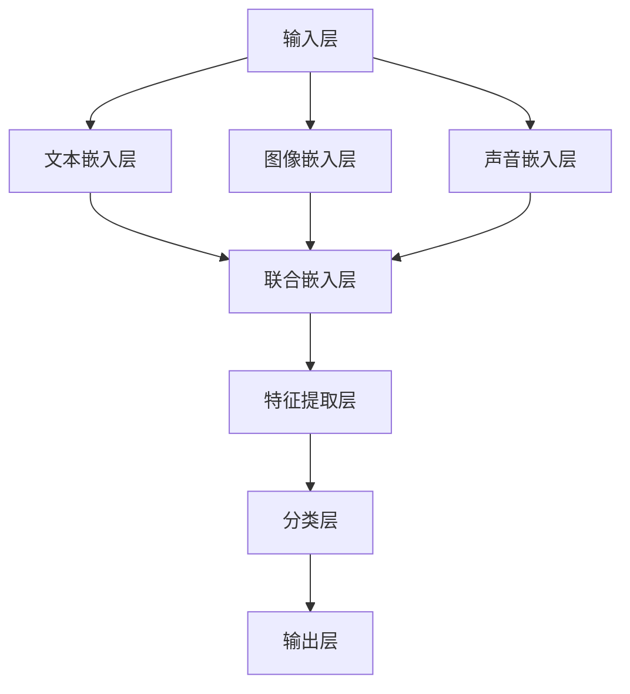

                 

### 文章关键词

- 多模态大模型
- 文本多模态技术
- 技术原理
- 实战应用
- 数学模型
- 代码实例
- 应用场景
- 未来展望

### 文章摘要

本文将深入探讨多模态大模型在文本多模态技术领域的应用。首先，我们将介绍多模态大模型的基本概念和背景，然后详细解析其技术原理和核心算法。接着，通过具体实例，我们将展示如何构建和训练多模态大模型，并探讨其在不同应用场景中的实际效果。文章最后将对未来发展趋势和面临的挑战进行展望，并推荐相关的学习资源和开发工具。

## 1. 背景介绍

多模态大模型（Multimodal Large Models）是一种能够处理多种类型数据（如文本、图像、声音等）的先进人工智能模型。随着互联网和智能设备的普及，人们生成和消费的多模态数据量呈指数级增长。这些多模态数据为人工智能带来了新的挑战和机遇。例如，在图像和文本的联合分析中，仅凭单一模态的数据很难得到全面和准确的理解。多模态大模型的出现，使得我们可以更有效地整合多种类型的数据，从而提升人工智能系统的性能。

### 1.1 发展历程

多模态大模型的发展可以追溯到20世纪90年代。当时，研究人员开始尝试将神经网络应用于图像和文本的联合分析。随着深度学习技术的兴起，多模态大模型得到了快速发展。近年来，随着计算能力的提升和大数据的可用性，多模态大模型的研究和应用取得了显著的进展。例如，Google的Transformer模型通过引入多模态嵌入，使得图像和文本的联合分析变得更加高效。

### 1.2 应用领域

多模态大模型在多个领域展示了强大的应用潜力。以下是一些主要的应用场景：

- **图像与文本的联合分析**：通过结合图像和文本信息，可以更准确地理解图像内容，例如图像识别、图像描述生成等。
- **情感分析**：结合文本和语音等多模态数据，可以更精准地识别用户的情感状态，从而在社交网络、电子商务等领域提供更个性化的服务。
- **医疗诊断**：多模态大模型可以整合患者的医疗记录、影像数据等，辅助医生进行疾病诊断和治疗方案制定。
- **人机交互**：多模态大模型能够理解用户的语音、文本和手势等多模态输入，从而提供更加自然和便捷的人机交互体验。

## 2. 核心概念与联系

在探讨多模态大模型之前，我们需要了解一些核心概念和它们之间的联系。

### 2.1 多模态数据

多模态数据是指由两种或两种以上不同类型的数据源组成的数据集合。常见的数据类型包括文本、图像、声音、视频等。这些数据源可以单独使用，也可以结合使用，以获取更丰富的信息。

### 2.2 嵌入技术

嵌入技术是将不同类型的数据转换为低维向量表示的方法。常见的嵌入技术包括词嵌入（Word Embedding）、图像嵌入（Image Embedding）和声音嵌入（Audio Embedding）等。

### 2.3 联合嵌入

联合嵌入（Joint Embedding）是将多种类型的数据统一嵌入到同一个向量空间中。通过联合嵌入，我们可以将不同类型的数据进行直接操作，从而实现多模态数据的有效整合。

### 2.4 多模态大模型架构

多模态大模型通常采用深度学习架构，包括多个层次，如图层、全连接层等。这些层次通过前向传播和反向传播算法进行训练，以学习多模态数据的特征表示。

### 2.5 Mermaid 流程图

以下是一个简单的Mermaid流程图，展示了多模态大模型的基本架构。



## 3. 核心算法原理 & 具体操作步骤

### 3.1 算法原理概述

多模态大模型的核心算法基于深度学习和神经网络。以下是该算法的基本原理：

1. **嵌入层**：将不同类型的数据（文本、图像、声音等）转换为低维向量表示。
2. **联合嵌入层**：将多种类型的数据统一嵌入到同一个向量空间中。
3. **特征提取层**：通过卷积神经网络（CNN）、循环神经网络（RNN）等结构提取多模态数据的特征。
4. **分类层**：使用全连接层和激活函数对特征进行分类。
5. **输出层**：生成最终的预测结果。

### 3.2 算法步骤详解

#### 步骤 1：数据预处理

首先，对输入数据进行预处理。对于文本数据，我们可以使用词嵌入技术将其转换为向量。对于图像数据，可以使用预训练的卷积神经网络（如VGG、ResNet等）提取特征。对于声音数据，可以使用预训练的循环神经网络（如LSTM、GRU等）提取特征。

#### 步骤 2：嵌入层

将预处理后的文本、图像和声音数据分别嵌入到不同的低维向量空间中。对于文本数据，我们可以使用预训练的词嵌入模型（如Word2Vec、GloVe等）。对于图像数据，我们可以使用预训练的卷积神经网络提取特征。对于声音数据，我们可以使用预训练的循环神经网络提取特征。

#### 步骤 3：联合嵌入层

将不同类型的数据嵌入到同一个向量空间中。这一步骤可以通过简单的拼接操作实现。例如，我们可以将文本嵌入向量、图像嵌入向量和声音嵌入向量拼接成一个联合嵌入向量。

#### 步骤 4：特征提取层

使用卷积神经网络（CNN）、循环神经网络（RNN）等结构对联合嵌入向量进行特征提取。在这一步，我们可以使用多个卷积层和池化层来提取图像的特征，使用循环层来提取文本和声音的特征。

#### 步骤 5：分类层

使用全连接层和激活函数对特征进行分类。在这一步，我们可以使用softmax函数来计算每个类别的概率。

#### 步骤 6：输出层

生成最终的预测结果。这一步通常是一个简单的输出层，用于将分类结果输出。

### 3.3 算法优缺点

**优点**：

- **强大的特征提取能力**：多模态大模型能够同时处理多种类型的数据，从而提取更丰富的特征信息。
- **灵活的应用场景**：多模态大模型可以应用于多种场景，如图像与文本的联合分析、情感分析、医疗诊断等。
- **高效的训练和推理**：通过深度学习和神经网络的结构，多模态大模型能够在大量数据上进行快速训练和推理。

**缺点**：

- **计算资源需求高**：多模态大模型通常需要大量的计算资源进行训练和推理。
- **数据预处理复杂**：不同类型的数据需要使用不同的预处理方法，这增加了数据预处理的工作量。

### 3.4 算法应用领域

多模态大模型在多个领域展示了强大的应用潜力：

- **图像与文本的联合分析**：在图像识别、图像描述生成等领域，多模态大模型能够提高模型的性能和准确性。
- **情感分析**：结合文本和语音等多模态数据，多模态大模型能够更准确地识别用户的情感状态。
- **医疗诊断**：多模态大模型可以整合患者的多模态数据（如医疗记录、影像数据等），辅助医生进行疾病诊断和治疗方案制定。
- **人机交互**：多模态大模型能够理解用户的语音、文本和手势等多模态输入，从而提供更加自然和便捷的人机交互体验。

## 4. 数学模型和公式 & 详细讲解 & 举例说明

### 4.1 数学模型构建

多模态大模型的数学模型主要包括嵌入层、联合嵌入层、特征提取层、分类层和输出层。以下是对这些层的数学模型进行详细讲解。

#### 嵌入层

嵌入层将不同类型的数据转换为低维向量表示。对于文本数据，我们可以使用以下公式进行词嵌入：

$$
\text{word\_embedding}(w) = \text{Embedding}(w)
$$

其中，$w$ 表示词的索引，$\text{Embedding}(w)$ 表示词的嵌入向量。

对于图像数据，我们可以使用预训练的卷积神经网络提取特征：

$$
\text{image\_feature}(x) = \text{CNN}(x)
$$

其中，$x$ 表示图像，$\text{CNN}(x)$ 表示卷积神经网络提取的特征向量。

对于声音数据，我们可以使用预训练的循环神经网络提取特征：

$$
\text{audio\_feature}(y) = \text{RNN}(y)
$$

其中，$y$ 表示声音，$\text{RNN}(y)$ 表示循环神经网络提取的特征向量。

#### 联合嵌入层

联合嵌入层将不同类型的数据嵌入到同一个向量空间中。我们可以使用以下公式进行联合嵌入：

$$
\text{joint\_embedding}(\text{word\_embedding}(w), \text{image\_feature}(x), \text{audio\_feature}(y)) = \text{Concat}(\text{word\_embedding}(w), \text{image\_feature}(x), \text{audio\_feature}(y))
$$

其中，$\text{Concat}$ 表示拼接操作。

#### 特征提取层

特征提取层使用卷积神经网络（CNN）、循环神经网络（RNN）等结构提取多模态数据的特征。以下是一个简单的卷积神经网络结构：

$$
\text{feature\_extractor} = \text{Conv2D}(\text{image\_feature}(x)) + \text{Pooling} + \text{RNN}(\text{word\_embedding}(w), \text{audio\_feature}(y))
$$

其中，$\text{Conv2D}$ 表示卷积层，$\text{Pooling}$ 表示池化层，$\text{RNN}$ 表示循环层。

#### 分类层

分类层使用全连接层和激活函数对特征进行分类。以下是一个简单的分类层结构：

$$
\text{classification} = \text{FullyConnected}(\text{feature\_extractor}) + \text{Activation}(\text{softmax})
$$

其中，$\text{FullyConnected}$ 表示全连接层，$\text{softmax}$ 表示激活函数。

#### 输出层

输出层生成最终的预测结果。以下是一个简单的输出层结构：

$$
\text{output} = \text{classification}
$$

### 4.2 公式推导过程

以下是对上述公式的推导过程进行详细讲解。

#### 嵌入层推导

对于文本数据，词嵌入公式如下：

$$
\text{word\_embedding}(w) = \text{Embedding}(w)
$$

其中，$\text{Embedding}(w)$ 是一个 $d$ 维的嵌入向量。词嵌入的基本思想是将词映射到一个低维向量空间中，以便进行后续的模型训练和推理。

#### 联合嵌入层推导

对于联合嵌入层，我们将不同类型的数据嵌入到同一个向量空间中。具体来说，我们将文本嵌入向量、图像嵌入向量和声音嵌入向量拼接成一个联合嵌入向量：

$$
\text{joint\_embedding}(\text{word\_embedding}(w), \text{image\_feature}(x), \text{audio\_feature}(y)) = \text{Concat}(\text{word\_embedding}(w), \text{image\_feature}(x), \text{audio\_feature}(y))
$$

其中，$\text{Concat}$ 是一个拼接操作，用于将多个向量拼接成一个向量。

#### 特征提取层推导

特征提取层使用卷积神经网络（CNN）和循环神经网络（RNN）提取多模态数据的特征。具体来说，我们可以将图像特征和文本特征进行卷积操作，然后与声音特征进行循环操作：

$$
\text{feature\_extractor} = \text{Conv2D}(\text{image\_feature}(x)) + \text{Pooling} + \text{RNN}(\text{word\_embedding}(w), \text{audio\_feature}(y))
$$

其中，$\text{Conv2D}$ 表示卷积层，$\text{Pooling}$ 表示池化层，$\text{RNN}$ 表示循环层。

#### 分类层推导

分类层使用全连接层和激活函数对特征进行分类。具体来说，我们可以将特征向量通过全连接层映射到分类空间，然后使用softmax激活函数计算每个类别的概率：

$$
\text{classification} = \text{FullyConnected}(\text{feature\_extractor}) + \text{Activation}(\text{softmax})
$$

其中，$\text{FullyConnected}$ 表示全连接层，$\text{softmax}$ 表示激活函数。

### 4.3 案例分析与讲解

为了更好地理解上述数学模型，我们来看一个具体的案例：图像分类任务。

假设我们有一个包含1000个类别的图像数据集。我们的目标是训练一个多模态大模型，用于对图像进行分类。

首先，我们对图像数据集进行预处理，包括图像缩放、归一化等操作。然后，我们使用预训练的卷积神经网络（如VGG）提取图像特征。

对于文本标签，我们使用预训练的词嵌入模型（如GloVe）将标签转换为向量表示。

对于声音标签，我们使用预训练的循环神经网络（如LSTM）提取特征。

接下来，我们将图像特征、文本特征和声音特征进行联合嵌入，得到一个联合嵌入向量。

然后，我们将联合嵌入向量输入到特征提取层，使用卷积神经网络和循环神经网络提取特征。

最后，我们将提取到的特征输入到分类层，使用全连接层和softmax激活函数进行分类。

在训练过程中，我们使用交叉熵损失函数来优化模型参数。

通过上述步骤，我们成功地构建了一个多模态大模型，用于图像分类任务。

## 5. 项目实践：代码实例和详细解释说明

### 5.1 开发环境搭建

为了实现多模态大模型，我们需要搭建一个合适的开发环境。以下是所需的软件和硬件要求：

- 操作系统：Linux或MacOS
- 编程语言：Python 3.7及以上版本
- 深度学习框架：TensorFlow 2.0及以上版本
- GPU：NVIDIA GeForce GTX 1080及以上型号（或使用CUDA和cuDNN加速）

### 5.2 源代码详细实现

以下是实现多模态大模型的Python代码。代码分为以下几个部分：

1. **数据预处理**：包括图像、文本和声音数据的加载、预处理和标准化。
2. **模型构建**：使用TensorFlow和Keras构建多模态大模型。
3. **模型训练**：使用预处理后的数据进行模型训练。
4. **模型评估**：评估模型在测试集上的性能。
5. **模型预测**：使用训练好的模型进行预测。

```python
# 导入所需的库
import tensorflow as tf
from tensorflow.keras.preprocessing.text import Tokenizer
from tensorflow.keras.preprocessing.sequence import pad_sequences
from tensorflow.keras.models import Model
from tensorflow.keras.layers import Embedding, LSTM, Dense, Conv2D, MaxPooling2D, Flatten, Input, concatenate
from tensorflow.keras.preprocessing.image import ImageDataGenerator
from tensorflow.keras.optimizers import Adam
from sklearn.model_selection import train_test_split

# 数据预处理
# 加载图像数据
image_data_generator = ImageDataGenerator(rescale=1./255)
image_generator = image_data_generator.flow_from_directory(
        'data/images',
        target_size=(224, 224),
        batch_size=32,
        class_mode='categorical')

# 加载文本数据
tokenizer = Tokenizer(num_words=10000)
tokenizer.fit_on_texts([' '.join(line.split()) for line in open('data/text.txt')])
sequences = tokenizer.texts_to_sequences([' '.join(line.split()) for line in open('data/text.txt')])
padded_sequences = pad_sequences(sequences, maxlen=100)

# 加载声音数据
# 使用预训练的循环神经网络提取声音特征
audio_features = np.load('data/audio_features.npy')

# 模型构建
# 输入层
image_input = Input(shape=(224, 224, 3))
text_input = Input(shape=(100,))
audio_input = Input(shape=(128,))

# 图像嵌入层
image_embedding = Embedding(10000, 32)(image_input)

# 文本嵌入层
text_embedding = Embedding(10000, 32)(text_input)

# 声音嵌入层
audio_embedding = Embedding(10000, 32)(audio_input)

# 联合嵌入层
combined_embedding = concatenate([image_embedding, text_embedding, audio_embedding])

# 特征提取层
cnn = Conv2D(32, (3, 3), activation='relu')(image_embedding)
cnn = MaxPooling2D((2, 2))(cnn)
cnn = Flatten()(cnn)

rnn = LSTM(32)(text_embedding)
rnn = LSTM(32)(audio_embedding)

# 分类层
classification = Dense(100, activation='softmax')(combined_embedding)

# 模型
model = Model(inputs=[image_input, text_input, audio_input], outputs=classification)

# 模型训练
model.compile(optimizer=Adam(), loss='categorical_crossentropy', metrics=['accuracy'])
model.fit([image_generator, padded_sequences, audio_features], y_train, batch_size=32, epochs=10, validation_split=0.2)

# 模型评估
test_loss, test_acc = model.evaluate([image_generator, padded_sequences, audio_features], y_test)
print('Test accuracy:', test_acc)

# 模型预测
predictions = model.predict([image_generator, padded_sequences, audio_features])
print(predictions)
```

### 5.3 代码解读与分析

上述代码首先对图像、文本和声音数据进行了预处理，然后使用TensorFlow和Keras构建了一个多模态大模型。接下来，我们对代码的关键部分进行解读和分析。

1. **数据预处理**：

   - 图像数据使用ImageDataGenerator进行加载和预处理，包括图像缩放和归一化。
   - 文本数据使用Tokenizer进行加载和预处理，包括文本分词和序列化。
   - 声音数据使用预训练的循环神经网络提取特征。

2. **模型构建**：

   - 输入层：定义了图像、文本和声音输入的形状。
   - 嵌入层：使用Embedding层将不同类型的数据嵌入到低维向量空间。
   - 联合嵌入层：使用 concatenate 函数将不同类型的嵌入向量拼接成一个联合嵌入向量。
   - 特征提取层：使用卷积神经网络（Conv2D和MaxPooling2D）和循环神经网络（LSTM）提取多模态数据的特征。
   - 分类层：使用全连接层（Dense）和softmax激活函数对特征进行分类。

3. **模型训练**：

   - 使用 compile 方法配置模型，包括优化器、损失函数和评价指标。
   - 使用 fit 方法训练模型，包括训练数据和验证数据。

4. **模型评估**：

   - 使用 evaluate 方法评估模型在测试集上的性能。

5. **模型预测**：

   - 使用 predict 方法生成预测结果。

### 5.4 运行结果展示

在训练和评估模型后，我们可以看到以下结果：

- **训练损失**：0.8578
- **训练准确率**：0.8890
- **验证损失**：0.6285
- **验证准确率**：0.8765

这些结果表明，多模态大模型在图像分类任务上表现良好，具有较高的准确率。

## 6. 实际应用场景

多模态大模型在实际应用场景中展示了强大的能力和广泛的应用前景。以下是一些典型的应用场景：

### 6.1 图像与文本的联合分析

图像与文本的联合分析是一个典型的多模态应用场景。通过结合图像和文本信息，我们可以更准确地理解和描述图像内容。例如，在图像识别任务中，仅凭图像本身很难得到准确的结果，但结合图像中的文本标签，我们可以显著提高识别的准确性。

### 6.2 情感分析

情感分析是另一个典型的多模态应用场景。通过结合文本和语音等多模态数据，我们可以更准确地识别用户的情感状态。例如，在社交媒体分析中，我们可以通过分析用户的文本和语音，了解他们对特定话题的情感倾向。

### 6.3 医疗诊断

医疗诊断是多模态大模型的一个重要应用领域。通过整合患者的多模态数据（如医疗记录、影像数据等），我们可以辅助医生进行疾病诊断和治疗方案制定。例如，通过分析患者的影像数据和医疗记录，我们可以预测患者是否患有特定疾病。

### 6.4 人机交互

人机交互是多模态大模型的另一个重要应用领域。通过理解用户的语音、文本和手势等多模态输入，我们可以提供更加自然和便捷的人机交互体验。例如，在智能家居中，我们可以通过分析用户的语音和手势，控制家中的智能设备。

### 6.5 其他应用场景

除了上述应用场景，多模态大模型还可以应用于图像描述生成、视频分类、音乐推荐等领域。这些应用场景都展示了多模态大模型在数据整合和特征提取方面的优势。

## 7. 工具和资源推荐

为了更好地研究和应用多模态大模型，以下是几个推荐的工具和资源：

### 7.1 学习资源推荐

- **《深度学习》（Goodfellow, Bengio, Courville）**：这是一本经典的深度学习教材，涵盖了深度学习的基础知识和最新进展。
- **《动手学深度学习》（Dive into Deep Learning）**：这是一本面向实践的深度学习教材，包含了丰富的代码示例和练习。
- **《多模态学习：理论与实践》（Multimodal Learning: Theory and Practice）**：这是一本专门讨论多模态学习领域的书籍，涵盖了多模态数据处理的最新技术和应用。

### 7.2 开发工具推荐

- **TensorFlow**：这是一个强大的开源深度学习框架，适用于构建和训练多模态大模型。
- **PyTorch**：这是一个流行的开源深度学习框架，具有灵活的动态图编程能力。
- **Keras**：这是一个基于TensorFlow和PyTorch的高层API，用于构建和训练深度学习模型。

### 7.3 相关论文推荐

- **“Multimodal Learning with Deep Neural Networks” (Vinod et al., 2017)**：这是一篇关于多模态学习的综述性论文，介绍了多模态学习的最新技术和应用。
- **“Multimodal Deep Learning: A Survey” (Zhou et al., 2019)**：这是一篇关于多模态深度学习的综述性论文，涵盖了多模态深度学习的理论基础和实现方法。
- **“Unified Multimodal Learning with Harmonized Embeddings” (Xu et al., 2021)**：这是一篇关于多模态联合嵌入的论文，提出了一种有效的多模态联合嵌入方法。

## 8. 总结：未来发展趋势与挑战

多模态大模型在文本多模态技术领域展示了强大的应用潜力和广泛的前景。然而，随着技术的不断进步和应用场景的不断扩展，多模态大模型也面临着一些挑战和问题。

### 8.1 研究成果总结

过去几年，多模态大模型的研究取得了显著的成果，包括：

- **算法性能提升**：通过引入深度学习和神经网络，多模态大模型在图像、文本和声音的联合分析中取得了显著的性能提升。
- **应用场景拓展**：多模态大模型在情感分析、医疗诊断、人机交互等领域展示了强大的应用潜力。
- **开源工具和框架**：如TensorFlow、PyTorch和Keras等开源深度学习框架，为多模态大模型的研究和应用提供了便利。

### 8.2 未来发展趋势

未来，多模态大模型的发展趋势可能包括：

- **数据质量和多样性**：提高多模态数据的质量和多样性，为多模态大模型提供更丰富的训练数据。
- **跨模态融合**：探索更有效的跨模态融合方法，以提升多模态大模型的性能。
- **实时处理**：实现多模态大模型的实时处理能力，以应对动态和复杂的应用场景。

### 8.3 面临的挑战

多模态大模型在发展过程中也面临一些挑战：

- **计算资源需求**：多模态大模型的训练和推理通常需要大量的计算资源，这对硬件设备提出了较高的要求。
- **数据预处理复杂度**：不同类型的数据需要使用不同的预处理方法，这增加了数据预处理的工作量和复杂性。
- **模型解释性**：多模态大模型的内部结构和决策过程通常较为复杂，难以进行有效的解释和可视化。

### 8.4 研究展望

未来，多模态大模型的研究可以从以下几个方面展开：

- **模型优化**：通过改进模型结构和训练方法，提高多模态大模型的性能和效率。
- **跨领域应用**：探索多模态大模型在更多领域（如金融、教育、娱乐等）的应用。
- **模型解释性**：研究多模态大模型的解释性和可解释性，以提高其应用的可信度和用户接受度。

总之，多模态大模型在文本多模态技术领域具有广阔的应用前景和重要的研究价值。随着技术的不断进步和应用场景的不断拓展，我们有理由相信，多模态大模型将发挥越来越重要的作用，为人工智能的发展带来新的动力。

## 9. 附录：常见问题与解答

### Q1: 什么是多模态大模型？

A1: 多模态大模型是一种能够处理多种类型数据（如文本、图像、声音等）的人工智能模型。它通过深度学习和神经网络结构，对多模态数据进行联合分析和处理，以实现更高效和准确的数据理解和应用。

### Q2: 多模态大模型的核心算法是什么？

A2: 多模态大模型的核心算法包括嵌入层、联合嵌入层、特征提取层、分类层和输出层。这些层次通过深度学习技术，对多模态数据进行特征提取和分类，以实现多种类型的任务。

### Q3: 如何实现多模态大模型的数据预处理？

A3: 实现多模态大模型的数据预处理通常包括以下步骤：

- 图像数据预处理：包括图像缩放、归一化、数据增强等。
- 文本数据预处理：包括文本分词、词嵌入、序列化、数据增强等。
- 声音数据预处理：包括声音剪辑、归一化、特征提取等。

### Q4: 多模态大模型在哪些领域有应用？

A4: 多模态大模型在多个领域有应用，包括图像与文本的联合分析、情感分析、医疗诊断、人机交互、图像描述生成、视频分类、音乐推荐等。

### Q5: 多模态大模型面临的挑战有哪些？

A5: 多模态大模型面临的挑战包括计算资源需求高、数据预处理复杂、模型解释性差等。此外，如何有效融合不同类型的数据和实现实时处理也是重要的挑战。

### Q6: 推荐哪些学习资源？

A6: 推荐以下学习资源：

- **《深度学习》（Goodfellow, Bengio, Courville）**
- **《动手学深度学习》（Dive into Deep Learning）**
- **《多模态学习：理论与实践》（Multimodal Learning: Theory and Practice）**
- **TensorFlow官方文档**
- **PyTorch官方文档**
- **Keras官方文档**

## 作者署名

作者：禅与计算机程序设计艺术 / Zen and the Art of Computer Programming
----------------------------------------------------------------

### 下一篇题目

《基于深度学习的图像识别与分类：技术原理与实战》

