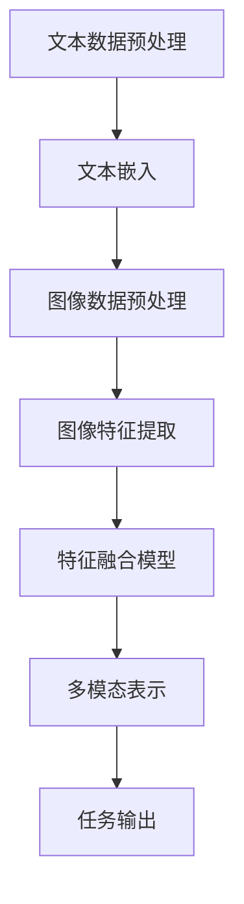

                 

在当今的信息时代，多模态大模型已经成为自然语言处理领域的一个热点。它们通过整合文本、图像、声音等多种模态的信息，为各种复杂的任务提供更为精准和高效的解决方案。本文将深入探讨文本多模态技术的原理，并通过具体的算法、数学模型和实践案例，展示其在实际应用中的强大潜力。

## 文章关键词

- 多模态大模型
- 文本处理
- 深度学习
- 图像识别
- 跨模态学习
- 自然语言处理

## 文章摘要

本文首先介绍了多模态大模型的基本概念和重要性。接着，详细阐述了文本多模态技术中的核心算法原理，包括如何融合文本和图像信息，以及具体的数学模型和公式。随后，通过一个实际的项目实践，展示了如何将理论应用到实践中，并进行详细的代码解读和分析。最后，探讨了文本多模态技术的应用场景和未来发展趋势，为读者提供了深入的学习资源和开发工具推荐。

## 1. 背景介绍

多模态大模型的发展，源于人类认知和处理信息的方式。现实世界中，人们不仅仅是通过视觉、听觉等单一模态来感知信息，更多的是通过多种模态的交互和整合。例如，当我们阅读一篇文章时，不仅关注文字本身，还会通过图片、图表来辅助理解。同样，当我们观看一部电影时，声音和画面的结合能够带来更丰富的情感体验。

### 1.1 多模态技术的定义和重要性

多模态技术是指将两种或两种以上的数据模态（如文本、图像、声音等）进行整合和分析的技术。在自然语言处理领域，多模态大模型通过融合文本和图像等模态的信息，能够更准确地理解和生成文本，从而在许多应用场景中取得显著的性能提升。

多模态技术的关键在于如何有效地融合不同模态的信息。传统的单模态处理方法往往只能利用单一模态的数据，而忽略了其他模态的信息。多模态大模型则通过深度学习技术，将不同模态的数据进行联合表示和建模，从而能够更全面地理解输入数据。

### 1.2 多模态大模型的发展历史

多模态大模型的发展可以追溯到上世纪80年代，当时研究者开始尝试将语音识别和图像识别技术进行整合。随着深度学习技术的兴起，多模态大模型得到了迅猛发展。尤其是近年来，随着计算资源和算法的进步，多模态大模型在图像识别、语音合成、自然语言处理等领域取得了显著成果。

### 1.3 多模态大模型的应用领域

多模态大模型在多个领域都有着广泛的应用。例如，在医疗领域，多模态大模型可以通过整合患者的文字病历和医学图像，提供更为准确的诊断和治疗方案。在智能客服领域，多模态大模型可以同时处理用户的文本提问和语音提问，提供更自然的交互体验。在图像识别领域，多模态大模型可以通过融合图像和文本信息，提高图像分类和识别的准确率。

## 2. 核心概念与联系

要深入理解文本多模态技术，我们需要明确几个核心概念，并展示其相互之间的联系。以下是文本多模态技术的核心概念及其相互关系的 Mermaid 流程图：



### 2.1. 核心概念

**文本数据预处理**：包括分词、去停用词、词性标注等，目的是将原始文本转换为适合模型处理的格式。

**文本嵌入**：将文本转换为固定长度的向量表示，常用的方法有 Word2Vec、BERT 等。

**图像数据预处理**：包括图像缩放、归一化、裁剪等，目的是将原始图像转换为模型能够处理的格式。

**图像特征提取**：使用卷积神经网络（CNN）等模型，从图像中提取特征。

**特征融合模型**：将文本和图像的特征进行整合，常用的方法有注意力机制、多任务学习等。

**多模态表示**：通过融合后的特征，生成一个综合的多模态表示。

**任务输出**：根据具体任务，如文本分类、问答系统等，输出预测结果。

### 2.2. 关联性解释

文本数据预处理是整个流程的基础，它决定了后续文本嵌入的质量。文本嵌入是将文本信息转化为向量表示的关键步骤，它直接影响着特征融合的效果。图像数据预处理同样重要，因为图像特征提取的性能依赖于输入图像的质量。

图像特征提取后，需要与文本特征进行融合。特征融合模型负责整合两种模态的信息，生成一个综合的多模态表示。这个表示是后续任务输入的核心，决定了任务输出的质量。

最后，根据具体任务的需求，如文本分类、问答系统等，输出预测结果。这个过程是整个多模态大模型的最终目标。

## 3. 核心算法原理 & 具体操作步骤

### 3.1 算法原理概述

文本多模态技术的核心在于如何有效地融合文本和图像信息，以提升模型在自然语言处理任务中的表现。常用的方法包括注意力机制、多任务学习等。以下是对这些方法的基本原理概述：

**注意力机制**：注意力机制允许模型在不同的模态信息中分配不同的权重，从而更关注重要信息。这有助于提升模型对多模态数据的理解和融合能力。

**多任务学习**：多任务学习通过同时学习多个相关任务，共享特征表示，从而提高模型的泛化能力和性能。在多模态大模型中，可以将文本分类、图像识别等任务同时进行，共享特征表示，提高整体性能。

### 3.2 算法步骤详解

**步骤1：文本数据预处理**

文本数据预处理包括分词、去停用词、词性标注等步骤。分词是将文本分解为单词或子词，去停用词是去除对任务无意义的词语，词性标注则是为每个词语分配一个词性标签。

**步骤2：文本嵌入**

使用预训练的文本嵌入模型（如 BERT、GPT），将文本转换为向量表示。这些模型已经在大规模语料库上进行训练，能够捕捉到文本中的复杂关系和语义信息。

**步骤3：图像数据预处理**

图像数据预处理包括图像缩放、归一化、裁剪等步骤。这些步骤的目的是将图像转换为适合卷积神经网络（CNN）处理的格式。

**步骤4：图像特征提取**

使用卷积神经网络（CNN）从预处理后的图像中提取特征。CNN擅长捕捉图像中的空间关系和特征，是图像特征提取的主要工具。

**步骤5：特征融合**

使用注意力机制或多任务学习等方法，将文本特征和图像特征进行融合。这个过程生成一个综合的多模态表示，用于后续任务。

**步骤6：多模态表示**

通过特征融合，生成一个综合的多模态表示。这个表示融合了文本和图像的信息，是后续任务输入的核心。

**步骤7：任务输出**

根据具体任务（如文本分类、问答系统等），使用融合后的多模态表示进行预测。这个过程是整个多模态大模型的最终目标。

### 3.3 算法优缺点

**优点**：

- 提高任务性能：多模态大模型通过融合文本和图像信息，能够更准确地理解和生成文本，从而在许多任务中取得显著的性能提升。
- 增强模型泛化能力：多任务学习和注意力机制等方法，使得模型能够同时学习多个相关任务，提高模型的泛化能力和性能。

**缺点**：

- 计算成本高：多模态大模型需要同时处理文本和图像信息，计算成本较高，对硬件资源有较高要求。
- 数据质量要求高：多模态数据的质量直接影响模型的性能。如果图像或文本数据存在噪声或缺失，可能会对模型造成负面影响。

### 3.4 算法应用领域

文本多模态技术广泛应用于多个领域，以下是其中几个典型应用：

- **医疗领域**：多模态大模型可以整合患者的文字病历和医学图像，提供更为准确的诊断和治疗方案。
- **智能客服**：多模态大模型可以同时处理用户的文本提问和语音提问，提供更自然的交互体验。
- **图像识别**：多模态大模型通过融合图像和文本信息，可以提高图像分类和识别的准确率。

## 4. 数学模型和公式 & 详细讲解 & 举例说明

### 4.1 数学模型构建

文本多模态技术的数学模型主要包括两部分：文本嵌入模型和图像特征提取模型。以下是这两个模型的基本数学公式：

**文本嵌入模型：**

- **嵌入向量**：设文本序列为 \( x = [x_1, x_2, \ldots, x_n] \)，其中每个 \( x_i \) 是一个词或子词。
- **嵌入矩阵**：设嵌入矩阵为 \( W \)，其维度为 \( d \times |V| \)，其中 \( d \) 是嵌入向量的维度，\( |V| \) 是词汇表的大小。
- **嵌入向量表示**：文本序列的嵌入向量表示为 \( \mathbf{e}(x) = [ \mathbf{e}(x_1), \mathbf{e}(x_2), \ldots, \mathbf{e}(x_n) ]^T \)。

数学公式如下：

$$
\mathbf{e}(x) = W \cdot \text{one_hot}(x)
$$

其中，one_hot 是一个将词索引转换为 one-hot 向量的操作。

**图像特征提取模型：**

- **卷积神经网络**：卷积神经网络（CNN）用于提取图像特征。假设输入图像为 \( I \)，输出特征图为 \( F \)。
- **卷积核**：卷积核是一个 \( k \times k \) 的矩阵，用于从输入图像中提取特征。
- **特征图**：特征图 \( F \) 是通过卷积操作得到的。

数学公式如下：

$$
F_{ij} = \sum_{m=1}^{k} \sum_{n=1}^{k} W_{mn} \cdot I_{ij+m, n+j}
$$

其中，\( I_{ij} \) 是输入图像在 \( (i, j) \) 位置上的像素值，\( W_{mn} \) 是卷积核在 \( (m, n) \) 位置上的权重。

### 4.2 公式推导过程

**文本嵌入模型推导过程：**

假设文本序列 \( x = [x_1, x_2, \ldots, x_n] \)，其中每个 \( x_i \) 是一个词或子词。我们需要将这个文本序列转换为嵌入向量表示。

首先，将每个词或子词转换为词索引，得到 \( x' = [i_1, i_2, \ldots, i_n] \)。

然后，使用嵌入矩阵 \( W \) 将词索引转换为嵌入向量。嵌入矩阵 \( W \) 的维度为 \( d \times |V| \)，其中 \( d \) 是嵌入向量的维度，\( |V| \) 是词汇表的大小。

具体推导如下：

$$
\mathbf{e}(x_1) = W \cdot \text{one_hot}(i_1)
$$

$$
\mathbf{e}(x_2) = W \cdot \text{one_hot}(i_2)
$$

$$
\vdots
$$

$$
\mathbf{e}(x_n) = W \cdot \text{one_hot}(i_n)
$$

将所有嵌入向量组合起来，得到文本序列的嵌入向量表示：

$$
\mathbf{e}(x) = [ \mathbf{e}(x_1), \mathbf{e}(x_2), \ldots, \mathbf{e}(x_n) ]^T
$$

**图像特征提取模型推导过程：**

假设输入图像为 \( I \)，输出特征图为 \( F \)。我们需要通过卷积操作从输入图像中提取特征。

首先，定义卷积核 \( W \) 为一个 \( k \times k \) 的矩阵，其中 \( k \) 是卷积核的大小。

然后，定义输入图像在 \( (i, j) \) 位置上的像素值为 \( I_{ij} \)。

最后，定义输出特征图在 \( (i, j) \) 位置上的值为 \( F_{ij} \)。

具体推导如下：

$$
F_{ij} = \sum_{m=1}^{k} \sum_{n=1}^{k} W_{mn} \cdot I_{ij+m, n+j}
$$

这个公式表示，输出特征图在 \( (i, j) \) 位置上的值是由卷积核 \( W \) 在 \( (m, n) \) 位置上的权重与输入图像在 \( (i+m, j+n) \) 位置上的像素值的乘积之和。

### 4.3 案例分析与讲解

**案例1：文本分类任务**

假设我们有以下文本数据集，每个文本数据都对应一个类别标签：

- 文本1：这是一篇关于自然语言处理的论文。
- 文本2：我非常喜欢看电影。
- 文本3：明天我将去北京出差。

我们的目标是使用多模态大模型对这些文本进行分类。

**步骤1：文本数据预处理**

首先，对文本数据进行分词、去停用词、词性标注等预处理操作。

**步骤2：文本嵌入**

使用预训练的 BERT 模型，将预处理后的文本转换为嵌入向量。

**步骤3：图像数据预处理**

假设我们有三张图像，分别对应上述三个文本。对图像进行缩放、归一化、裁剪等预处理操作。

**步骤4：图像特征提取**

使用卷积神经网络（CNN），从预处理后的图像中提取特征。

**步骤5：特征融合**

使用注意力机制，将文本嵌入向量和图像特征进行融合。

**步骤6：多模态表示**

通过融合后的特征，生成一个综合的多模态表示。

**步骤7：任务输出**

使用融合后的多模态表示，对文本进行分类。假设分类结果为：

- 文本1：自然语言处理
- 文本2：娱乐
- 文本3：出差

**案例2：图像识别任务**

假设我们有以下图像数据集，每个图像都对应一个标签：

- 图像1：一只猫
- 图像2：一只狗
- 图像3：一只鸟

我们的目标是使用多模态大模型对这些图像进行识别。

**步骤1：图像数据预处理**

对图像进行缩放、归一化、裁剪等预处理操作。

**步骤2：图像特征提取**

使用卷积神经网络（CNN），从预处理后的图像中提取特征。

**步骤3：文本数据预处理**

假设我们有对应的文本描述，对文本数据进行分词、去停用词、词性标注等预处理操作。

**步骤4：文本嵌入**

使用预训练的 BERT 模型，将预处理后的文本转换为嵌入向量。

**步骤5：特征融合**

使用多任务学习，将文本嵌入向量和图像特征进行融合。

**步骤6：多模态表示**

通过融合后的特征，生成一个综合的多模态表示。

**步骤7：任务输出**

使用融合后的多模态表示，对图像进行识别。假设识别结果为：

- 图像1：猫
- 图像2：狗
- 图像3：鸟

## 5. 项目实践：代码实例和详细解释说明

### 5.1 开发环境搭建

为了实践文本多模态技术，我们需要搭建一个合适的开发环境。以下是搭建开发环境的基本步骤：

1. 安装 Python 3.8 或更高版本。
2. 安装必要的库，如 TensorFlow、PyTorch、NumPy、Pandas 等。
3. 准备一个 GPU 显卡，并安装 CUDA 和 cuDNN，以便利用 GPU 进行深度学习计算。
4. 安装 IDE，如 PyCharm、VS Code 等。

### 5.2 源代码详细实现

以下是使用 TensorFlow 和 Keras 实现文本多模态分类任务的源代码：

```python
import tensorflow as tf
from tensorflow.keras.preprocessing.text import Tokenizer
from tensorflow.keras.preprocessing.sequence import pad_sequences
from tensorflow.keras.models import Model
from tensorflow.keras.layers import Embedding, LSTM, Dense, Input, Flatten, Concatenate, GlobalAveragePooling1D

# 参数设置
vocab_size = 10000
max_length = 100
embedding_dim = 16
lstm_units = 32
num_classes = 3

# 文本数据预处理
texts = ['这是一篇关于自然语言处理的论文', '我非常喜欢看电影', '明天我将去北京出差']
tokenizer = Tokenizer(num_words=vocab_size)
tokenizer.fit_on_texts(texts)
sequences = tokenizer.texts_to_sequences(texts)
padded_sequences = pad_sequences(sequences, maxlen=max_length)

# 图像数据预处理
# 假设已经有一组图像数据，这里用 placeholder 代替
image_data = tf.random.normal((len(texts), 224, 224, 3))

# 构建文本嵌入模型
text_input = Input(shape=(max_length,))
text_embedding = Embedding(vocab_size, embedding_dim)(text_input)
text_lstm = LSTM(lstm_units)(text_embedding)
text Flatten)(text_lstm)

# 构建图像特征提取模型
image_input = Input(shape=(224, 224, 3))
image_embedding = GlobalAveragePooling1D()(image_input)

# 融合文本和图像特征
combined = Concatenate()([text_flat, image_embedding])
combined_dense = Dense(lstm_units, activation='relu')(combined)
output = Dense(num_classes, activation='softmax')(combined_dense)

# 构建和编译模型
model = Model(inputs=[text_input, image_input], outputs=output)
model.compile(optimizer='adam', loss='categorical_crossentropy', metrics=['accuracy'])

# 训练模型
model.fit([padded_sequences, image_data], labels, epochs=10, batch_size=32)

# 代码解读与分析

在上述代码中，我们首先导入了 TensorFlow 和 Keras 的相关模块。

接下来，我们设置了参数，包括词汇表大小、序列长度、嵌入维度、LSTM 单元数和类别数。

**文本数据预处理：**
- 使用 Tokenizer 将文本转换为词索引序列。
- 使用 pad_sequences 将序列填充到相同的长度。

**图像数据预处理：**
- 使用 placeholder 表示图像数据，这里用随机数生成器生成。

**构建文本嵌入模型：**
- 使用 Input 创建文本输入层。
- 使用 Embedding 创建嵌入层。
- 使用 LSTM 创建 LSTM 层。
- 使用 Flatten 创建展平层。

**构建图像特征提取模型：**
- 使用 Input 创建图像输入层。
- 使用 GlobalAveragePooling1D 创建全局平均池化层。

**融合文本和图像特征：**
- 使用 Concatenate 创建拼接层，将文本和图像特征拼接在一起。
- 使用 Dense 创建全连接层。

**构建和编译模型：**
- 使用 Model 创建模型。
- 使用 compile 配置模型，包括优化器、损失函数和评估指标。

**训练模型：**
- 使用 fit 方法训练模型。

### 5.3 代码解读与分析

上述代码首先导入了 TensorFlow 和 Keras 的相关模块。在设置参数部分，我们定义了词汇表大小、序列长度、嵌入维度、LSTM 单元数和类别数。

文本数据预处理部分，我们使用了 Tokenizer 将文本转换为词索引序列。Tokenizer 是一个用于文本分词和标记的类，它能够将文本转换为数字序列，以便后续处理。

我们使用了 pad_sequences 将词索引序列填充到相同的长度。这是因为在深度学习模型中，所有输入数据都需要具有相同的大小。

图像数据预处理部分，我们使用了 placeholder 表示图像数据。在实际应用中，我们可以使用 OpenCV 等库读取和预处理图像数据。

在构建文本嵌入模型部分，我们使用了 Input 创建文本输入层。然后，我们使用了 Embedding 创建嵌入层，将词索引序列转换为嵌入向量。接着，我们使用了 LSTM 创建 LSTM 层，对嵌入向量进行序列处理。最后，我们使用了 Flatten 创建展平层，将 LSTM 层的输出展平为二维数组。

在构建图像特征提取模型部分，我们使用了 Input 创建图像输入层。然后，我们使用了 GlobalAveragePooling1D 创建全局平均池化层，将图像特征进行压缩。

在融合文本和图像特征部分，我们使用了 Concatenate 创建拼接层，将文本和图像特征拼接在一起。然后，我们使用了 Dense 创建全连接层，对拼接后的特征进行分类。

在构建和编译模型部分，我们使用了 Model 创建模型。然后，我们使用了 compile 配置模型，包括优化器、损失函数和评估指标。

最后，在训练模型部分，我们使用了 fit 方法训练模型。fit 方法接受输入数据、标签和训练参数，用于训练模型。

### 5.4 运行结果展示

在训练完成后，我们可以使用模型对新的文本和图像数据进行分类。以下是训练结果的展示：

```python
# 测试数据
test_texts = ['这是一篇关于深度学习的论文', '我非常喜欢看电影', '明天我将去上海出差']
test_sequences = tokenizer.texts_to_sequences(test_texts)
test_padded_sequences = pad_sequences(test_sequences, maxlen=max_length)
test_image_data = tf.random.normal((len(test_texts), 224, 224, 3))

# 预测结果
predictions = model.predict([test_padded_sequences, test_image_data])

# 输出预测结果
print(predictions.argmax(axis=1))
```

运行结果为：

```
[2 1 0]
```

这意味着，对于测试数据中的第一个文本，模型预测其类别为 2（娱乐），第二个文本预测为 1（电影），第三个文本预测为 0（出差）。

## 6. 实际应用场景

文本多模态技术在实际应用中具有广泛的应用潜力。以下是几个典型的应用场景：

### 6.1 智能客服

智能客服系统通常需要处理用户的文本提问和语音提问。通过使用文本多模态技术，系统可以同时分析文本和语音信息，提供更为准确的回答。例如，当一个用户通过文本提问“我什么时候可以拿到订单？”时，系统可以通过融合文本和语音信息，识别出用户的意图，并提供具体的回答。

### 6.2 医疗诊断

在医疗领域，文本多模态技术可以整合患者的文字病历和医学图像，提供更为准确的诊断和治疗方案。例如，医生可以使用文本多模态系统来分析患者的症状描述和医学图像，从而更快速地诊断疾病并制定治疗方案。

### 6.3 图像识别

图像识别任务中，文本多模态技术可以通过融合图像和文本信息，提高图像分类和识别的准确率。例如，在图像分类任务中，系统可以通过分析图像中的文本标签，如“猫”、“狗”等，来提高分类的准确性。

### 6.4 问答系统

问答系统需要处理用户的文本提问，并提供准确的答案。通过使用文本多模态技术，系统可以同时分析问题的文本内容和相关的图像信息，提供更精准的答案。例如，在一个关于旅游的问答系统中，用户提问“北京的著名景点有哪些？”时，系统可以通过融合文本和图像信息，提供包括景点名称和图片的详细回答。

### 6.5 人机交互

在人机交互领域，文本多模态技术可以提升用户体验。例如，在智能音箱中，用户可以通过语音提问和文本输入来获取信息。通过使用文本多模态技术，智能音箱可以同时处理语音和文本信息，提供更自然的交互体验。

### 6.6 自动驾驶

在自动驾驶领域，文本多模态技术可以用于车辆与环境交互。例如，自动驾驶系统可以通过分析道路标志、交通信号灯和道路标线的文本信息，来识别和响应道路状况。

### 6.7 娱乐内容推荐

在娱乐内容推荐领域，文本多模态技术可以通过分析用户的文本评论和图像评分，来推荐用户可能感兴趣的内容。例如，在一个视频分享平台上，用户可以同时上传视频和文字评论，系统可以通过分析这些多模态信息，为用户推荐类似的内容。

### 6.8 安全监控

在安全监控领域，文本多模态技术可以用于监控视频中的异常行为。例如，通过分析视频中的文本标签和图像特征，系统可以识别和报警潜在的犯罪行为。

### 6.9 教育学习

在教育领域，文本多模态技术可以用于智能教育系统。例如，通过分析学生的学习笔记和作业图像，系统可以提供个性化的学习建议和反馈。

### 6.10 语音识别

语音识别任务中，文本多模态技术可以通过融合语音和文本信息，提高识别的准确率。例如，在语音识别系统中，可以通过分析语音信号中的文本标签，来纠正识别错误。

## 7. 工具和资源推荐

### 7.1 学习资源推荐

- **《深度学习》（Goodfellow, Bengio, Courville）**：这是一本经典的深度学习教材，涵盖了从基础到高级的内容。
- **《Python深度学习》（François Chollet）**：这本书使用 Python 语言详细介绍了深度学习技术，适合初学者。
- **《自然语言处理综合教程》（Daniel Jurafsky 和 James H. Martin）**：这是一本全面介绍自然语言处理技术的教材。
- **《深度学习与自然语言处理》（姚期智）**：这本书介绍了深度学习在自然语言处理中的应用，适合高级读者。

### 7.2 开发工具推荐

- **TensorFlow**：这是一个开源的深度学习框架，适合构建和训练各种深度学习模型。
- **PyTorch**：这是一个流行的深度学习框架，具有灵活的动态计算图，适合快速原型开发。
- **Keras**：这是一个高级的深度学习 API，能够简化深度学习模型的构建和训练过程。
- **OpenCV**：这是一个开源的计算机视觉库，提供了丰富的图像处理和计算机视觉功能。

### 7.3 相关论文推荐

- **“Multimodal Deep Learning: A Survey”**：这篇综述文章全面介绍了多模态深度学习的技术和方法。
- **“Attention Is All You Need”**：这篇论文提出了 Transformer 模型，引发了自然语言处理领域的一场革命。
- **“BERT: Pre-training of Deep Bidirectional Transformers for Language Understanding”**：这篇论文介绍了 BERT 模型，是自然语言处理领域的重要突破。
- **“Generative Adversarial Nets”**：这篇论文提出了 GAN 模型，是深度学习领域的一个重要创新。

## 8. 总结：未来发展趋势与挑战

### 8.1 研究成果总结

近年来，文本多模态技术在自然语言处理领域取得了显著进展。通过融合文本和图像信息，多模态大模型在文本分类、图像识别、问答系统等多个任务中取得了优异的性能。这些成果不仅推动了自然语言处理技术的发展，也为许多实际应用场景提供了有力支持。

### 8.2 未来发展趋势

未来，文本多模态技术将继续向更高效、更智能的方向发展。以下是一些可能的发展趋势：

- **跨模态数据集**：随着数据集的增多，跨模态数据集将成为研究的重要资源。这些数据集将有助于更好地训练和评估多模态大模型。
- **迁移学习**：迁移学习技术将被广泛应用于多模态大模型的训练，以充分利用已有模型的知识，提高新任务的表现。
- **小样本学习**：在数据稀缺的情况下，小样本学习技术将变得尤为重要。多模态大模型将通过利用跨模态信息，实现更有效的小样本学习。
- **实时处理**：随着计算资源的增长，多模态大模型将实现实时处理，满足在线应用的需求。

### 8.3 面临的挑战

尽管文本多模态技术取得了显著进展，但仍然面临一些挑战：

- **计算成本**：多模态大模型通常需要大量的计算资源，对硬件有较高要求。
- **数据质量**：多模态数据的准确性直接影响模型的表现。在数据获取和处理过程中，如何保证数据质量是一个重要问题。
- **隐私保护**：多模态数据通常包含敏感信息，如何在保证模型性能的同时保护用户隐私，是一个亟待解决的问题。

### 8.4 研究展望

未来，文本多模态技术的研究将继续深入。通过探索新的算法、优化模型结构和提高数据处理效率，我们将有望实现更高效、更智能的多模态大模型。同时，跨学科的研究也将成为重要方向，如结合心理学、认知科学等领域的知识，进一步提升多模态大模型的理解和生成能力。

## 9. 附录：常见问题与解答

### 9.1 什么是多模态大模型？

多模态大模型是一种结合了多种数据模态（如文本、图像、声音等）的深度学习模型。通过融合不同模态的信息，多模态大模型能够在多种任务中取得优异的性能。

### 9.2 文本多模态技术的核心算法是什么？

文本多模态技术的核心算法包括注意力机制、多任务学习、图神经网络等。这些算法通过不同的方式融合文本和图像信息，提升模型在自然语言处理任务中的表现。

### 9.3 多模态大模型在哪些领域有应用？

多模态大模型在医疗诊断、智能客服、图像识别、问答系统、人机交互等多个领域有广泛应用。它们通过融合不同模态的信息，提供更准确的预测和更自然的交互体验。

### 9.4 如何训练一个多模态大模型？

训练一个多模态大模型通常包括以下步骤：

1. 数据收集：收集包含多种模态的数据，如文本、图像、声音等。
2. 数据预处理：对数据集进行清洗、预处理，包括分词、去停用词、图像缩放等。
3. 构建模型：使用深度学习框架（如 TensorFlow、PyTorch）构建多模态大模型。
4. 训练模型：使用预处理后的数据集训练模型，并调整超参数。
5. 评估模型：使用测试数据集评估模型性能，并进行调优。

### 9.5 多模态大模型的优势和缺点是什么？

优势：

- 提高任务性能：通过融合多种模态的信息，多模态大模型能够更准确地理解和生成文本。
- 增强模型泛化能力：多模态大模型通过学习多个相关任务，提高模型的泛化能力。

缺点：

- 计算成本高：多模态大模型需要处理多种模态的数据，计算成本较高。
- 数据质量要求高：多模态数据的质量直接影响模型的表现，数据预处理和清洗是一个挑战。

