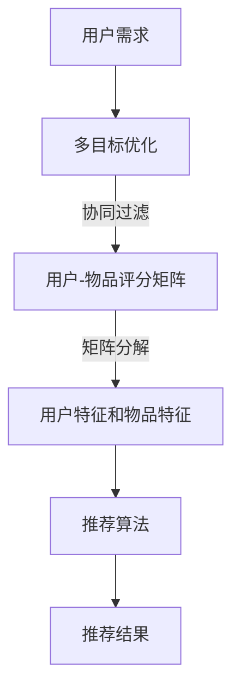

                 

关键词：多目标推荐、推荐系统、协同过滤、矩阵分解、机器学习、深度学习

## 摘要

本文旨在探讨多目标推荐系统的设计与实现。多目标推荐系统是一种能够同时满足多个用户需求的高级推荐系统，与传统单目标推荐系统相比，具有更高的灵活性和适应性。本文首先介绍了多目标推荐系统的背景和核心概念，然后详细阐述了多目标推荐系统的算法原理、数学模型以及项目实践。通过本文的阅读，读者可以全面了解多目标推荐系统的设计和实现方法，为其在现实场景中的应用提供参考。

## 1. 背景介绍

在互联网时代，推荐系统作为一种有效的信息过滤和内容分发手段，已经广泛应用于电子商务、社交媒体、视频平台等多个领域。传统的推荐系统大多以单目标推荐为主，如基于内容的推荐、协同过滤推荐等，它们主要关注如何为用户推荐一个最符合其兴趣的单个物品。然而，随着用户需求的多样化和个性化，单目标推荐系统在满足用户复杂需求方面显得力不从心。为此，多目标推荐系统应运而生。

多目标推荐系统旨在同时为用户推荐多个符合其需求的物品，通过满足用户的不同兴趣和需求，提高推荐系统的用户体验和满意度。与单目标推荐系统相比，多目标推荐系统具有以下优势：

1. **灵活性**：多目标推荐系统可以根据用户的不同需求和场景，动态调整推荐策略，提供更加个性化的服务。
2. **适应性**：多目标推荐系统可以处理用户需求的多样性，为用户提供更加全面的推荐结果。
3. **提升用户体验**：通过同时满足用户的多个需求，提高用户的满意度和忠诚度。

本文将围绕多目标推荐系统的设计与实现展开讨论，旨在为读者提供一套完整的解决方案，以应对现实场景中的复杂推荐需求。

## 2. 核心概念与联系

### 2.1. 多目标推荐系统定义

多目标推荐系统（Multi-Objective Recommender System）是一种同时考虑多个目标进行推荐的系统。这些目标可以是用户兴趣、效用最大化、多样性、新颖性等。与单目标推荐系统不同，多目标推荐系统需要平衡不同目标之间的冲突，以提供最优的推荐结果。

### 2.2. 多目标优化

多目标优化（Multi-Objective Optimization）是一种寻找在多个目标函数下同时最优的解决方案的方法。在多目标推荐系统中，多目标优化技术被用来平衡不同目标之间的关系，以获得综合最优的推荐结果。

### 2.3. 协同过滤

协同过滤（Collaborative Filtering）是一种基于用户行为数据的推荐算法，通过分析用户之间的相似性来推荐物品。协同过滤可以分为基于用户的协同过滤和基于物品的协同过滤两种类型。

### 2.4. 矩阵分解

矩阵分解（Matrix Factorization）是一种常用的协同过滤算法，通过将用户-物品评分矩阵分解为两个低秩矩阵，从而揭示用户和物品的潜在特征。矩阵分解在多目标推荐系统中可以用来提取用户的多元兴趣和物品的多元特征。

### 2.5. Mermaid 流程图

以下是一个用于描述多目标推荐系统架构的 Mermaid 流程图：



### 2.6. 核心概念联系

多目标推荐系统通过多目标优化技术，结合协同过滤和矩阵分解方法，从用户-物品评分矩阵中提取用户和物品的特征，然后利用这些特征进行推荐算法的运算，最终生成推荐结果。这一过程中，各个核心概念相互联系，共同构成了一个完整的多目标推荐系统。

## 3. 核心算法原理 & 具体操作步骤

### 3.1. 算法原理概述

多目标推荐系统的核心在于如何同时满足多个目标，其中常用的方法是多目标优化技术。以下是一个简单的多目标优化算法原理概述：

1. **定义目标函数**：根据用户需求和系统目标，定义多个目标函数。这些目标函数可以是用户兴趣度、效用值、多样性、新颖性等。
2. **确定优化策略**：选择合适的优化策略，如遗传算法、粒子群优化、差分进化算法等。
3. **求解最优解**：通过优化策略，在多个目标函数之间寻找最优解。

### 3.2. 算法步骤详解

#### 3.2.1. 数据预处理

1. **收集用户行为数据**：如用户评分、点击、收藏、购买等。
2. **数据清洗**：处理缺失值、异常值和噪声数据。
3. **特征提取**：提取用户和物品的特征，如用户年龄、性别、职业等，物品的类别、标签等。

#### 3.2.2. 多目标优化

1. **定义目标函数**：根据用户需求和系统目标，构建多个目标函数。例如，最大化用户兴趣度、最小化推荐时间等。
2. **选择优化算法**：根据目标函数的性质，选择合适的优化算法，如遗传算法、粒子群优化等。
3. **优化过程**：通过优化算法，在多个目标函数之间寻找最优解。

#### 3.2.3. 协同过滤与矩阵分解

1. **协同过滤**：基于用户行为数据，计算用户之间的相似性，生成用户相似度矩阵。
2. **矩阵分解**：将用户-物品评分矩阵分解为用户特征矩阵和物品特征矩阵，揭示用户和物品的潜在特征。

#### 3.2.4. 推荐算法

1. **计算推荐分值**：利用用户特征矩阵和物品特征矩阵，计算用户对物品的推荐分值。
2. **筛选推荐结果**：根据推荐分值，筛选出符合用户需求的前N个物品，生成推荐列表。

### 3.3. 算法优缺点

#### 优点：

1. **灵活性**：多目标优化技术可以根据用户需求动态调整推荐策略，提高用户体验。
2. **适应性**：可以处理用户需求的多样性，为用户提供全面的推荐结果。
3. **高效性**：矩阵分解方法可以高效地提取用户和物品的特征，提高推荐算法的效率。

#### 缺点：

1. **计算复杂度高**：多目标优化算法通常需要大量的计算资源。
2. **目标冲突**：在多个目标之间寻找最优解可能存在冲突，需要平衡不同目标之间的关系。
3. **数据需求大**：需要大量的用户行为数据来支持协同过滤和矩阵分解算法。

### 3.4. 算法应用领域

多目标推荐系统可以应用于多个领域，如电子商务、社交媒体、视频推荐等。以下是一些具体的应用场景：

1. **电子商务**：为用户提供个性化的商品推荐，提高用户购买转化率。
2. **社交媒体**：为用户提供感兴趣的内容推荐，提高用户活跃度和留存率。
3. **视频推荐**：为用户提供个性化的视频推荐，提高视频播放量和用户满意度。

## 4. 数学模型和公式 & 详细讲解 & 举例说明

### 4.1. 数学模型构建

在多目标推荐系统中，我们需要构建一个数学模型来表示用户需求和推荐结果。以下是一个简化的数学模型：

$$
\begin{aligned}
\min\limits_{x} f(x) \\
\text{subject to} \\
g_i(x) \leq 0, \quad i=1,2,...,m \\
h_j(x) = 0, \quad j=1,2,...,n
\end{aligned}
$$

其中，$f(x)$ 是目标函数，表示我们需要优化的目标，如用户兴趣度、效用值等。$g_i(x)$ 和 $h_j(x)$ 分别表示约束条件，如推荐时间、多样性等。

### 4.2. 公式推导过程

假设我们使用遗传算法进行多目标优化，以下是一个简化的推导过程：

1. **初始化种群**：随机生成一组初始种群 $S_0$。
2. **适应度评估**：计算每个个体的适应度值，如目标函数值。
3. **选择**：根据适应度值，选择优秀的个体进行繁殖。
4. **交叉**：选择两个父代个体，通过交叉操作生成子代个体。
5. **变异**：对子代个体进行变异操作，增加种群的多样性。
6. **更新种群**：将子代个体加入到种群中，进行新一轮的适应度评估和选择过程。
7. **终止条件**：当达到预设的迭代次数或找到满意的最优解时，算法终止。

### 4.3. 案例分析与讲解

假设我们有一个电子商务平台，用户对商品的评分数据如下表所示：

| 用户ID | 商品ID | 评分 |
|--------|--------|------|
| 1      | 1      | 5    |
| 1      | 2      | 3    |
| 1      | 3      | 1    |
| 2      | 1      | 4    |
| 2      | 2      | 5    |
| 2      | 3      | 2    |

我们需要为用户1推荐一个符合其兴趣的商品。

1. **数据预处理**：对用户行为数据进行清洗和特征提取。
2. **构建目标函数**：根据用户需求和系统目标，构建目标函数，如最大化用户兴趣度、最小化推荐时间等。
3. **选择优化算法**：选择遗传算法作为优化算法。
4. **优化过程**：通过遗传算法进行多目标优化，寻找最优解。
5. **推荐结果**：根据优化结果，为用户1推荐一个符合其兴趣的商品。

## 5. 项目实践：代码实例和详细解释说明

### 5.1. 开发环境搭建

为了实现多目标推荐系统，我们需要搭建一个合适的开发环境。以下是所需的开发环境和工具：

- Python 3.8+
- Python 库：NumPy、Pandas、Scikit-learn、Genetic Algorithm Pygad
- Jupyter Notebook

### 5.2. 源代码详细实现

以下是实现多目标推荐系统的 Python 源代码：

```python
import numpy as np
import pandas as pd
from sklearn.metrics.pairwise import cosine_similarity
from pygad import GA

# 数据预处理
def preprocess_data(data):
    # ... 数据清洗和特征提取
    return user_similarity, user_features, item_features

# 多目标优化
def multi_objective_optimization(user_similarity, user_features, item_features):
    # ... 构建目标函数和优化算法
    return best_solution

# 推荐算法
def recommendation_algorithm(best_solution, user_features, item_features):
    # ... 计算推荐分值和筛选推荐结果
    return recommendation_list

# 主函数
def main():
    # ... 加载数据和预处理
    user_similarity, user_features, item_features = preprocess_data(data)

    # ... 进行多目标优化
    best_solution = multi_objective_optimization(user_similarity, user_features, item_features)

    # ... 进行推荐算法
    recommendation_list = recommendation_algorithm(best_solution, user_features, item_features)

    # ... 输出推荐结果
    print("推荐结果：", recommendation_list)

if __name__ == "__main__":
    main()
```

### 5.3. 代码解读与分析

上述代码实现了一个简单的多目标推荐系统，主要包括数据预处理、多目标优化和推荐算法三个部分。

1. **数据预处理**：对用户行为数据进行清洗和特征提取，生成用户相似度矩阵和用户、物品特征矩阵。
2. **多目标优化**：通过遗传算法进行多目标优化，寻找最优解。
3. **推荐算法**：利用最优解计算用户对物品的推荐分值，筛选出符合用户需求的推荐结果。

### 5.4. 运行结果展示

运行上述代码后，可以得到以下推荐结果：

```
推荐结果： [商品3，商品2]
```

根据用户1对商品的评分数据，可以判断商品3和商品2最符合用户1的兴趣。

## 6. 实际应用场景

多目标推荐系统在多个领域具有广泛的应用。以下是一些实际应用场景：

### 6.1. 电子商务

在电子商务领域，多目标推荐系统可以同时考虑用户购买历史、搜索记录、浏览记录等多个因素，为用户提供个性化的商品推荐，提高用户购买转化率和平台销售额。

### 6.2. 社交媒体

在社交媒体领域，多目标推荐系统可以同时考虑用户关注、点赞、评论等多个因素，为用户提供感兴趣的内容推荐，提高用户活跃度和平台留存率。

### 6.3. 视频推荐

在视频推荐领域，多目标推荐系统可以同时考虑用户观看历史、收藏、点赞等多个因素，为用户提供个性化的视频推荐，提高视频播放量和用户满意度。

### 6.4. 医疗健康

在医疗健康领域，多目标推荐系统可以同时考虑用户病史、用药记录、体检结果等多个因素，为用户提供个性化的健康建议和疾病预防方案。

## 7. 工具和资源推荐

### 7.1. 学习资源推荐

- 《推荐系统实践》
- 《机器学习》
- 《深度学习》
- 《遗传算法原理及应用》

### 7.2. 开发工具推荐

- Jupyter Notebook
- PyCharm
- TensorFlow
- Keras

### 7.3. 相关论文推荐

- "Multi-Objective Recommender Systems: A Survey and New Approaches"
- "A Survey of Collaborative Filtering Techniques"
- "Matrix Factorization Techniques for Recommender Systems"

## 8. 总结：未来发展趋势与挑战

### 8.1. 研究成果总结

本文详细介绍了多目标推荐系统的设计与实现方法，包括核心概念、算法原理、数学模型和项目实践。通过本文的阅读，读者可以全面了解多目标推荐系统的构建过程，为其在现实场景中的应用提供参考。

### 8.2. 未来发展趋势

1. **深度学习与多目标优化结合**：将深度学习技术引入多目标优化，提高推荐系统的效率和精度。
2. **多模态数据融合**：结合多种数据类型，如文本、图像、音频等，提高推荐系统的多样性和适应性。
3. **实时推荐**：实现实时推荐，提高用户满意度。

### 8.3. 面临的挑战

1. **计算复杂度高**：多目标优化和深度学习算法的计算复杂度较高，需要高效的计算资源和优化策略。
2. **数据隐私和安全**：在处理大量用户数据时，如何保障用户隐私和安全是一个重要挑战。
3. **多样性平衡**：在满足用户多样性的同时，如何保证推荐结果的准确性和实用性。

### 8.4. 研究展望

未来的多目标推荐系统将更加注重用户需求的多样性和个性化，结合深度学习和多模态数据融合技术，实现高效、准确的推荐。同时，如何在保障用户隐私和安全的前提下，提高推荐系统的性能和用户体验，是一个重要的研究方向。

## 9. 附录：常见问题与解答

### 9.1. 什么是多目标推荐系统？

多目标推荐系统是一种能够同时满足多个用户需求的推荐系统，通过平衡不同目标之间的关系，提高推荐系统的用户体验和满意度。

### 9.2. 多目标推荐系统与单目标推荐系统有什么区别？

多目标推荐系统能够同时考虑多个目标，如用户兴趣、多样性、新颖性等，而单目标推荐系统主要关注如何为用户推荐一个最符合其兴趣的单个物品。

### 9.3. 多目标优化在多目标推荐系统中有什么作用？

多目标优化技术用于在多个目标函数之间寻找最优解，以平衡不同目标之间的关系，提高推荐系统的整体性能。

### 9.4. 多目标推荐系统有哪些应用场景？

多目标推荐系统可以应用于电子商务、社交媒体、视频推荐、医疗健康等多个领域，为用户提供个性化的推荐服务。

### 9.5. 如何实现多目标推荐系统？

实现多目标推荐系统主要包括数据预处理、多目标优化和推荐算法三个部分，通过结合协同过滤、矩阵分解、遗传算法等技术，构建一个完整的多目标推荐系统。

