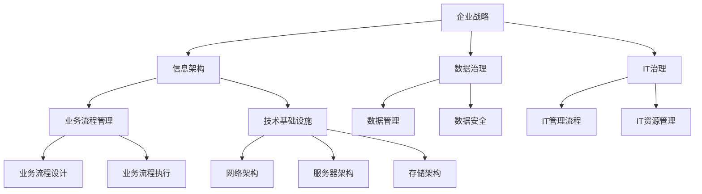

                 

### 关键词 Keywords

- 大型企业
- 信息化
- 策划
- 组织
- 架构
- 开发
- 管理

### 摘要 Summary

本文旨在探讨大型企业在信息化过程中如何进行策划、组织、架构、开发和管理的有效实践。文章首先介绍了信息化背景及重要性，随后详细阐述了信息化策划的核心要素，分析了信息化组织与架构设计的关键原则。接着，文章深入探讨了信息化开发过程中的技术选择与实践，以及信息化管理中团队协作与风险管理的方法。最后，文章展望了大型企业信息化未来的发展趋势和面临的挑战。

## 1. 背景介绍

在当今数字化时代，信息化已经成为企业发展的关键驱动力。随着互联网、云计算、大数据、物联网等新兴技术的迅猛发展，企业信息化的需求越来越强烈。信息化不仅有助于提升企业的运营效率，还能为企业提供更准确的市场洞察力和决策支持。特别是在大型企业中，信息化是实现业务流程优化、资源整合和创新能力提升的重要手段。

### 1.1 信息化的重要性

信息化对大型企业的重要性主要体现在以下几个方面：

1. **提升运营效率**：通过信息化手段，企业可以实现对业务流程的自动化和优化，减少人力成本，提高工作效率。
2. **增强决策支持**：信息化系统能够为企业提供实时的数据分析和报告，帮助决策者做出更加科学的决策。
3. **提高客户满意度**：信息化系统可以改善客户服务体验，提升客户满意度和忠诚度。
4. **促进创新**：信息化为企业提供了创新的平台和工具，有助于企业不断探索和实现新的商业模式。

### 1.2 信息化的发展历程

信息化的发展历程可以分为以下几个阶段：

1. **传统信息化**：这一阶段主要是通过建立简单的业务管理系统来提高工作效率。
2. **集成信息化**：企业开始整合不同业务系统的数据，实现信息共享和业务协同。
3. **智能信息化**：利用人工智能、大数据等技术实现智能分析和决策支持，推动企业向智能化方向转型。

## 2. 核心概念与联系

### 2.1 核心概念

在信息化过程中，以下核心概念至关重要：

1. **信息架构**：信息架构是组织内部信息的结构和关系，决定了信息如何被组织和访问。
2. **数据治理**：数据治理是指管理企业数据的策略、流程和技术，确保数据的准确性、完整性和安全性。
3. **IT治理**：IT治理是指对企业信息技术战略、组织结构、流程和资源的管理，确保信息技术与企业战略目标的契合。
4. **业务流程管理**：业务流程管理是通过对企业业务流程的规范化、自动化和优化，提高业务效率和灵活性。

### 2.2 架构设计

信息化架构设计是信息化过程中的关键环节。以下是一个简化的Mermaid流程图，展示了信息化架构的主要组成部分：



### 2.3 核心概念联系

信息化架构中的各个核心概念相互关联，共同构成了企业信息化体系的整体框架。信息架构为数据治理提供了基础，数据治理确保了IT治理的有效性，IT治理则指导业务流程管理的实施。业务流程管理依赖于技术基础设施的支持，而技术基础设施又需要数据治理和IT治理的保障。

## 3. 核心算法原理 & 具体操作步骤

### 3.1 算法原理概述

在信息化过程中，核心算法的设计和实现至关重要。核心算法原理主要包括：

1. **数据挖掘**：利用统计学、机器学习等方法从大量数据中提取有价值的信息。
2. **数据仓库**：通过数据抽取、转换、加载（ETL）过程，将分散的数据整合到一个统一的数据仓库中。
3. **业务智能**：通过数据分析、数据挖掘等手段，为企业提供业务洞察和决策支持。

### 3.2 算法步骤详解

#### 3.2.1 数据挖掘

数据挖掘的主要步骤包括：

1. **数据预处理**：清洗数据，处理缺失值、异常值等。
2. **特征选择**：选择对挖掘结果有影响的重要特征。
3. **模型构建**：选择合适的算法（如决策树、支持向量机等）构建模型。
4. **模型评估**：评估模型性能，调整参数以提高模型效果。

#### 3.2.2 数据仓库

数据仓库的主要步骤包括：

1. **需求分析**：确定数据仓库所需的数据源、数据量和数据结构。
2. **数据抽取**：从不同数据源抽取数据。
3. **数据转换**：清洗和整合数据，使其符合数据仓库的要求。
4. **数据加载**：将转换后的数据加载到数据仓库中。

#### 3.2.3 业务智能

业务智能的主要步骤包括：

1. **数据获取**：获取企业内部和外部的数据。
2. **数据分析**：利用统计、数据挖掘等方法对数据进行分析。
3. **可视化**：将分析结果以图表、报表等形式展示出来。
4. **决策支持**：根据分析结果，为企业提供决策支持。

### 3.3 算法优缺点

#### 数据挖掘

**优点**：

- **高效性**：能够快速从大量数据中提取有价值的信息。
- **灵活性**：适用于多种数据类型和场景。

**缺点**：

- **数据质量要求高**：数据挖掘依赖于高质量的数据，数据质量直接影响到挖掘结果。
- **算法选择复杂**：需要根据具体场景选择合适的算法，算法的选择和调优过程较为复杂。

#### 数据仓库

**优点**：

- **统一性**：将分散的数据整合到一个统一的数据仓库中，方便数据管理和访问。
- **高效性**：支持高效的数据查询和分析。

**缺点**：

- **建设成本高**：数据仓库的建设和维护需要大量的人力和物力资源。
- **灵活性较差**：数据仓库的设计和实现相对固定，适应新需求的能力较弱。

#### 业务智能

**优点**：

- **直观性**：通过图表、报表等形式，使分析结果更加直观易懂。
- **实时性**：能够提供实时或近实时的数据分析和决策支持。

**缺点**：

- **分析结果的可靠性**：分析结果的可靠性依赖于数据质量和分析方法的准确性。
- **使用门槛较高**：需要具备一定的数据分析能力和工具使用技能。

### 3.4 算法应用领域

#### 数据挖掘

- **市场营销**：通过客户行为数据分析，优化营销策略，提高客户满意度。
- **风险管理**：通过分析历史数据，预测潜在风险，降低风险损失。
- **客户关系管理**：通过分析客户数据，提高客户服务质量，提升客户忠诚度。

#### 数据仓库

- **企业绩效管理**：通过整合各部门数据，对企业的经营绩效进行综合分析。
- **供应链管理**：通过分析供应链数据，优化供应链流程，降低库存成本。
- **人力资源**：通过分析员工数据，优化人力资源配置，提升员工满意度。

#### 业务智能

- **销售预测**：通过分析历史销售数据，预测未来销售趋势，制定销售策略。
- **库存管理**：通过分析库存数据，优化库存水平，降低库存成本。
- **客户行为分析**：通过分析客户行为数据，了解客户需求，提供个性化服务。

## 4. 数学模型和公式 & 详细讲解 & 举例说明

### 4.1 数学模型构建

在信息化过程中，数学模型的应用非常广泛。以下是一个简化的数学模型构建过程：

1. **问题定义**：明确需要解决的问题和目标。
2. **数据收集**：收集与问题相关的数据。
3. **数据预处理**：清洗数据，处理缺失值、异常值等。
4. **特征提取**：选择对问题有影响的特征。
5. **模型构建**：选择合适的算法和公式构建模型。
6. **模型评估**：评估模型性能，调整参数以提高模型效果。

### 4.2 公式推导过程

以线性回归模型为例，推导线性回归模型的公式如下：

1. **假设**：假设模型为 y = wx + b，其中 y 为因变量，x 为自变量，w 为权重，b 为偏置。
2. **损失函数**：选择平方误差损失函数 L(y, y') = (y - y')^2，其中 y' 为预测值。
3. **梯度下降法**：通过梯度下降法求解权重 w 和偏置 b。

   - 计算梯度：∇L(w, b) = [∂L/∂w, ∂L/∂b]
   - 更新参数：w = w - α∇w，b = b - α∇b，其中 α 为学习率。

### 4.3 案例分析与讲解

#### 案例背景

某电商企业希望通过分析用户行为数据，预测用户购买倾向，以便优化营销策略。

#### 数据收集

收集用户在电商平台的行为数据，包括浏览商品种类、浏览时间、购物车添加商品等。

#### 数据预处理

- 处理缺失值：对于缺失值较多的数据，选择删除或填充。
- 处理异常值：对于异常值，可以选择删除或使用插值法处理。

#### 特征提取

选择以下特征：

- 用户年龄
- 用户性别
- 用户职业
- 浏览商品种类
- 浏览时间
- 购物车添加商品种类
- 购物车添加商品数量

#### 模型构建

使用线性回归模型预测用户购买倾向。

#### 模型评估

使用均方误差（MSE）评估模型性能：

MSE = ∑(y - y')^2 / n

其中，y 为实际购买倾向，y' 为预测购买倾向，n 为样本数量。

#### 模型优化

通过调整学习率 α 和特征权重 w，优化模型性能。

## 5. 项目实践：代码实例和详细解释说明

### 5.1 开发环境搭建

1. 安装 Python 解释器，版本要求 Python 3.6 或以上。
2. 安装必要的 Python 库，如 NumPy、Pandas、Scikit-learn 等。

### 5.2 源代码详细实现

以下是线性回归模型的 Python 实现代码：

```python
import numpy as np
import pandas as pd
from sklearn.linear_model import LinearRegression
from sklearn.model_selection import train_test_split

# 数据加载
data = pd.read_csv('user_data.csv')
X = data[['age', 'gender', 'occupation', 'browse_time', 'cart_add_goods_type', 'cart_add_goods_quantity']]
y = data['purchase_tendency']

# 数据预处理
X = X.fillna(X.mean())
y = y.fillna(y.mean())

# 特征提取
X = pd.get_dummies(X)

# 模型构建
model = LinearRegression()
model.fit(X, y)

# 模型评估
X_train, X_test, y_train, y_test = train_test_split(X, y, test_size=0.2, random_state=42)
y_pred = model.predict(X_test)
mse = np.mean((y_pred - y_test) ** 2)
print('MSE:', mse)

# 模型优化
alpha = 0.01
for i in range(100):
    gradients = 2 * (X_test.T.dot(X_test.dot(model.coef_) + model.intercept_ - y_test))
    model.coef_ -= alpha * gradients
    y_pred = model.predict(X_test)
    mse = np.mean((y_pred - y_test) ** 2)
    print(i+1, ':', mse)
```

### 5.3 代码解读与分析

1. **数据加载与预处理**：使用 Pandas 读取数据，并进行缺失值处理。通过 One-Hot 编码将类别特征转换为数值特征。
2. **模型构建**：使用 Scikit-learn 库的线性回归模型进行模型构建。
3. **模型评估**：使用均方误差（MSE）评估模型性能，并打印结果。
4. **模型优化**：使用梯度下降法对模型进行优化，通过迭代调整权重和偏置，降低 MSE。

### 5.4 运行结果展示

运行代码后，打印出模型评估的 MSE 结果。根据结果，可以调整模型参数，优化模型性能。

## 6. 实际应用场景

### 6.1 电商平台用户购买预测

通过分析用户行为数据，预测用户购买倾向，帮助企业优化营销策略，提高销售额。

### 6.2 零售行业库存管理

通过分析销售数据，预测未来销售趋势，优化库存水平，降低库存成本。

### 6.3 金融行业风险管理

通过分析历史交易数据，预测潜在风险，帮助企业降低风险损失。

## 7. 未来应用展望

随着人工智能、大数据等技术的发展，信息化在大型企业中的应用将更加广泛和深入。未来，信息化将实现以下几个方面的突破：

### 7.1 智能化

利用人工智能技术，实现自动化决策和智能推荐，提高企业的运营效率和客户满意度。

### 7.2 个性化

通过个性化数据分析，为客户提供更加精准的服务和产品推荐，提升客户体验。

### 7.3 网络化

构建企业内部和外部的信息网络，实现实时数据共享和业务协同，提高企业的竞争力。

### 7.4 安全化

加强信息安全保障，防止数据泄露和恶意攻击，确保企业信息的安全和稳定。

## 8. 工具和资源推荐

### 8.1 学习资源推荐

- 《大数据技术导论》
- 《深度学习》
- 《机器学习实战》

### 8.2 开发工具推荐

- Jupyter Notebook
- PyCharm
- Visual Studio Code

### 8.3 相关论文推荐

- “Deep Learning for Time Series Classification: A Review”
- “Big Data: A Survey”
- “Recurrent Neural Networks for Scalable Language Modeling”

## 9. 总结：未来发展趋势与挑战

### 9.1 研究成果总结

本文对大型企业信息化过程中的策划、组织、架构、开发和管理的实践进行了深入探讨，总结了信息化算法原理、数学模型和实际应用场景。

### 9.2 未来发展趋势

未来，信息化将向智能化、个性化、网络化和安全化方向发展，为企业提供更加高效、精准和安全的解决方案。

### 9.3 面临的挑战

在信息化过程中，企业将面临数据质量、算法选择、模型优化等方面的挑战。需要持续学习和创新，不断提高信息化水平和能力。

### 9.4 研究展望

未来，信息化研究将更加注重跨学科融合、技术创新和实际应用，推动企业向智能化和数字化转型。

## 10. 附录：常见问题与解答

### 10.1 信息化与数字化有什么区别？

信息化主要是指企业利用信息技术实现业务流程的优化和资源整合，而数字化则是指将企业的一切活动都转化为数字化的形式，实现全方位的数据化和智能化。

### 10.2 信息化过程中的数据质量如何保障？

数据质量保障可以从以下几个方面进行：

- 数据采集：确保数据的准确性、完整性和一致性。
- 数据存储：选择合适的数据库管理系统，确保数据的安全性和可靠性。
- 数据清洗：定期对数据进行清洗，处理缺失值、异常值等。
- 数据治理：建立健全的数据治理体系，规范数据管理流程。

### 10.3 如何选择合适的算法？

选择合适的算法需要考虑以下几个方面：

- 数据类型：根据数据类型选择合适的算法，如分类问题可以选择决策树、支持向量机等。
- 数据量：对于大量数据，选择计算效率较高的算法。
- 目标问题：根据目标问题的性质选择合适的算法，如预测问题可以选择线性回归、神经网络等。
- 实际场景：结合实际场景，考虑算法的可解释性和适用性。

### 10.4 信息化项目的风险管理如何进行？

信息化项目的风险管理可以从以下几个方面进行：

- 风险识别：识别项目中可能出现的风险，如技术风险、时间风险、成本风险等。
- 风险评估：评估风险的可能性和影响程度，确定风险优先级。
- 风险应对：制定相应的风险应对策略，如风险规避、风险减轻、风险承担等。
- 风险监控：实时监控项目进展，及时调整风险应对策略。

### 10.5 如何进行信息化项目的团队协作？

进行信息化项目的团队协作可以从以下几个方面进行：

- 明确职责：明确项目团队成员的职责和任务，确保各项工作有序进行。
- 沟通协调：建立有效的沟通渠道，确保团队成员之间的信息畅通。
- 协同工具：使用协同工具（如 Slack、Trello 等），提高团队协作效率。
- 团队文化：建立积极向上的团队文化，鼓励成员互相支持和合作。

### 10.6 如何进行信息化项目的项目管理？

信息化项目的项目管理可以从以下几个方面进行：

- 项目计划：制定详细的项目计划，明确项目目标、进度、资源等。
- 项目执行：按照项目计划，执行项目任务，确保项目进展顺利。
- 项目监控：实时监控项目进度、成本、质量等，及时发现问题并调整。
- 项目收尾：进行项目总结和评估，总结经验教训，为后续项目提供参考。

### 10.7 如何评估信息化项目的成效？

信息化项目的成效可以从以下几个方面进行评估：

- 项目目标实现情况：评估项目是否达到预期目标。
- 业务流程优化情况：评估项目对业务流程的优化程度。
- 效率提升情况：评估项目对工作效率的提升情况。
- 成本降低情况：评估项目对成本的降低程度。
- 客户满意度：评估项目对客户满意度的影响。

### 10.8 如何应对信息化项目的变更需求？

应对信息化项目的变更需求可以从以下几个方面进行：

- 变更控制：建立变更控制流程，确保变更的合理性和可控性。
- 变更评估：评估变更对项目进度、成本、质量等方面的影响。
- 变更管理：制定变更管理计划，确保变更的顺利实施。
- 变更沟通：与项目相关方进行有效沟通，确保变更信息的畅通。

