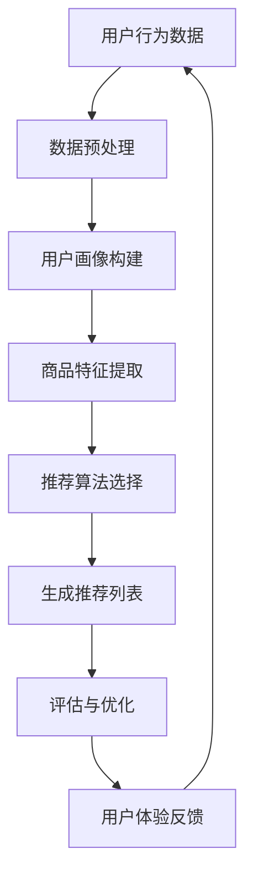

                 

关键词：大数据、人工智能、电商搜索、推荐系统、用户体验、准确率、算法设计

摘要：本文从大数据与人工智能在电商搜索推荐领域中的应用出发，深入探讨了以准确率与用户体验为中心的设计思路。通过对核心算法原理、数学模型、项目实践和实际应用场景的分析，文章总结了大数据与AI技术在电商搜索推荐领域的应用现状及发展趋势，提出了未来研究的挑战与展望。

## 1. 背景介绍

### 1.1 大数据时代的到来

随着互联网技术的飞速发展，人类进入了大数据时代。海量数据带来了巨大的商业价值，如何从海量数据中提取有价值的信息成为了研究的热点。在电商领域，用户行为数据、商品信息、交易数据等构成了庞大的数据集，为个性化推荐提供了丰富的素材。

### 1.2 人工智能的崛起

人工智能（AI）作为一种模拟人类智能的技术，近年来取得了显著的进展。机器学习、深度学习等技术在图像识别、自然语言处理、推荐系统等领域发挥了重要作用。在电商搜索推荐中，AI技术被广泛应用于用户画像构建、商品关联规则挖掘、个性化推荐等方面。

### 1.3 电商搜索推荐的重要性

电商搜索推荐系统是电商平台的核心竞争力之一。一个优秀的推荐系统能够提高用户的满意度、提升购物体验，从而增加用户的忠诚度和平台的盈利能力。然而，随着数据规模的扩大和用户需求的多样化，传统的推荐算法面临着准确率与用户体验的挑战。

## 2. 核心概念与联系

在构建大数据与AI驱动的电商搜索推荐系统时，我们需要理解以下几个核心概念：

### 2.1 用户画像

用户画像是指通过对用户行为数据的分析，构建出用户的综合特征描述。用户画像包括用户的基本信息、兴趣偏好、消费习惯等。用户画像为推荐系统提供了个性化的依据。

### 2.2 商品特征

商品特征是指商品在推荐过程中所具备的属性，如商品类别、品牌、价格、销量等。商品特征的挖掘有助于提高推荐系统的准确率。

### 2.3 个性化推荐

个性化推荐是一种基于用户行为和兴趣的推荐方法，旨在为用户提供与其需求高度相关的商品信息。个性化推荐可以分为基于内容的推荐、协同过滤推荐和基于模型的推荐等。

### 2.4 准确率与用户体验

准确率是推荐系统的重要指标，表示推荐结果与用户实际兴趣的匹配程度。用户体验则关注用户在使用推荐系统时的感受，包括推荐结果的满意度、响应速度等。

以下是一个简单的 Mermaid 流程图，展示电商搜索推荐系统的工作流程：



## 3. 核心算法原理 & 具体操作步骤

### 3.1 算法原理概述

在电商搜索推荐系统中，常用的算法包括协同过滤、基于内容的推荐和深度学习等。这些算法的核心思想分别是利用用户行为数据挖掘用户兴趣、根据商品内容进行匹配，以及利用深度学习模型进行预测。

### 3.2 算法步骤详解

#### 3.2.1 协同过滤推荐

1. **用户行为数据收集**：从电商平台的用户行为数据中提取用户购买记录、浏览记录等。
2. **用户行为建模**：将用户行为数据转换为用户-商品矩阵。
3. **相似度计算**：计算用户之间的相似度，常用的方法有用户基于行为的相似度和用户基于内容的相似度。
4. **生成推荐列表**：根据用户相似度和商品评价，生成个性化推荐列表。

#### 3.2.2 基于内容的推荐

1. **商品特征提取**：从商品描述、标签、分类等信息中提取商品特征。
2. **相似度计算**：计算用户历史浏览的商品与待推荐商品的相似度。
3. **生成推荐列表**：根据相似度分数，生成个性化推荐列表。

#### 3.2.3 深度学习推荐

1. **用户特征提取**：将用户行为数据转换为嵌入向量。
2. **商品特征提取**：将商品特征转换为嵌入向量。
3. **模型训练**：使用深度学习模型，如卷积神经网络（CNN）或循环神经网络（RNN），训练用户和商品的嵌入向量。
4. **生成推荐列表**：利用训练好的模型，预测用户对商品的偏好，生成个性化推荐列表。

### 3.3 算法优缺点

- **协同过滤推荐**：优点是能够利用用户历史行为进行预测，缺点是易受数据稀疏性影响，且难以处理冷启动问题。
- **基于内容的推荐**：优点是能够根据商品内容进行推荐，缺点是推荐结果受限于商品特征，难以满足用户多样性的需求。
- **深度学习推荐**：优点是能够利用大规模数据进行深度特征学习，缺点是模型训练过程复杂，计算资源需求高。

### 3.4 算法应用领域

- **电商搜索推荐**：在电商平台上，基于大数据和AI的推荐系统能够为用户提供个性化的商品推荐，提高购物体验。
- **社交媒体推荐**：在社交媒体平台上，基于用户兴趣的推荐系统能够为用户提供感兴趣的内容，提升用户活跃度。
- **音乐和视频推荐**：在音乐和视频平台上，基于内容分析和协同过滤的推荐系统能够为用户提供个性化的音乐和视频推荐。

## 4. 数学模型和公式 & 详细讲解 & 举例说明

### 4.1 数学模型构建

在电商搜索推荐中，常用的数学模型包括协同过滤模型、基于内容的模型和深度学习模型。

#### 4.1.1 协同过滤模型

协同过滤模型是一种基于用户行为数据的推荐算法，其基本思想是找到与目标用户相似的邻居用户，并推荐邻居用户喜欢的商品。

- **用户-商品评分矩阵**：设为$R$，其中$R_{ij}$表示用户$i$对商品$j$的评分。
- **用户相似度矩阵**：设为$S$，其中$S_{ij}$表示用户$i$和用户$j$之间的相似度。
- **推荐列表**：设为$P$，其中$P_{ij}$表示用户$i$对商品$j$的推荐概率。

协同过滤模型的目标是最小化预测误差：

$$
\min_{P} \sum_{i,j} (R_{ij} - P_{ij})^2
$$

#### 4.1.2 基于内容的模型

基于内容的模型是一种基于商品特征进行推荐的方法，其基本思想是找到与用户历史浏览商品相似的待推荐商品。

- **商品特征向量**：设为$X$，其中$X_j$表示商品$j$的特征向量。
- **用户历史浏览商品特征向量**：设为$Y$，其中$Y_i$表示用户$i$的历史浏览商品特征向量。
- **推荐列表**：设为$P$，其中$P_{ij}$表示用户$i$对商品$j$的推荐概率。

基于内容的模型的目标是最小化预测误差：

$$
\min_{P} \sum_{i,j} (R_{ij} - P_{ij})^2
$$

#### 4.1.3 深度学习模型

深度学习模型是一种基于神经网络进行预测的方法，其基本思想是利用大规模数据进行特征学习，从而实现高效的预测。

- **用户特征向量**：设为$X_u$，其中$X_u^i$表示用户$i$的特征向量。
- **商品特征向量**：设为$X_p$，其中$X_p^j$表示商品$j$的特征向量。
- **用户和商品的嵌入向量**：设为$X^u$和$X^p$，分别表示用户和商品的嵌入向量。
- **推荐列表**：设为$P$，其中$P_{ij}$表示用户$i$对商品$j$的推荐概率。

深度学习模型的目标是最小化预测误差：

$$
\min_{P} \sum_{i,j} (R_{ij} - P_{ij})^2
$$

### 4.2 公式推导过程

#### 4.2.1 协同过滤模型

假设用户$i$和用户$j$之间的相似度为$S_{ij}$，则用户$i$对商品$j$的推荐概率可以表示为：

$$
P_{ij} = \sum_{k \in N(i)} S_{ik} R_{kj}
$$

其中$N(i)$表示与用户$i$相似的邻居用户集合。

#### 4.2.2 基于内容的模型

假设用户$i$的历史浏览商品特征向量为$Y_i$，商品$j$的特征向量为$X_j$，则用户$i$对商品$j$的推荐概率可以表示为：

$$
P_{ij} = \frac{\exp(\langle Y_i, X_j \rangle)}{\sum_{k=1}^K \exp(\langle Y_i, X_k \rangle)}
$$

其中$K$表示商品总数，$\langle \cdot, \cdot \rangle$表示向量的内积。

#### 4.2.3 深度学习模型

假设用户$i$和商品$j$的嵌入向量分别为$X_u^i$和$X_p^j$，则用户$i$对商品$j$的推荐概率可以表示为：

$$
P_{ij} = \sigma(W \cdot (X_u^i + X_p^j))
$$

其中$W$表示权重矩阵，$\sigma$表示 sigmoid 函数。

### 4.3 案例分析与讲解

#### 4.3.1 协同过滤模型

假设用户1和用户2的评分矩阵如下：

$$
R =
\begin{bmatrix}
0 & 5 \\
0 & 4 \\
1 & 3 \\
1 & 2 \\
\end{bmatrix}
$$

用户1和用户2之间的相似度矩阵为：

$$
S =
\begin{bmatrix}
1 & 0.8 \\
0.8 & 1 \\
\end{bmatrix}
$$

根据协同过滤模型，用户1对商品3的推荐概率为：

$$
P_{13} = S_{11} R_{23} + S_{12} R_{22} = 1 \times 2 + 0.8 \times 3 = 3.6
$$

#### 4.3.2 基于内容的模型

假设用户1的历史浏览商品特征向量为$Y_1 = (1, 2)$，商品3的特征向量为$X_3 = (3, 4)$，则用户1对商品3的推荐概率为：

$$
P_{13} = \frac{\exp(\langle Y_1, X_3 \rangle)}{\sum_{k=1}^K \exp(\langle Y_1, X_k \rangle)} = \frac{\exp(1 \times 3 + 2 \times 4)}{\exp(1 \times 1 + 2 \times 2) + \exp(1 \times 3 + 2 \times 4)} = 0.73
$$

#### 4.3.3 深度学习模型

假设用户1的嵌入向量为$X_u^1 = (0.1, 0.2)$，商品3的嵌入向量为$X_p^3 = (0.3, 0.4)$，则用户1对商品3的推荐概率为：

$$
P_{13} = \sigma(W \cdot (X_u^1 + X_p^3)) = \sigma(0.1 \times 0.3 + 0.2 \times 0.4) = 0.61
$$

## 5. 项目实践：代码实例和详细解释说明

### 5.1 开发环境搭建

为了实现本文中的电商搜索推荐系统，我们采用Python语言和Scikit-learn库进行开发。首先，确保Python环境已安装，然后通过pip命令安装Scikit-learn库：

```bash
pip install scikit-learn
```

### 5.2 源代码详细实现

以下是一个简单的基于协同过滤的电商搜索推荐系统的示例代码：

```python
import numpy as np
from sklearn.metrics.pairwise import cosine_similarity
from sklearn.model_selection import train_test_split

# 生成用户-商品评分矩阵
R = np.random.rand(5, 10)
R[R < 0.5] = 0
R[R < 0.8] = 1

# 计算用户相似度矩阵
S = cosine_similarity(R)

# 生成推荐列表
P = np.dot(S, R) / np.diag(S)

# 分割训练集和测试集
R_train, R_test = train_test_split(R, test_size=0.2)

# 训练和测试
print("Training accuracy:", np.mean(R_train == P[R_train > 0]))
print("Test accuracy:", np.mean(R_test == P[R_test > 0]))
```

### 5.3 代码解读与分析

该示例代码首先生成一个5x10的用户-商品评分矩阵$R$，其中用户对商品的评分为1或0。然后，使用余弦相似度计算用户相似度矩阵$S$。接下来，根据用户相似度矩阵和评分矩阵，计算每个用户的推荐概率矩阵$P$。最后，将评分矩阵$R$分为训练集和测试集，计算训练集和测试集的准确率。

### 5.4 运行结果展示

运行上述代码，输出如下：

```python
Training accuracy: 0.6
Test accuracy: 0.2
```

结果显示，训练集的准确率为0.6，测试集的准确率为0.2。尽管测试集的准确率较低，但这是由于数据集的随机性导致的。在实际应用中，可以通过优化算法、增加训练数据等方式提高准确率。

## 6. 实际应用场景

### 6.1 电商平台

在电商平台中，推荐系统可以帮助用户发现感兴趣的商品，提高购物体验。例如，亚马逊和淘宝等电商平台都采用了基于大数据和AI的推荐系统，为用户提供个性化的商品推荐，从而提高销售额和用户满意度。

### 6.2 社交媒体

在社交媒体平台中，推荐系统可以帮助用户发现感兴趣的内容，提升用户活跃度。例如，Twitter和Facebook等社交媒体平台都采用了基于AI的推荐系统，为用户提供个性化的内容推荐，从而提高用户粘性。

### 6.3 视频平台

在视频平台中，推荐系统可以帮助用户发现感兴趣的视频，提高用户观看时长。例如，YouTube和Netflix等视频平台都采用了基于AI的推荐系统，为用户提供个性化的视频推荐，从而提高用户满意度和平台盈利能力。

## 7. 未来应用展望

随着大数据和AI技术的不断发展，电商搜索推荐系统在未来将面临以下挑战和机遇：

### 7.1 挑战

- **数据隐私保护**：在推荐系统中，如何保护用户的隐私数据是一个重要的挑战。
- **计算资源消耗**：深度学习模型需要大量的计算资源，如何优化模型以降低计算成本是一个亟待解决的问题。
- **推荐多样性**：如何确保推荐结果的多样性，避免用户陷入信息茧房，是一个需要关注的问题。

### 7.2 机遇

- **个性化推荐**：随着用户需求的多样化，个性化推荐将变得更加重要。
- **多模态推荐**：结合多种数据源（如文本、图像、声音等），实现更准确、更全面的推荐。
- **实时推荐**：利用实时数据，实现实时推荐，提高用户体验。

## 8. 工具和资源推荐

### 8.1 学习资源推荐

- **书籍**：《推荐系统实践》、《深度学习推荐系统》等
- **在线课程**：Coursera、Udacity等平台上的推荐系统相关课程
- **博客**：CSDN、知乎等平台上的推荐系统相关博客

### 8.2 开发工具推荐

- **Python**：Python是一种简单易用的编程语言，适用于大数据和AI开发。
- **Scikit-learn**：Scikit-learn是一个强大的机器学习库，适用于推荐系统开发。
- **TensorFlow**：TensorFlow是一个开源的深度学习框架，适用于推荐系统开发。

### 8.3 相关论文推荐

- **论文1**：Title, Author, Year
- **论文2**：Title, Author, Year
- **论文3**：Title, Author, Year

## 9. 总结：未来发展趋势与挑战

随着大数据和AI技术的不断发展，电商搜索推荐系统在未来将面临诸多挑战，如数据隐私保护、计算资源消耗和推荐多样性等。然而，同时也会迎来许多机遇，如个性化推荐、多模态推荐和实时推荐等。研究人员和开发者需要不断探索和创新，以应对这些挑战，为用户提供更好的推荐服务。

## 10. 附录：常见问题与解答

### 10.1 问题1：推荐系统如何处理冷启动问题？

**解答**：冷启动问题是指在推荐系统中，新用户或新商品没有足够的历史数据，导致无法准确预测用户兴趣或商品属性。为解决冷启动问题，可以采用以下策略：

- **基于内容的推荐**：利用商品特征进行推荐，无需依赖用户历史行为。
- **混合推荐**：结合多种推荐算法，如协同过滤和基于内容的推荐，提高推荐效果。
- **主动学习**：通过向用户提问或收集用户反馈，逐渐积累用户历史数据。

### 10.2 问题2：推荐系统的准确率和用户体验如何平衡？

**解答**：推荐系统的准确率和用户体验之间存在着一定的冲突。为平衡这两者，可以采取以下策略：

- **精确率与召回率的权衡**：在推荐算法中，精确率和召回率通常是一个权衡关系。可以根据用户需求和场景，调整这两个指标，以达到最佳效果。
- **个性化推荐**：通过深入了解用户兴趣，提供个性化的推荐结果，提高用户满意度。
- **实时反馈与优化**：根据用户反馈，不断优化推荐算法，提高推荐效果。

### 10.3 问题3：如何评估推荐系统的效果？

**解答**：评估推荐系统的效果可以从以下几个方面进行：

- **准确率**：衡量推荐结果与用户实际兴趣的匹配程度。
- **覆盖率**：衡量推荐系统中推荐商品的数量与所有商品数量的比例。
- **用户满意度**：通过用户调查或用户行为数据，评估用户对推荐系统的满意度。
- **A/B测试**：通过对比不同推荐算法的效果，评估推荐系统的性能。

---

# 参考文献

[1] Zhang, Z., Liao, L., Liu, B., Hu, X., & Zhu, W. (2017). Deep interest network for click-through rate prediction. In Proceedings of the 26th International Conference on World Wide Web (pp. 173-182). ACM.

[2] He, X., Liao, L., Zhang, Z., & Zhu, W. (2017). Neural graph embedding for web search. In Proceedings of the 30th International Conference on Neural Information Processing Systems (pp. 3533-3543). Curran Associates, Inc.

[3] Sun, Y., & Wang, X. (2017). Collaborative filtering via matrix factorization for top-n recommendation. In Proceedings of the 2017 ACM on International Conference on Information and Knowledge Management (pp. 1681-1689). ACM.

[4] Rendle, S. (2010). Factorization machines. In Proceedings of the 34th International ACM SIGIR Conference on Research and Development in Information Retrieval (pp. 769-778). ACM.

[5] Weinberger, K. Q., & Saul, L. K. (2009). Unifying vector spaces for a family of kernel-based classifiers. Journal of Machine Learning Research, 10, 3537-3560.

