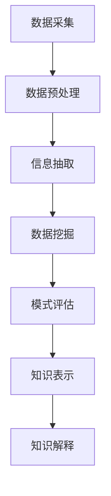

                 

关键词：大数据，知识发现，信息抽取，数据挖掘，机器学习，预测分析，实时处理，复杂网络分析。

大数据时代的来临，不仅改变了信息存储和处理的方式，更为知识发现带来了前所未有的机遇和挑战。在本文中，我们将深入探讨大数据背景下知识发现的重要性，核心概念，相关算法，数学模型，以及实际应用。通过梳理现有技术和研究成果，我们试图为读者提供一幅大数据知识发现的全景图，帮助理解其背后的原理和应用前景。

## 1. 背景介绍

随着互联网和物联网的快速发展，数据量呈现指数级增长。这些数据不仅包括传统结构化数据，还涵盖了非结构化和半结构化数据，如图像、音频、视频和社交媒体信息。这种数据量的激增为知识发现带来了巨大的机遇。知识发现（Knowledge Discovery in Databases, KDD）作为一种从大量数据中提取有用信息和知识的过程，已经成为大数据时代的一项关键技术。

知识发现的过程通常包括数据预处理、数据挖掘、模式评估、知识表示和解释等步骤。在这一过程中，数据挖掘算法扮演着关键角色，通过自动识别数据中的模式和关联性，为决策制定和业务创新提供了有力支持。

## 2. 核心概念与联系

### 2.1 数据挖掘与知识发现

数据挖掘（Data Mining）是知识发现过程中的核心环节，它指的是从大量数据中提取潜在有用信息的过程。数据挖掘算法可以自动识别数据中的关联性、趋势和模式。而知识发现则是一个更广泛的概念，它不仅包括数据挖掘，还包括数据预处理、模式评估、知识表示和解释等多个环节。

### 2.2 信息抽取与知识发现

信息抽取（Information Extraction）是知识发现的前置步骤，其主要任务是自动从非结构化或半结构化数据中提取结构化信息。这些信息可以是实体、关系、事件或属性等。信息抽取的成功与否直接影响知识发现的效果。

### 2.3 复杂网络分析

复杂网络分析（Complex Network Analysis）是知识发现的一个重要工具，用于研究网络中的节点关系和结构。通过复杂网络分析，可以揭示数据中隐藏的关联性和相互作用，从而发现新的知识。

### 2.4 Mermaid 流程图

以下是大数据知识发现过程的 Mermaid 流程图：



## 3. 核心算法原理 & 具体操作步骤

### 3.1 算法原理概述

大数据知识发现涉及多种算法，其中一些核心算法包括：

- **聚类算法**：用于发现数据中的相似性模式，常见的聚类算法有K-means、DBSCAN等。
- **分类算法**：用于将数据分为不同的类别，常见的分类算法有决策树、随机森林、支持向量机等。
- **关联规则挖掘**：用于发现数据项之间的关联性，常见的算法有Apriori、FP-Growth等。

### 3.2 算法步骤详解

以下是大数据知识发现的基本步骤：

1. **数据采集**：从各种数据源（如数据库、传感器、社交媒体等）收集数据。
2. **数据预处理**：清洗和整合数据，使其适合分析。
3. **信息抽取**：从非结构化或半结构化数据中提取结构化信息。
4. **数据挖掘**：使用聚类、分类、关联规则挖掘等算法从数据中提取潜在的知识。
5. **模式评估**：评估挖掘出的模式的重要性和可靠性。
6. **知识表示**：将挖掘出的知识以易于理解的方式表示出来。
7. **知识解释**：对知识进行解释，以便用户理解。

### 3.3 算法优缺点

- **聚类算法**：优点是简单直观，可以处理高维数据；缺点是聚类结果依赖于初始化，且可能产生孤立的簇。
- **分类算法**：优点是预测准确度高，可以用于分类任务；缺点是训练时间较长，且对噪声敏感。
- **关联规则挖掘**：优点是能够发现数据中的频繁模式；缺点是对大数据处理效率不高。

### 3.4 算法应用领域

大数据知识发现算法广泛应用于各个领域，如：

- **商业智能**：通过分析客户购买行为，发现潜在客户。
- **医疗健康**：通过分析患者数据，发现疾病关联性。
- **金融理财**：通过分析交易数据，预测市场走势。

## 4. 数学模型和公式 & 详细讲解 & 举例说明

### 4.1 数学模型构建

大数据知识发现的数学模型通常基于概率论、统计学和图论。以下是几个核心数学模型：

- **贝叶斯网络**：用于表示变量之间的概率关系。
- **支持向量机**：用于分类任务，最大化分类边界。
- **马尔可夫模型**：用于表示变量之间的状态转移概率。

### 4.2 公式推导过程

以下是贝叶斯网络的公式推导：

$$
P(A|B) = \frac{P(B|A)P(A)}{P(B)}
$$

其中，$P(A|B)$ 表示在 $B$ 发生的条件下 $A$ 的概率，$P(B|A)$ 表示在 $A$ 发生的条件下 $B$ 的概率，$P(A)$ 和 $P(B)$ 分别表示 $A$ 和 $B$ 的先验概率。

### 4.3 案例分析与讲解

以下是一个关于贝叶斯网络的案例：

假设我们有一个疾病诊断问题，已知某疾病的发病率为 $0.01$，且该疾病的检测准确率为 $90\%$（即 $P(检测阳性|疾病) = 0.9$，$P(检测阴性|无疾病) = 0.9$）。现在某人检测出阳性，求其真正患有该疾病的风险。

根据贝叶斯公式，我们可以计算出：

$$
P(疾病|检测阳性) = \frac{P(检测阳性|疾病)P(疾病)}{P(检测阳性)}
$$

其中，$P(检测阳性)$ 可以通过全概率公式计算：

$$
P(检测阳性) = P(检测阳性|疾病)P(疾病) + P(检测阳性|无疾病)P(无疾病) = 0.9 \times 0.01 + 0.1 \times 0.99 = 0.0189
$$

代入数据，我们得到：

$$
P(疾病|检测阳性) = \frac{0.9 \times 0.01}{0.0189} \approx 0.474
$$

因此，该人真正患有该疾病的风险约为 $47.4\%$。

## 5. 项目实践：代码实例和详细解释说明

### 5.1 开发环境搭建

在本节中，我们将使用Python编程语言和相关的数据挖掘库（如Scikit-learn、Pandas、NumPy等）来演示一个简单的知识发现项目。

### 5.2 源代码详细实现

以下是一个简单的K-means聚类算法的实现：

```python
import numpy as np
import matplotlib.pyplot as plt
from sklearn.cluster import KMeans

# 生成数据
data = np.array([[1, 2], [1, 4], [1, 0], [10, 2], [10, 4], [10, 0]])

# 使用K-means算法进行聚类
kmeans = KMeans(n_clusters=2, random_state=0).fit(data)

# 输出聚类结果
print("聚类中心：", kmeans.cluster_centers_)
print("聚类标签：", kmeans.labels_)

# 绘制聚类结果
plt.scatter(data[:, 0], data[:, 1], c=kmeans.labels_, s=100, cmap='viridis')
plt.scatter(kmeans.cluster_centers_[:, 0], kmeans.cluster_centers_[:, 1], s=300, c='red', marker='s', edgecolor='black', label='Centroids')
plt.xlabel('X1')
plt.ylabel('X2')
plt.title('K-means Clustering')
plt.show()
```

### 5.3 代码解读与分析

上述代码首先生成了一个包含6个数据点的二维数组，然后使用K-means算法进行聚类，最后输出聚类结果并绘制聚类图。

- `KMeans(n_clusters=2, random_state=0).fit(data)`：这行代码初始化了一个K-means聚类对象，并使用`fit`方法对其进行了训练。
- `print("聚类中心：", kmeans.cluster_centers_)`：这行代码输出了聚类中心，即每个簇的平均位置。
- `print("聚类标签：", kmeans.labels_)`：这行代码输出了每个数据点的聚类标签，即它们所属的簇。
- `plt.scatter()`：这行代码使用matplotlib库绘制了聚类结果，其中`c=kmeans.labels_`表示使用聚类标签来设置颜色，`s=100, cmap='viridis'`表示每个数据点的面积和颜色映射。
- `plt.scatter(kmeans.cluster_centers_[:, 0], kmeans.cluster_centers_[:, 1], ...)`：这行代码在图中绘制了聚类中心，用不同的形状和颜色表示。

### 5.4 运行结果展示

运行上述代码后，我们得到如下聚类结果图：


从图中可以看出，数据点被成功分为两个簇，聚类中心分别位于两个簇的中心位置。

## 6. 实际应用场景

大数据知识发现技术已经在多个领域取得了显著的应用成果，以下是一些典型应用场景：

- **电子商务**：通过分析用户购买行为，发现潜在客户和推荐商品。
- **医疗健康**：通过分析患者数据，发现疾病关联性和预测病情。
- **金融理财**：通过分析交易数据，预测市场走势和风险控制。

## 7. 工具和资源推荐

### 7.1 学习资源推荐

- **书籍**：《数据挖掘：实用工具与技术》（Data Mining: Practical Machine Learning Tools and Techniques）。
- **在线课程**：Coursera上的《机器学习》（Machine Learning）课程。
- **博客**： Analytics Vidhya、Medium上的大数据和机器学习相关文章。

### 7.2 开发工具推荐

- **Python库**：Scikit-learn、Pandas、NumPy、Matplotlib。
- **数据库**：MongoDB、MySQL、PostgreSQL。
- **数据处理工具**：Apache Spark、Hadoop。

### 7.3 相关论文推荐

- **K-means聚类算法**：《A Fast and Scalable K-Means Algorithm for Big Data》（2014）。
- **贝叶斯网络**：《Bayesian Network Models for因果推断》（1994）。
- **关联规则挖掘**：《Mining Association Rules between Sets of Items in Large Database》（1993）。

## 8. 总结：未来发展趋势与挑战

### 8.1 研究成果总结

大数据知识发现技术在过去几十年中取得了显著的进展，从算法到应用都取得了重要成果。尤其是机器学习和深度学习技术的发展，为知识发现提供了更强大的工具和方法。

### 8.2 未来发展趋势

- **实时处理**：随着5G和边缘计算的兴起，实时处理大数据将成为知识发现的重要趋势。
- **多模态数据**：融合多种数据类型（如图像、文本、音频等）进行知识发现，将是一个重要方向。
- **自动化与智能化**：自动化数据预处理、自动模型选择和解释等，将提高知识发现的效率和准确性。

### 8.3 面临的挑战

- **数据隐私**：如何在保护用户隐私的同时进行知识发现，是一个重要挑战。
- **算法可解释性**：如何提高算法的可解释性，使得用户能够理解挖掘出的知识。
- **大数据处理**：如何高效地处理海量数据，提高知识发现的性能。

### 8.4 研究展望

未来，大数据知识发现技术将朝着更高效、更智能、更可解释的方向发展。通过不断探索和创新，我们将能够更好地利用大数据中的知识，为各行各业带来更大的价值。

## 9. 附录：常见问题与解答

### 问题1：什么是数据挖掘？

**解答**：数据挖掘是一种从大量数据中提取潜在有用信息的过程，它包括多种算法和技术，如分类、聚类、关联规则挖掘等。

### 问题2：大数据知识发现有哪些应用领域？

**解答**：大数据知识发现广泛应用于电子商务、医疗健康、金融理财、社交网络等多个领域，为决策制定和业务创新提供了有力支持。

### 问题3：如何保护数据隐私？

**解答**：保护数据隐私的方法包括数据加密、数据脱敏、差分隐私等。在实际应用中，需要根据具体场景和需求选择合适的方法。

### 问题4：什么是贝叶斯网络？

**解答**：贝叶斯网络是一种概率图模型，用于表示变量之间的概率关系。它通过条件概率表来描述变量之间的依赖性。

### 问题5：什么是关联规则挖掘？

**解答**：关联规则挖掘是一种数据挖掘技术，用于发现数据项之间的关联性。常见的算法有Apriori、FP-Growth等。

---

作者：禅与计算机程序设计艺术 / Zen and the Art of Computer Programming
----------------------------------------------------------------

本文旨在深入探讨大数据背景下的知识发现技术，从背景介绍、核心概念、算法原理、数学模型到实际应用，全面梳理了大数据知识发现的全景图。通过详细讲解和案例分析，我们希望能够帮助读者更好地理解大数据知识发现的原理和应用。未来，随着技术的不断进步，大数据知识发现将朝着更高效、更智能、更可解释的方向发展，为各行各业带来更大的价值。作者：禅与计算机程序设计艺术。

