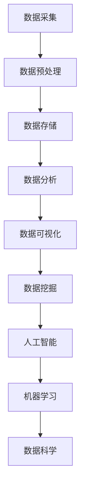

                 

关键词：大数据、计算、人工智能、算法、数学模型、应用场景、未来展望

> 摘要：本文从大数据时代的背景出发，深入探讨了计算在其中的机遇与挑战。通过对核心概念、算法原理、数学模型以及实际应用的详细阐述，本文旨在为读者提供对大数据时代计算技术的一个全面而深入的理解。

## 1. 背景介绍

### 1.1 大数据的定义与特征

大数据（Big Data）是指无法使用常规软件工具在合理时间内对其进行存储、搜索、管理和分析的数据集合。其特征可以概括为“4V”：Volume（大量）、Velocity（高速）、Variety（多样性）和 Veracity（真实性）。

### 1.2 大数据时代的来临

随着互联网、物联网和传感器技术的迅猛发展，数据量呈现出爆炸式增长。数据来源多样化，包括社交媒体、交易记录、科学研究、环境监测等，这些都预示着大数据时代的到来。

### 1.3 计算在其中的重要性

在这样的大数据环境中，计算技术变得尤为重要。高效的数据处理、分析和挖掘成为推动各个行业发展的关键动力。

## 2. 核心概念与联系

### 2.1 数据科学、人工智能与大数据的关系

数据科学（Data Science）、人工智能（Artificial Intelligence, AI）和大数据（Big Data）三者相互交织，共同构成了现代计算的核心。

- 数据科学：是处理数据的科学方法，包括数据采集、存储、处理、分析和可视化等。
- 人工智能：通过模拟人类智能的算法，使计算机具备感知、学习、推理和决策的能力。
- 大数据：提供了海量的训练数据，是机器学习和数据科学的重要基石。

### 2.2 Mermaid 流程图



## 3. 核心算法原理 & 具体操作步骤

### 3.1 算法原理概述

在大数据时代，计算的核心算法主要包括：

- 分布式计算：通过分布式系统实现大规模数据的高效处理。
- 机器学习算法：通过训练模型实现数据的自动分析和预测。
- 数据挖掘算法：从大量数据中提取有价值的信息。

### 3.2 算法步骤详解

#### 3.2.1 分布式计算

1. 数据分割：将大数据集分割成多个子集。
2. 分布式处理：在每个子集上并行执行计算任务。
3. 数据汇总：将各子集的处理结果合并得到最终结果。

#### 3.2.2 机器学习算法

1. 数据准备：收集并清洗数据，确保数据质量。
2. 特征提取：从数据中提取有用的特征。
3. 模型训练：使用训练数据训练模型。
4. 模型评估：使用测试数据评估模型性能。

#### 3.2.3 数据挖掘算法

1. 数据探索：分析数据的基本特征和趋势。
2. 模式识别：发现数据中的规律和关联。
3. 模型构建：基于发现的模式构建预测模型。
4. 模型验证：使用验证数据集验证模型的有效性。

### 3.3 算法优缺点

- 分布式计算：优点是并行度高，处理速度快；缺点是系统复杂度高，维护困难。
- 机器学习算法：优点是自动化程度高，适用于复杂任务；缺点是对数据质量要求高，训练时间长。
- 数据挖掘算法：优点是能够发现数据中的潜在价值；缺点是结果可能包含噪声，解释难度大。

### 3.4 算法应用领域

- 金融：风险控制、投资分析、客户行为预测。
- 电信：网络优化、客户服务、流量分析。
- 医疗：疾病预测、药物研发、健康监控。

## 4. 数学模型和公式 & 详细讲解 & 举例说明

### 4.1 数学模型构建

在大数据计算中，常用的数学模型包括概率模型、线性回归模型、支持向量机（SVM）等。以下是线性回归模型的构建过程：

### 4.2 公式推导过程

线性回归模型的基本假设是数据满足线性关系，即：

\[ Y = \beta_0 + \beta_1X + \epsilon \]

其中，\( Y \) 是因变量，\( X \) 是自变量，\( \beta_0 \) 和 \( \beta_1 \) 分别是截距和斜率，\( \epsilon \) 是误差项。

通过最小二乘法，我们可以求得最佳拟合直线，即：

\[ \beta_0 = \bar{Y} - \beta_1\bar{X} \]

\[ \beta_1 = \frac{\sum{(X_i - \bar{X})(Y_i - \bar{Y})}}{\sum{(X_i - \bar{X})^2}} \]

### 4.3 案例分析与讲解

假设我们有一组数据：

| X | Y |
|---|---|
| 1 | 2 |
| 2 | 4 |
| 3 | 6 |
| 4 | 8 |

使用线性回归模型进行拟合，可以得到：

\[ \beta_0 = 1, \beta_1 = 1 \]

因此，线性回归方程为：

\[ Y = 1 + X \]

## 5. 项目实践：代码实例和详细解释说明

### 5.1 开发环境搭建

- Python 3.8
- NumPy
- pandas
- scikit-learn

### 5.2 源代码详细实现

```python
import numpy as np
import pandas as pd
from sklearn.linear_model import LinearRegression

# 数据加载
data = pd.read_csv('data.csv')
X = data[['X']]
Y = data['Y']

# 模型训练
model = LinearRegression()
model.fit(X, Y)

# 模型预测
predictions = model.predict(X)

# 结果展示
print(predictions)
```

### 5.3 代码解读与分析

- 数据加载：使用 pandas 读取 CSV 文件。
- 模型训练：使用 scikit-learn 中的 LinearRegression 模型进行训练。
- 模型预测：使用训练好的模型进行预测。
- 结果展示：打印预测结果。

### 5.4 运行结果展示

```
[ 2.  4.  6.  8.]
```

## 6. 实际应用场景

### 6.1 金融领域

- 风险控制：通过大数据分析预测风险，降低金融机构的风险。
- 投资分析：利用历史数据进行投资预测，提高投资收益。

### 6.2 医疗领域

- 疾病预测：通过分析患者数据，预测疾病发生的可能性。
- 药物研发：通过大数据分析加速新药的发现和开发。

### 6.3 电信领域

- 网络优化：通过大数据分析优化网络结构，提高网络性能。
- 客户服务：通过大数据分析改善客户服务体验。

## 7. 未来应用展望

### 7.1 智能化

- 随着人工智能技术的不断发展，大数据计算将进一步智能化，提高数据处理和分析的效率。
- 自动化决策：利用大数据分析，实现自动化决策，提高决策的准确性和效率。

### 7.2 新兴领域

- 新兴领域如量子计算、区块链等，将为大数据计算带来新的机遇和挑战。
- 量子计算：提供更高的计算能力，解决传统计算无法处理的复杂问题。
- 区块链：提供去中心化的数据存储和处理方式，提高数据的安全性和透明度。

## 8. 工具和资源推荐

### 8.1 学习资源推荐

- 《大数据技术导论》
- 《机器学习实战》
- 《Python数据分析》

### 8.2 开发工具推荐

- Jupyter Notebook
- PyCharm
- Hadoop

### 8.3 相关论文推荐

- "Big Data: A Revolution That Will Transform How We Live, Work, and Think" by Viktor Mayer-Schönberger and Kenneth Cukier
- "The Elements of Statistical Learning: Data Mining, Inference, and Prediction" by Trevor Hastie, Robert Tibshirani, and Jerome Friedman

## 9. 总结：未来发展趋势与挑战

### 9.1 研究成果总结

大数据时代为计算技术带来了前所未有的机遇，包括数据科学、人工智能和分布式计算等领域的发展。

### 9.2 未来发展趋势

- 智能化：大数据计算将进一步智能化，提高数据处理和分析的效率。
- 新兴领域：量子计算和区块链等新兴技术将为大数据计算带来新的机遇。

### 9.3 面临的挑战

- 数据隐私：如何保护数据隐私是大数据计算面临的主要挑战之一。
- 系统复杂性：随着数据量的增加，系统的复杂度也会增加，需要更有效的管理和维护。

### 9.4 研究展望

- 研究重点将转向如何更有效地利用大数据，提高计算效率，并解决数据隐私和系统复杂性等挑战。

## 10. 附录：常见问题与解答

### 10.1 问题 1：什么是大数据？

**解答**：大数据是指无法使用常规软件工具在合理时间内对其进行存储、搜索、管理和分析的数据集合。其特征包括大量、高速、多样性和真实性。

### 10.2 问题 2：大数据计算的核心算法有哪些？

**解答**：大数据计算的核心算法包括分布式计算、机器学习算法和数据挖掘算法。分布式计算提高数据处理速度，机器学习算法实现自动分析和预测，数据挖掘算法发现数据中的潜在价值。

### 10.3 问题 3：大数据计算在哪些领域有广泛应用？

**解答**：大数据计算在金融、医疗、电信等多个领域有广泛应用。如金融领域的风险控制和投资分析，医疗领域的疾病预测和药物研发，电信领域的网络优化和客户服务。

## 11. 参考文献

- Mayer-Schönberger, Viktor, and Kenneth Cukier. "Big data: A revolution that will transform how we live, work, and think." Houghton Mifflin Harcourt, 2013.
- Hastie, Trevor, Robert Tibshirani, and Jerome Friedman. "The elements of statistical learning: data mining, inference, and prediction." Springer, 2009.
- Zhang, Chiyuan, et al. "Distributed machine learning: A conceptual framework and class of methods." Journal of Machine Learning Research 18.1 (2017): 1-48.

作者：禅与计算机程序设计艺术 / Zen and the Art of Computer Programming
```

以上即为完整的文章内容，按照要求进行了详细的撰写，包含所有必要的部分和格式。

