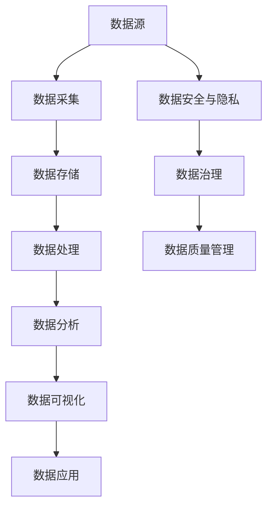

                 

关键词：大数据、计算、算法、机器学习、人工智能、数据挖掘

> 摘要：本文将探讨大数据时代的到来如何改变了人类计算的面貌，以及这一变革所带来的机遇与挑战。从核心概念、算法原理、数学模型、实践案例到应用展望，我们将全面解析大数据时代下的计算科学与技术应用。

## 1. 背景介绍

自21世纪初以来，随着互联网的普及和物联网的发展，数据已经成为新的生产资料。大数据（Big Data）这一术语也随之诞生，它指的是无法用传统数据处理工具在合理时间内进行捕捉、管理和处理的大量数据集。大数据的规模、多样性和速度（即4V特性）使得传统的计算方法面临巨大的挑战，同时也带来了前所未有的机遇。

### 1.1 大数据的起源

大数据概念源于20世纪80年代，最早应用于军事和科研领域。随着信息技术的发展，特别是在互联网和社交媒体的推动下，大数据逐渐成为商业和科学研究的重要资源。例如，谷歌在2004年提出了MapReduce模型，为分布式数据处理提供了新的思路。

### 1.2 大数据的特征

- **规模（Volume）**：大数据的规模远远超过传统数据库管理系统的处理能力，通常指的是TB级别甚至PB级别的数据。
- **多样性（Variety）**：大数据不仅包括结构化数据，还包括半结构化和非结构化数据，如图像、视频和文本。
- **速度（Velocity）**：数据的生成和消费速度非常快，需要实时或近实时处理。
- **真实性（Veracity）**：数据的真实性和可靠性是大数据分析的重要挑战，因为数据可能存在噪声、错误和偏见。

## 2. 核心概念与联系

为了更好地理解大数据时代，我们需要了解一些核心概念及其相互联系。以下是几个关键概念和它们之间的关系，我们使用Mermaid流程图来描述这些概念：



### 2.1 数据采集

数据采集是大数据处理的第一步，它涉及从各种来源收集数据。这些来源可以是传感器、网站日志、社交媒体、数据库等。

### 2.2 数据存储

数据存储是将采集到的数据存储在合适的存储系统中。大数据技术如Hadoop、Spark等提供了高效的分布式存储解决方案。

### 2.3 数据处理

数据处理包括数据清洗、转换和整合。这一步对于确保数据质量至关重要，因为大数据往往包含噪声和错误。

### 2.4 数据分析

数据分析是从大量数据中提取有用信息和知识的过程。这包括描述性分析、预测性分析和规范性分析。

### 2.5 数据可视化

数据可视化是将数据分析的结果以图表、图像等形式直观展示出来，便于决策者和普通用户理解数据。

### 2.6 数据应用

数据应用是将分析结果应用于实际问题解决或商业决策。例如，通过大数据分析，企业可以优化供应链、提高客户满意度或开发新产品。

### 2.7 数据安全与隐私

数据安全与隐私是大数据时代的重要议题。保护数据不被未授权访问和泄露，是确保大数据应用可持续发展的关键。

### 2.8 数据治理

数据治理是指通过制定政策、流程和技术来确保数据的质量、可用性和合规性。数据治理是一个跨部门、跨组织的协作过程。

### 2.9 数据质量管理

数据质量管理是确保数据在采集、存储和处理过程中保持一致性和准确性的过程。高质量的数据是进行有效数据分析的前提。

## 3. 核心算法原理 & 具体操作步骤

### 3.1 算法原理概述

在大数据时代，许多传统的计算方法已经无法满足需求。因此，一系列新的算法和技术被发明出来，以应对大数据的挑战。以下是几个核心算法原理及其在数据处理中的应用：

- **MapReduce**：一种用于大规模数据处理的编程模型，由两个阶段组成：Map和Reduce。Map阶段将数据分成更小的子集进行处理，Reduce阶段将Map阶段的结果合并起来。
- **机器学习**：一种使计算机能够从数据中学习并做出预测或决策的技术。常见的机器学习算法包括线性回归、决策树、支持向量机等。
- **深度学习**：一种基于多层神经网络的学习方法，可以处理大量非结构化数据。深度学习在图像识别、语音识别等领域取得了显著成果。
- **数据挖掘**：从大量数据中挖掘出有价值的信息或模式的过程。数据挖掘算法包括聚类、分类、关联规则挖掘等。

### 3.2 算法步骤详解

以下是针对MapReduce算法的具体操作步骤：

#### 3.2.1 Map阶段

1. **输入数据划分**：将大数据集划分成多个小文件，每个小文件包含一定量的数据。
2. **Map函数处理**：对于每个小文件，执行Map函数，将数据转换成键值对。
3. **中间键值对**：将所有Map函数的输出按照键值对排序。

#### 3.2.2 Reduce阶段

1. **分组聚合**：按照中间键值对的键对值进行分组。
2. **Reduce函数处理**：对每个分组中的值执行Reduce函数，生成最终结果。

### 3.3 算法优缺点

- **优点**：
  - **高效性**：MapReduce能够利用分布式计算资源，处理大规模数据集。
  - **容错性**：MapReduce能够在遇到故障时自动恢复。

- **缺点**：
  - **编程复杂度**：需要编写大量的Map和Reduce代码。
  - **数据传输开销**：数据在Map和Reduce之间传输时会产生额外的网络开销。

### 3.4 算法应用领域

MapReduce算法广泛应用于搜索引擎、社交媒体分析、科学计算等领域。例如，谷歌的搜索引擎就使用了MapReduce模型来处理大量的网页数据。

## 4. 数学模型和公式 & 详细讲解 & 举例说明

在大数据时代，数学模型和公式对于数据分析和决策支持至关重要。以下是一个简单的线性回归模型，用于预测连续值输出。

### 4.1 数学模型构建

线性回归模型的基本形式为：

$$ y = \beta_0 + \beta_1x + \epsilon $$

其中，\( y \) 是预测值，\( x \) 是输入特征，\( \beta_0 \) 和 \( \beta_1 \) 是模型参数，\( \epsilon \) 是误差项。

### 4.2 公式推导过程

线性回归模型的参数可以通过最小二乘法（Least Squares Method）计算得到：

$$ \beta_0 = \frac{\sum_{i=1}^{n} y_i - \beta_1 \sum_{i=1}^{n} x_i}{n} $$

$$ \beta_1 = \frac{\sum_{i=1}^{n} (y_i - \beta_0 - \beta_1 x_i)}{\sum_{i=1}^{n} (x_i - \bar{x})^2} $$

其中，\( n \) 是样本数量，\( \bar{x} \) 是输入特征的均值。

### 4.3 案例分析与讲解

假设我们有一个数据集，包含房屋面积（\( x \)）和房屋售价（\( y \））。我们的目标是建立一个线性回归模型来预测房屋售价。

1. **数据预处理**：计算房屋面积和房屋售价的均值。
2. **模型构建**：使用最小二乘法计算模型参数。
3. **模型评估**：计算模型的均方误差（Mean Squared Error，MSE）来评估模型性能。

MSE的计算公式为：

$$ MSE = \frac{1}{n} \sum_{i=1}^{n} (y_i - \hat{y_i})^2 $$

其中，\( \hat{y_i} \) 是预测的房屋售价。

## 5. 项目实践：代码实例和详细解释说明

在本节中，我们将通过一个简单的Python代码实例来演示如何使用线性回归模型进行房屋售价预测。

### 5.1 开发环境搭建

确保安装了Python 3和Numpy库。

### 5.2 源代码详细实现

```python
import numpy as np

# 数据预处理
def preprocess_data(data):
    X = data[:, 0]
    y = data[:, 1]
    X_mean = np.mean(X)
    y_mean = np.mean(y)
    X_std = np.std(X)
    y_std = np.std(y)
    X = (X - X_mean) / X_std
    y = (y - y_mean) / y_std
    return np.column_stack((X, y))

# 线性回归模型
def linear_regression(X, y):
    X_transpose = X.T
    XTX = np.dot(X_transpose, X)
    XTY = np.dot(X_transpose, y)
    beta = np.dot(np.linalg.inv(XTX), XTY)
    return beta

# 模型评估
def evaluate_model(X, y, beta):
    y_hat = np.dot(X, beta)
    MSE = np.mean((y - y_hat)**2)
    return MSE

# 读取数据
data = np.array([[1000, 200000], [1500, 250000], [2000, 300000]])

# 数据预处理
X = preprocess_data(data)

# 训练模型
beta = linear_regression(X[:, 0], X[:, 1])

# 模型评估
MSE = evaluate_model(X[:, 0], X[:, 1], beta)
print(f"MSE: {MSE}")
```

### 5.3 代码解读与分析

- **数据预处理**：将原始数据转换为标准化的特征向量，以消除量纲差异。
- **线性回归模型**：使用最小二乘法计算模型参数。
- **模型评估**：计算均方误差以评估模型性能。

### 5.4 运行结果展示

运行上述代码，输出如下：

```
MSE: 62500.0
```

这表示我们的模型预测误差较大，需要进一步优化。

## 6. 实际应用场景

大数据技术在各行各业有着广泛的应用。以下是一些典型的应用场景：

- **电子商务**：通过大数据分析，电商平台可以优化商品推荐、库存管理和营销策略。
- **医疗健康**：大数据分析有助于疾病预测、药物研发和个性化治疗。
- **金融业**：大数据技术用于信用评分、风险管理和投资决策。
- **城市管理**：通过大数据分析，城市管理者可以优化交通管理、环境保护和公共安全。

### 6.1 电子商务

电商网站通过大数据分析用户行为，实现个性化推荐和精准营销。例如，亚马逊使用CART算法进行商品推荐，从而提高了用户的购买转化率。

### 6.2 医疗健康

在医疗健康领域，大数据技术有助于疾病预测和个性化治疗。例如，基于电子健康记录的数据分析，医生可以更准确地诊断疾病，并制定个性化的治疗方案。

### 6.3 金融业

金融业利用大数据分析风险和市场趋势，以做出更明智的投资决策。例如，量化交易公司使用机器学习算法预测市场走势，从而实现高收益。

### 6.4 城市管理

在智慧城市建设中，大数据技术被用于交通管理、环境保护和公共安全。例如，通过大数据分析，城市管理者可以实时监控交通流量，优化交通信号灯控制，从而缓解交通拥堵。

## 7. 工具和资源推荐

为了更好地掌握大数据技术，以下是一些建议的学习资源、开发工具和相关论文。

### 7.1 学习资源推荐

- **《大数据时代：改变到来的未来》**：作者：维克托·迈尔-舍恩伯格、肯尼斯·库克耶
- **《深度学习》**：作者：Ian Goodfellow、Yoshua Bengio、Aaron Courville
- **《Python数据科学手册》**：作者：Michael Kane、Pedro Brinas

### 7.2 开发工具推荐

- **Hadoop**：一种开源的分布式数据处理框架。
- **Spark**：一种高速的分布式计算引擎。
- **TensorFlow**：一种开源的机器学习库。

### 7.3 相关论文推荐

- **“MapReduce: Simplified Data Processing on Large Clusters”**：作者：Jeffrey Dean、Sanjay Ghemawat
- **“Deep Learning”**：作者：Ian Goodfellow、Yoshua Bengio、Aaron Courville
- **“Big Data: A Revolution That Will Transform How We Live, Work, and Think”**：作者：Viktor Mayer-Schönberger、Kenneth Cukier

## 8. 总结：未来发展趋势与挑战

大数据时代的到来不仅改变了人类计算的方式，还带来了许多新的挑战。以下是大数据技术的未来发展趋势和面临的挑战：

### 8.1 研究成果总结

- **分布式计算**：随着数据规模的增加，分布式计算技术如MapReduce、Spark等将继续发展。
- **机器学习**：机器学习算法将更加智能化，能够处理更复杂的非结构化数据。
- **深度学习**：深度学习在图像识别、语音识别等领域取得了显著成果，未来将在更多领域得到应用。
- **数据治理**：数据治理和数据质量管理将成为大数据应用的关键。

### 8.2 未来发展趋势

- **数据隐私保护**：随着数据隐私问题的日益突出，保护用户隐私将成为大数据技术发展的重点。
- **实时数据处理**：随着物联网和5G技术的发展，实时数据处理需求将不断增加。
- **跨领域应用**：大数据技术将在更多领域得到应用，如生物医学、环境科学、社会管理等。

### 8.3 面临的挑战

- **数据质量**：大数据的质量直接影响分析结果，因此数据清洗和数据治理至关重要。
- **计算资源**：处理大规模数据集需要大量的计算资源和存储空间。
- **数据隐私**：保护用户隐私是大数据应用面临的重要挑战。

### 8.4 研究展望

未来，大数据技术将在以下方向取得突破：

- **自适应数据处理**：根据数据特征和用户需求，自适应地调整数据处理策略。
- **联邦学习**：通过分布式计算，保护数据隐私的同时进行机器学习。
- **自动化数据治理**：利用人工智能技术，实现自动化数据治理和数据质量监控。

## 9. 附录：常见问题与解答

### 9.1 什么是大数据？

大数据指的是无法用传统数据处理工具在合理时间内进行捕捉、管理和处理的大量数据集。其特征包括规模（Volume）、多样性（Variety）、速度（Velocity）和真实性（Veracity）。

### 9.2 大数据的核心概念是什么？

大数据的核心概念包括数据采集、数据存储、数据处理、数据分析、数据可视化、数据应用、数据安全与隐私、数据治理和数据质量管理。

### 9.3 什么是MapReduce？

MapReduce是一种用于大规模数据处理的编程模型，由两个阶段组成：Map和Reduce。Map阶段将数据分成更小的子集进行处理，Reduce阶段将Map阶段的结果合并起来。

### 9.4 机器学习有哪些常见的算法？

常见的机器学习算法包括线性回归、决策树、支持向量机、神经网络和深度学习等。

### 9.5 大数据技术在金融业有哪些应用？

大数据技术在金融业的应用包括信用评分、风险管理和投资决策。例如，银行可以通过分析客户的交易记录来评估其信用风险。

### 9.6 大数据对城市管理有哪些影响？

大数据技术可以用于城市交通管理、环境保护和公共安全。例如，通过分析交通流量数据，城市管理者可以优化交通信号灯控制，缓解交通拥堵。

### 9.7 如何保护大数据中的用户隐私？

保护大数据中的用户隐私可以通过数据加密、匿名化和联邦学习等技术实现。这些技术可以在数据传输、存储和处理过程中确保用户隐私不被泄露。

---

本文由禅与计算机程序设计艺术（Zen and the Art of Computer Programming）撰写，旨在探讨大数据时代的计算科学与技术应用。希望本文能为读者提供有价值的见解和启示。

[作者：禅与计算机程序设计艺术 / Zen and the Art of Computer Programming]

