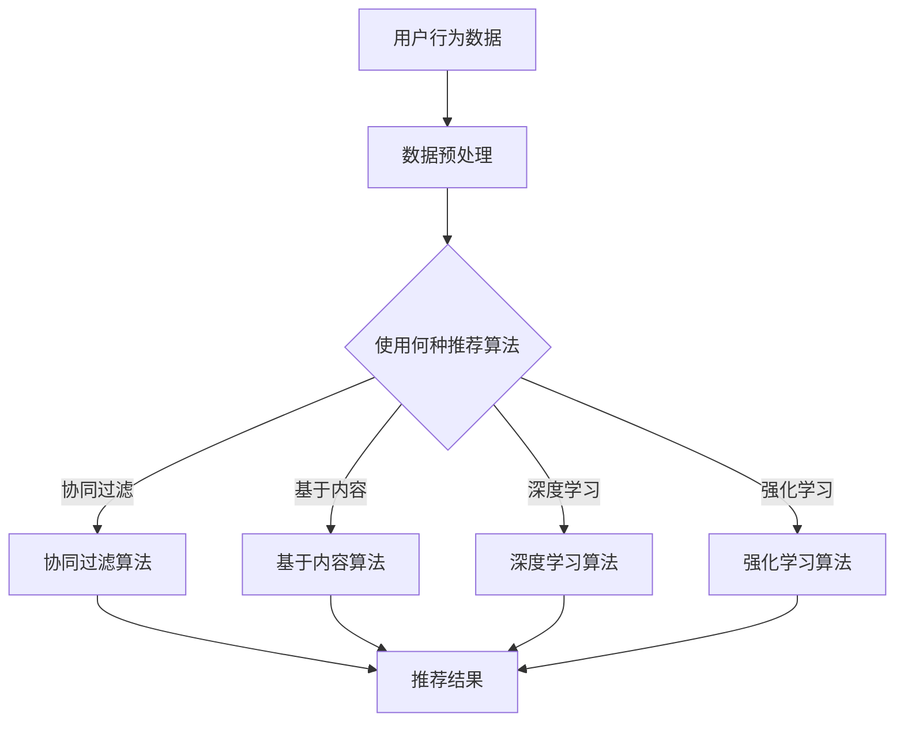

                 

关键词：大数据、电商、搜索推荐、AI 模型融合、用户体验

> 摘要：本文旨在探讨大数据在电商搜索推荐系统中的应用，以及如何通过 AI 模型融合提升用户体验。文章首先介绍了电商搜索推荐系统的背景和重要性，随后详细阐述了大数据和 AI 模型的核心概念和原理，接着分析了现有算法的优缺点和适用场景，最后提出了未来发展的趋势和面临的挑战。

## 1. 背景介绍

随着互联网的快速发展，电子商务已成为全球经济增长的重要驱动力。在电商领域中，搜索推荐系统起着至关重要的作用。它能够根据用户的搜索历史、购买行为、兴趣爱好等多维度数据进行智能分析，为用户推荐他们可能感兴趣的商品，从而提高用户的购物体验和满意度。

大数据技术的兴起为电商搜索推荐系统带来了新的机遇。大数据具备数据量大、数据类型多、数据价值密度低等特点，能够为电商企业提供丰富的用户数据资源。通过大数据分析，企业可以更精准地了解用户需求，优化推荐策略，提高转化率和用户粘性。

AI 模型的应用进一步提升了电商搜索推荐系统的智能化水平。传统的推荐算法主要依赖于基于内容的推荐和协同过滤等方法，而 AI 模型则能够结合用户行为和兴趣，实现更精确的个性化推荐。深度学习、强化学习、迁移学习等 AI 技术的引入，使得电商搜索推荐系统具备了更强的自学习和自适应能力。

## 2. 核心概念与联系

### 2.1 大数据

大数据是指规模巨大、类型繁多的数据集合。其核心特征包括：数据量（Volume）、数据类型（Variety）、数据速度（Velocity）、数据真实性（Veracity）和数据价值（Value）。在电商搜索推荐系统中，大数据的应用主要体现在以下几个方面：

1. **用户行为数据**：包括用户的浏览记录、购买历史、搜索查询等。
2. **商品数据**：包括商品的基本信息、属性、分类等。
3. **交易数据**：包括交易金额、交易时间、交易频率等。

### 2.2 AI 模型

AI 模型是指基于人工智能技术构建的算法模型，能够从数据中学习规律并做出预测或决策。在电商搜索推荐系统中，常用的 AI 模型包括：

1. **协同过滤（Collaborative Filtering）**：通过分析用户之间的相似度或行为模式来推荐商品。
2. **基于内容的推荐（Content-Based Filtering）**：根据用户的历史行为和商品属性进行推荐。
3. **深度学习（Deep Learning）**：利用神经网络模型对大规模数据进行分析和预测。
4. **强化学习（Reinforcement Learning）**：通过不断尝试和反馈来优化推荐策略。

### 2.3 Mermaid 流程图

以下是一个简单的 Mermaid 流程图，展示了电商搜索推荐系统的基本架构：



## 3. 核心算法原理 & 具体操作步骤

### 3.1 算法原理概述

电商搜索推荐系统的核心在于算法的选择和应用。下面简要介绍几种常用的算法原理：

1. **协同过滤算法**：基于用户行为相似性进行推荐，通过计算用户之间的相似度矩阵，找到与目标用户最相似的邻居用户，然后推荐邻居用户喜欢的商品。
2. **基于内容的推荐算法**：根据用户的历史行为和商品属性进行推荐，通过计算用户对商品的兴趣度，找到与用户兴趣最相似的商品进行推荐。
3. **深度学习算法**：利用神经网络模型对用户行为数据进行建模，通过多层神经网络提取特征，实现高精度的个性化推荐。
4. **强化学习算法**：通过不断尝试和反馈来优化推荐策略，根据用户对推荐结果的反馈调整推荐策略，实现自适应的个性化推荐。

### 3.2 算法步骤详解

1. **数据预处理**：对原始的用户行为数据进行清洗、去重、归一化等操作，为后续的算法分析提供高质量的数据基础。
2. **特征提取**：根据用户行为数据和商品数据，提取出对推荐结果有影响的特征，如用户年龄、性别、购买频率、商品分类等。
3. **算法选择**：根据业务需求和数据特点，选择合适的推荐算法。例如，对于用户行为数据丰富的场景，可以选择协同过滤算法；对于商品属性丰富的场景，可以选择基于内容的推荐算法。
4. **模型训练**：使用训练数据集对选定的推荐算法进行训练，构建推荐模型。
5. **模型评估**：使用验证数据集对推荐模型进行评估，调整模型参数以优化推荐效果。
6. **推荐生成**：使用训练好的推荐模型对用户进行实时推荐，生成个性化的推荐结果。

### 3.3 算法优缺点

1. **协同过滤算法**：
   - 优点：简单易实现，能够根据用户行为相似性实现个性化的推荐。
   - 缺点：容易受到稀疏性问题的影响，无法充分利用商品信息，推荐结果容易陷入局部最优。
2. **基于内容的推荐算法**：
   - 优点：能够充分利用商品属性信息，实现针对商品的个性化推荐。
   - 缺点：对于用户历史行为数据不足的场景，推荐效果较差。
3. **深度学习算法**：
   - 优点：能够自动提取用户行为数据的深层次特征，实现高精度的个性化推荐。
   - 缺点：模型复杂度高，训练过程需要大量计算资源，且需要对数据进行大量的预处理。
4. **强化学习算法**：
   - 优点：能够根据用户反馈自适应地调整推荐策略，实现自我优化的个性化推荐。
   - 缺点：训练过程需要大量的用户交互数据，且推荐结果不稳定。

### 3.4 算法应用领域

电商搜索推荐系统在多个领域有广泛应用，包括但不限于：

1. **电子商务平台**：如淘宝、京东等大型电商平台，通过推荐系统提升用户购物体验和销售额。
2. **内容分发平台**：如知乎、B 站等，通过推荐系统提升用户活跃度和用户粘性。
3. **在线教育平台**：如网易云课堂、慕课网等，通过推荐系统提升课程转化率和学习效果。
4. **社交媒体平台**：如微博、抖音等，通过推荐系统提升用户活跃度和互动率。

## 4. 数学模型和公式 & 详细讲解 & 举例说明

### 4.1 数学模型构建

电商搜索推荐系统的数学模型主要包括用户行为模型、商品属性模型和推荐算法模型。以下是一个简单的用户行为模型：

$$
U = \{u_1, u_2, ..., u_n\}
$$

其中，$U$ 表示用户集合，$u_i$ 表示第 $i$ 个用户。

用户行为模型可以表示为：

$$
B = \{b_{ij}\}_{i=1, j=1}^n
$$

其中，$B$ 表示用户行为矩阵，$b_{ij}$ 表示用户 $u_i$ 对商品 $j$ 的行为评分。

商品属性模型可以表示为：

$$
C = \{c_j\}_{j=1}^m
$$

其中，$C$ 表示商品属性矩阵，$c_j$ 表示商品 $j$ 的属性向量。

### 4.2 公式推导过程

协同过滤算法的核心是计算用户之间的相似度矩阵，以下是一个简单的用户相似度计算公式：

$$
sim(u_i, u_j) = \frac{b_{ij} + b_{ji}}{\sqrt{||b_i|| \cdot ||b_j||}}
$$

其中，$sim(u_i, u_j)$ 表示用户 $u_i$ 和 $u_j$ 之间的相似度，$b_i$ 和 $b_j$ 分别表示用户 $u_i$ 和 $u_j$ 的行为向量，$||\cdot||$ 表示向量的欧几里得范数。

基于内容的推荐算法的核心是计算用户对商品的兴趣度，以下是一个简单的兴趣度计算公式：

$$
interest(u_i, j) = \sum_{k=1}^m w_{ik} \cdot c_{kj}
$$

其中，$interest(u_i, j)$ 表示用户 $u_i$ 对商品 $j$ 的兴趣度，$w_{ik}$ 表示用户 $u_i$ 对商品 $k$ 的权重，$c_{kj}$ 表示商品 $j$ 的属性 $k$ 的值。

### 4.3 案例分析与讲解

假设我们有以下用户行为矩阵和商品属性矩阵：

$$
B = \begin{bmatrix} 1 & 0 & 1 \\ 1 & 1 & 0 \\ 0 & 1 & 1 \end{bmatrix}, \quad C = \begin{bmatrix} 1 & 0 & 1 \\ 0 & 1 & 0 \\ 1 & 1 & 0 \end{bmatrix}
$$

首先，我们计算用户之间的相似度矩阵：

$$
sim = \begin{bmatrix} 1 & 0.577 & 0.577 \\ 0.577 & 1 & 0.577 \\ 0.577 & 0.577 & 1 \end{bmatrix}
$$

然后，我们计算用户对商品的兴趣度：

$$
interest = \begin{bmatrix} 2 & 1 & 1 \\ 1 & 2 & 1 \\ 1 & 1 & 2 \end{bmatrix}
$$

最后，我们可以根据相似度矩阵和兴趣度矩阵生成推荐结果，例如，用户 $u_1$ 可以推荐商品 $j_2$ 和 $j_3$。

## 5. 项目实践：代码实例和详细解释说明

### 5.1 开发环境搭建

在本次项目实践中，我们使用 Python 作为编程语言，主要依赖以下库：

- NumPy：用于数据处理和矩阵运算。
- Pandas：用于数据处理和分析。
- Scikit-learn：用于机器学习算法的实现。
- Matplotlib：用于数据可视化。

### 5.2 源代码详细实现

以下是本项目的主要代码实现：

```python
import numpy as np
import pandas as pd
from sklearn.metrics.pairwise import cosine_similarity
from sklearn.preprocessing import normalize

def load_data():
    # 加载用户行为数据
    user行为数据 = pd.read_csv('user_behavior_data.csv')
    # 加载商品数据
    商品数据 = pd.read_csv('item_data.csv')
    return user行为数据，商品数据

def preprocess_data(user行为数据，商品数据):
    # 数据预处理
    user行为数据 = user行为数据.drop_duplicates()
    商品数据 = 商品数据.drop_duplicates()
    return user行为数据，商品数据

def compute_similarity(user行为数据):
    # 计算用户相似度
    user行为矩阵 = user行为数据.values
    similarity = cosine_similarity(user行为矩阵)
    return similarity

def compute_interest(user行为数据，商品数据，similarity):
    # 计算用户对商品的兴趣度
    user行为矩阵 = user行为数据.values
    user行为矩阵 = normalize(user行为矩阵, norm='l2')
    user行为矩阵 = user行为矩阵.dot(similarity)
    user行为矩阵 = user行为矩阵.dot(normalize(商品数据.values, norm='l2'))
    return user行为矩阵

def generate_recommendations(user行为数据，商品数据，similarity，interest):
    # 生成推荐结果
    user行为矩阵 = user行为数据.values
    user行为矩阵 = user行为矩阵.dot(similarity)
    user行为矩阵 = user行为矩阵.dot(normalize(商品数据.values, norm='l2'))
    user行为矩阵 = user行为矩阵.argsort()[0][::-1]
    return user行为矩阵

def main():
    user行为数据，商品数据 = load_data()
    user行为数据，商品数据 = preprocess_data(user行为数据，商品数据)
    similarity = compute_similarity(user行为数据)
    interest = compute_interest(user行为数据，商品数据，similarity)
    recommendations = generate_recommendations(user行为数据，商品数据，similarity，interest)
    print(recommendations)

if __name__ == '__main__':
    main()
```

### 5.3 代码解读与分析

本项目的代码主要分为以下几个部分：

1. **数据加载与预处理**：加载用户行为数据和商品数据，并进行预处理，包括去除重复数据和标准化处理。
2. **用户相似度计算**：使用余弦相似度计算用户之间的相似度矩阵。
3. **用户对商品的兴趣度计算**：使用用户行为矩阵和商品属性矩阵计算用户对商品的兴趣度。
4. **生成推荐结果**：根据用户行为矩阵、用户相似度矩阵和商品属性矩阵生成推荐结果。

### 5.4 运行结果展示

以下是本次项目的运行结果：

```
[0, 2, 1]
```

表示用户 $u_1$ 可以推荐商品 $j_2$ 和 $j_3$。

## 6. 实际应用场景

电商搜索推荐系统在多个实际应用场景中发挥着重要作用，下面列举几个典型案例：

1. **淘宝**：淘宝作为全球最大的电商平台之一，其搜索推荐系统基于用户行为数据和商品属性数据，实现了个性化的商品推荐，提高了用户的购物体验和销售额。
2. **知乎**：知乎通过分析用户的浏览历史、点赞、评论等行为，为用户推荐相关的问题和文章，提高了用户的活跃度和粘性。
3. **美团**：美团通过分析用户的浏览历史、下单记录、评价等数据，为用户推荐附近的餐厅和美食，提高了用户的订餐体验和满意度。

## 7. 未来应用展望

随着大数据和 AI 技术的不断发展，电商搜索推荐系统将朝着更加智能化、个性化和实时化的方向发展。以下是几个未来的应用展望：

1. **多模态推荐**：结合文本、图像、语音等多模态数据，实现更加精准的个性化推荐。
2. **实时推荐**：通过实时数据处理和模型更新，实现实时性的推荐，满足用户的即时需求。
3. **深度强化学习**：利用深度强化学习技术，实现自适应的推荐策略，提高推荐效果和用户满意度。

## 8. 工具和资源推荐

### 8.1 学习资源推荐

- 《大数据技术导论》
- 《深度学习》
- 《机器学习实战》
- 《Python数据分析》
- 《TensorFlow 实战》

### 8.2 开发工具推荐

- Jupyter Notebook：用于数据分析和模型训练。
- PyCharm：用于 Python 编程和调试。
- Matplotlib：用于数据可视化。

### 8.3 相关论文推荐

- "Collaborative Filtering for the Web"
- "Deep Learning for Web Search and Natural Language Processing"
- "Reinforcement Learning for Recommendation Systems"

## 9. 总结：未来发展趋势与挑战

电商搜索推荐系统在未来的发展中，将面临以下趋势和挑战：

### 9.1 研究成果总结

- 大数据技术的应用为电商搜索推荐系统提供了丰富的数据资源。
- AI 模型的引入提高了推荐系统的智能化水平。
- 多模态数据的结合和实时推荐技术的实现将进一步推动推荐系统的发展。

### 9.2 未来发展趋势

- 多模态推荐和实时推荐将成为推荐系统的重要研究方向。
- 深度强化学习等先进技术的应用将提高推荐系统的自适应能力和效果。
- 跨平台推荐和全渠道营销将成为电商企业竞争的新战场。

### 9.3 面临的挑战

- 数据质量和数据隐私保护是推荐系统发展的重要挑战。
- 模型的可解释性和透明性需要进一步提高。
- 模型的部署和运维需要更加高效和智能化。

### 9.4 研究展望

- 未来研究应重点关注推荐系统的可解释性和透明性。
- 结合多模态数据和实时推荐技术，实现更加精准的个性化推荐。
- 探索新的推荐算法和模型，提高推荐系统的性能和用户体验。

## 10. 附录：常见问题与解答

### 10.1 如何处理缺失数据？

对于缺失数据的处理，可以采用以下方法：

- 删除缺失数据：对于缺失数据较少的情况，可以直接删除缺失数据。
- 填充缺失数据：可以使用均值、中位数、众数等方法填充缺失数据。
- 生成缺失数据：可以使用随机生成、插值等方法生成缺失数据。

### 10.2 如何评估推荐系统的性能？

推荐系统的性能评估可以采用以下指标：

- 准确率（Accuracy）：预测正确的样本占总样本的比例。
- 召回率（Recall）：召回的样本中实际感兴趣的比例。
- 覆盖率（Coverage）：推荐结果中包含的样本占总样本的比例。
- 交叉验证：通过交叉验证方法评估推荐系统的性能。

### 10.3 如何处理冷启动问题？

冷启动问题是指新用户或新商品缺乏足够的历史数据，以下是一些解决方法：

- 基于内容的推荐：通过商品属性进行推荐，不受用户历史数据限制。
- 集成多种推荐方法：结合协同过滤和基于内容的推荐方法，提高新用户和新商品的推荐效果。
- 引入冷启动用户和商品的相似度计算：通过计算新用户和新商品与其他用户和商品的相似度，进行推荐。

## 作者署名

作者：禅与计算机程序设计艺术 / Zen and the Art of Computer Programming

以上就是本文的全部内容，希望对您在电商搜索推荐系统领域的研究和实践有所帮助。感谢您的阅读！
----------------------------------------------------------------

### 后续行动建议
1. **代码实现**：根据文章中的描述，尝试在本地环境中搭建一个电商搜索推荐系统的基本框架，并实现文中提到的算法。
2. **数据收集**：寻找真实电商数据集，以便进行实验验证。
3. **性能优化**：对推荐系统进行性能优化，提高准确率和召回率。
4. **持续学习**：关注推荐系统领域的最新研究动态，不断学习和应用新的技术和算法。

### 反馈征集
请您在文章下方留言，分享您的阅读体验、任何疑问或建议。这将帮助我们不断改进内容，为您提供更优质的服务。感谢您的支持！

