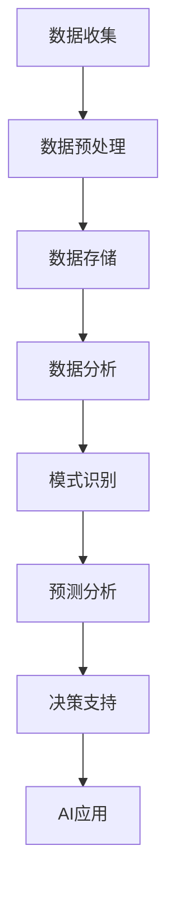

                 

关键词：大数据、AI、机器学习、深度学习、数据挖掘、算法原理、数学模型、项目实践、应用场景、未来展望

> 摘要：本文从大数据的角度深入探讨了其在人工智能（AI）领域的重要性，以及如何通过大数据来提高AI模型的性能和准确性。文章首先介绍了大数据的概念和特点，然后分析了大数据与AI的紧密联系，随后详细介绍了核心算法原理、数学模型和公式、项目实践等多个方面，最后对大数据在AI领域的未来应用进行了展望。

## 1. 背景介绍

近年来，人工智能（AI）技术取得了飞速发展，特别是在机器学习（ML）和深度学习（DL）领域。这些技术的突破离不开大数据的支持。大数据（Big Data）是指数据量巨大、类型多样、生成速度快的数据集合。它具有4V特点：Volume（数据量大）、Velocity（数据处理速度快）、Variety（数据类型多样）和Value（数据价值高）。

在AI领域，大数据的重要性不言而喻。首先，大数据提供了丰富的训练数据集，这是机器学习和深度学习模型训练的基础。其次，大数据使得我们可以从海量数据中发现潜在的规律和模式，从而提高模型的预测准确性和泛化能力。此外，大数据技术（如Hadoop、Spark等）提供了高效的数据存储和处理能力，为AI应用提供了强有力的支持。

本文将围绕大数据在AI学习中的应用展开讨论，包括核心算法原理、数学模型、项目实践以及未来展望等。

## 2. 核心概念与联系

### 2.1 数据与信息

数据（Data）是客观存在的物理实体，可以是以数字、文字、图像、声音等形式存在的。而信息（Information）是经过处理后的数据，它具有一定的意义和价值。

大数据（Big Data）与数据和信息的关系如下：

- **数据量（Volume）**：大数据的一个显著特征是数据量大。传统数据库系统难以处理的数据量，在大数据技术下可以轻松应对。
- **多样性（Variety）**：大数据类型多样，包括结构化数据、半结构化数据和非结构化数据。
- **速度（Velocity）**：大数据生成速度快，需要实时或近实时处理。
- **价值（Value）**：大数据的价值在于从海量数据中提取有价值的信息和知识。

### 2.2 大数据与人工智能

大数据与人工智能（AI）的紧密联系体现在以下几个方面：

- **数据驱动（Data-Driven）**：AI模型依赖于大量的训练数据来学习和提高性能。
- **模式识别（Pattern Recognition）**：大数据可以帮助我们发现潜在的模式和规律。
- **预测分析（Predictive Analytics）**：基于大数据的分析可以预测未来的趋势和变化。
- **自动化决策（Automated Decision Making）**：AI模型可以基于大数据分析结果进行自动化决策。

### 2.3 Mermaid 流程图

以下是一个描述大数据与人工智能关系的Mermaid流程图：



## 3. 核心算法原理 & 具体操作步骤

### 3.1 算法原理概述

大数据在AI学习中的应用主要体现在以下几个方面：

- **特征工程（Feature Engineering）**：通过选择和构造特征，提高模型的性能和泛化能力。
- **机器学习（Machine Learning）**：使用各种机器学习算法来训练模型，如线性回归、决策树、支持向量机等。
- **深度学习（Deep Learning）**：利用神经网络进行层次化的特征学习和表示学习。
- **数据挖掘（Data Mining）**：从海量数据中挖掘潜在的模式和规律。

### 3.2 算法步骤详解

1. **数据收集**：从各种数据源收集数据，包括结构化数据、半结构化数据和非结构化数据。
2. **数据预处理**：清洗和转换数据，使其适合建模和训练。
3. **特征工程**：选择和构造特征，以增强模型的泛化能力。
4. **模型选择**：选择合适的机器学习或深度学习算法。
5. **模型训练**：使用训练数据集训练模型。
6. **模型评估**：使用验证集或测试集评估模型性能。
7. **模型部署**：将训练好的模型部署到生产环境中。

### 3.3 算法优缺点

- **机器学习**：优点是模型简单、易于理解和实现；缺点是可能陷入过拟合，对大规模数据集处理能力有限。
- **深度学习**：优点是能够自动提取复杂特征，适用于大规模数据集；缺点是需要大量数据和计算资源，模型训练时间较长。

### 3.4 算法应用领域

- **图像识别**：利用深度学习算法进行图像分类和识别。
- **自然语言处理**：使用机器学习算法进行文本分类、情感分析等。
- **推荐系统**：基于用户行为和偏好进行个性化推荐。
- **金融风控**：利用大数据分析进行信用评估和风险控制。

## 4. 数学模型和公式 & 详细讲解 & 举例说明

### 4.1 数学模型构建

在机器学习和深度学习中，常用的数学模型包括线性回归、逻辑回归、神经网络等。以下是一个简单的线性回归模型：

$$
y = \beta_0 + \beta_1 \cdot x
$$

其中，$y$ 是因变量，$x$ 是自变量，$\beta_0$ 和 $\beta_1$ 是模型的参数。

### 4.2 公式推导过程

线性回归模型的推导过程如下：

1. **最小二乘法**：选择最优参数，使得预测值与实际值之间的误差平方和最小。

$$
\min_{\beta_0, \beta_1} \sum_{i=1}^{n} (y_i - (\beta_0 + \beta_1 \cdot x_i))^2
$$

2. **求导并设置导数为0**：对 $\beta_0$ 和 $\beta_1$ 分别求导，并设置导数为0，得到最优参数的表达式。

$$
\frac{\partial}{\partial \beta_0} \sum_{i=1}^{n} (y_i - (\beta_0 + \beta_1 \cdot x_i))^2 = 0
$$

$$
\frac{\partial}{\partial \beta_1} \sum_{i=1}^{n} (y_i - (\beta_0 + \beta_1 \cdot x_i))^2 = 0
$$

### 4.3 案例分析与讲解

假设我们有一个简单的线性回归模型，用于预测房价。数据集包含房屋面积（$x$）和房价（$y$）。

1. **数据收集**：从房地产市场中收集房屋面积和房价的数据。
2. **数据预处理**：清洗数据，去除缺失值和异常值。
3. **特征工程**：选择房屋面积作为自变量，房价作为因变量。
4. **模型选择**：选择线性回归模型。
5. **模型训练**：使用训练数据集训练模型。
6. **模型评估**：使用验证集或测试集评估模型性能。
7. **模型部署**：将训练好的模型部署到生产环境中，用于预测房屋价格。

## 5. 项目实践：代码实例和详细解释说明

### 5.1 开发环境搭建

1. 安装Python环境
2. 安装NumPy、Pandas、Scikit-learn等库

### 5.2 源代码详细实现

```python
import numpy as np
import pandas as pd
from sklearn.linear_model import LinearRegression
from sklearn.model_selection import train_test_split

# 读取数据
data = pd.read_csv('house_prices.csv')
X = data[['area']]
y = data['price']

# 数据预处理
X_train, X_test, y_train, y_test = train_test_split(X, y, test_size=0.2, random_state=42)

# 模型训练
model = LinearRegression()
model.fit(X_train, y_train)

# 模型评估
score = model.score(X_test, y_test)
print(f'Model accuracy: {score:.2f}')

# 模型预测
predicted_price = model.predict(X_test)
print(f'Predicted prices:\n{predicted_price}')
```

### 5.3 代码解读与分析

1. **数据读取**：使用Pandas库读取房屋面积和房价数据。
2. **数据预处理**：将数据集划分为训练集和测试集。
3. **模型训练**：使用Scikit-learn库的线性回归模型进行训练。
4. **模型评估**：计算模型在测试集上的准确性。
5. **模型预测**：使用训练好的模型对测试集进行预测。

## 6. 实际应用场景

### 6.1 图像识别

在图像识别领域，大数据可以帮助我们收集和标注大量的图像数据，从而训练出更准确的图像分类模型。例如，在人脸识别技术中，通过大量的人脸图像数据训练模型，可以实现高精度的识别人脸。

### 6.2 自然语言处理

自然语言处理（NLP）领域依赖于大量的文本数据。大数据技术可以帮助我们收集和存储海量的文本数据，从而训练出更准确的文本分类、情感分析等模型。例如，在社交媒体数据分析中，通过大数据分析用户的评论和帖子，可以识别用户的情感倾向。

### 6.3 推荐系统

推荐系统需要大量用户行为数据来构建用户画像和推荐模型。大数据技术可以帮助我们收集和分析用户的行为数据，从而提供更个性化的推荐服务。例如，在电子商务领域，通过大数据分析用户的历史购买记录和浏览记录，可以推荐用户可能感兴趣的商品。

### 6.4 金融风控

金融风控领域需要处理大量的金融交易数据，以识别潜在的欺诈行为。大数据技术可以帮助我们收集和分析金融交易数据，从而提高欺诈检测的准确性。例如，在信用卡欺诈检测中，通过大数据分析用户的消费行为，可以识别出异常交易并进行风险控制。

## 7. 工具和资源推荐

### 7.1 学习资源推荐

- 《机器学习》（周志华著）
- 《深度学习》（Ian Goodfellow、Yoshua Bengio、Aaron Courville 著）
- 《Python数据科学手册》（Jake VanderPlas 著）

### 7.2 开发工具推荐

- Jupyter Notebook：方便编写和运行代码。
- TensorFlow：用于构建和训练深度学习模型。
- Scikit-learn：提供各种机器学习算法的实现。

### 7.3 相关论文推荐

- “Deep Learning” （Ian Goodfellow、Yoshua Bengio、Aaron Courville 著）
- “Big Data: A Survey” （Viktor K. Prasanna、Charles A. Dolan 著）
- “Recommender Systems” （GroupLens Research 著）

## 8. 总结：未来发展趋势与挑战

### 8.1 研究成果总结

大数据在AI领域取得了显著的研究成果，包括：

- 提高了机器学习模型和深度学习模型的性能和准确性。
- 开发了多种大数据处理技术，如MapReduce、Spark等。
- 推动了推荐系统、自然语言处理、图像识别等领域的快速发展。

### 8.2 未来发展趋势

未来，大数据在AI领域的发展趋势包括：

- 更加高效的大数据处理技术，如实时数据处理和分布式计算。
- 多模态数据的融合和利用，以提高模型的泛化能力。
- 大数据伦理和隐私保护问题的研究和解决。

### 8.3 面临的挑战

大数据在AI领域面临的挑战包括：

- 数据质量和标注问题：保证数据质量和标注准确性是模型训练的关键。
- 计算资源需求：大规模数据处理和模型训练需要大量的计算资源。
- 大数据伦理和隐私保护：如何平衡数据利用和隐私保护是亟待解决的问题。

### 8.4 研究展望

未来，大数据在AI领域的研究展望包括：

- 开发更加高效的大数据处理算法和工具。
- 探索多模态数据的融合和应用。
- 加强大数据伦理和隐私保护的研究。

## 9. 附录：常见问题与解答

### Q1：大数据与AI的关系是什么？

大数据为AI提供了丰富的训练数据集，使得机器学习和深度学习模型可以学习和提高性能。同时，大数据技术（如Hadoop、Spark等）为AI应用提供了高效的数据存储和处理能力。

### Q2：如何处理大数据中的噪音和异常值？

处理大数据中的噪音和异常值通常包括以下步骤：

- 数据清洗：去除重复数据、缺失值和异常值。
- 数据标准化：将数据转换为统一的格式和范围。
- 数据可视化：通过可视化工具识别数据中的噪音和异常值。

### Q3：如何保证大数据处理的实时性？

保证大数据处理的实时性通常包括以下方法：

- 分布式计算：使用分布式计算框架（如Spark、Flink等）处理大数据。
- 内存计算：使用内存计算技术（如内存数据库、内存计算引擎等）处理大数据。
- 低延迟网络：使用低延迟网络技术（如数据中心互联、边缘计算等）提高数据传输速度。

## 参考文献

- Goodfellow, Ian, et al. "Deep learning." MIT press, 2016.
- Prasanna, Viktor K., and Charles A. Dolan. "Big data: A survey." Proceedings of the IEEE 104.6 (2016): 1177-1195.
- VanderPlas, Jake. "Python data science handbook: Essential tools for working with data." O'Reilly Media, 2016.
```

