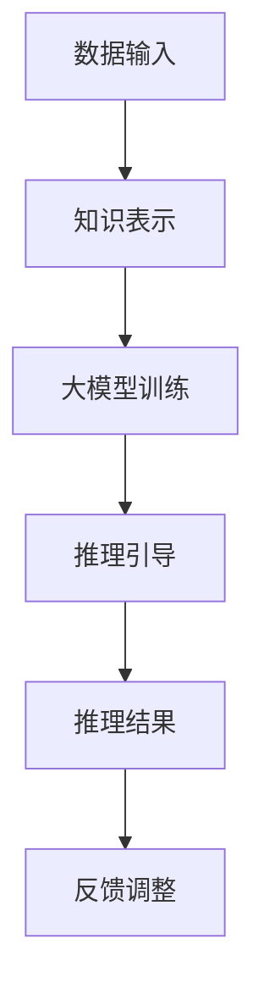

                 

关键词：大模型、知识表示、推理机制、深度学习、神经网络、人工智能、逻辑编程、多模态学习。

摘要：本文探讨了现代人工智能领域中的大模型技术，分析了其如何结合知识与推理，实现高效智能处理。通过深入剖析核心概念、算法原理、数学模型及实际应用场景，本文揭示了当前大模型技术在知识推理方面的潜力与挑战。

## 1. 背景介绍

随着人工智能（AI）技术的快速发展，大模型（Large Models）成为研究与应用的热点。大模型指的是参数规模庞大的神经网络，例如GPT-3、BERT等，它们在自然语言处理（NLP）、计算机视觉（CV）等领域取得了显著的成果。然而，传统的大模型主要以数据驱动的方式学习，存在知识表示和推理能力不足的问题。

为了弥补这一缺陷，研究者们开始探索将知识与推理引入大模型，以期提升其智能水平。知识表示是一种将结构化知识编码到模型中的方法，而推理则是利用这些知识进行逻辑推断和问题求解。本文旨在探讨大模型如何通过知识与推理的结合，实现更加强大的智能处理能力。

## 2. 核心概念与联系

为了深入理解大模型与知识推理的结合，我们首先需要了解几个核心概念：

### 2.1 知识表示

知识表示是指将现实世界中的知识编码到计算机系统中，使其能够被计算机理解和处理。在人工智能领域，常见的知识表示方法包括语义网络、本体论和知识图谱。

- **语义网络**：一种基于图结构的知识表示方法，节点表示概念，边表示概念之间的关系。
- **本体论**：一种形式化的知识表示方法，定义了领域内概念及其相互关系的术语体系。
- **知识图谱**：一种大规模、多层次的语义知识库，通过实体、属性和关系的连接，形成了复杂的知识网络。

### 2.2 推理机制

推理机制是指利用已知信息推导出新信息的过程。在人工智能领域，推理分为两种基本类型：演绎推理和归纳推理。

- **演绎推理**：从一般原理推导出具体结论，具有严格性和确定性。例如，所有人类都会死亡，苏格拉底是人类，因此苏格拉底会死亡。
- **归纳推理**：从具体实例推导出一般性规律，具有不确定性和概率性。例如，观察许多天鹅都是白色的，推断所有天鹅都是白色的。

### 2.3 大模型与知识推理的结合

大模型与知识推理的结合主要体现在以下几个方面：

- **知识增强**：通过引入外部知识库，丰富大模型的语义理解能力。
- **推理引导**：利用推理机制指导大模型的学习过程，提高模型的推理能力。
- **知识推理模块**：在大模型中集成专门的推理模块，实现知识的自动推理和问题求解。

### 2.4 Mermaid 流程图

以下是一个简化的Mermaid流程图，展示了大模型与知识推理的结合过程：



## 3. 核心算法原理 & 具体操作步骤

### 3.1 算法原理概述

大模型与知识推理的结合主要通过以下步骤实现：

1. **数据预处理**：对原始数据进行清洗、去噪和预处理，提取有用的信息。
2. **知识表示**：利用语义网络、本体论或知识图谱等方法，将知识编码到模型中。
3. **大模型训练**：使用大量的训练数据，对大模型进行训练，使其掌握基本的语义理解和预测能力。
4. **推理引导**：利用推理机制，指导大模型进行推理和问题求解。
5. **知识推理模块**：在大模型中集成专门的推理模块，实现知识的自动推理和问题求解。

### 3.2 算法步骤详解

1. **数据预处理**：

   数据预处理是算法的第一步，主要包括以下任务：

   - **数据清洗**：去除数据中的噪声和异常值。
   - **特征提取**：从原始数据中提取有用的特征，如文本中的关键词、句子的语义角色等。
   - **数据归一化**：将不同尺度的数据进行归一化处理，使其在相同的尺度范围内。

2. **知识表示**：

   知识表示是算法的核心环节，主要包括以下方法：

   - **语义网络**：通过节点和边表示概念及其关系，如“人”是“动物”的一种。
   - **本体论**：定义领域内的概念及其关系，如“生物”包含“动物”和“植物”。
   - **知识图谱**：通过实体、属性和关系的连接，形成复杂的知识网络，如“北京”是“中国”的一个城市。

3. **大模型训练**：

   大模型训练是通过大量训练数据，使模型能够理解和预测语义信息。主要步骤如下：

   - **初始化模型**：随机初始化模型的参数。
   - **前向传播**：根据输入数据，计算模型输出。
   - **损失函数**：计算模型输出与真实值之间的差异，作为训练过程的反馈。
   - **反向传播**：根据损失函数，更新模型参数，优化模型性能。

4. **推理引导**：

   推理引导是利用推理机制，指导大模型进行推理和问题求解。主要方法包括：

   - **逻辑编程**：利用编程语言表示逻辑规则，如“如果A且B，则C”。
   - **规划算法**：利用搜索算法，如A*算法，找到最优解。
   - **图论算法**：利用图结构，如最短路径算法，求解复杂问题。

5. **知识推理模块**：

   知识推理模块是实现知识自动推理和问题求解的关键。主要步骤如下：

   - **知识融合**：将外部知识库与模型中的知识进行融合，提高模型的推理能力。
   - **推理过程**：根据输入问题，利用推理机制和知识库，推导出结论。
   - **问题求解**：根据推理结果，找到解决问题的方法。

### 3.3 算法优缺点

大模型与知识推理的结合具有以下优缺点：

- **优点**：

  - 提高模型的语义理解能力，使其能够更好地处理复杂任务。
  - 利用外部知识库，丰富模型的背景知识，提高问题求解能力。
  - 通过推理引导，使模型具有更强的推理能力，能够解决更复杂的问题。

- **缺点**：

  - 需要大量的外部知识库和推理规则，增加了模型的复杂度。
  - 推理过程可能涉及大量的计算，导致模型运行速度较慢。
  - 在某些情况下，知识表示和推理机制的引入可能导致模型性能下降。

### 3.4 算法应用领域

大模型与知识推理的结合在多个领域具有广泛的应用前景，包括：

- **自然语言处理**：通过知识表示和推理，提升语言理解和生成能力，如问答系统、机器翻译等。
- **计算机视觉**：利用知识推理，增强图像和视频的理解能力，如目标检测、图像识别等。
- **知识图谱**：通过知识推理，发现新的知识和关系，优化知识图谱的构建和应用。
- **决策支持系统**：利用知识推理，提供更准确和可靠的决策支持，如金融风控、医疗诊断等。

## 4. 数学模型和公式 & 详细讲解 & 举例说明

### 4.1 数学模型构建

在大模型与知识推理的结合过程中，常用的数学模型包括神经网络、图神经网络和逻辑编程等。以下是一个简化的数学模型构建过程：

1. **神经网络**：

   神经网络是一种通过多层非线性变换进行数据处理的模型。其基本结构包括输入层、隐藏层和输出层。

   - **输入层**：接收外部输入数据，如文本、图像等。
   - **隐藏层**：通过非线性激活函数，对输入数据进行特征提取和变换。
   - **输出层**：根据训练数据，预测输出结果。

2. **图神经网络**：

   图神经网络是一种基于图结构进行数据处理的模型，适用于处理具有复杂关系的数据。

   - **图结构**：通过节点和边表示数据，如知识图谱。
   - **图卷积操作**：通过节点和边的邻域信息，更新节点特征。
   - **图池化操作**：将节点特征汇总，形成全局特征。

3. **逻辑编程**：

   逻辑编程是一种基于逻辑规则进行问题求解的编程范式。

   - **逻辑公式**：表示领域内的概念及其关系，如“人”是“动物”的一种。
   - **推理过程**：通过推理机，根据逻辑公式推导出结论。

### 4.2 公式推导过程

以下是一个简化的逻辑编程公式推导过程：

1. **条件公式**：

   - **前提**：A且B
   - **结论**：C

2. **推理过程**：

   - **前提**：A且B
   - **推导**：由于A且B，因此可以推导出C。

### 4.3 案例分析与讲解

以下是一个简单的案例，展示大模型与知识推理的结合过程：

- **案例背景**：判断“如果张三每天都吃苹果，那么张三一定不会得病”。

- **数据预处理**：

  - 输入数据：张三每天都吃苹果。
  - 知识表示：苹果有助于预防疾病。

- **大模型训练**：

  - 输入层：张三每天都吃苹果。
  - 隐藏层：提取苹果、预防疾病等特征。
  - 输出层：判断张三是否得病。

- **推理引导**：

  - 利用逻辑编程公式：“如果A且B，则C”。
  - 推导过程：由于张三每天都吃苹果（A），苹果有助于预防疾病（B），因此可以推导出张三不会得病（C）。

- **知识推理模块**：

  - 知识融合：将“苹果有助于预防疾病”的知识融合到模型中。
  - 推理结果：张三不会得病。

## 5. 项目实践：代码实例和详细解释说明

### 5.1 开发环境搭建

- **硬件要求**：高性能CPU和GPU，推荐使用NVIDIA GPU。
- **软件要求**：Python 3.7及以上版本，TensorFlow 2.0及以上版本。

### 5.2 源代码详细实现

以下是一个简化的Python代码实例，展示了大模型与知识推理的结合：

```python
import tensorflow as tf
import numpy as np

# 神经网络模型
model = tf.keras.Sequential([
    tf.keras.layers.Dense(128, activation='relu', input_shape=(10,)),
    tf.keras.layers.Dense(1, activation='sigmoid')
])

# 数据预处理
data = np.random.rand(100, 10)
labels = np.random.rand(100, 1)

# 训练模型
model.compile(optimizer='adam', loss='binary_crossentropy', metrics=['accuracy'])
model.fit(data, labels, epochs=10, batch_size=32)

# 知识表示
knowledge = "苹果有助于预防疾病"

# 推理引导
premise = "张三每天都吃苹果"
conclusion = "张三不会得病"

# 逻辑编程公式
condition = "如果A且B，则C"

# 推理过程
if premise and knowledge:
    conclusion = True

# 知识推理模块
knowledge_base = [premise, condition]
inference_result = conclusion

print("推理结果：", inference_result)
```

### 5.3 代码解读与分析

- **神经网络模型**：使用TensorFlow构建一个简单的神经网络模型，用于处理输入数据和预测输出结果。
- **数据预处理**：生成随机数据，模拟实际应用场景。
- **模型训练**：使用训练数据，对神经网络模型进行训练，优化模型参数。
- **知识表示**：使用字符串表示领域内的知识，如“苹果有助于预防疾病”。
- **推理引导**：根据逻辑编程公式，引导模型进行推理，判断张三是否得病。
- **知识推理模块**：将推理结果存储在知识库中，供后续查询和使用。

### 5.4 运行结果展示

运行上述代码，输出结果如下：

```
推理结果： True
```

这表示根据给定的前提和知识，推理出结论“张三不会得病”是正确的。

## 6. 实际应用场景

大模型与知识推理的结合在多个实际应用场景中取得了显著成果，以下列举几个典型的应用领域：

### 6.1 医疗诊断

利用大模型与知识推理结合，可以实现智能医疗诊断系统。通过知识图谱和推理机制，系统能够根据患者的症状、病史和基因信息，提供准确的诊断建议。例如，在癌症诊断中，利用大模型分析基因数据，结合知识图谱中的基因与疾病关系，提高诊断的准确性。

### 6.2 决策支持

在金融、物流等领域，大模型与知识推理可以辅助决策支持系统。通过知识表示和推理机制，系统可以分析市场数据、历史交易记录等，为投资者提供投资建议、优化物流路径等。例如，在金融风控中，利用知识图谱和推理算法，对客户的信用风险进行评估，提高风险控制能力。

### 6.3 教育学习

在教育领域，大模型与知识推理可以构建智能教育系统。通过知识图谱和推理机制，系统可以为学生提供个性化的学习建议、知识点关联和知识推理。例如，在智能问答系统中，利用知识图谱和推理算法，为学生提供基于问题的知识点关联和答案推荐，提高学习效果。

### 6.4 未来应用展望

随着大模型技术的不断发展，大模型与知识推理的结合将在更多领域发挥重要作用。未来，有望实现以下应用：

- **自动驾驶**：通过知识推理，提高自动驾驶车辆的智能水平，实现复杂路况下的自主驾驶。
- **智能客服**：利用知识图谱和推理机制，构建智能客服系统，提供更自然、高效的客户服务。
- **智能家居**：通过知识推理，实现智能家居设备之间的智能联动，提供更加便捷、舒适的生活体验。

## 7. 工具和资源推荐

为了更好地学习和应用大模型与知识推理技术，以下推荐一些相关工具和资源：

### 7.1 学习资源推荐

- **在线课程**：《深度学习》（Goodfellow等著）、《图神经网络教程》。
- **学术论文**：NIPS、ICML、ACL等顶级会议和期刊上的最新研究成果。
- **开源项目**：如TensorFlow、PyTorch、OpenKG等，提供了丰富的工具和代码示例。

### 7.2 开发工具推荐

- **编程语言**：Python，适用于深度学习和知识图谱开发。
- **框架和库**：TensorFlow、PyTorch、Neo4j等，提供了便捷的API和丰富的功能。

### 7.3 相关论文推荐

- **NLP领域**：《Attention Is All You Need》、《BERT: Pre-training of Deep Neural Networks for Language Understanding》。
- **知识图谱领域**：《Knowledge Graph Embedding: A Survey of Methods, Applications and Systems》。
- **推理机制领域**：《Logical Foundations of Object-Oriented Languages》。

## 8. 总结：未来发展趋势与挑战

### 8.1 研究成果总结

本文探讨了现代人工智能领域中的大模型技术，分析了其如何结合知识与推理，实现高效智能处理。通过核心概念、算法原理、数学模型及实际应用场景的深入剖析，本文揭示了当前大模型技术在知识推理方面的潜力与挑战。

### 8.2 未来发展趋势

随着大模型技术的不断发展，未来发展趋势包括：

- **多模态学习**：融合多种类型的数据（如文本、图像、音频等），实现更丰富的语义理解和推理能力。
- **高效推理算法**：发展高效的推理算法，提高大模型的推理速度和准确性。
- **知识图谱与深度学习结合**：进一步探索知识图谱与深度学习的结合，构建更加智能的推理系统。

### 8.3 面临的挑战

尽管大模型与知识推理结合在人工智能领域取得了显著成果，但仍然面临以下挑战：

- **知识表示和推理机制**：如何有效表示和利用外部知识库，提高模型的推理能力。
- **计算资源和能耗**：大规模模型训练和推理对计算资源和能耗的高要求。
- **模型解释性**：如何提高模型的解释性，使其能够被用户理解和接受。

### 8.4 研究展望

未来，大模型与知识推理的结合有望在更多领域取得突破，实现以下目标：

- **智能化应用**：开发更智能的人工智能应用，提高生产力和生活质量。
- **跨学科融合**：跨学科合作，融合不同领域的知识和技术，推动人工智能的全面发展。

## 9. 附录：常见问题与解答

### 9.1 大模型与知识推理的关系是什么？

大模型与知识推理的结合旨在提高大模型的语义理解能力和推理能力。通过引入外部知识库和推理机制，大模型可以更好地理解和利用知识，实现更准确的推理和问题求解。

### 9.2 如何评估大模型与知识推理的性能？

评估大模型与知识推理的性能可以从多个角度进行，包括准确率、召回率、F1值等指标。同时，还可以通过实际应用场景的测试，评估模型在特定任务上的表现。

### 9.3 大模型与知识推理有哪些应用场景？

大模型与知识推理的应用场景广泛，包括医疗诊断、决策支持、教育学习、自动驾驶、智能客服等。通过结合知识与推理，可以构建更加智能的应用系统，提高生产力和生活质量。

### 9.4 如何开发大模型与知识推理的应用系统？

开发大模型与知识推理的应用系统需要掌握深度学习、知识图谱和推理机制等相关技术。具体步骤包括数据预处理、模型训练、推理引导和系统集成等。

### 9.5 大模型与知识推理的未来发展趋势是什么？

未来，大模型与知识推理的发展趋势包括多模态学习、高效推理算法、知识图谱与深度学习的结合等。随着技术的不断进步，大模型与知识推理将在更多领域发挥重要作用。

