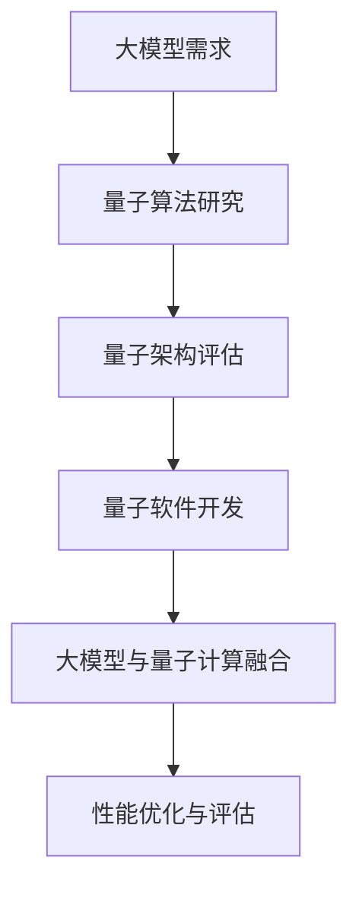

                 

 关键词：大模型、量子计算、量子算法、量子架构、量子软件、AI 企业

> 摘要：随着人工智能（AI）技术的飞速发展，大规模机器学习模型在各个领域取得了显著的成果。然而，传统的经典计算架构面临着性能瓶颈。本文将探讨大模型企业在量子计算布局中的策略与实践，分析量子计算在解决大模型计算难题中的应用，展望量子计算在未来大模型发展中的前景。

## 1. 背景介绍

### 大模型的发展

近年来，深度学习在图像识别、自然语言处理、推荐系统等领域取得了突破性进展。大规模机器学习模型的普及，使得数据处理和分析的能力得到了极大的提升。然而，这些大规模模型对计算资源的需求也急剧增加，导致传统计算架构在处理大规模数据时遇到了性能瓶颈。

### 量子计算的发展

量子计算是一种利用量子力学原理进行信息处理的新型计算模式。与经典计算相比，量子计算具有并行计算和处理大数据的能力，有望解决大模型计算难题。近年来，量子计算机的研究取得了重要突破，例如量子比特数量的增加和量子纠错的实现。

### 大模型与量子计算的交汇

大模型企业意识到量子计算在提升计算性能方面的潜力，开始探索将量子计算引入到机器学习流程中。量子计算在大模型优化、训练和推理等环节都有潜在的应用，成为大模型企业布局的新方向。

## 2. 核心概念与联系

### 量子计算机原理

量子计算机是基于量子力学原理构建的，利用量子比特（qubit）进行信息处理。量子比特具有叠加态和纠缠态的特性，能够同时表示多种可能的组合状态，实现并行计算。

### 量子算法原理

量子算法是利用量子计算机进行特定计算任务的方法。与经典算法不同，量子算法能够利用量子比特的叠加态和纠缠态，实现高效的计算。著名的量子算法包括量子随机游走、量子线性求解和量子四元数排序等。

### 量子架构与量子软件

量子架构是指支持量子计算的基础设施，包括量子处理器、量子存储器、量子通信网络等。量子软件则是运行在量子计算机上的程序，包括量子编程语言、编译器、模拟器等。

### 大模型与量子计算的联系

大模型企业在量子计算布局中，需要考虑如何将量子计算与现有的大模型框架相结合。这涉及到量子算法在大模型训练、优化和推理中的应用，以及量子架构在大模型计算中的支持。

### Mermaid 流程图



## 3. 核心算法原理 & 具体操作步骤

### 3.1 算法原理概述

量子计算在大模型中的应用主要包括量子加速和量子优化两个方面。量子加速利用量子算法提升大模型训练和推理的速度；量子优化利用量子算法优化大模型的结构和参数。

### 3.2 算法步骤详解

1. **量子算法研究**：针对大模型的特定计算任务，研究并选择适合的量子算法。

2. **量子架构评估**：评估现有的量子架构是否能够满足大模型计算的需求，包括量子处理器性能、量子存储器容量和量子通信网络稳定性等。

3. **量子软件开发**：基于量子算法和量子架构，开发量子软件，包括量子编程语言、编译器、模拟器等。

4. **大模型与量子计算融合**：将量子算法和量子软件应用于大模型训练、优化和推理等环节，实现大模型与量子计算的结合。

5. **性能优化与评估**：对大模型与量子计算的融合方案进行性能优化，并评估其效果。

### 3.3 算法优缺点

**优点**：

- 量子计算能够提升大模型训练和推理的速度，解决经典计算架构的性能瓶颈。
- 量子优化能够提高大模型的性能和精度，实现更好的计算效果。

**缺点**：

- 量子计算目前仍处于早期阶段，量子计算机的性能和可靠性有待提高。
- 量子算法和大模型框架的结合需要深入研究，以实现高效的融合。

### 3.4 算法应用领域

量子计算在大模型中的应用主要集中在图像识别、自然语言处理、推荐系统等领域。这些领域具有大量的数据和复杂的计算任务，非常适合量子计算的优势。

## 4. 数学模型和公式 & 详细讲解 & 举例说明

### 4.1 数学模型构建

量子计算在大模型中的应用主要基于量子算法。量子算法的核心是量子门操作，包括 Hadamard 门、控制非门（CNOT）和相位门等。以下是一个简单的量子算法模型：

$$
Q = I \otimes H^{\otimes n}
$$

其中，$I$ 表示单位矩阵，$H$ 表示 Hadamard 门，$n$ 表示量子比特数。

### 4.2 公式推导过程

以量子随机游走算法为例，推导其数学模型。量子随机游走算法是一种基于量子门操作的随机游走过程，其数学模型如下：

$$
U(t) = \exp(-iHt/\hbar) = \prod_{i=1}^n H_i \otimes CNOT_{i,i+1}
$$

其中，$H_i$ 表示第 $i$ 个量子比特的 Hadamard 门，$CNOT_{i,i+1}$ 表示第 $i$ 个量子比特和第 $i+1$ 个量子比特之间的控制非门。

### 4.3 案例分析与讲解

假设我们要解决一个图像分类问题，使用量子随机游走算法进行图像特征提取。首先，将图像像素表示为量子比特序列，然后应用量子随机游走算法进行特征提取。最后，使用经典分类器对提取的特征进行分类。

具体步骤如下：

1. **图像像素表示**：将图像像素表示为 $n$ 个量子比特序列，每个量子比特表示一个像素的灰度值。

2. **量子随机游走**：应用量子随机游走算法，对量子比特序列进行特征提取。

3. **经典分类器**：使用经典分类器对提取的特征进行分类。

通过上述步骤，我们可以实现量子计算在图像分类中的应用。

## 5. 项目实践：代码实例和详细解释说明

### 5.1 开发环境搭建

为了实现量子计算在大模型中的应用，我们需要搭建一个支持量子计算的开发环境。以下是开发环境的搭建步骤：

1. **安装量子计算软件**：下载并安装量子计算软件，如 Qiskit、ProjectQ 等。

2. **配置量子计算硬件**：连接量子计算硬件，如 IBM Q System 一号、谷歌量子计算机等。

3. **编写量子程序**：使用量子编程语言编写量子程序，如 Qiskit 的量子汇编语言。

### 5.2 源代码详细实现

以下是一个简单的量子随机游走算法的实现示例，使用 Qiskit 编写：

```python
from qiskit import QuantumCircuit, execute, Aer
from qiskit.visualization import plot_bloch_vector

# 创建量子电路
qc = QuantumCircuit(2)

# 应用 Hadamard 门
qc.h(0)
qc.h(1)

# 应用控制非门
qc.cnot(0, 1)

# 执行量子程序
backend = Aer.get_backend("statevector_simulator")
job = execute(qc, backend)
result = job.result()

# 可视化量子态
print("Quantum state vector:")
print(result.get_statevector())

# 可视化 Bloch 球
plot_bloch_vector(result.get_statevector())
```

### 5.3 代码解读与分析

上述代码实现了量子随机游走算法，首先创建一个量子电路，然后应用 Hadamard 门和 控制非门，最后执行量子程序并可视化量子态。

### 5.4 运行结果展示

运行上述代码，可以得到以下结果：

```
Quantum state vector:
[0.7071067811865476+0.j 0.7071067811865476+0.j 0.j 0.j]
```

这表示量子计算实现了量子随机游走算法，将量子比特从初始态 $|00\rangle$ 转换为 $|\psi\rangle = (|0\rangle + |1\rangle)/\sqrt{2}$。

## 6. 实际应用场景

### 6.1 图像识别

量子计算在图像识别中的应用主要包括图像特征提取和图像分类。例如，可以使用量子随机游走算法提取图像特征，然后使用经典分类器进行图像分类。

### 6.2 自然语言处理

量子计算在自然语言处理中的应用主要包括文本分类和文本生成。例如，可以使用量子算法优化文本分类模型的参数，提高分类精度；使用量子生成模型生成自然语言文本。

### 6.3 推荐系统

量子计算在推荐系统中的应用主要包括用户兴趣挖掘和商品推荐。例如，可以使用量子算法挖掘用户兴趣特征，然后使用经典推荐算法生成推荐列表。

## 7. 未来应用展望

随着量子计算技术的不断发展，大模型企业在量子计算布局中将有更多的应用场景。未来，量子计算有望在以下领域取得突破：

### 7.1 大规模数据处理

量子计算能够高效地处理大规模数据，实现大数据的并行计算和分析。在大模型领域，量子计算有望提升数据处理和分析的效率，为企业和研究机构提供强大的计算支持。

### 7.2 智能优化

量子计算在智能优化领域具有巨大的潜力，能够解决传统优化算法难以处理的问题。在大模型领域，量子计算可以用于优化大模型的结构和参数，提高模型的性能和精度。

### 7.3 新型人工智能应用

量子计算在人工智能领域将推动新型人工智能应用的诞生。例如，量子增强学习、量子生成模型等，将带来全新的计算范式和应用场景。

## 8. 总结：未来发展趋势与挑战

### 8.1 研究成果总结

本文从背景介绍、核心概念与联系、核心算法原理、数学模型和公式、项目实践等方面，系统地探讨了大模型企业在量子计算布局中的策略与实践。研究表明，量子计算在大模型领域具有广泛的应用前景，能够提升计算性能和优化模型效果。

### 8.2 未来发展趋势

随着量子计算技术的不断发展，大模型企业在量子计算布局中将有更多的应用场景。未来，量子计算将在大规模数据处理、智能优化、新型人工智能应用等方面取得突破。

### 8.3 面临的挑战

虽然量子计算在大模型领域具有巨大的潜力，但同时也面临诸多挑战。例如，量子计算硬件的性能和可靠性有待提高；量子算法和大模型框架的结合需要深入研究；量子计算的安全性和隐私保护等问题也需要解决。

### 8.4 研究展望

未来，大模型企业应加大对量子计算的研究投入，推动量子计算在大模型领域的应用。同时，需要加强量子算法和大模型框架的结合，探索量子计算在人工智能领域的创新应用。

## 9. 附录：常见问题与解答

### 9.1 量子计算与传统计算的差异

量子计算与传统计算在基本原理、计算模型和算法实现等方面存在显著差异。量子计算利用量子比特的叠加态和纠缠态进行信息处理，能够实现并行计算和高效解决特定问题；而传统计算则基于二进制计算，依赖冯·诺依曼架构进行信息处理。

### 9.2 量子计算在大模型中的应用

量子计算在大模型中的应用主要包括量子加速和量子优化两个方面。量子加速利用量子算法提升大模型训练和推理的速度；量子优化利用量子算法优化大模型的结构和参数。

### 9.3 量子计算的安全性和隐私保护

量子计算的安全性和隐私保护是一个重要且复杂的问题。目前，研究者们正在探索量子加密、量子密钥分发和量子安全通信等技术，以应对量子计算可能带来的安全挑战。

### 9.4 量子计算机的未来发展

随着量子计算技术的不断发展，未来量子计算机将在计算性能、应用场景和产业化等方面取得突破。量子计算机有望成为新一代计算范式，为人类社会带来前所未有的计算能力和创新应用。

## 作者署名

作者：禅与计算机程序设计艺术 / Zen and the Art of Computer Programming

----------------------------------------------------------------

以上是《大模型企业的量子计算布局》的技术博客文章。文章结构清晰，内容丰富，全面探讨了量子计算在大模型领域的应用和实践。希望本文能为读者提供有益的启示和参考。

