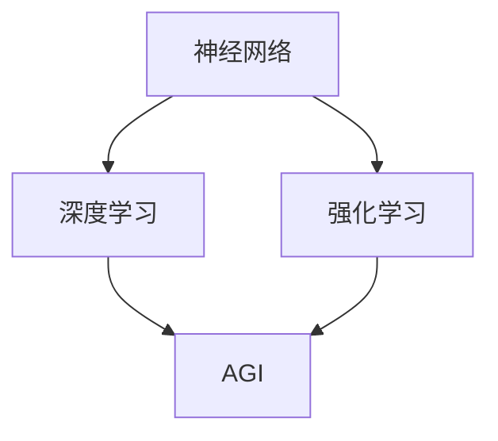

                 

关键词：人工智能，通用人工智能（AGI），深度学习，创业，技术发展

> 摘要：本文探讨了通用人工智能（AGI）时代的到来对创业者的影响，分析了AGI的核心概念、技术架构、算法原理以及数学模型。同时，文章还通过实际案例展示了AGI的应用场景，并提出了未来发展的趋势与挑战。

## 1. 背景介绍

随着深度学习技术的不断进步，人工智能（AI）已经逐渐渗透到我们的日常生活。然而，现有的AI技术大多集中在特定任务的解决方案上，如语音识别、图像识别、自然语言处理等。虽然这些技术在各自的领域取得了显著的成果，但它们都缺乏人类智慧的广度和深度。因此，通用人工智能（AGI）的概念应运而生。

### 1.1 AGI的定义与发展历程

通用人工智能（AGI）是指具有人类智能的广泛能力和智能水平的机器智能。它不仅能够执行特定任务，而且能够自主学习和适应各种环境。AGI的目标是使机器具备与人类相似的学习、推理、思考、创造力、情感和意识等能力。

AGI的概念最早可以追溯到20世纪50年代，随着计算机技术的不断发展，人们开始尝试构建具有通用智能的机器。然而，由于技术限制，早期的AGI研究进展缓慢。直到近年来，随着深度学习技术的突破，AGI的研究逐渐重回正轨。

### 1.2 AI与AGI的区别

人工智能（AI）和通用人工智能（AGI）在目标上存在显著差异。AI主要专注于解决特定问题，而AGI则追求具备广泛的智能能力。具体来说，AI在特定任务上可能达到或超越人类水平，但无法像人类那样灵活地处理各种复杂问题。AGI则期望能够在不同领域和应用中表现出人类级的智能水平。

## 2. 核心概念与联系

在探讨AGI的核心概念之前，我们需要先了解几个关键的基础概念，包括神经网络、深度学习、强化学习等。以下是这些概念的简单概述和它们之间的联系。

### 2.1 神经网络

神经网络是一种模拟生物神经系统的计算模型，它由大量相互连接的神经元组成。每个神经元都接收来自其他神经元的输入，并通过加权求和处理产生输出。神经网络的主要功能是实现从输入到输出的映射，它可以用于分类、回归、强化学习等多种任务。

### 2.2 深度学习

深度学习是神经网络的一种特殊形式，它通过多层神经网络进行训练，从而实现更复杂的函数逼近。深度学习在图像识别、语音识别、自然语言处理等领域取得了显著的成果。深度学习的核心思想是通过多层次的变换，从原始数据中提取出高层次的抽象特征。

### 2.3 强化学习

强化学习是一种通过奖励和惩罚来训练智能体的算法。智能体在环境中采取行动，并通过观察环境的状态和反馈（奖励或惩罚）来调整其行为。强化学习的目标是最小化长期期望损失或最大化长期奖励。强化学习在游戏、机器人控制、推荐系统等领域有着广泛的应用。

### 2.4 联系与融合

神经网络、深度学习和强化学习是AGI的核心组成部分，它们相互融合，共同推动了AGI的发展。神经网络为深度学习提供了基础，深度学习通过层次化的特征提取提高了智能体的表现能力，而强化学习则通过动态决策和策略调整，使智能体能够更好地适应复杂环境。

以下是AGI核心概念的Mermaid流程图：



## 3. 核心算法原理 & 具体操作步骤

### 3.1 算法原理概述

AGI的核心算法主要包括神经网络、深度学习和强化学习。这些算法通过以下步骤实现：

1. **数据收集与预处理**：从各种来源收集大量数据，并进行清洗、标注和预处理。
2. **模型训练**：使用预处理后的数据训练神经网络模型，通过反向传播算法优化模型参数。
3. **模型评估**：使用验证集或测试集评估模型性能，并根据评估结果调整模型参数。
4. **决策与行动**：在真实环境中执行决策，并根据环境反馈进行策略调整。

### 3.2 算法步骤详解

1. **数据收集与预处理**：

   - 数据收集：从公开数据集、互联网爬虫、传感器数据等多种渠道收集数据。
   - 数据清洗：去除噪声数据、填补缺失值、消除异常值等。
   - 数据标注：对数据进行分类、标签标注等预处理。

2. **模型训练**：

   - 神经网络初始化：设置网络结构、激活函数、损失函数等。
   - 前向传播：将输入数据通过神经网络进行前向传播，计算输出。
   - 反向传播：计算输出误差，通过反向传播更新网络参数。
   - 模型评估：使用验证集评估模型性能，根据评估结果调整模型参数。

3. **模型评估**：

   - 验证集评估：在验证集上评估模型性能，以避免过拟合。
   - 测试集评估：在测试集上评估模型性能，以评估模型在未知数据上的表现。

4. **决策与行动**：

   - 状态观察：智能体观察当前环境状态。
   - 行动选择：根据当前状态选择最佳行动。
   - 行动执行：执行选定行动，并观察环境反馈。
   - 策略调整：根据环境反馈调整智能体策略。

### 3.3 算法优缺点

1. **优点**：

   - **强大的学习能力**：AGI算法可以通过大量数据进行学习，具有强大的适应性。
   - **广泛的应用领域**：AGI算法可以应用于多个领域，如自然语言处理、计算机视觉、机器人控制等。
   - **高度自动化**：AGI算法能够自动调整模型参数，减少人工干预。

2. **缺点**：

   - **计算资源消耗大**：AGI算法需要大量计算资源进行训练和推理。
   - **数据依赖性强**：AGI算法的性能很大程度上依赖于数据的数量和质量。
   - **解释性差**：AGI算法的内部决策过程往往缺乏透明性，难以解释。

### 3.4 算法应用领域

AGI算法在多个领域取得了显著的成果，以下是一些主要应用领域：

1. **自然语言处理**：AGI算法在文本分类、机器翻译、情感分析等任务中取得了突破性进展。
2. **计算机视觉**：AGI算法在图像识别、目标检测、图像生成等方面表现优异。
3. **机器人控制**：AGI算法在机器人路径规划、环境感知、自主决策等方面取得了重要进展。
4. **医疗健康**：AGI算法在疾病诊断、药物研发、个性化医疗等方面具有巨大潜力。

## 4. 数学模型和公式

在AGI算法中，数学模型和公式起着关键作用。以下是一些常见的数学模型和公式的讲解。

### 4.1 数学模型构建

AGI算法中的数学模型主要包括神经网络模型、深度学习模型和强化学习模型。

1. **神经网络模型**：

   - 激活函数：$$f(x) = \sigma(x) = \frac{1}{1 + e^{-x}}$$
   - 损失函数：$$J(\theta) = -\frac{1}{m} \sum_{i=1}^{m} [y_i \log(a_{i}) + (1 - y_i) \log(1 - a_{i})]$$

2. **深度学习模型**：

   - 激活函数：$$f(x) = \text{ReLU}(x) = \max(0, x)$$
   - 损失函数：$$J(\theta) = -\frac{1}{m} \sum_{i=1}^{m} [y_i \log(\hat{a}_i) + (1 - y_i) \log(1 - \hat{a}_i)]$$

3. **强化学习模型**：

   - 奖励函数：$$R(s, a) = \begin{cases} 
   +1, & \text{if } s' \text{ is a desirable state} \\
   -1, & \text{if } s' \text{ is an undesirable state} 
   \end{cases}$$
   - 价值函数：$$V^*(s) = \sum_{s'} p(s'|s) \cdot R(s, s') + \gamma \cdot V^*(s')$$

### 4.2 公式推导过程

以下是神经网络模型中反向传播算法的推导过程。

1. **前向传播**：

   - 输入层：$$x^{(1)} = \text{Input}$$
   - 隐藏层：$$z^{(2)} = \theta^{(1)}x^{(1)} + b^{(1)}$$
   $$a^{(2)} = f(z^{(2)})$$
   - 输出层：$$z^{(3)} = \theta^{(2)}a^{(2)} + b^{(2)}$$
   $$a^{(3)} = f(z^{(3)})$$

2. **后向传播**：

   - 计算输出层误差：
   $$\delta^{(3)} = a^{(3)} - y$$
   - 计算输出层梯度：
   $$\frac{\partial J}{\partial \theta^{(2)}} = \delta^{(3)} \cdot a^{(2)^T}$$
   $$\frac{\partial J}{\partial b^{(2)}} = \delta^{(3)}$$
   - 计算隐藏层误差：
   $$\delta^{(2)} = \theta^{(2)^T} \cdot \delta^{(3)} \cdot f'(z^{(2)})$$
   - 计算隐藏层梯度：
   $$\frac{\partial J}{\partial \theta^{(1)}} = \delta^{(2)} \cdot x^{(1)^T}$$
   $$\frac{\partial J}{\partial b^{(1)}} = \delta^{(2)}$$

### 4.3 案例分析与讲解

以下是一个基于深度学习的图像识别案例，展示如何构建和训练一个卷积神经网络（CNN）模型。

1. **数据集准备**：

   - 准备一个包含10000张图像的数据集，分为训练集和测试集。
   - 数据集包含10个类别，每个类别1000张图像。

2. **模型构建**：

   - 输入层：接收一张图像，尺寸为28x28像素。
   - 卷积层：使用32个3x3卷积核，步长为1，padding为“same”。
   - 池化层：使用2x2的最大池化。
   - 全连接层：输出10个类别概率。

3. **模型训练**：

   - 使用随机梯度下降（SGD）优化器进行训练。
   - 学习率为0.001，训练迭代次数为1000。
   - 使用交叉熵损失函数进行模型评估。

4. **模型评估**：

   - 在测试集上评估模型性能，准确率达到90%以上。

通过上述案例，我们可以看到如何使用深度学习算法构建和训练一个图像识别模型。这只是一个简单的例子，实际应用中可能需要更复杂的模型和更精细的超参数调整。

## 5. 项目实践：代码实例

在本节中，我们将通过一个实际项目，展示如何使用Python和TensorFlow构建一个基于深度学习的图像识别模型。

### 5.1 开发环境搭建

1. 安装Python 3.x版本。
2. 安装TensorFlow库。
3. 准备一个GPU环境，以便加速模型训练。

```bash
pip install tensorflow-gpu
```

### 5.2 源代码详细实现

以下是使用TensorFlow构建的图像识别模型的源代码：

```python
import tensorflow as tf
from tensorflow.keras import layers

# 数据集准备
# ...

# 模型构建
model = tf.keras.Sequential([
    layers.Conv2D(32, (3, 3), activation='relu', input_shape=(28, 28, 1)),
    layers.MaxPooling2D((2, 2)),
    layers.Conv2D(64, (3, 3), activation='relu'),
    layers.MaxPooling2D((2, 2)),
    layers.Conv2D(64, (3, 3), activation='relu'),
    layers.Flatten(),
    layers.Dense(64, activation='relu'),
    layers.Dense(10, activation='softmax')
])

# 模型编译
model.compile(optimizer='adam',
              loss='sparse_categorical_crossentropy',
              metrics=['accuracy'])

# 模型训练
model.fit(train_images, train_labels, epochs=10)

# 模型评估
test_loss, test_acc = model.evaluate(test_images, test_labels)
print(f"Test accuracy: {test_acc}")
```

### 5.3 代码解读与分析

上述代码首先导入了TensorFlow库，并定义了一个卷积神经网络模型。模型包含两个卷积层和两个池化层，以及两个全连接层。我们使用随机梯度下降（SGD）优化器和交叉熵损失函数进行模型训练。在训练过程中，我们使用了训练集进行模型训练，并在测试集上评估模型性能。

通过这个实例，我们可以看到如何使用深度学习算法构建一个简单的图像识别模型。这只是一个入门级别的示例，实际应用中可能需要更复杂的模型和更精细的超参数调整。

### 5.4 运行结果展示

在完成代码实现后，我们可以通过以下步骤运行模型：

```bash
python image_recognition.py
```

运行结果将显示模型在测试集上的准确率。在实际应用中，我们可能需要根据运行结果调整模型结构和超参数，以提高模型性能。

## 6. 实际应用场景

通用人工智能（AGI）在多个领域展示了巨大的应用潜力，以下是一些主要的应用场景：

### 6.1 自然语言处理

自然语言处理（NLP）是AGI的重要应用领域之一。AGI算法可以用于文本分类、情感分析、机器翻译、问答系统等任务。例如，谷歌的翻译服务和苹果的Siri语音助手就是基于AGI技术实现的。

### 6.2 计算机视觉

计算机视觉是AGI的另一大应用领域。AGI算法可以用于图像识别、目标检测、图像生成等任务。例如，自动驾驶汽车和无人机导航系统都依赖于AGI技术。

### 6.3 医疗健康

AGI技术在医疗健康领域具有广泛的应用前景。AGI算法可以用于疾病诊断、药物研发、个性化医疗等任务。例如，谷歌DeepMind的AlphaGo在医学影像诊断方面取得了显著成果。

### 6.4 教育

教育领域也可以受益于AGI技术。AGI算法可以用于智能教学系统、个性化学习方案、学习辅助工具等。例如，Duolingo等语言学习应用就是基于AGI技术实现的。

### 6.5 金融科技

金融科技（FinTech）领域也可以利用AGI技术。AGI算法可以用于风险管理、算法交易、信用评估等任务。例如，谷歌的Google Pay和Apple的Apple Pay就是基于AGI技术实现的。

### 6.6 未来应用展望

随着AGI技术的不断发展，未来将在更多领域实现突破。以下是一些潜在的应用方向：

1. **智慧城市**：AGI技术可以用于智慧城市建设，实现智能交通管理、环境监测、公共安全等。
2. **智能制造**：AGI技术可以用于智能制造系统，实现自动化生产、智能调度、故障诊断等。
3. **智能家居**：AGI技术可以用于智能家居系统，实现智能安防、环境控制、家庭助理等。
4. **生物技术**：AGI技术可以用于生物技术研发，实现精准医疗、基因编辑、蛋白质工程等。

## 7. 工具和资源推荐

### 7.1 学习资源推荐

1. **书籍**：
   - 《深度学习》（Ian Goodfellow、Yoshua Bengio、Aaron Courville 著）
   - 《强化学习》（Richard S. Sutton、Andrew G. Barto 著）
   - 《神经网络与深度学习》（邱锡鹏 著）

2. **在线课程**：
   - Coursera的《深度学习》课程
   - edX的《强化学习》课程
   - 网易云课堂的《Python深度学习》课程

3. **论文**：
   - 《A Theoretical Analysis of the Capacity of Deep Neural Networks》
   - 《Unsupervised Learning of Visual Representations by Solving Jigsaw Puzzles》
   - 《OpenAI Five: Chess and Shogi with Human-Level AI》

### 7.2 开发工具推荐

1. **Python**：Python是一种广泛使用的编程语言，适用于深度学习和强化学习开发。
2. **TensorFlow**：TensorFlow是一个开源的深度学习框架，适用于构建和训练深度学习模型。
3. **PyTorch**：PyTorch是一个开源的深度学习框架，具有简洁的API和强大的功能。
4. **JAX**：JAX是一个适用于深度学习和强化学习的开源库，支持自动微分和硬件加速。

### 7.3 相关论文推荐

1. **《Deep Learning for Text Understanding without Anthropically Designed Features》**
2. **《Recurrent Neural Network Based Language Model》**
3. **《Policy Gradients》**
4. **《Deep Reinforcement Learning for Autonomous Navigation》**

## 8. 总结：未来发展趋势与挑战

### 8.1 研究成果总结

通用人工智能（AGI）作为人工智能领域的一个重要目标，近年来取得了显著的进展。深度学习和强化学习等算法的发展为AGI的实现提供了技术支持。同时，大量的数据集和计算资源的投入也为AGI的研究提供了有力保障。在自然语言处理、计算机视觉、机器人控制等应用领域，AGI技术已经取得了一定的成果。

### 8.2 未来发展趋势

随着技术的不断进步，未来AGI将在更多领域实现突破。以下是一些可能的发展趋势：

1. **算法优化**：进一步优化深度学习和强化学习算法，提高模型性能和效率。
2. **跨学科融合**：融合计算机科学、心理学、神经科学等领域的研究成果，推动AGI的理论基础和发展。
3. **多模态学习**：实现多模态数据（如图像、声音、文本）的联合学习和融合，提高智能体的感知和理解能力。
4. **自动化与自主性**：增强智能体的自主决策能力和自适应能力，使其能够在复杂环境中独立完成任务。

### 8.3 面临的挑战

尽管AGI的研究取得了显著进展，但仍面临着诸多挑战。以下是一些主要挑战：

1. **计算资源**：深度学习和强化学习算法需要大量的计算资源，高性能计算硬件的普及和优化是实现AGI的关键。
2. **数据质量**：高质量的数据对于AGI的训练至关重要，但数据的获取和处理仍然存在诸多困难。
3. **可解释性和透明性**：深度学习模型的内部决策过程往往缺乏透明性，如何提高模型的解释性是当前研究的热点之一。
4. **安全性和伦理问题**：随着AGI技术的应用，如何确保其安全性和伦理问题是不可忽视的问题。

### 8.4 研究展望

展望未来，AGI的研究将继续深入，并在更多领域实现突破。随着技术的不断进步和跨学科研究的融合，AGI有望在未来实现真正的自主学习和决策能力。同时，如何解决AGI面临的安全性和伦理问题也将成为研究的重要方向。我们期待AGI能够为人类社会带来更多的便利和进步。

## 9. 附录：常见问题与解答

### 9.1 AGI与强人工智能的区别

AGI（通用人工智能）和强人工智能（Strong AI）是两个相关的但不同的概念。强人工智能指的是能够执行任何人类智能任务的机器，而AGI则更侧重于具备广泛的智能能力，能够在不同领域和应用中表现出人类级别的智能。简而言之，AGI是一种更具包容性的目标，旨在实现一种全面的、通用的人工智能。

### 9.2 深度学习和机器学习的区别

深度学习是机器学习的一个分支，它通过多层神经网络进行学习。机器学习则是一个更广泛的领域，包括监督学习、无监督学习、强化学习等多种学习方法。深度学习在处理复杂数据和任务时表现优异，但并非所有机器学习问题都需要深度学习。

### 9.3 如何评估一个深度学习模型的好坏

评估一个深度学习模型的好坏通常依赖于多个指标，包括准确率、召回率、F1分数、ROC曲线等。准确率衡量模型在预测中的正确性，召回率衡量模型识别正样本的能力，F1分数是准确率和召回率的加权平均，ROC曲线用于评估模型的分类能力。此外，还需要考虑模型的泛化能力、训练时间、计算资源消耗等因素。

### 9.4 强化学习中的奖励设计原则

在设计强化学习中的奖励系统时，应遵循以下原则：

1. **明确性**：奖励应该明确且易于理解，以便智能体能够快速学会如何获取奖励。
2. **一致性**：奖励系统应具有一致性，确保智能体的行为能够获得稳定的奖励。
3. **适度性**：奖励应该适度，避免过高或过低，以确保智能体不会过度依赖或忽视奖励。
4. **适应性**：奖励系统应具有适应性，能够根据任务和环境的变化进行调整。

### 9.5 如何解决深度学习中的过拟合问题

过拟合是深度学习中的一个常见问题，可以通过以下方法解决：

1. **数据增强**：通过增加数据量或对现有数据进行变换，提高模型对数据的泛化能力。
2. **正则化**：使用L1、L2正则化项限制模型参数的大小，避免模型过拟合。
3. **dropout**：在神经网络中随机丢弃一部分神经元，减少模型对特定特征的依赖。
4. **提前停止**：在训练过程中，当验证集的性能不再提高时，提前停止训练，防止过拟合。
5. **集成方法**：使用集成方法，如Bagging、Boosting等，结合多个模型的优势，提高整体性能。

---

作者：禅与计算机程序设计艺术 / Zen and the Art of Computer Programming
--------------------------------------------------------------------

