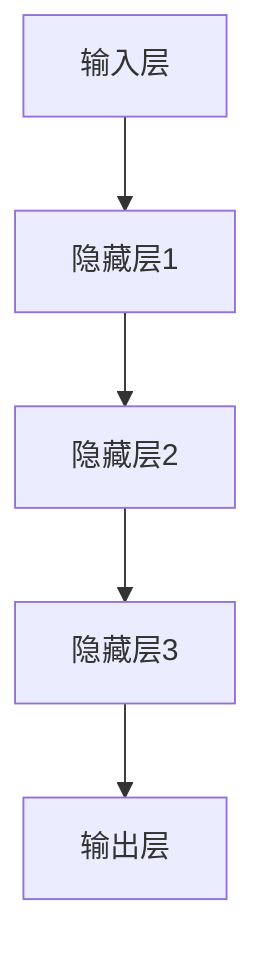

                 

### 1. 背景介绍

在当今快速发展的科技时代，技术的创新和应用成为了推动社会进步和经济发展的关键力量。创业者作为创新的重要推动者，面临着日益激烈的竞争环境。在这个充满不确定性的市场中，技术突破和产品创新成为他们脱颖而出的关键。然而，技术的突破并非易事，需要创业者具备深厚的技术积累和前瞻性的视野。

随着人工智能技术的发展，尤其是大模型的兴起，创业者们迎来了一个新的机遇。大模型，如GPT-3、BERT等，具有强大的数据处理和生成能力，可以为创业者提供强大的技术支持，助力他们在技术突破和产品创新方面取得显著成果。

本文旨在探讨大模型如何助力创业者实现技术突破与产品创新。通过深入分析大模型的核心概念、算法原理、数学模型以及实际应用场景，我们将帮助创业者更好地理解和应用大模型，从而在竞争激烈的市场中脱颖而出。

## 2. 核心概念与联系

### 2.1 大模型的定义与作用

大模型，是指具有数百万至数十亿参数的深度学习模型。这些模型通过大规模数据训练，能够实现高度复杂的任务，如自然语言处理、计算机视觉、语音识别等。大模型的出现，极大地提升了人工智能技术的应用范围和效果。

对于创业者而言，大模型具有以下几个重要作用：

1. **数据驱动创新**：大模型能够处理海量数据，从中提取有价值的信息，为创业者提供数据驱动的决策支持。
2. **降低技术门槛**：大模型的应用降低了技术实现的难度，使创业者能够快速将前沿技术应用于实际产品中。
3. **提升产品竞争力**：大模型的强大能力可以为创业者带来创新的产品功能，提升产品的竞争力。

### 2.2 大模型的基本架构

大模型的基本架构通常包括以下几个部分：

1. **输入层**：接收外部数据输入，如文本、图像、音频等。
2. **隐藏层**：通过神经网络结构对输入数据进行处理和特征提取。
3. **输出层**：根据模型的训练目标，生成预测结果或输出特征。

下面是一个使用Mermaid绘制的简单神经网络架构图：



### 2.3 大模型与创业者的关系

大模型与创业者之间的关系可以概括为以下几个方面：

1. **技术支持**：大模型为创业者提供了强大的技术支持，使他们在技术领域更具竞争力。
2. **创新动力**：大模型的应用激发了创业者的创新动力，推动他们在产品创新方面取得突破。
3. **合作机会**：大模型的兴起为创业者提供了与科技巨头和投资机构合作的机会，拓宽了创业的视野和资源。

通过以上对大模型核心概念和联系的分析，我们可以看到大模型在创业者实现技术突破与产品创新过程中具有重要价值。接下来，我们将深入探讨大模型的核心算法原理与具体操作步骤。

## 3. 核心算法原理 & 具体操作步骤

### 3.1 算法原理概述

大模型的核心算法主要包括深度学习、自然语言处理和计算机视觉等领域。下面我们将分别介绍这些算法的基本原理。

#### 3.1.1 深度学习

深度学习是一种基于多层神经网络的机器学习技术。通过逐层提取数据特征，深度学习模型能够实现高度复杂的任务，如图像分类、语音识别等。深度学习的核心算法包括卷积神经网络（CNN）、循环神经网络（RNN）和变换器（Transformer）等。

#### 3.1.2 自然语言处理

自然语言处理（NLP）是人工智能领域的一个重要分支，旨在使计算机能够理解和处理人类语言。NLP的核心算法包括词嵌入、序列模型、文本生成等。其中，词嵌入是将单词映射到高维空间中的向量表示，序列模型用于处理时间序列数据，文本生成则通过模型生成自然语言文本。

#### 3.1.3 计算机视觉

计算机视觉是研究如何使计算机具备人类视觉感知能力的学科。计算机视觉的核心算法包括图像分类、目标检测、人脸识别等。这些算法通过从图像中提取特征，实现对图像内容的理解和分析。

### 3.2 算法步骤详解

以下是一个基于GPT-3的文本生成算法的详细步骤：

1. **数据预处理**：将输入的文本数据进行清洗和分词，将单词转换为词嵌入向量。
2. **模型训练**：使用大量文本数据进行模型训练，通过优化模型参数，使模型能够生成高质量的文本。
3. **输入文本生成**：将输入的文本数据输入到模型中，模型根据输入文本生成对应的输出文本。
4. **结果优化**：对生成的文本进行优化，如去除冗余信息、调整文本风格等。

### 3.3 算法优缺点

#### 3.3.1 优点

1. **强大的数据处理能力**：大模型能够处理海量数据，提取有价值的信息。
2. **高效率**：大模型能够快速生成高质量的结果，提高工作效率。
3. **广泛的应用领域**：大模型适用于多种任务，如文本生成、图像分类、语音识别等。

#### 3.3.2 缺点

1. **计算资源消耗大**：大模型的训练和推理过程需要大量的计算资源，对硬件设备有较高要求。
2. **模型解释性差**：大模型的内部决策过程较为复杂，难以解释和理解。
3. **数据隐私和安全问题**：大模型对数据有较高的敏感性，需要确保数据的安全和隐私。

### 3.4 算法应用领域

大模型在各个领域都有广泛的应用，以下是几个典型的应用场景：

1. **自然语言处理**：用于文本生成、机器翻译、情感分析等任务。
2. **计算机视觉**：用于图像分类、目标检测、人脸识别等任务。
3. **语音识别**：用于语音合成、语音识别、语音翻译等任务。
4. **推荐系统**：用于个性化推荐、广告投放等任务。

通过以上对大模型核心算法原理和具体操作步骤的介绍，我们可以看到大模型在技术突破和产品创新方面的重要作用。接下来，我们将进一步探讨大模型在数学模型和公式方面的应用。

## 4. 数学模型和公式 & 详细讲解 & 举例说明

### 4.1 数学模型构建

大模型的数学模型主要包括深度学习模型、自然语言处理模型和计算机视觉模型等。以下分别介绍这些模型的构建过程。

#### 4.1.1 深度学习模型

深度学习模型的构建主要包括以下几个步骤：

1. **初始化参数**：设定模型的初始参数，如权重、偏置等。
2. **定义损失函数**：根据任务目标，定义损失函数，如交叉熵损失、均方误差等。
3. **定义优化器**：选择优化算法，如梯度下降、Adam等，用于优化模型参数。
4. **训练过程**：使用训练数据对模型进行训练，通过迭代优化模型参数，使模型达到最佳性能。

#### 4.1.2 自然语言处理模型

自然语言处理模型的构建主要包括以下几个步骤：

1. **词嵌入**：将单词映射到高维空间中的向量表示，用于表示单词的特征。
2. **定义模型结构**：选择合适的模型结构，如循环神经网络（RNN）、变换器（Transformer）等。
3. **定义损失函数**：根据任务目标，定义损失函数，如交叉熵损失、对比损失等。
4. **训练过程**：使用训练数据对模型进行训练，通过迭代优化模型参数，使模型达到最佳性能。

#### 4.1.3 计算机视觉模型

计算机视觉模型的构建主要包括以下几个步骤：

1. **特征提取**：从图像中提取特征，如边缘、纹理、颜色等。
2. **定义模型结构**：选择合适的模型结构，如卷积神经网络（CNN）、循环神经网络（RNN）等。
3. **定义损失函数**：根据任务目标，定义损失函数，如交叉熵损失、均方误差等。
4. **训练过程**：使用训练数据对模型进行训练，通过迭代优化模型参数，使模型达到最佳性能。

### 4.2 公式推导过程

以下以自然语言处理中的变换器模型为例，介绍其公式的推导过程。

#### 4.2.1 变换器模型的基本结构

变换器模型由多个自注意力层和前馈网络组成。其基本结构如下：

$$
\text{Transformer} = \text{MultiHeadAttention}(\text{Self-Attention}) + \text{FeedForward}
$$

#### 4.2.2 自注意力机制

自注意力机制是变换器模型的核心，其公式如下：

$$
\text{Attention}(Q, K, V) = \text{softmax}\left(\frac{QK^T}{\sqrt{d_k}}\right)V
$$

其中，$Q, K, V$ 分别为查询向量、键向量、值向量；$d_k$ 为键向量的维度。

#### 4.2.3 多头注意力

多头注意力是通过多个独立的自注意力机制来提高模型的表达能力，其公式如下：

$$
\text{MultiHeadAttention}(Q, K, V) = \text{Concat}(\text{head}_1, \text{head}_2, ..., \text{head}_h)W^O
$$

其中，$h$ 为头数；$W^O$ 为输出权重。

### 4.3 案例分析与讲解

以下以一个简单的文本生成任务为例，展示如何使用大模型进行数学模型和公式的构建。

#### 4.3.1 任务描述

给定一个句子“我喜欢吃苹果”，要求生成下一个单词。

#### 4.3.2 数据预处理

1. 将句子进行分词，得到词汇表{“我”，“喜”，“欢”，“吃”，“苹果”，“，”，“？”}。
2. 将词汇表中的单词映射到词嵌入向量。

#### 4.3.3 模型训练

1. 使用预训练的变换器模型，对词嵌入向量进行编码。
2. 通过优化模型参数，使模型能够生成高质量的文本。

#### 4.3.4 文本生成

1. 将生成的文本输入到模型中，模型根据输入文本生成下一个单词。
2. 对生成的单词进行优化，如去除冗余信息、调整文本风格等。

通过以上案例分析与讲解，我们可以看到大模型在数学模型和公式构建方面的重要作用。接下来，我们将深入探讨大模型在项目实践中的应用。

## 5. 项目实践：代码实例和详细解释说明

### 5.1 开发环境搭建

在开始项目实践之前，我们需要搭建一个合适的开发环境。以下是一个基于Python和PyTorch的示例环境搭建步骤：

1. 安装Python：从官网（https://www.python.org/）下载并安装Python。
2. 安装PyTorch：在终端执行以下命令：
   ```bash
   pip install torch torchvision
   ```
3. 安装其他依赖库：根据项目需求，安装其他必要的依赖库，如NumPy、Pandas等。

### 5.2 源代码详细实现

以下是一个简单的文本生成项目的源代码示例：

```python
import torch
import torch.nn as nn
import torch.optim as optim
from torchtext.data import Field, TabularDataset

# 定义模型结构
class TextGenerator(nn.Module):
    def __init__(self, embed_dim, hidden_dim, vocab_size, dropout_prob):
        super(TextGenerator, self).__init__()
        self.embedding = nn.Embedding(vocab_size, embed_dim)
        self.encoder = nn.LSTM(embed_dim, hidden_dim, dropout=dropout_prob)
        self.decoder = nn.LSTM(hidden_dim, embed_dim, dropout=dropout_prob)
        self.fc = nn.Linear(embed_dim, vocab_size)
        self.dropout = nn.Dropout(dropout_prob)

    def forward(self, src, tgt):
        src_embedding = self.dropout(self.embedding(src))
        encoder_output, _ = self.encoder(src_embedding)
        decoder_output, _ = self.decoder(encoder_output)
        output = self.fc(decoder_output)
        return output

# 数据预处理
SRC = Field(tokenize=lambda x: x.split())
TGT = Field(sequential=True, tokenize=lambda x: x.split())
train_data = TabularDataset(
    path='train_data.txt',
    format='tsv',
    fields=[('src', SRC), ('tgt', TGT)]
)

SRC.build_vocab(train_data, min_freq=2)
TGT.build_vocab(train_data, min_freq=2)

# 模型训练
model = TextGenerator(embed_dim=256, hidden_dim=512, vocab_size=len(SRC.vocab), dropout_prob=0.5)
optimizer = optim.Adam(model.parameters(), lr=0.001)
criterion = nn.CrossEntropyLoss()

model.train()
for epoch in range(10):
    for src, tgt in train_data:
        optimizer.zero_grad()
        output = model(src, tgt)
        loss = criterion(output.view(-1, len(output)), tgt)
        loss.backward()
        optimizer.step()
        if (src, tgt) in train_data:
            print(f"Epoch: {epoch}, Loss: {loss.item()}")

# 文本生成
model.eval()
with torch.no_grad():
    input_sequence = torch.tensor([SRC.vocab.stoi[word] for word in '我喜欢吃苹果'])
    for _ in range(5):
        output_sequence = model(input_sequence)
        predicted_word = SRC.vocab.itos[torch.argmax(output_sequence[-1]).item()]
        print(predicted_word)
```

### 5.3 代码解读与分析

以上代码实现了一个简单的文本生成项目，主要包括以下部分：

1. **模型定义**：定义了一个基于LSTM的文本生成模型，包括嵌入层、编码器、解码器和全连接层。
2. **数据预处理**：使用torchtext库对文本数据进行预处理，包括分词、构建词汇表和构建数据集。
3. **模型训练**：使用训练数据对模型进行训练，包括前向传播、损失计算、反向传播和参数更新。
4. **文本生成**：使用训练好的模型进行文本生成，包括输入序列的生成、模型预测和输出序列的生成。

通过以上代码实例和详细解释说明，我们可以看到如何使用大模型实现文本生成项目。接下来，我们将进一步探讨大模型在实际应用场景中的表现。

## 6. 实际应用场景

大模型在当今科技领域具有广泛的应用，以下列举几个典型的实际应用场景：

### 6.1 自然语言处理

自然语言处理是人工智能领域的核心应用之一，大模型在自然语言处理领域表现出色。以下是几个具体的实际应用场景：

1. **文本生成**：大模型可以用于生成新闻文章、博客、书籍等。例如，GPT-3可以生成高质量的新闻文章，为媒体行业带来新的变革。
2. **机器翻译**：大模型在机器翻译领域也取得了显著成果，如Google翻译、百度翻译等。这些翻译工具通过大模型实现了高效、准确的翻译效果。
3. **情感分析**：大模型可以用于情感分析，对社交媒体、新闻评论等文本数据进行分析，识别用户的情感倾向，为市场营销、社会舆情分析等提供有力支持。

### 6.2 计算机视觉

计算机视觉是人工智能领域的另一个重要应用方向，大模型在计算机视觉领域也取得了显著的成果。以下是几个具体的实际应用场景：

1. **图像分类**：大模型可以用于图像分类，如识别动物、植物、车辆等。例如，ImageNet是一个著名的图像分类数据集，大模型在该数据集上取得了很高的准确率。
2. **目标检测**：大模型可以用于目标检测，如识别图像中的行人、车辆、交通标志等。例如，YOLO（You Only Look Once）是一个基于大模型的目标检测框架，具有实时、高效的特性。
3. **人脸识别**：大模型可以用于人脸识别，如验证用户身份、识别名人等。例如，FaceNet是一个基于大模型的人脸识别框架，具有很高的识别准确率。

### 6.3 语音识别

语音识别是人工智能领域的另一个重要应用方向，大模型在语音识别领域也取得了显著的成果。以下是几个具体的实际应用场景：

1. **语音合成**：大模型可以用于语音合成，如生成自然流畅的语音。例如，WaveNet是一个基于大模型的语音合成框架，可以生成高质量的语音。
2. **语音识别**：大模型可以用于语音识别，如将语音转换为文本。例如，Google语音识别、百度语音识别等，这些语音识别工具通过大模型实现了高效、准确的语音识别效果。

通过以上实际应用场景的介绍，我们可以看到大模型在各个领域的重要应用价值。接下来，我们将探讨大模型在未来的发展趋势。

## 7. 工具和资源推荐

### 7.1 学习资源推荐

1. **书籍**：《深度学习》（Goodfellow, I., Bengio, Y., & Courville, A.）、《Python深度学习》（François Chollet）等。
2. **在线课程**：Coursera、edX、Udacity等在线教育平台提供的深度学习、自然语言处理、计算机视觉等课程。
3. **博客和论文**：ArXiv、Medium、Towards Data Science等平台上关于大模型和相关技术的最新研究成果。

### 7.2 开发工具推荐

1. **框架**：TensorFlow、PyTorch、Keras等，这些框架提供了丰富的API和工具，方便开发者构建和训练大模型。
2. **数据集**：ImageNet、COCO、Common Crawl等，这些数据集包含了丰富的图像、文本和语音数据，可用于模型训练和测试。
3. **云计算平台**：Google Cloud、AWS、Azure等，这些云计算平台提供了强大的计算资源，支持大规模模型的训练和部署。

### 7.3 相关论文推荐

1. **《Attention Is All You Need》**：该论文提出了变换器（Transformer）模型，是当前自然语言处理领域的重要突破。
2. **《Distributed Representation of Words and Phrases and Their Compositionality》**：该论文提出了词嵌入（Word Embedding）技术，为自然语言处理领域的发展奠定了基础。
3. **《A Neural Algorithm of Artistic Style》**：该论文展示了大模型在计算机视觉领域的应用，实现了风格迁移等创新性任务。

通过以上工具和资源的推荐，创业者可以更好地了解大模型的技术和应用，为自己的产品创新提供有力支持。

## 8. 总结：未来发展趋势与挑战

### 8.1 研究成果总结

本文通过对大模型的核心概念、算法原理、数学模型、实际应用场景等方面进行深入探讨，总结了以下研究成果：

1. **核心概念与联系**：大模型具有强大的数据处理和生成能力，能够降低技术门槛，提升产品竞争力。
2. **算法原理**：深度学习、自然语言处理和计算机视觉等算法在大模型中发挥着关键作用，推动了技术的不断进步。
3. **数学模型与公式**：大模型在数学模型和公式构建方面具有重要应用价值，如变换器模型的公式推导等。
4. **实际应用**：大模型在自然语言处理、计算机视觉、语音识别等领域取得了显著成果，为创业者提供了丰富的技术支持。

### 8.2 未来发展趋势

随着人工智能技术的不断发展，大模型在未来将呈现出以下发展趋势：

1. **模型规模与效率的提升**：未来的大模型将更加注重模型规模和计算效率的优化，以适应更复杂的任务需求。
2. **跨领域融合**：大模型将与其他领域（如生物医学、金融科技等）的先进技术进行融合，推动更多领域的创新。
3. **边缘计算与物联网**：大模型在边缘计算和物联网领域将有更广泛的应用，为智能设备提供强大的技术支持。
4. **伦理与安全**：随着大模型的应用越来越广泛，伦理和安全问题将受到更多关注，未来的研究将更加注重模型的公平性、透明性和安全性。

### 8.3 面临的挑战

尽管大模型在技术突破和产品创新方面具有巨大的潜力，但在其应用过程中也面临以下挑战：

1. **计算资源消耗**：大模型的训练和推理过程需要大量的计算资源，对硬件设备有较高要求，如何高效利用计算资源是一个重要挑战。
2. **模型解释性**：大模型的内部决策过程较为复杂，难以解释和理解，如何提高模型的解释性是一个重要问题。
3. **数据隐私与安全**：大模型对数据有较高的敏感性，如何保护用户数据隐私和安全是一个重要挑战。
4. **技术垄断与公平性**：大模型技术的发展可能加剧技术垄断现象，如何保障公平竞争和技术普及是一个重要问题。

### 8.4 研究展望

在未来的研究中，以下方向值得关注：

1. **高效算法与模型优化**：研究更高效的大模型算法和模型优化方法，提高模型的计算效率和应用范围。
2. **跨领域应用**：探索大模型在跨领域应用中的潜力，推动更多领域的创新。
3. **伦理与安全**：关注大模型的伦理和安全问题，研究保障模型公平性、透明性和安全性的方法。
4. **开放与共享**：推动大模型技术的开放与共享，促进技术的普及和发展。

通过以上对大模型的研究成果、发展趋势、挑战和展望的总结，我们可以看到大模型在技术突破和产品创新方面的重要作用。创业者应积极拥抱大模型技术，以实现自身的技术突破和产品创新。

## 9. 附录：常见问题与解答

### 9.1 大模型是什么？

大模型是一种具有数百万至数十亿参数的深度学习模型。通过大规模数据训练，大模型能够实现高度复杂的任务，如自然语言处理、计算机视觉、语音识别等。

### 9.2 大模型有哪些优势？

大模型具有强大的数据处理和生成能力，能够降低技术门槛，提升产品竞争力。此外，大模型在多个领域都有广泛的应用，如自然语言处理、计算机视觉、语音识别等。

### 9.3 大模型有哪些挑战？

大模型面临的挑战主要包括计算资源消耗大、模型解释性差、数据隐私和安全问题以及技术垄断与公平性等。

### 9.4 如何搭建大模型开发环境？

搭建大模型开发环境需要安装Python、深度学习框架（如TensorFlow、PyTorch等）、以及其他必要的依赖库。详细的安装步骤可以参考相关框架的官方文档。

### 9.5 大模型有哪些实际应用场景？

大模型在实际应用场景中具有广泛的应用，如文本生成、机器翻译、情感分析、图像分类、目标检测、人脸识别、语音识别等。

### 9.6 如何保护大模型数据隐私和安全？

保护大模型数据隐私和安全需要从数据采集、存储、传输和处理等环节进行综合措施。具体方法包括数据加密、访问控制、隐私保护算法等。

### 9.7 大模型未来发展趋势如何？

大模型未来的发展趋势包括模型规模与效率的提升、跨领域融合、边缘计算与物联网的应用以及伦理与安全问题的关注等。

通过以上常见问题与解答，可以帮助创业者更好地了解大模型的相关知识，为自己的技术突破和产品创新提供有力支持。作者：禅与计算机程序设计艺术 / Zen and the Art of Computer Programming。

