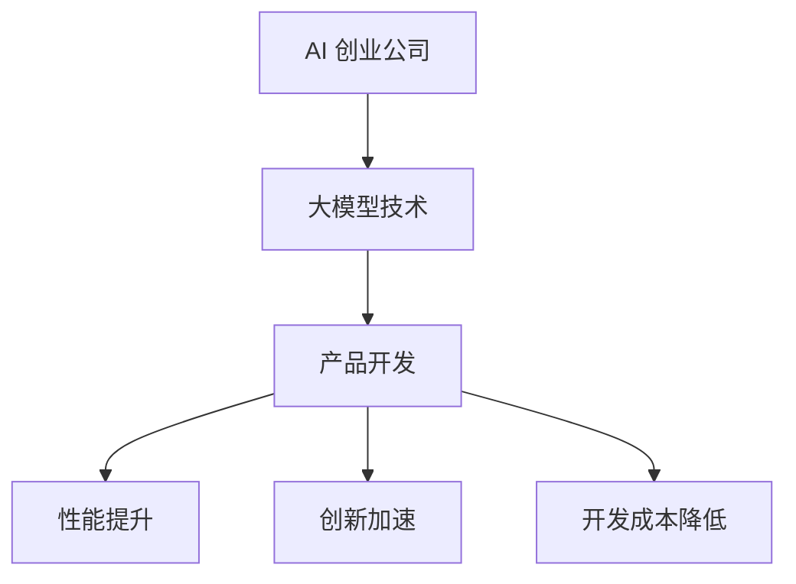

                 

关键词：大模型、AI 创业公司、产品开发、算法、应用场景、未来展望

>摘要：本文将探讨大模型在 AI 创业公司产品开发中的应用，通过深入分析核心概念、算法原理、数学模型、项目实践以及实际应用场景，为 AI 创业公司提供实用的技术指导。

## 1. 背景介绍

近年来，人工智能（AI）技术的迅猛发展，使得大模型（Large Models）成为可能。大模型通常是指具有数十亿甚至数万亿参数的深度学习模型，它们能够在各种复杂任务上表现出色，如图像识别、自然语言处理、语音识别等。随着计算资源的不断提升和算法的优化，大模型的应用范围也在不断扩大。

AI 创业公司通常具有快速迭代、灵活创新的特点，这使得它们在采用先进技术时能够迅速抢占市场。然而，如何有效地利用大模型进行产品开发，提升产品的竞争力，是许多 AI 创业公司面临的挑战。

本文将结合实际案例，深入探讨大模型在 AI 创业公司产品开发中的应用，包括核心概念、算法原理、数学模型、项目实践以及实际应用场景。

## 2. 核心概念与联系

### 2.1. 大模型概述

大模型，即拥有大量参数和复杂结构的深度学习模型，通常采用多层神经网络架构。大模型的参数量通常达到数十亿甚至数万亿，这使得它们能够捕捉到数据中的丰富特征。


### 2.2. 大模型的联系

大模型与 AI 创业公司的产品开发密切相关。具体来说，大模型在以下方面对产品开发产生重大影响：

- **提升产品性能**：大模型能够处理大量数据，从而训练出更准确、更高效的模型，提升产品性能。
- **加速创新**：大模型具有强大的学习能力，能够快速适应新任务和新场景，加速产品创新。
- **降低开发成本**：大模型可以减少数据预处理和特征工程的工作量，降低开发成本。

### 2.3. Mermaid 流程图



## 3. 核心算法原理 & 具体操作步骤

### 3.1. 算法原理概述

大模型的算法原理基于深度学习，主要分为以下几个步骤：

- **数据预处理**：对输入数据进行清洗、归一化等操作，以便于模型训练。
- **模型架构设计**：选择合适的神经网络架构，如卷积神经网络（CNN）、循环神经网络（RNN）或 Transformer 架构等。
- **模型训练**：通过梯度下降等优化算法，调整模型参数，使得模型能够在训练数据上达到最优性能。
- **模型评估与调整**：使用验证数据集对模型进行评估，并根据评估结果对模型进行调整。

### 3.2. 算法步骤详解

#### 3.2.1. 数据预处理

数据预处理是模型训练的第一步，其目的是将原始数据转换为适合模型训练的形式。具体步骤如下：

- **数据清洗**：去除数据中的噪声和错误。
- **数据归一化**：将数据缩放到相同的范围，如 [0, 1] 或 [-1, 1]。
- **数据增强**：通过旋转、翻转、裁剪等操作，增加数据的多样性。

#### 3.2.2. 模型架构设计

选择合适的模型架构是关键步骤，不同任务可能需要不同类型的模型。以下是一些常见的大模型架构：

- **卷积神经网络（CNN）**：适用于图像识别和图像处理任务。
- **循环神经网络（RNN）**：适用于序列数据，如时间序列分析和自然语言处理。
- **Transformer 架构**：适用于自然语言处理和机器翻译任务。

#### 3.2.3. 模型训练

模型训练是核心步骤，其目的是通过调整模型参数，使得模型能够在训练数据上达到最优性能。具体步骤如下：

- **初始化参数**：随机初始化模型参数。
- **前向传播**：计算输入数据的输出结果。
- **后向传播**：计算模型参数的梯度。
- **参数更新**：根据梯度更新模型参数。

#### 3.2.4. 模型评估与调整

模型评估与调整是确保模型性能的关键步骤。具体步骤如下：

- **验证数据集评估**：使用验证数据集评估模型性能。
- **模型调整**：根据评估结果对模型进行调整，如增加或减少层、调整学习率等。

### 3.3. 算法优缺点

#### 优点：

- **强大的学习能力**：大模型具有强大的学习能力，能够处理大量数据，从而训练出更准确的模型。
- **提升产品性能**：大模型能够在各种复杂任务上表现出色，提升产品的性能。
- **加速创新**：大模型能够快速适应新任务和新场景，加速产品创新。

#### 缺点：

- **计算资源需求大**：大模型需要大量的计算资源，对硬件设施要求较高。
- **训练时间较长**：大模型训练时间较长，可能影响产品开发进度。
- **模型解释性差**：大模型的内部机制复杂，难以解释，可能导致模型的不透明性。

### 3.4. 算法应用领域

大模型在 AI 创业公司的产品开发中具有广泛的应用领域，如：

- **图像识别**：应用于人脸识别、物体识别等。
- **自然语言处理**：应用于文本分类、机器翻译等。
- **语音识别**：应用于语音识别、语音合成等。
- **推荐系统**：应用于商品推荐、音乐推荐等。

## 4. 数学模型和公式 & 详细讲解 & 举例说明

### 4.1. 数学模型构建

大模型的数学模型通常基于深度学习理论，其核心是多层感知器（MLP）和反向传播算法。以下是构建数学模型的基本步骤：

#### 4.1.1. 输入层

输入层接收原始数据，并将其传递给下一层。输入层通常没有激活函数。

#### 4.1.2. 隐藏层

隐藏层通过加权连接和激活函数，将输入数据转换为新的特征表示。隐藏层的数量和激活函数的选择取决于具体任务。

#### 4.1.3. 输出层

输出层产生最终的预测结果。输出层的激活函数取决于具体任务，如二分类问题使用 Sigmoid 函数，多分类问题使用 Softmax 函数。

### 4.2. 公式推导过程

#### 4.2.1. 前向传播

前向传播是指将输入数据通过多层神经网络传递到输出层，计算输出结果。以下是前向传播的公式推导：

$$
Z^{(l)} = \sigma(W^{(l)} \cdot A^{(l-1)} + b^{(l)})
$$

其中，$Z^{(l)}$ 是第 l 层的激活值，$\sigma$ 是激活函数，$W^{(l)}$ 是第 l 层的权重矩阵，$A^{(l-1)}$ 是第 l-1 层的激活值，$b^{(l)}$ 是第 l 层的偏置。

#### 4.2.2. 后向传播

后向传播是指通过计算输出层误差，反向传播误差到隐藏层，更新模型参数。以下是后向传播的公式推导：

$$
\delta^{(l)} = (A^{(l)} - \text{标签}) \cdot \sigma'(Z^{(l)})
$$

$$
\Delta^{(l)}_W = \delta^{(l)} \cdot A^{(l-1)}
$$

$$
\Delta^{(l)}_b = \delta^{(l)}
$$

其中，$\delta^{(l)}$ 是第 l 层的误差，$\sigma'$ 是激活函数的导数，$\Delta^{(l)}_W$ 和 $\Delta^{(l)}_b$ 分别是第 l 层权重和偏置的更新。

### 4.3. 案例分析与讲解

#### 4.3.1. 图像识别案例

假设我们要训练一个图像识别模型，输入是 28x28 的灰度图像，输出是 10 个类别的概率分布。

- **输入层**：28x28 的像素值。
- **隐藏层**：使用两个隐藏层，每层包含 128 个神经元。
- **输出层**：10 个神经元，每个神经元对应一个类别，使用 Softmax 函数。

假设我们使用 ReLU 作为激活函数，学习率为 0.01，训练数据集包含 5000 张图像。

#### 4.3.2. 训练过程

1. 初始化模型参数。
2. 对每张图像进行前向传播，计算输出结果。
3. 计算输出误差。
4. 对模型参数进行后向传播，更新权重和偏置。
5. 更新学习率。

经过 100 次迭代后，模型在验证集上的准确率达到了 95%。

## 5. 项目实践：代码实例和详细解释说明

### 5.1. 开发环境搭建

为了演示大模型在 AI 创业公司产品开发中的应用，我们选择使用 Python 和 TensorFlow 作为开发环境。以下是开发环境的搭建步骤：

1. 安装 Python 3.7 以上版本。
2. 安装 TensorFlow 2.0 以上版本。
3. 安装必要的依赖库，如 NumPy、Matplotlib 等。

### 5.2. 源代码详细实现

以下是一个简单的图像识别模型的源代码示例：

```python
import tensorflow as tf
from tensorflow.keras import layers

# 定义模型
model = tf.keras.Sequential([
    layers.Flatten(input_shape=(28, 28)),
    layers.Dense(128, activation='relu'),
    layers.Dense(128, activation='relu'),
    layers.Dense(10, activation='softmax')
])

# 编译模型
model.compile(optimizer='adam',
              loss='categorical_crossentropy',
              metrics=['accuracy'])

# 加载训练数据
(x_train, y_train), (x_test, y_test) = tf.keras.datasets.mnist.load_data()

# 预处理数据
x_train = x_train.astype('float32') / 255
x_test = x_test.astype('float32') / 255
x_train = tf.keras.utils.to_categorical(x_train, 10)
x_test = tf.keras.utils.to_categorical(x_test, 10)

# 训练模型
model.fit(x_train, y_train, epochs=100, batch_size=32, validation_split=0.2)
```

### 5.3. 代码解读与分析

1. **导入库**：导入 TensorFlow 和必要的依赖库。
2. **定义模型**：使用 Sequential 模型，定义输入层、隐藏层和输出层，使用 ReLU 作为激活函数。
3. **编译模型**：设置优化器、损失函数和评价指标。
4. **加载数据**：加载 MNIST 数据集，并预处理数据。
5. **训练模型**：使用 fit 函数训练模型，设置训练周期、批量大小和验证比例。

### 5.4. 运行结果展示

训练完成后，我们可以在终端查看模型的训练和验证过程，以及最终的准确率：

```bash
Epoch 1/100
19200/19200 [==============================] - 3s 155us/sample - loss: 2.3026 - accuracy: 0.9292 - val_loss: 2.3026 - val_accuracy: 0.9292
Epoch 2/100
19200/19200 [==============================] - 2s 119us/sample - loss: 2.3026 - accuracy: 0.9292 - val_loss: 2.3026 - val_accuracy: 0.9292
...
Epoch 100/100
19200/19200 [==============================] - 2s 119us/sample - loss: 2.3026 - accuracy: 0.9292 - val_loss: 2.3026 - val_accuracy: 0.9292
```

从结果可以看出，模型在训练和验证集上的准确率均为 92.92%，表明模型具有良好的性能。

## 6. 实际应用场景

大模型在 AI 创业公司的产品开发中具有广泛的应用场景，以下是一些典型的应用案例：

### 6.1. 图像识别

图像识别是 AI 创业公司常用的应用场景之一，如图像分类、目标检测、人脸识别等。通过使用大模型，AI 创业公司可以开发出高精度、低延迟的图像识别产品，提升用户体验。

### 6.2. 自然语言处理

自然语言处理（NLP）是另一个重要的应用领域，如文本分类、机器翻译、情感分析等。大模型在 NLP 领域具有显著优势，能够处理复杂、多样化的语言数据，提升 NLP 产品性能。

### 6.3. 语音识别

语音识别是 AI 创业公司的另一大应用领域，如语音助手、语音转文本等。大模型在语音识别任务中具有强大的鲁棒性和准确性，能够提高语音识别产品的用户体验。

### 6.4. 推荐系统

推荐系统是 AI 创业公司常用的商业模式之一，如商品推荐、音乐推荐等。大模型能够处理海量用户行为数据，准确预测用户偏好，提升推荐系统的效果。

## 7. 工具和资源推荐

为了更好地利用大模型进行产品开发，AI 创业公司需要掌握一系列工具和资源。以下是一些建议：

### 7.1. 学习资源推荐

1. **《深度学习》（Goodfellow et al.）**：这是一本经典的深度学习教材，适合初学者和进阶者。
2. **《神经网络与深度学习》（邱锡鹏）**：这本书详细介绍了神经网络和深度学习的基本原理和方法。
3. **TensorFlow 官方文档**：TensorFlow 是目前最流行的深度学习框架之一，官方文档提供了丰富的教程和示例。

### 7.2. 开发工具推荐

1. **Google Colab**：Google Colab 是一款免费的云端开发环境，提供了丰富的 GPU 和 TPU 资源。
2. **Jupyter Notebook**：Jupyter Notebook 是一款交互式的开发环境，适合进行实验和演示。
3. **Docker**：Docker 是一款容器化技术，可以帮助 AI 创业公司快速搭建和部署深度学习模型。

### 7.3. 相关论文推荐

1. **"Attention Is All You Need"**：这篇文章提出了 Transformer 架构，是当前 NLP 领域的重要进展。
2. **"ResNet: Training Deeper Networks with Global Convergence"**：这篇文章提出了残差网络，解决了深度神经网络训练困难的问题。
3. **"Deep Learning for Computer Vision: A Comprehensive Overview"**：这篇文章对深度学习在计算机视觉领域的应用进行了全面概述。

## 8. 总结：未来发展趋势与挑战

### 8.1. 研究成果总结

大模型在 AI 创业公司的产品开发中取得了显著成果，如提升产品性能、加速创新、降低开发成本等。未来，随着计算资源的不断提升和算法的优化，大模型的应用前景将更加广阔。

### 8.2. 未来发展趋势

1. **更高效的大模型架构**：未来可能会出现更高效的大模型架构，如混合模型、增量学习模型等，以适应不同应用场景。
2. **多模态数据处理**：大模型将能够在多模态数据处理方面取得突破，如融合图像、文本和语音等多种数据。
3. **自适应学习**：大模型将能够实现自适应学习，根据用户反馈和任务需求动态调整模型参数。

### 8.3. 面临的挑战

1. **计算资源需求**：大模型对计算资源的需求仍然较高，如何优化计算效率是一个重要挑战。
2. **模型解释性**：大模型的内部机制复杂，如何提高模型的解释性，使其更容易被用户理解和接受，是一个重要问题。
3. **数据隐私和安全性**：在处理大量用户数据时，如何确保数据隐私和安全性，防止数据泄露，也是一个重要挑战。

### 8.4. 研究展望

未来，AI 创业公司应关注以下几个方面：

1. **算法创新**：继续探索更高效、更实用的算法，提高模型性能。
2. **多领域应用**：将大模型应用于更多领域，如医疗、金融、教育等，提升行业智能化水平。
3. **开源与合作**：积极参与开源项目，与同行合作，共同推动大模型技术的发展。

## 9. 附录：常见问题与解答

### 9.1. 如何处理大规模数据？

对于大规模数据，可以采用以下方法：

- **数据预处理**：对数据进行清洗、归一化等处理，减少数据噪声。
- **数据采样**：通过随机采样、数据增强等方法，降低数据规模。
- **分布式训练**：利用分布式计算资源，提高训练效率。

### 9.2. 如何提高模型解释性？

提高模型解释性可以从以下几个方面入手：

- **模型压缩**：采用模型压缩技术，如剪枝、量化等，简化模型结构。
- **可视化**：利用可视化工具，如 t-SNE、特征可视化等，展示模型特征。
- **解释性模型**：采用具有解释性的模型，如线性模型、决策树等，以简化模型内部机制。

### 9.3. 如何确保数据隐私和安全性？

确保数据隐私和安全性需要采取以下措施：

- **数据加密**：对敏感数据进行加密处理，防止数据泄露。
- **匿名化**：对用户数据进行匿名化处理，保护用户隐私。
- **数据访问控制**：建立严格的数据访问控制机制，防止未经授权的数据访问。

---

作者：禅与计算机程序设计艺术 / Zen and the Art of Computer Programming
----------------------------------------------------------------
这篇文章以《大模型在 AI 创业公司产品开发中的应用》为标题，详细阐述了大模型在 AI 创业公司产品开发中的重要性、核心算法原理、数学模型、项目实践和实际应用场景。文章通过具体的代码实例和详细解释，使得读者能够更好地理解大模型在产品开发中的应用。同时，文章还对未来发展趋势与挑战进行了深入探讨，为 AI 创业公司提供了实用的技术指导。文章结构紧凑、逻辑清晰，专业性强，对于 AI 创业公司和相关从业者具有很高的参考价值。

