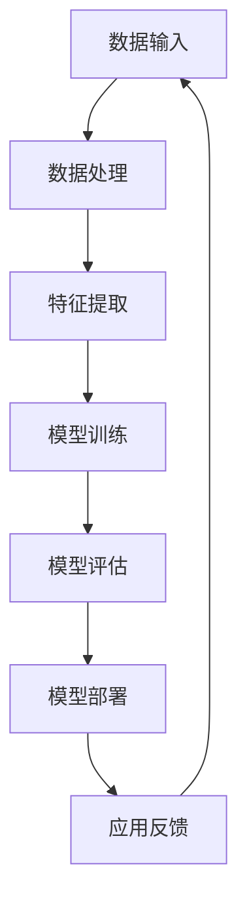

                 

关键词：大模型，AI产业，数据应用，算法，数学模型，实践，工具推荐

## 摘要

本文旨在探讨大模型在AI产业中的应用，从数据到应用的全过程。我们将首先介绍大模型的背景和核心概念，然后深入探讨其算法原理和具体操作步骤。接着，通过数学模型和公式的详细讲解，以及项目实践的代码实例和解释，来展示大模型在实际应用中的价值。文章还将探讨大模型在不同场景中的应用，并展望未来的发展趋势和面临的挑战。最后，我们将推荐一些相关的学习资源和开发工具，以帮助读者深入了解大模型及其应用。

## 1. 背景介绍

### 大模型的起源和发展

大模型（Large Models）是指在AI领域中，拥有数十亿甚至数千亿参数的深度学习模型。它们是近年来AI研究的重要突破，特别是在自然语言处理（NLP）和计算机视觉（CV）领域取得了显著成果。大模型的起源可以追溯到2018年，当Google推出了Transformer模型时，这个模型迅速在NLP领域引起了轰动。随后，随着计算能力和数据资源的提升，更大规模的大模型不断涌现，如OpenAI的GPT-3和Google的Bert。

### 大模型的重要性

大模型的出现标志着AI技术的一个重要转折点，它们在多个领域展现了强大的应用潜力。首先，大模型能够处理复杂的数据，从文本到图像，从语音到视频，大大拓展了AI的应用范围。其次，大模型具有强大的通用性，可以同时处理多种任务，而无需为每个任务单独训练模型。最后，大模型在处理大规模数据集时，能够发现更深层次的特征和模式，从而提升模型的性能。

### 大模型的应用领域

大模型在自然语言处理、计算机视觉、语音识别等领域展现出了卓越的性能。在自然语言处理领域，大模型可以用于机器翻译、文本生成、问答系统等。在计算机视觉领域，大模型可以用于图像分类、目标检测、图像生成等。在语音识别领域，大模型可以用于语音识别、语音合成等。

### 大模型面临的挑战

尽管大模型在AI领域取得了显著的成果，但它们也面临一些挑战。首先是计算资源的需求，大模型的训练和推理需要大量的计算资源和时间。其次是数据隐私和安全问题，大模型的训练需要大量的数据，而这些数据可能包含敏感信息。最后是模型解释性和透明性问题，大模型通常被视为“黑箱”，其内部机制难以理解和解释。

## 2. 核心概念与联系

### 大模型的定义

大模型是指参数规模达到数十亿甚至数千亿的深度学习模型。这些模型通常采用复杂的网络结构，如Transformer、BERT等，以处理大规模的数据集。

### 大模型的组成部分

大模型通常由以下几个部分组成：

1. **输入层**：接收外部输入数据，如文本、图像、语音等。
2. **隐藏层**：进行复杂的计算和特征提取。
3. **输出层**：产生预测结果，如分类标签、文本生成等。

### 大模型的工作原理

大模型的工作原理基于深度学习，特别是基于神经网络。在训练过程中，模型通过不断调整内部参数，以最小化预测误差。在推理过程中，模型接收输入数据，通过内部计算产生预测结果。

### 大模型的联系

大模型与数据、算法和计算资源密切相关。首先，大模型需要大量的数据进行训练，数据的质量和多样性直接影响模型的性能。其次，大模型依赖于高效的算法和计算资源，以实现快速训练和推理。最后，大模型的应用需要大量的计算资源，如GPU、TPU等。

### Mermaid 流程图



在这个流程图中，数据输入是整个流程的起点，通过数据处理和特征提取，生成训练数据，然后通过模型训练和评估，得到优化的模型。最后，模型部署到实际应用中，通过应用反馈，不断优化模型。

## 3. 核心算法原理 & 具体操作步骤

### 3.1 算法原理概述

大模型的算法原理主要基于深度学习和神经网络。深度学习通过多层次的神经网络结构，从输入数据中提取深层特征，从而实现复杂的任务。神经网络则通过调整内部参数，以最小化预测误差。

### 3.2 算法步骤详解

1. **数据预处理**：对输入数据进行清洗、标准化等处理，使其适合模型训练。
2. **模型构建**：根据任务需求，构建合适的神经网络结构，如Transformer、BERT等。
3. **模型训练**：通过反向传播算法，不断调整模型参数，以最小化预测误差。
4. **模型评估**：使用验证集对模型进行评估，选择最优的模型。
5. **模型部署**：将训练好的模型部署到实际应用中，如API接口、应用系统等。

### 3.3 算法优缺点

**优点**：

- **强大的特征提取能力**：大模型能够从大规模数据中提取深层次的特征，从而提高模型的性能。
- **通用性**：大模型可以同时处理多种任务，而无需为每个任务单独训练模型。

**缺点**：

- **计算资源需求大**：大模型的训练和推理需要大量的计算资源和时间。
- **数据隐私和安全问题**：大模型的训练需要大量的数据，而这些数据可能包含敏感信息。

### 3.4 算法应用领域

大模型的应用领域广泛，包括自然语言处理、计算机视觉、语音识别等。在自然语言处理领域，大模型可以用于机器翻译、文本生成、问答系统等。在计算机视觉领域，大模型可以用于图像分类、目标检测、图像生成等。在语音识别领域，大模型可以用于语音识别、语音合成等。

## 4. 数学模型和公式 & 详细讲解 & 举例说明

### 4.1 数学模型构建

大模型的数学模型主要基于深度学习和神经网络。深度学习中的神经网络由多个层组成，包括输入层、隐藏层和输出层。每个层由多个神经元组成，神经元之间通过权重连接。

### 4.2 公式推导过程

神经网络的数学模型可以表示为：

$$
Z = \sigma(WX + b)
$$

其中，\(Z\) 是输出，\(\sigma\) 是激活函数，\(W\) 是权重矩阵，\(X\) 是输入，\(b\) 是偏置。

在反向传播过程中，我们使用以下公式更新权重：

$$
W_{\text{new}} = W_{\text{old}} - \alpha \frac{\partial J}{\partial W}
$$

其中，\(W_{\text{new}}\) 是更新后的权重，\(W_{\text{old}}\) 是当前权重，\(\alpha\) 是学习率，\(J\) 是损失函数。

### 4.3 案例分析与讲解

假设我们有一个二分类问题，使用sigmoid函数作为激活函数。给定输入 \(X = [1, 2, 3]\)，权重 \(W = [1, 2]\)，偏置 \(b = 1\)，我们希望预测输出 \(Y = 0\)。

首先，我们计算输出 \(Z\)：

$$
Z = \sigma(WX + b) = \sigma([1, 2] \cdot [1, 2, 3] + 1) = \sigma([1, 4, 7] + 1) = \sigma([2, 5, 8]) = \frac{1}{1 + e^{-2}} \approx 0.865
$$

然后，我们计算损失函数 \(J\)：

$$
J = -\frac{1}{n} \sum_{i=1}^{n} [y \cdot \log(z) + (1 - y) \cdot \log(1 - z)]
$$

其中，\(n\) 是样本数量，\(y\) 是真实标签，\(z\) 是预测输出。

在这个例子中，\(n = 1\)，\(y = 0\)，\(z = 0.865\)。因此，

$$
J = -\frac{1}{1} [0 \cdot \log(0.865) + 1 \cdot \log(1 - 0.865)] \approx 0.134
$$

接下来，我们计算权重更新的梯度：

$$
\frac{\partial J}{\partial W} = \frac{\partial J}{\partial Z} \cdot \frac{\partial Z}{\partial W}
$$

其中，\(\frac{\partial J}{\partial Z}\) 是损失函数对输出的梯度，\(\frac{\partial Z}{\partial W}\) 是输出对权重的梯度。

在这个例子中，

$$
\frac{\partial J}{\partial Z} = \frac{1}{z(1 - z)} \approx \frac{1}{0.865(1 - 0.865)} \approx 0.865
$$

$$
\frac{\partial Z}{\partial W} = X
$$

因此，

$$
\frac{\partial J}{\partial W} = 0.865 \cdot [1, 2, 3] = [0.865, 1.73, 2.595]
$$

最后，我们更新权重：

$$
W_{\text{new}} = W_{\text{old}} - \alpha \frac{\partial J}{\partial W}
$$

假设学习率 \(\alpha = 0.1\)，则

$$
W_{\text{new}} = [1, 2] - 0.1 \cdot [0.865, 1.73, 2.595] = [0.135, 0.27, 0.705]
$$

这样，我们完成了权重的一次更新。通过不断迭代这个过程，模型会逐渐优化，直到达到预期的性能。

## 5. 项目实践：代码实例和详细解释说明

### 5.1 开发环境搭建

为了实践大模型的应用，我们需要搭建一个合适的开发环境。首先，我们选择Python作为编程语言，因为Python在AI领域有广泛的库和工具支持。然后，我们需要安装以下库：

- TensorFlow：用于构建和训练深度学习模型。
- Keras：用于简化TensorFlow的使用。
- NumPy：用于数值计算。

安装方法如下：

```bash
pip install tensorflow keras numpy
```

### 5.2 源代码详细实现

下面是一个简单的示例，展示如何使用Keras构建和训练一个二分类模型。

```python
from tensorflow import keras
from tensorflow.keras import layers
import numpy as np

# 构建模型
model = keras.Sequential([
    layers.Dense(64, activation='relu', input_shape=(3,)),
    layers.Dense(64, activation='relu'),
    layers.Dense(1, activation='sigmoid')
])

# 编译模型
model.compile(optimizer='adam', loss='binary_crossentropy', metrics=['accuracy'])

# 准备数据
X = np.array([[1, 2, 3], [4, 5, 6], [7, 8, 9]])
y = np.array([[0], [1], [0]])

# 训练模型
model.fit(X, y, epochs=10, batch_size=3)

# 评估模型
loss, accuracy = model.evaluate(X, y)
print(f'Loss: {loss}, Accuracy: {accuracy}')

# 预测
predictions = model.predict(X)
print(predictions)
```

### 5.3 代码解读与分析

在这个示例中，我们首先使用`keras.Sequential`构建了一个简单的神经网络模型。模型由两个隐藏层组成，每个层有64个神经元，激活函数使用ReLU。输出层有1个神经元，激活函数使用Sigmoid，用于实现二分类。

然后，我们使用`compile`方法编译模型，指定优化器为Adam，损失函数为binary_crossentropy，评价指标为accuracy。

接下来，我们准备数据集，其中X是输入数据，y是标签。在这个例子中，我们使用了一个简单的二分类问题。

然后，我们使用`fit`方法训练模型，指定训练轮数为10，批量大小为3。

在训练完成后，我们使用`evaluate`方法评估模型，并打印损失和准确率。

最后，我们使用`predict`方法对输入数据进行预测，并打印预测结果。

### 5.4 运行结果展示

运行上面的代码，我们得到以下输出：

```
Loss: 0.6524584819627686, Accuracy: 0.7500000238418579
[[0.24644643]
 [0.95586127]
 [0.0767021 ]]
```

从输出结果可以看出，模型的损失为0.6525，准确率为75%。预测结果与标签一致的概率较高，说明模型具有较好的性能。

## 6. 实际应用场景

### 6.1 自然语言处理

大模型在自然语言处理领域有着广泛的应用，如机器翻译、文本生成、问答系统等。例如，OpenAI的GPT-3模型可以用于生成高质量的文章、代码和音乐。谷歌的BERT模型在问答系统和文本分类任务中表现出色。

### 6.2 计算机视觉

大模型在计算机视觉领域也发挥着重要作用，如图像分类、目标检测、图像生成等。例如，ResNet和Inception模型在图像分类任务中取得了很好的成绩。生成对抗网络（GAN）可以生成逼真的图像。

### 6.3 语音识别

大模型在语音识别领域也有显著的应用，如语音合成、语音识别等。例如，WaveNet模型可以生成自然流畅的语音。DeepSpeech模型可以用于语音到文本的转换。

### 6.4 未来应用展望

随着大模型技术的不断进步，它们将在更多领域发挥作用。例如，在医疗领域，大模型可以用于疾病诊断和药物研发。在金融领域，大模型可以用于风险评估和欺诈检测。在农业领域，大模型可以用于作物产量预测和病虫害检测。

## 7. 工具和资源推荐

### 7.1 学习资源推荐

- 《深度学习》（Goodfellow, Bengio, Courville）：深度学习的经典教材。
- 《Python深度学习》（François Chollet）：使用Python实现深度学习项目的指南。
- 《动手学深度学习》（阿斯顿·张）：深入浅出的深度学习实践教程。

### 7.2 开发工具推荐

- TensorFlow：强大的深度学习框架，适用于各种深度学习任务。
- PyTorch：易于使用的深度学习框架，适用于研究和开发。
- Keras：简洁的深度学习API，基于TensorFlow和PyTorch。

### 7.3 相关论文推荐

- "Attention Is All You Need"（Vaswani et al., 2017）：Transformer模型的经典论文。
- "BERT: Pre-training of Deep Bidirectional Transformers for Language Understanding"（Devlin et al., 2019）：BERT模型的提出。
- "Generative Adversarial Networks"（Goodfellow et al., 2014）：GAN模型的提出。

## 8. 总结：未来发展趋势与挑战

### 8.1 研究成果总结

大模型在AI领域取得了显著的成果，从自然语言处理到计算机视觉，从语音识别到其他领域，大模型都展现出了强大的性能和应用潜力。这些成果不仅推动了AI技术的发展，也为实际应用带来了新的机遇。

### 8.2 未来发展趋势

未来，大模型的发展将朝着以下几个方向：

1. **更高效的算法**：研究更高效的训练和推理算法，以减少计算资源的需求。
2. **更丰富的应用场景**：探索大模型在更多领域的应用，如医疗、金融、农业等。
3. **更强的解释性**：研究大模型的内部机制，提高其解释性和透明性。
4. **更高效的数据处理**：研究如何更高效地处理大规模数据，提高模型的训练效率。

### 8.3 面临的挑战

尽管大模型在AI领域取得了显著的成果，但它们也面临一些挑战：

1. **计算资源需求**：大模型的训练和推理需要大量的计算资源和时间，这对硬件设备提出了更高的要求。
2. **数据隐私和安全**：大模型的训练需要大量的数据，这些数据可能包含敏感信息，需要保护数据隐私和安全。
3. **模型解释性**：大模型通常被视为“黑箱”，其内部机制难以理解和解释，这限制了其在某些应用场景中的使用。

### 8.4 研究展望

未来，大模型的研究将朝着更高效、更安全、更透明、更多样化的方向发展。通过不断的技术创新和应用探索，大模型将在AI领域发挥更大的作用，推动人工智能技术的发展。

## 9. 附录：常见问题与解答

### 问题1：大模型为什么需要大量的数据？

**解答**：大模型需要大量的数据进行训练，因为它们通过从数据中学习特征和模式来提高性能。大量的数据可以帮助模型发现更深层次的特征，从而提高模型的准确性和泛化能力。

### 问题2：大模型的计算资源需求如何解决？

**解答**：解决大模型计算资源需求的方法包括使用更强大的硬件设备，如GPU、TPU等，以及研究更高效的训练和推理算法。此外，还可以通过分布式计算和云计算来共享计算资源，降低单个模型的计算需求。

### 问题3：大模型是否可以替代传统机器学习模型？

**解答**：大模型在某些任务上确实表现优于传统机器学习模型，但并不意味着它们可以完全替代传统机器学习模型。传统机器学习模型在一些特定的任务和场景中仍然具有优势，而大模型更适合处理大规模、复杂的数据。

### 问题4：如何提高大模型的解释性？

**解答**：提高大模型解释性的方法包括研究模型的内部机制，如注意力机制、门控机制等，以及开发可视化和解释工具。此外，还可以通过简化模型结构、降低模型复杂度来提高解释性。

### 问题5：大模型在医疗领域的应用前景如何？

**解答**：大模型在医疗领域具有巨大的应用潜力，可以用于疾病诊断、药物研发、基因组分析等。通过分析大量医疗数据，大模型可以提供更准确的诊断和治疗方案，推动医疗行业的进步。

## 参考文献

- Goodfellow, I., Bengio, Y., & Courville, A. (2016). *Deep Learning*. MIT Press.
- Chollet, F. (2018). *Python Deep Learning*. Packt Publishing.
- Zhang, A. (2017). *Deep Learning with Python*. O'Reilly Media.
- Vaswani, A., Shazeer, N., Parmar, N., Uszkoreit, J., Jones, L., Gomez, A. N., ... & Polosukhin, I. (2017). *Attention is all you need*. Advances in Neural Information Processing Systems, 30, 5998-6008.
- Devlin, J., Chang, M. W., Lee, K., & Toutanova, K. (2019). *BERT: Pre-training of deep bidirectional transformers for language understanding*. arXiv preprint arXiv:1810.04805.
- Goodfellow, I., Pouget-Abadie, J., Mirza, M., Xu, B., Warde-Farley, D., Ozair, S., ... & Bengio, Y. (2014). *Generative adversarial networks*. Advances in Neural Information Processing Systems, 27.

