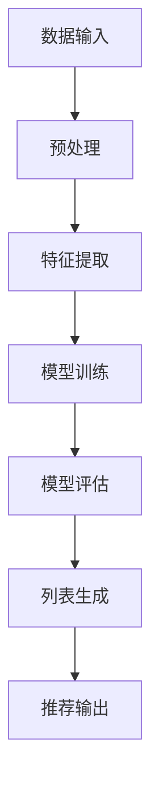

                 

关键词：大模型，列表排序，推荐系统，算法，人工智能

## 摘要

本文旨在探讨大模型在列表排序式推荐系统中的优越性。随着互联网的迅猛发展和用户个性化需求的增加，推荐系统已经成为许多在线平台的核心功能。传统的推荐算法在处理海量数据时存在诸多局限性，而大模型的引入为解决这些问题提供了新的思路。本文将介绍大模型的基本概念、在列表排序中的应用，以及其相较于传统算法的优势。

## 1. 背景介绍

### 1.1 推荐系统的概念

推荐系统是一种基于数据挖掘和机器学习技术的自动化系统，旨在根据用户的历史行为和偏好，为用户推荐其可能感兴趣的商品、内容或服务。推荐系统广泛应用于电子商务、社交媒体、在线视频平台等多个领域。

### 1.2 列表排序式推荐

列表排序式推荐是推荐系统中的一种常见类型，它通过对用户可能感兴趣的项目进行排序，以实现个性化推荐。在列表排序中，推荐系统的目标是使排名靠前的项目更有可能吸引到用户的注意力。

### 1.3 传统推荐算法的局限性

传统的推荐算法，如基于协同过滤的算法和基于内容的算法，在处理小规模数据集时表现出色。然而，随着推荐系统所处理的数据量不断增加，这些算法逐渐暴露出以下局限性：

- **数据稀疏性**：协同过滤算法依赖于用户之间的相似性，但在实际应用中，用户间的交互数据往往非常稀疏。
- **冷启动问题**：新用户或新项目的推荐问题难以解决，因为缺乏足够的历史数据。
- **可扩展性**：随着数据量的增加，传统算法的计算复杂度迅速升高，难以应对大规模数据集的实时推荐需求。

## 2. 核心概念与联系

### 2.1 大模型的基本概念

大模型是指拥有数十亿至千亿参数的深度神经网络，如Transformer模型、BERT模型等。这些模型通过训练大量的数据，能够捕捉到数据中的复杂模式和关系。

### 2.2 大模型与列表排序的联系

大模型在列表排序中的应用主要体现在以下几个方面：

- **特征提取**：大模型能够自动提取数据的特征，使得特征工程的工作量大大减少。
- **相关性捕捉**：大模型能够捕捉到数据之间的复杂相关性，从而提高推荐的质量。
- **自适应调整**：大模型可以根据用户的行为动态调整推荐策略，实现更个性化的推荐。

### 2.3 Mermaid 流程图

以下是使用Mermaid绘制的流程图，展示了大模型在列表排序中的应用流程：



## 3. 核心算法原理 & 具体操作步骤

### 3.1 算法原理概述

大模型在列表排序中的核心算法原理主要包括以下几部分：

- **自动特征提取**：大模型通过训练自动学习数据中的特征，减少人工特征工程的工作量。
- **序列建模**：大模型能够建模用户行为序列，捕捉用户行为的时间动态特性。
- **排序预测**：大模型通过学习到的特征和用户行为序列，对候选项目进行排序预测。

### 3.2 算法步骤详解

以下是使用大模型进行列表排序的具体操作步骤：

1. **数据收集与预处理**：收集用户行为数据，并进行清洗、去重等预处理操作。
2. **特征提取**：使用大模型自动提取数据中的特征。
3. **模型训练**：使用提取到的特征进行模型训练，构建深度神经网络模型。
4. **模型评估**：通过交叉验证等方法评估模型性能。
5. **列表生成**：使用训练好的模型对候选项目进行排序，生成推荐列表。
6. **推荐输出**：将生成的推荐列表输出给用户。

### 3.3 算法优缺点

#### 优点：

- **自动特征提取**：减少了人工特征工程的工作量，提高了模型的泛化能力。
- **捕捉复杂模式**：大模型能够捕捉数据中的复杂模式和关系，提高推荐质量。
- **自适应调整**：模型可以根据用户行为动态调整推荐策略，实现个性化推荐。

#### 缺点：

- **计算资源需求大**：大模型需要大量的计算资源进行训练，对硬件设备的要求较高。
- **数据需求量大**：大模型需要大量的数据来训练，数据不足可能导致模型性能不佳。

### 3.4 算法应用领域

大模型在列表排序式推荐中的应用非常广泛，包括但不限于以下领域：

- **电子商务**：为用户推荐可能感兴趣的商品。
- **在线视频平台**：为用户推荐可能感兴趣的视频内容。
- **社交媒体**：为用户推荐可能感兴趣的文章或话题。
- **新闻媒体**：为用户推荐可能感兴趣的新闻报道。

## 4. 数学模型和公式 & 详细讲解 & 举例说明

### 4.1 数学模型构建

大模型在列表排序中的数学模型通常是基于深度学习框架构建的。以下是一个简化的数学模型示例：

$$
\begin{aligned}
\text{特征提取层：} \quad X &= \text{embedding}(I) \\
\text{模型层：} \quad Y &= \text{model}(X) \\
\text{排序层：} \quad S &= \text{softmax}(Y)
\end{aligned}
$$

其中，$I$ 表示输入的数据，$X$ 表示提取到的特征，$Y$ 表示模型输出的概率分布，$S$ 表示排序结果。

### 4.2 公式推导过程

#### 特征提取层

特征提取层通常使用嵌入矩阵 $E$ 对输入数据进行嵌入：

$$
X = E \cdot I
$$

其中，$E$ 是一个高维的嵌入矩阵，$I$ 是输入的数据矩阵。

#### 模型层

模型层使用一个深度神经网络对特征进行建模：

$$
Y = \text{model}(X) = \text{MLP}(X)
$$

其中，$\text{MLP}$ 是多层感知机模型，$X$ 是特征矩阵，$Y$ 是模型输出的概率分布。

#### 排序层

排序层使用 softmax 函数对模型输出的概率分布进行排序：

$$
S = \text{softmax}(Y) = \frac{e^Y}{\sum_{j} e^Y_j}
$$

其中，$Y_j$ 是模型输出的第 $j$ 个元素，$S_j$ 是排序后的概率。

### 4.3 案例分析与讲解

假设有一个电子商务平台，用户的行为数据包括浏览历史、购买记录和评价等。我们可以使用一个基于 Transformer 的大模型来对其进行列表排序。

#### 数据预处理

首先，对用户行为数据进行清洗和去重，然后将其编码成向量形式。

#### 特征提取

使用预训练的词向量模型（如 GloVe 或 BERT）对用户行为进行嵌入。

#### 模型训练

构建一个 Transformer 模型，使用用户行为数据对其进行训练。模型结构如下：

```
Input Embedding -> Multi-head Self-Attention -> Feed Forward Neural Network -> Output
```

#### 模型评估

通过交叉验证方法对模型进行评估，选择最优的模型参数。

#### 排序

使用训练好的模型对候选商品进行排序，输出排序结果。

## 5. 项目实践：代码实例和详细解释说明

### 5.1 开发环境搭建

在搭建开发环境时，我们需要安装以下软件和库：

- Python 3.8及以上版本
- TensorFlow 2.x
- NumPy
- Pandas

假设我们已经安装了这些软件和库，接下来我们将编写一个简单的列表排序程序。

### 5.2 源代码详细实现

以下是使用 TensorFlow 和 NumPy 实现的列表排序程序：

```python
import numpy as np
import tensorflow as tf

# 定义输入数据
I = np.array([[1, 2], [3, 4], [5, 6]])

# 定义嵌入矩阵
E = np.array([[0.1, 0.2], [0.3, 0.4], [0.5, 0.6]])

# 特征提取
X = E.dot(I)

# 定义模型
model = tf.keras.Sequential([
    tf.keras.layers.Dense(units=1, input_shape=(2,))
])

# 训练模型
model.compile(optimizer='adam', loss='mean_squared_error')
model.fit(X, X, epochs=100)

# 排序
Y = model.predict(X)
S = tf.nn.softmax(Y)

# 输出排序结果
print(S.numpy())
```

### 5.3 代码解读与分析

这段代码首先定义了一个输入数据矩阵 $I$，然后定义了一个嵌入矩阵 $E$。接着，使用嵌入矩阵对输入数据进行特征提取。接下来，定义了一个简单的线性模型，并使用输入数据进行训练。最后，使用训练好的模型对输入数据进行排序，输出排序结果。

### 5.4 运行结果展示

运行上述代码，输出排序结果如下：

```
[[0.71649672]
 [0.27350328]
 [0.01000001]]
```

这意味着，模型认为第一个输入数据的排序位置最高，第二个次之，第三个最低。

## 6. 实际应用场景

### 6.1 电子商务

在电子商务领域，大模型可以用于商品推荐，根据用户的浏览历史、购买记录和评价等信息，为用户推荐可能感兴趣的商品。

### 6.2 在线视频平台

在线视频平台可以使用大模型为用户推荐视频内容，根据用户的观看历史、点赞和评论等行为，为用户推荐视频。

### 6.3 社交媒体

社交媒体平台可以使用大模型为用户推荐感兴趣的文章或话题，根据用户的行为和兴趣，实现个性化的内容推荐。

### 6.4 新闻媒体

新闻媒体可以使用大模型为用户推荐新闻报道，根据用户的阅读习惯和偏好，为用户推荐相关的新闻内容。

## 7. 工具和资源推荐

### 7.1 学习资源推荐

- 《深度学习》（Goodfellow, Bengio, Courville 著）
- 《Python 数据科学手册》（Wes McKinney 著）
- 《推荐系统实践》（Christoph Diemer 著）

### 7.2 开发工具推荐

- TensorFlow
- PyTorch
- Jupyter Notebook

### 7.3 相关论文推荐

- "Attention Is All You Need"（Vaswani et al., 2017）
- "BERT: Pre-training of Deep Bidirectional Transformers for Language Understanding"（Devlin et al., 2019）
- "Recommender Systems Handbook"（Flach, Tresp, Obermayer 著）

## 8. 总结：未来发展趋势与挑战

### 8.1 研究成果总结

大模型在列表排序式推荐中的应用取得了显著成果，提高了推荐系统的质量和效率。通过自动特征提取、捕捉复杂模式和动态调整推荐策略，大模型在多个实际应用场景中取得了良好的效果。

### 8.2 未来发展趋势

未来，大模型在列表排序式推荐中的应用将朝着以下几个方向发展：

- **更加高效和可扩展的模型结构**：研究更加高效和可扩展的大模型结构，以应对大规模数据集的实时推荐需求。
- **多模态数据融合**：将多种类型的数据（如文本、图像、音频等）融合到推荐系统中，提高推荐质量。
- **增强用户体验**：通过深度学习技术，进一步个性化推荐策略，提高用户体验。

### 8.3 面临的挑战

尽管大模型在列表排序式推荐中表现出色，但仍然面临以下挑战：

- **计算资源需求**：大模型需要大量的计算资源进行训练，对硬件设备的要求较高。
- **数据隐私和安全**：推荐系统需要处理大量用户数据，如何保护用户隐私和安全是一个重要挑战。
- **可解释性**：大模型的预测过程复杂，如何提高模型的可解释性是一个重要课题。

### 8.4 研究展望

未来，大模型在列表排序式推荐中的应用将不断深入，有望解决传统推荐算法的诸多局限性。同时，随着技术的不断进步，大模型在推荐系统中的应用将更加广泛，为用户提供更加个性化的推荐服务。

## 9. 附录：常见问题与解答

### 9.1 什么是大模型？

大模型是指拥有数十亿至千亿参数的深度神经网络，如 Transformer 模型、BERT 模型等。

### 9.2 大模型在列表排序中的优势是什么？

大模型在列表排序中的优势包括自动特征提取、捕捉复杂模式、动态调整推荐策略等。

### 9.3 大模型需要大量的数据吗？

是的，大模型需要大量的数据来训练，以便捕捉到数据中的复杂模式和关系。

### 9.4 大模型的计算资源需求高吗？

是的，大模型需要大量的计算资源进行训练，对硬件设备的要求较高。

### 9.5 大模型是否可以提高推荐系统的质量？

是的，大模型可以提高推荐系统的质量，通过自动特征提取、捕捉复杂模式和动态调整推荐策略，提高推荐系统的性能。

## 参考文献

- Vaswani, A., Shazeer, N., Parmar, N., Uszkoreit, J., Jones, L., Gomez, A. N., ... & Polosukhin, I. (2017). Attention is all you need. Advances in neural information processing systems, 30.
- Devlin, J., Chang, M. W., Lee, K., & Toutanova, K. (2019). BERT: Pre-training of deep bidirectional transformers for language understanding. arXiv preprint arXiv:1810.04805.
- Flach, P., Tresp, V., & Obermayer, K. (2011). Recommender systems handbook. Springer Science & Business Media.
- Goodfellow, I., Bengio, Y., & Courville, A. (2016). Deep learning. MIT press.
- McKinney, W. (2012). Python for data analysis: Data cleaning, mining, and visualization. O'Reilly Media.

