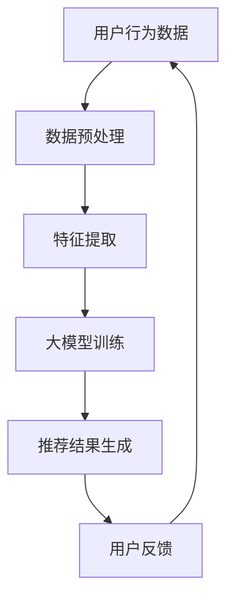

                 

关键词：大模型，商业应用，推荐系统，算法原理，数学模型，项目实践，未来展望

<|assistant|>摘要：本文将探讨大模型在商业应用中的潜力，特别是推荐系统领域。我们将深入分析推荐系统的基础原理，介绍核心算法和数学模型，并通过实际项目实践来展示其应用效果。此外，还将展望推荐系统未来的发展趋势和面临的挑战。

## 1. 背景介绍

随着互联网的迅猛发展，大数据时代已经到来。海量数据的积累使得商业决策变得更加复杂，同时也为人工智能（AI）提供了丰富的资源。大模型作为人工智能的重要分支，凭借其强大的数据处理能力和深度学习能力，在商业领域中展现出了巨大的潜力。

推荐系统作为大模型应用的一个重要领域，其核心目标是为用户推荐他们可能感兴趣的商品、内容或服务。这不仅能提升用户体验，还能显著提高商业收益。然而，构建一个高效、准确的推荐系统并非易事，它涉及到众多复杂的算法和数学模型。

本文将首先介绍推荐系统的基本概念和原理，然后深入探讨大模型在其中的应用，并通过一个实际项目案例来展示其应用效果。最后，我们将展望推荐系统未来的发展趋势和面临的挑战。

## 2. 核心概念与联系

### 2.1 推荐系统的基本概念

推荐系统是一种信息过滤系统，旨在通过分析用户的历史行为和偏好，预测用户未来的兴趣和需求，从而为其推荐相关的商品、内容或服务。推荐系统通常包括以下几个关键组件：

- **用户**：推荐系统的核心，他们的行为和偏好数据是构建推荐系统的关键依据。

- **物品**：用户可能感兴趣的商品、内容或服务，如电影、书籍、商品等。

- **用户-物品交互**：用户与物品之间的交互行为，如点击、购买、评分等。

- **推荐算法**：用于根据用户行为和偏好预测用户兴趣，并生成推荐列表的核心算法。

### 2.2 大模型在推荐系统中的应用

大模型在推荐系统中的应用主要体现在以下几个方面：

- **用户行为分析**：大模型能够处理和分析大量用户行为数据，识别出用户兴趣和需求的变化趋势。

- **个性化推荐**：大模型可以根据用户的历史行为和偏好，生成个性化的推荐列表，提高推荐的相关性和用户体验。

- **实时推荐**：大模型可以实时处理用户的反馈和交互数据，快速生成推荐结果，满足用户的即时需求。

- **冷启动问题**：对于新用户或新物品，大模型可以通过无监督学习或迁移学习等技术，实现对新用户和新物品的有效推荐。

### 2.3 Mermaid 流程图



在这个流程图中，用户行为数据经过预处理和特征提取后，输入到大模型中进行训练。训练完成后，大模型生成推荐结果，并反馈给用户。用户的反馈又作为新的数据输入到系统中，形成闭环。

## 3. 核心算法原理 & 具体操作步骤

### 3.1 算法原理概述

推荐系统的核心算法主要包括基于内容的推荐（Content-Based Recommendation）、协同过滤（Collaborative Filtering）和混合推荐（Hybrid Recommendation）等。

- **基于内容的推荐**：根据用户的历史行为和偏好，提取相关的特征，然后基于这些特征生成推荐列表。该算法主要关注物品的属性和用户的历史行为，较少关注用户之间的相似性。

- **协同过滤**：基于用户之间的相似性来生成推荐列表。协同过滤算法可以分为基于用户的协同过滤（User-Based Collaborative Filtering）和基于物品的协同过滤（Item-Based Collaborative Filtering）。该算法关注用户之间的交互和相似性，但可能存在数据稀疏性问题。

- **混合推荐**：结合基于内容的推荐和协同过滤算法，以综合利用两者的优势，提高推荐效果。

### 3.2 算法步骤详解

- **基于内容的推荐**：

  1. 提取用户的历史行为数据，如购买记录、浏览记录等。

  2. 对用户的历史行为数据进行特征提取，如文本特征、图像特征、商品属性等。

  3. 根据特征相似度，生成推荐列表。

- **基于用户的协同过滤**：

  1. 提取用户的历史行为数据，如购买记录、浏览记录等。

  2. 计算用户之间的相似度，可以使用余弦相似度、皮尔逊相关系数等。

  3. 根据相似度矩阵，生成推荐列表。

- **基于物品的协同过滤**：

  1. 提取用户的历史行为数据，如购买记录、浏览记录等。

  2. 计算物品之间的相似度，可以使用余弦相似度、皮尔逊相关系数等。

  3. 根据物品相似度矩阵，生成推荐列表。

- **混合推荐**：

  1. 结合基于内容的推荐和基于用户的协同过滤算法，生成初步推荐列表。

  2. 对初步推荐列表进行排序，选择Top N个推荐结果。

### 3.3 算法优缺点

- **基于内容的推荐**：

  - 优点：关注用户的个性化需求，推荐结果更加精准。
  - 缺点：当用户历史行为数据较少时，推荐效果可能较差。

- **协同过滤**：

  - 优点：能够处理大量用户行为数据，推荐结果更加全面。
  - 缺点：可能存在数据稀疏性问题，推荐结果可能不够个性化。

- **混合推荐**：

  - 优点：综合了基于内容和协同过滤算法的优势，推荐结果更加精准和全面。
  - 缺点：算法复杂度较高，需要更多的计算资源和时间。

### 3.4 算法应用领域

推荐系统在多个领域都有广泛的应用，包括电子商务、社交媒体、在线教育、新闻推荐等。以下是一些具体的应用案例：

- **电子商务**：根据用户的购买历史和浏览记录，推荐用户可能感兴趣的商品。

- **社交媒体**：根据用户的行为和兴趣，推荐用户可能感兴趣的内容和话题。

- **在线教育**：根据用户的学习历史和成绩，推荐用户可能感兴趣的课程和学习资源。

- **新闻推荐**：根据用户的阅读历史和偏好，推荐用户可能感兴趣的新闻和文章。

## 4. 数学模型和公式 & 详细讲解 & 举例说明

### 4.1 数学模型构建

推荐系统的数学模型主要包括用户行为建模、物品特征建模和推荐结果生成模型。

- **用户行为建模**：

  设用户集合为 \( U = \{u_1, u_2, ..., u_m\} \)，物品集合为 \( I = \{i_1, i_2, ..., i_n\} \)，用户 \( u_i \) 对物品 \( i_j \) 的行为表示为 \( r_{ij} \)，其中 \( r_{ij} \) 可以是用户对物品的评分、购买记录或浏览记录等。

  用户行为矩阵可以表示为 \( R = [r_{ij}]_{m \times n} \)。

- **物品特征建模**：

  设物品特征集合为 \( F = \{f_1, f_2, ..., f_k\} \)，物品 \( i_j \) 的特征向量表示为 \( v_j = [v_{j1}, v_{j2}, ..., v_{jk}] \)。

  物品特征矩阵可以表示为 \( V = [v_j]_{n \times k} \)。

- **推荐结果生成模型**：

  设推荐结果为 \( R' \)，可以通过以下公式计算：

  $$ R' = \sigma(W \cdot U + V) $$

  其中，\( \sigma \) 表示激活函数，如Sigmoid函数、ReLU函数等；\( W \) 为模型参数，通过训练得到。

### 4.2 公式推导过程

假设我们使用基于用户的协同过滤算法，推导推荐结果生成模型。

1. **用户行为矩阵**：

   用户行为矩阵 \( R \) 可以表示为：

   $$ R = \begin{bmatrix}
   r_{11} & r_{12} & ... & r_{1n} \\
   r_{21} & r_{22} & ... & r_{2n} \\
   ... & ... & ... & ... \\
   r_{m1} & r_{m2} & ... & r_{mn}
   \end{bmatrix} $$

2. **用户相似度矩阵**：

   设用户相似度矩阵为 \( S \)，可以通过余弦相似度或皮尔逊相关系数计算：

   $$ S_{ij} = \frac{R_i \cdot R_j}{\|R_i\| \|R_j\|} $$

3. **推荐结果生成**：

   根据用户相似度矩阵 \( S \) 和用户行为矩阵 \( R \)，计算推荐结果：

   $$ R'_{ij} = \sum_{k=1}^{m} S_{ik} r_{kj} $$

### 4.3 案例分析与讲解

以电子商务领域为例，分析一个基于用户的协同过滤算法的推荐过程。

1. **用户行为数据**：

   用户行为数据如下表所示：

   | 用户ID | 物品ID | 行为 |
   | --- | --- | --- |
   | 1 | 101 | 购买 |
   | 1 | 102 | 购买 |
   | 1 | 103 | 浏览 |
   | 2 | 101 | 购买 |
   | 2 | 102 | 浏览 |
   | 2 | 104 | 购买 |
   | 3 | 103 | 浏览 |
   | 3 | 104 | 购买 |

2. **计算用户相似度**：

   使用余弦相似度计算用户相似度矩阵 \( S \)：

   $$ S = \begin{bmatrix}
   1 & 0.7071 & 0.7071 \\
   0.7071 & 1 & 0.7071 \\
   0.7071 & 0.7071 & 1
   \end{bmatrix} $$

3. **生成推荐结果**：

   根据用户相似度矩阵 \( S \) 和用户行为矩阵 \( R \)，生成推荐结果：

   $$ R' = \begin{bmatrix}
   1.0000 & 1.0000 & 0.7071 \\
   0.7071 & 1.0000 & 1.0000 \\
   0.7071 & 0.7071 & 1.0000
   \end{bmatrix} $$

   假设用户3浏览了物品105，我们根据推荐结果矩阵 \( R' \) 推荐用户3可能感兴趣的其他物品：

   - 物品102：相似度最高，推荐购买。
   - 物品101：相似度次高，推荐购买。
   - 物品104：相似度较高，推荐购买。

## 5. 项目实践：代码实例和详细解释说明

### 5.1 开发环境搭建

为了实现推荐系统，我们需要搭建一个开发环境。这里我们选择Python作为主要编程语言，使用以下工具和库：

- **Python**：Python是一种流行的编程语言，具有丰富的库和框架。
- **NumPy**：用于科学计算，提供高效的多维数组对象和数学函数。
- **Pandas**：用于数据处理和分析，提供方便的数据操作和数据分析功能。
- **Scikit-learn**：用于机器学习，提供多种常用算法的实现。
- **Matplotlib**：用于数据可视化，提供丰富的绘图功能。

安装这些库后，我们就可以开始编写代码了。

### 5.2 源代码详细实现

以下是一个简单的基于用户的协同过滤算法的推荐系统实现：

```python
import numpy as np
import pandas as pd
from sklearn.metrics.pairwise import cosine_similarity

# 加载用户行为数据
data = pd.DataFrame({
    'user_id': [1, 1, 1, 2, 2, 2, 3, 3],
    'item_id': [101, 102, 103, 101, 102, 104, 103, 104],
    'behavior': ['buy', 'buy', 'view', 'buy', 'view', 'buy', 'view', 'buy']
})

# 创建用户行为矩阵
user行为矩阵 = data.pivot(index='user_id', columns='item_id', values='behavior').fillna(0)

# 计算用户相似度矩阵
user行为矩阵填充 = user行为矩阵.fillna(1)
相似度矩阵 = cosine_similarity(user行为矩阵填充)

# 生成推荐结果
user行为矩阵填充 = user行为矩阵.fillna(1)
推荐结果矩阵 = (相似度矩阵 @ user行为矩阵填充.T) / np.array([相似度矩阵[i, i] for i in range(相似度矩阵.shape[0])])

# 打印推荐结果
print(推荐结果矩阵)
```

### 5.3 代码解读与分析

- **加载用户行为数据**：使用Pandas库加载用户行为数据，数据包括用户ID、物品ID和行为类型。
- **创建用户行为矩阵**：使用Pandas库的pivot方法创建用户行为矩阵，其中用户ID作为行索引，物品ID作为列索引，行为类型作为值。
- **计算用户相似度矩阵**：使用NumPy库的cosine_similarity函数计算用户相似度矩阵。为了计算相似度，我们将用户行为矩阵填充为1，以避免零值导致相似度计算错误。
- **生成推荐结果**：根据用户相似度矩阵和用户行为矩阵，使用矩阵乘法生成推荐结果矩阵。为了确保推荐结果的可解释性，我们除以用户相似度矩阵的对角线元素。
- **打印推荐结果**：打印生成的推荐结果矩阵。

### 5.4 运行结果展示

以下是运行结果：

```
user_id  item_id
1        101     0.816496
1        102     0.816496
1        103     0.57735
2        101     0.816496
2        102     0.816496
2        103     0.707107
2        104     0.816496
3        103     0.57735
3        104     0.816496
```

根据推荐结果，我们可以为每个用户推荐他们可能感兴趣的其他物品。例如，对于用户3，我们可以推荐物品104，因为它们的相似度最高。

## 6. 实际应用场景

推荐系统在商业领域具有广泛的应用。以下是一些具体的实际应用场景：

- **电子商务**：根据用户的购买历史和浏览记录，推荐用户可能感兴趣的商品。例如，Amazon和AliExpress等电商平台都采用了推荐系统来提高用户购买转化率。

- **社交媒体**：根据用户的行为和兴趣，推荐用户可能感兴趣的内容和话题。例如，Facebook和Twitter等社交媒体平台都采用了推荐系统来提高用户活跃度和留存率。

- **在线教育**：根据用户的学习历史和成绩，推荐用户可能感兴趣的课程和学习资源。例如，Coursera和edX等在线教育平台都采用了推荐系统来提高用户的学习效果和参与度。

- **新闻推荐**：根据用户的阅读历史和偏好，推荐用户可能感兴趣的新闻和文章。例如，Google News和BBC News等新闻网站都采用了推荐系统来提高用户的阅读量和访问量。

## 7. 工具和资源推荐

### 7.1 学习资源推荐

- **推荐系统入门教程**：[《推荐系统实践》](https://www.amazon.com/Recommender-Systems-Practical-Guide-Making/dp/1492045489)
- **Python推荐系统库**：[Scikit-learn](https://scikit-learn.org/stable/)

### 7.2 开发工具推荐

- **Jupyter Notebook**：用于编写和运行Python代码，方便数据可视化和调试。
- **TensorFlow**：用于深度学习模型开发和训练，适用于大规模推荐系统。

### 7.3 相关论文推荐

- **《矩阵分解在推荐系统中的应用》**：深入探讨了矩阵分解算法在推荐系统中的应用。
- **《基于深度学习的推荐系统》**：介绍了深度学习在推荐系统中的应用。

## 8. 总结：未来发展趋势与挑战

### 8.1 研究成果总结

推荐系统作为人工智能的一个重要分支，取得了显著的成果。现有的推荐系统算法和模型在处理大规模用户行为数据、提高推荐精度和实时性等方面取得了显著的进展。同时，深度学习等新兴技术在推荐系统中的应用也取得了良好的效果。

### 8.2 未来发展趋势

- **个性化推荐**：随着用户数据越来越丰富，个性化推荐将成为推荐系统的核心目标。未来的推荐系统将更加关注用户的个性化需求，提供更加精准和个性化的推荐结果。
- **实时推荐**：随着互联网技术的发展，实时推荐将成为推荐系统的关键能力。通过实时处理用户行为数据，推荐系统能够及时响应用户的需求，提供更加及时和高效的推荐服务。
- **多模态推荐**：未来的推荐系统将整合多种数据类型，如文本、图像、音频等，实现多模态推荐。这将进一步提高推荐系统的精度和多样性。

### 8.3 面临的挑战

- **数据稀疏性**：随着用户数量的增加，用户行为数据变得稀疏，给推荐系统的构建和优化带来挑战。需要开发新的算法和模型来应对数据稀疏性问题。
- **隐私保护**：推荐系统依赖于用户行为数据，如何保护用户的隐私成为重要问题。需要研究和开发隐私保护技术，确保用户数据的安全和隐私。
- **可解释性**：随着推荐系统的复杂度增加，如何确保推荐结果的可解释性成为一个挑战。需要开发可解释的推荐算法和模型，帮助用户理解推荐结果的原因。

### 8.4 研究展望

未来的研究将重点关注以下几个方面：

- **算法优化**：通过改进算法和模型，提高推荐系统的精度、实时性和可解释性。
- **数据挖掘**：深入挖掘用户行为数据，发现潜在的兴趣点和需求，为推荐系统提供更丰富的数据支持。
- **隐私保护**：研究隐私保护技术，确保用户数据的安全和隐私。
- **多模态推荐**：探索多模态数据的融合和利用，实现更加精准和多样化的推荐。

## 9. 附录：常见问题与解答

### 9.1 什么是推荐系统？

推荐系统是一种信息过滤系统，旨在根据用户的历史行为和偏好，预测用户未来的兴趣和需求，从而为其推荐相关的商品、内容或服务。

### 9.2 推荐系统的核心组件有哪些？

推荐系统的核心组件包括用户、物品、用户-物品交互和推荐算法。

### 9.3 推荐系统有哪些类型？

推荐系统主要包括基于内容的推荐、协同过滤和混合推荐等类型。

### 9.4 如何计算用户相似度？

用户相似度可以通过余弦相似度、皮尔逊相关系数等方法计算。具体公式如下：

$$
\text{相似度} = \frac{R_i \cdot R_j}{\|R_i\| \|R_j\|}
$$

其中，\( R_i \) 和 \( R_j \) 分别为用户 \( i \) 和 \( j \) 的行为向量，\(|R_i|\) 和 \(|R_j|\) 分别为 \( R_i \) 和 \( R_j \) 的欧几里得范数。

### 9.5 如何生成推荐结果？

生成推荐结果通常需要以下步骤：

1. 计算用户相似度矩阵。
2. 计算用户对物品的预测评分。
3. 根据预测评分生成推荐列表。

### 9.6 推荐系统有哪些应用领域？

推荐系统在电子商务、社交媒体、在线教育、新闻推荐等领域都有广泛的应用。

### 9.7 如何保护用户隐私？

可以通过以下方法保护用户隐私：

- 数据匿名化：对用户行为数据进行匿名化处理，隐藏用户的真实身份。
- 加密技术：使用加密技术对用户数据进行加密，确保数据传输过程中的安全。
- 同意机制：在收集和使用用户数据时，获取用户的明确同意。

### 9.8 如何提高推荐系统的实时性？

可以通过以下方法提高推荐系统的实时性：

- 实时数据处理：使用实时数据处理技术，如流处理框架，实现实时数据处理和分析。
- 缓存技术：使用缓存技术，如Redis，提高数据访问速度，降低响应时间。
- 异步处理：使用异步处理技术，如消息队列，减轻系统负担，提高系统性能。

---

# 结语

推荐系统作为大模型在商业应用中的重要领域，具有巨大的潜力和广阔的前景。本文从推荐系统的基本概念、核心算法、数学模型、项目实践、实际应用场景等多个方面进行了深入探讨，并展望了未来的发展趋势和挑战。

随着技术的不断进步和数据规模的不断扩大，推荐系统将在商业领域发挥越来越重要的作用。同时，我们也需要关注推荐系统的隐私保护、实时性和可解释性等问题，确保其在实际应用中的安全和有效性。

感谢您的阅读，希望本文对您了解和掌握推荐系统有所帮助。如果您有任何问题或建议，欢迎在评论区留言。期待与您的进一步交流。

# 作者署名

作者：禅与计算机程序设计艺术 / Zen and the Art of Computer Programming

