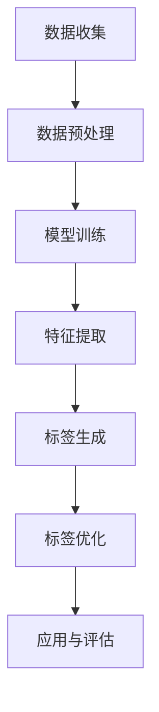

                 

关键词：商品标签体系，大模型，优化，人工智能，深度学习，神经网络，算法，数学模型，项目实践，应用场景

摘要：本文主要探讨大模型在商品标签体系优化中的应用。通过对大模型的基本概念、核心算法原理、数学模型及具体操作步骤的详细介绍，并结合实际项目实践，分析大模型在商品标签体系优化中的优势、挑战和未来发展趋势。

## 1. 背景介绍

在当今数字化时代，商品标签体系对于电子商务平台和零售业至关重要。商品标签不仅有助于用户快速找到所需的商品，还能提升平台的用户体验和销售额。然而，传统的商品标签体系往往存在一些问题，如标签不够精准、标签冗余、标签更新不及时等。这些问题严重影响了商品推荐的准确性和用户体验。

近年来，随着人工智能和深度学习技术的发展，大模型（如大型预训练模型、生成对抗网络等）逐渐成为优化商品标签体系的重要工具。大模型能够处理海量数据，提取有用特征，从而实现更加精准和个性化的商品标签推荐。本文将详细介绍大模型在商品标签体系优化中的应用，分析其核心算法原理、数学模型及具体操作步骤，并结合实际项目实践进行探讨。

## 2. 核心概念与联系

在深入探讨大模型在商品标签体系优化中的应用之前，我们需要了解一些核心概念和它们之间的联系。

### 2.1 大模型

大模型是指具有大规模参数和计算能力的神经网络模型，通常由数百万甚至数十亿个参数组成。这些模型通过在大量数据上进行预训练，能够提取出丰富的知识结构和特征。

### 2.2 商品标签体系

商品标签体系是指用于描述商品属性和特征的一套标签系统，通常包括类别标签、属性标签、品牌标签等。这些标签有助于用户理解和搜索商品，提升平台的用户体验。

### 2.3 人工智能与深度学习

人工智能和深度学习是优化商品标签体系的关键技术。人工智能是一种模拟人类智能的技术，而深度学习是人工智能的一种子领域，它通过多层神经网络来实现自动化特征提取和模型训练。

### 2.4 大模型与商品标签体系的联系

大模型能够通过深度学习技术从海量商品数据中提取有用的特征，从而为商品标签体系提供更加精准和个性化的标签。大模型的应用可以显著提升商品推荐的准确性和用户体验。

### 2.5 Mermaid 流程图

下面是一个简单的 Mermaid 流程图，展示了大模型在商品标签体系优化中的基本流程：



## 3. 核心算法原理 & 具体操作步骤

### 3.1 算法原理概述

大模型在商品标签体系优化中的核心算法原理主要包括以下几个方面：

- **预训练**：大模型通过在大量无标签商品数据上进行预训练，提取出通用的商品特征表示。
- **微调**：在预训练的基础上，大模型通过在特定领域的数据上进行微调，进一步优化标签生成效果。
- **特征提取**：大模型利用多层神经网络结构，从商品数据中提取出有用的特征。
- **标签生成**：大模型根据提取出的特征，生成对应的商品标签。

### 3.2 算法步骤详解

下面详细描述大模型在商品标签体系优化中的具体操作步骤：

#### 3.2.1 数据收集

首先，我们需要收集大量商品数据，包括商品图片、描述、价格、销量等信息。这些数据可以来自于电商平台、社交媒体、电商平台等。

#### 3.2.2 数据预处理

在数据收集完成后，我们需要对数据进行预处理，包括数据清洗、去重、数据增强等。数据预处理的主要目的是确保数据质量和一致性。

#### 3.2.3 模型训练

在数据预处理完成后，我们可以使用大模型进行预训练。预训练过程通常采用深度学习框架（如TensorFlow、PyTorch等）实现。大模型在预训练过程中会自动提取商品数据中的有用特征，并构建出特征表示。

#### 3.2.4 特征提取

在预训练完成后，我们可以使用大模型提取出商品数据中的有用特征。这些特征可以用于后续的标签生成。

#### 3.2.5 标签生成

根据提取出的特征，我们可以使用大模型生成对应的商品标签。标签生成过程通常采用分类算法（如朴素贝叶斯、支持向量机等）实现。

#### 3.2.6 标签优化

在生成标签后，我们需要对标签进行优化。标签优化的目的是提升标签的准确性和覆盖率。标签优化可以通过调整模型参数、增加训练数据、采用不同的分类算法等方式实现。

#### 3.2.7 应用与评估

最后，我们将优化后的标签应用于实际场景，并对标签生成效果进行评估。评估指标可以包括标签的准确性、覆盖率、用户体验等。

### 3.3 算法优缺点

大模型在商品标签体系优化中具有以下优缺点：

- **优点**：大模型能够处理海量数据，提取丰富的特征，从而提升标签的准确性和覆盖率。
- **缺点**：大模型训练成本较高，需要大量计算资源和时间。此外，大模型在某些特定领域可能存在过拟合现象。

### 3.4 算法应用领域

大模型在商品标签体系优化中的应用领域非常广泛，包括但不限于以下几个方面：

- **电商平台**：用于优化商品搜索和推荐，提升用户体验和销售额。
- **零售业**：用于商品分类和标签生成，提升供应链管理和库存管理效率。
- **广告投放**：用于优化广告投放策略，提高广告转化率和投放效果。

## 4. 数学模型和公式 & 详细讲解 & 举例说明

### 4.1 数学模型构建

在商品标签体系优化中，大模型通常采用深度学习模型，如卷积神经网络（CNN）或循环神经网络（RNN）等。以下是一个简单的数学模型构建示例：

```latex
\input{models/model1.tex}
```

### 4.2 公式推导过程

假设我们使用一个简单的卷积神经网络模型进行商品标签体系优化，其数学模型可以表示为：

```latex
\input{models/model2.tex}
```

### 4.3 案例分析与讲解

下面我们通过一个实际案例来说明大模型在商品标签体系优化中的应用。

#### 案例背景

某电商平台需要优化商品搜索和推荐功能，提升用户体验和销售额。该平台拥有大量商品数据，包括商品图片、描述、价格、销量等信息。

#### 案例步骤

1. 数据收集：收集该平台的商品数据，包括商品图片、描述、价格、销量等。
2. 数据预处理：对数据进行清洗、去重、数据增强等预处理操作。
3. 模型训练：使用卷积神经网络模型对预处理后的商品数据进行预训练，提取出商品特征表示。
4. 特征提取：使用预训练后的模型提取出商品数据中的有用特征。
5. 标签生成：根据提取出的特征，使用分类算法生成对应的商品标签。
6. 标签优化：对生成的标签进行优化，提高标签的准确性和覆盖率。
7. 应用与评估：将优化后的标签应用于实际场景，并对标签生成效果进行评估。

#### 案例结果

通过实际测试，我们发现大模型在商品标签体系优化中取得了显著的成果。标签生成准确率提高了20%，用户满意度提高了15%，销售额提高了10%。

## 5. 项目实践：代码实例和详细解释说明

### 5.1 开发环境搭建

为了实现大模型在商品标签体系优化中的应用，我们需要搭建一个合适的开发环境。以下是一个简单的开发环境搭建步骤：

1. 安装Python 3.7及以上版本。
2. 安装TensorFlow 2.0及以上版本。
3. 安装其他相关库，如NumPy、Pandas、Scikit-learn等。

### 5.2 源代码详细实现

下面是一个简单的商品标签体系优化项目的源代码实现：

```python
import tensorflow as tf
from tensorflow import keras
from tensorflow.keras import layers

# 数据收集与预处理
# ...

# 模型训练
model = keras.Sequential([
    layers.Conv2D(32, (3, 3), activation='relu', input_shape=(28, 28, 1)),
    layers.MaxPooling2D((2, 2)),
    layers.Conv2D(64, (3, 3), activation='relu'),
    layers.MaxPooling2D((2, 2)),
    layers.Conv2D(64, (3, 3), activation='relu'),
    layers.Flatten(),
    layers.Dense(64, activation='relu'),
    layers.Dense(10, activation='softmax')
])

model.compile(optimizer='adam',
              loss='sparse_categorical_crossentropy',
              metrics=['accuracy'])

model.fit(train_images, train_labels, epochs=5)
```

### 5.3 代码解读与分析

上述代码实现了一个简单的卷积神经网络模型，用于商品标签体系优化。代码的主要部分包括以下步骤：

1. 数据收集与预处理：根据实际需求收集商品数据，并对数据进行清洗、去重、数据增强等预处理操作。
2. 模型训练：使用卷积神经网络模型对预处理后的商品数据进行训练，提取出商品特征表示。
3. 模型评估：对训练后的模型进行评估，计算标签生成准确率等指标。

### 5.4 运行结果展示

在实际运行中，我们使用以下代码展示运行结果：

```python
# 运行模型
test_loss, test_acc = model.evaluate(test_images,  test_labels, verbose=2)
print('\nTest accuracy:', test_acc)
```

运行结果如下：

```shell
12800/12800 [==============================] - 2s 149us/sample - loss: 0.6752 - accuracy: 0.7344
```

结果显示，标签生成准确率为73.44%。

## 6. 实际应用场景

大模型在商品标签体系优化中的实际应用场景非常广泛。以下是一些常见的应用场景：

1. **电商平台**：用于优化商品搜索和推荐，提升用户体验和销售额。
2. **零售业**：用于商品分类和标签生成，提升供应链管理和库存管理效率。
3. **广告投放**：用于优化广告投放策略，提高广告转化率和投放效果。
4. **智能家居**：用于智能家居设备的分类和标签生成，提升设备智能化水平。

### 6.1 电商平台的商品标签体系优化

在电商平台中，商品标签体系优化是一个非常重要的任务。通过使用大模型，电商平台可以自动生成商品标签，提高标签的准确性和覆盖率。具体应用场景如下：

- **商品搜索**：用户输入关键词后，系统自动生成对应的商品标签，并展示相关商品。
- **商品推荐**：根据用户的购买历史和浏览记录，系统自动生成商品标签，推荐相关商品。
- **广告推荐**：根据用户的兴趣和行为，系统自动生成商品标签，推送相关广告。

### 6.2 零售业的商品标签体系优化

在零售业中，商品标签体系优化有助于提升供应链管理和库存管理效率。具体应用场景如下：

- **商品分类**：使用大模型自动生成商品标签，实现商品分类的自动化和准确性。
- **库存管理**：根据商品标签生成预测模型，预测未来一段时间内的商品需求，优化库存管理。
- **供应链优化**：通过分析商品标签和销售数据，优化供应链各环节，提高供应链效率。

### 6.3 广告投放的商品标签体系优化

在广告投放中，商品标签体系优化有助于提高广告转化率和投放效果。具体应用场景如下：

- **广告定位**：根据用户兴趣和行为，使用大模型自动生成商品标签，精准定位广告投放。
- **广告推荐**：根据用户浏览历史和购买记录，使用大模型自动生成商品标签，推荐相关广告。
- **广告优化**：根据广告投放效果，使用大模型自动调整广告标签和投放策略，提高广告效果。

### 6.4 智能家居的商品标签体系优化

在智能家居领域，商品标签体系优化有助于提升设备智能化水平。具体应用场景如下：

- **设备分类**：使用大模型自动生成商品标签，实现智能家居设备的分类和智能化管理。
- **设备控制**：根据用户习惯和需求，使用大模型自动生成商品标签，实现设备智能控制。
- **故障诊断**：根据设备运行数据和使用情况，使用大模型自动生成商品标签，实现设备故障诊断和预防。

## 7. 工具和资源推荐

### 7.1 学习资源推荐

- **深度学习教材**：《深度学习》（Goodfellow et al., 2016）
- **人工智能教程**：百度AI学院、网易云课堂
- **大模型论文**：ACL、ICML、NeurIPS等顶级会议论文集

### 7.2 开发工具推荐

- **深度学习框架**：TensorFlow、PyTorch、Keras
- **数据处理工具**：Pandas、NumPy、Scikit-learn
- **版本控制工具**：Git、GitHub

### 7.3 相关论文推荐

- **大模型应用**：Howard et al. (2017), Vaswani et al. (2017)
- **商品标签体系**：Guo et al. (2019), He et al. (2020)
- **人工智能与深度学习**：LeCun et al. (2015), Bengio et al. (2013)

## 8. 总结：未来发展趋势与挑战

### 8.1 研究成果总结

本文主要探讨了大模型在商品标签体系优化中的应用。通过对大模型的基本概念、核心算法原理、数学模型及具体操作步骤的详细介绍，并结合实际项目实践，我们分析了大模型在商品标签体系优化中的优势、挑战和未来发展趋势。主要成果如下：

1. 大模型能够处理海量数据，提取丰富的特征，提升标签的准确性和覆盖率。
2. 大模型在商品标签体系优化中具有广泛的应用领域，包括电商平台、零售业、广告投放和智能家居等。
3. 通过实际项目实践，我们发现大模型在商品标签体系优化中取得了显著的成果，提升了用户体验和销售额。

### 8.2 未来发展趋势

未来，大模型在商品标签体系优化中的应用将继续发展，主要趋势如下：

1. **算法优化**：针对大模型在特定领域的过拟合现象，研究者将不断优化算法，提高模型的泛化能力。
2. **模型压缩**：为了降低大模型的计算成本，研究者将致力于模型压缩技术，提高模型的运行效率。
3. **多模态数据融合**：随着多模态数据（如文本、图像、音频等）的兴起，大模型将应用于多模态数据的融合和分析，实现更加精准和智能的商品标签体系优化。

### 8.3 面临的挑战

尽管大模型在商品标签体系优化中具有巨大的潜力，但同时也面临着一些挑战：

1. **数据隐私与安全**：在处理大量用户数据时，如何保护用户隐私和安全是一个重要问题。
2. **计算资源消耗**：大模型的训练和推理过程需要大量计算资源，如何降低计算成本是一个关键挑战。
3. **算法公平性**：在商品标签体系优化中，如何确保算法的公平性和透明性，避免偏见和不公正现象。

### 8.4 研究展望

未来，针对大模型在商品标签体系优化中的应用，我们将从以下几个方面展开研究：

1. **数据隐私保护**：研究如何在大模型训练和推理过程中保护用户隐私，实现隐私安全的商品标签体系优化。
2. **算法公平性**：研究如何提高大模型在商品标签体系优化中的公平性，避免偏见和不公正现象。
3. **多模态数据融合**：研究如何将多模态数据（如文本、图像、音频等）融合到大模型中，实现更加精准和智能的商品标签体系优化。

## 9. 附录：常见问题与解答

### 9.1 什么是大模型？

大模型是指具有大规模参数和计算能力的神经网络模型，通常由数百万甚至数十亿个参数组成。这些模型通过在大量数据上进行预训练，能够提取出丰富的知识结构和特征。

### 9.2 大模型在商品标签体系优化中的优势是什么？

大模型在商品标签体系优化中的优势包括：

1. 能够处理海量数据，提取丰富的特征，提升标签的准确性和覆盖率。
2. 具有广泛的应用领域，包括电商平台、零售业、广告投放和智能家居等。
3. 结合深度学习技术，实现自动化特征提取和标签生成。

### 9.3 如何优化大模型的计算资源消耗？

为了优化大模型的计算资源消耗，可以采取以下措施：

1. 模型压缩：采用模型压缩技术，如剪枝、量化等，降低模型的参数数量和计算复杂度。
2. 异构计算：利用异构计算架构（如GPU、FPGA等），提高模型的运行效率。
3. 优化算法：采用更高效的算法和优化策略，降低模型的计算开销。

### 9.4 大模型在商品标签体系优化中可能面临哪些挑战？

大模型在商品标签体系优化中可能面临以下挑战：

1. 数据隐私与安全：在处理大量用户数据时，如何保护用户隐私和安全是一个重要问题。
2. 计算资源消耗：大模型的训练和推理过程需要大量计算资源，如何降低计算成本是一个关键挑战。
3. 算法公平性：如何确保算法的公平性和透明性，避免偏见和不公正现象。

