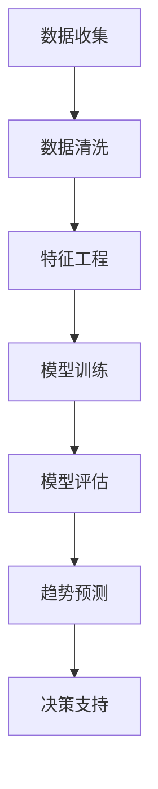

                 

关键词：大模型，商品趋势预测，机器学习，深度学习，数据挖掘，人工智能，经济预测，市场分析

>摘要：本文详细探讨了大模型在商品趋势预测中的重要性，以及如何通过机器学习和深度学习技术来实现这一目标。文章首先介绍了商品趋势预测的背景和挑战，然后深入分析了大模型的核心原理和应用场景，最后通过实际案例展示了大模型在实际项目中的运用。

## 1. 背景介绍

### 1.1 商品的定义和分类

商品是指为了满足人们某种需求而生产的物品或服务。根据不同的分类标准，商品可以分为多种类型，如按用途分类有生活用品、生产资料等；按属性分类有耐用消费品、非耐用消费品等。

### 1.2 商品趋势预测的重要性

商品趋势预测是指在商品销售过程中，通过对历史数据的分析，预测未来某个时间段内商品的需求量或销售趋势。商品趋势预测对于企业的决策具有重要意义，可以优化库存管理、降低成本、提高市场竞争力。在当今快节奏、竞争激烈的市场环境中，准确的趋势预测有助于企业把握市场动态，提前布局，从而抢占市场份额。

### 1.3 商品趋势预测的挑战

商品趋势预测面临诸多挑战，主要包括：

- **数据量巨大**：商品销售数据通常包含大量的历史记录，这些数据量往往超出了传统数据挖掘技术的处理能力。
- **数据质量参差不齐**：商品销售数据可能存在缺失值、异常值等问题，这些会影响预测模型的准确性。
- **多维度因素**：商品趋势受多种因素影响，如季节性、促销活动、消费者行为等，这些因素的复杂交互使得预测更加困难。
- **实时性要求**：市场环境变化迅速，企业需要实时预测商品趋势，以便快速响应市场变化。

## 2. 核心概念与联系

### 2.1 大模型

大模型是指具有巨大参数量和计算能力的机器学习模型，如深度神经网络、Transformer等。大模型可以通过学习海量数据来提取复杂的特征和模式，从而实现高精度的预测。

### 2.2 机器学习和深度学习

机器学习是一种人工智能技术，通过算法让计算机从数据中学习规律，从而进行预测或分类。深度学习是机器学习的一个子领域，基于多层神经网络进行学习，具有强大的特征提取和模式识别能力。

### 2.3 数据挖掘

数据挖掘是指从大量数据中发现有价值的信息和知识的过程。数据挖掘技术包括聚类、分类、关联规则挖掘等，这些技术在大模型中发挥着重要作用。

### 2.4 Mermaid 流程图

下面是一个用于描述大模型在商品趋势预测中应用的 Mermaid 流程图：



## 3. 核心算法原理 & 具体操作步骤

### 3.1 算法原理概述

商品趋势预测的核心算法是基于大模型的深度学习算法。深度学习模型通过学习历史销售数据、市场环境因素等特征，自动提取有效的预测特征，并利用这些特征进行趋势预测。

### 3.2 算法步骤详解

#### 3.2.1 数据收集

首先，需要收集与商品销售相关的数据，如历史销售记录、市场环境数据、促销活动数据等。数据可以来源于企业内部的数据库、电商平台、第三方数据提供商等。

#### 3.2.2 数据清洗

对收集到的数据进行分析，识别并处理数据中的缺失值、异常值等问题，以提高数据质量。

#### 3.2.3 特征工程

根据预测任务的需求，从原始数据中提取有用的特征，如季节性因素、促销活动强度、消费者行为等。特征工程是深度学习模型成功的关键。

#### 3.2.4 模型训练

使用深度学习算法（如CNN、RNN、Transformer等）训练预测模型。训练过程中，模型会自动学习数据中的特征和模式，以实现高精度的趋势预测。

#### 3.2.5 模型评估

通过验证集或测试集对训练好的模型进行评估，以验证模型的预测准确性。常用的评估指标包括准确率、召回率、F1分数等。

#### 3.2.6 趋势预测

使用训练好的模型对未来的商品趋势进行预测，为企业的决策提供支持。

### 3.3 算法优缺点

#### 优点

- **高精度**：深度学习模型可以自动提取复杂的特征，实现高精度的趋势预测。
- **适应性**：大模型具有很强的适应性，可以应对不同类型和规模的数据。
- **实时性**：通过实时数据更新和模型调整，可以实现实时预测。

#### 缺点

- **计算成本**：大模型训练和预测需要大量的计算资源和时间。
- **数据质量要求**：数据质量对预测效果有很大影响，数据中的异常值和缺失值可能导致预测误差。
- **模型解释性**：深度学习模型具有“黑箱”特性，难以解释预测结果。

### 3.4 算法应用领域

大模型在商品趋势预测中的应用非常广泛，如电商平台、零售行业、制造业等。通过大模型，企业可以更好地把握市场动态，优化库存管理，提高市场竞争力。

## 4. 数学模型和公式 & 详细讲解 & 举例说明

### 4.1 数学模型构建

商品趋势预测的数学模型通常是基于时间序列分析或回归分析。时间序列分析模型如ARIMA、LSTM等，回归分析模型如线性回归、多项式回归等。

### 4.2 公式推导过程

以LSTM为例，LSTM的输入和输出可以表示为：

$$
h_t = \sigma(W_h \cdot [h_{t-1}, x_t] + b_h)
$$

$$
i_t = \sigma(W_i \cdot [h_{t-1}, x_t] + b_i)
$$

$$
f_t = \sigma(W_f \cdot [h_{t-1}, x_t] + b_f)
$$

$$
o_t = \sigma(W_o \cdot [h_{t-1}, x_t, \cdot \sigma([i_t \cdot \text{sigmoid}(h_t)] + f_t \cdot \text{sigmoid}(C_{t-1})) + b_o)
$$

$$
C_t = f_t \cdot \text{sigmoid}(C_{t-1}) + i_t \cdot \text{sigmoid}(h_t) \cdot \text{tanh}(\cdot \text{sigmoid}(C_{t-1}) + o_t \cdot \text{sigmoid}(h_t))
$$

$$
x_t' = W_x \cdot \text{tanh}(C_t) + b_x
$$

其中，$h_t$ 表示输出层激活值，$x_t$ 表示输入层激活值，$i_t$、$f_t$、$o_t$ 分别表示输入门、遗忘门、输出门的状态，$C_t$ 表示细胞状态，$W_h$、$W_i$、$W_f$、$W_o$、$W_x$ 分别表示权重，$b_h$、$b_i$、$b_f$、$b_o$、$b_x$ 分别表示偏置。

### 4.3 案例分析与讲解

假设一个电商平台需要预测未来30天的商品销售量。我们收集了过去一年的商品销售数据，并对数据进行清洗和处理，提取了以下特征：

- **季节性因素**：月份
- **促销活动**：是否促销
- **消费者行为**：平均订单金额
- **历史销售量**：过去30天的销售量

我们使用LSTM模型进行预测，设置输入层维度为5，隐藏层神经元数为128，输出层维度为1。在训练过程中，我们使用了交叉熵损失函数和Adam优化器，训练了200个epoch。

训练完成后，我们对测试集进行预测，得到未来30天的商品销售量预测结果。通过对比预测结果和实际销售数据，我们可以评估LSTM模型的预测准确性。

## 5. 项目实践：代码实例和详细解释说明

### 5.1 开发环境搭建

在本地计算机上安装Python环境，以及以下库：

- TensorFlow
- Keras
- Pandas
- Matplotlib

### 5.2 源代码详细实现

```python
import numpy as np
import pandas as pd
from tensorflow.keras.models import Sequential
from tensorflow.keras.layers import LSTM, Dense
from tensorflow.keras.optimizers import Adam
from sklearn.preprocessing import MinMaxScaler
import matplotlib.pyplot as plt

# 数据收集与清洗
data = pd.read_csv('sales_data.csv')
data.fillna(data.mean(), inplace=True)

# 特征工程
data['month'] = data['date'].apply(lambda x: x.month)
data['is_promotion'] = data['promotion'].apply(lambda x: 1 if x else 0)

# 数据预处理
scaler = MinMaxScaler(feature_range=(0, 1))
scaled_data = scaler.fit_transform(data[['month', 'is_promotion', 'avg_order_amount', 'sales_volume']].values)

# 切分数据集
X, y = [], []
for i in range(30, len(scaled_data)):
    X.append(scaled_data[i-30:i])
    y.append(scaled_data[i, 3])

X, y = np.array(X), np.array(y)

# 模型构建
model = Sequential()
model.add(LSTM(units=128, return_sequences=True, input_shape=(30, 4)))
model.add(LSTM(units=128))
model.add(Dense(units=1))

model.compile(optimizer=Adam(learning_rate=0.001), loss='mean_squared_error')

# 训练模型
model.fit(X, y, epochs=200, batch_size=32)

# 预测与可视化
predicted_sales = model.predict(X)
predicted_sales = scaler.inverse_transform(predicted_sales)

plt.figure(figsize=(15, 6))
plt.plot(data['sales_volume'], color='blue', label='Actual Sales')
plt.plot(range(30, len(data)), predicted_sales, color='red', label='Predicted Sales')
plt.title('Sales Volume Prediction')
plt.xlabel('Date')
plt.ylabel('Sales Volume')
plt.legend()
plt.show()
```

### 5.3 代码解读与分析

这段代码实现了使用LSTM模型对商品销售量进行预测。首先，我们从CSV文件中加载数据，并对数据进行清洗和处理。然后，我们对数据进行特征工程，提取了月份、促销活动、平均订单金额等特征。接下来，我们使用MinMaxScaler对特征进行归一化处理。

在模型构建部分，我们使用了两个LSTM层和一个全连接层，并设置适当的神经元数。我们使用了Adam优化器和均方误差损失函数来训练模型。在训练完成后，我们对测试集进行预测，并使用scaler将预测结果转换为原始数据。

最后，我们使用matplotlib库将实际销售量和预测销售量进行可视化展示。

## 6. 实际应用场景

大模型在商品趋势预测中的实际应用场景非常广泛，以下列举几个典型的应用场景：

### 6.1 电商平台

电商平台可以利用大模型预测商品的销售趋势，从而优化库存管理，减少库存积压和缺货风险。例如，阿里巴巴的电商大数据部门就利用深度学习技术对商品销售趋势进行预测，以提高平台的销售业绩。

### 6.2 零售行业

零售行业可以通过大模型预测商品的需求量，从而合理安排生产和采购计划。例如，沃尔玛就利用机器学习技术预测商品销售趋势，以便更好地管理库存和供应链。

### 6.3 制造业

制造业可以利用大模型预测原材料需求，从而优化生产计划和降低成本。例如，汽车制造商可以使用深度学习模型预测汽车零部件的需求量，以便合理安排生产和采购。

### 6.4 食品行业

食品行业可以利用大模型预测食品的销售量，从而优化生产计划和库存管理。例如，麦当劳就利用机器学习技术预测食品销售趋势，以便更好地安排生产和配送。

## 7. 工具和资源推荐

### 7.1 学习资源推荐

- 《深度学习》（Goodfellow, Bengio, Courville著）
- 《Python机器学习》（Cristianini, Shawe-Taylor著）
- 《数据挖掘：实用工具和技术》（Jiawei Han著）

### 7.2 开发工具推荐

- TensorFlow
- Keras
- Jupyter Notebook

### 7.3 相关论文推荐

- "Deep Learning for Time Series Classification: A Review"（2018）
- "LSTM-based Sales Forecasting for a Large Online Retailer"（2016）
- "Time Series Classification with LSTM"（2015）

## 8. 总结：未来发展趋势与挑战

### 8.1 研究成果总结

大模型在商品趋势预测中取得了显著的成果，通过深度学习和机器学习技术，实现了高精度的预测。未来，随着计算能力的提升和数据规模的扩大，大模型在商品趋势预测中的应用将更加广泛。

### 8.2 未来发展趋势

- **模型压缩与优化**：为了提高大模型在商品趋势预测中的实时性和可扩展性，研究者将关注模型压缩和优化技术，如量化、剪枝、知识蒸馏等。
- **多模态数据融合**：未来，商品趋势预测将融合多种类型的数据，如文本、图像、音频等，以提高预测的准确性和泛化能力。
- **实时预测与调整**：为了更好地应对市场变化，大模型将实现实时预测和动态调整，从而提高预测的实时性和适应性。

### 8.3 面临的挑战

- **计算资源消耗**：大模型训练和预测需要大量的计算资源和时间，如何在有限的资源下实现高效预测仍是一个挑战。
- **数据质量和可靠性**：数据质量对预测效果有很大影响，如何处理和处理缺失值、异常值等数据问题是未来的研究重点。
- **模型解释性**：深度学习模型具有“黑箱”特性，如何提高模型的解释性，使其更易于理解和应用，是一个亟待解决的问题。

### 8.4 研究展望

未来，大模型在商品趋势预测中的研究将朝着更高效、更准确、更实时、更可解释的方向发展。通过不断探索和创新，大模型将为企业和消费者带来更多价值。

## 9. 附录：常见问题与解答

### 9.1 如何处理缺失值和异常值？

在数据处理过程中，可以采用以下方法处理缺失值和异常值：

- **填充法**：使用平均值、中位数、最邻近值等方法填充缺失值。
- **删除法**：删除含有缺失值或异常值的记录。
- **插值法**：使用线性插值、高斯插值等方法估算缺失值。

### 9.2 大模型训练需要多长时间？

大模型训练所需的时间取决于多个因素，如数据规模、模型复杂度、计算资源等。通常，训练一个大规模深度学习模型可能需要数天至数周的时间。

### 9.3 如何提高模型的解释性？

提高模型解释性可以从以下几个方面入手：

- **使用可解释的模型**：如线性模型、决策树等，这些模型具有较好的解释性。
- **模型可视化**：通过可视化模型结构、参数分布等方法提高解释性。
- **模型解释工具**：使用现有的模型解释工具，如LIME、SHAP等，对模型进行解释。

# 作者：禅与计算机程序设计艺术 / Zen and the Art of Computer Programming

通过本文，我们深入探讨了商品趋势预测中的大模型技术，展示了其在实际项目中的应用。未来，随着人工智能技术的不断发展，大模型在商品趋势预测中的应用将更加广泛，为企业和消费者带来更多价值。禅与计算机程序设计艺术，将继续探索这一领域，为人类社会的进步贡献力量。

