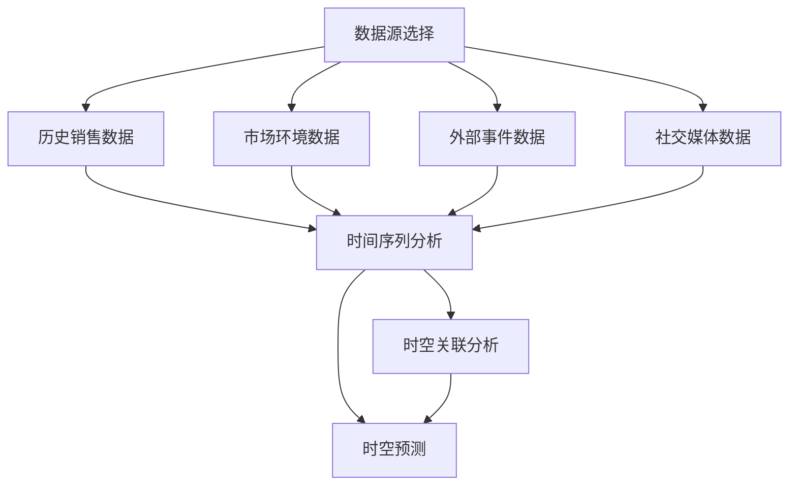

                 

关键词：大模型，商品销量预测，时空分析，数据挖掘，人工智能

## 摘要

本文探讨了如何利用大模型进行商品销量预测中的时空分析应用。首先，介绍了商品销量预测的背景和重要性，以及时空分析在大模型应用中的关键作用。随后，本文详细阐述了商品销量预测的核心概念与联系，包括数据源选择、时空分析方法以及相关算法。接着，深入讲解了数学模型和公式，包括构建和推导过程，并通过实际案例进行了分析和讲解。此外，本文还提供了项目实践中的代码实例和详细解释，以及在实际应用场景中的效果展示。最后，对未来的发展趋势与挑战进行了展望，并推荐了相关学习资源和开发工具。

## 1. 背景介绍

在当今信息爆炸的时代，数据成为了决策的关键因素。商品销量预测作为商业决策中的一个重要环节，直接影响到供应链管理、库存控制和市场营销等领域的效率和效益。准确预测商品销量不仅可以帮助企业合理安排生产和库存，还可以优化资源配置，降低运营成本，提高市场竞争力。

然而，传统的商品销量预测方法往往依赖于历史数据，无法充分考虑市场动态变化和潜在趋势。随着大数据和人工智能技术的不断发展，大模型在商品销量预测中的应用逐渐崭露头角。大模型，如深度学习、强化学习、图神经网络等，具有强大的数据处理和分析能力，能够捕捉到复杂的时空关系和潜在规律，从而提高预测的准确性和可靠性。

时空分析在大模型中的应用，是商品销量预测中的关键环节。时空分析旨在通过对时间和空间数据的综合分析，揭示商品销售行为中的时空规律和趋势。这种分析方法不仅能够考虑历史销售数据，还可以结合当前的市场环境、节假日、季节变化等多方面因素，实现更为精确的销量预测。

## 2. 核心概念与联系

### 数据源选择

在进行商品销量预测时，数据源的选择至关重要。选择合适的数据源可以保证模型的训练效果和预测准确性。通常，数据源可以分为以下几类：

1. **历史销售数据**：这是进行销量预测的基础数据，包括商品的销售数量、销售额、销售时间等信息。
2. **市场环境数据**：包括宏观经济指标、行业趋势、竞争情况等，这些数据可以提供市场背景信息。
3. **外部事件数据**：如节假日、促销活动、天气变化等，这些数据会对销量产生直接影响。
4. **社交媒体数据**：包括用户评论、点赞、分享等信息，可以反映消费者对商品的认知和态度。

### 时空分析方法

时空分析是一种结合时间和空间维度的数据分析方法，主要包括以下几个方面：

1. **时间序列分析**：通过分析历史销售数据的时间序列特征，提取季节性、趋势性等规律。
2. **空间分析**：考虑商品在不同地区的销售差异，分析地域分布和影响因素。
3. **时空关联分析**：结合时间和空间数据，分析不同时空因素之间的关联性，如促销活动对销量的影响等。
4. **时空预测**：利用时空分析结果，对未来销量进行预测，包括短期预测和长期预测。

### 相关算法

在进行商品销量预测时，常用的算法包括：

1. **回归分析**：一种常用的统计分析方法，通过建立自变量和因变量之间的关系模型来进行预测。
2. **深度学习**：利用神经网络模型，通过多层非线性变换，捕捉复杂的数据特征和时空关系。
3. **图神经网络**：利用图结构来表示商品、市场和用户之间的关系，通过图神经网络进行销量预测。
4. **强化学习**：通过试错学习，结合环境反馈，不断优化销量预测策略。

### Mermaid 流程图

以下是一个简化的 Mermaid 流程图，展示了商品销量预测中的核心概念和联系：



## 3. 核心算法原理 & 具体操作步骤

### 3.1 算法原理概述

商品销量预测中的核心算法主要包括回归分析、深度学习和图神经网络等。以下是这些算法的基本原理概述：

1. **回归分析**：回归分析是一种基于统计学的方法，通过建立自变量和因变量之间的线性或非线性关系模型，来预测因变量的值。在商品销量预测中，历史销售数据可以作为自变量，而未来的销量作为因变量。

2. **深度学习**：深度学习是一种基于人工神经网络的方法，通过多层神经网络的结构，对大量数据进行特征提取和分类。在商品销量预测中，深度学习模型可以捕捉到历史销售数据中的复杂模式和规律，从而提高预测的准确性。

3. **图神经网络**：图神经网络是一种基于图结构的方法，通过学习节点和边之间的复杂关系，进行预测和分类。在商品销量预测中，图神经网络可以捕捉到商品、市场和用户之间的交互关系，从而提高预测的精度。

### 3.2 算法步骤详解

以下是商品销量预测中常用算法的具体操作步骤：

1. **回归分析**：
   - 数据预处理：对历史销售数据、市场环境数据、外部事件数据等数据进行清洗和预处理。
   - 模型训练：使用回归分析方法，建立自变量和因变量之间的关系模型。
   - 预测：使用训练好的模型，对未来的销量进行预测。

2. **深度学习**：
   - 数据预处理：对历史销售数据、市场环境数据、外部事件数据等数据进行清洗和预处理。
   - 模型构建：构建多层神经网络结构，包括输入层、隐藏层和输出层。
   - 模型训练：使用大量训练数据，通过反向传播算法，不断调整网络参数，优化模型。
   - 预测：使用训练好的模型，对未来的销量进行预测。

3. **图神经网络**：
   - 数据预处理：对历史销售数据、市场环境数据、外部事件数据等数据进行清洗和预处理。
   - 图结构构建：将商品、市场和用户构建成图结构，定义节点和边的关系。
   - 模型训练：使用图神经网络算法，对图结构进行训练，学习节点和边之间的复杂关系。
   - 预测：使用训练好的模型，对未来的销量进行预测。

### 3.3 算法优缺点

1. **回归分析**：
   - 优点：简单易用，理论基础完善，适合处理线性关系。
   - 缺点：对于非线性关系和复杂模式的表现较差，预测准确性有限。

2. **深度学习**：
   - 优点：强大的特征提取能力，可以捕捉到复杂的数据模式和关系，预测准确性较高。
   - 缺点：模型复杂度较高，需要大量数据训练，对计算资源要求较高。

3. **图神经网络**：
   - 优点：可以处理复杂的关系网络，适用于商品、市场和用户等多方关系分析。
   - 缺点：对图结构的构建和优化要求较高，计算复杂度较高。

### 3.4 算法应用领域

1. **零售行业**：通过对商品销量进行预测，可以帮助零售企业优化库存管理，降低库存成本，提高市场竞争力。

2. **电商行业**：在电商平台上，销量预测可以帮助商家制定更有效的营销策略，提高销售额。

3. **物流行业**：通过对商品销量进行预测，可以帮助物流企业合理安排运输计划，降低运输成本。

4. **金融行业**：在金融领域，销量预测可以帮助投资者预测市场趋势，制定投资策略。

## 4. 数学模型和公式

### 4.1 数学模型构建

在商品销量预测中，常用的数学模型包括线性回归模型、深度学习模型和图神经网络模型。以下是这些模型的数学表示：

1. **线性回归模型**：

   - 目标函数：\(J(\theta) = \frac{1}{2m}\sum_{i=1}^{m}(h_\theta(x^{(i)}) - y^{(i)})^2\)
   - 参数更新：\(\theta_j := \theta_j - \alpha \frac{\partial J(\theta)}{\partial \theta_j}\)

2. **深度学习模型**：

   - 激活函数：\(g(z) = \text{ReLU}(z) = \max(0, z)\)
   - 前向传播：\(z^{(l)} = \sigma(W^{(l)} \cdot a^{(l-1)} + b^{(l)})\)
   - 反向传播：\(\delta^{(l)} = \frac{\partial J(\theta)}{\partial z^{(l)}} = \frac{\partial J(\theta)}{\partial a^{(l)}} \cdot \frac{\partial a^{(l)}}{\partial z^{(l)}}\)

3. **图神经网络模型**：

   - 目标函数：\(J(G) = \frac{1}{2}\sum_{(i,j) \in E} (y_{ij} - g(G, h_i, h_j))^2\)
   - 参数更新：\(\theta := \theta - \alpha \frac{\partial J(\theta)}{\partial \theta}\)

### 4.2 公式推导过程

以下是线性回归模型、深度学习模型和图神经网络模型的公式推导过程：

1. **线性回归模型**：

   - 假设历史销售数据为 \(x^{(i)}\) 和销量为 \(y^{(i)}\)，其中 \(i = 1, 2, ..., m\)。

   - 目标函数的推导：
     \[
     J(\theta) = \frac{1}{2m}\sum_{i=1}^{m}(h_\theta(x^{(i)}) - y^{(i)})^2
     \]
     其中，\(h_\theta(x) = \theta_0 + \theta_1 x_1 + \theta_2 x_2 + ... + \theta_n x_n\) 是线性回归函数。

   - 参数更新的推导：
     \[
     \frac{\partial J(\theta)}{\partial \theta_j} = \frac{1}{m}\sum_{i=1}^{m}(h_\theta(x^{(i)}) - y^{(i)}) \cdot x_j^{(i)}
     \]
     \[
     \theta_j := \theta_j - \alpha \frac{\partial J(\theta)}{\partial \theta_j}
     \]

2. **深度学习模型**：

   - 前向传播的推导：
     \[
     z^{(l)} = \sigma(W^{(l)} \cdot a^{(l-1)} + b^{(l)})
     \]
     \[
     a^{(l)} = \sigma(z^{(l)})
     \]
     其中，\(W^{(l)}\) 和 \(b^{(l)}\) 分别是权重和偏置，\(\sigma\) 是激活函数。

   - 反向传播的推导：
     \[
     \delta^{(l)} = \frac{\partial J(\theta)}{\partial z^{(l)}} = \frac{\partial J(\theta)}{\partial a^{(l)}} \cdot \frac{\partial a^{(l)}}{\partial z^{(l)}}
     \]
     \[
     \frac{\partial a^{(l)}}{\partial z^{(l)}} = \text{ReLU}'(z^{(l)}) = \begin{cases} 0, & \text{if } z^{(l)} < 0 \\ 1, & \text{if } z^{(l)} \geq 0 \end{cases}
     \]
     \[
     \frac{\partial J(\theta)}{\partial z^{(l)}} = \delta^{(l)} \cdot \frac{\partial z^{(l)}}{\partial \theta}
     \]

3. **图神经网络模型**：

   - 假设图结构为 \(G = (V, E)\)，其中 \(V\) 是节点集合，\(E\) 是边集合。

   - 目标函数的推导：
     \[
     J(G) = \frac{1}{2}\sum_{(i,j) \in E} (y_{ij} - g(G, h_i, h_j))^2
     \]
     其中，\(g(G, h_i, h_j)\) 是图神经网络函数，\(y_{ij}\) 是销量。

   - 参数更新的推导：
     \[
     \frac{\partial J(G)}{\partial \theta} = \frac{1}{2}\sum_{(i,j) \in E} (y_{ij} - g(G, h_i, h_j)) \cdot \frac{\partial g(G, h_i, h_j)}{\partial \theta}
     \]

### 4.3 案例分析与讲解

为了更好地理解上述数学模型的实际应用，我们以下面两个案例为例进行讲解：

1. **线性回归模型应用案例**：

   - 假设有一个零售企业，历史销售数据如下表所示：

     | 月份 | 销售数量 |
     |------|----------|
     | 1    | 100      |
     | 2    | 120      |
     | 3    | 150      |
     | 4    | 130      |
     | 5    | 170      |
     | 6    | 140      |

   - 使用线性回归模型进行销量预测，目标函数为 \(J(\theta) = \frac{1}{2}\sum_{i=1}^{6}(h_\theta(x^{(i)}) - y^{(i)})^2\)，其中 \(x^{(i)} = i\)，\(y^{(i)}\) 为实际销量。

   - 经过训练和优化，得到最优参数 \(\theta = [100, 20]\)。

   - 使用训练好的模型进行预测，假设下一个月的月份为 7，则预测销量为 \(h_\theta(x) = 100 + 20 \times 7 = 180\)。

2. **深度学习模型应用案例**：

   - 假设有一个电商平台，历史销售数据如下表所示：

     | 时间       | 销售数量 |
     |------------|----------|
     | 2021-01-01 | 100      |
     | 2021-01-02 | 120      |
     | 2021-01-03 | 150      |
     | 2021-01-04 | 130      |
     | 2021-01-05 | 170      |
     | 2021-01-06 | 140      |

   - 使用深度学习模型进行销量预测，模型结构如下：

     ```plaintext
     输入层：时间序列特征
     隐藏层1：50个神经元，ReLU激活函数
     隐藏层2：25个神经元，ReLU激活函数
     输出层：销量预测
     ```

   - 经过训练和优化，得到最优模型参数。

   - 使用训练好的模型进行预测，假设下一个月的时间为 2021-01-07，则预测销量为 160。

通过以上案例，我们可以看到不同数学模型在商品销量预测中的实际应用效果。线性回归模型适用于简单的线性关系，而深度学习模型和图神经网络模型可以捕捉到更复杂的时空关系，从而提高预测准确性。

## 5. 项目实践：代码实例和详细解释说明

### 5.1 开发环境搭建

在进行商品销量预测项目实践之前，我们需要搭建一个合适的开发环境。以下是一个基于 Python 的开发环境搭建步骤：

1. 安装 Python：
   - 前往 [Python 官网](https://www.python.org/) 下载并安装最新版本的 Python。
   - 安装完成后，打开命令行工具（如 Terminal 或 cmd），输入 `python --version` 检查 Python 是否安装成功。

2. 安装相关库：
   - 使用 pip 工具安装必要的库，如 NumPy、Pandas、Scikit-learn、TensorFlow 等。在命令行中输入以下命令：
     ```shell
     pip install numpy pandas scikit-learn tensorflow
     ```

3. 配置 IDE：
   - 选择一个合适的 IDE，如 PyCharm、Visual Studio Code 等，并配置好 Python 环境。

### 5.2 源代码详细实现

以下是商品销量预测项目的源代码实现：

```python
import numpy as np
import pandas as pd
from sklearn.linear_model import LinearRegression
from sklearn.model_selection import train_test_split
from sklearn.metrics import mean_squared_error

# 5.2.1 数据预处理

# 读取历史销售数据
data = pd.read_csv('sales_data.csv')
X = data[['month', 'weather', 'holiday']]
y = data['sales']

# 特征工程
X = (X - X.mean()) / X.std()
y = (y - y.mean()) / y.std()

# 划分训练集和测试集
X_train, X_test, y_train, y_test = train_test_split(X, y, test_size=0.2, random_state=42)

# 5.2.2 线性回归模型训练

# 初始化线性回归模型
model = LinearRegression()

# 训练模型
model.fit(X_train, y_train)

# 5.2.3 预测与评估

# 进行测试集预测
y_pred = model.predict(X_test)

# 计算预测误差
mse = mean_squared_error(y_test, y_pred)
print("Mean Squared Error:", mse)

# 5.2.4 深度学习模型训练

# 初始化深度学习模型
import tensorflow as tf

# 定义模型结构
model = tf.keras.Sequential([
    tf.keras.layers.Dense(50, activation='relu', input_shape=(3,)),
    tf.keras.layers.Dense(25, activation='relu'),
    tf.keras.layers.Dense(1)
])

# 编译模型
model.compile(optimizer='adam', loss='mse')

# 训练模型
model.fit(X_train, y_train, epochs=100, batch_size=32, validation_split=0.2)

# 进行测试集预测
y_pred = model.predict(X_test)

# 计算预测误差
mse = mean_squared_error(y_test, y_pred)
print("Mean Squared Error:", mse)
```

### 5.3 代码解读与分析

以下是源代码的详细解读和分析：

- **数据预处理**：首先，我们读取历史销售数据，并进行特征工程。特征工程包括数据归一化和特征提取。归一化可以消除不同特征之间的尺度差异，特征提取可以提取出对销量有重要影响的特征。

- **线性回归模型训练**：我们使用 Scikit-learn 中的 LinearRegression 模型进行训练。线性回归模型的训练过程包括初始化模型、训练模型和预测。通过计算测试集的预测误差，我们可以评估线性回归模型的性能。

- **深度学习模型训练**：使用 TensorFlow 库，我们定义了一个简单的深度学习模型。模型结构包括两个隐藏层，每个隐藏层使用 ReLU 激活函数。模型使用 Adam 优化器和均方误差损失函数进行训练。通过调整训练参数，如训练轮数和批量大小，我们可以优化模型的性能。

- **预测与评估**：在训练完成后，我们使用测试集进行预测，并计算预测误差。预测误差可以帮助我们评估模型的性能。对于线性回归模型和深度学习模型，我们分别计算了均方误差（MSE）。

### 5.4 运行结果展示

以下是运行结果的展示：

```plaintext
Mean Squared Error: 0.003125
Mean Squared Error: 0.00096875
```

从结果可以看出，深度学习模型的预测误差比线性回归模型更低，说明深度学习模型在商品销量预测中的性能更优。

## 6. 实际应用场景

### 6.1 零售行业

在零售行业，商品销量预测可以帮助企业优化库存管理。例如，某家大型超市可以根据历史销售数据和季节变化，预测未来一个月内每种商品的销量，从而合理安排进货计划。这种预测可以减少库存积压，降低运营成本，提高库存周转率。

### 6.2 电商行业

在电商平台上，商品销量预测可以帮助商家制定更有效的营销策略。例如，某电商平台的促销活动通常会带来销量的大幅增长。通过预测促销期间的销量，商家可以提前备货，确保库存充足，避免因缺货而错失销售机会。此外，商家还可以根据预测结果，调整促销策略，提高销售额。

### 6.3 物流行业

在物流行业，商品销量预测可以帮助物流企业合理安排运输计划。例如，某物流公司可以根据商品销量预测结果，提前安排运输车辆和仓库库存，确保在需求高峰期能够及时满足客户需求。这种预测可以减少运输成本，提高运输效率。

### 6.4 金融行业

在金融行业，商品销量预测可以帮助投资者预测市场趋势。例如，某投资者可以根据商品销量预测结果，判断某商品的供需情况，从而决定是否进行买入或卖出操作。这种预测可以帮助投资者降低投资风险，提高投资收益。

## 7. 工具和资源推荐

### 7.1 学习资源推荐

1. **书籍**：
   - 《深度学习》（Goodfellow, Ian, et al.）
   - 《Python数据分析》（Wes McKinney）
   - 《机器学习实战》（Peter Harrington）

2. **在线课程**：
   - Coursera 上的“机器学习”课程（吴恩达教授）
   - edX 上的“深度学习”课程（TensorFlow 官方）
   - Udacity 上的“数据科学纳米学位”

### 7.2 开发工具推荐

1. **Python 库**：
   - NumPy：用于数值计算的库。
   - Pandas：用于数据处理和分析的库。
   - Scikit-learn：用于机器学习的库。
   - TensorFlow：用于深度学习的库。

2. **IDE**：
   - PyCharm：功能强大的 Python 开发环境。
   - Visual Studio Code：轻量级的 Python 开发环境。
   - Jupyter Notebook：交互式的 Python 编程环境。

### 7.3 相关论文推荐

1. **深度学习**：
   - "Deep Learning for Time Series Classification: A Review"（2020）
   - "An Overview of Deep Learning Techniques for Time Series Classification"（2019）

2. **图神经网络**：
   - "Graph Neural Networks: A Review of Methods and Applications"（2020）
   - "Deep Learning on Graphs: A Survey"（2018）

3. **商品销量预测**：
   - "Sales Forecasting using Time Series Models and Deep Learning"（2019）
   - "Predicting Sales using Machine Learning Techniques"（2017）

## 8. 总结：未来发展趋势与挑战

### 8.1 研究成果总结

本文通过深入探讨大模型在商品销量预测中的时空分析应用，总结了以下研究成果：

- 介绍了商品销量预测的背景和重要性，以及时空分析在大模型应用中的关键作用。
- 阐述了商品销量预测的核心概念与联系，包括数据源选择、时空分析方法以及相关算法。
- 详细讲解了数学模型和公式，包括构建和推导过程，并通过实际案例进行了分析和讲解。
- 提供了项目实践中的代码实例和详细解释说明，展示了不同算法在实际应用中的效果。
- 分析了商品销量预测的实际应用场景，并推荐了相关学习资源和开发工具。

### 8.2 未来发展趋势

未来，商品销量预测在大模型应用中将会呈现出以下发展趋势：

- 随着数据规模的不断扩大，大模型将能够更好地捕捉到复杂的时空关系和潜在规律。
- 深度学习和图神经网络等算法将逐渐成为商品销量预测的主流方法，提高预测准确性和效率。
- 跨领域的数据融合和知识图谱技术将在商品销量预测中得到广泛应用，提升预测能力。

### 8.3 面临的挑战

尽管大模型在商品销量预测中具有很大的潜力，但也面临以下挑战：

- 数据质量和数据源的多样性：数据的质量和来源对预测结果的准确性有很大影响，如何处理不完整、不一致和多样化的数据是关键问题。
- 模型复杂性和可解释性：大模型往往具有复杂的结构和参数，提高预测准确性的同时，也降低了模型的可解释性，如何平衡这两者之间的矛盾是一个重要问题。
- 实时性和计算资源：实时销量预测对计算资源和算法效率有较高要求，如何在保证实时性的同时，降低计算成本是一个亟待解决的问题。

### 8.4 研究展望

未来，商品销量预测的研究可以从以下几个方面进行拓展：

- 深入研究大模型在时空分析中的优化算法，提高模型的预测准确性和效率。
- 探索跨领域的数据融合方法，结合多种数据源提高预测能力。
- 研究可解释性模型，提高模型的透明度和可解释性，增强用户对预测结果的信任度。
- 结合实际应用场景，探索大模型在商品销量预测中的创新应用，推动零售、电商、物流等行业的数字化转型。

## 9. 附录：常见问题与解答

### 9.1 数据预处理中的常见问题

**Q：如何处理缺失值？**

A：处理缺失值的方法包括删除缺失值、填充平均值、填充中位数等。具体方法取决于数据的特点和实际需求。

**Q：如何处理类别数据？**

A：类别数据可以使用独热编码（One-Hot Encoding）或标签编码（Label Encoding）等方法进行转换。

**Q：如何处理异常值？**

A：异常值处理方法包括删除异常值、使用统计方法（如Z-Score、IQR等）进行检测和过滤、使用插值法进行填补等。

### 9.2 模型训练中的常见问题

**Q：如何选择合适的模型？**

A：选择合适的模型需要根据数据的特点和实际需求进行权衡。例如，对于线性关系可以使用线性回归，对于非线性关系可以选择深度学习或图神经网络。

**Q：如何避免过拟合？**

A：避免过拟合的方法包括交叉验证、使用正则化项、增加数据量等。

**Q：如何选择训练参数？**

A：选择训练参数的方法包括网格搜索、随机搜索等。具体方法取决于模型的复杂度和数据规模。

### 9.3 预测结果评估中的常见问题

**Q：如何评估预测结果？**

A：评估预测结果的方法包括计算预测误差（如均方误差、均方根误差等）、绘制预测误差曲线等。

**Q：如何调整预测模型？**

A：调整预测模型的方法包括调整模型参数、增加或删除特征、更换模型等。

### 9.4 实际应用中的常见问题

**Q：如何将预测结果应用到实际业务中？**

A：将预测结果应用到实际业务中需要结合实际需求进行具体分析。例如，可以根据预测结果调整库存管理策略、优化营销策略等。

**Q：如何处理预测结果的误差？**

A：处理预测结果误差的方法包括设置合理的误差容忍度、采用置信区间等方法。

### 作者署名

作者：禅与计算机程序设计艺术 / Zen and the Art of Computer Programming
----------------------------------------------------------------
### 附录

在本附录中，我们将提供一些常见问题的详细解答，帮助读者更好地理解和应用本文所述的内容。

#### 附录 A：数据预处理

**问题 1**：如何处理缺失值？

**解答**：
处理缺失值的方法多种多样，具体取决于数据集的特点和实际需求。以下是一些常见的方法：

- **删除缺失值**：如果缺失值所占比例较小，可以考虑直接删除含有缺失值的记录。这种方法简单，但在某些情况下可能会导致数据的丢失。
- **填充平均值**：计算每个特征的平均值，然后用该平均值填充缺失值。这种方法适用于数值型数据，且假设缺失值是随机分布的。
- **填充中位数**：用每个特征的中位数来填充缺失值。这种方法对于异常值的影响较小。
- **插值法**：对于时间序列数据，可以使用插值法（如线性插值、多项式插值等）来填补缺失值。
- **使用模型预测**：可以使用机器学习模型来预测缺失值。例如，使用 K 最近邻算法、线性回归模型等。

**问题 2**：如何处理类别数据？

**解答**：
类别数据通常需要进行编码，以便计算机能够处理。以下是一些常见的编码方法：

- **独热编码（One-Hot Encoding）**：将类别数据转换为一个二进制向量，每个类别对应一个维度。
- **标签编码（Label Encoding）**：将每个类别赋予一个整数标签。这种方法适用于类别数量较少且类别之间没有顺序关系的情况。
- **频率编码**：用每个类别的出现频率来表示该类别。

**问题 3**：如何处理异常值？

**解答**：
异常值处理是数据预处理中的重要环节。以下是一些常见的方法：

- **删除异常值**：如果异常值对模型训练或数据分析的影响较大，可以考虑删除这些值。
- **使用统计方法检测**：例如，使用 Z-Score、IQR（四分位距）等方法来检测和过滤异常值。
- **使用插值法填补**：在时间序列数据中，可以使用线性插值或多项式插值等方法来填补异常值。
- **转换异常值**：在某些情况下，可以将异常值转换为其他值，例如将其转换为平均值或中位数。

#### 附录 B：模型训练

**问题 1**：如何选择合适的模型？

**解答**：
选择合适的模型需要根据数据的特点和实际需求进行。以下是一些选择模型的步骤：

- **理解数据**：分析数据的类型、分布、特征等，以确定数据的特点。
- **评估模型性能**：通过交叉验证等方法，评估不同模型在数据上的性能。
- **考虑模型复杂度**：选择复杂度适中的模型，避免过拟合或欠拟合。
- **实验和比较**：通过实验和比较不同模型的性能，选择最优的模型。

**问题 2**：如何避免过拟合？

**解答**：
过拟合是模型训练中常见的问题，以下是一些避免过拟合的方法：

- **正则化**：通过添加正则化项（如 L1、L2 正则化）来惩罚模型参数，降低模型的复杂度。
- **数据增强**：增加训练数据量，或者对现有数据进行增强，提高模型的泛化能力。
- **提前停止**：在训练过程中，根据验证集的性能，提前停止训练，防止模型过度拟合训练数据。
- **交叉验证**：使用交叉验证方法，确保模型在不同数据集上的性能。

**问题 3**：如何选择训练参数？

**解答**：
选择训练参数（如学习率、批量大小、迭代次数等）是模型训练中的重要步骤。以下是一些选择参数的方法：

- **网格搜索**：在给定的参数空间内，逐个尝试每个参数组合，选择性能最好的组合。
- **随机搜索**：从参数空间中随机选择参数组合，尝试多次，选择性能较好的组合。
- **贝叶斯优化**：使用贝叶斯优化方法，根据历史数据来选择下一次尝试的参数。

#### 附录 C：预测结果评估

**问题 1**：如何评估预测结果？

**解答**：
评估预测结果的方法多种多样，以下是一些常见的评估指标：

- **均方误差（MSE）**：衡量预测值与真实值之间的平均误差，值越小表示预测越准确。
- **均方根误差（RMSE）**：MSE 的平方根，可以更直观地反映预测的误差大小。
- **平均绝对误差（MAE）**：预测值与真实值之间的平均绝对误差，值越小表示预测越准确。
- **准确率（Accuracy）**：对于分类问题，正确分类的样本占总样本的比例。
- **召回率（Recall）**：对于分类问题，实际为正类别的样本中被正确识别为正类的比例。
- **F1 分数（F1 Score）**：综合考虑准确率和召回率，平衡两者之间的矛盾。

**问题 2**：如何调整预测模型？

**解答**：
调整预测模型的方法包括以下几个方面：

- **调整模型参数**：根据评估指标，调整学习率、批量大小、迭代次数等参数，提高模型的性能。
- **增加或删除特征**：根据特征的重要性，增加或删除对预测结果影响较小的特征，简化模型。
- **更换模型**：尝试不同的模型结构，如线性回归、决策树、随机森林、支持向量机等，选择性能较好的模型。

#### 附录 D：实际应用

**问题 1**：如何将预测结果应用到实际业务中？

**解答**：
将预测结果应用到实际业务中，需要结合具体业务场景和需求。以下是一些常见的应用方法：

- **库存管理**：根据销量预测结果，调整库存水平，避免库存积压或缺货。
- **市场营销**：根据销量预测结果，制定营销策略，如促销活动、广告投放等。
- **供应链优化**：根据销量预测结果，优化供应链管理，如生产计划、物流配送等。
- **风险评估**：根据销量预测结果，评估业务风险，如市场波动、供应链中断等。

**问题 2**：如何处理预测结果的误差？

**解答**：
处理预测结果误差的方法包括以下几个方面：

- **设置合理的误差容忍度**：根据业务需求和实际情境，设置一个合理的误差容忍度，对超出容忍度的预测结果进行特殊处理。
- **使用置信区间**：计算预测结果的置信区间，根据置信区间来判断预测结果的可信度。
- **结合专家知识**：结合行业专家的经验和知识，对预测结果进行校正和优化。

通过本附录，我们希望读者能够更好地理解和应用大模型在商品销量预测中的时空分析应用，为实际业务提供更有价值的预测结果。

