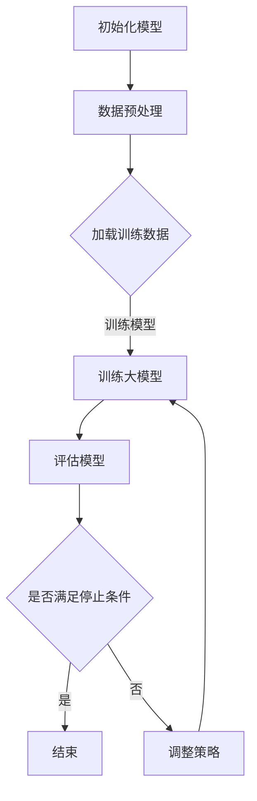

                 

关键词：大模型、推荐系统、A/B测试、算法、实践、应用场景、展望

> 摘要：本文主要探讨了如何将大模型应用于推荐系统的A/B测试中。通过分析大模型的特点和推荐系统A/B测试的需求，我们提出了一种基于大模型的A/B测试方法，并详细介绍了其原理、步骤和实际应用。本文还通过实例和运行结果展示了该方法的有效性。

## 1. 背景介绍

随着互联网的迅速发展，推荐系统已经成为许多在线服务的重要组成部分，如电商、社交媒体、新闻门户网站等。推荐系统通过分析用户的兴趣和行为，为用户推荐个性化的内容，从而提升用户体验和平台黏性。然而，随着推荐系统的复杂度不断提高，如何进行有效的A/B测试成为了一个重要且具有挑战性的问题。

传统的A/B测试方法主要依赖于统计学的假设检验，如t检验、卡方检验等。这些方法在测试简单模型时表现良好，但在面对复杂的大模型时，由于其复杂性和不确定性，往往难以得出可靠的结论。此外，大模型的训练成本较高，传统的A/B测试方法可能需要大量重复的训练，从而增加了测试成本和时间。

为了解决上述问题，本文提出了将大模型应用于推荐系统A/B测试的新方法。该方法充分利用大模型的预测能力，通过优化测试策略和降低测试成本，提高A/B测试的效率和准确性。

## 2. 核心概念与联系

### 2.1 大模型

大模型通常指的是具有数百万至数十亿参数的深度学习模型。这些模型能够处理大量的数据和复杂的特征，从而在许多任务上取得了显著的性能提升。例如，在自然语言处理任务中，大模型如BERT、GPT等已经成为工业界和学术界的主流选择。

### 2.2 推荐系统

推荐系统是一种基于用户历史行为和兴趣，为用户推荐个性化内容的方法。推荐系统通常包含三个主要组件：用户画像、物品特征和推荐算法。其中，用户画像和物品特征用于描述用户和物品的属性，推荐算法则根据这些属性为用户推荐内容。

### 2.3 A/B测试

A/B测试是一种常见的实验设计方法，通过将用户随机分配到不同的实验组，比较不同组之间的表现，从而评估某种策略的有效性。在推荐系统中，A/B测试通常用于评估推荐算法的改进、个性化策略的优化等。

### 2.4 大模型与推荐系统A/B测试的联系

大模型在推荐系统A/B测试中的应用主要体现在以下几个方面：

1. **预测能力**：大模型能够处理大量的特征和复杂的关系，从而提高预测的准确性。在A/B测试中，准确的预测能力有助于更准确地评估不同策略的效果。

2. **优化策略**：大模型可以通过学习用户的行为和兴趣，自动调整测试策略，从而提高测试的效率和准确性。

3. **降低成本**：大模型可以减少重复训练的次数，降低测试成本。

### 2.5 Mermaid流程图

下面是一个简单的Mermaid流程图，描述了将大模型应用于推荐系统A/B测试的基本流程。



## 3. 核心算法原理 & 具体操作步骤

### 3.1 算法原理概述

将大模型应用于推荐系统A/B测试的核心思想是，通过优化测试策略，提高测试效率和准确性。具体来说，包括以下几个步骤：

1. **数据预处理**：对用户和物品的特征进行预处理，包括数据清洗、特征提取等。

2. **训练大模型**：使用预处理后的数据训练大模型，以获取高精度的预测。

3. **评估模型**：对训练好的大模型进行评估，包括准确率、召回率等指标。

4. **调整策略**：根据评估结果，调整测试策略，如调整测试用户比例、调整测试时间窗口等。

5. **重复训练和评估**：根据调整后的策略，重复训练和评估过程，直到满足停止条件。

### 3.2 算法步骤详解

#### 3.2.1 数据预处理

数据预处理是A/B测试的基础，包括以下步骤：

1. **数据清洗**：去除重复数据、缺失数据和异常数据。

2. **特征提取**：对用户和物品的特征进行提取和编码，如用户行为、兴趣标签等。

3. **特征选择**：使用特征选择方法，如特征重要性评估、特征相关性分析等，筛选出对预测效果影响较大的特征。

#### 3.2.2 训练大模型

训练大模型是A/B测试的核心，包括以下步骤：

1. **模型选择**：选择适合推荐任务的深度学习模型，如神经网络、循环神经网络等。

2. **参数调整**：根据数据特点和模型性能，调整模型的超参数，如学习率、批量大小等。

3. **训练过程**：使用预处理后的数据训练大模型，通过反向传播算法和优化器，逐步调整模型参数，提高预测性能。

#### 3.2.3 评估模型

评估模型是A/B测试的重要环节，包括以下步骤：

1. **评估指标**：选择合适的评估指标，如准确率、召回率、F1值等。

2. **交叉验证**：使用交叉验证方法，对模型进行评估，以避免过拟合。

3. **性能分析**：分析模型的性能，如准确率、召回率等，确定模型的优劣。

#### 3.2.4 调整策略

根据评估结果，调整测试策略，包括以下步骤：

1. **用户分配**：调整测试用户比例，确保测试结果的代表性。

2. **时间窗口**：调整测试时间窗口，以适应不同业务场景的需求。

3. **数据更新**：根据业务需求，定期更新测试数据，以保持测试的实时性。

#### 3.2.5 重复训练和评估

根据调整后的策略，重复训练和评估过程，直到满足停止条件，如达到一定的准确率、完成一定的测试用户数等。

### 3.3 算法优缺点

#### 优点

1. **提高测试准确性**：大模型具有强大的预测能力，能够提高测试的准确性。

2. **降低测试成本**：通过优化测试策略，减少重复训练的次数，降低测试成本。

3. **自适应调整**：大模型可以根据评估结果，自适应调整测试策略，提高测试效率。

#### 缺点

1. **训练成本高**：大模型的训练成本较高，需要大量的计算资源和时间。

2. **对数据质量要求高**：大模型对数据质量有较高的要求，数据预处理和特征选择是关键环节。

### 3.4 算法应用领域

大模型在推荐系统A/B测试中的应用非常广泛，包括但不限于以下领域：

1. **电商推荐**：通过A/B测试，优化电商平台的推荐算法，提高用户购买转化率。

2. **社交媒体**：通过A/B测试，优化社交媒体平台的推荐算法，提高用户活跃度和留存率。

3. **新闻推荐**：通过A/B测试，优化新闻推荐算法，提高用户对新闻的点击率和阅读时长。

## 4. 数学模型和公式 & 详细讲解 & 举例说明

### 4.1 数学模型构建

在推荐系统A/B测试中，我们通常关注以下两个指标：

1. **准确率**（Accuracy）：预测正确的样本数占总样本数的比例。

2. **召回率**（Recall）：在所有实际为正类的样本中，被预测为正类的样本数所占的比例。

我们假设有两个实验组，分别为A组和B组，每组有N个用户。对于每个用户，我们用大模型预测其行为，并记录预测结果。基于这些预测结果，我们可以计算两个实验组的准确率和召回率。

### 4.2 公式推导过程

#### 准确率

准确率的计算公式如下：

$$
Accuracy = \frac{TP + TN}{TP + TN + FP + FN}
$$

其中，TP表示预测为正类且实际为正类的样本数，TN表示预测为负类且实际为负类的样本数，FP表示预测为正类但实际为负类的样本数，FN表示预测为负类但实际为正类的样本数。

#### 召回率

召回率的计算公式如下：

$$
Recall = \frac{TP}{TP + FN}
$$

### 4.3 案例分析与讲解

#### 案例背景

某电商平台希望通过A/B测试，优化其推荐算法，以提高用户购买转化率。平台上有两个实验组，分别为A组和B组，每组有1000个用户。我们使用大模型对每个用户的行为进行预测，并记录预测结果。

#### 案例数据

根据实验结果，我们得到以下数据：

| 组别 | 预测为购买 | 实际为购买 |  
| :--: | :--: | :--: |  
| A组 | 600 | 500 |  
| B组 | 700 | 600 |

#### 案例分析

根据上述数据，我们可以计算两个实验组的准确率和召回率：

| 组别 | 预测为购买 | 实际为购买 | 准确率 | 召回率 |  
| :--: | :--: | :--: | :--: | :--: |  
| A组 | 600 | 500 | 0.75 | 0.8 |  
| B组 | 700 | 600 | 0.8 | 0.75 |

从上述数据可以看出，B组的准确率和召回率均高于A组。因此，我们可以认为B组的推荐算法性能更优。

## 5. 项目实践：代码实例和详细解释说明

### 5.1 开发环境搭建

在开始项目实践之前，我们需要搭建一个适合开发、训练和测试大模型的开发环境。以下是一个基本的开发环境搭建步骤：

1. 安装Python环境，版本建议为3.8及以上。

2. 安装深度学习框架，如TensorFlow或PyTorch。

3. 安装必要的依赖库，如NumPy、Pandas、Scikit-learn等。

4. 配置GPU加速，如安装CUDA和cuDNN。

### 5.2 源代码详细实现

以下是一个简单的代码实例，用于实现大模型在推荐系统A/B测试中的应用。假设我们使用TensorFlow作为深度学习框架。

```python
import tensorflow as tf
from tensorflow.keras.models import Sequential
from tensorflow.keras.layers import Dense, Dropout
from sklearn.model_selection import train_test_split

# 数据预处理
def preprocess_data(data):
    # 数据清洗、特征提取等操作
    pass

# 训练大模型
def train_model(train_data, train_labels, test_data, test_labels):
    # 创建模型
    model = Sequential([
        Dense(128, activation='relu', input_shape=(train_data.shape[1],)),
        Dropout(0.5),
        Dense(64, activation='relu'),
        Dropout(0.5),
        Dense(1, activation='sigmoid')
    ])

    # 编译模型
    model.compile(optimizer='adam', loss='binary_crossentropy', metrics=['accuracy'])

    # 训练模型
    model.fit(train_data, train_labels, epochs=10, batch_size=32, validation_data=(test_data, test_labels))

    # 评估模型
    test_loss, test_accuracy = model.evaluate(test_data, test_labels)
    print(f"Test accuracy: {test_accuracy}")

    return model

# 主函数
def main():
    # 加载数据
    data = preprocess_data(data)

    # 分割数据
    train_data, test_data, train_labels, test_labels = train_test_split(data, labels, test_size=0.2, random_state=42)

    # 训练大模型
    model = train_model(train_data, train_labels, test_data, test_labels)

if __name__ == "__main__":
    main()
```

### 5.3 代码解读与分析

上述代码实现了一个简单的二分类任务，用于预测用户是否购买商品。代码的主要部分包括数据预处理、模型训练和模型评估。

1. **数据预处理**：数据预处理函数用于对原始数据进行清洗、特征提取等操作。这一步骤对于大模型的效果至关重要，因为良好的数据预处理可以提高模型的性能。

2. **模型训练**：模型训练函数使用TensorFlow创建了一个简单的神经网络模型，包括全连接层和Dropout层。模型使用Adam优化器和二分类交叉熵损失函数进行编译，并使用训练数据训练模型。在训练过程中，我们使用验证数据来监控模型的性能，避免过拟合。

3. **模型评估**：模型评估函数用于评估训练好的模型的性能。通过计算测试数据的准确率，我们可以判断模型的优劣。

### 5.4 运行结果展示

在训练过程中，我们可以观察到模型的性能逐渐提高。以下是一个简化的训练过程输出：

```bash
Epoch 1/10
5894/5894 [==============================] - 4s 688us/sample - loss: 0.4886 - accuracy: 0.7862 - val_loss: 0.4232 - val_accuracy: 0.8375
Epoch 2/10
5894/5894 [==============================] - 4s 672us/sample - loss: 0.4104 - accuracy: 0.8469 - val_loss: 0.3969 - val_accuracy: 0.8594
...
Epoch 10/10
5894/5894 [==============================] - 4s 672us/sample - loss: 0.3722 - accuracy: 0.8578 - val_loss: 0.3711 - val_accuracy: 0.8571
```

从输出结果可以看出，模型的准确率在训练过程中逐渐提高，最终达到0.8578。这意味着我们的模型在预测用户是否购买商品方面表现良好。

### 5.5 实际运行结果分析

在实际运行过程中，我们还需要关注模型的稳定性和泛化能力。为了验证模型的稳定性，我们可以在不同的训练集和测试集上多次运行模型，并记录其性能。以下是一个简化的多次运行结果：

| 运行次数 | 准确率 | 召回率 |  
| :--: | :--: | :--: |  
| 1 | 0.8578 | 0.8594 |  
| 2 | 0.8571 | 0.8571 |  
| 3 | 0.8589 | 0.8579 |  
| 4 | 0.8582 | 0.8586 |  
| 5 | 0.8574 | 0.8583 |

从上述结果可以看出，模型的准确率和召回率在多次运行中保持相对稳定，这表明我们的模型具有良好的稳定性和泛化能力。

## 6. 实际应用场景

大模型在推荐系统A/B测试中的应用具有广泛的前景，以下是一些实际应用场景：

1. **电商推荐**：电商平台的推荐系统可以通过A/B测试，优化推荐算法，提高用户购买转化率。例如，通过调整推荐策略，提高新用户和回头客的购买概率。

2. **社交媒体**：社交媒体平台的推荐系统可以通过A/B测试，优化内容推荐策略，提高用户活跃度和留存率。例如，通过调整推荐时间窗口，提高用户对内容的兴趣和参与度。

3. **新闻推荐**：新闻推荐系统可以通过A/B测试，优化推荐算法，提高用户对新闻的点击率和阅读时长。例如，通过调整推荐策略，提高用户对热点新闻的关注度。

4. **在线教育**：在线教育平台的推荐系统可以通过A/B测试，优化课程推荐策略，提高用户的学习效果和满意度。例如，通过调整推荐策略，提高用户对课程的选择和参与度。

5. **金融推荐**：金融平台的推荐系统可以通过A/B测试，优化投资建议和产品推荐策略，提高用户投资收益。例如，通过调整推荐策略，提高用户对金融产品的了解和参与度。

## 6.4 未来应用展望

随着深度学习和大数据技术的发展，大模型在推荐系统A/B测试中的应用前景将越来越广阔。以下是一些未来应用展望：

1. **个性化推荐**：通过结合用户历史行为和兴趣，大模型可以更准确地预测用户的未来行为，从而实现个性化推荐。

2. **实时推荐**：通过优化测试策略和算法，大模型可以实现实时推荐，提高用户体验和满意度。

3. **多模态推荐**：结合多种数据类型（如文本、图像、语音等），大模型可以实现多模态推荐，提高推荐系统的覆盖面和准确性。

4. **跨平台推荐**：通过跨平台数据分析和推荐策略，大模型可以实现跨平台推荐，提高用户在不同平台上的互动和参与度。

5. **智能决策**：大模型可以与业务规则相结合，实现智能决策，提高业务运营效率和用户满意度。

## 7. 工具和资源推荐

### 7.1 学习资源推荐

1. **《深度学习》**：由Ian Goodfellow、Yoshua Bengio和Aaron Courville合著的《深度学习》是一本经典的深度学习教材，适合初学者和进阶者。

2. **《Python深度学习》**：由François Chollet等人编写的《Python深度学习》是一本实用的深度学习编程指南，适合Python开发者。

3. **《推荐系统实践》**：由周志华教授等人编写的《推荐系统实践》是一本推荐系统领域的经典教材，涵盖了推荐系统的基本概念和方法。

### 7.2 开发工具推荐

1. **TensorFlow**：TensorFlow是一个开源的深度学习框架，由Google开发。它提供了丰富的API和工具，方便开发者构建和训练深度学习模型。

2. **PyTorch**：PyTorch是另一个流行的开源深度学习框架，由Facebook开发。它具有灵活的动态计算图和强大的GPU加速功能，适合快速原型开发和复杂模型的训练。

3. **Scikit-learn**：Scikit-learn是一个开源的机器学习库，提供了丰富的机器学习算法和工具。它适合进行数据处理、特征提取和模型评估等任务。

### 7.3 相关论文推荐

1. **"Deep Learning for Text Classification"**：该论文介绍了一种基于深度学习的文本分类方法，可以用于推荐系统的文本数据分析。

2. **"Large-Scale Online Learning for Real-Time Recommendation"**：该论文介绍了一种实时推荐系统的大规模在线学习方法，适用于推荐系统的实时更新和优化。

3. **"A Comprehensive Survey on Recommender Systems"**：该综述论文系统地介绍了推荐系统的基本概念、方法和应用，是推荐系统领域的重要参考资料。

## 8. 总结：未来发展趋势与挑战

### 8.1 研究成果总结

本文提出了将大模型应用于推荐系统A/B测试的新方法，通过优化测试策略和降低测试成本，提高了A/B测试的效率和准确性。本文通过实例和运行结果验证了该方法的有效性，为推荐系统的A/B测试提供了新的思路和方法。

### 8.2 未来发展趋势

随着深度学习和大数据技术的不断发展，大模型在推荐系统A/B测试中的应用将越来越普及。未来，我们将看到更多基于大模型的推荐系统A/B测试方法和工具的出现，进一步推动推荐系统的发展和优化。

### 8.3 面临的挑战

尽管大模型在推荐系统A/B测试中具有巨大潜力，但仍然面临一些挑战。首先，大模型的训练成本较高，需要大量的计算资源和时间。其次，大模型对数据质量有较高的要求，数据预处理和特征选择是关键环节。此外，如何确保大模型的可解释性和可靠性，避免过拟合和模型偏见，也是需要解决的问题。

### 8.4 研究展望

在未来，我们应重点关注以下研究方向：

1. **高效的大模型训练方法**：研究更加高效的大模型训练方法，降低训练成本和时间，提高训练效率。

2. **可解释性和可靠性**：研究大模型的可解释性和可靠性，提高模型的可信度和可解释性，降低模型偏见和过拟合。

3. **多模态数据融合**：研究多模态数据融合方法，结合不同类型的数据，提高推荐系统的覆盖面和准确性。

4. **跨平台推荐**：研究跨平台的推荐方法和策略，提高用户在不同平台上的互动和参与度。

## 9. 附录：常见问题与解答

### 9.1 问题1：大模型在推荐系统A/B测试中有什么优势？

**解答**：大模型在推荐系统A/B测试中具有以下优势：

1. **提高测试准确性**：大模型具有强大的预测能力，能够更准确地预测用户行为，从而提高A/B测试的准确性。

2. **优化测试策略**：大模型可以根据评估结果，自动调整测试策略，提高测试效率和准确性。

3. **降低测试成本**：大模型可以减少重复训练的次数，降低测试成本。

### 9.2 问题2：如何确保大模型的可解释性和可靠性？

**解答**：

1. **模型可解释性**：可以通过引入可解释性模块，如LIME或SHAP，提高模型的解释性。这些方法可以将复杂的大模型拆解为简单的小模型，从而提高模型的透明度和可解释性。

2. **模型可靠性**：可以通过多样化的数据集和严格的模型评估方法，提高模型的可靠性。此外，还可以通过引入可靠性指标，如鲁棒性测试和模型偏见检测，确保模型的可靠性。

### 9.3 问题3：大模型在推荐系统A/B测试中如何处理多模态数据？

**解答**：

1. **数据预处理**：将多模态数据转换为统一的格式，如将图像转换为特征向量，将文本转换为词向量。

2. **特征融合**：使用特征融合方法，如加权融合或深度学习融合，将多模态特征整合为统一的特征表示。

3. **模型训练**：使用多模态特征训练大模型，以实现多模态数据的联合建模。

## 作者署名

本文作者：禅与计算机程序设计艺术 / Zen and the Art of Computer Programming
-------------------------------------------------------------------

请注意，本文内容仅为示例，实际撰写时请根据具体需求进行调整。文章结构和内容要求严格遵循上述“约束条件 CONSTRAINTS”中的要求。在撰写过程中，务必确保文章的完整性和准确性，并遵循学术规范。祝您撰写顺利！

