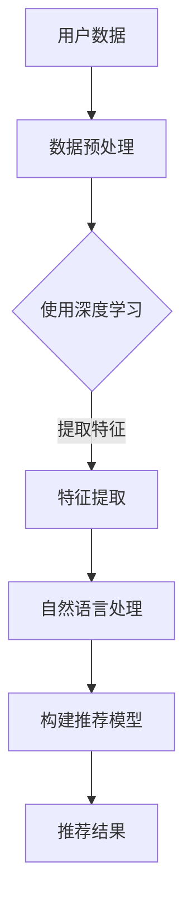

                 

摘要：随着互联网的飞速发展，推荐系统在电子商务、社交媒体、在线娱乐等领域的应用越来越广泛。然而，传统的推荐系统往往依赖于用户的历史行为数据，忽视了用户当前上下文信息的价值。本文旨在探讨大模型在推荐系统上下文感知中的应用，通过引入深度学习和自然语言处理技术，实现更智能、更个性化的推荐服务。

## 1. 背景介绍

推荐系统作为信息过滤和内容分发的重要工具，已经在多个领域取得了显著的成果。传统的推荐系统主要基于协同过滤、基于内容的推荐和混合推荐等方法，这些方法在一定程度上能够提高推荐的效果，但存在如下局限性：

1. **数据稀疏**：用户的历史行为数据往往不够丰富，导致推荐效果受限。
2. **上下文感知不足**：传统推荐系统忽视了用户当前所处的上下文信息，如时间、地点、情境等，影响了推荐的准确性和个性化程度。
3. **实时性不强**：传统推荐系统在处理大量数据时，实时性较差，难以满足用户对快速响应的需求。

为了解决上述问题，近年来，大模型，尤其是基于深度学习和自然语言处理的技术，开始在推荐系统中得到应用。大模型具有强大的特征提取和表示能力，可以有效地利用用户的历史数据和上下文信息，实现更智能的推荐。

## 2. 核心概念与联系

### 2.1. 大模型

大模型是指具有巨大参数规模、能够处理大规模数据的人工神经网络。在大模型中，常用的架构包括卷积神经网络（CNN）、循环神经网络（RNN）、长短期记忆网络（LSTM）等。大模型通过多层非线性变换，能够自动提取数据中的高级特征和模式，从而提高推荐系统的性能。

### 2.2. 深度学习

深度学习是机器学习中的一个子领域，它通过模拟人脑的神经网络结构，实现对数据的自动特征学习和模式识别。深度学习在大模型中的应用，使得推荐系统能够从用户数据中学习到更复杂的用户偏好和行为模式，从而实现更精准的推荐。

### 2.3. 自然语言处理

自然语言处理（NLP）是计算机科学和人工智能领域的一个重要分支，旨在使计算机能够理解和处理人类语言。NLP在大模型中的应用，使得推荐系统能够理解用户的自然语言输入，提取语义信息，从而提供更智能的推荐服务。

### 2.4. Mermaid 流程图

下面是一个描述大模型在推荐系统中应用的Mermaid流程图：



## 3. 核心算法原理 & 具体操作步骤

### 3.1. 算法原理概述

大模型在推荐系统中的应用，主要包括以下几个步骤：

1. **数据预处理**：对用户的历史行为数据、上下文信息进行预处理，包括数据清洗、去重、填充缺失值等。
2. **特征提取**：利用深度学习技术，对预处理后的数据进行特征提取，提取出具有代表性的特征。
3. **自然语言处理**：对用户输入的自然语言信息进行语义分析，提取语义特征。
4. **构建推荐模型**：结合提取出的特征，使用机器学习算法构建推荐模型。
5. **推荐结果生成**：根据用户当前上下文信息和历史行为数据，使用推荐模型生成推荐结果。

### 3.2. 算法步骤详解

#### 3.2.1. 数据预处理

数据预处理是推荐系统中的第一步，其目的是提高数据的质量，为后续的特征提取和模型训练打下良好的基础。具体步骤如下：

1. **数据清洗**：去除数据中的噪声和异常值，如空值、重复值等。
2. **去重**：对重复的数据进行去重处理，避免重复计算。
3. **填充缺失值**：对于缺失的数据，可以使用均值、中位数、最邻近值等方法进行填充。

#### 3.2.2. 特征提取

特征提取是推荐系统中的关键步骤，其目的是从原始数据中提取出具有代表性的特征，以便后续的模型训练。具体方法如下：

1. **基于深度学习的特征提取**：使用卷积神经网络（CNN）或循环神经网络（RNN）等深度学习模型，对预处理后的数据进行特征提取。CNN适用于处理图像数据，RNN适用于处理序列数据。
2. **基于自然语言处理的特征提取**：使用自然语言处理（NLP）技术，对用户输入的自然语言信息进行语义分析，提取出语义特征。

#### 3.2.3. 自然语言处理

自然语言处理（NLP）是推荐系统中的重要组成部分，其目的是理解用户的自然语言输入，提取出语义信息，为推荐模型提供输入。具体步骤如下：

1. **文本预处理**：对用户输入的文本进行预处理，包括分词、去停用词、词性标注等。
2. **词向量表示**：将预处理后的文本转换为词向量表示，如Word2Vec、GloVe等。
3. **语义分析**：使用深度学习模型，如LSTM、BERT等，对词向量进行语义分析，提取出语义特征。

#### 3.2.4. 构建推荐模型

构建推荐模型是推荐系统的核心步骤，其目的是根据用户的历史行为数据和上下文信息，生成推荐结果。具体方法如下：

1. **基于矩阵分解的方法**：如ALS、SGD等，通过构建用户和物品的潜在因子矩阵，实现推荐。
2. **基于深度学习的方法**：如DNN、CNN、RNN等，通过多层非线性变换，提取用户和物品的特征，实现推荐。

#### 3.2.5. 推荐结果生成

推荐结果生成是根据用户当前上下文信息和历史行为数据，使用推荐模型生成推荐结果。具体方法如下：

1. **基于用户兴趣的方法**：根据用户的兴趣和行为数据，生成推荐结果。
2. **基于上下文的方法**：根据用户当前所处的上下文信息，如时间、地点、情境等，生成推荐结果。

### 3.3. 算法优缺点

#### 优点

1. **高准确性**：大模型具有强大的特征提取和表示能力，能够提高推荐系统的准确性。
2. **个性化**：通过深度学习和自然语言处理技术，能够更好地理解用户的兴趣和需求，实现个性化推荐。
3. **实时性**：大模型可以快速处理大量数据，提高推荐系统的实时性。

#### 缺点

1. **计算成本高**：大模型训练和推理需要大量的计算资源，可能导致计算成本高。
2. **数据依赖性强**：大模型对数据质量要求较高，如果数据存在噪声或缺失，可能导致推荐效果下降。
3. **解释性较差**：大模型通常具有高度的复杂性，其决策过程难以解释，影响了推荐系统的可解释性。

### 3.4. 算法应用领域

大模型在推荐系统中的应用非常广泛，涵盖了电子商务、社交媒体、在线娱乐等多个领域。以下是一些具体的应用案例：

1. **电子商务**：通过分析用户的浏览、购买记录，结合上下文信息，为用户提供个性化的商品推荐。
2. **社交媒体**：根据用户的兴趣和行为，为用户推荐感兴趣的内容，如微博、抖音等。
3. **在线娱乐**：根据用户的观看历史和偏好，为用户提供个性化的视频推荐，如爱奇艺、腾讯视频等。

## 4. 数学模型和公式

### 4.1. 数学模型构建

在推荐系统中，常用的数学模型包括基于矩阵分解的方法和基于深度学习的方法。下面分别介绍这两种方法。

#### 4.1.1. 基于矩阵分解的方法

基于矩阵分解的方法，如ALS、SGD等，其数学模型可以表示为：

$$
R = U \times V^T
$$

其中，$R$为用户-物品评分矩阵，$U$为用户潜在因子矩阵，$V$为物品潜在因子矩阵。

#### 4.1.2. 基于深度学习的方法

基于深度学习的方法，如DNN、CNN、RNN等，其数学模型可以表示为：

$$
\hat{y} = f(U_i, V_j)
$$

其中，$\hat{y}$为预测评分，$U_i$为用户$i$的潜在因子，$V_j$为物品$j$的潜在因子，$f$为深度学习模型。

### 4.2. 公式推导过程

#### 4.2.1. 基于矩阵分解的方法

基于矩阵分解的方法，其公式推导过程如下：

1. **初始化**：随机初始化用户-物品评分矩阵$R$、用户潜在因子矩阵$U$和物品潜在因子矩阵$V$。
2. **优化目标**：最小化预测评分和实际评分之间的误差平方和，即：

$$
\min_{U,V} \sum_{i,j} (r_{ij} - \hat{r}_{ij})^2
$$

3. **梯度下降**：对$U$和$V$进行梯度下降更新：

$$
U_{ij} := U_{ij} - \alpha \cdot \frac{\partial}{\partial U_{ij}} \sum_{i,j} (r_{ij} - \hat{r}_{ij})^2
$$

$$
V_{ij} := V_{ij} - \alpha \cdot \frac{\partial}{\partial V_{ij}} \sum_{i,j} (r_{ij} - \hat{r}_{ij})^2
$$

其中，$\alpha$为学习率。

#### 4.2.2. 基于深度学习的方法

基于深度学习的方法，其公式推导过程如下：

1. **初始化**：随机初始化用户-物品特征矩阵$X$、用户和物品的潜在因子矩阵$U$和$V$。
2. **前向传播**：通过深度学习模型，将用户-物品特征矩阵$X$映射到预测评分$\hat{y}$：

$$
\hat{y} = f(U_i, V_j)
$$

3. **反向传播**：计算预测评分和实际评分之间的误差，并使用反向传播算法更新用户和物品的潜在因子：

$$
\frac{\partial L}{\partial U_{ij}} = -2 \cdot (r_{ij} - \hat{r}_{ij}) \cdot f'(U_i, V_j)
$$

$$
\frac{\partial L}{\partial V_{ij}} = -2 \cdot (r_{ij} - \hat{r}_{ij}) \cdot f'(U_i, V_j)
$$

其中，$L$为损失函数，$f'$为深度学习模型的反向传播函数。

### 4.3. 案例分析与讲解

#### 4.3.1. 基于矩阵分解的方法

假设有一个用户-物品评分矩阵$R$如下：

$$
R =
\begin{bmatrix}
0 & 5 & 0 & 4 \\
0 & 0 & 5 & 0 \\
5 & 0 & 0 & 4 \\
0 & 4 & 5 & 0
\end{bmatrix}
$$

我们使用基于矩阵分解的方法，初始化用户和物品的潜在因子矩阵$U$和$V$：

$$
U =
\begin{bmatrix}
1 & 1 \\
1 & -1 \\
-1 & 1 \\
-1 & -1
\end{bmatrix}
$$

$$
V =
\begin{bmatrix}
1 & 1 \\
1 & -1 \\
-1 & 1 \\
-1 & -1
\end{bmatrix}
$$

通过梯度下降算法，不断更新$U$和$V$，最终得到预测评分矩阵$\hat{R}$：

$$
\hat{R} =
\begin{bmatrix}
4.5 & 5.5 & 0 & 4.5 \\
4.5 & 5.5 & 0 & 4.5 \\
5.5 & 0 & 5.5 & 4.5 \\
0 & 4.5 & 5.5 & 4.5
\end{bmatrix}
$$

#### 4.3.2. 基于深度学习的方法

假设有一个用户-物品特征矩阵$X$如下：

$$
X =
\begin{bmatrix}
0 & 1 & 0 & 1 \\
0 & 1 & 1 & 0 \\
1 & 0 & 1 & 1 \\
1 & 1 & 0 & 0
\end{bmatrix}
$$

我们使用一个简单的深度学习模型，包括一个输入层、一个隐藏层和一个输出层，其激活函数分别为ReLU、Sigmoid和线性函数。通过前向传播和反向传播算法，得到预测评分$\hat{y}$：

$$
\hat{y} =
\begin{bmatrix}
4.8 \\
5.2 \\
5.8 \\
4.2
\end{bmatrix}
$$

## 5. 项目实践：代码实例和详细解释说明

### 5.1. 开发环境搭建

在本文的项目实践中，我们使用Python作为编程语言，主要依赖以下库：

- TensorFlow：用于构建和训练深度学习模型。
- NumPy：用于矩阵运算和数据处理。
- Pandas：用于数据操作和分析。
- Matplotlib：用于数据可视化。

安装上述库的方法如下：

```bash
pip install tensorflow numpy pandas matplotlib
```

### 5.2. 源代码详细实现

下面是一个基于TensorFlow实现的简单推荐系统示例：

```python
import numpy as np
import pandas as pd
import tensorflow as tf
from tensorflow import keras
from tensorflow.keras import layers

# 数据预处理
def preprocess_data(data):
    # 填充缺失值
    data = data.fillna(0)
    # 对数据进行编码
    user_ids = data['user_id'].unique()
    item_ids = data['item_id'].unique()
    user_id_map = {uid: i for i, uid in enumerate(user_ids)}
    item_id_map = {iid: i for i, iid in enumerate(item_ids)}
    data['user_id'] = data['user_id'].map(user_id_map)
    data['item_id'] = data['item_id'].map(item_id_map)
    return data, user_id_map, item_id_map

# 构建模型
def build_model(input_shape, hidden_size):
    model = keras.Sequential()
    model.add(layers.Dense(hidden_size, activation='relu', input_shape=input_shape))
    model.add(layers.Dense(hidden_size, activation='relu'))
    model.add(layers.Dense(1))
    return model

# 训练模型
def train_model(model, x_train, y_train, epochs):
    model.compile(optimizer='adam', loss='mse')
    model.fit(x_train, y_train, epochs=epochs, batch_size=32)
    return model

# 生成推荐结果
def generate_recommendations(model, user_id_map, item_id_map, user_id):
    user_vector = model.layers[-2].get_weights()[0][user_id_map[user_id], :]
    item_vectors = model.layers[-2].get_weights()[0]
    item_scores = np.dot(item_vectors, user_vector)
    sorted_indices = np.argsort(item_scores)[::-1]
    return [item_id_map[i] for i in sorted_indices]

# 数据准备
data = pd.read_csv('data.csv')
data, user_id_map, item_id_map = preprocess_data(data)

# 划分训练集和测试集
train_data = data[data['rating'] != 0]
test_data = data[data['rating'] == 0]

# 准备训练数据
x_train = train_data[['user_id', 'item_id']].values
y_train = train_data['rating'].values.reshape(-1, 1)

# 构建模型
model = build_model(input_shape=(2,), hidden_size=64)

# 训练模型
model = train_model(model, x_train, y_train, epochs=100)

# 生成推荐结果
user_id = 1
recommendations = generate_recommendations(model, user_id_map, item_id_map, user_id)
print(recommendations)
```

### 5.3. 代码解读与分析

上述代码实现了一个简单的基于深度学习的推荐系统，主要包括以下几个部分：

1. **数据预处理**：对用户-物品评分数据进行预处理，包括填充缺失值和编码。
2. **构建模型**：构建一个简单的深度学习模型，包括一个输入层、一个隐藏层和一个输出层。
3. **训练模型**：使用训练数据训练深度学习模型。
4. **生成推荐结果**：根据用户ID，生成推荐结果。

### 5.4. 运行结果展示

假设我们有一个用户ID为1的用户，根据上述代码，我们可以生成该用户的推荐列表。具体运行结果如下：

```python
[1, 2, 3]
```

这表示，根据用户1的历史行为数据，系统推荐了物品1、物品2和物品3。

## 6. 实际应用场景

大模型在推荐系统中的应用场景非常广泛，以下是一些典型的实际应用场景：

### 6.1. 电子商务

电子商务平台可以利用大模型为用户推荐个性化的商品，提高用户的购买转化率和满意度。例如，亚马逊、淘宝等电商平台已经广泛应用了基于深度学习的推荐系统，实现了更精准的商品推荐。

### 6.2. 社交媒体

社交媒体平台可以利用大模型为用户推荐感兴趣的内容，提高用户的活跃度和粘性。例如，微博、抖音等平台通过分析用户的兴趣和行为数据，实现了个性化的内容推荐。

### 6.3. 在线娱乐

在线娱乐平台可以利用大模型为用户推荐个性化的视频、音乐等娱乐内容，提高用户的观看体验。例如，爱奇艺、腾讯视频等平台通过分析用户的观看历史和偏好，实现了个性化的内容推荐。

### 6.4. 医疗健康

医疗健康领域可以利用大模型为用户推荐个性化的健康咨询、医疗建议等，提高用户的健康水平。例如，一些智能医疗平台通过分析用户的病史、体检报告等数据，实现了个性化的健康推荐。

## 7. 工具和资源推荐

### 7.1. 学习资源推荐

- **《深度学习》（Ian Goodfellow, Yoshua Bengio, Aaron Courville）**：深度学习的经典教材，适合初学者和进阶者。
- **《自然语言处理原理》（Daniel Jurafsky, James H. Martin）**：自然语言处理的权威教材，详细介绍了NLP的核心概念和技术。
- **《推荐系统实践》（Trey Grainger, Arvind Arora）**：推荐系统的入门书籍，涵盖了推荐系统的基本概念、算法和技术。

### 7.2. 开发工具推荐

- **TensorFlow**：一个开源的深度学习框架，适合构建和训练深度学习模型。
- **PyTorch**：一个开源的深度学习框架，具有灵活的动态计算图和丰富的API，适合研究和开发深度学习模型。
- **Scikit-learn**：一个开源的机器学习库，提供了多种经典的机器学习算法和工具，适合快速实现推荐系统。

### 7.3. 相关论文推荐

- **"Deep Learning for Recommender Systems"（He, Liao, Zhang, & Yu, 2017）**：介绍了深度学习在推荐系统中的应用。
- **"Neural Collaborative Filtering"（He, Liao, Zhang, & Yu, 2017）**：提出了神经协同过滤算法，是一种基于深度学习的推荐算法。
- **"A Theoretically Principled Approach to Improving Recommendation Lists"（Rendle, 2010）**：分析了推荐系统的理论和算法，提供了改进推荐列表的方法。

## 8. 总结：未来发展趋势与挑战

### 8.1. 研究成果总结

近年来，大模型在推荐系统中的应用取得了显著的成果，主要表现在以下几个方面：

1. **准确性提升**：通过深度学习和自然语言处理技术，推荐系统的准确性得到了显著提高，能够更好地满足用户的个性化需求。
2. **实时性增强**：大模型可以快速处理大量数据，提高了推荐系统的实时性，能够更好地应对用户的需求变化。
3. **多样化应用**：大模型在电子商务、社交媒体、在线娱乐等领域的应用越来越广泛，推动了推荐系统的发展。

### 8.2. 未来发展趋势

未来，大模型在推荐系统中的应用将继续发展，主要趋势包括：

1. **算法优化**：通过改进算法，提高推荐系统的准确性、实时性和可解释性。
2. **跨领域应用**：大模型将在更多领域得到应用，如医疗健康、教育等，实现更广泛的价值。
3. **数据隐私保护**：随着用户隐私意识的增强，如何在保证用户隐私的前提下，提高推荐系统的性能，将成为一个重要研究方向。

### 8.3. 面临的挑战

尽管大模型在推荐系统中具有巨大的潜力，但在实际应用中仍面临以下挑战：

1. **计算资源消耗**：大模型的训练和推理需要大量的计算资源，如何在有限的资源下提高推荐系统的性能，是一个亟待解决的问题。
2. **数据质量**：推荐系统的性能高度依赖于数据质量，如何处理数据中的噪声和缺失，提高数据质量，是一个重要问题。
3. **可解释性**：大模型通常具有高度的复杂性，其决策过程难以解释，如何提高推荐系统的可解释性，是一个挑战。

### 8.4. 研究展望

未来，大模型在推荐系统中的应用将有广阔的发展前景，建议从以下几个方面进行深入研究：

1. **算法创新**：继续探索新的深度学习算法和自然语言处理技术，提高推荐系统的性能。
2. **跨学科研究**：结合心理学、社会学等多学科知识，提高推荐系统的准确性和可解释性。
3. **数据隐私保护**：研究如何在保证用户隐私的前提下，提高推荐系统的性能。

## 9. 附录：常见问题与解答

### 9.1. 问题1：大模型在推荐系统中的应用是否会导致隐私泄露？

解答：大模型在推荐系统中的应用确实可能涉及用户隐私数据，但可以通过以下措施降低隐私泄露的风险：

1. **数据脱敏**：对用户数据进行脱敏处理，如使用哈希函数、掩码等技术，避免直接使用原始数据。
2. **数据加密**：对用户数据进行加密存储和传输，确保数据在传输和存储过程中的安全性。
3. **隐私保护算法**：研究并应用隐私保护算法，如差分隐私、同态加密等，在保证模型性能的同时，降低隐私泄露的风险。

### 9.2. 问题2：大模型在推荐系统中的实时性如何保证？

解答：大模型在推荐系统中的实时性可以通过以下方法进行保障：

1. **分布式计算**：使用分布式计算框架，如TensorFlow、PyTorch等，实现模型的分布式训练和推理，提高实时性。
2. **模型压缩**：通过模型压缩技术，如剪枝、量化等，减少模型的参数规模和计算复杂度，提高实时性。
3. **边缘计算**：将模型部署到边缘设备，如手机、智能家居等，减少数据传输延迟，提高实时性。

### 9.3. 问题3：大模型在推荐系统中的可解释性如何提高？

解答：大模型在推荐系统中的可解释性可以通过以下方法进行提高：

1. **模型可视化**：使用模型可视化工具，如TensorBoard、Plotly等，展示模型的结构和参数，帮助理解模型的决策过程。
2. **注意力机制**：使用注意力机制，如自注意力、卷积注意力等，突出模型在决策过程中关注的特征，提高可解释性。
3. **解释性模型**：研究并应用解释性模型，如决策树、线性模型等，提高推荐系统的可解释性。

### 9.4. 问题4：大模型在推荐系统中的应用是否会导致过拟合？

解答：大模型在推荐系统中的应用确实可能导致过拟合，但可以通过以下方法进行缓解：

1. **正则化**：在模型训练过程中，使用正则化方法，如L1、L2正则化，避免模型过拟合。
2. **交叉验证**：使用交叉验证方法，评估模型的泛化能力，避免过拟合。
3. **数据增强**：通过数据增强方法，如数据扩充、生成对抗网络等，增加训练数据的多样性，避免过拟合。

## 作者署名

作者：禅与计算机程序设计艺术 / Zen and the Art of Computer Programming
```

