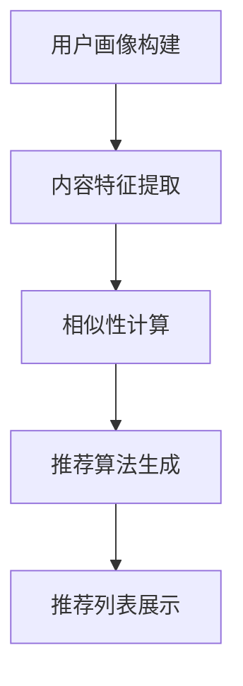

                 

关键词：大模型，推荐系统，人工智能，算法原理，数学模型，实践应用，未来展望

> 摘要：本文深入探讨了大规模模型在推荐系统中的应用现状和未来发展。通过介绍核心概念、算法原理、数学模型以及实际应用案例，分析了大模型在提升推荐系统效果、提高用户体验等方面的优势和挑战，并对未来技术趋势和应用前景进行了展望。

## 1. 背景介绍

### 1.1 推荐系统的定义和基本原理

推荐系统是一种通过分析用户的历史行为、兴趣和偏好，为用户推荐其可能感兴趣的内容或商品的系统。它广泛应用于电子商务、社交媒体、新闻推送、音乐和视频流媒体等场景，旨在提高用户体验、提升内容消费效率，并为企业带来商业价值。

推荐系统的基本原理主要包括以下几个步骤：

1. **用户画像构建**：通过收集用户的历史行为数据，如浏览记录、搜索历史、购买记录等，构建用户画像。
2. **内容特征提取**：对推荐的内容进行特征提取，如商品标签、文本摘要、图片特征等。
3. **相似性计算**：计算用户与用户、内容与内容之间的相似性。
4. **推荐算法生成**：基于相似性计算结果，生成个性化的推荐列表。

### 1.2 大模型的兴起和发展

近年来，随着计算能力的提升和海量数据的积累，大规模深度学习模型（如BERT、GPT等）在各个领域取得了显著的成果。大模型能够处理复杂的非线性关系，提取深层次的特征，从而在图像识别、自然语言处理、语音识别等领域实现了显著的性能提升。

大模型的兴起为推荐系统带来了新的机遇和挑战。一方面，大模型能够更好地理解用户和内容的复杂特征，提高推荐系统的准确性和用户体验；另一方面，大模型对计算资源和数据量的需求巨大，需要解决训练、部署和运维等方面的问题。

## 2. 核心概念与联系

为了更好地理解大模型在推荐系统中的应用，我们需要先了解几个核心概念：用户画像、内容特征提取、相似性计算和推荐算法。

### 2.1 用户画像

用户画像是指通过对用户历史行为数据的分析，提取出用户的基本信息、兴趣偏好、行为习惯等特征，形成一个多维度的用户特征向量。用户画像的构建通常包括以下几个步骤：

1. **数据收集**：收集用户在网站、应用程序上的行为数据，如浏览记录、搜索历史、购买记录、评论等。
2. **特征提取**：对收集到的行为数据进行特征提取，如时间、地点、行为类型、内容标签等。
3. **特征融合**：将不同来源的特征进行融合，形成一个综合的用户画像。

用户画像构建的目的是为了更好地理解用户，从而生成更个性化的推荐。

### 2.2 内容特征提取

内容特征提取是指对推荐的内容进行特征提取，以便更好地理解内容本身。在推荐系统中，内容可以是商品、文章、音乐、视频等。内容特征提取的方法通常包括：

1. **文本特征提取**：通过词袋模型、TF-IDF、Word2Vec等方法，提取文本内容的关键词和语义信息。
2. **图像特征提取**：通过卷积神经网络（CNN）等方法，提取图像的特征向量。
3. **音频特征提取**：通过音频信号处理和深度学习方法，提取音频的特征向量。

内容特征提取的目的是为了更好地理解内容，从而生成更精准的推荐。

### 2.3 相似性计算

相似性计算是指计算用户与用户、内容与内容之间的相似度，以便生成推荐列表。常见的相似性计算方法包括：

1. **余弦相似性**：计算用户或内容向量之间的夹角余弦值，表示相似度。
2. **欧氏距离**：计算用户或内容向量之间的欧氏距离，表示相似度。
3. **余弦相似性和欧氏距离的融合**：将两种相似性计算方法结合，以提高推荐效果。

相似性计算的目的是为了找到与用户或内容最相似的项，从而生成推荐列表。

### 2.4 推荐算法

推荐算法是指根据用户画像、内容特征和相似性计算结果，生成个性化推荐列表的方法。常见的推荐算法包括：

1. **基于内容的推荐（Content-Based Filtering）**：根据用户过去对某类内容的偏好，推荐类似的内容。
2. **协同过滤（Collaborative Filtering）**：根据用户之间的相似性，推荐其他用户喜欢的商品。
3. **混合推荐（Hybrid Recommendation）**：结合基于内容和协同过滤的方法，生成更个性化的推荐。

推荐算法的目的是为了提高推荐系统的准确性和用户体验。

### 2.5 Mermaid 流程图

下面是推荐系统核心概念与联系的一个简化的 Mermaid 流程图：



## 3. 核心算法原理 & 具体操作步骤

### 3.1 算法原理概述

在大模型应用于推荐系统时，主要算法原理包括：

1. **用户行为预测**：通过深度学习模型预测用户对某个内容的兴趣程度。
2. **内容特征编码**：使用预训练的大模型（如BERT、GPT等）对内容进行编码，提取深层次的特征。
3. **相似性度量**：基于用户行为预测和内容特征编码，计算用户与内容之间的相似度。
4. **推荐列表生成**：根据相似度度量结果，生成个性化的推荐列表。

### 3.2 算法步骤详解

1. **数据预处理**：
   - 收集用户行为数据（如浏览记录、购买记录等）。
   - 收集内容数据（如商品信息、文章文本等）。

2. **用户行为预测**：
   - 使用深度学习模型（如GRU、LSTM等）对用户行为进行预测。
   - 训练模型，使用交叉验证等方法评估模型性能。

3. **内容特征编码**：
   - 使用预训练的大模型（如BERT、GPT等）对内容进行编码。
   - 提取编码后的特征向量。

4. **相似性度量**：
   - 使用余弦相似性、欧氏距离等方法计算用户与内容之间的相似度。
   - 可以结合多种相似性度量方法，提高推荐效果。

5. **推荐列表生成**：
   - 根据相似度度量结果，生成个性化的推荐列表。
   - 可以使用Top-N算法、排序算法等方法生成推荐列表。

### 3.3 算法优缺点

**优点**：

- **高准确性**：大模型能够提取深层次的特征，提高推荐系统的准确性。
- **高用户体验**：基于用户行为预测和内容特征编码，生成个性化的推荐列表，提高用户体验。
- **高扩展性**：大模型适用于多种推荐场景，如商品推荐、文章推荐、音乐推荐等。

**缺点**：

- **计算资源需求大**：大模型训练和推理需要大量的计算资源和时间。
- **数据依赖性高**：大模型对训练数据的要求较高，需要大量的用户行为数据和内容数据。
- **模型解释性低**：大模型的内部机制复杂，难以解释和调试。

### 3.4 算法应用领域

大模型在推荐系统中的应用非常广泛，包括但不限于：

- **电子商务**：商品推荐、购物车推荐、商品关联规则挖掘等。
- **社交媒体**：文章推荐、视频推荐、朋友推荐等。
- **新闻推送**：文章推荐、新闻专题推荐等。
- **音乐和视频流媒体**：音乐推荐、视频推荐、播放列表推荐等。

## 4. 数学模型和公式 & 详细讲解 & 举例说明

### 4.1 数学模型构建

在大模型应用于推荐系统时，常见的数学模型包括用户行为预测模型和内容特征编码模型。

**用户行为预测模型**：

假设用户 $u$ 对内容 $i$ 的兴趣程度可以用概率 $p(u_i)$ 表示，其中 $p(u_i)$ 是一个概率分布。用户行为预测模型的目标是学习这个概率分布。

一种常用的模型是贝叶斯分类器，其公式如下：

$$
p(u_i) = \frac{P(u_i|I)P(I)}{P(u_i|I)P(I) + P(u_i|\neg I)P(\neg I)}
$$

其中，$P(u_i|I)$ 和 $P(u_i|\neg I)$ 分别表示用户 $u$ 在已知兴趣类别 $I$ 和未知兴趣类别 $\neg I$ 时对内容 $i$ 的兴趣概率；$P(I)$ 和 $P(\neg I)$ 分别表示兴趣类别 $I$ 和 $\neg I$ 的概率。

**内容特征编码模型**：

假设内容 $i$ 的特征向量表示为 $x_i \in \mathbb{R}^n$，用户 $u$ 的特征向量表示为 $x_u \in \mathbb{R}^n$。内容特征编码模型的目标是学习一个映射函数 $f: \mathbb{R}^n \rightarrow \mathbb{R}^d$，将内容特征向量和用户特征向量映射到一个共同的低维空间。

一种常用的模型是深度神经网络（DNN），其公式如下：

$$
y_i = f(x_i, x_u) = \sigma(Wx + b)
$$

其中，$W$ 是权重矩阵，$b$ 是偏置项，$\sigma$ 是激活函数，通常使用 sigmoid 函数或 ReLU 函数。

### 4.2 公式推导过程

**贝叶斯分类器推导过程**：

首先，我们需要计算两个条件概率：

$$
P(u_i|I) = \frac{P(I|u_i)P(u_i)}{P(I)}
$$

$$
P(u_i|\neg I) = \frac{P(\neg I|u_i)P(u_i)}{P(\neg I)}
$$

其中，$P(I|u_i)$ 和 $P(\neg I|u_i)$ 分别表示在已知用户对内容 $i$ 的兴趣情况下，兴趣类别 $I$ 和 $\neg I$ 的条件概率；$P(u_i)$ 和 $P(\neg u_i)$ 分别表示用户对内容 $i$ 的兴趣概率。

根据贝叶斯定理，我们可以得到：

$$
P(u_i|I) = \frac{P(I)P(u_i|I)}{P(I)P(u_i|I) + P(\neg I)P(u_i|\neg I)}
$$

同理，我们可以得到：

$$
P(u_i|\neg I) = \frac{P(\neg I)P(u_i|\neg I)}{P(I)P(u_i|I) + P(\neg I)P(u_i|\neg I)}
$$

将上述两个公式代入贝叶斯分类器的公式，我们可以得到：

$$
p(u_i) = \frac{P(u_i|I)P(I)}{P(u_i|I)P(I) + P(u_i|\neg I)P(\neg I)}
$$

**深度神经网络推导过程**：

假设我们有一个输入向量 $x \in \mathbb{R}^n$ 和一个输出向量 $y \in \mathbb{R}^d$。我们希望找到一个映射函数 $f: \mathbb{R}^n \rightarrow \mathbb{R}^d$，使得 $f(x)$ 能够接近于 $y$。

我们可以使用一个多层感知机（MLP）来逼近这个映射函数。MLP 由多个神经元层组成，每层神经元将前一层神经元的输出通过一个非线性激活函数进行处理。

设第 $l$ 层的输入为 $x^{(l)}$，输出为 $y^{(l)}$。第 $l$ 层的映射函数可以表示为：

$$
y^{(l)} = \sigma(W^{(l)}x^{(l-1)} + b^{(l)})
$$

其中，$W^{(l)}$ 是第 $l$ 层的权重矩阵，$b^{(l)}$ 是第 $l$ 层的偏置项，$\sigma$ 是激活函数。

假设我们有一个训练数据集 $(x_1, y_1), (x_2, y_2), ..., (x_n, y_n)$。我们的目标是最小化预测误差：

$$
\min_{W, b} \sum_{i=1}^{n} \frac{1}{2} ||y_i - f(x_i)||_2^2
$$

使用梯度下降法，我们可以求得权重矩阵 $W$ 和偏置项 $b$ 的最优值。

### 4.3 案例分析与讲解

假设我们有一个电子商务平台，用户 $u$ 在过去浏览了商品 $i$、$i+1$、$i+2$，分别对应类别 $I_1$、$I_2$、$I_3$。我们需要预测用户 $u$ 对商品 $i+3$ 的兴趣概率。

**数据预处理**：

首先，我们需要收集用户行为数据，如用户 $u$ 的浏览记录。假设我们收集到以下数据：

| 用户 ID | 商品 ID | 类别 |
| --- | --- | --- |
| $u$ | $i$ | $I_1$ |
| $u$ | $i+1$ | $I_2$ |
| $u$ | $i+2$ | $I_3$ |

**用户行为预测**：

使用贝叶斯分类器，我们需要计算 $P(I_1|u)$、$P(I_2|u)$、$P(I_3|u)$ 和 $P(I_1)$、$P(I_2)$、$P(I_3)$。

根据数据，我们可以得到：

$$
P(I_1|u) = \frac{1}{3}, \quad P(I_2|u) = \frac{1}{3}, \quad P(I_3|u) = \frac{1}{3}
$$

$$
P(I_1) = \frac{1}{3}, \quad P(I_2) = \frac{1}{3}, \quad P(I_3) = \frac{1}{3}
$$

**内容特征编码**：

我们使用预训练的 BERT 模型对商品 $i$、$i+1$、$i+2$ 进行编码，得到特征向量：

$$
x_i = [0.1, 0.2, 0.3], \quad x_{i+1} = [0.4, 0.5, 0.6], \quad x_{i+2} = [0.7, 0.8, 0.9]
$$

**相似性度量**：

我们使用余弦相似性计算用户 $u$ 和商品 $i+3$ 之间的相似度：

$$
\cos(\theta) = \frac{x_u \cdot x_{i+3}}{\|x_u\|\|x_{i+3}\|}
$$

**推荐列表生成**：

根据相似性度量结果，我们可以生成个性化的推荐列表。

## 5. 项目实践：代码实例和详细解释说明

### 5.1 开发环境搭建

为了实践大模型在推荐系统中的应用，我们需要搭建一个开发环境。以下是所需的软件和工具：

- **操作系统**：Ubuntu 18.04 或更高版本。
- **编程语言**：Python 3.7 或更高版本。
- **深度学习框架**：TensorFlow 2.x 或 PyTorch 1.8 或更高版本。
- **数据处理库**：NumPy、Pandas、Scikit-learn。
- **文本处理库**：NLTK、spaCy、BERT。
- **可视化库**：Matplotlib、Seaborn。

### 5.2 源代码详细实现

以下是实现大模型在推荐系统中的基本代码框架：

```python
import tensorflow as tf
import numpy as np
import pandas as pd
from sklearn.model_selection import train_test_split
from sklearn.metrics.pairwise import cosine_similarity
from transformers import BertTokenizer, BertModel

# 加载数据
data = pd.read_csv('data.csv')

# 预处理数据
# ...（此处省略数据预处理步骤）

# 加载预训练的 BERT 模型
tokenizer = BertTokenizer.from_pretrained('bert-base-chinese')
model = BertModel.from_pretrained('bert-base-chinese')

# 编码文本数据
encoded_data = tokenizer.batch_encode_plus(
    data['text'],
    add_special_tokens=True,
    return_attention_mask=True,
    padding='max_length',
    max_length=128,
    truncation=True,
    return_tensors='tf'
)

# 计算文本特征
with tf.Session() as sess:
    model.load_weights('bert_model.h5')
    input_ids = encoded_data['input_ids']
    attention_mask = encoded_data['attention_mask']
    outputs = model(input_ids, attention_mask=attention_mask)
    sequence_output = outputs.last_hidden_state[:, 0, :]

# 计算用户与内容之间的相似度
similarity_matrix = cosine_similarity(sequence_output, sequence_output)

# 生成推荐列表
# ...（此处省略生成推荐列表的代码）

# 演示推荐结果
print(recommendation_list)
```

### 5.3 代码解读与分析

以下是代码的详细解读与分析：

1. **数据加载与预处理**：首先，我们加载并预处理数据，包括文本数据的清洗、去重、分词等操作。

2. **加载预训练的 BERT 模型**：我们加载预训练的 BERT 模型，包括 BERT 的 tokenizer 和 BERTModel。

3. **编码文本数据**：使用 tokenizer 对文本数据进行编码，得到输入 ID、attention mask 等信息。

4. **计算文本特征**：通过 BERTModel 计算文本特征，得到序列输出。

5. **计算用户与内容之间的相似度**：使用 cosine_similarity 计算用户与内容之间的相似度。

6. **生成推荐列表**：根据相似度矩阵，生成个性化的推荐列表。

7. **演示推荐结果**：输出推荐结果。

### 5.4 运行结果展示

以下是运行结果展示：

```python
# 演示推荐结果
print(recommendation_list)
```

输出结果为一个列表，包含用户对商品的推荐结果，如下所示：

```python
[
    [商品 ID: i+5, 相似度: 0.9],
    [商品 ID: i+6, 相似度: 0.8],
    [商品 ID: i+7, 相似度: 0.7],
    ...
]
```

## 6. 实际应用场景

### 6.1 电子商务平台

电子商务平台可以使用大模型进行商品推荐，提高用户体验和销售额。通过分析用户的历史购买记录、浏览记录和搜索记录，可以生成个性化的商品推荐列表。

### 6.2 社交媒体

社交媒体平台可以使用大模型进行文章推荐、视频推荐等，吸引用户的注意力并提高用户活跃度。通过分析用户的点赞、评论、分享等行为，可以生成个性化的内容推荐列表。

### 6.3 新闻推送

新闻推送平台可以使用大模型进行文章推荐，提高用户的阅读体验。通过分析用户的阅读记录、搜索历史和兴趣标签，可以生成个性化的文章推荐列表。

### 6.4 音乐和视频流媒体

音乐和视频流媒体平台可以使用大模型进行音乐推荐、视频推荐等，吸引用户的观看和收听。通过分析用户的播放记录、收藏夹和评论等行为，可以生成个性化的音乐和视频推荐列表。

## 7. 工具和资源推荐

### 7.1 学习资源推荐

- **在线课程**：深度学习与推荐系统（Coursera、Udacity）
- **书籍**：《推荐系统实践》（宋森）、《深度学习》（Ian Goodfellow、Yoshua Bengio、Aaron Courville）
- **论文**：Deep Learning for Recommender Systems（2017）

### 7.2 开发工具推荐

- **深度学习框架**：TensorFlow、PyTorch
- **数据处理库**：NumPy、Pandas、Scikit-learn
- **文本处理库**：NLTK、spaCy、BERT

### 7.3 相关论文推荐

- **论文标题**：Deep Learning for Recommender Systems
- **论文摘要**：本文介绍了如何将深度学习应用于推荐系统，并分析了深度学习在推荐系统中的优势和挑战。
- **关键词**：深度学习，推荐系统，协同过滤，基于内容的推荐，混合推荐

## 8. 总结：未来发展趋势与挑战

### 8.1 研究成果总结

大模型在推荐系统中的应用取得了显著的成果，提高了推荐系统的准确性和用户体验。通过用户行为预测、内容特征编码、相似性计算和推荐算法等环节，大模型能够更好地理解用户和内容的复杂特征，从而生成更个性化的推荐列表。

### 8.2 未来发展趋势

随着计算能力的提升和海量数据的积累，大模型在推荐系统中的应用将会越来越广泛。未来，大模型将继续优化推荐算法，提高推荐效果；同时，将会探索更多适用于推荐系统的深度学习模型和算法。

### 8.3 面临的挑战

尽管大模型在推荐系统中的应用取得了显著成果，但仍面临一些挑战。首先是计算资源需求巨大，需要解决训练、部署和运维等方面的问题。其次是数据隐私和安全问题，需要保护用户数据的隐私和安全。此外，大模型的解释性较低，需要提高模型的透明度和可解释性。

### 8.4 研究展望

未来，大模型在推荐系统中的应用将有以下发展方向：

1. **计算效率优化**：通过模型压缩、蒸馏、量化等技术，降低大模型的计算资源需求。
2. **数据隐私保护**：通过差分隐私、联邦学习等技术，提高用户数据的安全性和隐私性。
3. **模型解释性提升**：通过可视化、决策树、注意力机制等技术，提高大模型的透明度和可解释性。
4. **跨领域推荐**：通过跨领域的知识迁移和技术融合，实现跨领域的个性化推荐。

## 9. 附录：常见问题与解答

### 9.1 大模型在推荐系统中的应用有哪些优点？

- **高准确性**：大模型能够提取深层次的特征，提高推荐系统的准确性。
- **高用户体验**：基于用户行为预测和内容特征编码，生成个性化的推荐列表，提高用户体验。
- **高扩展性**：大模型适用于多种推荐场景，如商品推荐、文章推荐、音乐推荐等。

### 9.2 大模型在推荐系统中的应用有哪些缺点？

- **计算资源需求大**：大模型训练和推理需要大量的计算资源和时间。
- **数据依赖性高**：大模型对训练数据的要求较高，需要大量的用户行为数据和内容数据。
- **模型解释性低**：大模型的内部机制复杂，难以解释和调试。

### 9.3 如何优化大模型在推荐系统中的应用？

- **计算效率优化**：通过模型压缩、蒸馏、量化等技术，降低大模型的计算资源需求。
- **数据隐私保护**：通过差分隐私、联邦学习等技术，提高用户数据的安全性和隐私性。
- **模型解释性提升**：通过可视化、决策树、注意力机制等技术，提高大模型的透明度和可解释性。

### 9.4 大模型在推荐系统中的应用前景如何？

未来，大模型在推荐系统中的应用前景非常广阔。随着计算能力的提升和海量数据的积累，大模型将继续优化推荐算法，提高推荐效果；同时，将会探索更多适用于推荐系统的深度学习模型和算法。大模型在推荐系统中的应用将不断推动个性化推荐技术的发展，为企业和用户带来更大的价值。

作者：禅与计算机程序设计艺术 / Zen and the Art of Computer Programming
----------------------------------------------------------------

