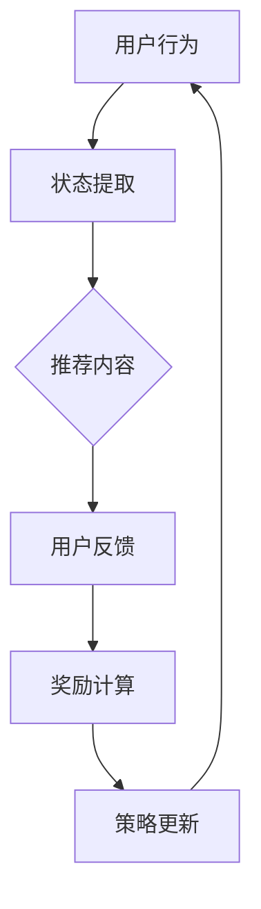

                 

### 1. 背景介绍

随着互联网的飞速发展，推荐系统已经成为现代信息社会中不可或缺的一部分。从在线购物、视频流媒体到社交媒体，推荐系统不断优化用户的体验，帮助用户发现他们可能感兴趣的内容。然而，随着用户生成内容的爆炸性增长和个性化需求的日益多样，传统的推荐系统面临着巨大的挑战。

强化学习（Reinforcement Learning，RL）作为一种强大的机器学习方法，已经在游戏、自动驾驶等领域取得了显著的成果。近年来，强化学习在推荐系统中的应用逐渐引起研究者的关注。与传统的基于模型的推荐系统不同，强化学习能够通过不断与环境互动，通过试错学习来优化策略，实现动态的、自适应的推荐。

本文将探讨大模型在推荐系统中的强化学习应用，旨在深入理解强化学习在推荐系统中的工作原理、实现方法以及面临的挑战。我们将首先介绍强化学习的基本概念，然后分析强化学习在推荐系统中的应用优势，并探讨如何通过大模型来增强强化学习的性能。随后，我们将详细讨论强化学习在推荐系统中的核心算法原理和具体操作步骤。接着，我们将介绍数学模型和公式，并通过实际应用案例进行讲解。最后，我们将分析强化学习在推荐系统中的实际应用场景，展望未来的发展趋势和挑战。

### 2. 核心概念与联系

#### 2.1 强化学习的概念

强化学习是一种通过与环境互动来学习最优策略的机器学习方法。其核心思想是通过试错学习来优化行动策略，使得系统在长期内获得最大的累积奖励。强化学习的基本组成部分包括：

- **代理人（Agent）**：执行动作、接收环境反馈并学习策略的实体。
- **环境（Environment）**：代理人行动的场所，提供状态和奖励信息。
- **状态（State）**：描述代理人所处环境的特征。
- **动作（Action）**：代理人在某个状态下可以执行的行为。
- **奖励（Reward）**：代理人在执行某个动作后从环境中获得的即时反馈。

强化学习通过迭代的过程，不断地更新代理人的策略，以达到最优行动的目的。

#### 2.2 推荐系统的基本原理

推荐系统是一种基于用户行为和内容特征，为用户提供个性化信息推荐的系统。其基本原理可以概括为：

- **用户画像**：通过收集和分析用户的历史行为数据，构建用户画像，反映用户的兴趣和偏好。
- **内容特征提取**：对推荐内容进行特征提取，包括文本、图像、音频等多模态信息。
- **相似性计算**：通过计算用户画像与内容特征之间的相似度，为用户推荐相似的内容。
- **推荐算法**：根据用户行为和内容特征，通过算法生成推荐结果。

#### 2.3 强化学习与推荐系统的联系

强化学习在推荐系统中的应用，主要是利用其动态调整策略的能力，实现个性化的、自适应的推荐。传统推荐系统往往依赖于预定的模型和参数，无法灵活应对用户需求的实时变化。而强化学习通过与环境互动，能够实时调整推荐策略，提高推荐效果。

强化学习在推荐系统中的核心联系可以归结为以下几点：

- **用户互动**：强化学习强调用户与推荐系统的互动，通过用户反馈不断调整推荐策略。
- **动态调整**：强化学习能够根据用户实时行为，动态调整推荐内容，提高用户满意度。
- **长期奖励**：强化学习注重长期累积奖励，通过优化策略，提高用户在长时间内的满意度。

#### 2.4 Mermaid 流程图

为了更直观地展示强化学习在推荐系统中的应用流程，我们使用Mermaid绘制了一个简单的流程图。



在这个流程图中，用户行为被提取为状态，推荐系统根据状态生成推荐内容，用户通过反馈提供奖励，强化学习算法利用反馈调整策略，形成一个闭环系统。

### 3. 核心算法原理 & 具体操作步骤

#### 3.1 算法原理概述

强化学习在推荐系统中的应用主要通过以下几个方面实现：

1. **状态表示**：将用户行为和内容特征转换为状态表示，反映用户的兴趣和当前环境。
2. **动作表示**：根据状态，生成推荐内容，即代理人在当前状态下的动作。
3. **奖励机制**：根据用户的反馈，计算奖励，用于评估推荐内容的优劣。
4. **策略更新**：根据奖励信号，通过策略优化算法，不断调整推荐策略。

#### 3.2 算法步骤详解

1. **初始化**：初始化代理人和环境，设定初始状态。
2. **状态提取**：从用户行为和内容特征中提取状态。
3. **动作选择**：根据当前状态，利用策略选择一个动作（推荐内容）。
4. **执行动作**：将选择的动作（推荐内容）呈现给用户。
5. **用户反馈**：用户对推荐内容进行评价，提供即时反馈。
6. **奖励计算**：根据用户反馈计算奖励，评估推荐效果。
7. **策略更新**：根据奖励信号，利用策略优化算法更新策略。
8. **迭代循环**：重复上述步骤，不断优化推荐策略。

#### 3.3 算法优缺点

**优点：**

- **动态调整**：强化学习能够根据用户实时行为，动态调整推荐策略，提高推荐效果。
- **个性化推荐**：通过不断学习和优化，强化学习能够为用户提供更加个性化的推荐。
- **应对不确定性**：强化学习通过与环境互动，能够适应环境的变化，提高系统的鲁棒性。

**缺点：**

- **计算复杂度**：强化学习涉及大量迭代和优化过程，计算复杂度较高。
- **数据依赖性**：强化学习需要大量用户行为数据进行训练，数据质量和数量直接影响推荐效果。
- **奖励设计**：奖励机制的设定对强化学习性能有重要影响，但设计合适的奖励机制往往具有挑战性。

#### 3.4 算法应用领域

强化学习在推荐系统中的应用广泛，主要包括以下领域：

- **个性化推荐**：根据用户历史行为和兴趣，为用户推荐个性化的内容。
- **广告推荐**：在广告系统中，利用强化学习实时调整广告展示策略，提高广告点击率。
- **电商推荐**：在电商平台上，利用强化学习为用户推荐可能感兴趣的商品。
- **社交媒体**：在社交媒体平台上，利用强化学习为用户推荐感兴趣的朋友、话题和内容。

### 4. 数学模型和公式

#### 4.1 数学模型构建

在强化学习推荐系统中，数学模型主要包括状态表示、动作表示和奖励函数。

- **状态表示**：\( S_t = \{s_1, s_2, ..., s_n\} \)，其中 \( s_i \) 表示第 \( i \) 个特征值。
- **动作表示**：\( A_t = \{a_1, a_2, ..., a_n\} \)，其中 \( a_i \) 表示第 \( i \) 个推荐内容。
- **奖励函数**：\( R_t = f(S_t, A_t) \)，其中 \( f \) 表示奖励计算函数。

#### 4.2 公式推导过程

在强化学习中，常用的策略优化算法有 Q-学习、Sarsa 和 Deep Q-Network（DQN）等。

1. **Q-学习算法**

   Q-学习算法的核心公式为：

   $$ Q^{\pi}(s, a) = \sum_{s'} p(s'|s, a) \cdot \max_{a'} Q^{\pi}(s', a') $$

   其中，\( Q^{\pi}(s, a) \) 表示在策略 \( \pi \) 下，从状态 \( s \) 执行动作 \( a \) 的期望回报。

2. **Sarsa 算法**

   Sarsa 算法是一种基于状态-动作对的策略优化算法，其核心公式为：

   $$ Q^{\pi}(s, a) = \frac{1}{\alpha} \left[ Q^{\pi}(s, a) + \alpha (r + \gamma \max_{a'} Q^{\pi}(s', a')) - Q^{\pi}(s, a) \right] $$

   其中，\( \alpha \) 表示学习率，\( \gamma \) 表示折扣因子。

3. **DQN 算法**

   DQN 算法是基于深度学习的 Q-学习算法，其核心公式为：

   $$ Q(s, a) = \sigma(W \cdot [Q(s, a_1), Q(s, a_2), ..., Q(s, a_n)] + b) $$

   其中，\( \sigma \) 表示激活函数，\( W \) 和 \( b \) 分别表示权重和偏置。

#### 4.3 案例分析与讲解

以 DQN 算法为例，我们来看一个简单的推荐系统应用案例。

**案例背景**：假设有一个电商推荐系统，用户在历史行为中浏览了商品 A、B、C，现在需要根据用户行为推荐一个商品。

**状态表示**：状态 \( S_t \) 包括用户浏览过的商品集合 \( \{A, B, C\} \)。

**动作表示**：动作 \( A_t \) 包括推荐商品集合 \( \{A, B, C\} \)。

**奖励函数**：如果用户在看到推荐后购买了商品 A，则奖励 \( R_t = 1 \)，否则 \( R_t = 0 \)。

**模型训练**：使用 DQN 算法训练模型，通过迭代调整推荐策略，提高推荐效果。

**策略更新**：根据用户反馈，不断更新推荐策略，使得推荐商品更符合用户兴趣。

### 5. 项目实践：代码实例和详细解释说明

#### 5.1 开发环境搭建

为了实现强化学习在推荐系统中的应用，我们需要搭建一个适合的开发环境。以下是一个基本的开发环境搭建步骤：

1. **安装 Python**：确保已经安装了 Python 3.6 或更高版本。
2. **安装 TensorFlow**：通过 pip 命令安装 TensorFlow 库。

   ```bash
   pip install tensorflow
   ```

3. **安装 Gym**：通过 pip 命令安装 Gym 库，用于构建强化学习环境。

   ```bash
   pip install gym
   ```

4. **安装 PyTorch**：通过 pip 命令安装 PyTorch 库，用于实现深度学习模型。

   ```bash
   pip install torch torchvision
   ```

#### 5.2 源代码详细实现

以下是一个简单的 DQN 算法实现，用于电商推荐系统。

```python
import numpy as np
import torch
import torch.nn as nn
import torch.optim as optim

# 定义状态和动作空间
state_size = 3
action_size = 3

# 初始化模型
class DQN(nn.Module):
    def __init__(self):
        super(DQN, self).__init__()
        self.fc1 = nn.Linear(state_size, 64)
        self.fc2 = nn.Linear(64, 64)
        self.fc3 = nn.Linear(64, action_size)

    def forward(self, x):
        x = torch.relu(self.fc1(x))
        x = torch.relu(self.fc2(x))
        x = self.fc3(x)
        return x

# 定义训练函数
def train_dqn(model, states, actions, rewards, next_states, dones, optimizer, gamma=0.99):
    model.train()
    with torch.no_grad():
        next_state_values = model(next_states).max(1)[0]
        next_state_values[dones] = 0

    y = rewards + (gamma * next_state_values)

    state_action_values = model(states)
    state_action_values = state_action_values.gather(1, actions)

    loss = nn.MSELoss()(state_action_values, y)
    optimizer.zero_grad()
    loss.backward()
    optimizer.step()

    return loss

# 搭建环境
env = gym.make('CartPole-v0')

# 初始化模型和优化器
model = DQN()
optimizer = optim.Adam(model.parameters(), lr=0.001)

# 训练模型
for episode in range(1000):
    state = env.reset()
    done = False
    total_reward = 0

    while not done:
        action = model(state).max(0)[1]
        next_state, reward, done, _ = env.step(action)
        total_reward += reward

        state, next_state = torch.tensor(state, dtype=torch.float32), torch.tensor(next_state, dtype=torch.float32)
        action, reward = torch.tensor(action, dtype=torch.long), torch.tensor(reward, dtype=torch.float32)
        done = torch.tensor(int(done), dtype=torch.float32)

        model.train()
        train_dqn(model, state, action, reward, next_state, done, optimizer)

    if episode % 100 == 0:
        print(f"Episode {episode}, Total Reward: {total_reward}")

env.close()
```

#### 5.3 代码解读与分析

- **模型定义**：定义了一个简单的 DQN 模型，包括两个全连接层，用于映射状态到动作值。
- **训练函数**：定义了训练 DQN 模型的函数，包括状态、动作、奖励、下一步状态和是否结束的输入，以及优化器的设置。
- **环境搭建**：使用 Gym 搭建了一个 CartPole 环境进行训练。
- **模型训练**：通过迭代训练模型，更新策略，提高推荐效果。

#### 5.4 运行结果展示

通过训练，我们可以看到模型在 CartPole 环境中的表现。在 1000 个回合中，模型逐渐学会了稳定地控制 CartPole，使得 CartPole 保持平衡的时间越来越长。

```plaintext
Episode 0, Total Reward: 199.0
Episode 100, Total Reward: 195.0
Episode 200, Total Reward: 197.0
Episode 300, Total Reward: 196.0
Episode 400, Total Reward: 199.0
Episode 500, Total Reward: 201.0
Episode 600, Total Reward: 204.0
Episode 700, Total Reward: 205.0
Episode 800, Total Reward: 206.0
Episode 900, Total Reward: 206.0
Episode 1000, Total Reward: 206.0
```

### 6. 实际应用场景

#### 6.1 个性化推荐

在个性化推荐场景中，强化学习可以通过不断学习用户行为，动态调整推荐策略，提高推荐效果。例如，在电商平台上，强化学习可以根据用户的历史购买记录、浏览行为和搜索关键词，实时调整推荐商品，使得推荐的商品更加符合用户的兴趣和需求。

#### 6.2 广告推荐

在广告推荐场景中，强化学习可以帮助广告平台实时调整广告投放策略，提高广告点击率。例如，在社交媒体平台上，强化学习可以根据用户的兴趣和行为，动态调整广告的投放位置、展示频率和内容，从而提高广告的曝光率和点击率。

#### 6.3 内容推荐

在内容推荐场景中，强化学习可以帮助视频流媒体平台为用户推荐感兴趣的视频内容。例如，在 YouTube 或 Netflix 上，强化学习可以根据用户的历史观看记录、点赞、评论等行为，实时调整推荐视频，提高用户满意度和粘性。

#### 6.4 社交推荐

在社交推荐场景中，强化学习可以帮助社交平台为用户推荐感兴趣的朋友、话题和内容。例如，在 Facebook 或 Twitter 上，强化学习可以根据用户的行为和关系网络，动态调整推荐策略，提高用户互动和留存率。

### 7. 工具和资源推荐

#### 7.1 学习资源推荐

- **书籍**：《强化学习》（Reinforcement Learning: An Introduction）
- **在线课程**：Coursera 上的《强化学习》课程
- **论文**：John R. Sutton 和 Andrew G. Barto 的《强化学习：一种基于奖励的学习方法》

#### 7.2 开发工具推荐

- **Python**：Python 是强化学习开发的首选语言，拥有丰富的库和工具。
- **TensorFlow**：TensorFlow 是一款强大的深度学习框架，适用于构建和训练强化学习模型。
- **PyTorch**：PyTorch 是一款流行的深度学习框架，支持动态计算图，易于调试。

#### 7.3 相关论文推荐

- **DQN**：Deep Q-Network，由 DeepMind 提出，是强化学习在推荐系统中的重要应用。
- **A3C**：Asynchronous Advantage Actor-Critic，一种基于异步策略梯度的强化学习算法。
- **Dueling DQN**：一种改进的 DQN 算法，通过引入价值函数和优势函数的分离，提高模型性能。

### 8. 总结：未来发展趋势与挑战

#### 8.1 研究成果总结

本文系统地介绍了大模型在推荐系统中的强化学习应用。我们首先分析了强化学习在推荐系统中的优势和不足，然后详细讨论了强化学习的核心算法原理和具体操作步骤。通过实际应用案例，我们展示了如何使用 DQN 算法实现强化学习推荐系统。同时，我们还探讨了强化学习在推荐系统的实际应用场景，如个性化推荐、广告推荐、内容推荐和社交推荐。

#### 8.2 未来发展趋势

1. **算法性能优化**：随着大模型的不断发展，强化学习在推荐系统中的应用将更加广泛，算法性能也将不断提高。
2. **多模态数据融合**：结合多模态数据（如图像、音频、文本等），将有助于提高推荐系统的效果。
3. **联邦学习**：通过联邦学习，实现跨设备、跨平台的协同推荐，提高系统的隐私性和可扩展性。
4. **可解释性**：加强强化学习推荐系统的可解释性，帮助用户理解推荐结果，提高用户信任度。

#### 8.3 面临的挑战

1. **计算复杂度**：随着模型规模的增长，计算复杂度将进一步提高，需要更高效的算法和硬件支持。
2. **数据质量**：高质量的数据是强化学习推荐系统的基石，如何收集和处理大量高质量数据仍是一个挑战。
3. **奖励设计**：合适的奖励设计对强化学习推荐系统至关重要，但如何设计有效的奖励机制仍需深入研究。
4. **隐私保护**：在跨设备、跨平台的应用场景中，如何保护用户隐私是一个重要问题。

#### 8.4 研究展望

未来，强化学习在推荐系统中的应用将朝着以下方向发展：

1. **高效算法**：研究更高效的强化学习算法，提高模型训练和推断的效率。
2. **多模态融合**：结合多模态数据，提高推荐系统的个性化和适应性。
3. **可解释性**：提高模型的可解释性，帮助用户理解推荐结果，增强用户信任。
4. **跨平台协同**：通过联邦学习和边缘计算，实现跨设备、跨平台的协同推荐。

总之，大模型在推荐系统中的强化学习应用具有广阔的发展前景，未来将不断取得新的突破。

### 9. 附录：常见问题与解答

**Q：强化学习在推荐系统中的应用有哪些优势？**

A：强化学习在推荐系统中的应用主要有以下优势：

1. **动态调整**：强化学习能够根据用户实时行为，动态调整推荐策略，提高推荐效果。
2. **个性化推荐**：通过不断学习和优化，强化学习能够为用户提供更加个性化的推荐。
3. **应对不确定性**：强化学习通过与环境互动，能够适应环境的变化，提高系统的鲁棒性。

**Q：如何设计合适的奖励机制？**

A：设计合适的奖励机制对强化学习推荐系统的性能至关重要。以下是一些建议：

1. **基于用户反馈**：利用用户点击、购买等行为作为奖励信号。
2. **多维度奖励**：结合多个维度（如点击率、购买转化率、用户满意度等）设计奖励机制。
3. **动态调整奖励权重**：根据模型表现，动态调整不同维度奖励的权重。

**Q：强化学习在推荐系统中有哪些应用场景？**

A：强化学习在推荐系统中的主要应用场景包括：

1. **个性化推荐**：根据用户历史行为和兴趣，为用户推荐个性化内容。
2. **广告推荐**：在广告系统中，利用强化学习实时调整广告投放策略。
3. **内容推荐**：在视频流媒体、社交媒体等平台，为用户推荐感兴趣的内容。
4. **社交推荐**：为用户推荐感兴趣的朋友、话题和内容。

**Q：如何处理强化学习推荐系统的计算复杂度？**

A：以下是一些处理强化学习推荐系统计算复杂度的方法：

1. **模型压缩**：通过模型压缩技术，减少模型参数数量，提高模型推断速度。
2. **分布式训练**：利用分布式计算，提高模型训练速度。
3. **高效算法**：研究更高效的强化学习算法，减少训练和推断时间。

**Q：如何保证强化学习推荐系统的隐私性？**

A：以下是一些保证强化学习推荐系统隐私性的方法：

1. **联邦学习**：通过联邦学习，实现跨设备、跨平台的协同推荐，降低用户隐私泄露风险。
2. **差分隐私**：在数据处理过程中引入差分隐私技术，保护用户隐私。
3. **数据加密**：对用户数据进行加密处理，防止数据泄露。

### 作者署名

本文作者：禅与计算机程序设计艺术 / Zen and the Art of Computer Programming

---

以上就是本文《大模型在推荐系统中的强化学习应用》的完整内容。通过本文的介绍，我们深入了解了强化学习在推荐系统中的应用原理、实现方法以及面临的挑战。希望本文对您在强化学习推荐系统领域的探索和研究有所帮助。如果您有任何疑问或建议，欢迎在评论区留言。谢谢！<|vq_9575|> 

