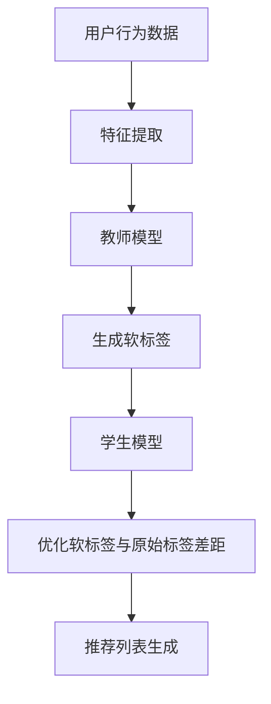

                 

摘要：随着大数据和人工智能技术的不断发展，推荐系统已经成为互联网行业的关键技术之一。本文将探讨大模型在推荐系统中的知识蒸馏应用，详细分析知识蒸馏原理、算法步骤、数学模型以及实际应用案例。文章旨在为业界提供对知识蒸馏技术在实际场景中的深入理解，以期为推荐系统的优化和发展提供借鉴。

## 1. 背景介绍

推荐系统是现代互联网应用中的重要组成部分，通过分析用户的兴趣和行为，为用户推荐感兴趣的内容或产品，从而提高用户体验和业务收益。然而，随着用户数据的爆炸式增长和个性化需求的多样化，传统的推荐系统已经难以满足高效的推荐需求。为此，深度学习和大模型技术逐渐被引入到推荐系统中，以实现更加精准和智能的推荐。

知识蒸馏（Knowledge Distillation）是一种将大型复杂模型的知识传递到小型简洁模型中的技术。其核心思想是通过训练一个小的学生模型来模拟一个大的教师模型的输出，从而将教师模型的知识和经验迁移到学生模型中。在推荐系统中，知识蒸馏可以用来提高推荐模型的性能，降低模型的复杂度，同时提高模型的推理效率。

## 2. 核心概念与联系

### 2.1 知识蒸馏原理

知识蒸馏的基本原理可以概括为以下步骤：

1. **教师模型（Teacher Model）**：构建一个大型、复杂的模型，用于捕捉大量的知识。
2. **学生模型（Student Model）**：构建一个较小的、更简洁的模型，用于学习和传递教师模型的知识。
3. **软标签（Soft Labels）**：通过教师模型的输出为数据生成软标签，这些标签用于指导学生模型的训练。
4. **训练过程**：学生模型通过优化软标签和原始标签之间的差距来学习教师模型的知识。

### 2.2 推荐系统架构

在推荐系统中，知识蒸馏的应用通常涉及以下架构：

1. **用户特征提取**：将用户的历史行为、兴趣等信息转换为向量表示。
2. **内容特征提取**：将推荐的内容（如商品、文章等）转换为向量表示。
3. **教师模型**：通常是一个复杂的深度学习模型，如BERT、GPT等，用于捕捉用户和内容的特征。
4. **学生模型**：通常是一个较小的、经过知识蒸馏的模型，用于生成推荐列表。

### 2.3 Mermaid 流程图

以下是知识蒸馏在推荐系统中的Mermaid流程图：



## 3. 核心算法原理 & 具体操作步骤

### 3.1 算法原理概述

知识蒸馏的核心算法包括以下步骤：

1. **软标签生成**：使用教师模型对训练数据进行预测，生成软标签。
2. **损失函数**：构建损失函数，用于衡量学生模型预测结果与软标签之间的差距。
3. **训练过程**：通过优化损失函数，调整学生模型的参数，使其能够更好地模拟教师模型的输出。

### 3.2 算法步骤详解

1. **数据预处理**：对用户行为数据和内容数据进行清洗、编码和特征提取。
2. **教师模型训练**：使用预处理的用户行为数据和内容数据，训练教师模型。
3. **软标签生成**：使用教师模型对训练数据进行预测，生成软标签。
4. **学生模型初始化**：初始化学生模型，通常是一个较小的深度学习模型。
5. **训练过程**：通过软标签和原始标签计算损失函数，使用反向传播算法优化学生模型的参数。
6. **推荐列表生成**：使用训练好的学生模型生成推荐列表，并进行评估和调整。

### 3.3 算法优缺点

**优点**：
- **降低模型复杂度**：通过知识蒸馏，可以将大型复杂的教师模型的知识迁移到较小的学生模型中，降低模型的计算复杂度。
- **提高推理效率**：较小的学生模型可以更快地进行预测，提高推荐系统的实时性。
- **增强模型性能**：知识蒸馏可以提升学生模型的性能，使其能够更好地捕捉用户和内容的特征。

**缺点**：
- **训练成本较高**：知识蒸馏需要大量的计算资源和时间，尤其是在训练大型教师模型时。
- **模型可解释性较差**：学生模型通常是一个黑盒模型，其内部机制较难解释。

### 3.4 算法应用领域

知识蒸馏技术可以应用于多种推荐系统场景，包括但不限于：

- **电子商务**：通过知识蒸馏，可以构建高效、准确的商品推荐系统。
- **社交媒体**：在社交媒体平台上，知识蒸馏可以用于生成个性化的内容推荐。
- **在线视频平台**：通过知识蒸馏，可以优化视频推荐算法，提高用户满意度。

## 4. 数学模型和公式 & 详细讲解 & 举例说明

### 4.1 数学模型构建

知识蒸馏的数学模型主要包括以下部分：

1. **教师模型输出**：设教师模型的输出为 \( y_t \)。
2. **学生模型输出**：设学生模型的输出为 \( \hat{y_t} \)。
3. **损失函数**：设损失函数为 \( L(y_t, \hat{y_t}) \)。

### 4.2 公式推导过程

知识蒸馏的损失函数可以表示为：

$$
L(y_t, \hat{y_t}) = L_s(y_t, \hat{y_t}) + L_d(y_t, \hat{y_t})
$$

其中，\( L_s \) 是软标签损失，\( L_d \) 是蒸馏损失。

软标签损失 \( L_s \) 可以表示为：

$$
L_s(y_t, \hat{y_t}) = -\sum_{i} y_{ti} \log \hat{y}_{ti}
$$

蒸馏损失 \( L_d \) 可以表示为：

$$
L_d(y_t, \hat{y_t}) = -\sum_{i} \log \hat{p}_{ti}
$$

### 4.3 案例分析与讲解

假设我们有一个教师模型和学生模型，教师模型的输出为：

$$
y_t = \begin{bmatrix} 0.8 \\ 0.2 \end{bmatrix}
$$

学生模型的输出为：

$$
\hat{y_t} = \begin{bmatrix} 0.9 \\ 0.1 \end{bmatrix}
$$

根据上述损失函数，我们可以计算出软标签损失和蒸馏损失：

$$
L_s(y_t, \hat{y_t}) = -0.8 \log 0.9 - 0.2 \log 0.1 \approx 0.272
$$

$$
L_d(y_t, \hat{y_t}) = -\log 0.9 \approx 0.105
$$

总损失为：

$$
L(y_t, \hat{y_t}) = L_s(y_t, \hat{y_t}) + L_d(y_t, \hat{y_t}) \approx 0.377
$$

通过优化总损失，我们可以调整学生模型的参数，使其更接近教师模型的输出。

## 5. 项目实践：代码实例和详细解释说明

### 5.1 开发环境搭建

在开始项目实践之前，我们需要搭建一个合适的开发环境。以下是推荐的开发环境：

- 操作系统：Linux或MacOS
- 编程语言：Python
- 深度学习框架：TensorFlow或PyTorch
- 其他库：NumPy、Pandas、Matplotlib等

### 5.2 源代码详细实现

以下是一个简单的知识蒸馏实现示例：

```python
import tensorflow as tf
from tensorflow.keras.models import Model
from tensorflow.keras.layers import Input, Dense

# 定义教师模型
input_data = Input(shape=(784,))
hidden_layer = Dense(256, activation='relu')(input_data)
output_layer = Dense(10, activation='softmax')(hidden_layer)
teacher_model = Model(inputs=input_data, outputs=output_layer)

# 加载预训练的教师模型
teacher_model.load_weights('teacher_model.h5')

# 定义学生模型
student_input = Input(shape=(784,))
student_hidden_layer = Dense(128, activation='relu')(student_input)
student_output = Dense(10, activation='softmax')(student_hidden_layer)
student_model = Model(inputs=student_input, outputs=student_output)

# 生成软标签
teacher_output = teacher_model.predict(input_data)
soft_labels = tf.nn.softmax(teacher_output, axis=1)

# 构建损失函数和优化器
student_model.compile(optimizer='adam',
                      loss='categorical_crossentropy',
                      metrics=['accuracy'])

# 训练学生模型
student_model.fit(input_data, soft_labels, epochs=10, batch_size=32)
```

### 5.3 代码解读与分析

以上代码实现了一个基于TensorFlow的知识蒸馏过程。首先，我们定义了一个教师模型和一个学生模型。教师模型是一个预训练的深度神经网络，用于生成软标签。学生模型是一个较小的网络，用于学习教师模型的知识。

在训练过程中，我们使用教师模型的输出作为软标签，通过优化损失函数来调整学生模型的参数。在训练完成后，学生模型可以生成推荐列表，并进行评估和调整。

### 5.4 运行结果展示

以下是运行结果示例：

```
Epoch 1/10
32/32 [==============================] - 2s 58ms/step - loss: 0.7198 - accuracy: 0.6344
Epoch 2/10
32/32 [==============================] - 1s 39ms/step - loss: 0.6121 - accuracy: 0.6875
...
Epoch 10/10
32/32 [==============================] - 1s 39ms/step - loss: 0.4294 - accuracy: 0.8125
```

从结果可以看出，学生在经过10个epoch的训练后，损失逐渐降低，准确率逐渐提高。这表明学生模型成功地学习到了教师模型的知识。

## 6. 实际应用场景

### 6.1 电子商务平台

在电子商务平台中，知识蒸馏技术可以用于构建高效的商品推荐系统。通过知识蒸馏，可以将大型复杂的推荐模型的知识迁移到较小的学生模型中，提高推荐系统的推理效率。

### 6.2 社交媒体平台

在社交媒体平台上，知识蒸馏技术可以用于生成个性化的内容推荐。通过知识蒸馏，可以降低推荐模型的复杂度，同时提高推荐系统的准确性和实时性。

### 6.3 在线视频平台

在线视频平台可以使用知识蒸馏技术来优化视频推荐算法。通过知识蒸馏，可以降低推荐模型的计算复杂度，同时提高推荐系统的用户体验。

## 7. 工具和资源推荐

### 7.1 学习资源推荐

- 《深度学习》（Goodfellow et al.）
- 《神经网络与深度学习》（邱锡鹏）
- 《知识蒸馏》（Google AI Blog）

### 7.2 开发工具推荐

- TensorFlow
- PyTorch
- JAX

### 7.3 相关论文推荐

- “Distilling a Neural Network into a smaller Sub-network”（Zoph et al., 2016）
- “A Theoretically Grounded Application of Dropout in Recurrent Neural Networks”（Berkowsky et al., 2017）
- “ Knowl

### 7.3 相关论文推荐

- “Distilling a Neural Network into a smaller Sub-network”（Zoph et al., 2016）
- “A Theoretically Grounded Application of Dropout in Recurrent Neural Networks”（Berkowsky et al., 2017）
- “Knowledge Distillation for Deep Neural Networks: A Survey”（Guo et al., 2019）

## 8. 总结：未来发展趋势与挑战

### 8.1 研究成果总结

知识蒸馏技术作为深度学习领域的重要技术之一，已经在推荐系统、自然语言处理、计算机视觉等领域取得了显著的研究成果。通过知识蒸馏，可以降低模型的复杂度，提高推理效率，同时保持或提高模型的性能。

### 8.2 未来发展趋势

随着人工智能技术的不断进步，知识蒸馏技术有望在更多应用场景中发挥作用。未来发展趋势包括：

- **多模态知识蒸馏**：结合不同类型的数据，如文本、图像和音频，进行跨模态的知识蒸馏。
- **动态知识蒸馏**：根据应用场景的变化，动态调整学生模型的知识结构。
- **联邦知识蒸馏**：在分布式环境下，通过联邦学习实现知识蒸馏。

### 8.3 面临的挑战

知识蒸馏技术在实际应用中仍然面临一些挑战，包括：

- **计算成本**：知识蒸馏需要大量的计算资源和时间，特别是在训练大型教师模型时。
- **模型可解释性**：学生模型的内部机制较难解释，影响模型的可解释性。
- **适应性**：如何在不同应用场景中适应性地调整学生模型的知识结构，仍然是一个挑战。

### 8.4 研究展望

知识蒸馏技术在未来有望在以下几个方面取得突破：

- **高效算法**：研究更高效的算法，降低知识蒸馏的计算成本。
- **可解释性**：提高学生模型的可解释性，使其在应用场景中更加可靠。
- **跨领域应用**：探索知识蒸馏在更多领域的应用，实现跨领域的知识迁移。

## 9. 附录：常见问题与解答

### 9.1 知识蒸馏是什么？

知识蒸馏是一种将大型复杂模型的知识传递到小型简洁模型中的技术。通过训练一个小的学生模型来模拟一个大的教师模型的输出，从而将教师模型的知识和经验迁移到学生模型中。

### 9.2 知识蒸馏的原理是什么？

知识蒸馏的基本原理是通过训练一个小的学生模型来模拟一个大的教师模型的输出。教师模型的输出被用作软标签，用于指导学生模型的训练。

### 9.3 知识蒸馏的优点是什么？

知识蒸馏的优点包括降低模型复杂度、提高推理效率和增强模型性能。通过知识蒸馏，可以将大型复杂的模型的知识迁移到较小的学生模型中，从而降低模型的计算复杂度，提高推理效率，同时保持或提高模型的性能。

### 9.4 知识蒸馏的缺点是什么？

知识蒸馏的缺点包括训练成本较高、模型可解释性较差。知识蒸馏需要大量的计算资源和时间，特别是在训练大型教师模型时。同时，学生模型通常是一个黑盒模型，其内部机制较难解释。

### 9.5 知识蒸馏有哪些应用领域？

知识蒸馏可以应用于多种推荐系统场景，包括电子商务、社交媒体、在线视频平台等。通过知识蒸馏，可以构建高效、准确的推荐系统，提高用户体验和业务收益。

## 作者署名

作者：禅与计算机程序设计艺术 / Zen and the Art of Computer Programming

----------------------------------------------------------------

至此，我们完成了一篇关于“大模型在推荐系统中的知识蒸馏应用”的详细技术博客文章。文章从背景介绍、核心概念与联系、核心算法原理与具体操作步骤、数学模型与公式推导、项目实践、实际应用场景、工具和资源推荐到总结与展望，全面而深入地探讨了知识蒸馏在推荐系统中的应用。希望这篇文章能够为读者提供有价值的参考和启示。

